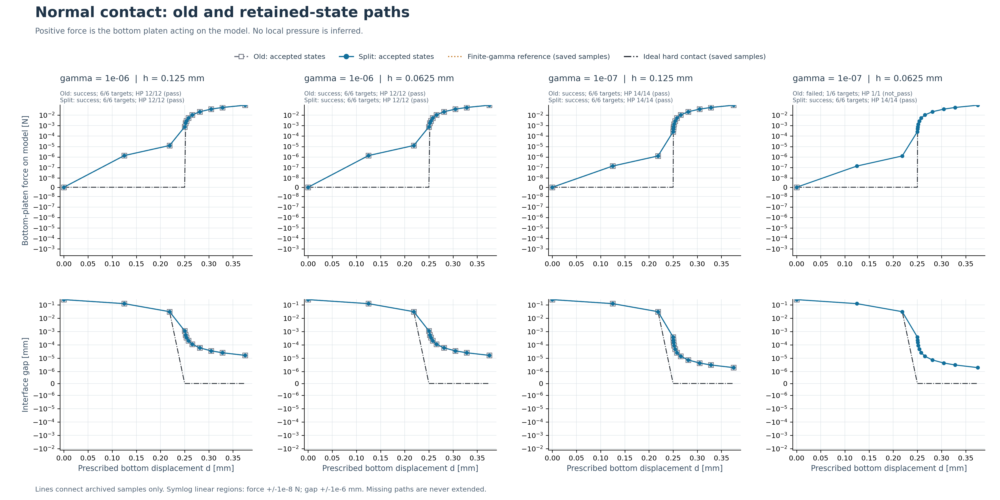
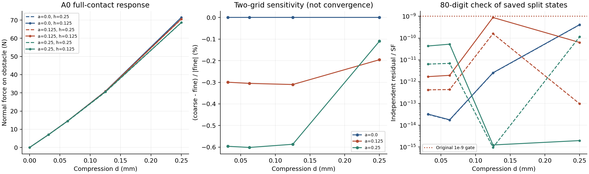

# Compliant-TO-TMC：独立 HF 力学评估器

**稳定发布仍为 0.5.0 / HF4-B；HF4-C0/C1 已通过各自门禁。HF4-C2 三条诊断路径中两条通过，细网格末态独立力误差门失败；C2 未全部验收，HF4-C 一般接触验证仍未完成。** C1 的 10 条选定路径、80 个状态通过 80/120 位独立数值审计及几何门禁；这不代表 TMC 局部单边接触已验证。本仓库保存从开始至今的目标、开发说明、代码、数据和证据，支持在任意新目录接续，不需要原 ChatGPT 对话或原 Windows 工作目录。稳定标签和 0.5.0 wheel 保持原样，新增研究模块使用主分支源码。

S0 将详细科学记录分为轻量主树与按需恢复资产；源码、测试、几何和原失败保留。恢复、验收范围与新入口见 [S0 分层报告](docs/HF4_C2_S0_STORAGE_REPORT.md)。

后续先完成 [P1 完整启动合同前置修复](docs/HF4_C2_CONSOLIDATED_REVIEW_20260921.md)，再推进稳定 F、完整内力与一致切线的无求解验证；两项目前均未完成。冻结 v3 保留原件，当前继续停止新 FE。

先读这些入口：

1. [开发上下文](docs/DEVELOPMENT_CONTEXT.md)：整体目标、为什么分阶段、历次问题与修正、已完成工作、效果和未验证范围。
2. [新电脑接续指南](docs/RESUME_DEVELOPMENT.md)：Python 3.13 环境、校验、读取、测试和新输出目录复验命令。
3. [HF4-C2 最终报告](docs/HF4_C2_FINAL_REPORT.md)与[C2 证据入口](hf4_c2_diagnostics/README.md)：当前单因素诊断和算术归因；新的公开复读限制以[搬迁补充说明](docs/HF4_C2_PORTABILITY_ADDENDUM.md)为准。
4. [HF4-C1 最终报告](docs/HF4_C1_FINAL_REPORT.md)、[C1 证据入口](hf4_c1_results/README.md)与[最终摘要](hf4_c1_results/summary_v2/summary.json)：当前配对结果、失败与修正、局部接触边界及下一步。
5. [HF4-C0 研究集成报告](docs/HF4_C0_RESEARCH_INTEGRATION.md)、[C0 接续入口](research_integration_20260920/README.md)：来源审阅、取舍和受限参照验收。
6. [0.5.0 时的项目状态](docs/PROJECT_STATUS.md)、[原需求—代码—证据对照](docs/REQUIREMENTS_TRACEABILITY.md)：保留稳定阶段当时的记录。

## 目标与边界

LF 生成多样化反向器/夹持器几何；HF 在共同、明确的物理任务下独立进行正向力学评价。HF 包不导入 LF、不需要 MATLAB，不包含拓扑优化更新。数据可读、几何资格、求解收敛、模型精度与机构功能分别评价。真实候选资格、一般部分接触与释放、圆柱、稳定性、参数敏感性与最终排名仍待验证。

0.5.0 修正使用 `u_lift` 与 `u_fluctuation` 两个数组保存权威位移，解除已观察的绝对位移更新舍入平台；`u_display` 只作显示。旧物理合同与验收门槛没有改变。以下是稳定发布的历史验收：

- 四条路径均完成 6/6 原目标，52 个完整路径状态通过独立 HP；另有 2 个首目标试运行状态。
- 两次测试去重 604 通过、1 跳过；独立安装验收 73 项通过。
- [HF4 修正完整报告与五张图](docs/HF4_REPAIR_REPORT.md)、[机器可读验收](hf4_repair_results/acceptance_summary.json)、[实现说明](hf_repo/docs/HF4_SPLIT_IMPLEMENTATION.md)。



## 2026-09-20 实验扩展：HF4-C0

新增实体—矩形障碍交面积诊断、严格有效前缀，以及已闭合全接触 A0 参照任务。6 条均匀/非均匀路径、30 个接受态通过 620 项独立数值门和 30 次几何检查；独立有理数几何对照 288/288 通过，新增测试 72/72 通过。首次零接受态的 JAX 配置失败完整保留。

这只验收受限的已闭合分支，没有实现一般主动集或完成 A0/TMC 同任务比较。两网格力差还包含二次底面 profile 的 Q1 边界插值差，离散平均为 `1−a·h²/2`；本轮 `kr=0`，非零 Hu 不构成 HuHu 正则项验收。完整物理合同、原始数据和下一步见[研究报告](docs/HF4_C0_RESEARCH_INTEGRATION.md)与[权威摘要](research_integration_20260920/summary_final/admission_summary.json)。



## HF4-C1：正间隙配对路径与分项诊断

按[冻结协议](docs/HF4_C1_PROTOCOL.md)，先完成 A0/TMC 两网格的四条均匀路径及独立门禁，再完成 A0/Aalpha/TMC 两网格的六条非均匀扰动路径。10 条选定路径共 80 个存盘状态（均匀 50、非均匀 30）通过 80/120 位独立审计与几何检查；选定范围内共有 2516 项独立检查通过，相关测试 173 项通过。状态计数包含阶段起点及插入态，不是 80 个不同物理加载量。

首次 A0 激活失败留下的四个接受态另作为有效前缀保存，该 run 仍不通过。把它们加入历史范围后共有 84 个存盘状态、2644 项独立检查通过；**这一范围包含上述 80 态/2516 项，不能相加或把旧前缀计作第 11 条已准入路径**。最终比较按[选定路径清单](hf4_c1_results/selection_v1.json)去重，详见[权威摘要](hf4_c1_results/summary_v2/summary.json)。

两项修正均保留因果证据：[激活修正](docs/HF4_C1_ACTIVATION_REPAIR.md)只在新增固定自由度上显式移除不超过既定上限的微小 fluctuation；[精度补充](docs/HF4_C1_PRECISION_AUDIT.md)保留原 50/80 位失败审计，统一以 80/120 位核对相同存盘状态，80 位仍为测量权威，物理参数与验收门槛不变。重读当前证据必须显式使用精度补充协议。

已完成[四个 TMC 末态的局部节点反力分项诊断](hf4_c1_results/local_reaction_diagnostic.json)，并保存[分项与正负抵消图](hf4_c1_results/local_reaction_diagnostic.png)。四态的 18 个负节点均位于初始实体 x 跨度 [0,2] 之外；这是参考位置分类，不是实际接触区判定。**节点反力不等同于接触压力，负节点项不能单独证明接触压力失效；净合力吻合也不能证明局部单边接触条件成立。**

C1 结束时提出的保存场材料牵引、正则边界贡献与虚功检查，以及外区边界/网格单因素诊断，已由下面的 C2 工作承接；一般部分接触参考仍待依据因果证据定义，不直接进入 HF5 或候选排名。两网格只支持敏感性观察，TMC−Aalpha 还含背景介质、边界及非线性耦合差异。

## HF4-C2：保存场解释与三条单因素诊断

**C2 仅部分通过，细网格路径仍未验收。** 三次新 FE 尝试均求解至 `d=0.5 mm`，但只有扩大背景侧向 padding 至 2.5 mm 和释放外底边的两条完整路径通过独立审计，分别为 19 态/589 项和 19 态/570 项检查。`h=0.0625 mm` 细网格路径为 `NOT_PASS`：末态 `d=0.5 mm` 的 `production_vs_hp80_total_force = 1.0943792164e-11`，超过冻结门槛 `1e-11`。该路径共 21 态，20 态通过，651 项检查中 650 项通过；有效前缀止于 `d=0.4375 mm`，覆盖 6/7 原目标，不能把求解器到达末目标写成完整独立验收。

三次尝试共保存 59 态，其中 58 态通过；1810 项独立检查中 1809 项通过。这些总数包含上述两条完整路径和细网格前缀，不可再次相加。已停止全部后续 FE；保留失败末态、原审计及所有回执。固定保存场的分段算术对照已定位主要误差来源，但新内核与一致切线尚未实现或验收，细网格仍为 `not_pass`。详见[最终报告](docs/HF4_C2_FINAL_REPORT.md)与[路径/有效前缀摘要](hf4_c2_diagnostics/summary_001/summary.json)。

实际执行使用 [contact_c2_v3.json](hf_repo/configs/contact_c2_v3.json)。v1/v2 未执行新 FE；来源清单校验和外部继续门修订见[C2 证据入口](hf4_c2_diagnostics/README.md)及[执行门审查](docs/HF4_C2_EXECUTION_GUARD_REVIEW.md)。最终执行前测试为 103 项通过，另有 17 项汇总回归通过；两组分别报告，不能与历史重复执行的 62/94 项预检直接累加。

[公式审查](docs/HF4_C2_FORMULATION_REVIEW.md)和[预先判读规则](docs/HF4_C2_INTERPRETATION_RULES.md)区分弱式节点反力、直接材料牵引、正则项与固定参考试函数的离散虚功。四个 C1 保存末态的 144 条顶边材料压缩证据与 18 个负弱节点项可以同时成立；不裁剪负项，不把材料边积分替换成原 `normal_force`。背景域、外底边约束与网格的单因素变化只能支持对应敏感性观察，三网格本身不构成连续体收敛证明。

新增两条已通过边界路径的[保存场诊断](hf4_c2_diagnostics/fields_experiments_001/summary.json)和[解析边积分](hf4_c2_diagnostics/analytic_experiments_001/summary.json)分别通过 206 项与 22 项检查。扩大域有 56/56 条顶边材料压缩证据；外底边自由时只有 44/48 条满足整边压缩条件，远端出现真实的保存场材料名义拉应力。因此不能把原四态 144/144 条整边压缩推广到新边界，也不能把材料名义应力直接称为已验证接触压力。

细网格固定失败态的原生产总力已位级复现。[分段精度诊断](hf4_c2_diagnostics/force_precision_001/summary.json)表明：保留生产 F，只提高后续本构/装配精度，规范化总力误差仍约 `1.09438e-11`；改用精确 split F 的正确 binary64 舍入后，同一诊断路径的误差降至约 `6.28152e-16`。主差来自强压缩背景单元的 F 浮点求和。此结果只是固定场算术归因，没有部署新 kernel、核验其一致切线或求解新路径。下一步按[稳定可微运动学修复计划（未执行）](docs/HF4_C2_KINEMATICS_REPAIR_PLAN.md)，先实现并独立验证稳定 F、完整力和一致切线，再决定新版本与补测路径；保留原门槛与所有失败证据。

[独立最终复核](hf4_c2_diagnostics/independent_final_review.json)核对了 420 个来源文件、93 个存盘状态（59 个新增及 34 个基线）、71,000 个单元和 558 次分项重算，证据完整性为 `pass`，力学状态仍为 `partial`。该复核重用已保存 HP 本构结果，没有重新计算全部本构状态，也不覆盖细网格的唯一失败门。[算术归因图](hf4_c2_diagnostics/force_precision_visual_001/force_precision_attribution.png)概括固定场定位结果。

另保留了历史汇总清单的自引用缺陷，见[存储清单补充](hf4_c2_diagnostics/summary_manifest_amendment_001/amendment.json)及[独立补充复核](hf4_c2_diagnostics/summary_manifest_review.json)；科学数值和原文件未改。后续生成使用 [summarize_contact_c2_r2.py](hf_repo/scripts/summarize_contact_c2_r2.py)，其 2 项存储测试与 103 项预检、17 项汇总测试分别计数。

交接复核又发现并保留了一次来源门失败：冻结 v3 完整审计依赖两份未公开的 MATLAB 编号源码，仅克隆仓库无法重新验证这一完整历史来源链。公开数值重审使用新增 `audit_contact_c2_readback.py`，明确列出未重新核验的两项来源，其余代码、数值输入、控制器和逐态门槛继续严格校验；其结果不能作为新 FE 执行准入。详见[搬迁审计补充说明](docs/HF4_C2_PORTABILITY_ADDENDUM.md)与[新电脑接续指南](docs/RESUME_DEVELOPMENT.md)。旧完整审计、原失败和科学数值全部保留。 公开副本的同机异目录数值复读已完成：padding 的 19 态与细网格的 21 态，共 40 份科学详情逐字节保持一致，原通过/不通过结论不变。 部分历史汇总与固定场诊断脚本仍要求完整外部来源；新增入口不代表这些历史工具已全部解除依赖。

读回必须在保持完整相对结构的**独立复制树**中进行：新旧 C2 入口都会在输入 run 内写入新的逐态详情目录，不能直接对冻结原树执行。同一主机异目录读回不等于跨平台验收。稳定 tag、附件及 0.5.0 wheel 保持原样，旧 wheel 不含 C2 模块。

## 文件位置与历史

| 位置 | 内容 |
|---|---|
| `hf_repo/` | 独立 Python 包、配置、测试、开发审计与依赖锁；[包说明](hf_repo/README.md) |
| `geometry_dataset/` | 395 个普通几何/来源文件，包含两例规范输入；[数据索引](geometry_dataset/dataset_index.json) |
| `docs/` | HF0 至今的计划、核查、报告、原因分析、当前状态和接续指南 |
| `research_integration_20260920/` | LF/N19 来源审阅与取舍、本轮 7 次尝试和 6 份独立审计、最终图表与机器可读摘要；[本轮入口](research_integration_20260920/README.md) |
| `hf4_c1_results/` | C1 的 10 条选定路径、旧激活失败前缀、原 50/80 失败与 80/120 补充审计、诊断、测试及最终比较；[入口](hf4_c1_results/README.md) |
| `hf4_c2_diagnostics/` | C2 保存场/解析边积分诊断、unused v1/v2 与执行 v3、全部修订/失败记录、三条路径及逐态独立审计；[入口](hf4_c2_diagnostics/README.md) |
| `hf1_results/`、`hf4_results/`、`hf4_repair_results/` | 主树保留摘要和图；大审计/探针详情按资产索引恢复，旧失败和新版结果均保留 |
| `hf2_results/`、`hf2_repair_results/`、`hf3_results/` | 摘要、图表、门禁、日志、测试及脚本；大数组/大 HP JSON 从 Release 恢复 |
| `reference_validation/`、`hf0_audit/` | 已生成数值参考、资料身份、独立核查及历史过程；不是 HF 运行依赖 |
| `reference_inputs/hf_start_brief.txt` | 原用户启动任务书，作为历史背景保存 |
| `tools/handoff.py`、`handoff/` | 跨目录校验、环境/几何读取记录、证据下载和逐文件清单 |

原七次 Git 开发提交全部保留。科学基线为 `b1334bb6a83ba9a0efab7bdba7bd39722146f024`；原提交的 HF 代码位于 Git 根，新交接提交将其移至 `hf_repo/`，随后加入外层文档和证据，不改写原提交身份。

阶段阅读顺序：[HF0](docs/HF0_REPORT.md) → [HF1](docs/HF1_REPORT.md) → [HF2 原版](docs/HF2_REPORT.md) → [HF2 修正](docs/HF2_REPAIR_REPORT.md) → [HF3](docs/HF3_REPORT.md) → [HF4 原版](docs/HF4_AB_REPORT.md) → [HF4 修正](docs/HF4_REPAIR_REPORT.md) → [HF4-C0 研究集成](docs/HF4_C0_RESEARCH_INTEGRATION.md) → [HF4-C1](docs/HF4_C1_FINAL_REPORT.md) → [HF4-C2](docs/HF4_C2_FINAL_REPORT.md)。旧报告中的“部分完成/未开始”保留其当时事实，最新进度看本页和 C2 最终报告。

## 快速取得与恢复

```text
git clone https://github.com/dudaxing/Compliant-TO-TMC.git my-hf-work
cd my-hf-work
python tools/handoff.py verify
```

校验仅需 Python 标准库。后续安装按照[接续指南](docs/RESUME_DEVELOPMENT.md)，不要照抄历史 `.venv`、临时目录或累计预算脚本。开发修改后清单会如实报告变化；应使用 Git 记录修改，为新数值实验另建源码冻结和输出。

完整早期原始证据及原样 0.5.0 交付 ZIP 保留在 [历史 Release](https://github.com/dudaxing/Compliant-TO-TMC/releases/tag/hf-history-0.5.0)；C0/C1/C2 与历史 HF4 详细记录在 [S0 证据 Release](https://github.com/dudaxing/Compliant-TO-TMC/releases/tag/hf4-c2-s0-evidence-v1)。以下恢复全部声明资产：

```text
python tools/handoff.py fetch-evidence
python tools/handoff.py verify --full
```

下载会校验附件和每个成员，并拒绝覆盖不同的已有文件。原论文、原 MATLAB/LF 源包不作为公开附件；资料身份、取得方式、旧 ZIP 链接和许可核查见[来源与发布说明](docs/SOURCE_MATERIALS_AND_PUBLICATION.md)。已有源路径只作来源记录。迁移校验不等同于新平台力学验收。

只准备 C2 独立复读树（自动恢复 C1 来源依赖）可运行：

```text
python tools/handoff.py prepare-replay --destination ../hf-c2-readback-001 --asset hf4-c2-s0-c2_runs-v1.zip
python ../hf-c2-readback-001/tools/handoff.py verify --asset hf4-c2-s0-c2_runs-v1.zip
```

`verify` 默认仅检查轻量主树；`verify --full` 要求全部声明资产，缺资产不会通过。准备目录不启动力学计算。
