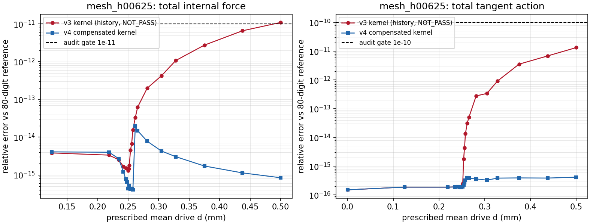

# Compliant-TO-TMC：独立 HF 力学评估器

本项目为 LF/N4 的多样化机构研究提供独立、任务明确、可审计的 HF 正向力学评价。HF 不导入 LF、不依赖 MATLAB，也不执行拓扑优化更新；通过普通文件接入候选几何，再分别判断数据契约、几何资格、数值精度、接触物理和机构功能。研究层复用已有 N4 的选择、计分与统计方法，接入前核对任务、模型、有效前缀和来源身份。

**当前主干包含 S0、P1、稳定 F 候选验证、v4 单条细网格补测和独立复核。v4 为 21/21 状态、651/651 检查、7/7 原目标通过；稳定 F 制造场仍为 30/33 通过。v3 原失败永久保留，默认内核未切换，HF5 尚未实施，一般接触验证未完成。** 当前结论见 [CURRENT_STATUS](docs/CURRENT_STATUS.md)，不要将历史报告中的“尚未实现”当作当前待办，也不要将 v4 单路径通过扩大为整个 HF 后端准入。

后续开发统一在本仓库的 **main** 上进行，`origin` 固定为 `https://github.com/dudaxing/Compliant-TO-TMC.git`。本机正式开发根为 `D:/Coding/Diversity TO/Compliant-Nonlinear-TMC-O/.github_handoff/Compliant-TO-TMC`；其内部 `hf_repo/` 是源码。外层旧 `Compliant-Nonlinear-TMC-O/hf_repo/` 保留为历史工作区，不再作为并行开发或推送入口。其他机器可克隆到任意目录。

## 开始阅读

1. [当前状态](docs/CURRENT_STATUS.md)：目标、已完成工作、效果、仍未通过的门和下一步范围。
2. [开发流程](docs/DEVELOPMENT_WORKFLOW.md)：唯一 main、代码与证据身份、文档与提交规则。
3. [新电脑接续](docs/RESUME_DEVELOPMENT.md)：Python 3.13 环境、分层证据恢复、独立复读与历史接口边界。
4. [主干整合报告](docs/MAIN_CONSOLIDATION_REPORT_20260927.md)：本轮实际验证、资产发布与分支清理；[原方案](docs/MAIN_CONSOLIDATION_PLAN_20260927.md)保留取舍依据。
5. [开发上下文](docs/DEVELOPMENT_CONTEXT.md)：历次目标、问题和修正；具体阶段报告保持当时记录。

## 当前证据与范围

| 阶段 | 已有结果 | 解释与入口 |
|---|---|---|
| 稳定 0.5.0 / HF4-B | 四条路径完成 6/6 原目标，52 个完整路径状态通过独立 HP；另有两态首目标试运行 | [修正报告](docs/HF4_REPAIR_REPORT.md)。稳定标签和 wheel 不变，wheel 不含后续研究模块 |
| HF4-C0 | 6 条受限全接触参照路径、30 态通过对应门禁 | [研究集成报告](docs/HF4_C0_RESEARCH_INTEGRATION.md)。不代表一般主动集已实现 |
| HF4-C1 | 10 条选定路径、80 态、2516 项独立检查通过 | [C1 最终报告](docs/HF4_C1_FINAL_REPORT.md)。旧失败四态前缀另存，不能重复累计 |
| HF4-C2 v3 | padding 和 outer-free 两条通过；细网格 20/21 态通过，末态完整力门失败 | [v3 最终报告](docs/HF4_C2_FINAL_REPORT.md)。59 态中 58 态通过，1810 项中 1809 项通过；原 `NOT_PASS` 不变 |
| S0 / P1 | 详细证据分层；新入口前置完整启动合同 | [S0 报告](docs/HF4_C2_S0_STORAGE_REPORT.md)、[P1 实现与验收](docs/HF4_C2_P1_IMPLEMENTATION_AND_VALIDATION.md)。不改写冻结 v3 |
| 稳定 F 候选 | 保存态 63/63 通过；制造场 30/33 通过 | [候选报告](docs/HF4_C2_P1_AND_STABLE_F_REPORT.md)、[近旋转解释勘误](docs/HF4_C2_NEAR_ROTATION_SCOPE_NOTE_20260927.md)。三个近旋转场仍未通过完整力门 |
| 独立复核 | 28 项算术测试、33 个制造场与选定 8 态复算；增强 C1/C2 来源绑定 | [独立复核报告](docs/HF4_C2_INDEPENDENT_RECHECK_REPORT_20260927.md)。8 态与上述 63 态重叠，不能相加 |
| HF4-C2 v4 | 原失败细网格任务单独补测，21/21 态、651/651 检查、7/7 原目标通过 | [v4 补测报告](docs/HF4_C2_V4_RETEST_REPORT.md)。单路径额度已用完，不自动授权重跑或其他任务 |

节点反力不等于接触压力，净合力对账不能证明局部单边条件；材料边积分也不能替换原弱式合力。三套网格只支持已有敏感性观察，不构成连续体收敛证明。完整制造场未通过与 v4 单任务通过是同时成立的两个结论。



## 克隆、校验与恢复

```text
git clone https://github.com/dudaxing/Compliant-TO-TMC.git my-hf-work
cd my-hf-work
git switch main
python tools/handoff.py verify
```

默认校验轻量主树。恢复所有声明资产后，再核验完整文件集：

```text
python tools/handoff.py fetch-evidence
python tools/handoff.py verify --full
```

证据分为 [0.5.0 历史 Release](https://github.com/dudaxing/Compliant-TO-TMC/releases/tag/hf-history-0.5.0)、[S0 Release](https://github.com/dudaxing/Compliant-TO-TMC/releases/tag/hf4-c2-s0-evidence-v1) 和本轮接入的 [后续证据 Release](https://github.com/dudaxing/Compliant-TO-TMC/releases/tag/hf4-c2-followup-evidence-v1)。后者包含稳定 F 保存输出和 v4 大载荷，使用同一 `fetch-evidence` / `verify` 接口；上传与异目录恢复结果以[本轮整合报告](docs/MAIN_CONSOLIDATION_REPORT_20260927.md)为准。

只恢复后续两类证据：

```text
python tools/handoff.py fetch-evidence --asset hf4-c2-stable-f-saved-production-arrays-v1.zip --asset hf4-c2-v4-mesh_h00625_v4-payloads-v1.zip
python tools/handoff.py verify --asset hf4-c2-stable-f-saved-production-arrays-v1.zip --asset hf4-c2-v4-mesh_h00625_v4-payloads-v1.zip
```

工具按资产与成员哈希校验并拒绝覆盖不同字节的文件。原论文、MATLAB/LF 源包不作为公开附件；来源身份及边界见[来源与发布说明](docs/SOURCE_MATERIALS_AND_PUBLICATION.md)。公开 v3 数值复读只允许[搬迁补充说明](docs/HF4_C2_PORTABILITY_ADDENDUM.md)声明的两项外部来源例外，不构成完整来源或新 FE 准入。

审计可能向输入 run 写入新的逐态详情。先按[接续指南](docs/RESUME_DEVELOPMENT.md)建立独立恢复/复读树，不能在冻结证据上原地重跑。恢复、校验、同机异目录复读与跨平台力学验收分别记录。

## 文件位置与历史

| 位置 | 内容 |
|---|---|
| `hf_repo/` | 独立 Python 包、配置、测试、依赖锁与开发审计 |
| `geometry_dataset/` | 395 个几何及来源文件，含两例规范输入 |
| `docs/` | HF0 至今的计划、报告、因果说明、当前状态与接续入口 |
| `research_integration_20260920/` | LF/N19 研究取舍、C0 证据及外部审阅 |
| `hf4_c1_results/`、`hf4_c2_diagnostics/` | C1/v3 摘要、失败与修订记录；详细证据按资产索引恢复 |
| `hf4_c2_p1_validation/`、`hf4_c2_stable_f_validation/` | P1 与候选无求解验证 |
| `hf4_c2_independent_recheck_20260927/` | 独立复核、来源绑定修正、三个近旋转失败的数组和图 |
| `hf4_c2_v4_results/` | v4 唯一补测路径、对照、守卫与存储证据 |
| `hf1_results/` 至 `hf4_repair_results/` | 历史阶段原结果、修正及失败；详细文件分层保存 |
| `tools/handoff.py`、`handoff/` | 跨目录校验、版本化资产索引、恢复工具与整合证据 |

原始科学基线为 `b1334bb6a83ba9a0efab7bdba7bd39722146f024`，稳定标签为 `hf-history-0.5.0`。合并保留开发提交、运行原件及旧清单；删除已合入分支指针不会删除 main 中的祖先提交。历史报告中的分支名、盘符、“未实现”及“待合并”描述保留其当时语境，最新开发入口始终是 [CURRENT_STATUS](docs/CURRENT_STATUS.md)。
