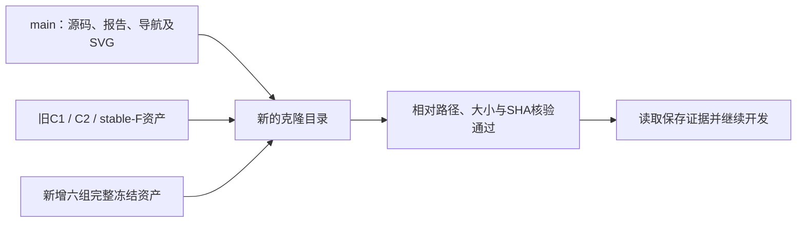

# 2026-09-30 开发与冻结证据移交

用户要求提交推送并继续，后续只在 main 开发，origin 保持 `https://github.com/dudaxing/Compliant-TO-TMC.git`。交付前本地与远端基线均为 `18f1f62b50f18c4866c2e1fa83bbaebc5d13e5d7`；本次新增科学执行窗口为零。发布及异目录恢复已完成，终态回执见末节。工作跨至韩国时间2026-10-01；回执采用 UTC，目录日期保留任务开始身份。

## 目标与开发状态

整体目标是建立与 LF 解耦、可复核和可异机接续的 HF 正向力学评估器。LF/N4 负责研究层候选和统计，HF 通过普通几何文件独立输出可信的力学结果。当前工作先解决近旋转算术精度、编译/AD 合同、完整 force 同步与内部成本观测，避免把局部通过或不完整结果当作 HF 标签。

从开始至今的历史入口为 [项目目标](PROJECT_STATUS.md)、[当前状态](CURRENT_STATUS.md)、[近旋转诊断](HF4_C2_NEAR_ROTATION_DIAGNOSTIC_20260928.md)、[候选算术](HF4_C2_INVARIANTS_HU_ARITHMETIC.md)、[连续执行与修正报告](HF4_C2_S0_PREPARATION_RESULT_20260928.md)。最后一份逐卡记录目标、理由、代码/输入身份、实际步骤、资源、停止原因、效果及资格限制；原报告和失败目录均保留。最新只读排查及候选下一卡见 [后续审阅](F_STREAM1_READONLY_FOLLOWUP_20260930.md)。

已取得近旋转分段诊断、有限候选算术、H1/C1 局部 JIT/AD 修订、SUP2 清理合同、R1 局部结构等价及 CPU/IR/native 保存证据。F-STREAM1 唯一窗口以 `event_count_limit`／`execution_failure`／`partial` 关闭，完整 EOF／CRC／JSON 尚未验证。完整 force、完整 AD、一般接触、HF5 及最终项目目标仍未完成；默认内核未切换。文件恢复与上传不会改变这些结论。

## 为什么分层交付

18 个新增冻结根共有 **3,599 文件、912,107,444 bytes**。其中有必须保留的 12 个 `.pyd` 快照及超过普通 Windows 路径长度的文件；单用默认 `git add -A` 会遗漏它们。沿用仓库的版本化 Release 方式，完整冻结根无损打包，Git 保留顶层回执/映射/SVG、源码、测试、文档及统一恢复索引。原字节、历史 manifest 和失败状态不变，不把重复快照大载荷全部塞入主树。

六资产发布标签为 `hf4-c2-development-evidence-20260930-v1`：

| 组 | 冻结内容 |
|---|---|
| arithmetic | 近旋转、invariants/Hu、S0 准备、JIT/AD |
| supervision | F-OBS、CPU、S1、PID1、CLEAN1、CPU-OBS |
| reuse | R1 两次有限候选及完整力等待 |
| cost-trace | 成本诊断及首次微图采集 |
| native | PATH1 接口及 TRACE2 两原 native 文件 |
| readers | BYTES1 与 STREAM1 有界读取/普查 |

每资产包含全部原相对路径、大小和 SHA256，见 [统一索引](../handoff/evidence_assets.json)及[打包回执](../handoff/development_20260930/packaging_receipt.json)。六组按来源顺序声明依赖，首组恢复原 stable-F/C2/C1 保存输入；最后一组自动包括前五组。原十三资产不改。每个 ZIP 成员实际读回核 SHA，并再次核原文件；此过程只解压交付 ZIP，不解码里面的 native gzip，不运行力学或 HP。

本次不分发原论文 PDF、教育 MATLAB 源码或旧上传 ZIP。冻结记录里的原用户/机器/路径是历史来源，保留原样；另机不需要仿造这些目录。历史外部 MATLAB 来源限制继续按[恢复说明](RESUME_DEVELOPMENT.md)明确。LF10 原上传 ZIP 也未随本次公开分发：81,618,414 bytes，SHA256 `79c44fbf2570651539137d74299714823c8046d13efd9c3bad6eb32bc389745e`。未来 HF5 需另取得该来源；已交付 grid inventory 是元数据，不能替代全部1800例原数据。当前只读排查不依赖它。

## 在另一台机器接续

从任意新目录克隆，Windows 开启 Git 长路径；先读当前状态。完整恢复全部历史证据使用 `fetch-evidence` 无筛选；只恢复本轮及其声明依赖可执行：

```text
git clone https://github.com/dudaxing/Compliant-TO-TMC.git my-hf-work
cd my-hf-work
git config core.longpaths true
python tools/handoff.py verify
python tools/handoff.py fetch-evidence --asset hf4-c2-development-readers-20260930-v1.zip
python tools/handoff.py verify --asset hf4-c2-development-readers-20260930-v1.zip
```

Python 3.13 的标准库即可做文件交付校验；安装数值环境和有范围的开发回归按 [RESUME_DEVELOPMENT](RESUME_DEVELOPMENT.md)。需要独立副本用 `prepare-replay --destination <新目录> --asset hf4-c2-development-readers-20260930-v1.zip`。不要直接在冻结证据上运行会写输出的审计。

原实验 runner 锁定原机路径、runtime pins、来源身份及关闭卡的期限。恢复证据用于读取与继续开发，不自动授权复跑；不修改旧 pins 来让旧卡在新路径通过。当前继续范围是已保存小 JSON、样本、源码 AST 与原归因规则的只读诊断。新的 gzip 扫描、提高事件界或 profiler 采集需先明确新卡，旧额度不续用。

## 交付验收记录

首提交 `ca451191814d2ed11f4b7d370fef60e4e27130b0` 已推送至 origin/main，`git ls-remote` 实测同一尖端。六资产共 314,342,318 bytes，已发布至 [本轮 Release](https://github.com/dudaxing/Compliant-TO-TMC/releases/tag/hf4-c2-development-evidence-20260930-v1)，服务器 SHA256 全匹配；另一次无认证公开 API 检查确认六个正式 tag 下载 URL、大小和 digest 与统一索引一致。见[发布回执](../handoff/development_20260930/publication_receipt_001.json)与[正式公开元数据核验](../handoff/development_20260930/published_public_metadata.json)。上传时 draft 返回的 untagged URL 保留在原回执，恢复使用统一索引及公开元数据里的正式 tag URL；后续发布器已增加发布后 URL 核对。

轻量清单 3,833 项已实际核验通过；首次 45 项移交工具测试全部通过。独立审阅逐件核对六 ZIP 与原 3,599 文件、旧十三资产及九项依赖闭包通过。Windows 普通路径读取最深379字符文件实际出现 WinError3；本次修复当前移交工具的 extended path I/O，双侧解析保持根目录边界，短路径接口保持。另加真实长路径恢复、验证及不同内容拒绝覆盖测试，移交测试 **47/47 通过**。详见[存储核验记录](../handoff/development_20260930/storage_checks.json)。历史工具及冻结根未修改。

长路径修复、发布回执与正式 URL 验证已在第二提交 `86c020117606f731ef69e9b7387af52dd8467b9a` 推送。实际独立克隆至 `D:/hf-restore-20260930`，先取得首提交再从网络 fast-forward 至第二提交；恢复命令使用公开 URL、无认证、无 `--from-dir`，没有使用作者本地 ZIP。

首次新缓存下载已通过三个旧依赖；arithmetic 包在 229,704,832 bytes 提前结束，缺 24,031 bytes，大小/SHA 门正确拒绝解压。原 `.partial` 和[失败回执](../handoff/development_20260930/public_recovery_attempt_001.json)保留。在另一新缓存复制已验证的公开依赖和原下载前缀，以一次公开 HTTP 206 精确 Range 响应取得缺失尾部；完整 229,728,863 bytes／SHA 与统一索引及服务器 digest 相同，原失败前缀未修改。见 [Range 核验](../handoff/development_20260930/public_range_recovery_002.json)。该步骤只补交付 ZIP 的网络传输，不读取 native gzip 正文，不重开或重试科学执行卡。

第二次正式恢复成功，余下五组均从公共服务器下载并逐成员核验；[恢复回执](../handoff/development_20260930/public_restore_receipt_002.json)和[复核回执](../handoff/development_20260930/public_restore_verify_002.json)均为 `pass`。实际核对 **3,836 Git 清单项和九资产 4,113 个成员**；这些是两类文件身份计数，导航文件在两者中重叠，不能相加为唯一文件或科学覆盖。本轮18根／3,599成员全部恢复，12 `.pyd`、379字符最深路径及 micro_trace_002 两原 native 文件另有[实际布局核验](../handoff/development_20260930/public_restore_layout_check.json)。未执行 FE／HP、未加载这些 `.pyd`、未解码 native gzip／XPlane，原五资格和失败结论保持。



这证明同一 Windows 主机上新克隆、不同目录的公开字节恢复可行；跨 CPU／平台的数值结论仍需新环境及有范围的新验证。F-SELECT1 具体提案已保存且已向用户请求新卡授权，尚未执行；旧卡额度不续用。最终验收文档/回执另提交至 main，Release 固定指向首交付提交，证据索引和冻结字节保持同一身份。
