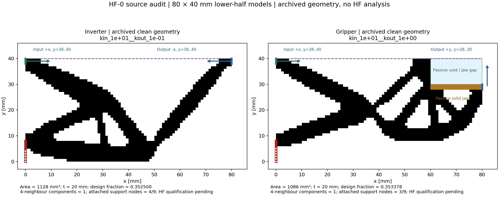

# HF-0 状态与实施建议

核查日期：2026-09-13。本报告记录 HF-0 完成时的历史状态；后续授权的 HF-1 已完成，最新结果见 [HF-1 完成报告](HF1_REPORT.md)。

HF-0 阶段结束时：HF 生产求解器尚未实现，LF 断开运行验收尚未执行；当时建议授权 HF-1。

这项工作有足够的输入资料可以开始：当前 LF 快照已有真实反向器/夹持器终态及二值几何，上传 MATLAB 代码已有独立 TMC 正向分析入口，本机可运行 MATLAB 与 Python CPU 数值探针。近期重点是先把两份真实几何和物理接口独立出来，再对账指定版本的 TMC 残差、切线与 C-shape 基准。

本轮范围来自本次粘贴任务书最后一节“现在请先完成 HF-0”。关联对话、旧 LF 合同和论文仅用于理解背景与核查物理语义；没有继承旧阶段授权，也没有执行附件中的优化脚本。原始上传文件未修改。工作目录开始时为空，本轮创建的是文档和 `hf0_audit/` 审查副本/小探针，不是已经搭好的 HF 仓库。

## 交付入口

|文件|用途|
|---|---|
|[数据契约草案](DATA_CONTRACT_DRAFT.md)|四类对象、二值权威数组、物理坐标/端口、资格与结果状态、可搬迁边界|
|[HF-1 详细计划](HF1_PLAN.md)|下一阶段的具体输入、允许改动、诊断任务、测试、图示、算力和停止条件|
|[LF 快照核查](LF_SNAPSHOT_AUDIT.md)|本次快照的候选/资产/引用追踪、真实样本映射与缺失字段|
|[MATLAB 源码核查](TMC_SOURCE_AUDIT.md)|实际函数/行号、数值语义和已执行的小型 MATLAB 探针|
|[论文公式核查](PAPER_FORMULATION_AUDIT.md)|两篇论文的差别、页面/公式位置、正文/附录/代码冲突与来源|

原资料大小和 SHA256 见 `hf0_audit/environment/source_inventory.json`；小型实际运行证据分别位于 `hf0_audit/environment/` 与 `hf0_audit/tmc/`。LF 审查没有导入或执行 dmftd，也没有重新优化。

## 1. 当前 LF 快照确实提供了什么

实际检查的是用户本次指定的 `Diversity-TO-Compliant-O-main (6).zip`，不是相邻旧仓库。ZIP SHA256 为 `c37da0d7c631c84f3cd353997d7539fa60275607183a45b7c91f574091d5d4b0`。

|对象|本次快照的实际数量/内容|解释|
|---|---|---|
|六份 `final_densities.npz`|243 个来源记录：反向器25扫描+9细化+105生成轴；夹持器25+9+70|其中25条标为 baseline replay；密度字节身份分组218。不能把243称为本轮独立新优化次数，也不能用字节去重抹掉生成成本。|
|独立 `geometry.npz` / `outline.json`|各58份；旧提取44份，v2新增14份|另有生成轴 NPZ 内 clean 数组，不能只存独立文件这一部分。|
|交接 v1|10个反向器+6个夹持器|旧16个集合仍留档。|
|最新交接 v2|18个反向器+12个夹持器，共30个|混合引用旧提取区与新生成轴导出区，不能只复制顶层清单。|
|候选数据引用核查|340条严格数据引用均解析到文件及必要数组键|泛 JSON 中还含旧 milestones、临时输出和历史绝对路径；不等于340条交接数据有缺失，也不能让 HF 运行去访问它们。|
|额外固定参考|独立 gripper 终态、AuTO 参考终态、M4 固定密度样本|单列保留，未强行混入六份主归档统计。|

本次包内已有生成轴结果和 `third_party/AuTO_frozen/models/utilfuncs.py`。旧对话曾对其他快照报告“生成轴结果缺失”“AuTO 缺失”，不能照搬到本轮。已有普通数组和记录足以开始交接，无需重跑 LF 优化或修复旧优化器。

58份几何中包含8个 clean 全空的诊断记录，另有1个非空但四邻接传力路径断开的记录：`inverter__p2__kin_1e-02__kout_1e+00`。该候选已进入最新 v2 交接清单，实测四邻接有2个分量、八邻接能连接。因此30个交接候选不能直接称为30个合格结构；保留该记录并明确诊断状态，正式池须重新按共同规则验收。

当前交接子集、完整候选档案、合格池是不同对象。轮廓存在 `dmftd.outline_loops.v1` 和 `dmftd.outline.v1` 两种 schema，闭合边采用隐式末点连首点；58份轮廓按实际编码核查均闭合且面积等于clean（空掩膜对应空环）。v1选择掩膜为权威可避免把显示轮廓误当成统一输入格式。

缺失证据也保留：生成轴150个非baseline记录的汇总密度/clean/index存在，但原逐运行 `runs/` 下的完整历史、raw design和数组文件未随ZIP提供。不能从汇总字段补造迭代过程；这不阻塞当前两例的几何交接。

## 2. 首对真实样本与物理映射

两份候选均由归档 LF 优化得到，本轮只读取 clean 掩膜、核查来源，并独立统计面积/连通/附着节点。原记录均以200次更新的 `max_iterations` 停止且 `converged=false`，应称为真实优化预算终态，不能称优化收敛终态。未做阈值调整、补杆或重新清理。

|属性|反向器|夹持器|
|---|---|---|
|候选 ID|`inverter__sweep__kin_1e+01__kout_1e-01`|`gripper__sweep__kin_1e+01__kout_1e+00`|
|shape /尺寸/厚度|[40,80]，80×40 mm，t=20 mm|同左|
|实体单元/面积|1128 / 1128 mm²|1086 / 1086 mm²|
|设计区体积分数|1128/3200 = **0.3525**|1046/2960 = **0.353378378…**|
|被动分区|无被动实体/空区|40个被动实体、200个被动空单元|
|四邻接主体|1个，连接输入/输出/实际附着支承|同左|
|支承段9个源节点实际附着实体数|4个|3个|
|HF 资格|pending|pending|

设计区体积分数不能拿夹持器总包络体积分数0.339375替代。两例都略高于来源 LF 连续密度的0.35上限；若最终共同二值上限严格采用0.35，它们即不满足该条件。当前 HF 阈值未冻结，因此保留测量和 pending，作为接口诊断样本而非正式合格候选。

两者原点在左下角，数组第0行在下方；属于 y=40 mm 对称轴下半模型。输入为 x=0,y∈[38,40] 的 +x 平均端口；反向器输出在 x=80,y∈[38,40]，方向 −x；夹持器输出在 x=80,y∈[28,30]，方向 +y。1 mm 网格端口的三节点权重为 `[1/4,1/2,1/4]`，细化时根据相同物理线段重新积分。

夹具的来源区域是 x=0,y∈[0,8]，但不是整段都有实体。HF 真实夹具与介质背景约束必须分开，不能因为 LF 固定了空区节点，就在 TMC 中不加说明地将那部分介质固定而增加传力。夹持器来源采用 `full_midline`：整条 y=40 的 uy=0，包括 x∈[60,80] 的软隙顶部；实体对称段只有 x∈[0,60]。这项区别会影响未来 TMC 工况。

已生成的实际映射（均明确标为 draft、不是可运行数据包）：

- `hf0_audit/lf/mapping_inverter.draft.json`
- `hf0_audit/lf/mapping_gripper.draft.json`

它们记录原始文件/数组键、坐标、分区、端口、已有处理和生成参数。正式 HF 材料、行程、输出弹簧、工件几何、强度/制造阈值留空待定；源 LF 的材料和弹簧仅存为来源。临时几何摘要用于本次核查，HF-1 会冻结正式规范编码。

图中是未变形的来源几何，不是 HF 计算结果。原始绘图数据与标签见 `preview_raw_data.npz`、`preview_metadata.json`。

## 3. TMC 基线应冻结什么

资料的方法名称为 **Third Medium Contact（TMC）**。上传 ZIP 含8个 MATLAB 文件，作者声明指向2026文章；`cshapeTMC.m` 是固定几何正向入口。2025文章的材料与高阶正则方案不能自动替换2026实际代码。

首版建议复现的数值语义是：二维平面应变，三维材料约束 F33=1；总拉格朗日；结构化仿射矩形 Q1；3×3 Gauss–Lobatto；实体材料系数1、第三介质系数kv；`kr=alpha Lx²(K+4μ/3)`；全域 HuHu，正则残差带 `exp(-5J)`，不按材料密度缩放。MATLAB 自由度交错、单元局部 BL→BR→TR→TL，源数组行顺序从顶部向下，必须通过物理坐标建立显式映射，不能与 LF 的底部起始数组直接混用。

|理论与源码位置|HF 保留/新增职责|验证|
|---|---|---|
|2026式(1)/(4)；`assembleKtFi.m:18–64`|F/J/C、材料应力、实际材料残差；显式面外厚度|刚体运动、仿射变形、材料初始模量与应力导数|
|式(6)、附录(A4)/(A5)；`assembleKtFi.m:65–81`|HuHu 残差及其完整、可非对称的位移 Jacobian|有限差分方向导数、介质系数/正则分离|
|附录(A6)；`initializeFEA.m:7–56`|网格、连接、梯度/Hessian、Lobatto、稀疏散布索引|坐标方向、积分权重和、单元/小网格装配|
|附录(A1)；`solveIncrIter.m`|Newton 与增量职责；新增平均位移控制、J检查、回退/缩步、可靠状态与路径|指定快照 C-shape 对账、约束误差、路径和故障恢复|
|`cshapeTMC.m:19–45`|仅作为开发期固定基准任务|先实测 MATLAB，再按同一离散/加载 Python 对账|
|`topTMC*`、`ocUpdate`、`ad`分支|不进入生产正向评估|evaluate 不修改几何、不触发优化/过滤/投影/伴随|

2026 Neo-Hookean 为 `λ(lnJ)²/2 + μ(trC−3)/2 − μlnJ`；2025为 `K(lnJ)²/2 + G(J^(−2/3)trC−3)/2`。2025 C-shape 的正则在介质域、Q2；其优化例又改为全域正则。上传2026全域Q1不是上述两者任意拼接。

仿射矩形Q1有纯二阶导数为零、混合导数可非零，因此 `Lu=0`、`Hu`可非零，HuHu−LuLu在此离散下与HuHu相同。增加开关不能得到高阶收益。带 `exp(-5J)` 的实际弱式一般不来自同一个总势能，应对残差求 Jacobian，不能用自行构造的总能量 Hessian。

## 4. 已复现的证据与尚未完成的验证

MATLAB R2023b 已实际启动；原上传函数未改动。仅运行单元、2/9单元小网格、非法变形/零载荷探针及 C-shape 初始化，没有执行 C-shape 平衡加载路径。

|本轮实际小探针|观测|可支持的判断|
|---|---|---|
|非仿射第三介质单元，中心方向差分h=1e−5|`‖FD−Kv‖/‖Kv‖=1.058×10⁻¹⁰`|该状态/方向下上传切线与上传残差一致；不是新 Python 验证|
|同一探针对称化K|误差约7.435%；`‖K−Kᵀ‖/‖K‖≈0.0704`|不能强制对称或默认选用只适合对称系统的线性解法|
|2、9单元装配方向导数|相对误差约6.03×10⁻¹¹、4.08×10⁻¹¹|小型批量装配获得一致性支持|
|刚体平移/有限转动|此探针残差范数均为0|该单元的刚体不变性检查通过|
|J=−1 / J=0|分别返回复数 / 非有限值，没有显式拒绝|Python 试探步必须在残差计算前检查合法性并回退，禁止 abs/clip J|
|零外力小网格|源相对残差显示NaN，函数仍返回|位移控制不能沿用除以外力的归一化，状态判断必须检查有限性|
|一单元 `solveIncrIter` 调用|MATLAB向量索引/转置导致形状错误|参考导出单元时需显式8×nEl；这是调用形状边界，不是材料模型结论|

原始输出、脚本和日志见 `hf0_audit/tmc/probe_tmc_results.json`、`probe_tmc_raw.mat`、`probe_tmc_baseline.m`、`probe_tmc_matlab.log`。这些只是 HF-0 最小判别试验，HF-2 仍需独立 Python 实现与全面验证。

需要明确登记的论文/脚本差异：

- 2026 PDF p15式(A7)印为 `μ=E/[2(1−ν)]`；实际源码、附录Listing7和正文给定数值支持 `1+ν`。按实际源码复现，并把排印矛盾留档。
- Table1为200步/50迭代/1e−6；脚本为100步/25迭代/1e−8。
- 正文p5写总向下30 N；上传脚本节点力合计数值为−3，且无显式面外厚度参数。不能补一个未给出的厚度10或把两者当作同一载荷。
- 源 C-shape 实际62×30非正方单元，828个实体、1032个第三介质单元；示意尺寸与像素定义有区别。其整边固定不能复制成项目机构夹具。
- 代码局部 `Psi` 未按积分权重/厚度形成有效能量输出，也未返回；HF 后处理需要单独实现正确材料能量积分。

因此，未来分别记录“上传代码快照对账”与“论文物理曲线复现”。本轮二者都没有完成；小探针不能替代接触、网格/参数敏感性或项目 HF 精度验证。

## 5. 一种主实现路线和环境证据

建议采用**单一 Python CPU 主实现：NumPy 管数据与稀疏索引，局部 JAX float64 计算实际单元残差及位移 Jacobian，SciPy 稀疏一般 LU 解装配后系统，MATLAB 仅作开发期对照**。不维护第二套 Java 生产实现。JAX 是 Python 工具；CPU路径先获得可核验结果，JIT/GPU收益由后续完整作业计时决定。

实际系统是 Windows 11、i9-13980HX（32逻辑线程）、约127.7 GiB物理内存，RTX 5000 Ada Laptop 16376 MiB。本次探针用系统 Python3.13.6，NumPy2.4.6、SciPy1.17.1、JAX/jaxlib0.11.0。启用 float64 后的合成残差 Jacobian 与解析值最大差0，非对称稀疏系统残差0；这证明基本能力可用，不是有限元精度或加速比证据。

当前 JAX 仅识别 `cpu:0`；[官方安装文档](https://docs.jax.dev/en/latest/installation.html) 对原生Windows NVIDIA GPU标为不支持、WSL2为实验性。首轮无需迁移系统或安装GPU栈。应按[官方双精度说明](https://docs.jax.dev/en/latest/default_dtypes.html)显式启用x64。HF-1建立自己的虚拟环境与版本锁，不沿用LF锁文件，也不把系统探针环境称为已冻结生产环境。

MATLAB版本23.2.0.2365128（R2023b），MATLAB/Symbolic授权测试和稀疏求解探针均成功；这不保证完整大算例性能。上传代码包含作者的教育用途及保留权利声明，未附单独开源许可；保留原声明，公开分发/重新授权之前核对源码条件。论文OA不能自动替源码授权，当前资料阅读与独立实现计划不因此受阻。

## 6. 运行边界与全局路线

正式边界是 `LF准备 → 普通数据包 → HF环境`。HF拥有通用数据规范、读取/资格检查、物理任务、evaluate与结果格式；LF特定工具只在独立准备区。生产HF不安装/import LF，不靠editable install、PYTHONPATH、软链接、绝对源路径或后台进程调用LF/MATLAB。

断开验收应使用新的临时根目录、独立环境和wheel，仅携带HF仓库及数据包，从另一个cwd完成读取、验证、分析与输出，并记录依赖、sys.path和输入访问。HF-1先完成线性诊断小样本；HF-5再以完成后的反向器/夹持器评价端到端复验。

|阶段|主要问题和可查看产物|完成证据/边界|
|---|---|---|
|HF-0，已完成|资料、代码、环境、来源几何和边界方案|本报告及原始探针；不是生产实现|
|HF-1，建议下一阶段|两真实几何+非对称标记样本，自包含JSON/NPZ，独立读取与线性诊断；源/导入/区域图|原数组与物理语义往返一致；断开LF可分析输出；详见当前计划|
|HF-2|Q1/Lobatto材料与HuHu单元、小网格、指定原版C-shape路径/反力/间隙图|单元导数及组装验证、实际MATLAB–Python量化对账；分开论文参数差异|
|HF-3|平均输入位移、秩一输出弹簧、同任务线性参考和反向器试点；q_out(d)、R_in(d)|两层HF0桥接：TMC趋近自身初始切线，再测其相对纯实体线性的介质/正则偏差|
|HF-4|无工件夹爪运动→简单法向接触→固定圆柱；分侧作用力与变形路径|工件合力的残差/虚功一致验证；完整对称净合力不等于夹持力|
|HF-5|少量候选批量、A–B–A、网格/kv/alpha/步长敏感性、完整断开验收；误差与排序稳定性图|完整终点与失败记录、重复性和模型误差分别报告；敏感性大时不称HF真值|

HF-1与手工单元HF-2可以在将来的连续授权范围内交错，但本轮只提出HF-1详细计划。Q2/HuHu−LuLu在Q1误差或弯曲伪刚度证据触发后再考虑；3D由明确三维任务触发；GPU由完整CPU计时证实瓶颈后评估。都不列为当前前置条件。

## 7. 当前需要决定什么

**没有阻塞 HF-1 的研究参数问题。** 最终材料、允许应变、输入行程、反向器共同输出负载、执行器反力限制、圆柱位置/半径/间隙、最终几何体积和最小特征阈值仍需后续试点/用户决策；这些不应阻塞当前读写和单元验证。旧对话中的试点圆柱数值不视为正式冻结工况。

建议下一次授权仅覆盖 [HF-1 计划](HF1_PLAN.md)：两份真实归档几何导出、通用校验器、独立线性诊断及断开LF验收。诊断参数在计划中明确标为提案，候选仍保留资格pending。完成后检查证据并停下，再制定HF-2。此次停在HF-0来自用户任务书的明确阶段边界，不是工具权限或额外审批要求。
