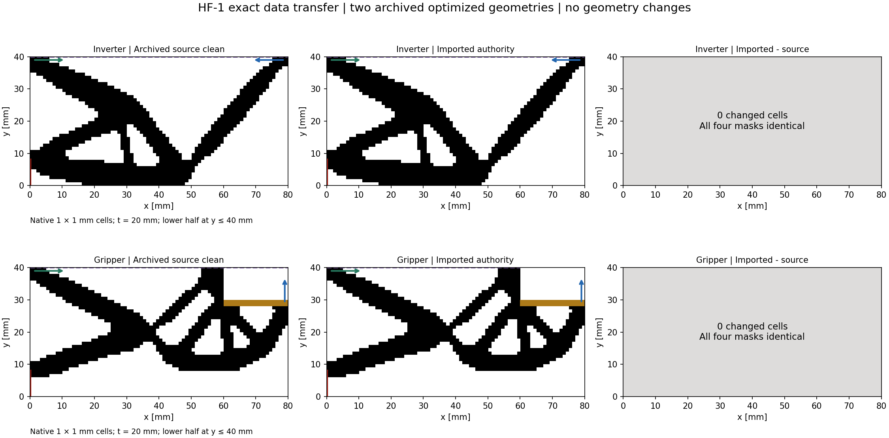
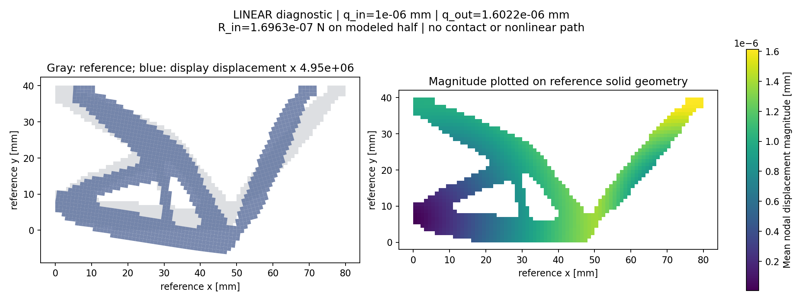
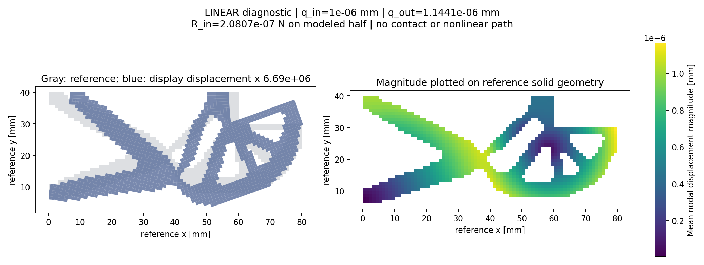

# HF-1 完成报告

2026-09-13。**授权的两例导出、独立读取、实体线性诊断与“断开 LF”验收均已完成。** 全量测试 88 项通过、1 项因 Windows 符号链接创建权限跳过；断开验收的 12 项检查全部通过。HF-2 尚未实施。

本阶段建立了可搬迁的数据接口和独立诊断程序。当前分析范围为小应变实体线性力学；非线性材料、第三介质接触及最终研究性能仍未验证。文中数值均来自最终独立环境运行，早期 `hf1_results/local_*` 仅保留为开发记录。

## 交付与独立边界

| 产物 | 入口与完成内容 |
|---|---|
| 原资料保全 | `reference_inputs/manifest.json`；两 ZIP、两 PDF、任务书字节不变副本，原件和副本均复核哈希 |
| 一次性数据准备 | `lf_data_preparation/`；单独环境、转换和直接源 ZIP 核验脚本，位于 HF 仓库之外 |
| 可搬迁普通数据 | [dataset_index.json](../geometry_dataset/dataset_index.json)；两例 canonical、非对称标记、完整来源档案与任务/求解配置 |
| 独立 HF 仓库 | [README](../hf_repo/README.md)；独立 Git、Python 3.13 环境、依赖锁、CLI、测试和已验收 wheel |
| 验证记录 | [断开验收](../hf1_results/detached/acceptance.json)、[输入不变与安装回执](../hf1_results/detached_receipt.json)、[JUnit](../hf1_results/pytest.xml) |
| 下一阶段提案 | [HF-2 计划](HF2_PLAN.md)；需另行授权，当前未执行 |

HF 运行代码和测试没有导入 LF、优化器、MATLAB 或转换脚本，也没有将整个研究工作目录作为 HF 发布。运行依赖是锁定的 NumPy、SciPy、Matplotlib 及其依赖；JAX 选型留在后续阶段。交付 ZIP 仅含 HF 仓库和独立数据包，原资料与数据准备环境留在工作区。

[独立交付 ZIP](../deliverables/HF1_independent_evaluator_and_dataset.zip) 为 19,783,839 字节，含 438 个文件条目，解压后按 `hf_repo/README.md` 安装。完整 ZIP CRC 核验通过；SHA-256 为 `57379c330f9f295e5591bda0c77010898457c5e100a300862e855dfdf2422939`，见 [发布清单](../deliverables/HF1_release_manifest.json)。本地独立 Git 提交为 `8f4c7cc1931b3c649af03f545606e5cb910cf4d6`，交付源码与 Git 对象字节一致；未配置远程发布。

## 数据守恒与物理接口

采用上传快照中的 `inverter__sweep__kin_1e+01__kout_1e-01` 和 `gripper__sweep__kin_1e+01__kout_1e+00`。来源是已有 200 次更新的预算终态，记录为 `converged=false`，没有重新优化或宣称来源已收敛。两例均为 80×40 个 1 mm 单元、厚度 20 mm 的下半模型。

数据包完整保留 243 条来源记录、3 类补充终态和 357 份原数据资产。manifest 列出 394 个文件（25,719,616 字节），加 manifest 自身共 395 文件。运行引用均在包内；历史绝对路径仅作来源文字记录。

独立核验直接读取原 ZIP，比对导出结果：每例 `solid/design/passive_solid/passive_void` 四数组改变单元数均为 0，面积误差为 0，端口节点、物理坐标、方向及权重一致。357 份原资产字节一致，243 条数组引用及 92 条交付引用均可解析。详见 [roundtrip_report.json](../geometry_dataset/evidence/roundtrip_report.json)。

| 量 | 反向器 | 夹持器 |
|---|---:|---:|
| 实体面积，mm² | 1128 | 1086 |
| 设计单元数 / 设计实体单元数 | 3200 / 1128 | 2960 / 1046 |
| 设计域实体分数 | 0.3525 | 0.3533783784 |
| 被动实体 / 被动空区单元数 | 0 / 0 | 40 / 200 |
| 原支承区域节点 / 实体附着节点 | 9 / 4 | 9 / 3 |
| 共享边连通分量 | 1 | 1 |

二值权威身份分别为：

- 反向器：`2e2bb3466ade06f920dfbb92577ccbe46106acec430837bac8e1a30b8083527a`。
- 夹持器：`d4e82cfd629e37f7d0c85aed672ab5df228314147cf5db59aeabb279cee5d91d`。

冻结格式为 `hf-geometry-1.0`，JSON 声明物理网格/区域，NPZ 保存四个 uint8 数组。几何身份覆盖物理尺度及四数组；描述哈希另覆盖标签、来源和处理元数据，文件哈希保护 NPZ 字节。读取器禁止 pickle，拒绝坏哈希、非法分区、物理元数据不一致和包外数组路径。契约见 [DATA_FORMAT.md](../hf_repo/docs/DATA_FORMAT.md)。

输入端口为 x=0、y∈[38,40]、方向 +x；反向器输出为 x=80、y∈[38,40]、方向 −x；夹持器输出为 x=80、y∈[28,30]、方向 +y。三节点按参考弧长梯形积分平均，权重为 1/4、1/2、1/4。支承区域为 x=0、y∈[0,8]。

夹持器实体对称段明确为 y=40、x∈[0,60]；源 LF 的 x∈[0,80] `full_midline` 约束完整保存在来源记录中。此次调整明确了标签语义，未改变四数组或几何身份。在本阶段去空区模型中，仅约束实体附着自由度；TMC 背景边界效应留待后续分析。

非对称标记另用非零原点和非等边单元检验转置、翻转与缩放。它可读，但因两个连通分量被正确判为资格失败，不进入默认力学分析。

## 独立线性诊断结果

授权诊断配置：Q1 平面应变、2×2 Gauss、E=1 MPa、ν=0.3、t=20 mm、平均输入 +1e−6 mm；无输入/输出弹簧、无工件、无第三介质。仅装配实体单元。平均输入通过拉格朗日乘子施加，没有将整个端口刚性绑定。一般接口中的输出弹簧是广义位移对应的秩一弹簧，相关解析测试通过。

| 最终独立运行测量 | 反向器 A1 | 夹持器 B |
|---|---:|---:|
| 输出平均位移，mm | 1.6021813118562742e−6 | 1.144145163539476e−6 |
| 施加于模型的输入广义力，N | 1.6963023023863184e−7 | 2.0807466745143412e−7 |
| 相对自由力残差 | 1.5461712937e−14 | 1.1635582363e−14 |
| 平均输入约束绝对误差，mm | 5.9292306308e−21 | 1.9905274260e−20 |
| 实体自由度数（约束前） | 2702 | 2674 |
| 数值分析时间，s | 0.0195 | 0.0112 |

力残差按实际力项及 E·t·d 非零参照归一，预设容差为 1e−9；输入约束容差为 1e−10·max(|d|,1e−6 mm)。两例均通过，未根据结果放宽阈值。实体应变能与输入功的差分别约为 2.11e−25 和 −7.71e−26 N·mm。

输出正号分别对应反向器 −x 和夹持器 +y。上述力与位移均属所建半模型，夹持器位移是单侧夹爪量，没有自动乘二。下图明确注明真实位移及显示倍率；原始位移、应力/应变、节点/连接和绘图元数据均保存。

## 验证及“断开 LF”证据

完整独立测试结果为 **88 passed、1 skipped**。覆盖数组/哈希/尺度、端口与连通性反例、单元刚体模态、仿射应变解析应力与能量、平均输入和广义弹簧、反力符号、失败输出 null、不覆盖已有结果等。唯一跳过项因本机创建真实符号链接需要额外 Windows 权限（WinError 1314）；对应读取保护存在，但该操作未动态验证。

验收复制 HF 仓库与最终数据包到新的临时根，创建干净环境，从已构建 wheel 安装 HF，然后在第三个工作目录以 Python `-I` 运行。没有全局或用户 site-packages，也没有 LF 包。验收脚本通过 Python 审计钩子禁止访问原工作区及原 ZIP/PDF/MATLAB 目录，并拦截 LF 导入。审计记录未发现禁止的访问或导入。这是应用层访问审计，未使用操作系统沙箱；源文件仍保留在宿主机上。

先独立读取两例与标记，再在同一进程调用 A1–B–A2：3 次分析均成功，A1/A2 的 16 组输出数组逐位一致，9 项物理测量相等，3 个 evaluation ID 各不相同。全部 395 个输入文件运行前后哈希相同。12 项验收检查全部为 true，证据保存在 [access_audit.json](../hf1_results/detached/access_audit.json) 和 [acceptance.json](../hf1_results/detached/acceptance.json)。

正式验证以安装包 API 在同一进程运行 A–B–A；CLI 亦已提供并单独检查。三次力学分析合计约 0.0442 s；含导入、读取及绘图的验收子进程约 22.887 s，不含环境安装。这是小规模 CPU 工作量记录，不是 JAX/GPU 加速结果。未实测峰值内存，不能宣称已对 4 GiB 软预算做内存审计。

已验收 wheel 的 SHA-256 为 `f46d09d24f49a27c0f7c69567cf5c4cf877ade47cbdb989e0f8f14f262e3b52f`；求解结果记录的运行源码哈希为 `4f2499dbcc571210329e47d30fa7dee066c2838a89138e853486c1072e42485f`。最终核查确认 wheel 与仓库全部 7 个 Python 运行源文件逐字节相同；Git 属性保留文件字节，避免自动换行转换改变源码哈希。五份原件与只读副本哈希均保持不变。记录见 [release_integrity.json](../hf1_results/release_integrity.json)。

## 尚未确定及阶段停止

两例可读、可求解，连通与端口附着通过；总体几何资格仍为 `pending`。正式体积阈值未设，最小特征尺寸没有经验证的测量方法，功能状态为 `not_assessed`。保留源二值体积分数高于 0.35 的事实，不自动调整掩膜以满足阈值。

本阶段没有实现或验证非线性 TMC、接触路径、完整 C-shape、网格与第三介质参数收敛，也没有进行候选排名。HF-1 已完成并按阶段边界停下；下一步工作与待冻结条件见 [HF-2 计划](HF2_PLAN.md)。
