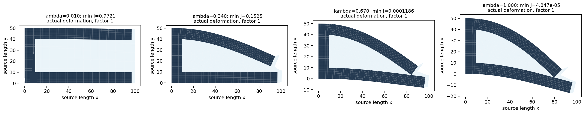
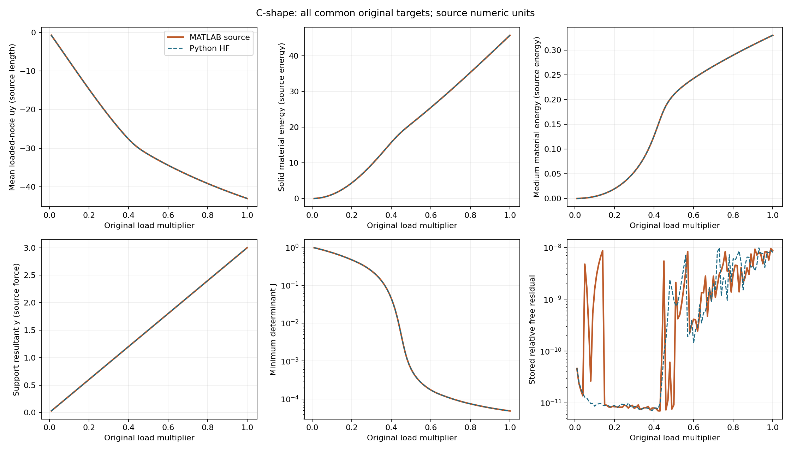

# HF-2 执行报告：源码对账通过，严格平衡仍有未通过项

2026-09-13。**HF-2 已按复审计划执行，阶段状态为部分完成。** 独立内核、小网格、两条完整 C-shape 路径及逐目标响应对账已经完成；严格独立平衡复核保留三个超限状态。未修改容差、材料、网格或载荷以改变判定，也未追加完整路径求解。HF-3 尚未执行。

## 复审与实现

本次授权是结合 HF-1 的执行情况再次审阅 HF-2，然后直接执行。复审保留原物理路线，补全固定测试场/编号、范数、Armijo 公式、分域能量误差尺度和共享资源预算。详见 [复审记录](HF2_REVIEW.md) 与 [执行计划](HF2_PLAN.md)。冻结机读规范哈希为 `5e09dc712a1d1f1eec2adcf9ce230eeeae023c065791815527f8e46c03ca4971`。

独立 HF 0.2.0 已实现全域 Q1 平面应变 TMC，九点 Gauss–Lobatto，JAX CPU float64 对实际残差求非对称 Jacobian，SciPy 一般稀疏 LU。保留正则项 exp(−5J) 的变形导数；没有用总能量 Hessian 替代实际切线。非正 J/非有限量先拒绝，Newton 回溯使用自由残差；失败回滚到按原实现停止判据接受的状态，目标指标保持 null。原实现接受的状态仍可能被后续独立平衡复核拒绝。

HF-1 的去空区线性入口、几何身份和两例数据保持原含义。新 C-shape 使用独立 `source_numeric` 入口，不继承 HF-1 的 mm/N、20 mm 厚度或平均输入位移任务。运行和测试不要求 LF、MATLAB、原 ZIP 或参考导出脚本。接口和安装说明见 [HF 仓库](../hf_repo/README.md)。

## 验证结果

| 项目 | 结果 |
|---|---|
| 完整回归 | 185 passed，1 skipped；跳过项仍为 Windows 创建真实符号链接的权限限制 |
| 小规模跨语言核验 | 16 个案例、976 项检查、160 个差分点全部通过 |
| 材料/正则分离 | 材料/正则残差与切线分别比较；另核对应力、J和加权材料能量；不用大数相减提取小正则项 |
| 装配 | 生产稀疏装配、独立逐元稠密累加、MATLAB显式置换三方通过 |
| 源求解包装 | 两增量一次调用与逐目标调用的最终位移逐位相等 |
| MATLAB完整路径 | 唯一一次尝试完成100/100目标，λ=1 |
| Python完整路径 | 唯一一次尝试完成100/100目标，λ=1，无增量二分 |
| 源码响应一致性 | 全部100目标的7项量均通过 |
| 严格独立平衡 | **未全部通过：3个存档状态经50位复算仍超10⁻⁸** |

12个单元案例覆盖两个矩形、三个非仿射场和两种材料倍率；4个小网格使用预定交替材料。全部差分扰动最低 J=0.51235724；32条方向曲线中最差的最佳误差为1.16×10⁻¹⁰，低于预定10⁻⁶。差分步长由10⁻²降到10⁻³时，误差约下降100倍。完整证据见 [小算例报告](../hf2_results/small_validation_report.md)、[检查明细](../hf2_results/small_validation_001/summary.json) 与 [JUnit](../hf2_results/full_regression.xml)。

## C-shape 配置与路径

严格绑定上传代码版本：100×50域，62×30网格，828实体/1032第三介质单元，3906自由度；E=100、ν=0.3、kv=α=10⁻⁶、面外厚度因子1。左边全固定，右上六节点y向载荷为[−0.3,−0.6,−0.6,−0.6,−0.6,−0.3]，总和−3。采用MATLAB导出的100个原始倍率，不将论文30 N或其他表格参数混入本配置。

两方原有停止判据均报告全部目标通过，终态 min J≈4.84743×10⁻⁵。每步位移、支承反力、J场、分域材料能量、残差和迭代记录均保存；没有只取终值对账。

| 全路径最大误差 | 测量值 | 冻结容差 |
|---|---:|---:|
| 全局位移，相对 | 7.95×10⁻¹⁰ | 10⁻⁵ |
| 六加载节点二维位移向量，相对 | 1.86×10⁻¹⁰ | 10⁻⁵ |
| 支承反力向量，相对 | 2.70×10⁻¹⁰ | 10⁻⁴ |
| 实体材料能量，相对 | 3.50×10⁻¹⁰ | 10⁻⁴ |
| 第三介质材料能量，相对 | 3.48×10⁻⁹ | 10⁻⁴ |
| 全域J场，相对 | 1.42×10⁻⁹ | 10⁻⁵ |
| 最小J，绝对 | 7.21×10⁻¹⁰ | 10⁻⁶ |

## 三个未通过状态及原因

另一个独立后处理器用数学等价的第一 Piola 表达 `P=μF+(λlogJ−μ)F⁻ᵀ` 重算同一弱式，发现三个临界点超限。该后处理器已在16个冻结小状态下通过源码一致性测试。进一步将存档的 binary64 位移、算子、权重与材料参数精确提升到50位十进制算术，重算而不改变位移或求解路径，仍确认超限：

| 存档状态 | 原实现记录的相对残差 | 50位独立复算 | 原门槛 |
|---|---:|---:|---:|
| Python λ=0.73 | 9.88578×10⁻⁹ | **1.06445×10⁻⁸** | 10⁻⁸ |
| MATLAB λ=0.76 | 8.36267×10⁻⁹ | **1.07514×10⁻⁸** | 10⁻⁸ |
| MATLAB λ=0.99 | 9.51844×10⁻⁹ | **1.04444×10⁻⁸** | 10⁻⁸ |

三点 C=FᵀF 的最大条件数约1.18×10⁸、1.45×10⁸、4.28×10⁸。源形式构造逆 C 时，相近数相减求 det(C) 存在明显舍入消去，足以影响约10⁻⁸量级的自由残差判断。仅在离线取证中用等价J²作分母后，两种力表达的差显著缩小，支持这一误差定位。

**原因可解释，三个状态仍未达到门槛。** 响应向量高度一致、全局合力通过和求解器打印收敛都不能代替每个自由度的独立平衡认证。保留原始 `not_pass`、原规范与比较时的仅公式说明版本，未追溯改写记录。详见 [C-shape报告](../hf2_results/cshape_comparison_report.md)、[50位精度取证](../hf2_results/residual_sensitivity_001/README.md) 和 [最终机读判定](../hf2_results/cshape_final_decision.json)。

本阶段没有修改生产表达式或重跑完整路径来消除这三个点。物理接触精度、网格无关性、稳定性及项目机构性能也仍未验证。

## 资源、可搬迁性与可复验材料

MATLAB完整进程约64.35 s，Python完整进程约53.17 s；Python数值路径约46.26 s，含冷核与每步保存。两方Newton最大基点检查数分别11、15；Python记录1347次回溯拒绝。它们使用不同数值保障和进程工作内容，不能用这些时间声称加速。

进程树采样峰值为MATLAB约1.463 GiB、Python约323 MiB。采样不是OS沙箱，也不保证捕获瞬时峰值。共享预算共计17个作业、363.53 s，包含编译、失败设置、小测试、离线复算及独立重放，低于3600 s上限；原始时账位于 `hf2_results/resource_jobs/`。MATLAB累计201.12 s，包含一次外部初始化包装失败；原始源码未修改。

独立验收使用新临时根、第三工作目录、Python `-I` 和已构建wheel，禁止访问原工作区/原资料并拦截LF/MATLAB导入。**17项全部通过**，包括976项小参考检查、HF-1与TMC的A–B–A、源配置一致性及依赖隔离；395份输入文件逐字节不变。在线依赖安装因CDN超时保留失败日志，随后用锁定版本的本机缓存建立新环境，4511个安装文件RECORD哈希全部匹配。这不等同于再次验证第三方原wheel压缩包的下载哈希；HF自身wheel单独核对SHA-256及运行源码。详见 [独立验收](../hf2_results/detached/acceptance.json) 及 [回执](../hf2_results/detached_receipt.json)。最终复验进程14.40 s，依赖安装8.42 s另计。第一次重放的报告写出遇到NumPy布尔量序列化问题，修复的是验收脚本，失败日志与结果另存；没有修改求解器或完整路径。

已构建wheel SHA-256为 `d2a5840709cb11d4c4371861631c2a7be8faf4b7133861930d255aa89a446c4c`。完整Python路径记录的运行源码哈希为 `7417de56baa7c02142ad70cf5d95f1bcfbd7fc4633608f3627b8b6777cb31c4a`；已逐文件确认当前10个运行源文件、wheel、完整运行和独立复验版本一致。HF-1发布包、395文件数据包及五份原资料的哈希不变。

发布检查还核实了取证摘要在计算结束后补充来源哈希造成的记录版本变化。补充前摘要已恢复为精确旧字节并匹配原SHA-256；补充前后摘要、初版判定和最终引用同时保留，科学判定不变。详见 [来源记录衔接](../hf2_results/provenance_reconciliation.json)。

## 最近下一步

先审阅 [HF-2有限修正与复验计划](HF2_REPAIR_PLAN.md)，闭合稳定残差表达、实际一致切线与内部停止裕量的精度预算，再考虑受限修正路径复验。[HF-3预备计划](HF3_PLAN.md)已写明这一进入条件，目前不进入真实候选的非线性试点。
