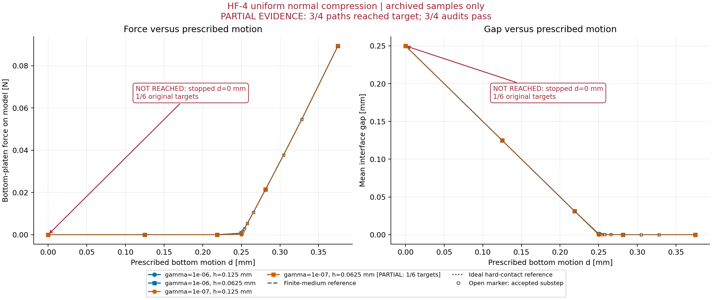

# HF-4-A/B 执行报告：合力验证与状态精度问题

2026-09-14。**HF-4-A 已完成；HF-4-B 部分完成，四个组合中三个通过，第四个未通过生产停止条件。** 已完成原因排查及证据交付准备，没有进入非均匀二维接触或圆柱。本报告不宣布整个 HF-4 通过。

## 1. 整体目标、本轮工作与原因

总体目标是独立正向 HF 力学评估器：仅依赖 HF 仓库、独立环境和自包含普通数据，在明确物理任务下输出有单位、符号、状态和可复核证据的响应。数据可读、数值求解、模型精度及机构功能分别判断。

HF-3 已完成两例无工件机构的指定数值验收。本轮根据用户“按照你的计划开展”的授权，先补非零规定运动与明确测力对象，再用有两个独立参考的均匀法向基准检查力与间隙。这样可以把接口错误、数值误差和有限介质模型偏差分开，不把输入广义力直接叫夹持力。

执行前冻结的[计划](HF4_AB_EXECUTION_PLAN.md)、[规范](../hf_repo/configs/hf4/validation_spec.json)和[哈希记录](../hf4_results/input_freeze.json)保持不变。完整机器可读结论见[阶段摘要](../hf4_results/acceptance_summary.json)。

## 2. 做了什么，为什么做，效果如何

| 工作 | 实现与理由 | 已观察效果 |
|---|---|---|
| 合成任务与分区 | [normal_contact.py](../hf_repo/src/hf_eval/normal_contact.py)：独立物体、介质、压板边界及界面定义 | 四个组合的几何、材料、节点、约束与积分算子独立映射核验通过；原395数据文件字节未变 |
| 规定运动与测力 | [prescribed.py](../hf_repo/src/hf_eval/prescribed.py)：非零Dirichlet、实际非对称Jacobian、分侧虚功反力 | 非零基态、预测/校正、符号、反力去重、二分回滚与失败目标null语义测试通过 |
| 独立标量参考 | [hf4_normal_reference.py](../hf_repo/scripts/hf4_normal_reference.py)：有限介质串联解和理想硬接触解 | 12个(gamma,d)参考状态50/80位自洽及模型允许误差预检通过；保守数学界在运行前给出 |
| 独立HP与存档审计 | [hf4_precision_reference.py](../hf_repo/scripts/hf4_precision_reference.py)、[audit_hf4_normal.py](../hf_repo/scripts/audit_hf4_normal.py) | 全部39个接受态通过逐态HP及对应参考检查；这包括第四组合仅有的零态，不表示其路径通过 |
| 防止共同错误 | [hf4_input_audit.py](../hf_repo/scripts/hf4_input_audit.py) | 从冻结配置独立核对原语，防止模型与导出参考输入同步错误；检查原目标遗漏、数组形状与缓存哈希 |
| 失败原因排查 | [固定态探针](../hf_repo/scripts/probe_hf4_precision.py)、[校正量探针](../hf_repo/scripts/probe_hf4_update.py) | 实际失败候选的力求值已准确；发现微小校正在绝对binary64位移中丢失，未改材料或阈值 |
| 独立安装与可视化 | [安装重放](../hf_repo/scripts/run_hf4_isolated.py)、[绘图](../hf_repo/scripts/plot_hf4_normal.py) | 新wheel、异地cwd、禁止原工作区/LF访问下63项检查通过，包含成功A–B–A及第四组合失败复现；三张图明确标注partial |

接口、方程、字段和测试对照见 [HF4_IMPLEMENTATION.md](../hf_repo/docs/HF4_IMPLEMENTATION.md)。

## 3. 冻结物理任务与力的含义

上下弹性块各高1 mm、宽1 mm，初始间隙0.25 mm，厚1 mm；E=1 MPa、nu=0.3、平面应变。全域ux=0、顶端uy=0、底端uy=d。网格h=0.125/0.0625 mm，gamma=1e-6/1e-7；alpha=1e-6、物理Lr=1 mm保持不变。原目标为0、0.125、0.21875、0.25、0.28125、0.375 mm。

底端约束装置对模型的+y合力为正压缩；顶端同样沿全局+y测量，所以约束对模型为负。模型对装置的力取反号，不隐含乘2。间隙从实际界面原坐标加位移计算，不截断。总力包含实际材料与HuHu残差，分量单独保存；材料能量不能替代完整非保守残差的虚功。

有限介质参考验证给定TMC模型的实现；理想硬接触参考衡量模型近似差异。前者不是后者的代替品。推导、唯一根、真实binary64系数和分相容许差依据见[参考与容差说明](HF4_REFERENCE_AND_TOLERANCE.md)。均匀分层解的单元内HuHu为零，所以本轮不能验证一般二维正则效应或一般网格收敛。

## 4. 四条路径的实际结果

| gamma | h [mm] | 原目标完成（含零态） | 接受态 / HP态 | 最大二分深度 | 目标d [mm] | 目标底端力 [N] | 结论 |
|---|---:|---:|---:|---:|---:|---:|---|
| 1e-6 | 0.125 | 6/6 | 12/12 | 4 | 0.375 | 0.0894081203163 | 通过 |
| 1e-6 | 0.0625 | 6/6 | 12/12 | 4 | 0.375 | 0.0894081203163 | 通过 |
| 1e-7 | 0.125 | 6/6 | 14/14 | 6 | 0.375 | 0.0893970219058 | 通过 |
| 1e-7 | 0.0625 | 1/6，仅零态 | 1/1 | 8 | 未达到 | null | 未通过 |

三条完成路径共有38个接受态；第四组合只有零态。三条成功路径中的6/6/8次增量失败触发了预定二分，记录完整；第四组合9次增量失败、269个拒绝试探保留。没有丢弃失败后只展示最终成功。

同模型参考力的最大绝对差为5.574e-14 N；39个接受态的最大HP自由残差/SF为8.725e-10，最大生产内力求值误差/SF为2.083e-10。三个完成路径末态的50/80位差最大4.566e-45。HP、同模型参考及模型分相检查合计989项；过渡补步没有擅自新增物理容差，标为模型测量用途。

在已完成组合的原压紧目标上，相对理想硬接触力的最大偏差约**0.1969%**，低于预定1%容许差；名义闭合点的最大残留间隙为初始间隙的**0.4556%**，低于预定1%。这些结论限于本合成均匀任务及已完成状态。γ=1e-6两个网格末态几乎相同，只支持本模式的映射与装配一致性。

原始入口：[粗网格γ=1e-6](../hf4_results/g0_m0_001/result.json)、[细网格γ=1e-6](../hf4_results/g0_m1_001/result.json)、[粗网格γ=1e-7](../hf4_results/g1_m0_001/result.json)、[第四组合失败](../hf4_results/g1_m1_001/result.json)。各目录都有model、metadata、steps索引与逐态数组，对应`_audit`目录保存HP及参考原值。

## 5. 第四组合为什么停止，排查到什么程度

原首个非零目标d=0.125 mm的生产残差降至约1.841e-9后停滞；冻结的内部接受要求是1e-9。继续二分到0.00048828125 mm仍未通过。J合法、边界约束误差为零，LU诊断未显示明显误差，预算尚充足。

一次有界诊断重现首目标并保存实际失败候选。其HP自由残差为1.8410298639e-9，而生产全内力对同输入HP的求值误差仅7.084e-16×SF。独立80位半解析节点位移一次舍入后的HP残差也约1.8410298926e-9。50/80位复核排除了参考精度不足。

保存候选上的一次Newton校正显示：下实体272个自由uy中，仅17个在完整步长时发生变化；校正中位数为0.211 ULP。步长为1/2时该区域全不变，为1/16时全部595个自由DOF都逐位不变。证据支持当前绝对binary64位移及其更新的舍入平台；不支持盲目修改本构、增加迭代或继续缩步。

这没有证明任何binary64位形都不可能过门。局部去平移试验也有微小输入变化，不能冒充严格等价新解。失败候选虽低于外部1e-8上限，仍不能被追认为通过内部1e-9门槛。详见[完整排查记录](HF4_PRECISION_INVESTIGATION.md)、[固定态原始结果](../hf4_results/fixed_state_probe_001/summary.json)和[更新量原始结果](../hf4_results/fixed_update_probe_001/summary.json)。

## 6. 测试、独立性与资源

完整回归为449通过、1跳过；之后新增映射检查及相关审计复验为67通过。两批去重覆盖**491个通过测试、1个跳过**，不是一次pytest运行的491。跳过仍为Windows不能创建实际符号链接的既有权限项。首次新接口测试77通过/1失败的原结果保留；失败只因将Decimal数值相等的不同尾零字符串直接比较，修正测试比较方式后通过，生产与阈值未改。

新wheel为0.4.0，SHA-256为`fb7199c4f4950c0380cc4818fcb9eae7b93ebc03ac5953d4e1b8a0b663937caa`。新环境以Python `-I`、异地cwd及文件/导入拦截禁止原工作区和LF；完整粗网格A–B–A物理数组逐位相同，并逐位匹配开发路径。第四组合的失败原因、到达零态、失败尝试及null目标语义也复现。共63项独立安装检查通过，[重放摘要](../hf4_results/detached/summary.json)保留全部细节。依赖按lock精确版本从离线缓存安装并核对安装RECORD，本次未重新校验第三方原始压缩wheel哈希。

原HF-3的12个非版本运行源码文件字节保持一致；只有版本声明改变，另加规定运动和合成任务两个模块。HF-3物理/数值证据、旧发布包和395个几何数据文件保持原样。当前[生产源码冻结](../hf4_results/production_source_freeze.json)及源码副本支持逐文件对照。

受监控数值及绘图累计**110.375/1800秒**，最大采样进程树RSS约**526.8 MiB**，低于4 GiB软限；构建安装另计15.873秒。所有失败作业进入[资源账本](../hf4_results/resource_jobs)，其中第四组合的部分审计返回非零表示整条路径未通过，零态本身HP通过。另一次汇总文件检查因相对路径解析位置错误中断，修正为相对于原任务cwd解析；[记录](../hf4_results/finalizer_path_correction.json)明确没有重求解或改写数值证据。

## 7. 图与下一步

[参考力差图](../hf4_results/plots_001/force_errors_vs_d.png)、[真实比例变形图](../hf4_results/plots_001/deformed_shapes.png)与[绘图原始数据](../hf4_results/plots_001/plot_data.json)均来自存档。第四组合只显示零态并标NOT REACHED，不延伸成完整曲线；颜色只表示材料区域，不是接触压力。

下一步应先处理状态表示精度，再继续接触层级。具体方案见 [HF4_STATE_REPRESENTATION_PLAN.md](HF4_STATE_REPRESENTATION_PLAN.md)：用明确保存的两部分位移表达大平移与小变形，HP从两部分精确重建，先验证原失败目标，再验证第四条路径和新版本回归。该方案尚未实现，本轮不以改容差替代修正，也不进入HF-4-C/D。

本轮的效果是建立了可审查的规定运动、测力与双参考链，并把一个真实阻碍定位到状态精度，而非将未通过结果掩盖成接触模型成功。总体研究资格与功能评价仍待后续证据。
