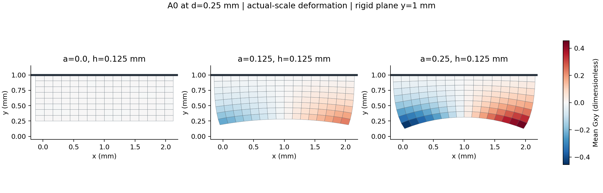
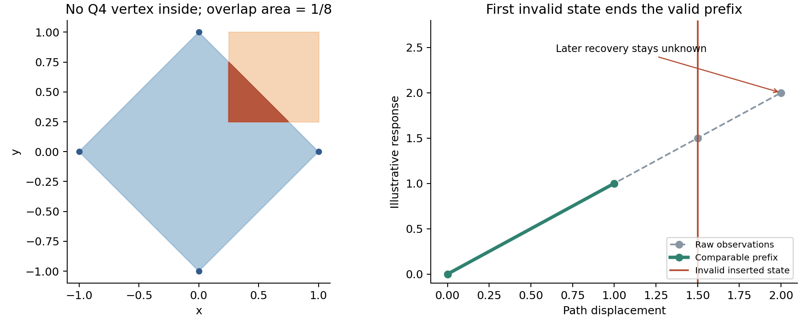

# HF4-C0：新研究审阅、选择性融合与参照准入

日期：2026-09-20。状态：本轮来源审阅、诊断融合、受限 A0 参照准入已完成；**整个项目以及一般非均匀 TMC 接触验证仍未完成**。科学基线为 `hf_repo` 0.5.0 / `b1334bb6a83ba9a0efab7bdba7bd39722146f024`。本轮是新增实验性扩展，不改变旧 HF4-B 的物理合同和历史证据。

## 目标、当前工作与理由

长期目标是建立独立 HF 力学评价器：在任意工作目录、仅依赖普通几何数据和 HF 环境即可运行；对有限变形与接触的输出，明确任务、单位、符号、数值平衡、接触可容许性、失败路径和证据。它最终服务于固定预算下柔顺机构候选的可靠比较，而不是把 LF 分数或求解器成功标志直接当作物理正确性。

本轮用户提供 LF(10)、TMC-A(19) 和“TMC开发”研究会话。我们先核对其来源、任务和证据强度，再独立实现有用的方法。资料内的旧阶段安排和授权只作研究背景，不替代当前用户请求。当前用户授权取舍与融合，因此没有机械照搬另一条线的任务、1800 次试验安排或默认求解政策。

最有用的新增证据是：候选接触节点不穿透、Newton 残差达标时，单元边仍可能跨进工件角点；N19 的真实细网格案例报告了约 `0.0072228517365 mm²` 重叠。故必须把几何失效识别与可信接触参照放到大样本计算之前。

## 阅读结果与取舍

完整来源与决策见 [LF 来源审计](../research_integration_20260920/LF10_SOURCE_AUDIT.md)、[N19 来源与代码复核](../research_integration_20260920/N19_SOURCE_AND_CODE_REVIEW.md)及[集成决策](../research_integration_20260920/INTEGRATION_DECISIONS.md)。关键结论如下。

| 发现 | 本线处理 |
|---|---|
| 新 LF 两例四类掩膜与冻结两例逐格相同；原 395 文件集校验通过 | 保留旧几何及其原资格，不重写数据 |
| E006 明确背景物理补集 `(60,80]` 与实体附着支承 | 纳入将来 v2 导入合同；当前 `project.py` 已有全线背景和实体附着政策，不能据此宣告旧实现有同一缺陷 |
| 正式池 1800 包的身份、数组、体积与连通性可独立读取核对；完整优化历史归档在包外 | 采用可追溯普通数据，暂不启动 HF5 标签重算 |
| C1 修正评分 reference，且发生于另一条线 HF 解盲后 | 保留原分数和修正值各自来源；不把恢复排序冒充预先冻结顺序 |
| N19 的实体接触 A 与 TMC 共用材料/FE/求解器 | 独立的是接触处理层；不能作为完全独立的 FE 真值 |
| N19 使用单 U 与不同残差政策、参考力尺度底值 | 保留 O 线稳定内核、split 状态及原严格门槛 |
| 增大 α 能改善部分穿透，但同时改变近接触力和寄生刚度 | 不直接迁移 α=1e-5；须在同任务下分别评估 |

本轮没有执行附件里的 LF 优化或 N19 求解脚本，没有声称在 N19 的 Python 3.11 环境复现其结果。新计算均使用 O 的 Python 3.13.6、NumPy 2.4.6、SciPy 1.17.1、JAX/JAXLIB 0.11.0 环境。原论文、MATLAB 原码和附件完整源目录没有加入公开仓库。

## 实际修改

新增 [contact_audit.py](../hf_repo/src/hf_eval/contact_audit.py) 实现严格凸、逆时针 Q4 与固定轴对齐矩形的交面积；非法、退化、自交或数值溢出的单元返回“不可评估”，不能以零面积通过。所有容差必须显式输入。该模块只检查实体—障碍重叠，不宣称自接触检查或任意障碍支持。

同一模块新增严格有效前缀。每个接受态必须有明确的求解、几何和独立参考有效性字段；第一个失效点截断其后的计分，后续局部恢复不能恢复评分，未知 `None` 与真实零响应分开。通用工具保留时间顺序，支持卸载；A0 审计另外强制本任务单调加载、完整原目标和全部插入态清单。

新增 [contact_reference_a0.py](../hf_repo/src/hf_eval/contact_reference_a0.py) 作为受限任务构造器，并新增执行、隔离、独立审计和汇总脚本。A0 使用现有 O 材料、积分和 split 求解器，**没有实现一般主动集**。只有逐态法向乘子非负、几何有效和自由 DOF 平衡通过时，规定上表面法向位移才可解释为该分支上的单边无摩擦接触。

既有跟踪的生产内核、求解器和 HP helper 未修改。原来的 0.5.0 wheel、HF1–HF4 结果和失败记录均保留。

## 预先冻结的计算与独立验收

[计划](../research_integration_20260920/EXPERIMENT_PLAN.md)和[完整协议](../hf_repo/configs/contact_reference_a0_v1.json)在新 FE 计算前写定；协议 SHA256 为 `20cbadef31797287e850ceab8f912facd71c2d6389354750e4cbc05bd9dac7e7`。

实体为 2×1 mm、厚度 1 mm；E=100 N/mm²、ν=0.3；仅实体、kr=0。障碍下表面 y=1 mm，水平范围远离实体边缘。初态已经闭合，上表面 uy=0、ux 自由；底面 uy=d·[1+a·(1−3(x−1)²)]，仅底中心 ux 固定以消除水平刚移。网格 h=0.25/0.125 mm；a=0、0.125、0.25；d=0、0.03125、0.0625、0.125、0.25 mm，共六条路径。

先验收两条均匀路径，再运行四条非均匀路径。几何 lift 不包含解析平衡解。每态保存实际 `u_lift`、`u_fluctuation`、内力、J 和任意固定测试方向的 Jv；HP 公式提升两数组的精确和，不使用显示用的合并位移。独立 50/80 位参考重建网格、Q1 导数、积分和边界；核对存储哈希链、完整目标清单、残差、约束、力、切线作用、反力平衡、乘子和节点位置。均匀路径另用 Pxx=0 的独立标量解析公式验力。

法向力定义为 `−Σfint_top,y`，正值表示模型作用于障碍的压缩力。非均匀底面控制的 `drive_force` 是带空间 profile 权重的功共轭广义力；底面竖向合力另取 `group_reactions.bottom`，二者不混用。

几何裁剪使用一次准确舍入的节点位置，同时相对 80 位节点坐标记录舍入误差。本轮实际 HP 节点均满足 y≤1；由 Q1 形函数非负且和为 1，单元内部亦不越过该水平平面。这个实际结果比仅通过 y≤1+1e-12 容差门更强，不能把它外推至任意障碍。

## 结果与效果

权威机器可读结果：[admission_summary.json](../research_integration_20260920/summary_final/admission_summary.json)。

| 检查 | 实际结果 |
|---|---:|
| 受限 A0 路径 | 6/6 通过，30 个接受态，无二分插入 |
| 独立逐态数值门 | 620/620 通过 |
| 几何与有效前缀检查 | 30/30 通过，无障碍交面积 |
| 80 位相对残差最大值 | 8.7898098127e-10；门槛 1e-9 |
| 生产内力与 80 位相对差最大值 | 5.5273175179e-15；门槛 1e-11 |
| 生产 Jv 与 80 位相对差最大值 | 3.2049831799e-16；门槛 1e-10 |
| 50/80 位内力差最大值 | 2.2071395926e-48；门槛 1e-40 |
| 50/80 位 Jv 差最大值 | 6.2808921174e-50；门槛 1e-40 |
| 均匀力与解析解相对误差最大值 | 3.3157832508e-10；门槛 1e-8 |
| 几何坐标舍入差最大值 | 2.2204460493e-16 mm |
| 新增单元/审计测试 | 72/72 通过 |

细网格最终法向力分别为 71.4220652954 N（a=0）、70.5878708890 N（a=0.125）、68.6275427709 N（a=0.25）。两网格最大相对力差分别为约 1.51e-15、0.3103%、0.6016%。这只表示当前两个网格的敏感性，不是收敛证明、统一误差界或排名保证。a=0.25 细网格末态 |Gxy|max≈0.4547、|Hu|max≈0.6159，确认这部分试验确实包含非均匀二维变形。

这里还包含边界插值的影响：二次 profile 按节点施加，而 Q1 边界节点间线性插值，离散平均为 `1−a·h²/2`。a=0.25 时粗/细网格平均分别为 0.9921875/0.998046875，不能把力差全部归为内部有限元离散误差。本轮 kr=0，Hu 非零只说明变形非均匀，尚未检验非均匀 TMC 的 HuHu 正则项。后续对账需要同时核对边界迹及控制方式。

几何诊断另以不同算法核验：精确 Fraction 枚举包含顶点及边交点，经有理数凸包和面积公式得到参照，不调用生产裁剪。48 个基础样本×3 个二进制缩放×2 个平移，共 [288 个对照](../research_integration_20260920/geometry_rational_audit.json)全部通过。最大按输入面积归一化误差 4.2106236193e-17，冻结门槛 1e-12；精确零与正面积分类全部一致。包含节点全在障碍外但交面积为 1/8，以及双方顶点均在对方外但交面积为 1/4 的反例。面积误差小本身不能证明交面积精确为零。

## 失败、修正和成本记录

首次粗网格启动没有显式启用 JAX 64 位，内核在接受任何状态之前返回 `runtime_configuration`。原输出 `results/a0_h025_a000` 完整保留；修复运行入口的环境配置后，在新目录 `a0_h025_a000_r1` 运行。未更改物理任务、门槛、初始平衡猜测或正则参数。

独立代码复核发现审计初稿缺少跨精度 Jv 的门和保存时哈希链验证；两者均在第一次正式 HP 审计前补齐，并有审计测试覆盖。

汇总初稿按 `--output` 参数识别求解次数，将审计也计入，误报 13 次求解启动。修正为按脚本身份判别，权威 `summary_final` 记录 **7 次求解启动（含 1 次零接受态配置失败）和 6 次审计**。绘图也修复了图例与注释遮挡。上述汇总修正没有重算或修改任何科学状态。

隔离子进程收据累计：求解启动约 31.2932 秒，含审计共 44.1243 秒，均包含配置失败；均未触及单条时间上限。该数值是本机这些进程的观测时间，不是跨机器性能基准，未计资料阅读、实现、测试和文档时间。所有正式路径在预先六条预算内；首次配置失败没有接受态。

## 当前可用边界与下一步

已经获得：可审计的障碍交面积工具、严格路径前缀语义，以及经解析/高精度/几何检查的均匀与非均匀 **已闭合全接触 A0 分支**。这为判断下一步 TMC 差异来自离散求解还是接触模型提供了可用基础。

仍未完成：从分离到接触的激活、释放、有限面离开/重入、角点失败和一般主动集；A0 与 O-TMC 在完全匹配任务上的比较；第三级网格、步长敏感性、参数与寄生刚度权衡；固定圆柱和真实机构接触验证；HF5 排名与预算统计。新包里的 1800 标签没有作为本线的 HF 标签使用。

下一步应先冻结匹配参照与 TMC 的几何、初始间隙、接触面覆盖范围、加载控制和测力定义，再进行小规模配对路径。重点防止有限 TMC 上边界与宽平面 A0、平均位移与逐点位移、不同参考长度下 α 等被混为同任务。随后才扩展主动集与有限边缘负例。不得通过调 α、放松残差或丢弃失败态来制造一致。

跨机器继续工作的入口及命令见 [本轮 README](../research_integration_20260920/README.md)。原 0.5.0 已在 `hf-history-0.5.0` Release 发布，并完成 fresh clone、703 个历史文件恢复及 `verify --full` 检查；新扩展另作增量提交，不改该标签。
