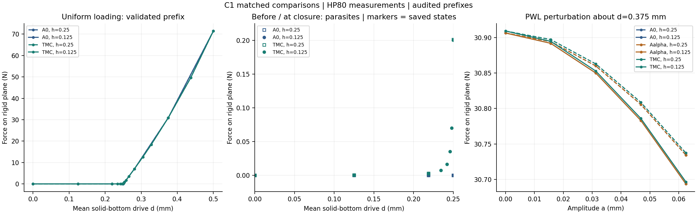
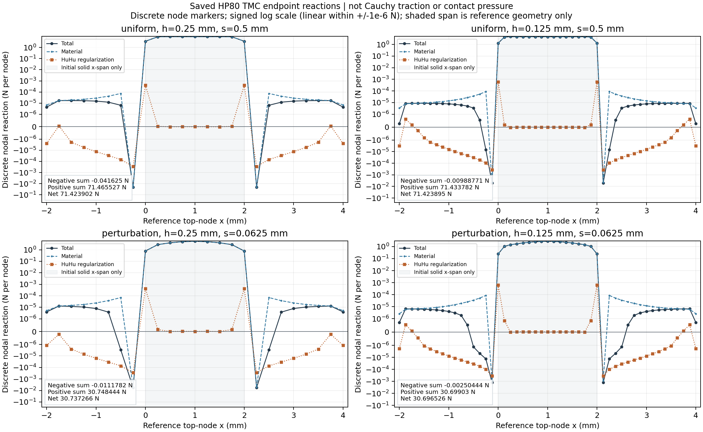

# HF4-C1：共同任务配对、状态交接修正与独立验证

日期：2026-09-20。**本次预定的四条均匀与六条非均匀路径已完成，并通过修订后明确记录的独立审计。一般接触验证及整个 HF 项目仍未完成。** 稳定发布保持 0.5.0；本阶段是主分支源码中的实验扩展。

## 整体目标、当前任务与理由

整体目标是建立不依赖 LF 工作目录的独立有限变形/接触力学评估器，使机构响应具有明确的任务、单位、符号、有效范围和可复核证据。最终需要区分输入可读、几何合格、数值平衡、接触模型精度和机构功能。HF0–HF4-B 历史不因本轮扩展而改写；[C0 研究集成报告](HF4_C0_RESEARCH_INTEGRATION.md)记录了新上传研究的阅读、取舍与受限实体参照准入。

C0 尚未完成同任务的 A0/TMC 比较。C1 将单实体、正初始间隙、自由横向变形与同一底边运动放在共同任务中：先完成两网格的 A0/TMC 均匀驱动，再从相同平均预压位置继承，比较 A0、Aalpha 和 TMC 的非均匀响应。Aalpha 是实体正则化诊断，不是新的物理真值。

两级网格使用同一连续分段线性边界迹，消除了 C0 二次 profile 在不同 Q1 网格上的离散平均差异。TMC 的外区底边也被驱动，这一模型边界条件明确记录，不能把外区反力当成实体接触力。刚面比数值顶边宽，并逐态检查覆盖。

## 预先合同与实现对照

完整[物理协议](../hf_repo/configs/contact_c1_v1.json)及[解释](HF4_C1_PROTOCOL.md)在 FE 前写定。实体为 2×1 mm，厚度 1 mm，初始间隙 0.25 mm，E=100 MPa，nu=0.3；h=0.25/0.125 mm，alpha=gamma=1e-6，Lref=2 mm。扩展 TMC 域宽 6 mm 不改变 Lref。A0 无正则项，Aalpha 为仅实体且使用相同正则系数，TMC 全域正则系数不乘 gamma。

| 工作 | 实现 | 为什么需要 |
|---|---|---|
| 显式几何 lift origin、两数组初态及阶段零参数再平衡 | [split_affine.py](../hf_repo/src/hf_eval/split_affine.py) | 不把宏观位移与微小修正合并舍入；支持有来源的预压继承 |
| 共同任务、零均值 PWL、显式 Lref 与分组 | [contact_c1.py](../hf_repo/src/hf_eval/contact_c1.py) | 防止域宽、边界迹或侧向约束变化混入模型比较 |
| 新增固定约束的显式状态交接 | [contact_c1_activation.py](../hf_repo/src/hf_eval/contact_c1_activation.py) | 正确表达接近→闭合时约束集合改变，并保留原自由分量 |
| 阶段保存、来源完整链、失败证据和外部预算 | [R2 runner](../hf_repo/scripts/run_contact_c1_r2.py)、[隔离执行](../hf_repo/scripts/run_contact_c1_r2_isolated.py) | 求解成功与数据完整性分别可查；原失败不被覆盖 |
| 独立高精度、分项内力/Jv、精确有理数几何及有效前缀 | [audit_contact_c1.py](../hf_repo/scripts/audit_contact_c1.py) | 不依靠生产 success 标志或四舍五入后的显示位移验收 |
| 同坐标比较与可视化 | [最终摘要脚本](../hf_repo/scripts/summarize_contact_c1_r2.py) | 明确原始目标、共同补步、近零分母和网格敏感性 |

原生产材料内核、旧 prescribed/split controller、旧 HP helper 以及先前发布证据未修改。C1 的新文件均有来源哈希。数据与代码均为普通文件；不调用 LF、附件中的优化脚本或 MATLAB。

## 实际问题、排查与取舍

1. **约束激活交接。** 首次 A0 接近阶段完成四态，但顶面作为旧自由 DOF 保存了约 1e-32 mm 的非零 fluctuation；闭合阶段新增固定约束要求严格零值，原逐位继承合同发生冲突。独立 50/80 位固定状态诊断证明：仅投影新增固定分量的最大改动为 6.779e-32 mm，其他分量逐位不变，新阶段 HP 残差约 2.193e-17。采用显式投影并记录 DOF、改变量和前后哈希；新阶段仍独立再平衡。原失败和原 runner 保留，另加 R2 runner，见[完整排查](HF4_C1_ACTIVATION_REPAIR.md)。
2. **近零参考力的算术精度。** 原 50/80 位材料分量比较未通过预定 1e-40 门。相同状态、尺度与公式的 80/120 位诊断通过，生产求值检查也通过。增加[明确的精度补充协议](../hf_repo/configs/contact_c1_precision_r2.json)，统一对全部选定状态使用 80/120 位；80 位仍为测量权威。原协议和门槛不改，50/80 失败审计分别保存，见[精度排查](HF4_C1_PRECISION_AUDIT.md)。这不是把更高精度结果冒称为 50/80 通过。
3. **近零分母的派生摘要。** 初版摘要把名义闭合点 A0 的约 1e-29 N 残余力作为相对差分母，产生没有物理解释的巨大百分比。最终 `summary_v2` 将 A0 零力参考分支的相对指标标为 null 并注明原因，保留原始力与绝对差；原 `summary_v1` 不覆盖。寄生力图只绘真实存盘点，避免两网格补步数量不同造成连线插值误读。求解与审计数据未因此改变。

所有修订均有计算前的选择记录：[路径选择](../hf4_c1_results/selection_v1.json)、[执行补充](../hf4_c1_results/execution_amendment_v1.json)。实际 11 次路径尝试对应 10 个逻辑组合，原初始化失败计入尝试数。四条均匀路径共同通过后才记录[准入](../hf4_c1_results/uniform_admission.json)并启动六条非均匀路径。

## 验证结果与实际效果

权威汇总为 [summary_v2/summary.json](../hf4_c1_results/summary_v2/summary.json)，原始逐态证据在 [hf4_c1_results](../hf4_c1_results/README.md)。

| 项目 | 实际结果 |
|---|---:|
| 选定均匀路径 | 4/4；50 个接受状态（含阶段起点及二分补步） |
| 选定非均匀路径 | 6/6；30 个接受状态 |
| 正式状态及逐态数值门 | 80 态；2516/2516 通过 |
| 原失败的已完成接近前缀 | 另 4 态有效，但整条原运行仍为中止/未通过 |
| 含上述旧前缀的逐态数值门 | 2644/2644 通过补充精度审计；不把它算作第 11 条成功路径 |
| 相关控制器、任务、交接、来源与审计测试 | 173/173，通过记录见[测试收据](../hf4_c1_results/tests_final_receipt.json) |
| 80 位相对残差最大值 | 4.36291e-10，门槛 1e-9 |
| 生产总内力与 80 位相对差最大值 | 5.13029e-12，门槛 1e-11 |
| 生产总 Jv 与 80 位相对差最大值 | 7.54412e-12，门槛 1e-10 |
| 80/120 位材料分量相对差最大值 | 1.23279e-53，门槛 1e-40 |
| 约束误差 | 所有正式态为零；平均读出量的有限表示误差另记 |
| 最大实体—障碍交面积 | 约 1.00534e-31 mm²，低于 1e-12 mm² 门；不能改称严格数学零 |

最接近门槛的分项是细网格 Aalpha 在零非均匀幅值处的正则内力求值比较：约 9.89944e-10，对应门 1e-9。它处在接近零正则力的分量底值尺度，已通过但裕量小；报告保留这一事实，不放宽尺度或据此承诺任意平台重算结果相同。非零幅值处另有真实非零正则内力及切线覆盖。

累计外部求解进程耗时约 62.17 秒，求解加审计进程约 152.11 秒（为各进程耗时之和，不是并行工作的墙钟历时，也不含测试和固定状态诊断）。原失败亦计入，低于修订后仍保持的 7000 秒求解预算。

## 模型比较告诉了什么

细网格均匀任务在 d=0.125/0.21875 mm 时，TMC 已有约 0.0003901/0.0031096 N 的寄生反力，而 A0 的接近分支为零。在名义闭合 d=0.25 mm，TMC 约为 0.20059 N；这里应看绝对力，不能除以零参考。压紧后的三个原始共同目标 d=0.28125、0.375、0.5 mm，TMC−A0 相对差约为 0.1261%、0.00906%、0.00256%。压紧后净力接近并不等于闭合转折准确。

非均匀加载保持平均预压 d=0.375 mm，幅值增加至 0.0625 mm。细网格末态 A0 为 30.69357970 N，Aalpha 为 30.69358071 N，TMC 为 30.69652578 N。TMC−A0 约为 0.00960%；Aalpha−A0 的观测差约为 1.01e-6 N。该差值不能直接替换为独立物理误差上界。

非均匀末态的两网格净力差约为 0.133%，大于同网格上的 TMC−A0 差异。与此同时，配对模型差本身跨网格仅改变约 1.87e-5 N；不能把单模型网格差直接当成配对差的误差棒。这里只做两级敏感性观察，不宣称网格收敛。摘要同时记录双方共同接受的补步点；它们不是新增原始目标，也没有插值生成数据。

[独立残差与材料/正则分量图](../hf4_c1_results/summary_v2/c1_precision_and_components.png)和[实际比例变形图](../hf4_c1_results/summary_v2/c1_last_accepted_deformation.png)可对照每个存盘状态。图上的舍入坐标仅供显示，精确几何审计使用坐标、lift 和 fluctuation 的有理数和。

## 当前限制与下一步

已通过的是本次限定任务的数值与几何准入。A0/Aalpha 的全接触乘子非负条件通过；TMC 顶边则是介质的位移边界，其离散节点法向反力存在负项。例如均匀末态 d=0.5 mm，细/粗网格负项合计约为 −0.00989/−0.04163 N。净总力接近可以掩盖正负抵消，不能将 TMC 的这些节点反力直接称为经过单边接触互补性验证的接触压力。材料与正则分量各自也不是独立平衡的物理系统。

已完成[四个 TMC 末态的局部反力诊断](../hf4_c1_results/local_reaction_diagnostic.json)，由[可复读脚本](../hf_repo/scripts/diagnose_contact_c1_local_reactions.py)读取已核验的 HP80 数组，未增加 FE 求解。四态共有 18 个负节点，全部位于初始实体 x 跨度 [0,2] 之外；这只是参考位置分类，不能据此宣布其不在实际接触区。细网格非均匀末态的负项合计约 −0.00250444 N，粗网格约 −0.01117824 N。材料与正则分项已经分别保存，不能仅凭总量把负项全部归因于正则项。

细网格 Aalpha/TMC 非均匀末态的正则节点内力范数约为 3.09126e-5/0.00134346 N，正则 Jv 范数约为 0.00642040/0.149673；两者均有实际非零覆盖。全顶面正则合力接近零来自节点项抵消，不表示正则项无效。这些离散向量范数依赖基函数与测试方向，不是物理压力或完整算子范数。

下一步应先利用已存位移/应力场，区分离散节点反力、边界材料牵引和正则边界贡献，再据此冻结有限的背景边界与网格单因素判别。具体先核查负项对应的单元、积分点和虚功平衡，随后分别改变一个边界或网格因素，保持物理输入及原门槛；不得同时调 alpha/gamma 追求净力吻合。依据因果证据，再决定一般部分接触/分离再接触参照的实现范围。此阶段不启动真实夹持器、1800 设计池、排名或 HF5，也不把 TMC−Aalpha 命名为纯接触误差。

最后的[独立全量复核](../hf4_c1_results/independent_final_review.json)核对了 279 个来源文件、504 组分量误差与 16,928 个单元几何，未发现数据链或数值准入阻塞；旧失败未被改记为成功。

后续开发应从本报告、证据 README 和最终机器摘要开始。原 0.5.0 wheel 不含这些新增源码；使用仓库源码与现有依赖锁。完整目录树可搬迁到另一台电脑和另一工作目录；本阶段的相对证据链要求源码与结果保留在同一可相对寻址的目录树中。搬迁后的独立读回与 GitHub 发布回执另行记录，不冒充新的 FE 路径验收。
