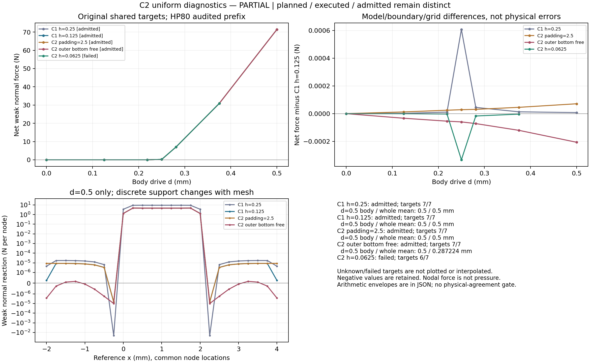
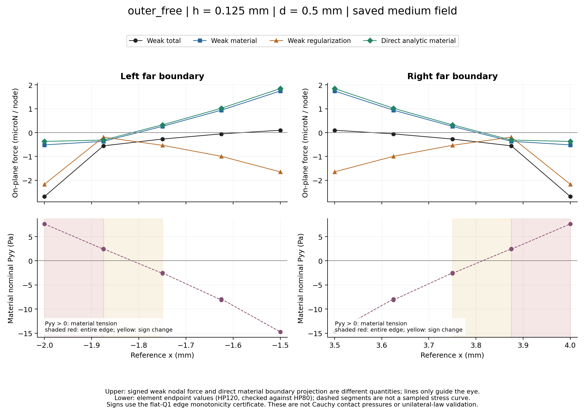
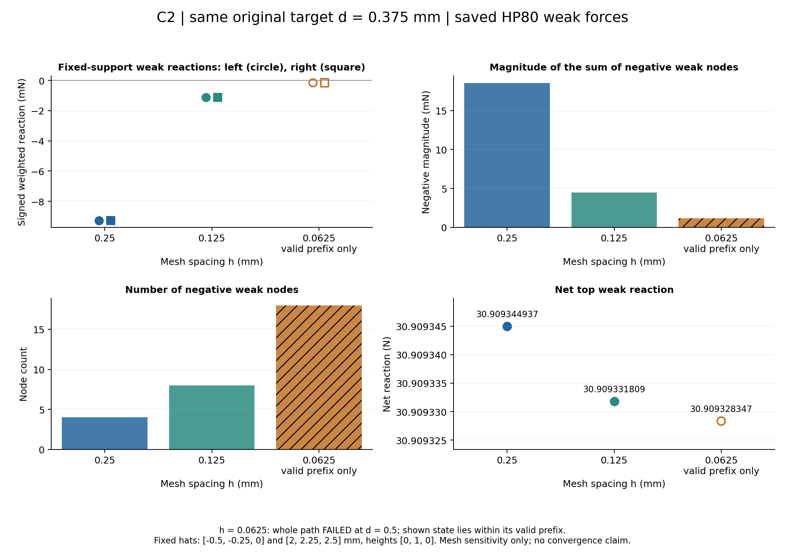
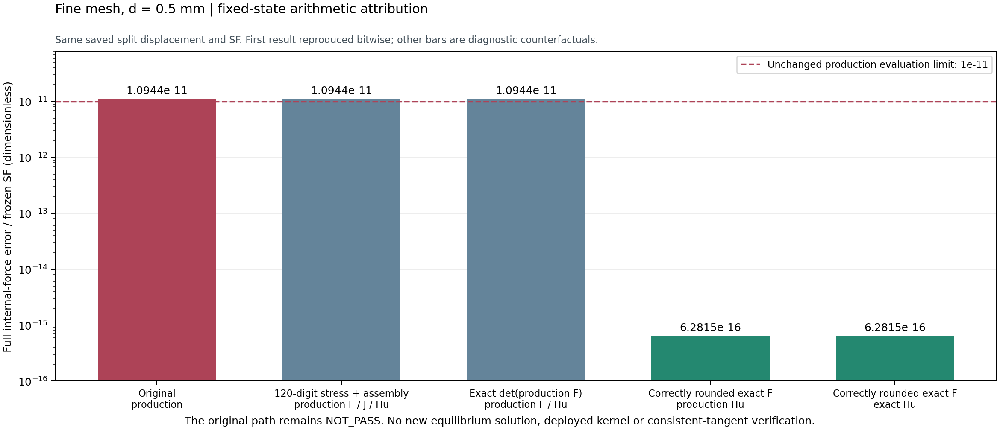

# HF4-C2：局部负弱式反力的排查与单因素诊断

日期：2026-09-21。承接 [HF4-C1 最终报告](HF4_C1_FINAL_REPORT.md)，本轮回应用户“认真排查问题”的要求。整体目标仍是建立独立于 LF、具有完整数值证据链的 HF 力学评估器，并最终在共同物理任务下评价柔顺机构；本轮针对的是 TMC 已保存状态的局部负节点反力，不进行优化更新、真实夹持器或设计池排名。

**当前结论：两条新边界对照路径通过，细网格路径末态不通过；新 FE 已停止。除澄清局部反力的读数语义外，还实际定位到了强压缩背景单元中变形梯度浮点求和的精度问题。稳定内核尚未据此修改，不能宣布 C2 全部验收或进入 HF5。**

## 本轮要回答的问题

C1 的净反力和受限接触参照较接近，但四个 TMC 末态出现 18 个负顶边节点反力。需要区分四类可能原因：实现符号/导数/装配错误；弱式节点读数与直接边界牵引的区别；背景域和外底边条件；网格与积分分辨率。为此先做保存场重装和公式推导，再冻结三项单因素均匀路径；所有原始正负值、失败记录、源代码身份和执行前版本均保留。详见[排查计划](HF4_C2_DIAGNOSTIC_PLAN.md)、[预先解释规则](HF4_C2_INTERPRETATION_RULES.md)和[证据入口](../hf4_c2_diagnostics/README.md)。

## 保存场和公式核查

独立 80/120 位算术重建四个 C1 末态的 F、J、材料第一 Piola 应力、位移 Hessian、材料与 HuHu 正则内力、装配和六组虚功。四态共 412 项代数检查通过。制造场、精确有理数单元算术和两单元界面检查亦通过，在已核查范围内没有发现需要修改旧有限元内核的符号、导数或装配错误。[公式审查](HF4_C2_FORMULATION_REVIEW.md)列出了具体公式、源文件与独立证据。

对原四态的 144 条顶边，均能利用 Q1 平顶边结构和端点单调性证明整条边材料法向名义应力为压缩。18 个负弱式节点反力所对应的直接材料边积分投影全部为正。因此，原始负弱式节点反力不能直接解释为这些保存场上的材料拉应力。

材料弱式节点力与直接边界牵引投影之间的差额，主要由离散应力重构的体项解释。这里的 Pᴵ 是单元九个 Lobatto 应力样本的双二次插值，不是连续非线性应力场；其散度项及内部界面项构成独立核对的离散恒等。少数较小负总节点力还包含正材料节点力被负正则节点项超过的情形。材料与正则分项各自都不是独立平衡系统。

完整顶面正则合力及其 Jv 抵消是矩形 Q1 离散的代数恒等：同一上边单元两节点对应项相消。这不表示局部正则力为零或正则项无效，也不等于连续高阶边界条件已验证。不能把含 HuHu 的广义边界力直接替换为普通材料牵引。

## 边界积分的实际问题及补充

原 Gauss 32→64 阶观察未达到预先规定的 1e-8 判别标准。强变化集中在实体参考侧缘附近的顶边，不能仅凭使用了高阶积分就宣称收敛。旧结果完整保留于 [fields_001](../hf4_c2_diagnostics/fields_001/summary.json)。

随后利用平顶 Q1 场的 Fxx 沿边常数、Fyx=0、Fyy 沿边线性的性质，解析计算材料法向牵引两个一阶矩，并为近常数梯度采用稳定级数。80 位和 120 位分别从原始 binary64 双数组独立重建，44 项检查通过，最大规范化跨精度差约 3.69e-74。级数尾项控制不包含有限精度舍入的严格区间界。[解析积分证据](../hf4_c2_diagnostics/analytic_edge_001/summary.json)与旧观察并列保存。

| 原 C1 末态 | 弱式顶面净力 / N | 保存 Q1 场的解析材料边积分 / N |
|---|---:|---:|
| 均匀 h=0.25 | 71.42390220 | 71.19491656 |
| 均匀 h=0.125 | 71.42389460 | 71.44746983 |
| 非均匀 h=0.25 | 30.73726570 | 30.99009187 |
| 非均匀 h=0.125 | 30.69652578 | 30.81456341 |

这两列测量的离散对象不同，差值不能命名为纯接触误差。解析积分解决的是保存场直接法向边积分的分辨率问题，没有更改原体积分、平衡解或 C1 准入。原四态 Gauss64 法向节点投影相对解析结果的向量误差依次约 1.48e-5、3.12e-6、1.60e-6、2.83e-8，均大于 1e-8。

## 执行控制修复与版本记录

在首条新 FE 之前，代码审阅发现串行继续门只看 `audit.json.status=pass`，没有同时核查审计进程是否成功结束及其证据是否变化。这可能在“报告已经写出、进程随后失败或超时”时错误地继续。现已要求 solve/audit 两份回执的身份、协议、退出码、超时与日志哈希正确，并绑定审计文件、全部输入和逐状态详情，任何不一致即停止。[执行门审查](HF4_C2_EXECUTION_GUARD_REVIEW.md)记录了原问题和修复复核。

实际使用 [v3 协议](../hf_repo/configs/contact_c2_v3.json)。v1、v2 没有执行新 FE，均保留为执行前修订记录：v1→v2 加强直接审计来源校验与弱反力语义；v2→v3 修复串行停止门。物理参数、三个算例、顺序、容差和预算始终未变。最终 103 项定向预检通过，包括审计写出 pass 后退出失败、超时、缺回执及文件变化的拒绝用例；33 个实现文件、166 个输入证据和三个模型独立重建通过[执行前复核](../hf4_c2_diagnostics/pre_execution_review_v3.json)。

各路径保存无损压缩的完整控制器历史和接受记录、原始双数组、模型与独立逐状态审计。新增明确的弱式反力别名保留兼容字段原值，没有截断负值或以牵引积分替换原 `normal_force`。

## 三条路径的实际结果

| 单因素任务 | 保存态 / 通过态 | 独立检查通过 / 总数 | 完整路径 |
|---|---:|---:|---|
| h=0.125，padding 从 2 改为 2.5 | 19 / 19 | 589 / 589 | 通过，7/7 原目标 |
| h=0.125，仅实体底边驱动，外底边自由 | 19 / 19 | 570 / 570 | 通过，7/7 原目标 |
| 原边界，h 从 0.125 改为 0.0625 | 21 / 20 | 650 / 651 | 不通过，6/7 原目标可比较 |

共三次新求解，59 个存盘状态，58 态通过；1810 项检查中 1809 项通过。这些总数包含表中子范围，不能再次相加。细网格前 20 态的有效前缀止于 d=0.4375 mm，其中有六个原始目标；最后的 d=0.5 mm 不进入正式模型比较，不能插值或使用求解器的 success 掩盖独立审计失败。[汇总](../hf4_c2_diagnostics/summary_001/summary.json)明确标为 `partial`，该 run 仍为 `failed`。

外部求解进程累计约 59.10 秒，独立审计约 295.22 秒；失败审计也计入，均低于冻结预算。不包含测试和保存场诊断。最终 103 项预检与 17 项汇总回归是不同测试集合；旧 62/94 项预检不再累加。

在共同 d=0.5 mm，原 h=0.125 路径、扩大域路径、释放外底边路径的弱式净力依次为 71.42389460、71.42396587、71.42368811 N；负项合计依次约 −0.00988771、−0.00992800、−0.00986711 N。改变背景域或外底边没有消除主要负项。两因素分别造成约 +7.13e-5、−2.06e-4 N 的净力差，均大于两态合计约 2.21e-9、2.04e-9 N 的数值求值包络，因此差异可分辨，但该包络不是离散或物理误差棒。

释放外底边时，实体底边均值仍是 0.5 mm，整底边均值约 0.28722396 mm，后者按协议只作观察。实际驱动方向的广义力中正则分量约 1.62369e-5 N，而完整顶边正则合力仍代数抵消。两种虚位移方向不同，不能混称同一边界功。

两条已完整通过的新路径进一步做了保存场与解析边积分诊断，分别共 206 项及 22 项检查通过。扩大域的 56 条顶边均有材料压缩证据；外底边自由时只有 44/48 条满足整边压缩条件：远端两边整条为拉应力，相邻两边端点夹号，最大端点 Pyy 约 +7.63394e-6 MPa。解析材料投影在参考 x=−2、−1.875、3.875、4 的四节点为负，合计约 −1.36479e-6 N。[新保存场](../hf4_c2_diagnostics/fields_experiments_001/summary.json)与[解析证据](../hf4_c2_diagnostics/analytic_experiments_001/summary.json)保留了这一反例，不能把原四态的“全顶边材料压缩”推广到新边界。

该自由边界末态共有 24 个负弱式节点，只有上述四个同时具有负直接材料法向投影；其余负弱式值仍需按离散体项、界面和正则分项理解。材料名义拉应力不是已经验证的真实接触压力，但它说明局部材料场也对远端边界条件敏感。

细网格比较仅使用有效共同原目标，例如 d=0.375 mm：

| h / mm | 弱式净力 / N | 负项合计 / N | 固定左帽函数虚功系数 / N |
|---|---:|---:|---:|
| 0.25 | 30.90934494 | −0.01853264 | −0.00926629 |
| 0.125 | 30.90933181 | −0.00444914 | −0.00111697 |
| 0.0625（有效前缀） | 30.90932835 | −0.00115351 | −0.000159408 |

帽函数在参考 x=−0.5、−0.25、0 取 0、1、0，各网格使用同一函数而非同一节点编号。数据支持所观察负项随网格细化减弱；不能由三网格及不完整细网格路径宣称连续收敛或单边接触互补性成立。新边界场诊断的冻结读取器要求整条 run 通过，故没有对失败细网格 run 的有效前缀绕过准入调用该诊断；未使用候选 manifest 仍保留。

## 细网格末态失败的因果定位

唯一失败门是生产总内力与独立 HP80 总内力的求值一致性：误差范数约 1.95625783e-10 N，冻结尺度 SF=17.8755023988 N，规范化值 1.0943792164e-11，超过 1e-11。它是完整内力向量的求值误差，不是净顶面力的相对误差，也不是平衡残差门。其余末态检查仍通过，不能据此取消唯一失败项。

[独立空间诊断](../hf4_c2_diagnostics/mesh_force_failure_diagnosis.json)显示材料分量支配误差，正则分量差仅约 2.72e-17 N；误差平方范数约 98.16% 在自由 DOF，78.74% 在间隙内部、19.43% 在参考实体顶面。HP80/120 总内力差仅约 3.77e-78 N，因此问题不在高精度参考的消去。强压缩背景单元 J 约 2.08e-5 时，约 7.53e-16 的保存 J 绝对差可放大为约 3.63e-11 的相对差。

为进一步区分原因，固定失败态，不进行 Newton 更新或新 FE，先位级复现原生产 `tangent=True` 总力，再进行[分段算术对照](../hf4_c2_diagnostics/force_precision_001/summary.json)：

| 同一状态的诊断计算方式 | 总内力误差 / 原冻结 SF |
|---|---:|
| 原生产结果 | 1.09437922e-11 |
| 保留生产 F/J/Hu，仅本构和装配用 120 位 | 1.09438193e-11 |
| 再以生产 F 精确重算行列式 | 1.09438147e-11 |
| 改用精确双数组 F 的正确 binary64 舍入，仍保留生产 Hu | 6.28151932e-16 |
| 同时采用精确双数组 Hu | 6.28150347e-16 |

独立“给定 F/J/Hu→力”公式与原 HP120 保存参考一致。提高后续本构、装配或单独行列式计算精度都没有消除主差；改善 F 求和使误差下降约四个数量级，给出明确的算术归因。在当前 dyadic Q1 算例中，对恒等项及八个 lift/fluctuation 梯度乘积使用 `math.fsum`，全部 69,120 个 F 分量都与精确结果的正确舍入一致；原生产 F 有 6,690 个分量不同。这只是保存场上的诊断观察，不证明任意梯度的乘积精度、JAX 可微实现或切线一致性。

旧 split 表示保护了节点位移的小增量，但当前 `F=(I+grad(lift))+grad(fluctuation)` 仍可能在各分量及求和中丢失强压缩小量。不能通过提高 HP 位数、放宽力门、改变 gamma/alpha、把生产内力替换成 HP 值，或仅重复一次路径来视为修复。也不能把本次临界失败简单称为随机波动：固定状态的原结果已经位级复现，分段对照定位了主差来源。

## 辅助输出清单修正

交付检查发现 `summary_001/output_sha256.json` 在创建自身后枚举目录，误把自身空文件的 SHA 写进清单。其余七个科学 JSON/图表条目全部匹配；原科学汇总和力学状态不受影响。原文件、旧汇总脚本均保留，用[补充清单](../hf4_c2_diagnostics/summary_manifest_amendment_001/amendment.json)绑定旧清单实际字节和全部七个输出，不能把旧自条目称为有效。原最终数据复核绑定了科学 `summary.json`，并未覆盖该辅助清单的自条目；补充核查另行记录。

后续汇总使用新增 [summarize_contact_c2_r2.py](../hf_repo/scripts/summarize_contact_c2_r2.py)：复用冻结科学提取和绘图逻辑，在创建清单之前完成文件枚举及哈希，并绑定新入口。两项针对性存储回归通过，没有重跑科学汇总或 FE，也没有覆盖历史输出。

[清单补充复核](../hf4_c2_diagnostics/summary_manifest_review.json)确认了原错误范围、七个正确输出、新补充绑定和无自引用写入顺序。它是独立的存储完整性检查，不改变力学准入。

## 当前停点与后续工作

局部负读数的语义、离散恒等和边界影响已有可核查解释；执行停止门漏洞已经修复；新发现的强压缩 F 求和精度问题已定位但尚未部署修复。原 C1/C2 数据与旧内核均未改写，细网格末态仍不通过。

下一步先按[稳定运动学修复计划](HF4_C2_KINEMATICS_REPAIR_PLAN.md)建立可微、可审计的新算术实现，在固定失败态及制造场核对力和一致切线，再冻结新版本和补测路径。当前不继续新 FE，不开展 HF5、一般主动集、真实夹持器或排名。体积分阶数对保存场的影响、连续高阶边界条件与部分接触参照也仍是后续问题，不能由本轮局部结果自动解决。

所有新增源、冻结协议、运行/失败、保存场诊断、可视化与复读入口按相对目录关系交付。旧 0.5.0 标签和 wheel 不变；新增研究模块使用源码。移目录复读证明的是来源链和文件可移植性，不冒称跨平台力学复现。

[最终独立复核](../hf4_c2_diagnostics/independent_final_review.json)核对 420 个输入文件、两条 C1 基线与三条新路径合计 93 态、71,000 个单元的精确几何及 558 组分项误差重算，并从归档向量重算算术分段结果。复核一致性通过，明确保留 `mechanical_status=partial`；它没有将细网格末态升级为准入。新已通过状态中最接近总力求值门的是扩大域末态，值约 6.93904e-12，仍低于原 1e-11 门。
