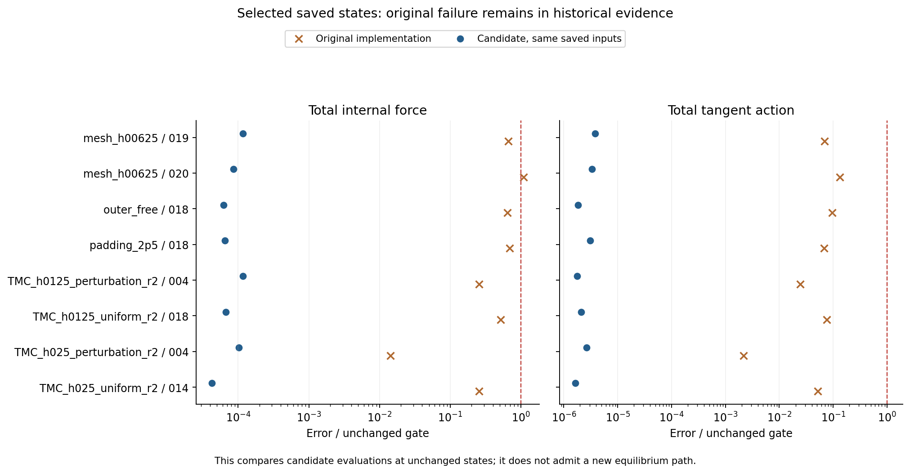
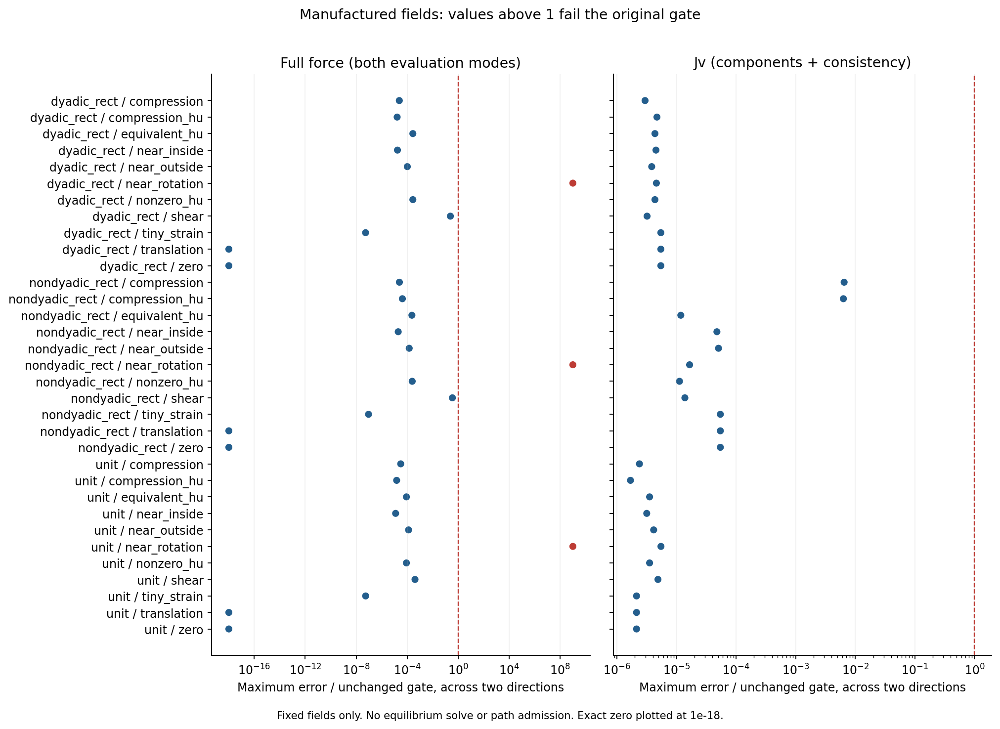
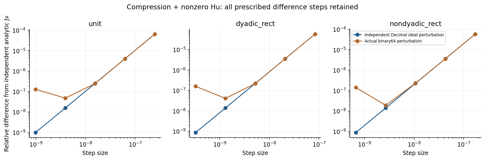

# HF4-C2：P1 后续独立复核与当前状态

2026-09-27。用户要求先修复 P1 完整启动合同，再验证稳定 F、完整内力与一致切线。本轮完成该顺序的独立复核和计算；**P1 已通过，稳定 F 修复在选定保存态有效，但完整制造场验收仍未通过。没有新增平衡路径，没有变更历史失败判定。**

## 目标、已有工作与本轮作用

整体目标是为 LF/N4 研究层提供独立、物理任务明确且可审计的 HF 评价。本阶段解决启动合同缺口，并确认强压缩 F 浮点消减修复是否同时保住完整内力与真实残差导数。正确读入几何、求解收敛、独立精度和接触物理仍是不同的资格条件。

本地工作从冻结基线 `7fea2e44b67d0eff421219ebbcac68c506fb9d2f` 继续。开始时核对了 2026-09-21 的 P1 冻结测试回执和当前四文件身份，随后运行数值验证。同步 GitHub 时发现主分支已由另一轮工作推进到 `7e007ca93a2ea776939c58cdcb1637fbac406cfe`，包含相同 P1/候选内核和更广保存态验证。本轮因此按独立复核接入该主分支，已有运行目录和报告保持原件。

三份配套说明分别回答具体问题：

- [P1 实现与验收](HF4_C2_P1_IMPLEMENTATION_AND_VALIDATION.md)：为何前置完整合同、校验顺序、代码与测试对应、公开克隆的来源缺失边界。
- [独立结果对照](HF4_C2_INDEPENDENT_RECONCILIATION_20260927.md)：与主分支哪些源码、检查值和数组完全相同，哪些仅为已有结果引用。
- [制造场失败分析](HF4_C2_STABLE_F_FAILURE_ANALYSIS.md)：直接观察到什么、哪些因果贡献仍待隔离，以及下一步最小研究计划。

## 实际验证与证据

| 检查 | 本轮结果 | 可核对入口 |
|---|---|---|
| P1 冻结测试身份 | 279/279 通过，零跳过；本轮复核当前源码及回执全部哈希，未把重复读取算作新增测试 | [根复核回执](../hf4_c2_p1_validation/root_acceptance.json)、[原测试回执](../hf4_c2_p1_validation/tests_002/receipt.json) |
| 新算术单测 | 28/28 通过；实际 JAX 编译接受严格 CPU 选项 | [arithmetic_001](../hf4_c2_independent_recheck_20260927/arithmetic_001/execution_receipt.json) |
| 制造场 | 11 类 × 3 网格 = 33 例，30 通过；各有两个方向，三例 near_rotation 的力失败 | [manufactured_001](../hf4_c2_independent_recheck_20260927/manufactured_001/results/summary.json) |
| 首次保存态读取 | 输入绑定阶段 `KeyError: record_file`，0 态；完整保留，未计为力学失败 | [saved_001 异常](../hf4_c2_independent_recheck_20260927/saved_001/results/exception.json) |
| 修正读取后的保存态 | 8/8 通过：两个细网格态、两条边界路径末态、四个 C1 TMC 末态 | [saved_002](../hf4_c2_independent_recheck_20260927/saved_002/results/summary.json) |
| 集成到当前主分支后的验证 | 8/8 通过；保留主分支的同输入旧内核对照，检查值与本轮前次计算一致 | [集成复验](../hf4_c2_stable_f_validation/independent_saved_20260927_001/results/summary.json) |
| 原始数据保留 | 原 237 个 hf_repo 文件、395 个几何文件和资产索引字节未变 | [保留检查](../hf4_c2_p1_validation/baseline_after_validation.json) |

本轮原树四次数值进程共约 63.21 秒，包括失败的读取尝试；集成复验 36.34 秒，本轮共 99.56 秒；精确时间、900 秒上限、退出码、环境与运行前源码快照见各自回执。所有进程都未请求 Newton 或平衡路径。机器可读汇总在[复核摘要](../hf4_c2_independent_recheck_20260927/acceptance_summary.json)。

主分支此前的 63/63 保存态及两次 1291 项全量测试是**已有证据**，本轮没有重新执行全 63 态或全量测试。它们不能与本轮重叠的 8 态相加。本轮新增的源代码变更仅是验证脚本的 C1/C2 来源绑定，P1 和两候选力学模块与主分支逐字节一致。

## 稳定 F 的效果与完整力边界

原细网格末态保持同一个存盘双数组和 SF：

| 指标 | 原审计 | 候选复算 | 门槛 |
|---|---:|---:|---:|
| 完整总内力误差 / SF | 1.0943792164e-11 | 8.6076851729e-16 | 1e-11 |
| 完整总 Jv 相对误差 | 1.3351963959e-11 | 3.3435048983e-16 | 1e-10 |

该结果支持强压缩 F 求值问题已在这个保存态得到改善；不把原路径重新标为通过。材料、正则、总力均单独比较，返回 `K@v`、实际残差 JVP、独立 HP 解析 Jv 交叉核对，切线未强制对称。

制造场的三个近转动失败不能据此略过。其总力误差/SF 为 `1.323e-8` 至 `7.610e-8`，超过 `1e-11`；材料分量误差约为 1，另外两个矩形网格的极小正则力也失败。F/G 已在约半 ulp 内，生产 J 为 1，而输入权威的 HP J（以单位网格首积分点为例）约为 `1+6.84e-17`；直接 `log(J)` 与应力相减会丢失小量。Hu 也有独立的信息损失。

这说明**当前单个 float64 F/J 加直接本构表达式的完整力计算不够**。旧新内核同样失败并不证明“任何 binary64 算法均不可能达标”；补偿展开、稳定不变量和代数等价应力表达式仍需研究。近旋转的浮点节点输入也不是数学上恰好无应变的刚体态，不能直接将其力归零。

制造场 66 个方向的解析切线检查全部通过。12 条独立 Decimal 中心差分曲线在步长每缩小四倍时误差约缩小十六倍，支持二阶趋势；强压缩最小步长误差仍约 `9e-10–1.4e-9`，并未独立达到 `1e-10`。实际 binary64 差分在小步长处上升，全部样本保留。图仅展示三个 compression_hu 的方向 0；完整数据含两个方向及 nonzero_hu。

## 代码取舍与可恢复性

集成时保留当前主分支验证脚本的 `legacy_control`。来源绑定改为按真实 schema 处理：C2 必须提供独立 record 哈希；C1 必须验证 completion 对 result/index/metadata 的绑定、成功状态、记录数量及选中 embedded accepted record。未知 schema 拒绝。计划新增 amendment 003，并将此前可选字段处理记录为历史修订。此项没有变动数值门、模型、SF、状态选择或内核。

[独立复核目录](../hf4_c2_independent_recheck_20260927/README.md)直接纳入本轮 JSON、NPZ、日志、源码快照和图，不依赖另一台计算机的原绝对路径。原始执行回执中的绝对路径是历史运行信息，保留原字节；用相对结构及哈希核对文件。主分支既有原始证据仍按 S0 资产恢复，冻结基线另以 `7fea2e4` 工作树提供给 `--baseline`，不能用后来修改的仓库清单冒充该基线。

## 接下来先做什么

先按[失败分析中的五阶段固定场归因](HF4_C2_STABLE_F_FAILURE_ANALYSIS.md)区分 F 舍入、J/应力算术及 Hu 对三例失败的贡献；必要时另命名实现稳定小不变量和 Hu 收缩候选，沿用全部原门复验。现有强压缩改善保留为有效结果，当前制造场失败永久保留。本轮没有冻结 v4、切换默认求解内核、启动新 FE 或进入 HF5。
