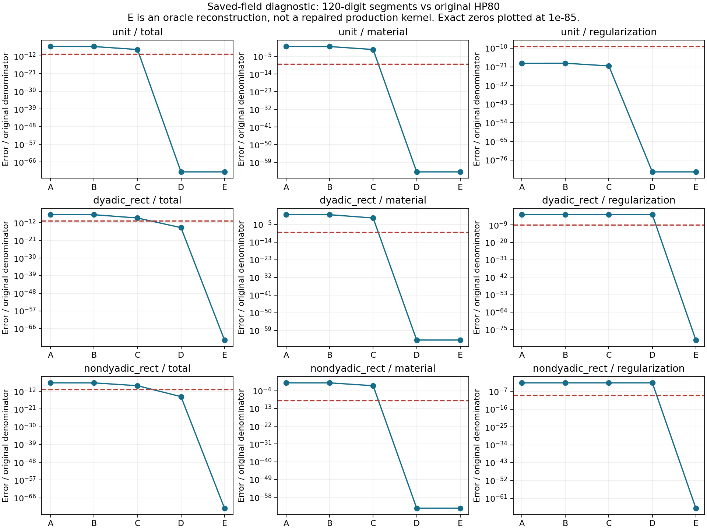
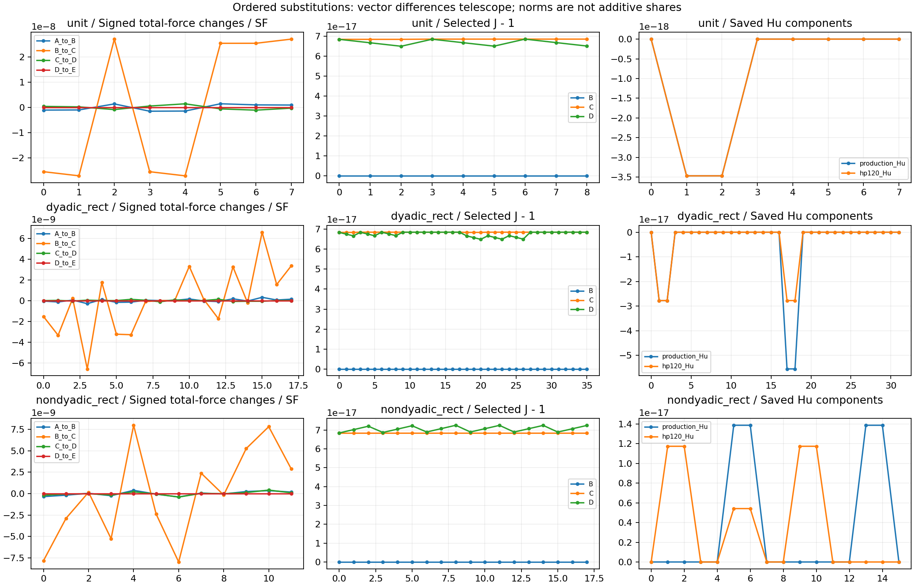

# 三个近旋转保存场：五段诊断执行报告

最新状态：本文依次保留诊断报告、当时拟定的候选卡及授权后的实际记录。**后续候选已实现但未验收，执行因 S0 单进程 300 秒上限而停止**，请接续阅读文末“候选卡实际执行结果”。下文诊断段落中的“没有新增候选”等表述仅对应先前诊断阶段。

2026-09-28。用户授权原文：“授权执行诊断卡”。一次有界执行完成，状态为 `diagnosis_complete`。本报告记录诊断结论；生产候选原来的三个制造场失败继续保留，没有新增生产内核或力学准入。

## 整体目标、本轮目的与实际范围

整体目标仍是建立与 LF 解耦、可异机恢复、任务定义明确且结果可独立核验的 HF 正向力学评估器。当前缺口是稳定 F 候选虽然改善了强压缩保存态，但三个近旋转制造场的完整力及两个矩形场的极小正则力未满足原门。不能用路径收敛、切线通过或力很小替代分项精度验收。

本轮把[历史失败分析](HF4_C2_STABLE_F_FAILURE_ANALYSIS.md)提出的五段比较实际执行，用保存的中间场区分哪些修复范围仍不足。仅使用 `manufactured_001` 中 `unit__near_rotation`、`dyadic_rect__near_rotation`、`nondyadic_rect__near_rotation` 的方向 0 静态资料。三个网格分别为 1/4/2 单元、8/18/12 DOF。方向 1、其他保存态和新的平衡路径均未运行。

本次新增两个诊断脚本和一个合成测试文件；未修改 `hf_repo/src`、默认内核、原 HP 参考、原门和历史报告。未启动 Newton、Jv/切线求值、HF5 标签、候选排名或依赖更新，未提交或推送。后续开发目录仍为 `.github_handoff/Compliant-TO-TMC` 的 `main`，origin 仍为 `https://github.com/dudaxing/Compliant-TO-TMC.git`。

## 预先冻结的诊断合同

[运行计划](../hf4_c2_stable_f_validation/near_rotation_segments_001/plan.json)在任何测试和 HP 求值之前落盘。所有执行阶段共用 300 秒墙钟额度；每阶段最多 60 秒；进程树 RSS 上限 2 GiB；失败即停止并保全，不重试或重置预算。实现和静态审查在执行前完成；报告撰写及事后只读核对不计作新的数值实验。

| 段 | 输入及实际操作 | 可回答的问题 |
|---|---|---|
| A | 保存的主生产调用材料力、正则力、完整力，逐值精确提升为 Decimal | 原失败与原归一化是否复现 |
| B | 保存的生产 F/J/Hu，独立 HP 本构与弱式装配 | 只提高已保存中间量之后的算术精度是否足够 |
| C | 生产 F/Hu，按指定精度从该 F 重算 J | 保留这份 F 时，使 J 与其一致是否足够 |
| D | 保存的 HP F/J，保留生产 Hu | 去掉 F 与一致 J 的中间量误差后剩下什么 |
| E | 保存的 HP F/J/Hu，独立装配 | 重构能否闭合至保存的 HP 力；Hu 替换是否解释剩余正则缺口 |

每段分别保存 80/120 位结果。首先完成**所有三例**的 E 闭合及冻结旧参考重构，再进入 B–D。HP 输入直接解析 Decimal 字符串；生产数和原始积分/材料算子按 `Decimal.from_float` 提升。原位移权威保持 `D(lift)+D(fluctuation)`。

B 明确用 `cofactor(F)/传入J`，不会通过通用逆矩阵操作隐式重算 J。B→C 同时影响 `log(J)`、逆转置的分母及 `exp(-5J)`，不能把这一段叫作孤立的 logJ 贡献。C→D 同时替换 F 和一致 J。D→E 只替换 Hu，材料力必须完全不变。相邻**向量差**可以望远镜相加，误差范数不能相加为独立贡献百分比。

三个案例沿用原 `SF=1.2500e-7 N`。总力误差分母为 SF；分量分母为 `max(norm(原 HP80 分量), 1e-12 SF)`。总力门为 `1e-11`，材料/正则分量门为 `1e-9`，参考重构和 80/120 一致性门为 `1e-40`，均未放宽。表格和图采用 120 位段结果对原 HP80 的固定分母比较；这与同精度参考重构的闭合检查是两件事。

## 实现与验证依据

- [独立场量装配器](../hf_repo/scripts/near_rotation_field_assembly.py)：仅标准库，接收 Decimal F/J/Hu；材料 `P=mu F+(lambda ln J-mu)cofactor(F)/J`，正则 `kr*weight*exp(-5J)*(Hessian:Hu)`。Hu 无积分点轴，原 weights 已含物理积分因子，不再乘几何/厚度。按原 connectivity 装配完整 DOF，固定 DOF 不删去。
- [有界调度与分段脚本](../hf_repo/scripts/run_near_rotation_segments.py)：冻结输入和源码、先参考闭合、逐段输出、绘图、资源记录及来源保全。A 使用主生产调用保存数组，未混入 force-only/JVP 数组，也未以两个分量浮点相加代替原完整力。
- [10 项手算对照测试](../hf_repo/tests/test_near_rotation_field_assembly.py)：零场、外供 J 不等于 det(F)、非对称 F 的转置、共享节点装配与平衡、完整混合 Hessian 收缩、Hu 线性及材料不变、低于 binary64 分辨率的 Decimal 信息、非法形状/数值/精度/原语。预期值来自手算，不借用生产内核。

[测试记录](../hf4_c2_stable_f_validation/near_rotation_segments_001/tests.log)：**10 passed in 0.15s**；测试子进程含启动时间约 0.735 秒。三例、两种精度的 E 装配与保存同精度材料/正则/总力误差均为 Decimal 零；冻结旧参考从原始 lift/fluctuation 重构的 F/J/Hu 和三向量也全部逐值闭合。

[参考闭合记录](../hf4_c2_stable_f_validation/near_rotation_segments_001/reference_closure.json)保留原 HP80/120 一致性检查。[各例 JSON](../hf4_c2_stable_f_validation/near_rotation_segments_001/cases/)保留全部段向量、场、门比较、相邻向量差及 80/120 一致性。所有分段一致性都通过 `1e-40`；最大归一差约 `2.99e-64`。向量差望远镜闭合最大归一残差约 `4.24e-120`。没有新增切线验收项。

## 实际结果及取舍

以下误差均为原定义的归一误差，显示位数仅为阅读方便，完整 Decimal 值保存在 JSON。

| 网格：总力误差/SF，门 1e-11 | A | B | C | D | E |
|---|---:|---:|---:|---:|---:|
| unit | 7.6098e-8 | 7.2634e-8 | 2.2177e-9 | 1.0370e-71 | 1.0370e-71 |
| dyadic_rect | 1.3233e-8 | 1.2638e-8 | 2.6448e-10 | 3.2224e-15 | 1.6010e-72 |
| nondyadic_rect | 1.9739e-8 | 1.8885e-8 | 6.8830e-10 | 1.9590e-15 | 5.6454e-72 |

| 网格：材料力归一误差，门 1e-9 | A | B | C | D / E |
|---|---:|---:|---:|---:|
| unit | 1.04762 | 0.999946 | 0.0305304 | 1.4277e-64 |
| dyadic_rect | 1.04652 | 0.999453 | 0.0209152 | 1.2661e-64 |
| nondyadic_rect | 1.04521 | 1.000000 | 0.0364473 | 2.9894e-64 |

| 网格：正则力归一误差，门 1e-9 | A | B | C | D | E |
|---|---:|---:|---:|---:|---:|
| unit | 1.0114e-19 | 1.3446e-19 | 3.5648e-21 | 9.9624e-84 | 9.9624e-84 |
| dyadic_rect | 3.2224e-3 | 3.2224e-3 | 3.2224e-3 | 3.2224e-3 | 2.3958e-82 |
| nondyadic_rect | 1.9590e-3 | 1.9590e-3 | 1.9590e-3 | 1.9590e-3 | 1.0674e-66 |

E 表中非零值来自 HP120 对原 HP80 的差别；E 对**同精度**保存参考的重构误差为零。

这些数据支持以下取舍：

1. **仅提高后续应力/装配算术精度不足。** B 的材料误差仍约为 1，三例总力仍失败。A→B 合并包含本构和装配算术变化，保存资料没有生产 P/逐单元力，无法进一步把这一段分开。
2. **仅从保存的单个 binary64 F 高精度重算 J 仍不足。** C 明显改善总力，但仍分别约为原总力门的 222、26、69 倍；材料相对误差仍为约 2.09%–3.64%。因此不能选择“只修 logJ 或 det(F)”就宣告修复结束。这个结论针对本次保存的 F 及该求值链，不是所有 binary64 算法的不可能性证明。
3. **F 所携带的小量信息仍然重要。** C→D 换入 HP F 和一致 J 后材料误差落到参考精度差异的量级。后续候选应在构造小不变量/应力时保留 split 输入的低位信息，或从 split 输入直接计算等价的补偿不变量；不能只改善已舍入 F 之后的函数求值。D 使用参考量，不能视作可部署修复。
4. **两个矩形场的 Hu 缺口得到受控验证。** D 中总力已经过门，但正则分量仍失败；D→E 仅替换 Hu，材料向量严格不变，正则缺口消失。unit 的 D→E 三向量均不变。故必须独立处理 Hu，不能用总力通过掩盖正则失败。

这三例是输入所定义的近旋转，仍包含极小非零应变及 Hu。没有把它们当作精确刚体旋转，没有将应力、Hu 或力归零。诊断通过表示本轮比较可信，不把原制造场 `30/33` 改写成生产内核 `33/33`。

## 可视化与阅读约定

每行一个网格，每列为总力、材料力、正则力；红虚线为各自原门。纵轴跨度很大，B→C 的改善同时在数表中给出。D/E 是参考替换诊断，不是新增候选。绘图代码对精确零使用 `1e-85` 显示下限，仅作用于图，不修改 JSON 或门。

左列为相邻段的带符号总力变化/SF，横轴为零基 DOF；中列为所选 J−1，横轴按 `(element,q)` 展平；右列为生产/HP120 Hu，横轴按 `(element,component,j,k)` 展平，量纲为 `mm^-1`。F/J 无量纲，左列也是无量纲。本图是数组诊断，不是结构变形或接触压力图。两张图均已人工查看布局；同目录保留可编辑矢量 [误差 SVG](../hf4_c2_stable_f_validation/near_rotation_segments_001/segment_errors.svg) 和 [中间量 SVG](../hf4_c2_stable_f_validation/near_rotation_segments_001/ordered_changes.svg)。

## 来源、成本、复核与局限

- 主干基线：`18f1f62b50f18c4866c2e1fa83bbaebc5d13e5d7`。本轮新内容留在本地工作树，未进入远程 main 或发布清单。
- 来源运行：`hf4_c2_independent_recheck_20260927/manufactured_001`。三例各五个文件，共 15 个输入/旧结果，逐文件对照旧 `output_sha256.json`；本轮连同源码及旧计划等共冻结 24 个文件。
- 原运行快照没有两份 HP helper；使用当前文件前，逐份确认其 SHA256 与原计划 `baseline_source_files` 完全一致，再复制到独立快照，未假装它们原本就在旧快照中。原 validator 另存为来源说明，不执行，也未替换其历史绑定。
- [执行回执](../hf4_c2_stable_f_validation/near_rotation_segments_001/execution_receipt.json)：6 个阶段均返回 0；记录总时长 **14.7326793 秒**，另记前一次回执尾写约 **0.0011704 秒**；监测峰值 **145,739,776 bytes（约 139 MiB）**。最后一次回执写入不可能包含在它自己的时间戳中，未声称硬实时上限证明。RSS 是约 0.1 秒采样，不能证明未采样瞬间的峰值。
- [来源保全记录](../hf4_c2_stable_f_validation/near_rotation_segments_001/source_preservation.json)：全部 24 组原件/副本哈希一致。阶段前后复核来源；最终清单排除可变回执，由回执反向绑定 [41 项 payload 清单](../hf4_c2_stable_f_validation/near_rotation_segments_001/output_sha256.json)，避免循环哈希。`plot_cache`/`test_tmp` 为运行缓存，不计入 payload。
- 第二位审查者只读核对了 41 项 payload、24 组原件/副本及回执对 plan/manifest 的绑定，全部吻合；另一位审查者独立复核数学结论。审查没有再执行 HP、测试或 FE。
- 异常终止保障仍有代码审查发现的局限：若杀进程时出现 `AccessDenied` 或终止等待发生 `TimeoutExpired`，当前脚本缺少最后的子进程终止兜底。本次全部子进程正常退出，未触发这些分支；本次成功不能算作异常终止全分支已验证。后续任何复用前应另行修正、冻结新版本；不修改本次执行源码和回执。

| 本次执行代码 | SHA256 |
|---|---|
| near_rotation_field_assembly.py | `f32a491bb524ac098cdc934ab56e20662091cd134138c120ff85e9043d51c833` |
| run_near_rotation_segments.py | `2bf86e98f73e2e9b1b027338abe574002101631369e56564a52be91353f89f96` |
| test_near_rotation_field_assembly.py | `f3476afa831ddf6ab91c7accdd963086f945b13beae9e5c309194fed7a6793dd` |

异机审查先读取本报告、`plan.json`、`execution_receipt.json`、`reference_closure.json`、`summary.json` 和图，再按 `source_preservation.json`/`output_sha256.json` 检查字节。运行树包含所需输入及源码副本，计划中的绝对路径是当时记录，不是阅读结果的依赖。原诊断卡的一次执行已用完；不要把换目录名或剩余墙钟额度解释为重跑授权。

## 下一步判断

分段排查已足以选择下一步研究方向：**补偿的小不变量/应力链与 Hu 收缩需要一起纳入新候选设计**。先做代数等价与误差传播审查，分别明确 `B=G+G^T+GG^T`、`delta=tr(G)+det(G)`、`log1p(delta)` 及 lift/fluctuation 全乘积 Hu 收缩如何保留小量；直接扩大旧近单位分支阈值没有得到本次证据支持。

下一执行协议应在运行前冻结新候选名称、来源、有限预算和停止条件，仍从无求解算术/制造场开始，覆盖材料、正则、总力及实际残差导数，之后才讨论 C1/C2 保存态。不得只挑三个场的某个分量宣告修复。当前没有实现或执行该候选，也没有启动新的路径、HF5 或默认内核切换；v3 原失败及 v4 单路径的独立资格范围继续保持。

## 下一阶段执行卡：小不变量与 Hu 候选（待授权）

2026-09-28 诊断完成后的静态规划。本节是**下一阶段提案**，未实现、未运行，不属于上面已经完成的诊断。复用本报告和 CURRENT_STATUS 记录，不建立另一套状态入口。

### 目标、范围和依据

目标是实现一个另命名的可选候选，证明它在声明的无求解矩阵中同时修补材料小量和 Hu 缺口，并不使原保存态退化。建议候选身份 `p26_q1_split_invariants_hu_v1`；候选模块、算术模块、验证驱动和有界执行器分别新增，原 `split_kernel_compensated.py`、`compensated_kinematics.py`、旧驱动及历史输出保持原件。代码仍在正式 main 工作树的 `hf_repo/` 中开发，源码哈希在每次执行前冻结。

不包含新的平衡路径、默认内核切换、HF5 实施、正式标签、排名、提交或推送；不改物理任务、材料、网格、原弱式、SF、原门或依赖。生产模块不得调用 Decimal/Fraction、读 HP 结果或借用参考 Jv；这些只在独立测试和审计侧使用。

当前实现的 `_affine_primal` 最后将 `total+correction` 舍入为一个数，`_kinematics` 的 Hu 仍是分别计算 HL/Hw 再相加，材料分支以 `max(abs(G))<=0.01` 选择。诊断已经表明，仅在这三个已舍入数组之后修算术不足。这是新增候选的直接代码及数值依据，而不是重新打开已经完成的 v4 补测。

### 算法提案与运行前静态前置

1. **F/G 保留高低两部分。** lift、fluctuation 的八个乘积及其乘积误差进入同一累加器；F 的 identity 直接参与累加，G 单独形成。规范化的高低部分保留至不变量和应力，不能先相加丢失低位。最终接口仍可输出 binary64，但显示用 F/J 不得反向代替内部权威量。
2. **补偿 B、delta 和 T。** 从保留低位的 G 形成 `B=G+G^T+GG^T`、`delta=tr(G)+det(G)`；包括高低交叉乘积和消减求和。小不变量分支拟固定为 `max(abs(B))<=1/16` 且 `abs(delta)<=1/64`。这两个可精确表示的界是候选算术参数，不是新的力学验收门；不在看到结果后调界。其余正 J 状态使用原直接材料表达式；强压缩 J 必须由保留低位的 F 直接形成，不能从舍入后的 `1+delta` 恢复。
3. **稳定 P 和辅助量。** 小不变量分支采用与原模型代数等价的 `P=(mu B+lambda log(J) I) T`，其中 `T=F^{-T}`，F/J 低位须参与逆转置及 log1p 校正。S 从同一 P 计算 `T^T P`，不走独立的大项消减路径、不人为对称化。材料能仍为原 Neo-Hookean 能量；小分支采用原等价能量式，`r(delta)=delta-log1p(delta)` 的 14 阶级数余项在 `|delta|<=1/64` 下不超过 `|delta|^15/[15(1-|delta|)] < 6e-29`；其一阶导数偏差不超过 `|delta|^14/(1-|delta|) <= 1/(63*2^78)`。这些是截断误差界，不是整个算法的舍入误差证明。P/JVP 从原材料表达式求得，不能把截断能量的梯度当作精确 P。不得添加 Hu 势能再取 Hessian，那会改变模型。
4. **Hu 及其弱式收缩。** lift、fluctuation 与 Hessian 的全部八个乘积一起补偿，同时保护 `H^T Hu` 收缩中的抵消。保留原 `kr sum_q(weight exp(-5J)) H^T Hu`，不归零、不裁剪、不修改几何。
5. **导数合同。** lift 固定，方向仅扰动 fluctuation：`dF=grad(v)`、`dHu=H v`、`dJ=cofactor(F):dF`、`dT=-T(dF)^T T`。正则导数必须含 `kr sum_q(weight exp(-5J) [H^T H v - 5 dJ_q H^T Hu])`。高低部分 custom JVP 的分配须给出推导；不能随意截断低位导数或用旧 K/参考 Jv 填入新残差。返回 Jacobian 保持原非对称性。
6. **范围与守卫是前置，不是运行后说明。** 原 TwoProduct 的 `[2^-400,2^400]` 原语证明不自动覆盖二次不变量、低位交叉乘积、除法或材料系数乘法。实现前需逐类写出中间量范围、缩放或可检查的拒绝条件；NumPy/JAX 一致。超算术支持范围应与物理 `J<=0` 区分；不能把声明矩阵中被拒绝的有效输入删掉或记成通过。正 J 判定使用总运动学，禁止 abs(J)、裁剪 J 或只判 lift。

第 6 项无法给出明确合同，或第 1–5 项无法证明实数代数/导数一致时，停在静态阶段，不试跑来代替推导。支持范围以最终冻结代码和清单明确表达，不声称已证明全 binary64 定义域。需要改变上述分支参数、精度表示或模型时，先修订阶段卡，不进入下面的局部修错循环。

`max(abs(B))` 选择器依赖坐标系，不是客观标量。坐标旋转可能改变算术分支；本提案不声称选择器旋转不变。两分支只是原等价材料式的不同求值途径，仍须通过独立力/Jv门及边界一致性检查，辅助 S/能量误差也须记录；不能把选择器的坐标依赖误写成新材料物理。

### 固定的无求解验证矩阵

| 顺序 | 输入集合 | 必须完成的检查 |
|---|---|---|
| S0 | 新有界执行器的合成子进程场景，及新算术原语 | 修复诊断调度器暴露的异常终止兜底；测试正常退出、失败、超时/资源触发及子进程清理。算术用精确 Fraction/独立 Decimal，覆盖消减、乘积低位、Hu 两混合项、支持范围和拒绝行为；检查 JVP/VJP 对偶及 NumPy/JIT 一致 |
| S1 | 原 33 制造场、原两个方向 | 复用原冻结 inputs/HP80/HP120，不重新生成原 near_rotation。先检查其中三个 near_rotation，再继续其余 30；这一顺序不增加案例数 |
| S2 | 新增 36 制造场、每场两个原规则方向 | 6 个纯旋转、3 个旋转叠加 Hu、27 个两分支边界场；delta 同时覆盖正负界。新输入和 HP 参考按下述规则冻结，不能改样本追求通过 |
| S3 | 原 63 个保存态、各用原保存方向 | 21 个细网格、19 个 outer_free、19 个 padding_2p5、4 个 C1 末态。绑定原状态、方向、HP、SF 和真实 C1/C2 schema 的记录来源；不求平衡、不加入 v4 新路径状态、不重算原路径 |
| S4 | 本次所有记录 | 原门全量比较、独立审阅、误差及差分图、资源回执、输入/源码/输出哈希、当前状态更新 |

S1+S2 共 **69 个制造场、138 个方向**。S3 是既有 63 态的候选重评，不算新的物理覆盖。每次成功候选版本须完整覆盖，不能拼接多个版本的通过项。

新增 36 场在三种原网格上分别构造，每网格十二场：

- 纯旋转角度 `theta=0.25`、`1.25`（共六场），按原制造方式生成普通 binary64 节点数组，权威仍是这些数组的精确和，不把三角函数输入当成理想零应變状态。
- 原 `theta=0.03125` 旋转场的 fluctuation 叠加 `2^-40 * (x*y, -x*y/2)`（共三场），同时检验旋转小量及非零 Hu。
- B 边界用简单剪切 `w=(a*y,0)`，幅值 `a=(1/16)*(1-2^-10,1,1+2^-10)`（九场）；delta 边界用 `w=(a*x,0)`，幅值 `a=+(1/64)*(1-2^-10,1,1+2^-10)` 和 `a=-(1/64)*(1-2^-10,1,1+2^-10)`（十八场），lift=0。逐积分点记录实际 B/delta 及分支。非 dyadic 节点构造的中心仅是**名义幅值中心**，不伪称精确阈值；选择器另以 B 的准确界及 delta 的正负准确界、各自相邻 binary64 数直接测试等值及两侧，并检查混合分支 batch。

新参考只用冻结的独立 HP helper，并先在三个已有场重构闭合；新 36 场固定 HP80/HP120，全部参考先过一致性门才用于候选验收。现有 33 场及 63 态的参考直接复用原件，不开展全历史 HP 重算；资料缺失或来源不匹配即停，不削弱来源要求。

### 门、导数和图

沿用 `validate_contact_c2_stable_f.py` 的原门：总力 `1e-11`、总 Jv `1e-10`、材料/正则力及其 Jv `1e-9`、HP80/HP120 一致性 `1e-40`。力分母为原 SF 或 `max(norm(HP80分量),1e-12 SF)`；所有 Jv 分母为 `max(norm(对应HP80 Jv),1e-10)`。新制造场 SF 仍按原固定公式、level=.125、stiffness=100 计算，与候选无关。旧保存态 SF 直接绑定原值。

同时检查 tangent=True 和 force-only 的三种力；新实际残差 JVP、返回 `K@v` 与独立 HP 解析 Jv 三者必须满足原门。原正 J、等价 split 的真实输入判定及严格编译检查保持。完整 force-only/with-tangent 的 StableHLO 和优化后 HLO 均保存；仅发现 barrier 字样不等于已证明准确。CPU/float64、`fast_math=False`、`ftz=False` 保持，不升级依赖或移除选项来过门。

方向差分使用原五个步长规则：`h0=min(2^-20,J/(100|dJ|),sqrt(J/(100|det(dF)|)))`，乘 `4^-k, k=0..4`。对原 `nonzero_hu`、`compression_hu`、三个 near_rotation 及全部新增场记录两方向；包含理想 Decimal 增量、实际 binary64 增量和分支切换。全部点保留，不选择最佳步长构造新的通过门。辅助 S/材料能须记录独立误差、`F S=P` 和定义一致性；原对应测试标准保留，不能将未定阈值的辅助观察冒称新增科学准入。

必要图为各制造场/保存态的总力及两分量误差与原门对照、分支边界两侧的力/Jv、完整五步差分曲线、两矩形场 Hu/正则力前后对照，以及各阶段耗时/内存。避免只绘最有利的三个场。

### 提议预算、有限修错与停止条件

本机只读环境复核为 Windows 11、Python 3.13.6、24 物理核/32 逻辑核，总内存 137,095,094,272 bytes，当时可用约 89.85 GB。HF 使用自己的 `.venv-handoff`；LF 环境不参与。

历史实测依据：独立算术复核 12.263 秒、33 场复核 24.834 秒、63 态候选重评 40.953 秒；1920 单元补偿候选首次带切线含编译约 1.075 秒。新高低位二次运算、额外 36 场和扩展导数图会增加编译图与参考成本，这些旧数据不保证新耗时；上一轮 139 MiB 的纯 Decimal 诊断也不能估计新 JAX 内存峰值。

**申请新额度：一个最多 1200 秒的连续执行窗口，进程树 RSS 上限 8 GiB，单个科学子进程最长 300 秒，串行执行。** OMP/OpenBLAS/MKL 各为 1；不声称由此限制了全部 XLA 内部线程。准备/冻结、必要测试、编译、参考、候选、差分、绘图和证据收尾均纳入；静态设计与首次代码作者审查在窗口开始前完成。

为允许在本阶段内处理普通实现错误，提议**最多三个独立冻结版本（首次加最多两次局部修正）**，共享同一个绝对截止时间，修错间隔也消耗这 1200 秒。失败版本立即停止后续阶段并完整保留。只允许修复与已声明公式/接口不一致的实现缺陷；不能调整上述样本、阈值、物理定义、数据、精度表示或验收门来消除失败。修正后必须以新来源哈希和新目录重新完成该版本的全部矩阵，不能使用旧版本通过项拼接。

资源超限、参考不闭合、来源变化或无法终止自己的子进程时，结束**整个**窗口，不使用剩余版本次数继续；达三版或截止时间后不换目录名重置。若结果表明算法本身不足，则保留失败、修订认识，回到方案审查，不以“局部修错”名义更换算法。执行器需先实现并测试拥有者明确的 Windows 子进程树清理和独立监督；异常终止仍不能可靠保证时不得开始科学阶段。

本预算及有限修错机制是**新申请**，不是已完成诊断卡的自动续期；当前没有消耗这个窗口，也未启动任何新候选计算。

S0 故意对被测小子进程施加低于全局额度的超时/内存限制，属于预期的监督器测试结果；不得为测试而越过实际 8 GiB/1200 秒窗口。整个窗口的真实资源超限仍必须终止，不能解释成“预期测试”。

### 交付、完成和未获授权部分

交付包括新候选/原语/驱动/执行器及测试、数学和范围说明、每版原始输入和源码快照、独立参考与全部门明细、真实命令/退出码/资源与停止原因、图、哈希清单，以及本报告和 CURRENT_STATUS 的结果更新。每版先落盘计划再计算；最后回执区分数值未通过、执行异常、资源停止及完整通过。

完成标准是**同一个候选版本**的必要算术/导数检查、69 制造场及 63 保存态全量满足合同，来源不变，记录/图齐全并经独立复核。即使完成，也只能称该候选通过声明的无求解矩阵，不能宣告项目开发结束、一般接触资格、生产默认切换或正式标签可用。后续粗路线仍为：新路径准入审查 → 接触物理与任务资格 → HF5 数据适配/平均端口 split 系统 → 有限真实几何评价；每个新物理任务和路径预算另行明确。

当前阻断是本卡超出已授权诊断的阶段范围及资源额度。依据用户交接约束“物理定义、验收标准、资源授权和阶段范围不能静默改变”，须得到本卡授权后才写新候选实现和启动窗口。下一步前置为范围推导、导数合同、来源冻结和执行器清理；非阻断改进为发布时重建交付清单；后续研究为一般局部接触、任务定义及 HF5，均不夹带到本次候选资格中。

本卡经过独立静态数学审查和范围/计数/预算审查；审查补入了能量导数余项、delta 的负侧、选择器的坐标依赖及监督器测试的预期限额区分。审查未执行候选、JAX/HP 求值、测试或 FE，不构成数值通过证据。

### 2026-09-28 授权与首次实现前置记录

用户明确回复“授权执行候选卡”。以上提案自此获准，原参数、矩阵、门和资源边界保持。首次实现新增 DD 原语、可选候选、独立验证驱动、Windows Job Object 监督器及测试；各作者在窗口前只进行了源码和数学静态核对及 AST 语法解析，没有运行候选、JAX、HP 或测试。

范围与物理一阶 JVP 的完整合同见 [补偿算术说明](HF4_C2_INVARIANTS_HU_ARITHMETIC.md)。监督器先以 suspended 状态创建子进程，加入具有 kill-on-close 属性的 Windows Job 后才恢复执行；无论主子进程如何退出，均终止并核对该 Job 的活动进程为零。RSS 每 25 ms 采样，计入监督器和所有 Job 成员；这是有界采样监控，不宣称能捕获两个采样间的瞬时峰值。8 GiB 门不变。为清理和封存预留窗口末尾 20 秒，清理共用一个最长 5 秒的截止时间；实际计算不会因此获得额外时间。

原 63 保存态的大件按旧回执从 `D:/Coding/Diversity TO/TMC-baseline-7fea2e4` 的恢复树读取；新验证只使用复制树。复制同时核对旧 `saved_input_freeze.json`、原 manifest/asset 身份及 C1/C2 原记录链。新源码独立冻结，不能将更新后的源码误作旧 baseline 字节。没有恢复或重新计算任何平衡路径。

窗口由 `run_invariants_hu_campaign.py --begin` 唯一启动，后续修错若发生仍使用同一 ledger 的绝对截止时间。执行结果待真实回执填写；本节仅记录授权和实现前置，不构成通过声明。

## 候选卡实际执行结果：2026-09-28

本节是在窗口关闭后追加的报告。每版 `source/` 中保留运行前阶段卡和源码字节；不回改其计划、输入、日志、状态或哈希。**结果是执行未完成、候选未验收，不是 69+63 科学矩阵失败统计，更不是通过。**

### 目标、改动与作用

整体目标仍是独立 HF 正向力学评估器。此次唯一近期目标是验证新候选是否同时解决近旋转材料小量与 Hu 收缩缺口，并覆盖原保存态；本轮没有推进 HF5、接触任务定义或新平衡路径。

| 实际工作 | 为什么做 | 已有结果及限制 |
|---|---|---|
| 新增 `compensated_invariants.py` | 原诊断指出，单个舍入 F/J/Hu 无法完整保留本次小量 | 实现 DD 原语、逐原语拒绝、F identity 直接累加、B/delta、直接 J、Hu 与 HᵀHu；有静态数学合同，尚无完整运行验收 |
| 新增 `split_kernel_invariants_hu.py` | 让低位进入原材料 P/S、弱残差和实际导数 | 新身份 `p26_q1_split_invariants_hu_v1`，保留原式和固定分支参数，未接为默认内核；全量候选门未执行 |
| 新增验证驱动与测试 | 防止只挑修好的近旋转分量，或把 AD 自洽当作独立正确性 | 写入 33+36/63 固定矩阵、原门、HP/JVP/Kv、五步 FD、辅助量和图；实际只进入 S0 |
| 新增 Windows 监督器及 campaign runner | 修补旧异常清理局限，明确拥有的子进程和共享预算 | 5 项合成监督测试通过；实际测试超时后清理成功；首版另暴露并修正目标路径/时钟比较缺陷 |
| 冻结原件和来源链 | 让另一台机器能区分旧参考、当前候选和观察结果 | v2 744 份、507,730,436 bytes，168 source 与 576 data；旧 209 份保存态物理证据绑定及 63 态记录完整 |

代码入口为 `hf_repo/scripts/run_invariants_hu_campaign.py`、`validate_invariants_hu.py`、`windows_owned_process.py`。数学和范围合同见 [DD 算术说明](HF4_C2_INVARIANTS_HU_ARITHMETIC.md)。旧 `split_kernel_compensated.py`、`compensated_kinematics.py`、独立 HP helper 和既有失败结果未改。

### 两版实际轨迹与资源

唯一窗口于 **2026-09-28 05:57:21.358804 UTC** 开始，绝对 monotonic 截止为 `424585.7257476`，从未重置。最后绑定回执于 **06:05:34.511390 UTC** 写入，计入准备、修错间隔、测试和收尾的耗时为 **493.148789 秒**。没有用未耗尽的总墙钟抵消单进程资源停止条件。

| 冻结版 / 阶段 | 退出与状态 | 耗时（秒） | 采样峰值 RSS（bytes） |
|---|---|---:|---:|
| v1 prepare | 非零 3；未进入 S0 | 8.662846 | 66,056,192 |
| v1 seal | 正常 0 | 1.733859 | 64,929,792 |
| v2 prepare | 正常 0 | 15.422050 | 70,537,216 |
| v2 supervisor_tests | 正常 0；5 passed | 7.792080 | 122,458,112 |
| v2 arithmetic_kernel_tests | `phase_timeout`；终止码 125 | 300.022199 | 2,887,639,040 |
| v2 seal | 正常 0 | 2.995730 | 68,083,712 |

单进程限额为 300 秒；`300.022199` 包含 25 ms 采样和终止回执开销，不是另给计算额度。整体峰值约 **2.69 GiB**，没有达到 8 GiB RSS 门。全部六个实际子进程阶段均 `cleanup_verified=true`，无 cleanup 错误。只完成两版冻结，第三版未启动。

v1 失败发生在 `shutil.copyfile` 写入目的文件：路径长 262 字符、父目录存在、对应输入原件存在且与旧清单 SHA 相同。独立只读复核和 270 组来源保全均支持“执行器目标长路径处理缺陷”，而非原件变化。旧 runner 将所有准备错误统一记成 `source_not_pass`；**该原状态没有覆写**，另以 [classification_review_001.json](../hf4_c2_stable_f_validation/invariants_hu_campaign_001/classification_review_001.json)附加归因和续版依据。

v2 仅修正执行器：对独立树采用 Windows extended-length 路径，并将 `psutil.boot_time()` 的浮点精确相等检查改为同启动时刻容差加 monotonic 不回退检查。两次只读采样的 boot-wall estimate 相差约 0.0007 秒，不是实际重启；预检阻止的那次调用没有创建第三个源快照。模型、DD 表示、分支界、样本、门和绝对截止时间均未改变。

监督器测试实际覆盖正常退出、非零退出、超时、故意极低 RSS 门和遗留孙进程清理。测试的低限额不代表真实 campaign 超过全局资源。

### 哪些验证完成，哪些没有

- 完成：首次作者/交叉静态审查、8 个新增 Python 文件 AST；v2 原件复制和来源/记录绑定；5 项监督器合成测试；每版结束来源保全与回执封存。
- 未完整完成：算术与内核 pytest。冻结日志只有 `......F..`，显示一项失败和部分通过进度，随后进程达到 300 秒限额；没有正常完成的总结果、完整失败 traceback 或该阶段 JUnit XML。不能写成“算术全部通过”或“内核正确”。
- 未执行：本窗口的三个 HP 参考闭合、3 个先行近旋转场、其余 30 个原制造场、新 36 场、63 保存态、90 份 FD、完整候选 HLO、S/能量科学比较和科学结果图。已有近旋转诊断及旧内核结果不抵作这些新版本通过项。
- 窗口已关闭：ledger 状态 `resource_or_supervision_stop`。资源停止优先于剩余总墙钟和剩余版本数，不能续跑、换目录重置或进行额外短测试。

只读源码检查给出了待证实的线索：`test_physical_jvp_and_vjp_match_closed_form_first_derivatives` 对应第七个算术测试，DD custom JVP 在 `_linear_pair` 中把已知系数和方向同时送入多输出 optimization barrier，可能使 JAX 反向转置失去已知/未知划分。但没有完整 traceback，**目前只是静态假设，不能写成已定位根因或已修复**。后续第一组内核测试未完成，当前日志也不足以区分 tracing、lowering、编译和执行耗时；不能把全部 300 秒都归因于编译。

### 审计、图与可恢复入口

- [共享 ledger](../hf4_c2_stable_f_validation/invariants_hu_campaign_001/ledger.json)：时间基准、两版全部命令、退出、RSS、清理与停止状态。
- [v2 输入/源码清单](../hf4_c2_stable_f_validation/invariants_hu_campaign_001/version_002/input_manifest.json)：SHA256 `e8877ce1713dbb648a2d6135dff2f15a7d3618a4fcb0591321824928644e17f5`，逐文件相对路径、原件路径、长度和 SHA。
- [v2 最终回执](../hf4_c2_stable_f_validation/invariants_hu_campaign_001/version_002/execution_receipt.json)及[回执绑定](../hf4_c2_stable_f_validation/invariants_hu_campaign_001/version_002/receipt_binding.json)：分别绑定 plan、input manifest、payload manifest 与最终 receipt。
- [v2 来源保全](../hf4_c2_stable_f_validation/invariants_hu_campaign_001/version_002/source_preservation.json)：744 组在结束时均无变化；v1 为 270 组、同样无变化。本报告是窗口结束后的文档追加，不回写冻结副本。
- [资源图](../hf4_c2_stable_f_validation/invariants_hu_campaign_001/version_002/resources.svg)：只画已结束的准备、监督器、S0 阶段；seal 本身的成本见最终回执，不伪造尚未执行的科学曲线。

独立只读元数据审查确认：原制造输出清单 251 项、33 例必需输入和 HP 文件齐全；原 saved 输出清单 130 项中 67 项可用记录一致，63 份旧候选 `production.npz` 因历史瘦身已在资产中，本次明确列于 `unused_legacy_saved_arrays.json` 且新驱动不读取它们。原模型、状态、方向、HP/SF、C2 独立 record/detail 和 C1 completion/嵌入 accepted records 已绑定。每 stage 并无 `controller.npz`，C1 controller 权威实际是 `result.json` 的接受记录，不能把不存在但也不读取的文件写成缺失来源。

以上审查使用保存的清单、日志、路径及字节数；逐字节来源/副本 SHA 的实际核对由准备和封存阶段完成。没有在关闭窗口后另跑 JAX、HP、pytest、FE 或补绘科学图。

### 下一步判断与停止位置

当前阻断是 **S0 未通过且资源窗口已关闭**。近期工作应先形成一张执行准备诊断卡：让每项测试即时落盘失败详情并首错停止；将原语导数和代表性内核的 tracing/lowering/compile/evaluation 分开记时；先取得 VJP 的完整错误证据，再决定是否只需调整导数屏障接线；同时静态检查重复图构造和保持求值顺序的向量化/循环表示。任何修复都要保持原 DD 表示、物理导数、分支和验收门，不能拿解析参考导数回填生产结果。

这张后续卡的预算须依据本次 300 秒未完成和约 2.69 GiB 实测重新审查；本报告没有申请、暗授或启动第二个窗口，也未在资源停止后继续修改候选。只有执行准备问题解决并有新的明确额度，才重跑同一版完整 69+63 矩阵。新路径、接触/任务资格和 HF5 仍在其后。

非阻断交付事项是后续发布时重新生成清单，将本次约 508 MB 的复制证据按可恢复资产策略整理；当前不删除、压缩替换、提交或推送本轮原件。main、origin 和默认内核保持，本阶段实际执行及文档记录到此停止。

## 关闭窗口后的静态审查与唯一下一阶段卡

2026-09-28 后续规划。本节只读当前代码、v2 终止回执及已安装 JAX 0.11.0 源码，并更新文档；未导入 JAX、执行测试、tracing、HP、FE 或新编译。上一轮属于有实质进展的执行轮；当前轮的进展是补齐失败记录机制的审查与下一步可执行合同。旧窗口仍为终态，自动目标续轮不重新授予其计算额度。

### 静态确认与尚不能确认的事项

**已经确认的执行缺陷。** `run_invariants_hu_campaign.py` 的 pytest 命令采用 `-q`，没有 `-x/--maxfail=1`，没有逐项事件记录。正常情况下 pytest 会在结束时输出失败详情，但这次结束之前即被监督器终止。现存 `......F..` 因而不能提供失败 nodeid、异常类型和 traceback；它也表明失败进度之后还有后续条目。当前 runner 对缺少科学 summary 的任意 pytest 非零退出一律返回 `implementation_failure`，这一分类过于宽泛：断言失败不能自动作为可修错续跑的接口错误。此次实际由 `phase_timeout` 优先结束窗口，没有利用该宽泛分类继续执行。

**VJP 的条件性机制。** 当前 `_linear_pair` 及 `_jax_product_jvp` 调用原 `_mul`，会把系数和方向同时交给 `optimization_barrier((a,b))`。本机安装包 `jax/_src/` 的源码链为：

| 源码位置 | 可确认事实 |
|---|---|
| `interpreters/ad.py:840,952–975` | custom JVP 经 `linearize_from_jvp` 进入部分求值，方向为 unknown |
| `interpreters/partial_eval.py:186–208` | 默认规则下，任一输入 unknown 会使该 primitive 全部输出成为 unknown |
| `lax/lax.py:9802–9816` | tuple barrier 是一个多输出 primitive；安装包检索未找到为它单设的部分求值规则 |
| `interpreters/ad.py:384–386,1135` | 反向环境传播与双线性乘法转置要求能够区分已知系数和线性方向；现代转置要求恰好一侧为 `GradAccum` |

因此，若实际线性图保留 `barrier((known_coefficient, unknown_direction)) → multiply`，两项输出的已知/未知划分可能丢失，不能再按标准线性乘法转置。这一源码推导**不证明上次失败发生于此处**，更不能虚构 `UndefinedPrimal` 或 `GradAccum` 的实际异常。`lax.py` 的旧 docstring 还称没有 derivative/batching 规则，但同文件已实际注册规则；此次判断依照实现，而不沿用那句过时注释。

上述三个本机文件的 SHA256 为：`ad.py=3e54a02d0e2f45c42e0ed0bf9489ab58b6bcf360653539a44864a211b9d601b4`；`partial_eval.py=e494dab076a6cdf344f837ac81867ceac435efb982f62d1bd339f744ee61a46b`；`lax.py=63d0e3fe58e7ad91aaa8b516ca13d09d7434f26aec51c0e283dac3f7037fb478`。安装根是 HF 环境的 `Lib/site-packages/jax`，没有修改第三方库。

**计算图成本风险。** 源码明确存在 NumPy 前置两次运动学构造、JAX guard 与 response 重复构造、8 项运动学及 9 点归约的 Python 展开、12 步能量 Horner、DD 的四个高低位乘积和重复范围检查、`jacfwd` 的 8 个方向。force-only 仍形成 S/能量并将其加入支持域判定。它们可能增加成本，但上次没有分段记录，不能据此认定具体超时根因。尤其不能通过删去辅助量支持检查、弱化 guard 或跳过导数来取得表面加速。

### 提案：S0 执行准备诊断卡（待授权）

**目标与非目标。** 首先取得失败的确切位置、即时记录与可靠停止，再定位一个固定代表场的 trace/lower/compile/同步执行成本。若证据确认上述导数接口缺陷，仅允许一次最小导数接线修复及完整原语复验。此卡不授予新的平衡路径、69+63 科学矩阵、HP 场重算、默认内核切换、HF5、标签、提交或推送；它也不以小代表场替代最终同版 69 场/138 方向/63 态的要求。

**准备和身份。** 授权后先实现并静态审阅新的即时日志插件及分段探针，再启动窗口；初次纯作者审查不消耗计算窗口，任何实际导入科学库、测试、冻结/复制、tracing、编译、求值、图和封存均消耗窗口。基线必须来自旧 campaign 的 `version_002/source`，逐文件绑定其原输入清单，不从已更新文档反推旧源码。生产算术最多两份身份：旧冻结基线 B0，以及实际错误证据支持下的一份最小修正版 C1。诊断辅助代码单独列明来源，不伪装成 B0 的原件。所有修错间隔共享截止时间。

**首先修正记录与监督，不先改数学。** 新测试命令使用 `python -u -B`、`pytest -x --maxfail=1 -vv` 并关闭无关外部插件自动加载。显式加载冻结的日志插件：collection、test start、setup/call/teardown report 都追加 NDJSON；失败报告立刻写完整 `longreprtext`、nodeid、异常类型、捕获输出，逐条 flush，失败和阶段终止时 fsync。JUnit 仅为补充。事件至少包含 schema、sequence、source_manifest_sha256、phase、event、UTC/monotonic、PID、nodeid、when、outcome、duration、exception/traceback。写日志失败即证据失败，不能继续。

日志合成测试必须证明：第一个故意失败用例的完整详情已写入，后继哨兵用例没有启动；强制终止前已写事件仍可读；长于 260 字符的目标路径在 NDJSON/XML/封存链上可用。监督器仍使用拥有者明确的 Windows Job；阶段间的来源检查也纳入受监督工作，不能让耗时和 RSS 脱离资源回执。

**固定步骤与提议分项上限。**

| 顺序 | 唯一工作 | 分项上限 |
|---|---|---:|
| P0 | 最小来源/输入复制、环境身份及计划冻结 | 30 秒 |
| P1 | 5 项既有监督器测试及上述即时记录合成测试 | 30 秒 |
| P2 | B0 的完整 nodeid `source/hf_repo/tests/test_compensated_invariants.py::test_physical_jvp_and_vjp_match_closed_form_first_derivatives`（相对 B0 冻结根）；另一个脚本中的三个预声明标量屏障对照 | 60 秒 |
| P3 | 保持 B0 或完成一份经错误证据支持的 C1 后，运行原 9 项算术测试，保留原 Fraction/Decimal 门；首错停止 | 90 秒 |
| P4 | 固定代表场 force-only 的分段探针 | 150 秒 |
| P5 | 同一代表场 tangent 与实际残差方向 JVP 的分段探针 | 180 秒 |
| P6 | 原始日志、来源/输出哈希、停止分类、资源与分段时间图封存 | 30 秒 |
| 共享余量 | 受监督的阶段间来源检查与调度；实现修错同样计入总窗口 | 30 秒 |

**申请额度为一个最多 600 秒的连续窗口、8 GiB 进程树 RSS、串行运行。** 表内上限相加为 600 秒，并非时间预测；修错、导入或某阶段开销增长会减少后续可用时间，不新增额度。分项上限均不超过原单进程 300 秒约束。末尾预留封存时间，清理使用共同有界截止；必须在首次运行前冻结预算分配，不能看到结果后重新计时。

P2 的标量对照固定为 `f(x)=x²`、`x=1.25`：无屏障对照、联合屏障、分别屏障三组同一 custom JVP。分别记录 eager/严格 JIT primal、JVP、VJP 构造、pullback、闭式导数与对偶关系；必要的线性 jaxpr 只输出这三个预声明小图。联合屏障和 B0 测试的异常属于**待观察诊断结果**，不记为通过。只有完整 traceback、源码路径及对照一致支持具体接口缺陷，才可形成独立 `failure_classification.json` 并进入一次修复；不相符或含数值门失败则保全并结束，不靠解释强行续跑。若 B0 没有重现失败，记“未重现”，不因静态猜测而修改候选，继续使用 B0 进行 P3–P5。

P2 的执行次序固定：先在一个子进程中运行 B0 的唯一 nodeid，随后在另一个子进程中按“无屏障→联合屏障→分别屏障”取得三个对照。两子进程**合计最多 60 秒**，第二个只能使用 P2 剩余时间，并同时受全局截止约束。B0 的正常测试失败（完整 nodeid/report 已持久化、退出码 1）仅可记为 `diagnostic_observation`，允许继续这三个必要对照；这不是允许进入 P3 或自动修复。对照脚本逐组记录 VJP 构造/pullback 的异常，完整保留结果后统一分类；source/log/resource/cleanup 失败、pytest 收集错误及无屏障对照的数值门失败立即结束。只有 P2 全部必要证据形成且分类满足前段条件，才可冻结一次 C1。全局首错停止仍适用于 P1/P3 及后续非诊断阶段，不再借 P2 例外运行别的测试。

允许的 C1 修复仅限导数路径的线性乘法 helper：系数与方向分别经过屏障，再相乘并屏障输出；处理 `_linear_pair` 与 `_jax_product_jvp`，保留低位系数、原倒数修正和真实物理导数。primal EFT `_add/_sub/_mul`、范围、精度表示、物理公式、门、分支参数必须保持；不删除严格编译选项，不更新依赖，不引入 `stop_gradient`、手填 VJP 或 HP 导数。实际错误若与此机制不符，回到审查，不临场换算法。本卡不包含 scan/guard/aux 的图结构重构。

**代表场与测量合同。** P4/P5 固定读取旧 `manufactured_001/results/unit__near_rotation/inputs.npz`，使用原 lift/fluctuation、方向 0、参考算子与材料系数，不重生成旋转输入、不求平衡、不读 HP 向量作为生产结果。两个模式各运行一次冷启动受监督子进程，严格 CPU/float64/`fast_math=False`/`ftz=False`。显式记录 runtime 准备 → `jit_function.trace` → 同一 Traced 的 `lower` → 同一 Lowered 的 `compile` → 同步执行 → 传输/文件保存；每步先持久化 started 事件，完成后再写 end。计时含全部输出 `block_until_ready`，不能用异步提交耗时替代计算完成时间。实际残差 JVP 的 trace/compile/run 另标事件，也在 P5 同一 180 秒限额内，不追加第二个隐含预算。

锁定环境的 `pjit.py:305–318` 和 `stages.py:481–503,587–595` 静态支持上述分阶段接口；若实际接口不能可靠分开，就诚实记录联合阶段，不重编译多次来制造表格。HLO/必要图导出成本单独记录并纳入窗口，不先 `make_jaxpr` 后重新 tracing 整个 FE 内核。代表场只报告执行是否完成、域/有限性、分段成本及已有输出的可核对身份；它不产生新的科学通过结论。

**完成和停止。** 完成意味着首错能即时留存、来源与清理可信，原语结果可判定，代表场已得到完整分段成本，或至少能凭未结束的 started 事件确定资源停止发生在哪一段。后一情形是“诊断结束、执行准备仍未通过”，不是 P4/P5 通过。非预声明诊断异常、来源改变、参考或数值门失败、日志失效、资源超限、无法清理均结束整个窗口；不得使用剩余时间或换目录续跑。P2 仅允许上述明示的观察/分类/一次修复例外，其他 pytest 非零先记 `test_failure_unclassified`，不自动开放修错。

**交付与后续。** 在本报告与 CURRENT_STATUS 中记录实际节点、完整异常、基线/C1 区别、分段时间/RSS、来源和停止原因；保留全部失败。若证据指向大图构造，下一步再审查固定顺序 `scan`、独立节点轴广播或复用已算 NumPy pairs；这些都要保留 DD 次序、全部支持域检查和 guard/aux 合同，不能凭代数等价宣称数值一致。只有执行准备问题解决、重新冻结并完整通过原 69+63 矩阵，才讨论新路径和 HF5。

当前必须处理项依次为：即时首错记录（直接影响故障定位）、VJP 完整证据（影响导数合同）、图构造与执行成本分段（影响可运行性）。来源/资源/清理是下一次运行的前置；可恢复资产整理为非阻断交付改进；一般接触、任务定义与 HF5 属于后续研究。**本卡尚未获授权，未启动新窗口，未修改候选或执行器实现。**

本卡已完成独立静态预算/日志审查和导数/范围审查，补充了完整 pytest nodeid、P2 两子进程共用限时、预声明异常取证次序和修复准入条件。审查没有产生新的运行通过项。

### 授权与实施登记（2026-09-28）

用户随后明确回复“批准”，授权执行上面的 S0 执行准备诊断卡。上述“待授权/未实施”保留为提案时的历史状态；本条登记其后授权，不改变旧 campaign 已关闭的事实。

本轮先作者审查即时事件插件、三项日志合成测试、分段探针及来源/监督驱动；这些辅助文件独立于旧 B0 科学源码。完成静态审查后仅启动 `s0_ready_001` 一次新连续窗口（600 秒、8 GiB），从首次准备/冻结开始计时。最终回执在封存子进程退出且清理完成后写入，包含 P6 本身；资源图明确只覆盖封存之前的已结束阶段。初始输入清单不可变，条件性 C1 另立源码清单，并在最终回执中指明实际选用身份。

本登记仅记录授权与实施安排，不宣称测试通过、VJP 原因已确认或执行准备完成。后续实际结果、停止原因及证据入口将追加于本节之后；不运行完整科学矩阵，不改默认内核，不提交或推送。

初次静态交叉审查已处理以下问题（均在计时前，没有科学运行）：

- 按旧制造场源码确认单元连接表是 `[0,1,3,2]`；探针按原 `TMCModel.edofs` 规则提取保存的全局 lift/fluctuation/direction，而非直接把全局数组当成局部单元顺序。输出记录局部索引，不伪称全局装配。
- P0 日志先绑定已落盘的 plan SHA，准备完成后日志切换为 input manifest SHA。pytest 显式关闭配置中的 `pythonpath`，由父进程的 `PYTHONPATH` 指向所选冻结源码与辅助插件，避免 Windows 含空格路径被配置分词。
- P2 进入对照前必须核对唯一完整目标 call、session 退出、setup/teardown 成功及完整异常；收集/内部/日志失败直接结束。启用完整 JAX traceback。三项嵌套日志合成测试的临时目录也置于新证据树内封存。
- 封存排除仍活跃的 P6 日志与最终回执；父进程在 P6 清理后追加绑定它们的 SHA。图表仅从本轮已落盘事件/回执生成，未完成阶段明确标记，不伪造完成时间。

实施入口为 `hf_repo/scripts/run_s0_preparation.py --repo <本仓库> --root <本仓库>/hf4_c2_stable_f_validation/s0_ready_001`，由固定 HF Python 环境以 `-u -B` 启动。目录存在即拒绝重用；任何资源停止后只能做封存、只读核对和文档，不通过重新调用此入口继续科学执行。

### 授权后的实际结果：执行准备仍未通过

本卡已在 `s0_ready_001` 执行一次并关闭，详细记录见 [S0 执行准备诊断报告](HF4_C2_S0_PREPARATION_RESULT_20260928.md)。P1 日志/监督 8/8 通过；P2 原目标测试及无屏障 strict-JIT 对照在 VJP 构造处出现 `ValueError: compiler_options can only be passed to top-level jax.jit`，实际栈指向安装版 `pjit.py:1308`。它不属于预声明的屏障转置 AssertionError，因此按卡结束，没有 C1，没有 P3–P5，也没有科学矩阵。原屏障假设尚未判定，不能把静态猜测升级为结论。

最终绑定耗时 43.7990935 秒，采样峰值 510,935,040 bytes；8 个阶段均确认 Job 清理，51 份输入及 99 份输出哈希核对一致。封存通过不等于执行准备通过；整体终态为 `execution_failure`。资源与未到达阶段图、完整 traceback、来源、失败责任和下一步编排建议均链接于详细报告。本追加发生在窗口结束后，冻结 aux/docs 保留批准时的字节。后续需要先修订测试/探针的 JIT/AD 边界合同，保留严格选项和数值门；不续用本窗口剩余时间。
