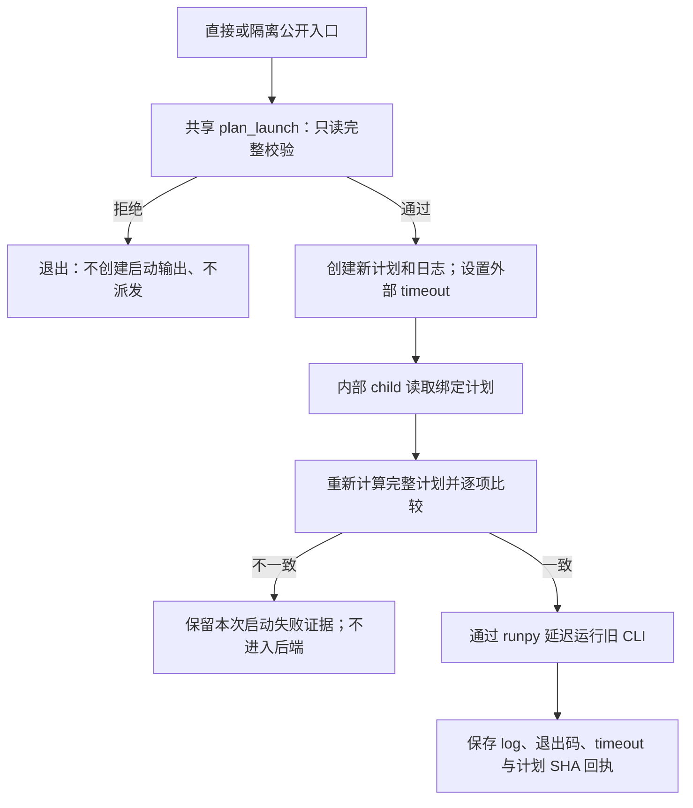

# HF4-C2 P1：完整启动合同的实现与验证

状态：**新 P1 入口的历史合同校验已完成并通过验收；没有新增 FE 路径，也没有授予稳定 F 内核新的科学准入。** 最终源码绑定测试于 2026-09-21 完成；2026-09-27 的只读复核与 [root_acceptance.json](../hf4_c2_p1_validation/root_acceptance.json) 确认当前四个文件仍与该测试的冻结源码一致。本页只记录 P1，不预报随后稳定 F、完整内力或一致切线的验证结果。

## 目标与修复原因

总体目标仍是为 LF/N4 研究层提供独立、任务明确、可审计的 HF 评估。P1 处理其中一个具体前置条件：开始昂贵计算前，确认实际执行使用了约定的完整合同，而不是只检查几个字段或来源表中恰好保留的条目。

此前全拦截探针发现，把冻结协议的 `solver.tolerance` 从 `1e-9` 改成 `1e-3` 后，旧 wrapper 仍能抵达子进程派发边界。旧审计器的语义检查会拒绝该值，但检查发生在启动链的其他位置。旧直接 runner 还在入口检查前导入 JAX 与 FE 模块。该发现不表示三条历史路径实际使用了错误参数；原历史协议和记录仍保留。原始证据及取舍见 [综合审阅](HF4_C2_CONSOLIDATED_REVIEW_20260921.md)。

本次把协议身份、完整来源、前序证据、次序和预算检查放到同一个共享规划器中，并让两个新公开入口都调用它。效果以“错误输入在目录、日志、重型后端和子进程之前被拒绝”衡量，不以某个力学结果变好衡量。顺序与停止点仍依据 [本轮执行计划](HF4_C2_P1_AND_STABLE_F_EXECUTION_PLAN.md)。

## 实际新增文件与职责

| 文件 | 职责及审查入口 |
|---|---|
| [contact_c2_launch_p1.py](../hf_repo/scripts/contact_c2_launch_p1.py) | 仅依赖标准库；`strict_json`、`exact`、`Bindings`、`validate_protocol`、`plan_launch` 实施只读检查；`launch` 管理有界 child；`worker` 重新核验；`_invoke_backend` 最后才进入旧 CLI |
| [run_contact_c2_p1.py](../hf_repo/scripts/run_contact_c2_p1.py) | 新直接命令入口，以 `--output` 指定目录；仍进入共享的有界调度，不提供独立无门的求解 `run()` |
| [run_contact_c2_p1_isolated.py](../hf_repo/scripts/run_contact_c2_p1_isolated.py) | 新隔离入口，以 `--run` 指定目录；同样进入共享调度，并承载内部 child 模式 |
| [test_contact_c2_launch_p1.py](../hf_repo/tests/test_contact_c2_launch_p1.py) | 合成文件、被替身截断的进程和 backend 测试；不调用实际求解器或 HP 求值 |

四个文件的最终身份全部列于 [source_manifest.json](../hf4_c2_p1_validation/tests_002/source_manifest.json)，并保留 [运行前源码副本](../hf4_c2_p1_validation/tests_002/source_snapshot/)。共享模块的 SHA-256 为 `4109cf054cdec42285a988e1adec161a74c5143374eba9300c3d44b60c5f9958`。

原 `run_contact_c2.py`、`run_contact_c2_isolated.py`、审计器与物理源码均未改写。原 [contact_c2_v3.json](../hf_repo/configs/contact_c2_v3.json) SHA-256 仍为 `b17c8328dd1e350563b70305c0b311c8d38c9c0ef68c08b85fac5f13604d0b4d`；其 33 个实现绑定逐项保持原哈希。最终测试包含对此的核验，不以更新旧哈希表使新代码符合旧身份。原 C1 参考协议也独立固定 SHA，避免用一个已经改变的比较基准“验证”输入。

## 完整启动检查的具体含义

可信 v3 的**全部原字节**由代码中的常量固定；CLI 没有可供调用者自报替换的 expected-protocol-SHA 参数。因而物理、材料、solver、audit、目标、case、顺序、预算、虚位移测试函数、观测语义、来源清单和修订身份都在同一个身份检查内。仅格式重排造成的字节变化也会拒绝，不能把内容相似当作同一冻结协议。

在身份检查之外，解析器拒绝重复 JSON 键、`NaN`、`Infinity` 和 `1e999` 这类浮点溢出。递归比较区分整数、浮点、字符串和布尔值；receipt 的数值必须有限、非负，wall timeout 必须为正。计数不接受 `true` 冒充 `1`。源码及证据路径按各自基准解析，拒绝绝对路径、非法分隔符和解析后越界；admission 原有的协议相对 `../../hf4_*` 路径只在指定工作树范围内合法。

| 检查对象 | 已实现的拒绝条件 |
|---|---|
| 冻结实现与准入 | 33 项旧实现缺失或改变；准入文件 SHA、schema、status 不符；准入全部成员缺失或改变；两份 baseline audit 身份或状态不符 |
| 历史 solve/audit | 不支持的 schema；case/action/run 名称或 receipt 文件名不一致；协议身份不符；非零退出码、timeout；必要日志、审计和详情绑定不闭合 |
| 必需 SHA | `log_sha256`、`audit_sha256`、P1 `launch_plan_sha256` 以及 manifest 成员 SHA 的缺失、null、格式错误、字节不符均拒绝；不把缺失值当作“只记录当前哈希” |
| 串行执行 | 重复 case/run、序列断裂、跳过前序成功 audit、自动重试、超出三路径上限；遗留而无回执的目录、日志或其他未识别证据也要求先排查 |
| 时间预算 | 保留每次 solve/audit 的外部 wall 上限和累计预算；下一条 solve 要求之前两类预算仍有余额；最后成功 solve 即使已耗尽 solve 总预算，仍可在剩余 audit 预算内完成其审计 |
| P1 前序计划 | receipt 必须绑定原计划；计划中完整静态输入身份必须与当前合同、来源和三个 P1 实现文件一致，不能混用已经改变的启动实现 |

检查只是文件身份和启动合同验证，不重新计算历史物理状态。历史审计状态及其绑定仍是历史记录，原数值失败保持失败。

## 父进程、child 与副作用边界



父进程在校验通过后使用排他创建保存计划和日志；child 在重型导入前重读来源和历史，防止父进程检查后输入已经发生改变。旧 CLI 通过 `runpy` 运行，保留它原有的 `exception.json` 和退出码行为。输出已经存在时不覆盖；进程超时或创建失败会保存明确的非成功回执。

内部 `--_worker-plan` / `--_worker-sha256` 由共享调度生成，不能与公开运行参数混用。这里的 SHA 绑定的是调度刚写下的计划，**不是调用者自行授权一个新协议**。worker 仍须通过代码内固定的 v3 身份及所有来源、历史检查。该内部接口不作为独立执行 API；父进程负责外部墙钟限制。它是防误编辑和无效计算的完整性机制，不是对能够任意改写 Python、计划、回执和来源文件者的安全隔离，也没有增加全局权限或调度平台。

## 测试证据及本次效果

| 记录 | 实际结果 | 使用范围 |
|---|---|---|
| [tests_001](../hf4_c2_p1_validation/tests_001/) | `274 passed`，80.14 s | 开发期暂定记录。执行期间 `_number` 有一行整数有限性修正，且没有运行前完整源码冻结；[provisional_status.json](../hf4_c2_p1_validation/tests_001/provisional_status.json) 已明确局限，不追溯绑定最终源码 |
| [tests_002/receipt.json](../hf4_c2_p1_validation/tests_002/receipt.json) | **279 collected / 279 passed / 0 skipped / 0 errors**；pytest 78.52 s，测试子进程墙钟 79.657 s | 最终源码绑定验收。运行前冻结四文件，先收集实际 node IDs，再执行并重查当前源码 SHA 全部未变 |
| [root_acceptance.json](../hf4_c2_p1_validation/root_acceptance.json) | `status: pass`；2026-09-27 重新核对当前四文件和证据哈希 | 完成独立复核后，只允许继续无新平衡求解的固定态算术、完整残差和切线验证；不是新的路径准入 |

两次测试不能累加为 553 个独立测试。`tests_001` 的通过也不能补强或替代最终源码绑定。2026-09-27 的 root acceptance 是复核记录，不是声称当天再次执行了 279 项测试。

最终覆盖包括每个冻结叶字段在两个公开入口的单独变异、结构缺项/增项、空/部分源码表、错误类型、非有限数、来源和准入损坏、丢失必要 SHA、失败或超时前序、非法次序、耗尽预算、孤立证据，以及父进程检查后改源。负例检查输出文件集合和内容未变，同时拦截所有进程 API、backend 和重型导入。正例以完整合成 fixture 通过计划，并在模拟进程中让 worker 重验；实际 backend 被替身替换。

测试 fixture 会在 Python 单测内部替换模块常量，以认证明显标注为合成的数据。这是单测夹具，不是生产 CLI 功能，也不是新的科学准入文件。实际启动的子进程只有用于运行 pytest 的测试进程；被测求解、审计和其他进程边界全部是替身，**没有 FE 或 HP 计算**。

可审查的完整细节包括：

- [invocation.json](../hf4_c2_p1_validation/tests_002/invocation.json)：实际命令、工作目录、Python 3.13.6 / Windows 环境、CPU/x64/单线程变量及关闭 pytest 外部插件自动加载的设置。
- [collected_node_ids.json](../hf4_c2_p1_validation/tests_002/collected_node_ids.json)：实际唯一收集集合；[pytest.xml](../hf4_c2_p1_validation/tests_002/pytest.xml)、[stdout](../hf4_c2_p1_validation/tests_002/pytest.stdout.txt)、[stderr](../hf4_c2_p1_validation/tests_002/pytest.stderr.txt) 提供执行结果。
- [运行记录器](../hf4_c2_p1_validation/run_frozen_p1_tests.py)：源码冻结、命令、收集与执行结果的记录方式。其 `tests_002` 目的目录已存在，故不能原地重跑覆盖；后续验证须另用新编号目录并保存新的调用记录。

## 命令形式与来源缺失时的行为

以下是在工作树根目录运行的新入口形式，用于审查接口及将来明确获准后的启动；**本轮未运行这些求解/审计命令，它们不是下一步需要自动执行的清单**。直接入口也使用有界 child，不能把它当成绕过 wrapper 的捷径。

```powershell
# 两种 solve 入口形式等价；不是需要执行两次的任务。
python -B hf_repo/scripts/run_contact_c2_p1.py --output hf4_c2_p1_runs/padding_2p5 --case padding_2p5 --protocol hf_repo/configs/contact_c2_v3.json
python -B hf_repo/scripts/run_contact_c2_p1_isolated.py --action solve --run hf4_c2_p1_runs/padding_2p5 --case padding_2p5 --protocol hf_repo/configs/contact_c2_v3.json

# 仅在同一 root 下已有该 case 成功 solve 回执且满足其余合同后，audit 入口才可能放行。
python -B hf_repo/scripts/run_contact_c2_p1_isolated.py --action audit --run hf4_c2_p1_runs/padding_2p5 --case padding_2p5 --protocol hf_repo/configs/contact_c2_v3.json
```

只想检查输入时，可在代码中调用 `plan_launch(action, run, case_id, protocol_path)`；该函数只读文件，不建立目录、不执行求解。它仍要求完整来源，不能用于绕过缺失输入。两个新命令的 `--help` 可查看公开参数。

S0 默认薄树需要按需恢复历史资产；公开完整恢复后，仍有既定发布边界排除的两份 MATLAB 编号源码：`hf0_audit/tmc/assembleKtFi.m.numbered.txt` 和 `hf0_audit/tmc/initializeFEA.m.numbered.txt`。原 admission 共绑定 166 个输入，P1 对全部成员核验，没有两项私有来源例外。缺少其中任何必需文件时，完整启动应拒绝；哈希声明不能证明未取得的文件已经核验。

公开 [audit_contact_c2_readback.py](../hf_repo/scripts/audit_contact_c2_readback.py) 的两项特定来源边界仅服务保存态数值复读。其 `valid_for_execution_admission: false` 不能传入 P1 当作继续执行资格。两种用途、缺失文件原哈希和历史搬迁失败详见 [可移植性补充](HF4_C2_PORTABILITY_ADDENDUM.md)。恢复公开资产不能被描述为自动补齐所有外部历史来源；也不能通过伪造原件、删旧绑定或改旧准入文件让启动“通过”。

## 接续开发与明确边界

换目录或换电脑后，先读本页、[当前执行计划](HF4_C2_P1_AND_STABLE_F_EXECUTION_PLAN.md) 和 [接续指南](RESUME_DEVELOPMENT.md)，再核对 `tests_002`、`root_acceptance` 与当前四文件身份。相对链接、计划的输入路径和来源副本用于定位；原 invocation 中的绝对路径保留为历史记录，不要求复刻原机目录。

P1 本阶段完成的是**新入口的完整历史合同验证**。保留旧入口是为了历史身份和证据复读，不表示旧入口已经被修补。这里没有测试真正 FE 子进程的数值输出，也不构成跨操作系统、跨硬件或多进程并发启动的验证；预算在指定实验 root 的普通文件历史内计算，没有全局任务注册或对人为复制/伪造历史的防护。

接下来按已批准顺序验证候选稳定 F 的固定态算术、完整材料/正则/总内力和一致切线。原 v3 仍只认证原实现；候选实现必须有自己的身份与数值证据。需要真实路径补测时，应先另行冻结协议、实现、预算与停止条件；不能改写 v3 的源码表，把新内核或原失败状态冒充旧准入结果。P1 的 279 项替身通过不能代替任何一道力学门，也不改变原 C2 的 58/59 状态通过和细网格末态失败。
