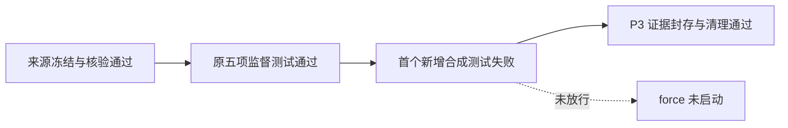
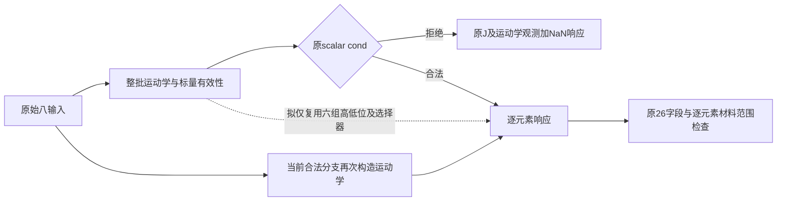
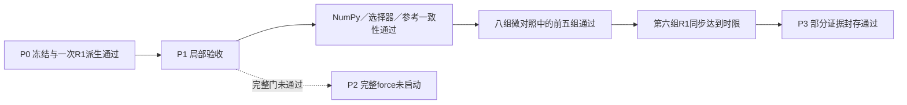
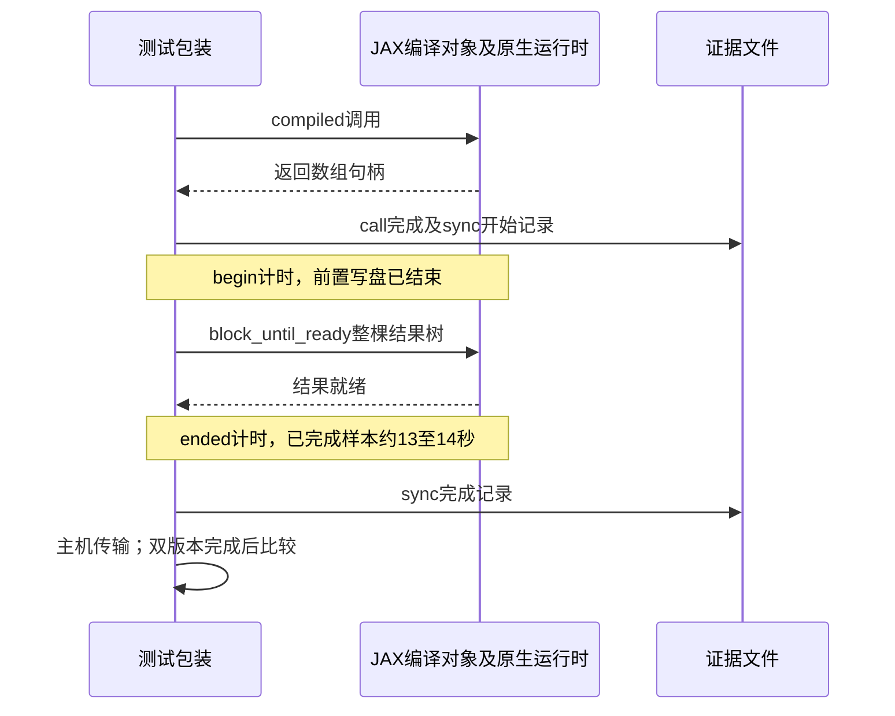
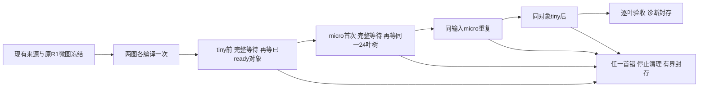
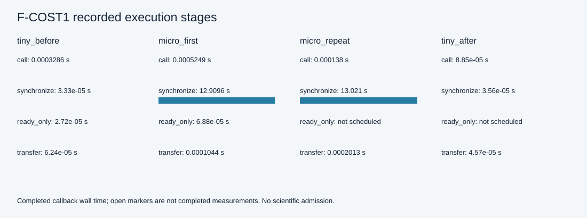
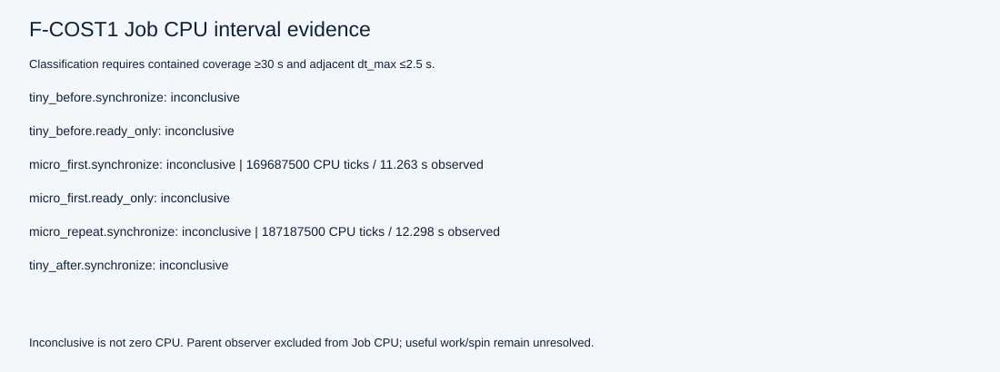
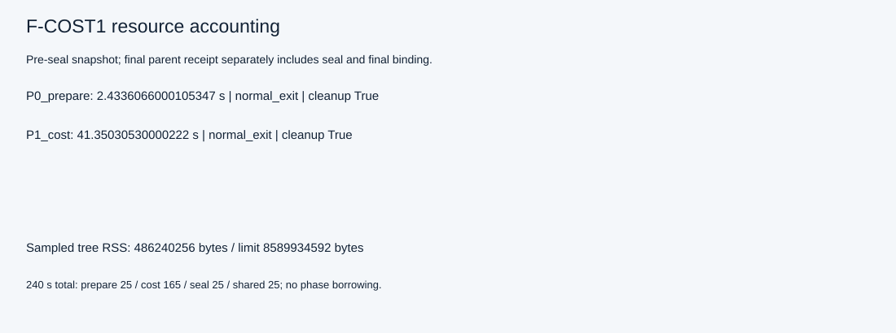
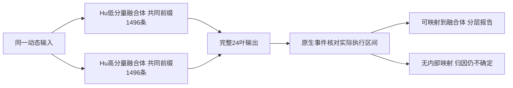

# S0 执行准备诊断：实际结果与下一步判断

最新实测入口：[F-CPU-OBS1 实际执行结果](#f-cpu-obs1-实际执行结果2026-09-29)。用户批准的唯一窗口已以`resource_or_supervision_stop`关闭：总251.293秒、峰值1.9607 GiB；同步内79个合格样本给出125.4375 CPU秒／79.5855墙钟秒，判为clear_cpu_consumption。SUP2四实例清理证明、199输入及229输出封存核验通过。compile与三份IR完成、唯一call返回、sync未完成，无输出NPZ或科学准入。CPU消耗是本轮新增证据，不证明数学进度或性能归因。CLEAN1的21项有限前置只继承；本卡不重跑、不续用余额。下文保留各卡提案、授权和实际结果，各窗口不拼接。

日期：2026-09-28。用户批准上一份 [S0 执行准备诊断卡](HF4_C2_NEAR_ROTATION_DIAGNOSTIC_20260928.md) 后执行。本报告在窗口关闭后依据已保存日志、清单和本机源码编写；没有追加测试、科学导入、tracing、编译、HP 或 FE。

**结论：记录与监督通过；执行准备未通过。** 本轮取得了完整、可复现定位的 JAX 编译边界错误，尚不能确认先前推测的联合屏障转置问题。没有生成 C1，没有运行原 9 项完整算术复验、代表场 force/tangent/JVP 或 69+63 科学矩阵。

## 整体目标、工作理由与实际改动

整体目标是与 LF 解耦、可恢复且数值可信的 HF 正向力学评估器；当前可选小不变量/Hu 候选仍需在同一源码身份下完成算术、制造场和保存态验收，之后才有条件进入新的接触/任务验证及 HF5。当前候选尚不具备科学准入，默认内核没有切换。

上一轮只有 `......F..`，无法确定失败 nodeid 和 traceback。本轮首先补足观测证据，避免依据静态猜测修改科学代码。新增实现为：

| 文件 | 用途 | 本轮实际验证范围 |
|---|---|---|
| `hf_repo/scripts/s0_event_log.py` | 单进程独占 NDJSON，每条 flush/fsync，固定身份与递增序号 | 即时保存、强制终止保留、长路径链通过 |
| `hf_repo/scripts/hf_s0_pytest_events.py` | 显式 pytest 插件，逐项完整错误、nodeid、收集/测试/会话状态 | P1/P2 已实际使用 |
| `hf_repo/tests/test_s0_event_logging.py` | 三项日志合成测试 | 3/3 通过；与既有监督器 5 项共 8 项 |
| `hf_repo/scripts/run_s0_preparation.py` | 唯一 600 秒截止、分项预算、Windows Job 监督、观察例外与最终回执 | 正确在非预声明异常后结束；8 个子阶段清理均确认 |
| `hf_repo/scripts/s0_preparation_evidence.py` | B0 来源绑定、独立辅助源码、条件修复闸门、封存与 SVG | 准备/核验/封存执行；条件修复部分未执行 |
| `hf_repo/scripts/probe_s0_preparation.py` | 小标量对照及代表场分段探针 | 对照在无屏障 strict-JIT VJP 构造处停止；force/tangent 未执行 |

初次静态交叉审查修正了全局→单元局部 DOF 映射、P0 日志 SHA、Windows 含空格路径及 P2 例外闸门。**仍未识别出对已携带严格选项的 JIT 函数再做 VJP 的运行限制**；新探针复用了原测试的这一编排，因此也在无屏障对照中失败。这属于本轮实现与初次静态审查的遗漏，不能把它写成屏障机制已验证。

## 实际执行与效果

新证据目录为 `hf4_c2_stable_f_validation/s0_ready_001`。启动约为 **07:13:44.737 UTC**，最终绑定于 **07:14:28.534 UTC**（本地 UTC+9 为 16:13–16:14）。终态 `execution_failure`，最终绑定耗时 **43.7990935 秒**，进程树采样峰值 **510,935,040 bytes，约 487.27 MiB**。资源没有超限；停止由异常触发，600 秒剩余时间不再开放。

| 阶段 | 墙钟秒 | 采样峰值 bytes | 结果 |
|---|---:|---:|---|
| P0 准备 | 1.411092 | 61,972,480 | 51 文件身份及复制通过 |
| verify 01 | 1.525267 | 60,751,872 | 通过 |
| P1 日志/监督 | 11.711474 | 131,284,992 | 8/8 通过 |
| verify 02 | 0.976655 | 61,255,680 | 通过 |
| P2 B0 唯一测试 | 24.613243 | 510,935,040 | `ValueError`；完整正常 call 失败，退出码 1 |
| verify 03 | 0.526505 | 61,870,080 | 通过 |
| P2 标量对照 | 1.557961 | 216,240,128 | 无屏障 strict-JIT VJP 构造 `ValueError`，即停 |
| P6 封存 | 1.299895 | 62,070,784 | 来源/输出清单、日志与图封存通过 |

P2 两进程累计 26.1712034 秒；中间来源检查同时消耗实际墙钟及共享预算，未重置 P2 截止。最终主回执的 43.7487964 秒在回执写出之前采样，绑定的 43.7990935 秒还包含回执/绑定准备成本，最后 stdout 的约 43.8027 秒更晚；三者不是不同运行。RSS 按原监督器 25 ms 间隔采样，不宣称瞬时硬上界。

P1 的实际证据包括：故意失败的完整 AssertionError 在子 pytest 退出前被观察到，后继 sentinel 未启动；强制结束进程后首条完整事件仍可读；长路径封存文件实际长度达 457 字符。新增三项 pytest nodeid 的文件部分被 pytest 折叠，`test_start.location` 保留了完整辅助测试路径，独立核对确认身份。原 B0 唯一目标测试的 nodeid 完整。

## 实际错误及其含义

失败 nodeid 为 `tests/test_compensated_invariants.py::test_physical_jvp_and_vjp_match_closed_form_first_derivatives`。B0 原测试第 183 行调用 `jax.vjp(compiled, ...)` 时，经 JAX `api.py:1661`、AD 线性化及 `pjit.py` 到达 `pjit_staging_rule`。实际终止于本机 **`jax/_src/pjit.py:1308`**：

> `ValueError: compiler_options can only be passed to top-level jax.jit`

完整日志保留原始带反引号文本、路径、类型和 traceback，见 [B0 pytest 日志](../hf4_c2_stable_f_validation/s0_ready_001/logs/P2_baseline.log) 和 [逐项事件](../hf4_c2_stable_f_validation/s0_ready_001/events/P2_baseline.ndjson)。setup/teardown 成功，正常 pytest 会话退出 1；因此符合原卡仅继续必要对照的观察例外，**不符合 C1 修复条件**。

标量 `f(x)=x², x=1.25` 的无屏障 eager 七步骤全部通过：primal 1.5625、JVP 1.875、pullback −1.25、对偶积 −0.9375，及小线性图保存。无屏障 strict-JIT 的 primal/JVP/闭式检查通过，但 `vjp_construct` 再次出现同一 ValueError。它不是数值门失败，也不是双线性转置 AssertionError。联合屏障与分别屏障全部 `not_run`。详情见 [对照 summary](../hf4_c2_stable_f_validation/s0_ready_001/results/controls/summary.json)。

本机源码的静态复核支持实际 traceback：`pjit.py:1306–1313` 对嵌套 JIT 的非空 `compiler_options_kvs` 直接拒绝；约 1663–1676 行将这些选项传入变换后的切向 JIT。当前证据确认**测试/诊断编排与安装版 JAX 接口不兼容**，没有证明科学力学公式或 DD 原语错误，也没有证明修正编译边界以后不会再遇到屏障转置问题。上一轮缺少完整日志的失败不能被本次 traceback 追溯替换。

`pjit.py` 是关闭窗口后依据 traceback 补读的安装包源码，SHA256 为 `fc0f6e9a373ddb517391631bf65245f47829cb7339fd44d90bf4939622256734`；它未包含在本轮预先冻结的五份 JAX 源码副本中，不能追称已纳入原输入清单。下一协议应显式补入该文件绑定。生产 force/tangent 探针原本采用 raw residual → jacfwd/JVP → 外层 JIT 的组合，当前静态证据不要求同步改动生产内核。

分类修复 worker、`failure_classification.json`、`selected_source.json`、C1 目录均未产生；最终回执只指向始终使用的 B0。科学算术文件保持 SHA256 `8e2ea41043fa3b55c1e393fbc538a9631dfa1b2e75202abfa71cf78061ff47c0`，原 9 项测试文件也未改变。P3–P5 未执行，所以不报告任何 force/tangent 编译成本或新科学曲线。

## 来源、可视化与异机接续

- [输入清单](../hf4_c2_stable_f_validation/s0_ready_001/input_manifest.json)：51 份来源/副本，1,548,736 bytes；SHA256 `675cc21f13ad4221bd33e3de29e0e578a2b4949d38a4fa11c4b10cc9b0a5564d`。B0 直接绑定旧 v2 输入清单，不从当前代码反推。
- [来源保全](../hf4_c2_stable_f_validation/s0_ready_001/source_preservation.json)：窗口结束时 51 项、缺失 0、变化 0，C1 0 项。
- [最终回执](../hf4_c2_stable_f_validation/s0_ready_001/execution_receipt.json)及[绑定](../hf4_c2_stable_f_validation/s0_ready_001/receipt_binding.json)：包含全部命令、退出、采样资源及 8 次确认清理；绑定 plan、输入、输出清单、最终回执及 P6 自身日志/事件。
- [输出清单](../hf4_c2_stable_f_validation/s0_ready_001/output_sha256.json)：99 份载荷哈希。独立只读审查逐项核验通过；整树 105 文件，另 6 项是明确排除的活跃/最终绑定文件，不是假装缺失的载荷。
- [资源图](../hf4_c2_stable_f_validation/s0_ready_001/resources.svg)：封存前已结束阶段，P6 成本见最终回执。柱颜色仅区分时间/RSS、不表示通过；P2 baseline 和 controls 均为非零退出。
- [分段图](../hf4_c2_stable_f_validation/s0_ready_001/stages.svg)及[分段记录](../hf4_c2_stable_f_validation/s0_ready_001/stage_timings.json)：明确标注 force/tangent `not_reached`，没有填入虚构时间。

异机阅读顺序为本报告 → CURRENT_STATUS → 原批准卡 → 新目录 plan/manifest/receipt → P2 原始日志。不要重用或覆盖新旧证据目录。窗口关闭后的文档追加不回写冻结副本；因此当前文档的字节与当时 aux/docs 副本可以不同，冻结副本仍由清单约束。本轮没有提交、推送、发布、依赖升级或默认切换；main 的 HEAD 仍为 `18f1f62`，origin 仍为 `https://github.com/dudaxing/Compliant-TO-TMC.git`。

封存/来源核验的 `pass` 只说明证据完整，不能覆盖整体 `execution_failure`。回执中的 B0 仅是停止时实际使用身份，不能解释为通过了尚未执行的选择/修复门。

## 下一步判断（尚未执行）

先单独修订**测试与探针的 JIT/AD 编排合同**，再考虑科学源码修复。严格编译选项必须保留在最外层：对 raw 函数先组织 JVP 或 VJP+真实 pullback 的纯数组结果，再将该整个变换包装为顶层 strict JIT；不要对已携带选项的 JIT 再做 VJP/linearize，也不能让 JIT 返回 Python pullback callable。

概念边界如下，作为审阅方案，不是本轮运行证据：

```python
forward = jax.jit(lambda x, v: jax.jvp(raw, (x,), (v,)),
                  compiler_options=STRICT_OPTIONS)

def reverse_action(x, cotangent):
    primal, pullback = jax.vjp(raw, x)
    return primal, pullback(cotangent)[0]

reverse = jax.jit(reverse_action, compiler_options=STRICT_OPTIONS)
```

后续顺序应为：先验证三组小标量的 eager 与上述 strict 编排，分别记录 VJP 构造/拉回在 tracing 中的位置及编译后的实际结果；保留旧调用失败作为历史对照；再以相同 x、方向、Decimal/Fraction 参考、rtol/atol 改写原测试的包装边界并复验 9 项。新的测试 harness 与不变 B0 科学源码要分别编号和绑定。只有此时得到预声明的、对照一致支持的转置失败，才能重新审查那一份最小导数接线修复，不能拿本次 ValueError 作为修复依据。

eager 可以分别记录 raw VJP 构造与 pullback；strict 编排应记录整个数组结果包装的 trace/lower/compile/同步执行，并从 trace 的错误栈区分构造/转置，不把返回 closure 的步骤伪装为可单独编译的输出。小线性 jaxpr 也应来自 raw 函数，不对 strict-JIT 再执行 linearize/make_jaxpr。调整编译边界不自动证明数值一致，仍需实际原门复验。

原批准卡规定“非预声明异常即结束整个窗口”，本次已经触发。测试文件包装边界变更也超出其“原 9 项测试不改”的合同。因此本轮停在完整取证、封存与静态方案；下一次应先形成并审阅修订卡，明确 harness 变更、三组控制、条件修复、资源预算和停止规则，再取得新授权。没有续用剩余秒数，也没有在另一目录重开实验。HF5、新路径和完整科学矩阵仍未开放。

## JIT/AD-1 编排修订与执行准备卡（待授权）

本节是关闭窗口后的唯一近期详细提案，复用本报告和 CURRENT_STATUS。本次自动续轮只读核对 Git、封存回执、原测试、驱动及安装版 JAX，并完成静态交叉审查，没有实现本卡或运行新计算。Git 根、main、origin、HEAD 与上文一致；本轮未 fetch，不宣称重新确认远端同步。上一执行轮取得了改变下一步决策的实际错误；本提案仍不算运行通过项。

**目标。** 修正测试/探针的编译边界错误，在严格编译条件下恢复可判定的物理导数测试；仅当新证据支持时允许一次原定的导数屏障接线修复，再完成固定单元的执行成本诊断。

**范围限制。** 不运行 69+63 矩阵、HP 重算、Newton、新平衡路径或 HF5；不改变物理公式、分支、范围、参考精度、数值门、默认内核、依赖或 LF 边界；不提交、推送或发布。不能通过删严格选项、跳过 VJP 或改参考导数取得通过。

### 固定身份与最小改动

**B0/H0。** B0 科学源码仍来自旧 `invariants_hu_campaign_001/version_002/source/hf_repo`，绑定原输入清单 SHA `e8877ce1713dbb648a2d6135dff2f15a7d3618a4fcb0591321824928644e17f5`。原测试保留为 H0，本卡不再执行其已取得完整错误的非法编排；绑定 `s0_ready_001` 事件及最终回执作为历史对照。

**H1。** 独立生成 H0 测试副本，唯一允许的修改是以下代码替换原第 181–184 行。反替换后全文须恢复原字节。raw 函数、低位量、输入/方向/cotangent、100 位 Decimal 参考、三条导数/对偶断言的 `rtol=2e-14, atol=2e-15` 均保持；其他八项测试及全部 Fraction/Decimal 门完全不改。

```python
    def jvp_evaluate(z, v):
        return jax.jvp(function, (z,), (v,))

    def vjp_evaluate(z, c):
        y, pullback = jax.vjp(function, z)
        return y, pullback(c)[0]

    _,action=jax.jit(jvp_evaluate,compiler_options=ci.COMPILER_OPTIONS)(
        jnp.asarray(x),jnp.asarray(direction))
    _,reverse_array=jax.jit(vjp_evaluate,compiler_options=ci.COMPILER_OPTIONS)(
        jnp.asarray(x),jnp.asarray(cotangent))
    reverse=np.asarray(reverse_array)
```

辅助实现单独冻结：控制组改用 raw eager 或上述完整 AD 包装的最外层 strict JIT；驱动/分类器适配 H1 与新阶段，记录实际科学源码及 harness 的路径、版本、SHA。日志/图表复用已验证机制。授权后可在计时前做初次作者/AST 审查；H1 实际副本生成、冻结、来源核验、科学导入及其后所有工作均计时。窗口内修 harness 不属于初次作者工作。

原五份 JAX 来源之外补入实际错误涉及的 `_src/pjit.py`，并绑定分段接口的 `_src/stages.py`。CPU、float64、`fast_math=False`、`ftz=False`、禁用持久编译缓存保持，不升级依赖。

**条件性 C1。** 只有下述实际分类门满足，才最多生成一份 C1：四处导数乘法改用分别屏障 helper，限 `_linear_pair` 与 `_jax_product_jvp`；保留低位系数、倒数修正和真实物理导数，primal `_add/_sub/_mul` 及其余源码字节不变。保存补丁、反替换证明、原/新 SHA 及独立清单。不能先改 B0 再寻找支持解释。

B0/C1、H0/H1、辅助代码、输入分别标识；H1 通过不写成 H0 原字节通过。新目录拟为 `hf4_c2_stable_f_validation/jit_ad_ready_001`，尚未创建，只有新授权后才能启动；不能重用旧目录，也不能将新目录当作重置旧额度。

### 固定步骤与资源

申请一个新的 **连续 600 秒、8 GiB 进程树 RSS、串行窗口**。分项与共享额度合计恰为 600 秒，都是停止上限，不承诺完成。

| 阶段 | 固定工作 | 上限秒 |
|---|---|---:|
| A0 | 来源/环境冻结、H1 最小替换及全文恢复证明 | 20 |
| A1 | 原 5 项 Windows Job 监督＋3 项即时日志合成测试 | 20 |
| A2 | none→joint→separate 三组标量，各 raw eager 与修订 strict 编排 | 30 |
| A3 | B0＋H1 的唯一物理 JVP/VJP 目标测试 | 50 |
| A4 | 选定 B0 或有证据支持的 C1＋同一 H1，完整九项测试 | 90 |
| A5 | 原固定单元 force-only 分段探针，一次 | 150 |
| A6 | 同单元 tangent＋实际残差方向 JVP，同进程一次 | 180 |
| A7 | 来源/输出、首次错误、资源/分段图和最终回执封存 | 30 |
| 共享 | 受监督来源检查、调度、条件分类/修复、限定 canonical 同步 | 30 |

依据是本轮准备约 1.41 秒、八项监督/日志约 11.71 秒、旧目标测试约 24.61 秒、封存约 1.30 秒。小对照曾约 1.56 秒即因接口错误停止，不能称三组完整成本已测定。完整九项、force/tangent 成本未知，90/150/180 秒只用于有界诊断。不增加样本，不将前段节省时间加给后段分项。

从首次准备计连续墙钟；B0→C1、修复间隔、导入、核验和清理不重置。Windows Job 维持启动前归属、25 ms RSS 采样、全部成员终止及零活动进程核验。封存及共同有界清理时段均包含在 600 秒内。A3 目标随后在 A4 九项中再执行一次是明示的诊断/同版完整复验，其他阶段不得重跑。

### 判别与停止门

**A2 固定对照。** `f(x)=x²`、`x=1.25`、方向 `0.75`、cotangent `−0.5`；primal `1.5625`、JVP `1.875`、pullback `−1.25`、对偶积 `−0.9375` 按 dyadic binary64 精确比较。none/separate 的 eager 和 strict 必须完整通过。eager 分别记录 raw VJP 构造/真实 pullback；strict 的 VJP＋pullback 包成纯数组结果，使用同一函数的 trace→lower→compile→同步执行，不伪称编译返回 closure 的步骤。三组小线性 jaxpr 只对 raw 函数各取一次，不对 strict-JIT 再做 linearize/make_jaxpr。

joint 的 primal、JVP 和对应闭式检查同样必须成功；三组 raw 线性图是独立取证，预声明 VJP 失败不能作为跳过它们的理由。joint 两种模式的 VJP 若都通过，应记录未重现，不能作为 C1 修复证据。

唯一诊断例外是 joint 的 VJP 构造/拉回，或 strict reverse 包装 trace 中对应转置步骤的预声明双线性 `AssertionError`。只有保留完整类型、未过滤 traceback、实际末端 frame/源码身份，确认来自安装版 `ad.py` 的 XOR 已知/未知判定，才可记为观察并完成必要对照；不能仅匹配几个关键词。失败后的依赖步骤记未执行，不算通过。再次出现 options ValueError、none/separate 异常、数值门失败、日志/来源/资源/清理问题均立即结束整窗，不换包装、不删选项、不重试。

**A3/C1。** 必要对照完整后，A3 唯一目标为 H1 中 `tests/test_compensated_invariants.py::test_physical_jvp_and_vjp_match_closed_form_first_derivatives`，科学源码 B0。通过即选择 B0，不根据 joint 现象预先修生产代码。失败只有在完整 pytest 会话、唯一目标 call 退出 1、收集/setup/teardown 成功、实际末端异常与 A2 joint 一致且 none/separate 全通过时，才在共享额度内写分类回执并冻结一次 C1。任何其他错误停止；旧 ValueError 不提供 C1 依据。

**A4。** 选定的一份科学源码＋H1，完整九项在 `-x --maxfail=1` 下全部通过；不 skip、xfail 或拼接 B0/C1 的通过项。只有 A4 全通过，才可同步 H1 测试及存在时的 C1 科学补丁到 canonical 工作树：替换前确认仍为绑定旧版本，替换后核新 SHA 并保存回执；身份不符即停，不覆盖未知改动。同步仍不改变默认内核或完整科学资格。

新来源核验器须依据逐文件同步日志及完整同步回执切换 canonical 的预期 SHA，不能沿用旧 worker 的“C1 清单存在即期待 canonical 已改”规则。C1 已冻结但 A4 未通过时，canonical 科学源码仍应匹配 B0，测试仍匹配 H0。同步前先落盘旧/新身份与操作意图，每个文件替换后确认 SHA，再写完整同步回执；中途失败如实记录部分同步并停止，不把它声明为完整成功，也不覆盖未知并发修改。

**A5/A6。** 原 `unit__near_rotation/inputs.npz` 的 lift/fluctuation/direction 0，经原 connectivity/edofs 提取局部向量；原算子、材料、方向不改，不求平衡，不以 HP 向量代替结果。force/tangent 各一次冷进程，采用已审查 raw residual→AD→外层 strict JIT，复用同一 traced/lowered 对象，全部输出同步。实际残差 JVP 与 tangent 同用 A6 的 180 秒。保存局部索引、NPZ、IR 和事件；未完成如实记 not_reached/open_at_stop，不给新力学精度结论。

### 完成、交付与当前边界

可信日志/清理及明确错误可完成一次诊断；只有 A1、A2 必要对照、所选版本 A4 九项、A5/A6 完整分段满足合同，才称本卡执行准备通过。joint 观察不是通过，C1 修复不是科学验收。即使全过，仍须另行冻结和授权原 69 场/138 方向/63 态矩阵，不跳至 HF5。

封存 H0 历史失败、H1 差异、B0/C1、全部对照、分类拒绝、首错、未执行项、时间/RSS/清理及图。最终回执含封存自身，活跃日志在清理后补 SHA。图明确通过/失败/未到达和采样口径。更新本报告及 CURRENT_STATUS，分列实际运行、静态检查、效果与局限。

当前阻断是新编排及新计算窗口尚未获授权；最小处理为审阅本卡，授权 H1、严格证据条件下的一次 C1 及 600 秒/8 GiB。下一步前置是授权后的辅助实现/静态审查及 A0 来源门。可恢复资产/发布清单整理属非阻断改进；一般接触、任务定义与 HF5 属后续研究。自动目标续轮不授予新的资源或阶段范围；本卡尚未实施，没有新计算进程。

本卡完成两项独立只读交叉审查：预算/停止/身份与 JIT/AD 编排/数学边界。审查补充了 joint 非 VJP 项仍必过、raw 线性图不可因转置失败跳过，以及延迟 canonical 同步所需的核验状态切换。审查未运行测试，也未将卡标为已经执行。需要新授权的依据是用户总体规划“资源授权和阶段范围不能静默改变”，以及前卡已触发的“非预声明异常结束整个窗口”；并非插件或自动审批系统额外加设的限制。

### JIT/AD-1 授权登记

用户随后在授权问题中选择“批准按卡执行”，已明确授予本卡的一次连续 600 秒/8 GiB、新 H1 包装及严格证据条件下的一次 C1。上文待授权状态保留为提案时记录。本轮先作者/静态审查辅助改动，随后启动唯一 `jit_ad_ready_001` 窗口；不重复询问既已授权的条件修复。原 H0/B0 科学文件在 A4 全九项通过前保持，实际 H1 复制和冻结从 A0 计时。实际结果在窗口封存后追加，不回写旧证据。

## JIT/AD-1 实际执行结果（2026-09-28）

**本卡已执行并关闭；导数接口修复通过原九项测试，完整执行准备未通过。** 唯一窗口为 [`jit_ad_ready_001`](../hf4_c2_stable_f_validation/jit_ad_ready_001/execution_receipt.json)。A2 和 A3 提供同一实际 AD 转置错误的证据，按批准条件生成一次 C1；A4 的 C1＋H1 九项全通过后才同步两个文件。A5 的编译成功，但首次调用及同步未完成即触发 150 秒分项上限；A6 未执行。父回执终态为 `resource_or_supervision_stop`，随后只做证据封存、只读复核和文档更新。

### 做了什么、为什么做、效果如何

整体目标仍是与 LF 解耦、可异机恢复、数值与物理资格明确的 HF 评估器。本卡处理候选进入完整验证前的接口与执行条件，不替代整体目标。先修正错误的 JIT/AD 包装，是为了让严格导数测试具备判别力；先取对照再修生产导数，是为了使取舍由实际证据支持；保存编译与同步边界，是为了区分算术改善和可执行性。

初次作者/静态阶段新增 `run_jit_ad_preparation.py`、`jit_ad_preparation_evidence.py`、`probe_jit_ad_preparation.py`、`s0_ad_exception.py`，扩展即时 pytest 插件及既有三项日志测试。三个独立复核方向覆盖异常身份、H1/C1 来源及同步、JIT/AD 编排。该阶段只作者及 AST/文本审查；实际 H1 生成、冻结、导入、测试、条件 C1、同步、探针与封存均在同一计时窗口内。源文件与辅助代码见[初始清单](../hf4_c2_stable_f_validation/jit_ad_ready_001/input_manifest.json)，其原件冻结在 `aux/` 和 `B0/`。

| 阶段 | 实际结果 | 监督墙钟秒 |
|---|---|---:|
| A0 | 68 份输入冻结；H1 精确四行替换及反恢复证明通过 | 2.280746 |
| A1 | 原 5 项 Windows Job＋3 项即时日志测试全部通过 | 12.687485 |
| A2 | none/separate 完整通过；joint 取得两项预声明转置失败；三张 raw 线性图保存 | 13.804249 |
| A3 | B0＋H1 唯一目标在同一实际末端 XOR 断言失败，退出 1；属于获准诊断观察 | 17.639498 |
| 分类与 C1 | 对照及目标末端身份匹配；只生成一次 C1，暂不改 canonical | 4.808672，计共享额度 |
| A4 | 同一 C1＋H1 原九项全部通过，pytest 自身报告 64.76 秒 | 69.359669 |
| 同步 | H1 测试和 C1 算术各 intent→替换→SHA 验证；整体回执闭合 | 1.654373，计共享额度 |
| A5 | trace/lower/compile 通过；首次调用/同步未完成，触发 `phase_timeout` | 150.031007 |
| A6 | 未到达；没有 tangent 或实际残差方向 JVP 结果 | 未执行 |
| A7 | 来源、输出、资源图、分段图封存成功 | 2.047911 |

共享阶段合计 19.688854 秒，包含七次来源核验、对照判别、分类和同步，不与表内两行重复累加。17 个受监督阶段全部确认 Job 清理完成、清理错误为空。没有额外进程重跑、换目录续跑或使用剩余总时限运行 A6。

### 证据支持的接口修复

A2 的 `none`、`separate` 在 raw eager 及 strict 编排下全部通过固定 dyadic 精确门。`joint` 的 primal/JVP/闭式检查通过；eager VJP 构造通过，而实际 pullback 失败；strict 包装在 `reverse.trace` 失败。两种失败后的依赖步骤记 `not_run`，不算通过。三组独立 raw 线性图均保存，见[控制组结果](../hf4_c2_stable_f_validation/jit_ad_ready_001/results/controls/summary.json)。

A3 在 H1 合法编排下消除了旧嵌套 options 障碍，实际末端为安装版 `jax._src.interpreters.ad.fancy_bilinear_transpose`，`ad.py:1135`，源码 SHA `3e54a02d0e2f45c42e0ed0bf9489ab58b6bcf360653539a44864a211b9d601b4`。断言为 `isinstance(x, GradAccum) ^ isinstance(y, GradAccum)`，消息两侧均为 `ValAccum`。目标与至少一个 joint 观察的路径、模块、函数、代码起始行、行号、源码行及 SHA 一致；调用来源包括 B0 `_linear_pair→_mul`。这支持本机版本和已测输入上，联合屏障影响导数已知/未知分界的判断；不是对所有 JAX 版本的推广。

满足上述条件后，C1 仅将 `_linear_pair`、`_jax_product_jvp` 的四处导数乘法换为分别屏障 helper `_derivative_mul`。原 primal `_add/_sub/_mul`、低位系数、其余科学源码字节、公式、输入、数值门保持。这里的 C1 是本卡局部来源身份，与既有 HF4-C1 阶段名称不同。

| 对象 | 原 SHA256 | 新 SHA256 |
|---|---|---|
| H0→H1 测试包装 | `1621d13961de4ee3d4f8107db9a9dc1e0de171cbe7569776fbe72d22a21ca6d7` | `15a81049f3fadcf0a0391f702db8444c33856f1116055d26e6ffca686821e946` |
| B0→C1 算术源码 | `8e2ea41043fa3b55c1e393fbc538a9631dfa1b2e75202abfa71cf78061ff47c0` | `6a0144a92bf323951594a0d677b7558cf2a6501667f4b076dd13e2df6bba3897` |

[H1 补丁](../hf4_c2_stable_f_validation/jit_ad_ready_001/H1/patch.diff)及[全文恢复证明](../hf4_c2_stable_f_validation/jit_ad_ready_001/H1/proof.json)确认只替换四行包装，其他八项和原参考/断言不改。[C1 补丁](../hf4_c2_stable_f_validation/jit_ad_ready_001/C1/patch.diff)及[修复证明](../hf4_c2_stable_f_validation/jit_ad_ready_001/C1/repair_proof.json)可以反恢复 B0 全文字节。证明里的 `canonical_sync_performed=false` 是冻结 C1 时的事实；后续同步以[完整同步回执](../hf4_c2_stable_f_validation/jit_ad_ready_001/sync_receipt.json)为准，不回写派生证明。

A4 的原九个唯一测试在同一 C1＋H1 下全过，包含此前失败的物理 JVP/VJP/对偶测试；没有 skip、xfail 或跨版拼接。[A4 日志](../hf4_c2_stable_f_validation/jit_ad_ready_001/logs/A4_arithmetic.log)与即时事件保留来源、harness 双哈希和实际独立 H1 文件路径。随后同步仅更改 `hf_repo/tests/test_compensated_invariants.py`、`hf_repo/src/hf_eval/compensated_invariants.py`；完整 29 项 src＋1 项测试与同步回执相符。默认内核、严格编译选项及依赖未改。

### 固定单元执行到哪一步

输入仍为原 `unit__near_rotation`，SHA `2ba110b878186e52996c25f4aad44cb81858be15303c21579c4f5e8ccc013448`；connectivity `[0,1,3,2]` 对应 edofs `[0,1,2,3,6,7,4,5]`，lift/fluctuation/direction 0 按此读取。没有新平衡路径或 HP 重算。

| A5 内部步骤 | 最终记录 |
|---|---|
| runtime import / kernel import | 10.924124 / 1.272042 秒，完成 |
| force.trace | 18.303190 秒，完成 |
| force.lower | 7.023830 秒，完成 |
| force.compile | 87.923518 秒，完成 |
| force.execute_synchronized | 停止时仍开放；23.331435 秒仅为含清理/调度的观察上区间 |
| transfer / save_output / export_ir | 未到达，无完整力数组、NPZ 或 force IR |
| A6 tangent / residual JVP | 未到达 |

依据为[分段记录](../hf4_c2_stable_f_validation/jit_ad_ready_001/stage_timings.json)及[最终 A5 事件](../hf4_c2_stable_f_validation/jit_ad_ready_001/events/A5_force.ndjson)。子探针 summary 因被终止而保留最后 `running` 快照；父回执明确该进程已清理，不把旧快照改写成完成。早期进度说明曾依据较早快照称“编译阶段超时”，最终事件显示编译在停止前已完成，已即时更正；本报告和图均以最终封存事件为准。

冻结探针 `staged_call` 调用 `compiled(*args)` 后再 `jax.block_until_ready(result)`，使用已形成的 compiled 对象。没有应用层重新 trace/lower/compile 的源码证据，但该合并事件不能区分首次调用包装、派发、执行和同步等待。23.331435 秒不能解释为纯内核运行时间、完成耗时或死锁证据。IR 导出后置于结果保存，故本次即使编译成功也没有留下 force IR；三张标量控制图不能代替该图。

### 资源、可视化和独立复核

UTC 开始 `2026-09-28T07:44:56.401784+00:00`；最终父回执 `07:49:44.203093+00:00`，回执耗时 287.803132 秒；追加绑定在 `07:49:44.244669+00:00` 完成，绑定记录 287.844711 秒，stdout 约 287.847 秒。差别来自顺序封存，不是另一窗口。峰值进程树采样 RSS 为 **1,980,858,368 bytes，约 1.845 GiB**，未触及 8 GiB 限制；本次停止原因是 A5 分项墙钟。

- [资源图](../hf4_c2_stable_f_validation/jit_ad_ready_001/resources.svg)：A7 前已记录阶段；最终父回执另含 A7。非零诊断观察与资源停止均保留，不能把 exit0 当作全部科学通过。
- [分段图](../hf4_c2_stable_f_validation/jit_ad_ready_001/stages.svg)：明确区分完成、开放观察区间及未到达；开放区间不是完成的执行成本。
- [最终回执绑定](../hf4_c2_stable_f_validation/jit_ad_ready_001/receipt_binding.json)：绑定计划、初始清单、H1/C1、输出清单、最终回执和清理后 A7 日志。

关闭后独立只读核验结果：68 对初始来源/副本共 1,939,000 bytes；H1 1 对 10,660 bytes；C1 32 对 378,880 bytes；4 项 proof artifact；190 份清单输出共 3,097,207 bytes，全部匹配、零缺失。完整树 196 文件、3,186,848 bytes，比输出清单多出的 6 项恰为预声明的自引用/活跃/最终绑定排除项。回执绑定八项全部匹配。H1/C1 反替换恢复原文字节；同步四条 journal 为两个文件各一组 intent/verified，没有未闭合意图；17/17 阶段清理成功。

| 关键清单 | SHA256 |
|---|---|
| 初始输入 | `16831ce332badba05dc07cfa8f6069d5ab5e7a1736ebde3c658542d49834ef9c` |
| H1 | `0999cf0e0270aa08c630569a7cb7136655910370b80a6e0fc6f68382fbadf358` |
| C1 | `384708b23842d9d4c9d3324d57c854911772ca3eb9ab15ac9edb7efd6a1c4564` |
| 输出 | `ae15bc26541b030d25230c475104074c6dab758482c022ca81056510d6198441` |

此核验发生在更新本报告和 CURRENT_STATUS 之前；冻结 `aux/docs/` 保留运行时文档原件。关闭后的入口/结果文档更新不回写冻结副本，不宣称它们与运行前 live 文档继续相同。原 S0 与候选窗口的证据也未改写。

### 当前效果、局限与下一步

本轮把“联合屏障可能有问题”的静态猜测转为有对照和真实末端支持的局部诊断，完成唯一获准导数修复，并使同版九项算术/导数门全过。执行成本也由无完整定位推进为 trace/lower/compile 已测、首次调用/同步未闭合。**不能声称固定单元力学响应正确、完整内核已通过、原近旋转精度缺陷已消除或本卡整体准备通过。** 69 制造场/138 方向/63 保存态矩阵、接触任务资格与 HF5 均未推进。

下一步优先拟定保持 C1 与原输入不变的单次 force 观测卡：从同一 traced/lowered/compiled 对象在形成后及时保存图/IR，分别记录首次 compiled 调用返回、同步完成、结果传输和保存；不预热、不暗中重编译/重试，不同时扩到 tangent 或矩阵。先取得能够分辨瓶颈的证据，再决定是否需要图结构改动或额外资源。

只读源码提示可关注重复运动学、DD 展开归约、两套应力分支和始终生成的第二 Piola 应力/辅助能量，但没有实际 force IR，不能把它们写成已证实的性能根因。A5 为无 tangent 路径，不能把耗时归因于尚未运行的八方向 Jacobian。任何后续图改动都需保留求值顺序、范围检查、输出合同及独立数值门；本轮没有实施此类改动。

本卡授权已使用并按停止门关闭，不因总时限尚有余额而续跑。下一卡的具体预算和新数值执行尚未获授权；本次只提出上述取证方向，不启动新窗口。仓库仍为 `main`，HEAD `18f1f62b50f18c4866c2e1fa83bbaebc5d13e5d7`，origin `https://github.com/dudaxing/Compliant-TO-TMC.git`。本轮未提交、推送、改分支或发布。

## F-OBS-1 固定 force 首次调用与同步观测卡（待授权）

2026-09-28，JIT/AD-1 关闭后的自动续轮。上一轮取得新错误证据、完成 C1 并通过九项，属于实质进展；本轮依据该终态制定唯一近期卡，不重开旧工作。已重新核对正式 Git 根、main、origin 和 HEAD，`git fetch origin` 成功，`main...origin/main` 无提交差异；未提交代码、证据和文档仍在工作树，不等于这些内容已发布。没有 pull/merge/rebase、实现改动、科学导入、测试或新执行目录。

### 决策与新的静态证据

下一步只回答：**同一 C1 固定 force 的第一次 compiled 调用是否返回，以及返回后全部输出同步是否完成。** 同时保存已经形成的图，避免执行未完时丢失编译证据。本卡不是更换算法或完整执行准备验收。

已核对冻结 `probe_s0_preparation.py:300`：输入数组及 direction 已在 `input_transfer` 内 `block_until_ready`，无需为“输入就绪”再做一次科学调用。该文件 `304–319` 把 `compiled(*args)` 和输出 `block_until_ready` 放在同一事件中，是当前无法细分耗时的具体原因。

冻结 `stages.py:425` 的 `traced.jaxpr` 直接读取已存图；`Lowered.as_text` 读取已有 module；`Compiled.as_text` 读取已编译 executable 的 HLO。`Compiled.__call__:882–891` 首次调用会建立调用包装，再调用已有 executable。故计划仅拆现有调用/同步，不通过 `traced(*args)`、另取 `make_jaxpr`、再次 JIT 或访问会触发额外 lowering 的 `.lojax` 来取图。`compiled(*args)` 仍可能包含包装、派发和实际执行，不能把其耗时命名为纯“派发耗时”。IR 文本仅用于诊断，不宣称是可跨版本重新执行的序列化程序。

本轮补读安装版 `jax/_src/core.py` 的图文本输出和 `interpreters/pxla.py` 的 compiled 调用解释，二者不在旧清单内；若执行本卡，须作为新增运行时来源冻结，分别绑定 SHA `5e10211a3602dc689bedb9eb3215009969ef4a8e8d6d698eb4af2949a8828976`、`998a14f7bd1ef00870f5c98463780a8c57bf81a2064c1f831b612550648a6370`。本轮没有据此执行代码。

### 固定范围、身份与继承方式

生产源码直接使用旧 `jit_ad_ready_001/C1/source/hf_repo` 的原字节；算术 SHA 为 `6a0144a92bf323951594a0d677b7558cf2a6501667f4b076dd13e2df6bba3897`，内核 SHA 为 `88d57ed77565963d8cc367c18398b11b30f8f1e0e335c7dcdbc3d68702ecb6bf`。H1 仍为 `15a81049f3fadcf0a0391f702db8444c33856f1116055d26e6ffca686821e946`。原单元输入、连接序、局部提取、材料/算子和 direction 0 身份完全沿用，输入 SHA 仍为 `2ba110b878186e52996c25f4aad44cb81858be15303c21579c4f5e8ccc013448`。

CPU/float64、`fast_math=False`、`ftz=False`、禁用持久编译缓存、原线程环境和依赖版本不变。原完整字段映射、辅助应力/能量、范围检查及 DD 求值次序均保留，不把 force 缩减成只返回残差，不删分支或屏障。不生成 C2/H2，不改 canonical 科学文件、默认内核或 H1，不运行 tangent、AD、HP、Newton、新平衡路径、矩阵、LF 转换或正式标签；不提交、推送或发布。

继承入口为旧 `receipt_binding.json`，其文件 SHA 为 `487842e3ca0af7b7c6fff87ca72a4a730aa1ca2e4414e93c451d5b553b8875f6`。从它核对已绑定的旧计划、回执、初始/H1/C1/输出清单和封存日志；核对旧输出清单的冻结文件，再复制本卡需要的 C1、H1、输入、A4 会话、分类/同步、A5 最后事件与 summary，以及证明链。继承的是同一 C1＋H1 的九项通过，**没有可继承的已完成 force 输出**；不重跑 A1–A4，不将旧非零观察当作本卡通过项。

旧清单 `row.source` 所指的 live 文档在报告更新后已变化，不能调用旧 worker 对这些 live 路径要求旧 SHA；旧历史核验以旧根下 `row.path` 的冻结副本及绑定清单为准，不改旧清单。当前报告、CURRENT_STATUS、新辅助实现另列 `new_auxiliary` 并冻结新 SHA。科学 canonical 29 项 src 对照 C1；canonical 测试对照独立 H1，不能错拿 C1 树中保留的历史 H0 测试进行比较。

拟新增辅助 runner、probe、evidence worker，只调整事件边界、导出位置、来源继承和本卡调度。旧 Windows Job 监督器及即时日志机制保持原字节，已完成的监督/日志测试只继承证据，不重复计算。授权后可先完成初次辅助作者/AST 静态审查；任何 H1/C1/输入复制、来源冻结、科学导入及实际运行均纳入窗口。拟目录 `hf4_c2_stable_f_validation/force_observe_001`，本轮未创建；启动时必须不存在。

### 唯一执行顺序与必要输出

只有一次冷科学子进程、一次 trace、一次 lower、一次 compile 和一次 compiled 调用，不预热、不重试，也不在导出失败时换接口重编译。

1. F0 准备：核验上述历史与当前身份，冻结科学输入、运行时/辅助来源和计划。保存逐文件 journal，准备部分失败也保留事实。
2. F1 入口再次核验新副本及导入路径；读取同一原输入、按原 edofs 提取并同步输入。这个现有同步步骤单独有 started/finished 记录，不新增第二次输入同步。
3. 同一 `kernel._batch_without_tangent.trace(*args)` 一次得到 traced；保存 `str(traced.jaxpr)`。接着同一 traced 一次 lower；立即保存 `lowered.as_text(dialect='stablehlo', debug_info=False)`。接着同一 lowered 一次 strict compile；立即保存 `compiled.as_text()`。三个导出分别形成事件、写盘与 SHA，先完成一份再生成下一份，不同时持有三个大字符串；任何失败停止后续科学步骤。
4. 记录 `force.call` started，唯一执行 `result = compiled(*args)`，返回后立即写 finished。此间不遍历数组值、不转 NumPy、不额外同步。随后记录 `force.synchronize`，仅对同一个 result 调用原 `jax.block_until_ready(result)`，完成后写 finished。
5. 全部同步后才传输到 NumPy、写原完整 NPZ、记录字段/dtype/shape；执行原 finite/float64、`J>0`、`arithmetic_supported==1` 检查。没有新增 HP 比较，也不把输入是 near_rotation 当成零力参考。
6. F2 末来源核验与封存：完整事件、完整/部分 artifact、输出清单、首次错误、资源图、各段时间图、父回执及最终绑定。若科学失败，只封存，不再次运行 force；未到达步骤不能记通过。

每份文本或 NPZ 只有写入完成、flush/fsync 并哈希后才记为完整 artifact。导出返回 `None` 或异常即停止，不重新编译兜底；这是观测失败，不自动解释为数值失败。中途被终止的文件保留为 partial，完整/partial 状态写明；即使完整 input manifest 尚未生成，F2 也应封存现有 journal 与实际文件，不能因缺最终清单而丢弃失败证据。所有导出和核验成本计时；日志只输出概要、路径、字节数和 SHA，不把大 IR 全文打印到控制台。

除了两个独立事件，还记录从 compiled 调用开始到输出同步完成的连续总区间。两事件之间落盘时后台计算可能继续，因此分段之和与连续区间需明确日志间隔口径，任何一项都不冒称纯内核耗时。三个图均只做原对象文本导出，本卡不新增递归图统计；尤其不能无条件递归 `Jaxpr.jaxpr`（本版本可返回自身）。

### 资源、完成门与停止门

申请**新的连续 300 秒／8 GiB 采样进程树 RSS**。这是相较旧 A5 更长的独立观察额度，不是旧窗口余额，不承诺能完成。依据是旧 trace/lower/compile 约 18.303/7.024/87.924 秒、导入约 12.196 秒；其后只有约 23.331 秒开放观察，没有完成耗时。旧峰值约 1.845 GiB 只支持继续采用 8 GiB 上限，不能预测完整执行或 IR 导出的峰值。

规划时在 F1 内为三份图序列化/落盘考虑约 30–45 秒空间，再由同一剩余额覆盖首次调用、同步、传输和检查；导出成本尚未实测，这不是额外额度、完成保证或可单独重试的预算。字符串完全生成前，文件大小限制也不能替代 8 GiB 进程树内存门。

| 项目 | 含清理的墙钟上限秒 | 内容 |
|---|---:|---|
| F0 | 15 | 一个受监督准备子进程，核验、复制、冻结及清理 |
| F1 | 245 | 一个受监督冷 force 子进程，含入口核验、导入、三份图导出、唯一调用/同步、传输/检查及清理 |
| F2 | 25 | 一个受监督末核验/封存子进程，含完整或部分证据、图、清单及清理 |
| 共享 | 15 | 父调度、轻量 manifest 检查和最终回执绑定；其中至少 5 秒专留最后绑定 |
| 合计 | 300 | 从首次准备前的唯一单调时钟开始，包含全部间隔 |

旧监督器在 active deadline 后最多需要 5 秒清理，因此不能把表中数字原样传作 active 时长再附加清理。保留监督器字节，外层为每个子进程从本项剩余额中扣除 **5 秒清理＋0.25 秒检查/调度余量**，并取绝对截止更早者。设全局截止 D：F0/F1 的 active 截止不晚于 `D−35.25`；F2 的 active 截止不晚于 `D−10.25`。这为 force 清理、25 秒封存和最后至少 5 秒父绑定留出空间。清理、序列化、来源核验均不得重置时钟；不足以保留清理时不启动相应子进程，不把省下的阶段额度静默转给 F1。

沿用启动前加入 Windows Job、25 ms RSS 采样、退出后整棵 Job 终止及零活动进程核验。首次来源变化、任何异常、原输出门失败、IR/日志错误、时间/RSS/监督或清理失败均终止整卡，**本卡没有允许继续科学步骤的异常例外**。若 F0/F1 失败，后续仅 F2 有界封存；若清理或时间不足，最多完成剩余额内的有限最终回执并明确封存不完整，不以封存名义增加科学调用或延长窗口。

执行诊断通过需要：三个图文本完整绑定；唯一 compiled 调用返回；全部输出同步、传输、NPZ 与原输出门完成；初末来源一致；清理、输出封存和最终绑定均通过。即使达到这些条件，也只证明本机同一固定 force 完成一次，不能证明近旋转精度、完整内核资格或整体执行准备通过。若只有图/错误/开放事件，则仅形成部分诊断证据，不算通过。

### 评审意见、后续依赖与当前授权状态

| 类别 | 证据与影响 | 最小处理 |
|---|---|---|
| 当前阻断 | JIT/AD-1 已按资源门关闭，固定 force 首次调用/同步未完成 | 本卡新增窗口需明确授权；自动续轮不能替代资源授权 |
| 下一步前置 | 调用/同步合并，IR 后置导致编译证据未保存 | 授权后仅实施上述辅助观测，科学来源和原输出合同保持 |
| 非阻断改进 | 新证据和源码尚未进入已发布交付清单 | 后续统一整理可恢复资产；本卡不提交/发布，也不要求先重做旧矩阵 |
| 后续研究 | tangent/实际残差 JVP、同版 69 场/138 方向/63 态、接触与任务定义尚缺 | 按依赖逐阶段审阅；最后才进入 LF 数据适配与 HF5，不用固定单元替代这些要求 |

三项独立只读审查覆盖接口、来源/预算、研究范围。本卡采用 15/245/25/15 的总额分配，并补入清理余量、旧冻结副本核验、IR 分份保全和输入已有同步的事实；不采用另叠加 300 秒科学子进程的解释。当前只完成只读复核与计划文档；尚未作者实现、创建目录或运行本卡。新授权的依据来自用户总体规划“资源授权和阶段范围不能静默改变”，以及 JIT/AD-1 已触发的停止门，不是技能文件或自动审批系统附加的要求。

### F-OBS-1 授权登记

用户随后明确回复“批准”，本卡的一次连续 300 秒/8 GiB 已获授权。上文待授权措辞是提案时记录，不再重复请求同项授权。本轮先作者并静态审查三个辅助文件，再统一启动唯一新窗口；H1/C1/输入复制、来源冻结、科学导入和全部执行从首次准备前计时。当前尚未创建 `force_observe_001`，实际结果在窗口关闭后另行追加，不回写旧证据。

## F-OBS-1 实际执行结果（2026-09-28）

**观测取得实质进展，固定 force 完成门未通过。** 用户“批准”的唯一新窗口已执行并关闭，终态为 `resource_or_supervision_stop`。C1/H1 和原输入身份保持；trace/lower/compile 及三份图导出全部完成，首次 compiled 调用在约 1.045 毫秒后返回，随后输出同步直到 F1 截止仍未完成。没有结果传输、NPZ 或输出数值门的通过证据。F2 来源核验和封存成功，不把它等同于 force 成功。

### 整体目标、本卡理由与实际改动

整体目标仍是与 LF 解耦、可异机恢复且数值和物理资格明确的 HF 评估器。JIT/AD-1 已完成局部导数修复和九项测试，但合并的调用/同步事件留下了无法细分的开放区间，图导出又位于未到达的结果保存之后。本卡的用途是分开这两个边界，并及时保存已经形成的图，为后续取舍提供证据；本卡不修改候选数学或扩大科学资格。

初次作者阶段新增三个辅助文件，完成 AST 和三方向静态交叉审查后启动。审查修正了阶段计时必须包含父调度/WinAPI 创建、最终绑定后的预算检查，以及初始准备部分失败时封存 worker 的依赖校验与未完整复制文件的保全。这些是启动前修订，不是窗口内失败后的重试。

| 新文件 | 用途 | 执行时 SHA256 |
|---|---|---|
| [run_force_observation.py](../hf_repo/scripts/run_force_observation.py) | 唯一单调时钟、15/245/25/15 含清理预算、三阶段 Job 监督与最终绑定 | `009fefc9b1dc9d328228c81603084622ebf160af8673ccb2ee08cbc2f8496f89` |
| [probe_force_observation.py](../hf_repo/scripts/probe_force_observation.py) | 固定 14 步；从同一对象各导出一次图；唯一 call 与同一结果同步分别记录 | `f0f471a9a4644bd41338fd6b177a8b128e3b596f3655db29e25b3d07a7df5d21` |
| [force_observation_evidence.py](../hf_repo/scripts/force_observation_evidence.py) | 历史绑定核验、C1/H1/输入冻结、新来源检查、部分证据保全及 SVG | `5cf32343b9c7ec481dcf8cd7a0f683b7980815798981a3649b35bbca806750d1` |

科学 C1、H1、默认内核、严格编译选项与依赖均未改。沿用 Python 3.13.6、NumPy 2.4.6、JAX/JAXLIB 0.11.0、CPU float64，`xla_cpu_enable_fast_math=False`、`xla_cpu_ftz=False`、关闭持久编译缓存及原线程环境。监督/日志八项与同一 C1/H1 九项通过仅从旧冻结证据继承，本卡没有重跑这些测试；继承项不能计入新的科学覆盖。

### 唯一窗口和实际分段

目录为 [force_observe_001](../hf4_c2_stable_f_validation/force_observe_001/execution_receipt.json)。只有 F0、F1、F2 三个受监督阶段，只有一个冷 force 进程；F1 内 trace/lower/compile/call 各一次，无预热、重试、第二个编译接口或 tangent 调用。

| 阶段 | 含创建及清理墙钟秒 | 结果 |
|---|---:|---|
| F0 prepare | 3.668775 | 历史与当前来源核验、复制、冻结通过 |
| F1 force | 239.776213 | 编译和唯一调用返回；输出同步开放，活动截止触发，退出 125 |
| F2 seal | 1.850070 | 来源、事件、三份完整图及其余证据封存通过，退出 0 |

[最终分段记录](../hf4_c2_stable_f_validation/force_observe_001/stage_timings.json)与 [F1 即时事件](../hf4_c2_stable_f_validation/force_observe_001/events/F1_force.ndjson)提供以下测量：

| F1 步骤 | 实际秒数 | 终态与解释 |
|---|---:|---|
| source_binding | 0.153264 | 通过 |
| runtime_import_and_prepare | 11.642604 | 通过 |
| kernel_import | 1.164947 | 通过 |
| input_transfer | 0.014653 | 原有一次输入同步完成 |
| force.trace | 12.590520 | 完成 |
| force.export_jaxpr | 4.540506 | 完整保存 |
| force.lower | 5.612348 | 完成 |
| force.export_stablehlo | 1.712165 | 完整保存 |
| force.compile | 73.798653 | 完成，不是编译超时 |
| force.export_optimized_hlo | 0.604664 | 完整保存 |
| force.call | 0.001044600 | compiled 调用返回；不能据此声称结果已算完 |
| force.synchronize | 126.788100 开放上区间 | `open_at_stop`，包含停止清理/调度，不是已完成耗时或纯内核时间 |
| force.transfer / force.save_output | 无 | 未到达 |

三份文本导出共约 6.857335 秒，写盘总量 50,292,150 bytes。只能描述本次观测，不与上一卡混成性能基准；新旧卡之间的编译秒数差异不能证明性能改善。

`force.call` 的函数体起点为单调时钟 `432645.5609348`，完成为 `432645.5619794`；随后 `force.synchronize` 只有 started 事件，没有 finished。连续 call→sync 区间也未闭合；两事件之间后台工作可能继续，事件/检查点落盘成本不属于纯内核时间。子探针 [summary](../hf4_c2_stable_f_validation/force_observe_001/results/force/summary.json) 保留终止前的 `running` 快照；父回执记录 3/3 清理成功，各阶段监督/清理 `errors` 列表为空，确认本卡已停止。父级 `error` 仍如实记录 `StopCampaign`；不能把子快照解释为仍在运行。

本次完整输出合同仍是原 26 字段，包括材料/正则/总残差、应力、辅助能量与运动学高低位；没有缩减为仅输出 residual。但 `outputs.npz` 和它的 `.partial` 均不存在，finite/float64、`J>0`、`arithmetic_supported==1` 检查均未执行。本次结果不能判断这些门会通过还是失败。

### 资源口径、可视化和停止原因

回执 UTC 开始为 `2026-09-28T08:29:44.472974+00:00`，终结为 `08:33:49.869632+00:00`；父回执记录 245.399969 秒，最终绑定在 `08:33:49.934188+00:00` 记录 245.464534 秒，末尾 stdout 约 245.468 秒。这些是同一连续窗口的顺序收尾采样点。

F1 原始 `reason=global_deadline` 是原监督器对传入绝对截止的命名；对应 `active_limit_kind=phase_inclusive_limit`，活动额度为 239.75 秒，截止 `432772.2914586`，早于总截止 `432828.8262177`。因此实际触发的是 F1 分项截止，**不是整卡 300 秒耗尽**。预留清理没有全部用完，不把余量静默分配给同步等待或新进程。F0/F1/F2 含清理均在 15/245/25 秒内，父回执共享成本约 0.104913 秒，最终绑定也在总额内。

采样进程树 RSS 峰值为 **2,124,918,784 bytes，约 1.979 GiB**，未触及 8 GiB。RSS 沿用 25 ms 采样，不宣称瞬时硬上界。本次没有数值异常 traceback；停止于监督时间门，不能推断死锁，也不能从约 1 毫秒的调用返回推断设备执行很快。

- [分段图](../hf4_c2_stable_f_validation/force_observe_001/stages.svg)：蓝色为已完成记录，橙色为同步的开放观察上区间，后两步明确未到达。
- [资源图](../hf4_c2_stable_f_validation/force_observe_001/resources.svg)：F2 之前的 F0/F1 墙钟与采样 RSS；图保留原始 `global_deadline` 标签，其含义以上述 `active_limit_kind` 为准。F2 数值见最终父回执。
- [最终绑定](../hf4_c2_stable_f_validation/force_observe_001/receipt_binding.json)：绑定计划、新输入、H1、selected source、最终回执、输出清单及清理后的 F2 事件/日志。

### 图证据、来源身份与独立复核

| 完整图文件 | bytes | SHA256 |
|---|---:|---|
| [raw JAXPR](../hf4_c2_stable_f_validation/force_observe_001/results/force/force_raw_jaxpr.txt) | 5,703,237 | `ba3f1f399cd774286ab2bf07015a640714313dd736cad2f508cbc5bf989846e1` |
| [StableHLO](../hf4_c2_stable_f_validation/force_observe_001/results/force/force_stablehlo.mlir) | 13,144,522 | `5aa7c2a28b0cb7d7561565a43b0dddfb64d4881ffaf20247b1166f3ed02514ff` |
| [optimized HLO](../hf4_c2_stable_f_validation/force_observe_001/results/force/force_optimized_hlo.txt) | 31,444,391 | `e49fe522ce0e34c562b35e5d444184bf21b339d1c950aa9248cec3dde5b19f15` |

三份图的 summary、实际字节及输出清单完全一致，[artifact_status](../hf4_c2_stable_f_validation/force_observe_001/artifact_status.json) 没有问题项。`complete` 仅表示文件写入、fsync 和哈希完成，不代表可跨版本执行或科学验收通过。

关闭后独立只读审计使用标准库读文件/哈希，没有导入科学库、执行 worker、测试或新计算。87 项新输入的来源及副本全部匹配，共 2,038,947 bytes；C1 新树 32 文件与旧 C1 清单匹配，H1 测试及其修复证明保持，canonical 29 src＋1 H1 test 共 30 项全部一致。旧绑定八项和旧 190 份冻结输出（3,097,207 bytes）也匹配，未以过时 live 文档代替旧冻结副本。

本轮输出清单 **108 文件、52,464,534 bytes** 逐项匹配，零缺失或 SHA 异常；完整树 **114 文件、52,495,615 bytes**，多出的六项恰为预声明排除的清单自身、receipt binding、execution receipt、ledger、F2 event、F2 log。新绑定八项全部匹配，30 条 F1 NDJSON 行完整且序号、来源身份一致，3/3 阶段清理通过。末来源核验见 [source_preservation](../hf4_c2_stable_f_validation/force_observe_001/source_preservation.json)。

| 绑定对象 | SHA256 |
|---|---|
| 新 input manifest | `78ec3365668868c7b0fdb8367aef2e311811cd93179ca213564ab78fd2fba3a2` |
| 新 H1 位置 manifest | `c64cabf8e1a40e3e79a21d8dad05a4a99cdbbddb2aad14211246d4b83244ab82` |
| output manifest | `3cf4faa1602cede42040421f1d052df06c73306e4f09e86e21077ad1a42d9f63` |
| execution receipt | `ba73edcd73491ce029f428fbc4c0cfdefca75a987f79c5005dd8e5d998bb9fb8` |

H1 位置 manifest 因新目录而变化，不是新测试版本；H1 文件仍为 `15a81049f3fadcf0a0391f702db8444c33856f1116055d26e6ffca686821e946`。C1 算术仍为 `6a0144a92bf323951594a0d677b7558cf2a6501667f4b076dd13e2df6bba3897`，内核仍为 `88d57ed77565963d8cc367c18398b11b30f8f1e0e335c7dcdbc3d68702ecb6bf`；原输入 SHA 仍为 `2ba110b878186e52996c25f4aad44cb81858be15303c21579c4f5e8ccc013448`，同一 edofs `[0,1,2,3,6,7,4,5]`。

来源审计先于此次文档更新：冻结的本报告为 `ab5ccdd2f0ca75a839b4786aff528d3b27124e857f121d634c35abcfcb81b716`，CURRENT_STATUS 为 `de94b42bd6dc67e83c6a8cb3dcc17c1964a76f99d37a7b37911d327d4ace7b02`。现在仅更新 canonical 入口/报告，冻结 `aux/docs/` 及旧各卡证据保留原字节；后续历史核查以这些冻结副本为准，不能把本次报告追加误记为运行期来源变化。

### 关闭后的静态定位：事实与待验证假设

以下只读取已封存文本并人工对照源码，没有科学库导入、递归图统计、性能采样或新运行。行号对应本卡冻结文件，不能套用到未来重生成的图。

1. **运动学重复已经在优化图中找到。** `force_optimized_hlo.txt:242985` 起的 ENTRY 计算运动学供 guard；`:242984` 的合法分支参数仍是原八输入，`:224837` 的 `region_16.101` 接收这些参数并在 `:224865` 起重新进入运动学计算。对应冻结源码 `split_kernel_invariants_hu.py:176` 的 `_guarded_batch` 与 `:87` 的 `_response`。这证明重复结构在优化后仍保留；本次没有取得分支执行轨迹或耗时分解，尚不能确定它在同步超时中的贡献。
2. **辅助输出涉及真实计算与验收语义。** 优化 HLO `:225005` 的 ROOT 保留原 26 项结果；`:224996` 的能量融合调用及 `:225004` 的支持域融合调用值得优先人工核对，定义分别位于 `:62561`、`:83073`。冻结源码 `split_kernel_invariants_hu.py:130` 的 Horner 展开服务于辅助能量；`:145`、`:149` 又把能量、第二 Piola 应力等高低位结果纳入支持域检查。删除显示输出不等于这些计算可以删除，也可能改变支持域合同。
3. **DD/EFT 展开确实进入实际图，但没有成本归因。** 冻结 `compensated_invariants.py` 的乘法、除法修正及固定顺序累加与图中的 splitter 常量 `134217729` 等原语对应。可以据此研究融合和重复展开，不能从文本体积推出某个原语主导运行时间。
4. **编译屏障元数据不能当作运行时屏障。** StableHLO `force_stablehlo.mlir:119` 等处存在 `optimization_barrier`；优化 HLO 的相关匹配主要出现在常量、bitcast 等操作的来源 metadata，静态搜索未找到实际 barrier opcode。它不支持“每个 barrier 触发一次运行时调度”的说法，也不能作为直接删除屏障的依据。

因此后续优先核查 guard→合法分支的参数复用边界，以及能量/支持域融合依赖，保持 26 字段、原检查与求值语义。若拟做结构对照，须先明确哪些字节变化、如何比较数值及导数、如何区分运行时等待与图结构成本；当前只形成线索，不生成或运行新候选。

### 效果、当前阻断与下一步

本轮消除了旧合并事件的歧义：编译完成、compiled 调用已返回，未闭合的是输出就绪等待。同时取得实际 fixed-force 的三层图，后续静态排查不再仅依据标量控制图或源码推测。尚不清楚等待由哪些运行时/图结构因素造成；图文本体积、编译时间或开放等待区间均不能单独证明根因。

| 类别 | 当前依据与影响 | 下一步最小处理 |
|---|---|---|
| 当前阻断 | 唯一 force 输出同步未完成，输出门未到达 | 保留本次停止事实；不得进入 tangent、真实残差 JVP 或科学矩阵 |
| 下一步前置 | 三层原图已保存，可核对原计算图与最终编译结构 | 先静态追踪重复运动学、DD/EFT 求值、屏障、应力/辅助输出依赖，形成可区分的具体假设，再制定一张最小观测卡 |
| 非阻断改进 | 本轮源码、图及证据尚未进入已发布交付资产 | 后续统一整理可恢复资产；当前不宣称远端包含这些未提交文件 |
| 后续研究 | 完整 force、tangent/JVP、同版 69 场/138 方向/63 态及接触/任务资格仍缺 | 按依赖推进，不能用本次编译/封存通过替代，HF5 仍未启动 |

本卡授权已经使用并按停止门关闭，剩余总时限不构成继续执行许可。窗口后只做只读审计、文本/图结构核对和记录更新，没有追加 force、HP、AD、Newton、平衡路径或 LF 转换；没有新 C2/H2 或默认内核切换。下一次数值观测或候选修改须先明确比较对象、输出合同、区分假设的观测量、预算及停止门，不以单纯加长超时作为已被证据支持的修复。main、HEAD `18f1f62b50f18c4866c2e1fa83bbaebc5d13e5d7` 和 origin `https://github.com/dudaxing/Compliant-TO-TMC.git` 保持，本轮未提交、推送或发布；整体目标未完成。

## F-CPU-1 运行状态观测卡（待授权）

2026-09-28，F-OBS-1 关闭后的只读续轮。上一轮完成实际观测、封存和静态定位，属于实质进展；本轮进一步沿冻结图与真实源码核查，再决定最近一阶段。实际 Git 根、main、origin 与 HEAD 已重核，`git fetch origin` 成功，`main...origin/main` 无提交差异；未提交文件继续保留。没有实现改动、科学导入、测试、新证据目录或新数值运行。

### 新证据与次序调整

**下一步先测同步期间的 Job CPU 累计时间，不立即做运动学复用候选。** F-OBS-1 的运动学重复线索成立，但进一步读取表明它不是唯一的重算来源，而现有记录不足以区分消耗 CPU 与主要等待。先改结构会同时改变图性能、批处理支持域和导数接线，难以判断结果由什么造成。

新增的静态依据均来自原封存 HLO，不是新 tracing 或性能测量：

- 能量融合体 `.5` 与支持域融合体 `.6` 的调用位于 `force_optimized_hlo.txt:224996`、`:225004`，前 23 个实参相同，后者不接收前者的能量结果。`:82990` 至 `:83034` 和 `:104491` 至 `:104571` 分别含能量积分 DD 尾链和对应高低位检查，来源 frame 对应。存在部分上游共享，也存在下游跨融合体重算，不能概括为整个 response 重算。
- `.7/.8` 的两次调用及应力显示值/高位/低位也保留分离融合结构。文本 opcode 检索只找到末端合法性 `conditional`，没有发现 `while/call/custom-call/send/recv`；这不能排除原生执行器中的等待、自旋或后处理。图中 `outer_dimension_partitions` 也不能推导实际线程数，`OMP_NUM_THREADS=1` 不能作为 XLA 线程池只有一个线程的证据。
- `_guarded_batch` 的运动学支持域是整批标量，而 vmap 内 `_response` 保留逐元素支持域。直接把整个字典 vmap、改逐元素 cond，或将预计算 pairs 捕获到 `jacfwd` 外，分别可能改变轴/拒绝合同或切断 fluctuation→F/J/Hu 导数链。DD 的 lift→fluctuation、节点顺序、高低位及指数正则导数也必须保持。
- 已通过的九项属于 `test_compensated_invariants.py`。整核 `test_split_kernel_invariants_hu.py` 是九个函数、十个参数实例，目前没有同版完整通过回执；原语 VJP 也不能代替尚缺的整核 VJP/对偶证据。

现有 `windows_owned_process.py:35` 的 `ACCOUNTING` 已声明 `TotalUserTime`、`TotalKernelTime`，`:82` 已查询同类结构，但只使用 `ActiveProcesses`。25 ms 监督循环保留峰值 RSS 和成员 PID，没有保存 CPU 时间曲线，不能从旧回执追溯恢复它。Windows 官方说明这两项累计时间覆盖 Job 的在职及已退出进程，单位为 100 ns ticks；下一卡只读该计数，不设置 CPU 配额。[ACCOUNTING 结构说明](https://learn.microsoft.com/en-us/windows/win32/api/winnt/ns-winnt-jobobject_basic_accounting_information)、[QueryInformationJobObject](https://learn.microsoft.com/en-us/windows/win32/api/jobapi2/nf-jobapi2-queryinformationjobobject)于本日核对。这里的单位不等于计数有 100 ns 的实际测量分辨率。

JAX 的异步派发文档也区分调用返回与结果就绪；该通用说明只支持观测方法，不是对本机等待原因的判定。本机边界仍以冻结 JAX 0.11.0 源码及 F-OBS 事件为准。[JAX 异步派发说明](https://docs.jax.dev/en/latest/async_dispatch.html)

### 唯一问题、固定范围及来源

本卡只回答：**保持同一 C1 固定 force 时，输出同步的可观测区间中，Job 累计 CPU 时间如何增长？** 不把 Job CPU 直接解释为科学内核的有效运算时间，也不承诺能定位到某个算子。

沿用 C1 算术 `6a0144a92bf323951594a0d677b7558cf2a6501667f4b076dd13e2df6bba3897`、内核 `88d57ed77565963d8cc367c18398b11b30f8f1e0e335c7dcdbc3d68702ecb6bf`、H1 `15a81049f3fadcf0a0391f702db8444c33856f1116055d26e6ffca686821e946`、原输入 `2ba110b878186e52996c25f4aad44cb81858be15303c21579c4f5e8ccc013448`，这些当前文件在本只读续轮重新核对一致。完整 26 字段、标量 guard、vmap、DD 顺序、严格选项、CPU/float64、依赖、缓存及线程环境均保持。不改 async 设置、线程数、affinity 或优先级，不删输出、检查或屏障，不生成 C2/H2，不切默认内核。

继承入口是 `force_observe_001/receipt_binding.json`，文件 SHA 为 `44b28009854f1cb7335c54d877f5cc027afae15674e13ba3ef061014bff8ff9b`。准备阶段核验绑定、108 份旧输出及 C1/H1/固定输入身份，复制所需来源、证明链和原图供后续审阅。历史文档按旧根下冻结副本核查，当前文档、新辅助代码与新增测试另列来源，不要求旧 `row.source` 指向的 live 文档保持旧字节。新 H1 位置清单可变化，H1 测试字节不得变化。

拟目录为 `hf4_c2_stable_f_validation/force_cpu_001`，启动时必须不存在。本轮没有创建该目录。授权后可先完成辅助作者和 AST/静态审查；来源复制、冻结、合成执行、科学导入、force、核验、制图和封存均进入同一窗口。

### 拟实现的观测与独立检查

只扩展辅助监督器的默认关闭观测入口及本卡 runner/evidence 接口。沿用已有 Job handle，由拥有该 Job 的父监督进程读计数和写小型 NDJSON；不启动观察子进程，不用 PID 轮询 CPU 求和，不枚举原生线程或堆栈。原监督器冻结字节保持不动；新辅助版本单独绑定及验证，不能继续把旧监督器测试结果当成新字节已经通过。

科学阶段仍使用同一 14 步流程：初始来源检查、导入、已有输入同步、唯一 trace/JAXPR 导出、唯一 lower/StableHLO 导出、唯一 strict compile/optimized HLO 导出、唯一 compiled 调用、同一 result 同步、传输及原完整输出门。编译图仍在调用前分份保存；不在本卡增加 cost analysis、递归图统计、预热或额外科学调用。新旧图中路径/元数据可能变化，不能要求整个 IR 文本 SHA 跨目录相同，也不能据此认定科学实现变化。

CPU 观测合同为：

1. suspended child 加入 Job 后、恢复前保存初始快照；运行中目标每 1 秒一次，退出/请求终止前保存可得快照，清理后再记录终态。RSS 检查维持原 25 ms；快照和写盘成本计入所在阶段。晚到采样不追赶、不补造中间样本。
2. 每行记录独立序号、UTC、查询前后单调时钟、CPU 原始整数 ticks、Job 活动/累计进程数、源码/harness/监督器身份和 lifecycle 状态。CPU 秒数从 ticks 派生，原计数保留。`TotalTerminatedProcesses` 若记录，必须标为因限额终止的计数，不能代替 `ActiveProcesses==0` 清理证明。
3. 每行 flush/fsync，任何计数读取或持久化异常都触发停止，不静默关掉观测后继续 force。不能因最后一次观测失败而跳过 TerminateJobObject、活动进程归零核验和 CloseHandle；清理不依赖已经失败的观测查询/写入器，不能再次因同一错误遮盖首次异常。清理例外另行保留；原生清理查询也失败时如实记清理未证实，仍执行 kill-on-close。只读查询不允许重置任何 Job 累计量。
4. 父写入不在被测 Job 内，因此 Job CPU 不含父级采样/写盘 CPU，RSS 范围仍含父监督器及 Job 成员；两者口径不同，必须写在图和回执中。Job CPU 包含该 Job 内 Python、原生后端及后代，不能命名为纯内核 CPU。
5. 采样采用与科学事件相同的单调时钟，封存时事后对齐。监督器在首次请求清理前记录 `cleanup_requested_monotonic`；同步统计仅使用查询起点不早于 `force.synchronize started`、查询终点早于同步完成或该清理请求时刻的相邻样本。缺少清理请求时间时不得用 cleanup finished 冒充边界。不把日志过渡区间、最后终止/清理 CPU 混入同步统计；保留采样缺口与查询前后时间，不按事件插值伪造精确 CPU。

因监督器将发生辅助改动，P1 先重跑原五项监督测试的原断言（正常/非零退出、时间、内存、孤儿孙进程），再执行三类新增合成检查：忙算→等待及后代退出后的累计量/序号保持；超时后部分采样可读且全 Job 清理；分别注入观测查询、写入错误时停止并完成清理。最后一类可以参数化，须按实际 nodeid 数量记录，不把“三类”写成三个实例。故意失败限于这些已声明的合成场景，外层必须验证预期原因及清理，不将真实 force 异常豁免。原三项日志测试、九项 C1/H1 算术测试只继承，不重跑；不收集整核测试、tangent、HP 或矩阵。P1 任何非预期失败都不进入 force，也不在同一窗口修补后重跑。

### 窗口、预算及停止门

申请**一次新的连续 360 秒／8 GiB 采样进程树 RSS**。其中 force 仍是原来的含清理 245 秒，未增加同步等待额度；增加的总额用于新监督观测的合成验证和父级记录。依据为上轮 F0 3.669 秒、F1 239.776 秒停止、F2 1.850 秒，以及旧监督/日志合计测试约 12.687 秒；新增合成测试和观测开销未实测，以下是硬上限而不是完成承诺。

| 阶段 | 含创建、执行、清理的上限秒 | 内容 |
|---|---:|---|
| P0 | 15 | 历史核验、当前来源冻结、准备日志 |
| P1 | 45 | 新监督器原五项回归与三类新增合成检查 |
| P2 | 245 | 一次冷 force；原三图、唯一调用/同步及低频 Job CPU 观测 |
| P3 | 25 | 末来源检查、CPU/事件对齐、部分或完整输出封存、图 |
| 共享 | 30 | 父编排、轻量绑定检查与最终回执，其中至少 5 秒保留给最后绑定 |
| 合计 | 360 | 唯一单调时钟，不转移各阶段节省额度 |

每个子阶段 active 额度先扣 5 秒清理＋0.25 秒检查余量，再与绝对截止取较早者。设总截止为 D：P0/P1/P2 active 不晚于 `D−35.25`，P3 active 不晚于 `D−10.25`；父共享在封存前最多用 25 秒，剩余至少 5 秒留最后绑定。P2 active 仍最多 239.75 秒。父级 inclusive 计时包含 API 创建、观测查询/序列化、子进程及清理，最终绑定写出后再检查总时钟，不以 CPU 时间替代墙钟预算。

原 suspended→Assign→Resume、kill-on-close、退出后整棵 Job 清理和 25 ms RSS 门保留。首次来源不一致、非预声明异常、测试失败、观测错误、原输出门失败、时间/RSS/清理失败均终止本卡。后续只允许 P3 有界保全，不启动第二次 force、不改变线程/异步配置、不改科学代码。清理不确定或余量不足时仅写有限最终回执，明确封存不完整。

### 观察解释、完成门与交付

原始输出为每秒 CPU 累计曲线、原阶段 NDJSON、同一 14 步 summary、全部已有图/可能的完整 NPZ、资源和来源清单、首次错误及最终绑定。新增可视化叠加阶段边界与累计 user/kernel CPU，并展示相邻样本的 `CPU秒/墙钟秒`；这个比值相当于平均占用的逻辑核数，可以大于 1，不归一成“全机 CPU 百分比”。

以下仅是预声明诊断分组，不是数学正确性门：取同步内部首个至最后一个合格样本之间的全部记录，须至少覆盖 30 秒、任意邻接间隔不超过 2.5 秒且计数单调；不挑选其中最有利的一段。逐项报告有效墙钟覆盖、user/kernel CPU 增量、最大查询耗时和 CPU 秒/墙钟秒比值。中心读数的墙钟使用实际查询终点之差；另以前后查询括号计算时间区间：首末样本为 a、b，`dt_min=b.query_start−a.query_end`、`dt_max=b.query_end−a.query_start`，`dt_min` 须至少 30 秒，报告比值范围 `[ΔCPU/dt_max, ΔCPU/dt_min]`。任意相邻样本也以 `next.query_end−previous.query_start≤2.5秒` 判断间隔合格。这个范围只表达查询时刻的不确定性，不是包含系统计数粒度/更新滞后的物理误差界。

比值范围下端 ≥0.5 才标为“明显消耗 CPU”，上端 ≤0.05 才标为“低 CPU”，完整落在两阈值之间才标为“中间状态”；跨阈值则分类不确定。均值分组不代表各段状态相同，完整分段曲线必须展示。计数负差、查询区间倒序/缺失、任何长缺口、覆盖不足或边界不完整时总体为 `inconclusive`，仍报告全部可读样本及各连续段，不靠丢弃坏样本形成总体类别，也不补跑。晚采样/长缺口只影响观测质量；查询或写盘异常，以及运行中发现的负差/倒序，均须停止整卡，保留实际错误，不能仅降级为 `inconclusive` 后继续。若 force 在 30 秒之前完成，则只报告实际完成时间/输出门与短区间观测，不强行延长运行来凑样本。

明显消耗 CPU 仍可能是有用计算、自旋或原生后处理，不能据此确认 DD 或某个融合体为根因；低 CPU 仍可能涉及调度饥饿、外部负载或等待，不能据此宣布死锁。CPU 观测有效与 force 完成分别记录：发生超时的执行回执仍为资源停止，即使曲线有效也不能改写为 force 通过。只有同步、传输、完整 NPZ 和原输出门全部完成，才能记录本固定 force 完成一次；近旋转误差及完整内核科学资格仍需后续验收。

| 类别 | 当前阻断或依赖 | 最小处理 |
|---|---|---|
| 当前阻断 | F-OBS-1 已关闭，无可用后续运行额度 | 审批本卡明确的新窗口；本只读续轮不启动 |
| 下一步前置 | 旧记录没有 CPU 累计量，直接结构修改会混入批处理/AD 风险 | 只验证辅助观测，保持 C1 和唯一固定 force |
| 非阻断改进 | 新代码与证据仍未发布，不能从远端恢复全部最新状态 | 后续统一整理交付，不把本卡范围扩大为发布 |
| 后续研究 | 忙算/等待均仍需更深归因，完整整核/矩阵/接触/任务验收尚缺 | 根据观测决定结构对照或原生等待定位，再按原依赖推进 HF5 |

本卡目前是可审阅计划，尚未作者实现、创建目录或执行合成/科学计算。新授权的必要性来自用户原工作规划“资源授权和阶段范围不能静默改变”以及 F-OBS-1 已触发的停止门；本卡新增运行并修改监督记录，不属于上次批准的剩余额，也不是技能或自动审批系统额外设置的要求。

### F-CPU-1 授权登记

用户明确回复“批准 F-CPU-1”，上述一次连续 360 秒/8 GiB 已获授权。现先进行辅助作者与静态审查，再统一启动唯一窗口；P2 含清理上限仍为 245 秒，C1/H1/原输入及科学范围保持。上文待授权措辞是提案历史状态，不再次请求同项批准。实际冻结、合成测试及科学执行均在窗口内进行；结果于窗口关闭后另行追加，旧冻结证据不回写。

## F-CPU-1 实际执行结果（2026-09-28）

**本卡已执行并关闭，结果是 `execution_failure`；新增 CPU 监督功能尚未验收，科学 force 未启动。** 这不是 360 秒总额或 8 GiB 耗尽。原五项监督回归通过；首个新增合成测试的内部正常退出断言失败，按 `-x` 停止，剩余三项未运行。P3 的 `pass` 只表示本轮来源及失败证据封存成功。

### 目标、理由和实际改动

整体目标仍是与 LF 解耦、可异机恢复、数值与接触物理可信的 HF 正向评估器。本卡的具体目标，是在不改 C1 科学公式、H1 包装及固定输入的情况下，观测 F-OBS-1 输出同步期间的 Job CPU 累计量，区分明显消耗 CPU、低 CPU 与观测不确定，帮助选择后续排查方向。必须先验收新增监督功能，才允许用它观察科学 force。

初次作者阶段只写辅助代码及做 AST/静态交叉审查；实际来源冻结、合成测试、封存及图生成在唯一窗口内执行。静态审查已去除“恢复执行前 CPU 必须恰为零”的错误假设，并将同步结束边界改为实际返回的 `completed_monotonic`。**审查仍未充分检验新增合成测试的分层短时限、启动/退出成本与证据落盘设计，导致本轮在前置测试停止。** 这一不足属于本轮作者与审查责任，不能写成科学内核失败。

| 实现 | 改动及作用 | 实际验收范围 |
|---|---|---|
| [windows_owned_process.py](../hf_repo/scripts/windows_owned_process.py) | 增加默认关闭的 Job 累计 CPU 记录、查询时间括号、身份、清理边界；观测故障与独立清理分开 | 原五项回归通过；新增完整合同未通过 |
| [test_windows_owned_cpu.py](../hf_repo/tests/test_windows_owned_cpu.py) | 三类合成检查展开为四个实例，忙算/等待及后代、超时保全、query/write 故障 | 首个失败，另外三个未运行 |
| [run_force_cpu.py](../hf_repo/scripts/run_force_cpu.py) | 唯一时钟、九项确切测试门、一次 force 上限、停止与最终绑定 | 前置失败后正确跳过 P2，封存并关闭 |
| [force_cpu_evidence.py](../hf_repo/scripts/force_cpu_evidence.py) | 历史验证、来源冻结、保存态 CPU 分析、部分失败封存与图 | 准备和封存通过；没有科学 CPU 数据可分类 |
| [probe_force_cpu.py](../hf_repo/scripts/probe_force_cpu.py) | 保留原 14 步、26 字段及严格输出门，仅改本卡名称和证据接口 | 未执行；核心科学函数正文静态核对与前版一致 |

C1 算术、kernel、H1 测试、原输入及原五项监督测试均未改字节。未新增科学候选，未运行旧三项日志测试或继承的九项 C1/H1 算术测试。没有编译、force 调用、tangent/AD、HP、矩阵、新平衡路径或 HF5 执行。冻结树中的旧三份 IR 是 `provenance/force_observe_001/` 的历史副本，不是本轮生成的图。

### 实际资源、测试与停止位置

证据目录：[force_cpu_001](../hf4_c2_stable_f_validation/force_cpu_001/)。窗口从约 **10:25:39.152 UTC** 开始，最终绑定于 **10:26:13.603 UTC**，本地 UTC+9 为 **19:25–19:26**。最终回执计时 **34.4178917 秒**，绑定计时 **34.4640467 秒**，最后 stdout 计时 **34.4708874 秒**。全卡采样峰值 **125,517,824 bytes（约 119.70 MiB）**；没有阶段额度转移或第二次尝试。

| 阶段 | 含创建和清理的实际秒数 | 采样峰值 bytes | 结果 |
|---|---:|---:|---|
| P0_prepare | 9.5936059 | 66,654,208 | 正常退出，冻结/核验完成，清理确认 |
| P1_tests | 17.5037300 | 125,517,824 | `nonzero_exit`，returncode=1，清理确认 |
| P2_force | 未启动 | — | 前置九项门未通过，未建科学进程 |
| P3_seal | 6.9430380 | 66,551,808 | 正常退出，失败证据封存通过，清理确认 |

P1 收集 **9** 个实例，仅执行 **6** 个：原 `test_exit[0]`、`test_exit[7]`、`test_timeout`、`test_resource_trigger`、`test_orphan_grandchild` 五项通过；`test_busy_sleep_and_exited_descendant_keep_cumulative_cpu` 失败。新增超时保全及 query/write 两个故障实例合计三项**未运行，不是 skip 或 pass**。XML 为六个 testcase、一个 failure；NDJSON 保留收集九项、逐项 setup/call/teardown、完整 traceback 及失败会话终态。九项放行验证文件未生成，P2 没有被放行。

直接错误在冻结的 `aux/hf_repo/tests/test_windows_owned_cpu.py:98`：预期 `normal_exit`，实际该合成场景的外层 `run_owned` 返回 `global_deadline`。P1 父进程的活动上限为 39.75 秒，含清理实际仅 17.504 秒，因此不能把这次失败描述为 P1 或整卡时限耗尽。

### 关闭后只读排查：两层合成短时限，不预判科学根因

以下仅分析本轮已有文本、回执和 CPU 日志；没有再执行任何测试、探针或修补后重跑。

| 证据 | 可确认的事实 | 不能据此声称 |
|---|---|---|
| `invoke` 的代码及 pytest traceback | 外层合成场景使用绝对截止 `now+7`，另有 `seconds=8`；返回 `global_deadline` | 不是整卡 360 秒截止；外层完整 receipt 未保存，不能补造其详细字段 |
| `descendant_receipt.json` | 更早的内层后代使用 `seconds=3`、绝对截止 `now+4`，实际 `phase_timeout`、returncode=125；含清理 3.5849803 秒，`errors=[]`、清理确认、telemetry complete | 不能将 killed 后代认作正常完成了 0.5 秒忙算 |
| `marks.json` | 外层忙算和等待起止已到达，随后进入/返回后代监督；后代监督区间约 3.587 秒 | `descendant_end` 只是监督调用返回，不是后代任务成功 |
| 外层 `cpu.ndjson` 126 行、内层 38 行 | 两份均保留初始、周期、pre_cleanup 和 final_after_cleanup；末行 ActiveProcesses=0、cleanup_verified=true | 原测试在首断言即停止，后续 CPU 增量/退出后累计量/身份等断言不能登记为测试通过 |
| 内层 CPU 原始计数 | 内层 user ticks 始终为 0，末 kernel 为 0.109375 秒；与预期完成忙算不相符 | 没有后代脚本入口/结束标记，不足以判定是 Python 启动、调度、退出等待还是其他具体原因 |

嵌套时限设计存在需要修正的静态问题：内层最多 3 秒活动再加原 5 秒清理，已有外层忙算/等待 1.3 秒、尾部等待 0.35 秒，尚未计创建、导入、记录和退出就可能超过外层 7 秒。因此仅延长外层 7 秒不能解决已记录的内层 3 秒失败。反过来，也不能只凭该设计缺口认定此次全部延迟的根因。当前证据没有定位出 CPU 查询/写盘错误，更没有触及科学 force 的同步问题。

保存时刻进一步显示：以外层首次查询开始 `439498.0304949` 为基准，`busy_start` 晚 1.4511505 秒，busy/sleep 分别历时 0.6506732/0.6509403 秒，`descendant_start` 位于 +2.7543342 秒。内层首次查询又比该标记晚约 1.040224 秒，仍在其 Resume 之前；内层清理请求在首次查询后约 1.985720 秒，清理至最终查询约 0.558530 秒。因此名义 3 秒内层活动额度还包含创建和观测初始化，并不是 3 秒负载运行时间。`descendant_end` 位于外层基准 +6.341697 秒，外层 pre_cleanup 再晚约 0.520783 秒。这条时间链仅定位到边界，未给创建、启动或退出延迟指定系统根因。

取证缺口也已明确：`invoke` 直接返回 receipt，测试先断言正常退出才分析/保存后续状态，因此外层失败 receipt 没有持久化；后代脚本没有入口和工作完成标记。CPU 末行能佐证清理状态，不能代替缺失的完整 receipt。后续修订应先补这两项，而不是降低正常退出或累计量断言。

三个实际阶段的父回执均 `cleanup_verified=true`、`errors=[]`。嵌套后代的回执和两级合成 CPU 终态也分别证明其 Job 活动成员归零。本轮没有后台科学计算；保留的失败日志或 `running` 历史快照不代表继续运行。

### 证据身份、独立核验与可视化

封存后、更新当前文档前，两位代理独立只读复核：**115 组冻结文件及直接来源，52,611,576 bytes，全部匹配**；C1 32 文件、H1 一份测试及 canonical 30 项核对一致。旧 F-OBS-1 的 108 项 payload（52,464,534 bytes）保持原哈希。本轮 output manifest 绑定 **147 文件、52,946,366 bytes**；目录共 **153 文件、52,987,389 bytes**，仅六项按协议由末绑定处理：output manifest、receipt binding、execution receipt、ledger、P3 事件和 P3 日志。九个非空末绑定字段均匹配；`cpu_trace_sha256=null` 与 P2 日志不存在一致。

| 关键身份 | SHA256 |
|---|---|
| 本轮 input manifest | `1e1f837c9978f57e1cdb86c20cdfdf0b96da140e2e66afd423d506a246fc1757` |
| 本轮 H1 relocation manifest | `32a28f3a70713f8e45092e060f902bc47774e83bf1460784aae16bd84f43aea1` |
| output manifest | `1b3d1c8173d97be4b28165195f7046e9d16aa8cd39f602768cfb8617a4d0e576` |
| execution receipt | `153f0dd327a54b6a705db789741128b8dee8edd8df23dddbf8ba56823d3f44a7` |
| receipt_binding.json 文件自身 | `b609ef8766ed256f2b3f9a4ea3a49a056fed4d7e85ebb38fe91cc976008ef3f6` |
| 新监督器 | `9f3da2f22bec869d069278058aa8502bd5f73c4b977b01ec5daa7b26ff1aec32` |
| 新合成测试 | `2dbcf4ae227104f82050dbe156687a5700f5526e05b5f5751041dc35e60b1b90` |
| 新 runner | `f9a75fabaaf0d1ca7ea77a5273581f59b63e87b606f795bf7450290138dd4214` |
| 新 evidence worker | `8601360c3dedd4e7052aed60df6c20e47958502d3bd7decfd0117ebd404b654b` |
| 新 force probe | `b531d3e1f1782503266b7574850e2a226ce718ba3bd5be0279ae461b8fdbd377` |

入口：[最终回执](../hf4_c2_stable_f_validation/force_cpu_001/execution_receipt.json)、[最终绑定](../hf4_c2_stable_f_validation/force_cpu_001/receipt_binding.json)、[P1 原始日志](../hf4_c2_stable_f_validation/force_cpu_001/logs/P1_tests.log)、[P1 事件](../hf4_c2_stable_f_validation/force_cpu_001/events/P1_tests.ndjson)、[JUnit](../hf4_c2_stable_f_validation/force_cpu_001/results/P1_tests/pytest.xml)、[后代回执](../hf4_c2_stable_f_validation/force_cpu_001/results/P1_tests/synthetic-temp/test_busy_sleep_and_exited_des0/descendant_receipt.json)、[源保全](../hf4_c2_stable_f_validation/force_cpu_001/source_preservation.json)、[CPU 判读](../hf4_c2_stable_f_validation/force_cpu_001/cpu_observation.json)。

三份 SVG 已随窗口封存且 XML 解析通过：[资源图](../hf4_c2_stable_f_validation/force_cpu_001/resources.svg)展示封存前的 P0/P1，P3 成本见最终回执；[阶段图](../hf4_c2_stable_f_validation/force_cpu_001/stages.svg)明确全部科学阶段未到达；[CPU 图](../hf4_c2_stable_f_validation/force_cpu_001/cpu.svg)明确本轮 force 没有可用样本、分类 `inconclusive`。空图不是零 CPU 观测；`actual_telemetry_failure=false` 只表示没有 force 观测错误记录，不能当作 telemetry 验收成功。



本节与当前状态页是在封存后更新；其冻结前版本保存在本轮 `aux/docs/`，不得回写。将新 live 文档与旧冻结哈希比较出现差异是记录更新，不是运行期间来源漂移。本次没有提交、推送、变更 origin 或分支；仍为 main，HEAD `18f1f62`，origin `https://github.com/dudaxing/Compliant-TO-TMC.git`。

### 效果评估与下一步次序

本轮有效成果是：原监督回归仍通过；新增采样能够在失败场景留下完整可读的两级日志；前置门阻止未验收的观察器进入科学执行；失败来源及清理可复查。未完成的是新增监督合同验收和最初要取得的 force 同步 CPU 证据，因此不应直接修改 C1 数学、图结构或放宽力学门。

下一步应先处理**合成测试包装和启动可观测性**，形成单独、只含合成进程的新卡，再决定是否恢复 force 卡：

1. 所有合成 `run_owned` 回执应在任何断言前以持久化方式保存；在目标脚本最早可执行处、忙算开始/结束及正常退出前记录单调时刻，并保留 pid/身份。创建至脚本入口、工作区间和回收区间分开记账；不能把日志缺失补成已执行。
2. 复核嵌套活动/清理预算是否被上层完整容纳，给进程启动及退出明确余量；保持一个全局截止、同一 Job 归属和异常停止规则。正常场景仍必须正常退出；不得接受 timeout 来“通过”忙算或退出后累计量测试。
3. 在新卡中只做一次规定好的合成诊断/回归，不顺带启动 force，不靠循环重试等待偶然通过；保留 query/write 两类故障清理及超时保全的待验收状态。是否需要调整预算，应先按上述阶段和实际证据写明，不能自动挪用本卡未耗完的时间。
4. P0 实际含清理 9.594 秒，接近其 9.75 秒 active 额度；后续卡也需重新核算约 50 MB 历史复制/核验与启动成本。当前没有证据把近限原因归于某个单独 I/O 操作，不改变本轮结果。
5. 只有全部观测前置合同通过，才另行恢复同一 C1/H1 的 force CPU 观测；之后再据有效观测决定图结构对照或原生等待排查。完整内核、制造场/保存态矩阵、接触与 HF5 的依赖次序不变。

这是新卡的修订依据，尚未实施或运行。F-CPU-1 的停止条件已触发，剩余墙钟不是可续跑额度；没有重用 `force_cpu_001`、换目录再试或将本次批准扩展为下一次窗口。整体开发目标仍未完成。

## F-CPU-S1 合成监督修订验证卡（待授权）

### 决策与适用范围

本节是 F-CPU-1 关闭后的只读续轮规划，不是第二次执行。前一轮完成实际实验、失败排查和证据封存，属于实质进展；本轮依据冻结源码和失败日志继续细化下一阶段。正式 Git 根仍为 `D:/Coding/Diversity TO/Compliant-Nonlinear-TMC-O/.github_handoff/Compliant-TO-TMC`，main/HEAD `18f1f62`、origin `https://github.com/dudaxing/Compliant-TO-TMC.git` 未变。本轮没有 fetch/pull/merge、实现修改、依赖导入试跑或新子实验。

**建议下一步只验证合成监督，不再把未闭合的监督测试与昂贵 force 放在同一张卡。** 本卡申请一次连续 **120 秒／8 GiB 采样进程树 RSS**，完成一次预先修订并冻结的九项 pytest。监督器保持 F-CPU-1 的 SHA `9f3da2f22bec869d069278058aa8502bd5f73c4b977b01ec5daa7b26ff1aec32`；只允许修订合成测试取证、测试局部期限和独立编排/封存脚本。若暴露监督器本体缺陷，只记录并停止，不在同卡条件修复或重跑。

通过本卡也只取得监督合同的验收结论。C1/H1、默认内核、输入、力学门不变；不执行 force、JAX tracing/编译、AD/HP/FE、矩阵、Newton、新平衡路径或 LF/正式标签；不提交或推送。不修改截止检查与 `proc.poll()` 的先后次序，不调整线程、进程优先级、CPU 亲和性、依赖、Python 启动方式或启动器来制造通过。

### 新发现与最小处理

| 类别 | 实际证据 | 影响与最小处理 |
|---|---|---|
| 当前阻断 | F-CPU-1 在新增首项失败关闭；原五过、新一败、新三未运行 | 新监督合同未闭合。先批准并执行本张独立合成卡，不重开旧 force 卡 |
| 下一步前置 | 测试外层 7 秒，内层 3 秒活动再加清理等成本可能超过外层；内层先记录 phase_timeout | 固定完整的截止链，加入创建/退出余量；不得从 ready 或 Resume 重置计时 |
| 下一步前置 | `invoke` 在保存完整 receipt 前就断言；后代无正文标记 | 新实例的各层 receipt 在任何断言前落盘，逐进程记录入口、负载和退出边界 |
| 下一步前置 | 原 `after` 包含 pre_cleanup/final；`TotalProcesses>=2` 也可能来自启动器 | 验证后代退出后、主进程仍存活时的 periodic 样本，并对照启动前基线和已知后代 pid |
| 下一步前置 | 未运行的新 timeout 仅 0.8 秒且强制 periodic；本轮已观测内层请求至初始采样约 1.040 秒 | 将该合成超时局部截止明确改为 3 秒，sleep20 和部分记录/清理断言保留；若仍不足就失败，不补跑 |
| 非阻断改进 | 当前完整冻结曾复制约 50 MB 历史图，P0 耗时接近 active 门 | 新卡仅携带与监督失败有关的历史证明子集，并公开省略范围；不删除或改写旧证据 |
| 未来研究 | 科学 force 同步仍无 CPU 观测 | 合成验收完成后另拟 force 卡；不能把本卡短负载 CPU 结果用于判断 DD/融合体耗时或死锁 |

三方静态审阅一致建议保留监督器原字节。当前证据既不足以认定 CPU 查询实现错误，也不足以认定只扩大时限就能解决问题；因此新卡同时补充可定位启动/负载边界的证据，并保持非预期失败即停。

### 输入、来源身份与便携证据

计划的新证据根为 `hf4_c2_stable_f_validation/cpu_supervision_001/`，须在唯一计时窗口开始后独占创建；已有同名目录即拒绝运行，不清空、不覆盖。获批后可在窗口前完成辅助作者和 AST/静态交叉审阅；准备、冻结复制、运行、验证、画图、封存及最终绑定全部计入唯一窗口。当前尚未创建该目录或新实现。

沿用本机 HF Python：`D:/Coding/Diversity TO/Compliant-TO-TMC/.venv-handoff/Scripts/python.exe`，不安装/升级依赖，不切换 LF 环境。新脚本只用 Python 标准库、已有 psutil/pytest 与冻结监督器/日志辅助模块；PYTHONPATH 仅指向新包的合成辅助目录，不加入 C1 科学源码目录，不引入 force 探针或旧 force prepare/seal 入口。

新 manifest 主体标为 `windows_job_supervision`，监督器版本标识和 SHA、合成 harness `CPU-S1`、各测试实际源码分别绑定。C1/H1 仅列历史上下文，不冒充本次运行版本。输出显式写 `force_executed=false`、`scientific_admission=false`。保持以下科学身份的只读检查：C1 算术 `6a0144a9…3897`、kernel `88d57ed7…6bf`、H1 测试 `15a81049…e946`、原输入 `2ba110b8…448`，完整值沿本报告和已绑定旧清单读取；不复制或执行整个科学包。

冻结范围为：原五项测试文件、当前监督器、修订后的 CPU 四实例、新的纯合成 runner/evidence 脚本、原 pytest 事件插件及其实际辅助依赖、当前本卡与状态页。建议新入口名为 `run_cpu_supervision.py`、`cpu_supervision_evidence.py`；不是复用会调用科学探针的 `run_force_cpu.py`。新测试必须从冻结目录实际加载同一份监督器；独立核对源码路径、SHA 与测试事件身份。

历史依据固定为 F-CPU-1 `receipt_binding.json` 文件 SHA `b609ef8766ed256f2b3f9a4ea3a49a056fed4d7e85ebb38fe91cc976008ef3f6`。P0 核其九个非空绑定对象：plan、input manifest、H1 manifest、selected source、execution receipt、output manifest、CPU observation、P3 event/log；`cpu_trace=null` 必须对应旧 P2 日志缺失。再从该 output manifest 验证并携带需要引用的失败载荷。

本轮只读列举所得最小历史集合为 **24 文件、322,631 bytes**：上述 binding 自身和九个对象共十件；P1 event/log/XML 三件；source preservation 与 seal summary 两件；旧监督器、原五项测试、失败 CPU 测试源码三件；首失败目录中的 `child.log`、`cpu.ndjson`、`descendant.log`、`descendant_cpu.ndjson`、`descendant_receipt.json`、`marks.json` 六件。其中 19 件属于旧 147 项 output payload，另外五件由末绑定或其已知 SHA 锚定。新继承清单须列出全部相对路径、bytes、SHA、来源角色，并明确旧 payload **19 项携带、128 项省略**；本卡不宣称重新核验全部旧 147 项，更不复制旧 IR。

旧 input manifest 中的绝对路径仅作历史记录。新包内核验使用相对路径，不因异机没有旧目录而改写旧清单；同时分别记录本机执行时的实际路径和版本。需要恢复科学大证据时仍沿原交付入口，不把这份合成小包描述成完整项目发布包。

### 测试取证与原合同

唯一一次 pytest 收集并执行以下九个实例，固定 `-x --maxfail=1`。原五项源码字节和断言保持，重跑用于核验新冻结执行环境与同一监督器的兼容性；不因成功门要求九项而在首个失败后强行继续。

```text
test_windows_owned_process.py::test_exit[0]
test_windows_owned_process.py::test_exit[7]
test_windows_owned_process.py::test_timeout
test_windows_owned_process.py::test_resource_trigger
test_windows_owned_process.py::test_orphan_grandchild
test_windows_owned_cpu.py::test_busy_sleep_and_exited_descendant_keep_cumulative_cpu
test_windows_owned_cpu.py::test_timeout_preserves_partial_samples_and_cleans_job
test_windows_owned_cpu.py::test_observation_failure_stops_and_independent_cleanup_survives[query]
test_windows_owned_cpu.py::test_observation_failure_stops_and_independent_cleanup_survives[write]
```

取证修订限定在新增四实例及编排中：

1. 每次新合成 `run_owned` 请求先记录角色、命令身份、启动请求时刻和固定截止；返回后先将**完整 receipt** 独占写入并 flush/fsync，再断言。异常返回不了 receipt 时保存实际异常和已有片段，不构造成功回执。故障注入的调用次数也在断言前保存。原五项没有新加局部 receipt 的部分照实保留，不宣称所有历史测试都补出了该证据。
2. 外层脚本先记录 `script_enter`，再导入监督器；内层负载也记录入口、busy 起止和退出前标记。每进程独占自己的 NDJSON，含 pid、角色、manifest/harness SHA、递增序号及单调时刻。入口是 Python 已可执行语句并导入必要记时依赖后的标记，不是 OS 进程创建时刻。父请求、初始查询、脚本入口及退出分别报告，不把其中差值直接归因某个系统调用。
3. 正常场景保留外层 busy 0.65 秒、sleep 0.65 秒、内层 busy 0.5 秒和后代返回后等待 0.35 秒的工作量。负载完成记录同时携带真正开始/结束时刻：开始在前置标记持久化之后，结束在后置标记写盘之前；busy/sleep 工作区间比较只用查询括号完全处在各自实际负载区间的全部样本。后代退出后的累计合同另按第 5 项的整个 Job 增量检查，不缩小成 busy 窗口。缺标记、时序不合法或样本不足即失败，不补推或延长等待凑样本。
4. 保留至少两点、busy CPU 增量大于原 `200,000 ticks` 且大于 sleep 增量的门；记录真实覆盖和原始增量，不要求初始 CPU 为零、精确 50 ms 到点或 busy 占满一个核。内层也必须有正常结束标记、normal_exit/0 回执，初末累计 CPU 增量仍须大于原 `200,000 ticks`，不能将原门弱化为仅大于零，也不能将被清理后的返回当作工作完成。
5. 后代正常退出且清理确认后，至少取得一条**外层仍存活、首次 cleanup 请求之前的 periodic** 记录；不得只取 pre_cleanup/final。对照后代启动前的 periodic 基线，要求 TotalProcesses 增加、后代 pid 在外层 owned_pids 中、累计 CPU 不下降。明确 `inner_job_delta = 内层 final_after_cleanup 的 user+kernel ticks − 内层 initial_before_resume 的 user+kernel ticks`，第 4 项内层 `>200,000 ticks` 门绑定此量；外层取启动前最后一条至退出后最后一条合格 periodic 的增量，仍须不小于 `inner_job_delta`。不得改成更小的内层 busy 窗口增量。报告全部相关记录，不能挑选更有利的区间。外层最终 Job 活动进程仍须归零。
6. 新 timeout 用 3 秒局部绝对截止和 sleep20，保留 `global_deadline`、至少一条 periodic、可读部分 NDJSON、完整终态及清理断言；没有周期样本仍判失败。query/write 两实例各在第二次观测接口调用时注入原声明错误，要求准确首错、两次接口调用、仅初始完整记录、失败接口不重试、独立清理成功。write 场景只覆盖写入前抛错，不扩称覆盖短写、fsync 或全部磁盘故障。

所有新写入失败均是实际失败，不能吞掉后继续断言或负载。各层保持 suspended→Assign→Resume、kill-on-close 和原独立清理；同一失败异常不能阻止清理。允许预期的非零退出/超时/RSS/注入故障仅限原九个测试定义，其外层测试必须明确证实预期原因和清理。

### 唯一窗口及嵌套期限

申请 **一次连续 120 秒／8 GiB 采样 RSS**，不按 CPU 秒替代墙钟，不转移阶段节省额度。预算依据是 F-CPU-1 的 P1 实测 17.504 秒、首新增测试约 7.435 秒、P3 6.943 秒；此次增加正常合成场景的明确启动余量和标记开销，移除约 50 MB 无关历史复制。尚未实测新包装，预算是停止上限，不是完成承诺。

| 阶段 | 含创建、执行、清理上限秒 | 工作 |
|---|---:|---|
| P0_prepare | 15 | 核验所选历史证明，冻结新辅助/harness 及清单 |
| P1_tests | 75 | 一次九项 pytest，含局部合成场景及各自清理 |
| P2_seal | 15 | 部分或完整证据核验、合成可视化及封存 |
| 共享 | 15 | 父编排及最终绑定；至少 5 秒留末绑定 |
| 合计 | 120 | 一个总单调时钟，零重试 |

设总截止为 D，各阶段 active 先扣 5.25 秒清理/检查余量：P0/P1/P2 分别最多 9.75/69.75/9.75 秒。P0/P1 的 active 不晚于 `D−25.25`，P2 不晚于 `D−10.25`；父共享封存前最多 10 秒。所有准备、冻结、API 创建、查询、序列化、写盘、清理、验证、图和末绑定都计时，最终 fsync 后再核总预算；超限不能写成功。

正常 busy 场景在任何子进程创建前取 T0，固定外层截止为 `Douter=T0+25`。进入前须确认 P1 active 剩余能容纳完整 25 秒、5.25 秒外层清理余量及 1 秒回执/断言余量；不足就先保存“阶段余量不足”并失败，不缩短后照常启动。25 秒从请求开始计，不从 Python ready 或 Resume 起算。

嵌套启动前取 Tn，必须满足 `Tn+8 <= Douter−7` 才创建后代；后代活动截止固定为 `min(Tn+8,Douter−7)`。8 秒包含请求、创建及启动，后代仍仅 busy 0.5 秒。后段 7 秒分为内层清理等待最多 5 秒、尾等待 0.35 秒、回执/记录及退出余量 1.65 秒。余量不足先记录并失败，不现场修改截止。外层和内层的完整请求参数与实际耗时都封存。

新 timeout 保留固定 `now+3` 的绝对截止，两个故障注入实例保留原默认 `now+7`/`seconds=8` 请求。每个新增实例启动前也检查 P1 剩余是否容纳其完整活动额度、5.25 秒清理和 1 秒持久化余量。原五项保持原文件中的局部限额，由 P1 全局上限兜底；不通过 monkeypatch 其期限改变原回归。

必须同时固定以下 `run_owned` 实参，不能仅改绝对截止而遗留旧的较短 `seconds`；监督器实际取 `min(deadline, start+seconds)`：

| 新增合成调用 | deadline | seconds |
|---|---|---:|
| busy 外层 | `T0+25` | 25 |
| nested 后代 | `min(Tn+8,Douter−7)` | 8 |
| timeout | `T+3` | 8 |
| query / write | `T+7` | 8 |

监督器原 5 秒清理只约束等待循环，最后查询/fsync 没有可强制中断的 5 秒保证；7 秒是预算安排，不承诺 OS I/O 一定按时结束。若调用或清理拖过父级截止，仍由上层 Job 停止并保存实际失败；清理无法确认时不得继续后续子阶段。保留先检查 deadline 再 poll 的顺序，截止后才发现退出码 0 不作为按时完成的证明。

### 完成门、停止门和交付

本卡仅在以下证据全部满足时记 `synthetic_supervision_pass_no_force`：实际九个确切 nodeid 的 setup/call/teardown 全部通过；无 skip/xfail、重复或额外用例；完整 collection/session、XML 与事件一致；实际导入监督器为固定 SHA；新增场景的标记、回执、CPU 记录和预期故障证据闭合；所有实际 Job 清理确认；来源与末绑定核验通过。九项收集不代替九项通过，尾部清理成功不代替正常负载完成。

首次来源不符、非预期测试/记录错误、超时、RSS 或清理问题即结束测试阶段；后续只允许有时间且清理已确认的有界封存。没有条件改代码、第二次 pytest、版本 B、科学探针或自动续用余额。原声明故障若没有预期原因/清理证据，同样失败。P0/P1 失败时封存所有已有记录和未执行清单，不能为了补全覆盖再启动测试。

输出至少包括：计划、输入/继承清单、辅助源码冻结、pytest 完整 event/log/XML、各新增场景请求/标记/receipt/CPU 日志、测试覆盖和未到达项、资源及清理、首次错误、来源保全、output manifest 与父级最终绑定。输出图显示九项耗时/通过或未执行状态、正常场景两级 CPU 累计量及启动/工作/清理边界，明确标题“合成监督测试，非 force CPU”；坏行、缺口、未完成保留可见，不拼接或插值补齐。故障注入若仅有初始 CPU 行，图和回执分别说明这是预期观测终止，清理靠完整 receipt 证明。

封存时绑定全部已结束文件；正在写的 seal 事件/日志、末 receipt/ledger、output manifest、binding 自身按现有父级末绑定办法单列，不制造哈希循环。封存 pass 与测试 pass 分别记账。执行后的独立只读核验先检查冻结来源和最终绑定，再更新当前文档；旧窗口及其冻结文档始终保留原字节。

本轮只读规划、路径/哈希列举和静态交叉审阅已完成，尚未实现或执行 F-CPU-S1。需要新批准的依据是用户原规划“物理定义、验收标准、资源授权和阶段范围不能静默改变”，以及 F-CPU-1 已触发的停止门；本卡改变局部测试期限并申请独立新窗口，不能将上一张“批准 F-CPU-1”用于此卡。这不是技能或自动审批系统追加的审批要求。

### F-CPU-S1 授权登记

用户明确回复“授权F-CPU-S1”。上述一次连续 120 秒／8 GiB 合成监督窗口已获批准；先做辅助作者与静态审阅，实际准备、冻结、九项测试、验证及封存统一计时。监督器原字节、原五项测试和科学范围保持，任何非预期失败后不修补重跑。上文“待授权／未实现”是提案历史；实际结果在唯一窗口关闭后追加。

## F-CPU-S1 实际执行结果（2026-09-28）

### 结论与整体目标的关系

用户“授权F-CPU-S1”的唯一窗口已经执行并以 **`execution_failure`** 关闭。实际收集九项，原五项通过，首个新增 busy/后代场景失败，余下 timeout/query/write 三项未运行。此次失败不是前轮的内外层短时限：两层合成负载都取得 `normal_exit/0` 和完整回执。首错在外层 `assert_clean` 的历史 PID 存在性断言；Job 清理终态与该断言之间的差异尚未定因。新监督合同仍未通过。

整体目标仍是与 LF 解耦、可恢复且具有数值与物理可信性的 HF 正向评估器。当前需要辨清同一 C1/H1 force 在调用返回后同步未完成的运行状态；新增 CPU 观察器必须先通过监督、故障停止和清理的合成合同，才适合进入科学执行。本轮只推进这一前置工作。**force 未启动、科学准入为 false**；没有 JAX tracing/编译、AD/HP/FE、矩阵、Newton、新平衡路径、LF 标签、默认内核切换或 HF5 实施。最新科学事实继续引用 F-OBS-1，不能由本轮短忙算推断其同步原因。

执行位置仍为 `D:/Coding/Diversity TO/Compliant-Nonlinear-TMC-O/.github_handoff/Compliant-TO-TMC`，分支 main、HEAD `18f1f62b50f18c4866c2e1fa83bbaebc5d13e5d7`，origin `https://github.com/dudaxing/Compliant-TO-TMC.git`。没有提交、推送、拉取或分支操作。唯一新根为 `hf4_c2_stable_f_validation/cpu_supervision_001/`；旧窗口原件未覆盖。

### 做了什么、为什么这样做

本轮只修改 `hf_repo/tests/test_windows_owned_cpu.py`，新增纯合成编排 `run_cpu_supervision.py` 和证据 worker `cpu_supervision_evidence.py`。固定监督器和原五项测试字节未改；四项科学上下文哈希只读核验。初次辅助作者、文件及五份嵌入脚本的纯 AST 检查、三方静态审阅在窗口前完成；没有预先跑 pytest、payload、prepare 或科学模块。最后作者收口后核对哈希和新根不存在，再启动唯一窗口。

| 改动 | 要解决的问题 | 本轮实际效果 |
|---|---|---|
| 请求与完整 receipt 在断言前持久化 | F-CPU-1 外层失败回执缺失 | 本次两层 request、receipt、call outcome 都已封存，首错之后仍能准确核对正常退出与清理 |
| 入口、真实 busy/sleep 区间、退出前标记 | 旧后代是否到达负载正文不明 | 取得外层九条、后代四条 marker，负载完成有证据；marker 仍不是 OS 创建时间 |
| 外层固定 25 秒、内层固定 8 秒及 7 秒尾部余量 | 旧嵌套活动与清理预算不被外层完整容纳 | 本次外层约 4.617 秒、内层约 1.155 秒正常返回；只证明本次运行，不把改善全部归因延长时限 |
| 九项 exact nodeid、冻结目录实际加载证明与单次 `-x` | 防止错版本、缺项、首错后继续验收 | 真实收集九项，五过一败、三未运行；没有为了凑九过而继续 |
| 选定历史 24 件＋新辅助/文档 10 件 | 前轮重复携带约 50 MB 科学 IR 与本卡无关 | 本次 34 文件输入共 567,548 bytes；P0 含清理约 1.896 秒。复制范围变化与实测时间分别报告，不作单因素性能归因 |
| 独立失败封存、覆盖/生命周期/资源三图 | 失败仍需可异机复读且不能冒称验收通过 | payload seal 为 pass，合成结果明确 `not_claimed_parent_stopped`，父终态仍为失败 |

实际一次命令为：

```powershell
& 'D:/Coding/Diversity TO/Compliant-TO-TMC/.venv-handoff/Scripts/python.exe' -u -B hf_repo/scripts/run_cpu_supervision.py --repo . --root hf4_c2_stable_f_validation/cpu_supervision_001
```

未更换 Python 启动方式、线程、优先级、亲和性或依赖。Python 3.13.6、pytest 9.1.1、psutil 7.2.2；pytest 插件自动加载关闭，使用本卡冻结事件插件。实际 `runtime_identity.json` 指向本根 `aux/hf_repo/scripts/windows_owned_process.py` 与 `aux/hf_repo/tests/test_windows_owned_cpu.py`，SHA、SUP1/CPU-S1 及输入身份一致。

### 窗口、资源及真实覆盖

窗口开始约为 UTC 2026-09-28 11:45:50.5（Asia/Seoul 20:45:50.5）。父 receipt 写入前耗时 **13.902698 秒**，最终 binding 记 **13.937509 秒**，最后 fsync 后 stdout 记 **13.939245 秒**。峰值采样进程树 RSS 为 **147,009,536 bytes = 140.199219 MiB**，低于 8 GiB；并不是瞬时硬内存界限。

| 阶段 | 含创建、执行、清理实际秒 | 含清理额度秒／active 秒 | 原因与退出码 | 峰值 RSS bytes | 父监督回执 |
|---|---:|---:|---|---:|---|
| P0_prepare | 1.896131300 | 15／9.75 | normal_exit／0 | 66,981,888 | cleanup_verified=true，errors=[] |
| P1_tests | 10.629208500 | 75／69.75 | nonzero_exit／1 | 147,009,536 | cleanup_verified=true，errors=[] |
| P2_seal | 1.256647000 | 15／9.75 | normal_exit／0 | 67,358,720 | cleanup_verified=true，errors=[] |

receipt 截止时共享耗时为 0.120712200 秒；最后绑定/flush 仍计入总窗口。无阶段、共享或总预算耗尽，没有清理错误导致的强行续跑。**父监督回执确认 Job 清理，并不表示新增测试中的全部清理断言通过。** 本次首错后仅执行有界 P2 封存，没有任何重试或修补执行。

| pytest 实例（文件省略公共目录） | 结果 | setup+call+teardown 秒 |
|---|---|---:|
| test_windows_owned_process.py::test_exit[0] | passed | 0.763004100 |
| test_windows_owned_process.py::test_exit[7] | passed | 0.902027300 |
| test_windows_owned_process.py::test_timeout | passed | 0.834811900 |
| test_windows_owned_process.py::test_resource_trigger | passed | 0.448408300 |
| test_windows_owned_process.py::test_orphan_grandchild | passed | 1.105129900 |
| test_windows_owned_cpu.py::test_busy_sleep_and_exited_descendant_keep_cumulative_cpu | failed | 4.649858700 |
| test_windows_owned_cpu.py::test_timeout_preserves_partial_samples_and_cleans_job | not_executed | 无执行耗时 |
| test_windows_owned_cpu.py::test_observation_failure_stops_and_independent_cleanup_survives[query] | not_executed | 无执行耗时 |
| test_windows_owned_cpu.py::test_observation_failure_stops_and_independent_cleanup_survives[write] | not_executed | 无执行耗时 |

事件的 exact collection、六个实际 setup/call/teardown 结果与 JUnit 一致；pytest 文本汇总 `1 failed, 5 passed in 9.38s`。后三项是未执行，不是 skip、通过或零耗时完成。单项报告时间不等于整个 pytest/Job/窗口时间。

### 首错及只读问题排查

冻结测试第 274 行调用 `assert_clean(receipt)`，首错位于第 221 行：

```python
assert not any(psutil.pid_exists(pid) for pid in receipt['owned_pids'])
```

此前正常退出码、telemetry complete、无 telemetry 首错/监督错误，以及 `assert_clean` 的前三项（清理确认、cleanup 时刻非空、根 PID 在历史集合中）均已实际执行通过。随后关于日志 schema/完整性、markers、内层 `assert_clean`、busy/sleep、两个 200,000 ticks 门和后代退出后累计量的断言均未执行。`cpu_comparison.json` 和父 `verification.json` 没有生成，不能在窗口关闭后补造。

| 已保存证据 | 可确认的内容 | 不能据此确认的内容 |
|---|---|---|
| 外层 receipt | normal_exit/0，4.617294400 秒，cleanup_verified=true，errors=[]，telemetry complete | 不能替代失败的 PID 存在性门 |
| 内层 receipt | normal_exit/0，1.154949200 秒，cleanup_verified=true，errors=[]，telemetry complete | 内层 `assert_clean` 在测试中尚未到达 |
| 外层 CPU 78 行／内层 23 行 | 各有 initial、periodic、pre_cleanup、final；外层 final seq78 Active=0/Total=6，内层 final seq23 Active=0/Total=3 | 不意味着所有后续 CPU 合同已执行验收 |
| 两级标记 | 已进入正文并完成预定负载；外层/内层分别有退出前 marker | marker 名称 `normal_exit` 本身不等于退出码；本次另有正常 receipt 佐证 |
| traceback | `any(...)` 至少遇到一个 `pid_exists=True` | 没有具体命中 PID、逐项结果、查询时间或原进程实例身份；不能定位到某个原成员仍存活 |

监督器 `windows_owned_process.py:236,244–245,322` 的 `owned_pids` 来自运行期间不断累计的 `seen`；它是历史成员整数集合，并非清理后的现有成员列表。外层为 `[39112,45120,60900,61332,64268,65412]`，内层为 `[60900,64268,65412]`。外层脚本 marker 的 PID 为 61332，后代为 65412；集合包含内层全部成员，没有发现把外部遥测写入者 PID 混入集合的证据。清理分支 `:287–309` 执行 TerminateJobObject、查询活动数归零、等待根进程并写最终快照；本次两份原始 final 都记录了零。

官方 psutil 文档区分裸 PID 存在性与带历史实例身份的 `Process.is_running()`；后者能够检查 PID 复用。因此，历史整数 PID 查询为 true，单独不足以证明同一历史进程仍在运行。[psutil 7.2.2 文档](https://psutil.readthedocs.io/stable/#psutil.Process.is_running) 本机已安装源码也将这两种接口区分。Windows 文档分别说明 Job 活动/累计计数以及进程终止与对象句柄的生命周期。[Job accounting](https://learn.microsoft.com/en-us/windows/win32/api/winnt/ns-winnt-jobobject_basic_accounting_information)、[进程终止](https://learn.microsoft.com/en-us/windows/win32/procthread/terminating-a-process) 这些接口语义说明为什么需要进程身份取证，**并不证明此次发生了 PID 复用、对象可见性延迟、泄漏或 API 实现错误**。

本次测试使用短路 `any` 且未在断言前保存逐项检查；这处取证遗漏在静态审查中没有补足。后续查询“现在 PID 已不存在”也不能重建失败瞬间，所以关闭后没有查询当前 PID 来补判历史结果。既不能把 Job 回执改判为泄漏，也不能因 Job 已归零就把本次断言失败删掉。

以下时间链由已封存数据直接相减，零点为外层请求 `444302.4170027`；不是新实验：

| 事件 | 相对秒 |
|---|---:|
| 外层首 CPU 查询开始 | 0.425599 |
| 外层脚本入口 | 1.317151 |
| 外层 supervisor 导入完成 | 1.778229 |
| 内层请求 | 3.082074 |
| 内层脚本入口 | 3.707247 |
| 内层退出前 marker | 4.211534 |
| 内层 cleanup 请求／final 查询结束 | 4.236291／4.238923 |
| 内层调用返回 | 4.240114 |
| 外层退出前 marker | 4.596495 |
| 外层 cleanup 请求／final 查询结束 | 4.629014／4.630353 |
| 外层调用返回 | 4.631457 |
| pytest 失败报告 | 4.838828 |

外层实际 busy/sleep 分别为 0.6500018/0.6502998 秒，内层 busy 为 0.5000030 秒。请求到入口包含创建、启动、调度及必要记录/导入，不能把该差值全归因某一个系统调用；pytest 失败报告时刻也不是每次 PID 查询时刻。

独立代理仅对已有 JSON/NDJSON 作关闭后文本复算：外层忙区全部合格样本 12 条（seq26–37），原始增量 5,625,000 ticks；睡区 12 条（seq38–49），增量 0。内层整个 Job 的 final−initial 为 7,812,500 ticks。外层内层返回后且自身退出前共有六条合格 periodic（seq71–76，Active=3/Total=6）；启动前基线 seq49 为 Active=3/Total=3，外层增量 8,750,000 ticks。这些读数说明保存的数据具有后续排查价值，**不是补跑验收，不计为新增测试通过**；没有向封存目录写入复算结果，也没有弱化本次失败。

### 证据身份、封存与可视化

两位代理在 live 文档更新前分别核验，冻结源与直接来源 **34 对、567,548 bytes** 全部一致，另四个科学上下文文件哈希一致。历史选定 **24 件、322,631 bytes** 及旧 binding 的九个非空目标全部匹配；旧 147 项 payload 只复核携带的 19 件，128 件明确省略，不声称本轮再验全部旧科学大证据。

新 output manifest 绑定 **74 文件、1,194,946 bytes**；完整根 **80 文件、1,226,703 bytes**，差异恰为六项：output manifest、receipt binding、execution receipt、ledger、P2 seal event/log。末绑定十个非空哈希字段对应九个独立文件（input/harness 共用输入清单）均匹配；三份 SVG XML 可解析。ledger 与 execution receipt 是父终态；封存 pass 与合成未通过分别记账。

| 身份 | SHA256 |
|---|---|
| input/harness manifest | `51c1f67cd00202804224dbda170c121dd7d1c0a0597126a3abb1bc653a05a919` |
| output manifest | `55a7b55a1c4a766e83355bca44b96e0b092ff9d2c3f963c5d8dcfc5608371634` |
| execution receipt | `7c7ce2bd72b87d552d2583d355958b8cb30e982ca099c24da38f0bc4bceaed0c` |
| receipt_binding.json 文件自身 | `22869c2eeea4c8fc3e9552dcc7127a7221f1b0bb2a6e7991cd7701bc0af8eb89` |
| 固定 supervisor | `9f3da2f22bec869d069278058aa8502bd5f73c4b977b01ec5daa7b26ff1aec32` |
| 修订 CPU 四实例文件 | `2007146eeb3614398b78ab5386c5b6a893b2cf22561dbd646051352ab4db2a3d` |
| 新 runner | `f749004e58a905099fe277318c729d7f3c8a0d8afaab6abf163691a036ed8997` |
| 新 evidence worker | `93fad091229883597477bbfa30599457e2f49d25bc9f3d29e406b24cade6da56` |

P0 创建输入清单前，以 plan SHA `36da92f79d70e3faeacc220cc9a55947f7d7aff117f3fe0833ffe7ef8498fc81` 作启动身份；P1/P2 和实际测试全部绑定最终 input/harness SHA。P0 启动身份与后续输入身份的不同是预定阶段关系，不能误认为运行中源码漂移。

入口：[最终回执](../hf4_c2_stable_f_validation/cpu_supervision_001/execution_receipt.json)、[最终绑定](../hf4_c2_stable_f_validation/cpu_supervision_001/receipt_binding.json)、[输入清单](../hf4_c2_stable_f_validation/cpu_supervision_001/input_manifest.json)、[源保全](../hf4_c2_stable_f_validation/cpu_supervision_001/source_preservation.json)、[测试覆盖](../hf4_c2_stable_f_validation/cpu_supervision_001/test_coverage.json)、[生命周期](../hf4_c2_stable_f_validation/cpu_supervision_001/synthetic_lifecycle.json)、[完整 P1 日志](../hf4_c2_stable_f_validation/cpu_supervision_001/logs/P1_tests.log)、[JUnit](../hf4_c2_stable_f_validation/cpu_supervision_001/results/P1_tests/pytest.xml)、[实际加载身份](../hf4_c2_stable_f_validation/cpu_supervision_001/results/P1_tests/runtime_identity.json)、[外层完整 receipt](../hf4_c2_stable_f_validation/cpu_supervision_001/results/P1_tests/synthetic-temp/test_busy_sleep_and_exited_des0/receipt.json)、[内层完整 receipt](../hf4_c2_stable_f_validation/cpu_supervision_001/results/P1_tests/synthetic-temp/test_busy_sleep_and_exited_des0/descendant_receipt.json)。

三图均在唯一窗口的 P2 内产生：[九项覆盖图](../hf4_c2_stable_f_validation/cpu_supervision_001/tests.svg)显示五过一败、三未运行；[两级 CPU 生命周期图](../hf4_c2_stable_f_validation/cpu_supervision_001/cpu_lifecycle.svg)显示真实累计读数、查询缺口及标记；[资源图](../hf4_c2_stable_f_validation/cpu_supervision_001/resources.svg)明确只画封存前 P0/P1，P2 完整成本见父 receipt。**PID 存在性检查未通过，CPU 图中的正常退出和 cleanup=True 只转述回执，不表示监督合同通过。** 没有将合成 CPU 图标为 force 观测。

本节与 CURRENT_STATUS 在独立核验后更新；运行前文档冻结在本根 `aux/docs/`，保持原字节。两份 live 文档随结果变化不属于窗口内来源漂移。最新代码/证据仍未提交或推送，不在已有远端发布清单中。

### 效果评估与下一步依据

本轮补上了前轮的完整回执与负载边界缺口，并证明这个实际正常场景已走完两层正文；独立小包封存也成功。新的明确阻断是**历史 PID 判断的证据不足及其失败**，不能继续沿“增大短时限”方向盲改，也不能据此修改 C1 科学数学或将观察器送入 force。

下一步应先形成最小的进程身份取证方案：在不改变固定工作量、CPU 门、正常退出和 Job 清理门的前提下，保存每个被检查 PID 的查询起止、结果/异常，并在进程仍属本 Job 时取得可关联历史实例的创建身份或句柄证据；失败检查不能再短路丢失具体项。设计时评估持有句柄本身对退出观测及资源的影响，不简单把 `Process(pid)` 在事后重新构造等同于绑定了历史实例。对拿不到身份、查询失败或证据矛盾保留明确失败/不确定结果。先审清该合同和接口边界，再决定是否需要新合成诊断卡；若需改监督器，须单列新身份及范围，不能暗改本卡固定字节。

不应无条件删除 `pid_exists` 门、增加等待直到“看起来消失”、重新跑本次测试碰运气，或把关闭后的 CPU 复算登记为通过。本卡停止门已经触发，剩余约 106 秒不是可续跑额度；本轮没有修补、第二次 pytest、新版本/新目录重试或 force。进一步合成/科学运行需要新的具体卡，当前只留下上述证据支持的取舍依据，不重复索取已使用的 F-CPU-S1 批准。整体 HF 开发目标仍未完成。

## F-CPU-S1 关闭后的 API 语义核查与 F-CPU-PID1 卡（待授权）

### 新证据及决策

本次续轮先核对真实工作树：Git 根、main、HEAD `18f1f62b50f18c4866c2e1fa83bbaebc5d13e5d7` 与 origin 均未变；S1 最终 binding 仍为 `22869c2eeea4c8fc3e9552dcc7127a7221f1b0bb2a6e7991cd7701bc0af8eb89`。上轮已实际执行、保存失败并完成独立审计，属于实质进展；本轮只读检查相关本机源码、原始证据与官方 API 文档，更新现有记录，没有新测试、探针或实现修改。

**本轮发现比“可能 PID 复用”更具体的接口路径：psutil 对应发布源码允许已经取得非 STILL_ACTIVE 退出码的进程，只要 PID 仍被枚举，就返回存在。** 上游 `release-7.2.2` 的 `proc.c:35–44` 中 `pid_exists` 调用 `psutil_pid_is_running`；`proc_utils.c:66–77` 的 `psutil_check_phandle` 在退出码不是 STILL_ACTIVE 时，还以 `psutil_pid_in_pids(pid)==1` 接受句柄，`:123–135` 据此返回 true 或退回 PID 枚举。[发布版 proc.c](https://raw.githubusercontent.com/giampaolo/psutil/release-7.2.2/psutil/arch/windows/proc.c)、[发布版 proc_utils.c](https://raw.githubusercontent.com/giampaolo/psutil/release-7.2.2/psutil/arch/windows/proc_utils.c)

这说明“PID 存在”和“进程仍执行”并不等价，也不能只换成 `Process.is_running()`：本机该函数主要比较新旧 `(pid, creation_time)`，可以识别复用，却不是独立的退出信号检查。**这是可达源码分支及接口边界，不是 S1 失败时实际走过该分支的证明。** 仍缺命中 PID 和同期句柄状态。

本机发行元数据为 psutil 7.2.2；仅以读取文件确认下列身份，没有导入/调用这些模块。上游同发布号 C 源码没有被冒称为已逆向验证的本机二进制实现。

| 本机文件 | bytes | SHA256 |
|---|---:|---|
| psutil/__init__.py | 92,363 | `7b6a0675824eb1fa2ff0cb1eb36e358dc454703e51dfa4e9a0e6ccd26a159f0c` |
| psutil/_pswindows.py | 36,466 | `0bbd52dcb214735be4168d11a2ae192d5bc7265c8cf72c611179476479687f54` |
| psutil/_psutil_windows.pyd | 70,656 | `0035450801bd7d938e9e146c5ec28e619cb5a5f4a18cdc53ac7e9734c7f94f78` |

文件位于现有 HF 环境 `D:/Coding/Diversity TO/Compliant-TO-TMC/.venv-handoff/Lib/site-packages/`。不升级 psutil/Python、不重编译扩展，不借版本切换规避失败。

| 意见层级 | 证据与影响 | 最小处理 |
|---|---|---|
| 当前阻断 | S1 新测试失败，首次命中的 PID 未保存；CPU 观察器尚未完整验收 | 保留失败；不恢复 force，不把 Job 末计数或离线差值补记为通过 |
| 下一步前置 | 上述 psutil 存在性分支与独立退出信号不同 | 在原查询之后对首个 true 作一次零等待句柄诊断，仍让原门失败 |
| 非阻断改进 | 测试侧 Popen 构造器挂钩会引入额外清理风险 | 首张取证卡不使用该挂钩、不持有历史句柄；复用现有 runner/worker |
| 未来研究 | 当前对象创建时刻未必能关联历史 Job 实例；force 同步仍缺观测 | 有实际新证据后再决定是否需要历史身份绑定或监督合同修订，不预先展开更多实验 |

对 Popen 挂钩的排除有具体原因：现监督器 `proc=subprocess.Popen(...)` 赋值在返回时才完成，Assign Job 在其后。若新挂钩创建成功却在返回前抛错，监督器可能仍见 `proc=None`，无法通过原分支清理该悬挂子进程。此外，观察到两个根 Popen 也不能覆盖 S1 六个历史成员。持有或复制进程句柄直到 PID 断言还会改变对象存续，不适合作为首个诊断对照。

### F-CPU-PID1 的目标与范围

申请一次独立 **120 秒／8 GiB 采样进程树 RSS** 窗口，沿用原九项合成测试与第一次非预期失败即停止的规则。唯一详细目标是取得**实际触发清理门的原 PID 查询，以及紧随其后的进程对象状态**，区分可观测状态或明确剩余未知；不承诺一次运行重现 S1、证明其历史根因或取得全项目资格。

监督器保持 SHA `9f3da2f22bec869d069278058aa8502bd5f73c4b977b01ec5daa7b26ff1aec32`，原五项源码不变；九项 nodeid、CPU 门、正常退出/清理门、工作量、固定截止及先 deadline 后 poll 的顺序均不变。没有条件修复、第二次 pytest、等待 PID 消失或更换启动器。没有 force/JAX/AD/HP/FE、Newton、矩阵、LF、正式标签或科学代码变更；不提交推送。

获批后只修改当前 `test_windows_owned_cpu.py` 的取证辅助及已有 `run_cpu_supervision.py`、`cpu_supervision_evidence.py` 的本次计划、继承/封存入口；不再新增一对同类 runner/worker，不建立通用调度框架。原 `hf-cpu-supervision-*` schema、SUP1 监督器版本和 CPU-S1 合同标识可复用，以 `protocol=F-CPU-PID1`、新 `run_id=cpu_pid_diagnostic_001`、`diagnostic_focus=pid_exists_vs_process_signal` 以及新输入清单/测试 SHA 区分执行身份。S1 冻结源码及证据保持原件，不在旧根中修复。

计划证据根为 `hf4_c2_stable_f_validation/cpu_pid_diagnostic_001/`，只能在获批后唯一计时窗口开始时独占创建；已有则拒绝，不删除/覆盖。本轮尚未创建新根或新实现。辅助作者及纯 AST/静态审阅可在窗口前；任何 prepare、复制冻结、实际接口查询、pytest、检查、制图、封存和末绑定都在一个窗口内。

### 最小取证顺序及判读

新增四实例原本调用的 `assert_clean` 保留前三项，PID 门仍基于同一次原 `psutil.pid_exists` 查询的结果。只将难以复查的生成器写成有记录的等价顺序检查：

1. 按 receipt 原有 `owned_pids` 顺序，每个真正走到的 PID 只调用一次原 `pid_exists`，内存中记录调用起止单调时刻、PID、布尔结果或异常。保持 `any` 的短路语义；遇第一个 true 即固定失败 PID 和原判定，不继续查询后面的 PID，未查询项显式列为 `not_evaluated_after_short_circuit`。全部 false 时按原门继续，不能额外查询一遍来“确认”。原接口抛错时保存实际前缀和异常，停止，不转换为 false。
2. 仅在首个 true **已经取得之后**，对该 PID 尝试一次 `OpenProcess(PROCESS_QUERY_LIMITED_INFORMATION | SYNCHRONIZE, inherit=false)`。成功后对同一短期句柄依次执行 `WaitForSingleObject(handle,0)`、`GetExitCodeProcess`、`GetProcessTimes`。每个 API 单独记录 begin/end、原始返回及适用的系统错误码；创建/退出 FILETIME 以原始 64 位整数保存。WAIT_TIMEOUT 是合法状态，可继续后续查询；WAIT_FAILED、无效返回或其他 API 失败后不继续后续查询，仅进入 finally 关闭和记录，不猜成“已经退出”。
3. 句柄在 finally 中只关闭一次，并保存关闭结果；不缓存、复制、传给子进程、不跨越任何原 `pid_exists` 调用。诊断查询前不新做 fsync、额外 PID 枚举或另一个生存性查询；先保留内存中的原结果、立即取句柄状态、关闭后独占写盘并 flush/fsync，以减少额外记录对所观测时刻的推迟。若写盘/关闭失败，仍是实际失败，不能吞掉后继续测试。
4. 持久化原查询前缀、未评估列表、首错/首个 true、各诊断 API 结果、receipt/CPU/manifest 身份后，**原 true 必须仍触发原失败**。诊断 API/CloseHandle 错误单独保存，不覆盖原门失败；诊断得到 signaled 也不能反向把原门改成通过。没有延时、轮询、第二次 `pid_exists`、补充全 PID 扫描、额外杀进程或条件改代码。首次这样的原门失败即结束 pytest；全会话最多对一个首错 PID 开一次诊断句柄。

上轮所说“不能再短路丢失具体项”在此明确为：完整记录实际查询的前缀、首个 true 及未查询项；不通过强制查询全部成员改变原短路顺序和时间。也不在首张卡加脚本自报创建时间：它只覆盖两个正文 PID，无法自动覆盖 launcher 等其余历史成员，且会在待重现的负载前增加接口和时序变化。

Windows 文档规定零超时 wait 立即返回；进程对象在终止时 signaled。`GetExitCodeProcess` 的 259 不能独自证明未退出，应用也可能用该值退出；尚未终止时 `GetProcessTimes` 的退出时刻未定义。[WaitForSingleObject](https://learn.microsoft.com/en-us/windows/win32/api/synchapi/nf-synchapi-waitforsingleobject)、[GetExitCodeProcess](https://learn.microsoft.com/en-us/windows/win32/api/processthreadsapi/nf-processthreadsapi-getexitcodeprocess)、[GetProcessTimes](https://learn.microsoft.com/en-us/windows/win32/api/processthreadsapi/nf-processthreadsapi-getprocesstimes)、[进程终止语义](https://learn.microsoft.com/en-us/windows/win32/procthread/terminating-a-process)

| 原查询／随后观测 | 允许的结论 | 禁止的推断 |
|---|---|---|
| true；WAIT_OBJECT_0 | 随后的句柄查询时，该对象已 signaled | 不能倒推原 pid_exists 时刻已终止，也不能确认与历史 Job 实例相同 |
| true；WAIT_TIMEOUT | 该零等待查询时对象未 signaled | 不等于已证明原 Job 成员泄漏；尚无历史创建身份绑定 |
| true；OpenProcess/Wait/Exit/Times/Close 失败 | 保存具体 API 和错误，证据部分完成或不确定 | 不把权限错误、竞态或缺失写成已退出/复用/泄漏 |
| true；取得 creation FILETIME | 得到此次打开对象的创建身份 | 不能将事后新建的身份自动关联到历史 `seen` |
| 九项全部通过，无 true | 本次监督合同通过、PID 现象未复现 | 不证明 S1 失败已解释或修复，不自动启动 force |

这些调用不是同一瞬间的原子快照。所有原始结果都保留其时间括号；若 wait 与其后退出码/时间因进程状态变化而不同，不偷偷选择更有利的值。退出 FILETIME 的有效性须按实际终止证据说明，未知时仍保留原值并标注未定义，不把零解释成事实。

### 输入继承、预算与完成门

历史只锚定 S1 binding SHA `22869c2eeea4c8fc3e9552dcc7127a7221f1b0bb2a6e7991cd7701bc0af8eb89`，本轮只读列举的直接子集为 **35 件、649,470 bytes**：binding 自身及九个独立绑定对象 10 件；P1 event/log/XML/runtime identity 四件；source preservation、inheritance manifest、seal summary 三件；原监督器、原五项测试、S1 CPU 测试、runner/evidence 五件；失败 busy 目录的十三件完整原件。它们覆盖 S1 原 74 项 output payload 中 **30 件，44 件省略**；不递归复制更早 24 件历史，不携带科学 IR。继承清单列每个确切相对路径、bytes/SHA/角色及省略项；输入旧绝对路径保持历史记录，不据此遍历其他项目。

新辅助、测试、事件依赖及当前两份文档在新根冻结；记录实际 Python/pytest/psutil 版本及上表三份 psutil 文件哈希，以保证所解释的 API 环境没有暗换。科学上下文仍只核 C1 算术、kernel、H1、原输入四个既定哈希，不导入它们。新计数按实际清单核验，不继续使用前轮的 24 件/322,631 bytes 常量。

预算沿用 S1 **P0 15／P1 75／P2 15／共享 15 = 120 秒**；active 各减 5.25 秒清理余量，分别 9.75/69.75/9.75。P0/P1 active 不晚于总截止 D−25.25；P2 active 不晚于 D−10.25；封存前共享不超过 10 秒、末绑定至少留 5 秒。包含新查询、系统调用、写盘、清理、检查和所有最终 fsync；零等待参数不意味着操作系统调用可保证零墙钟。上层同一 Job/绝对截止负责中止超期，不额外开观察进程或线程。

正常外层 25 秒、内层 8 秒及其 7 秒尾部余量、timeout 的 3 秒绝对截止、query/write 的 7 秒绝对截止和 `seconds=8` 全部沿 S1；新增实例启动前完整额度检查不变。S1 P0/P1/P2 实测 1.896/10.629/1.257 秒支持这一保守停止上限，但 P1 当时只执行六项，不能当成九项完整成本承诺。原五项的重跑只核本次冻结执行环境兼容性，不增加物理覆盖。

新增 PID JSON/NDJSON 纳入现有生命周期封存和 output manifest；复用三张合成覆盖、CPU、资源图，最多在结果报告增加“PID 原查询→句柄状态→关闭”的时间表，不另起绘图系统。仍分别记录：原测试结果、PID 取证是否触发及完整性、封存结果、科学准入 false。原门再失败则父 `execution_failure`；九项全过才可登记本次 `synthetic_supervision_pass_no_force`，且明确 `pid_diagnostic=not_reproduced`。API/记录失败不能获得合成通过。

首次非预期错误或预算/清理问题后只允许原有有界封存；没有条件修复或重跑。即便根因仍不确定或现象未复现，也按实际证据关闭这一卡，不自动开启下一个小实验。只有新证据能支持的后续动作才再规划；完整内核、接触物理、HF5/标签的依赖次序不变。

**当前为只读核查完成，F-CPU-PID1 待授权。** 本卡要求新的实际窗口并增加诊断接口，不能把已经关闭的“授权F-CPU-S1”续用为此卡。批准依据仍是用户既定要求“物理定义、验收标准、资源授权和阶段范围不能静默改变”，以及 S1 首错停止规则；不是技能或自动审批追加的权限要求。本轮只更新现有两份记录，没有修改实现或建立新证据根。

### F-CPU-PID1 授权登记

用户明确回复“授权F-CPU-PID1”。上述唯一一次 120 秒／8 GiB 合成取证卡已获批准，开始限定的辅助作者及静态审阅；准备、冻结、九项测试、取证、检查、可视化和最终封存统一计入实际窗口。原监督器与原门保持，失败后不修复重跑。前述“待授权／未实现”保留为提案历史；实际结果在本次窗口关闭后追加，不重复索取这一批准。

## F-CPU-PID1 实际执行结果（2026-09-28）

**本卡已执行并关闭：取证完整，原监督验收失败。** `cpu_pid_diagnostic_001` 的父终态为 `execution_failure`；PID 汇总为 `triggered_native_success`，只表示唯一一次诊断 API 链及句柄关闭成功；P2 `pass` 只表示失败证据封存成功。这三个状态不能互相替代。原五项通过，busy 项失败，另外三项未执行；没有 force 或科学准入。

### 目标、理由和实现身份

整体目标仍是建立与 LF 解耦、可恢复且数值可信的 HF 正向力学评估器。当前 force 同步观测仍依赖可信的监督器；S1 已取得两层正常退出，却在没有具体 PID 记录的存在性门失败。本卡只补足首次实际查询与随后进程对象状态，避免依靠猜测删除断言或修改科学数学。它没有承诺一次运行解决历史实例身份或完成全项目。

本轮复用现有三份辅助文件，作者完成纯 AST 和交叉静态审阅后停止编辑，再统一启动唯一窗口：

| 文件 | 实际变化 | bytes / SHA256 |
|---|---|---|
| `hf_repo/tests/test_windows_owned_cpu.py` | 原前三项清理断言不变；按原 `any` 顺序记录实际 PID 查询前缀，首个 true 后一次短期句柄取证；保存后重抛原失败 | 28,428 / `235059332fae8a17bd2b47c976b1f9275812b48e18615b4944a324217c39eb7c` |
| `hf_repo/scripts/run_cpu_supervision.py` | 绑定 PID1 新身份、唯一根和 psutil 三文件；保留原阶段预算/九项/失败停止；最终接收 PID 封存状态 | 26,796 / `8fb3c143a6b03d20ccb48b56d2d4cdf4e99cbb954455686b980e58ea826f1db9` |
| `hf_repo/scripts/cpu_supervision_evidence.py` | 精确携带 S1 35 件子集；冻结新辅助与运行环境身份；校验原查询/原生调用链并汇总时间表，复用原三图和封存 | 59,550 / `34073dc94d4000e864a0fbefeebe27575fac530c4b8d9b01b8c810ba4b1819b7` |

监督器仍为 `9f3da2f22bec869d069278058aa8502bd5f73c4b977b01ec5daa7b26ff1aec32`；原五项测试仍为 `213ce4a725416d54f0db90274d6e8284714c334560c9ef735c2ca36cf7cc89a6`。原九项 nodeid、工作负载、CPU 门、固定截止和清理门未删减。运行环境仍 Python 3.13.6 / pytest 9.1.1 / psutil 7.2.2，三个 psutil 文件与提案精确 SHA 一致；C1 算术、kernel、H1 和原输入四个科学上下文哈希一致，没有导入或执行它们。`runtime_file_checks.imported=false` 的范围是 evidence worker 自身；实际父监督器和测试按原流程导入 psutil，不能将此标志读成整个窗口未导入 psutil。

### 实际执行、覆盖和成本

窗口于 **2026-09-28 13:34:42.099945 UTC** 启动，最终绑定于 **13:35:00.261288 UTC** 完成（本地 UTC+9 为 22:34:42–22:35:00）。只启动一次 runner、一次 pytest；遇第一个非预期失败后进入既定有界 P2，没有修复、重查 PID 或第二次测试。

| 阶段 | 墙钟秒 | 采样峰值 bytes | 实际结果 |
|---|---:|---:|---|
| P0_prepare | 1.372016900 | 68,874,240 | normal_exit / 0；输入准备通过 |
| P1_tests | 14.814200700 | 148,754,432 | nonzero_exit / 1；五过一败、三未运行 |
| P2_seal | 1.825872100 | 70,311,936 | normal_exit / 0；失败证据封存通过 |

父 receipt 耗时 **18.130918200 秒**，最终 binding **18.163376300 秒**，最后 stdout **18.165860500 秒**。receipt 共享开销约 0.118829400 秒；峰值 **141.86328125 MiB**，是父监督器及 owned Job 的采样 RSS，不是瞬时硬上界。各阶段及总 120 秒/8 GiB 均未超限，停止原因是原断言失败。三个父阶段均记录 `cleanup_verified=true / errors=[]`，这只转述现监督器的清理检查，**不能据此声称历史 PID 清理门或新增监督合同通过**。

九项收集记录、37 行 P1 事件和 JUnit 相互一致：`test_exit[0]`、`test_exit[7]`、`test_timeout`、`test_resource_trigger`、`test_orphan_grandchild` 通过；`test_busy_sleep_and_exited_descendant_keep_cumulative_cpu` 失败。新增 timeout、query 注错、write 注错三项未执行；没有 setup/teardown/internal error 代替原 call 失败。冻结测试 `:433` 调用外层 `assert_clean`，`:380` 重抛 `AssertionError: original cleanup gate: pid_exists(1704) returned True`。

busy 外层/内层调用分别 **6.925437700 / 2.627336300 秒**，都为 `normal_exit / 0`、telemetry complete、errors 为空；外层正文标记 9 条、内层 4 条，含正常退出标记。外层 CPU 121 条，末记录 `ActiveProcesses=0 / TotalProcesses=6`；内层 50 条，末记录 `0 / 3`。它们均没有触发固定时限，不能再沿单纯延长期限解释这次失败。外层原 PID 门先失败，后面的 CPU 差值/累计保持断言和内层 `assert_clean` 未到达；没有 `cpu_comparison.json` 或 `descendant_pid_check.json`，离线读数不补登记通过。

### 原查询、原生状态和解释勘误

完整原件为 [pid_check.json](../hf4_c2_stable_f_validation/cpu_pid_diagnostic_001/results/P1_tests/synthetic-temp/test_busy_sleep_and_exited_des0/pid_check.json)，其直接绑定外层 [receipt.json](../hf4_c2_stable_f_validation/cpu_pid_diagnostic_001/results/P1_tests/synthetic-temp/test_busy_sleep_and_exited_des0/receipt.json) 和 [cpu.ndjson](../hf4_c2_stable_f_validation/cpu_pid_diagnostic_001/results/P1_tests/synthetic-temp/test_busy_sleep_and_exited_des0/cpu.ndjson)。聚合报告为 [pid_diagnostic.json](../hf4_c2_stable_f_validation/cpu_pid_diagnostic_001/pid_diagnostic.json)。原件、聚合副本、receipt/CPU bytes/SHA、运行身份和末绑定均匹配。

原顺序 `[1704,24004,54828,56280,56432,59668]` 中只执行第一项：**PID 1704 → true**。其余五项按原短路语义未评估，没有补查。1704 不是外层根 PID 24004；记录没有将其具体角色或创建身份绑定到历史 Job 成员，不能仅据数字列表认定同一实例。

下表以原查询开始单调时刻 `450841.0993783` 为 0；时间差只由已保存数据计算。外层末 Job 查询结束于 `450841.0933196`，约 **6.059 ms** 后才开始原 PID 查询。

| 顺序 | 调用 | 相对起止毫秒 | 原始结果 |
|---:|---|---:|---|
| 1 | `psutil.pid_exists(1704)` | 0.0000–1.0011 | true，无异常；原失败已固定 |
| 2 | `OpenProcess(QUERY_LIMITED_INFORMATION \| SYNCHRONIZE, false, 1704)` | 1.2471–1.6028 | HANDLE 884，无错误 |
| 3 | `WaitForSingleObject(handle, 0)` | 1.6098–1.6198 | 258 = WAIT_TIMEOUT；该查询时未 signaled |
| 4 | `GetExitCodeProcess` | 1.6279–1.6358 | API BOOL 1；退出码 125 |
| 5 | `GetProcessTimes` | 1.6497–1.6578 | API BOOL 1；原始时间见下文 |
| 6 | `CloseHandle` | 1.6703–1.6751 | BOOL 1；唯一短期句柄关闭成功 |

创建 FILETIME 为 `134350760901481743`，退出 FILETIME 为 **0**，kernel/user 分别为 `0 / 156250` 个 100 ns 单位。只发生一次 Open、一次 Close，无 API 首错或关闭错误；在诊断完成并关闭句柄后才读取绑定文件及写盘，没有新增轮询、等待、补杀或全 PID 扫描。各调用有独立时间括号，不能拼成同一时刻的原子状态，也不能反推原 `pid_exists` 调用时刻或 S1 的进程身份。

**解释勘误：冻结字段 `exit_filetime_validity="supported_by_prior_termination_observation"` 过强。** 当前辅助代码把 `wait==WAIT_OBJECT_0` **或** `exit_code!=259` 作为该标签条件；本次实际只满足后一项，Wait 明确为 TIMEOUT。该标签并非独立观察，不能据它将零退出时间读成有效终止时刻，也不能宣称已得到完整终止证明。作者与初次静态审查没有充分限定这个组合；关闭后独立复核已指出此处。冻结 JSON、代码和汇总中的 `issues=[]` 保留原字节；`issues=[]` 只表示当时实现的结构校验无错，不排除这里的解释缺陷。所有原始返回仍可核验，原测试失败没有被此标签改变。[GetProcessTimes 官方定义](https://learn.microsoft.com/en-us/windows/win32/api/processthreadsapi/nf-processthreadsapi-getprocesstimes)规定未退出时退出时刻内容未定义，因此本报告将零值仅作为原始值保存。

固定监督器调用 `TerminateJobObject(job,125)`；这与随后退出码 125 一致，但一致性不能证明历史实例或实际原因。Windows 把 Job 终止描述为对各成员调用 `TerminateProcess`；后者从外部调用时异步发起终止，确认完成需等待进程句柄。因此**异步终止尚未完成是合理的候选解释**，不等于本次已证实这一机制，更没有证据归因为挂起 I/O、某个 launcher、PID 复用或泄漏。[TerminateJobObject](https://learn.microsoft.com/en-us/windows/win32/api/jobapi2/nf-jobapi2-terminatejobobject)、[TerminateProcess](https://learn.microsoft.com/en-us/windows/win32/api/processthreadsapi/nf-processthreadsapi-terminateprocess)

本次取得的直接结论比 S1 更窄且更可复查：同一测试门再次失败，具体查询及随后未 signaled 对象已记录；**“已经 signaled，只因对象仍被保留而 pid_exists=true”没有得到本次 Wait 的支持**。历史实例缺口仍在，不能把这次现象作为 S1 根因证明。也不能反过来宣称对象仍在执行用户代码。

### 来源、封存和可视化

独立审计在更新本报告与 CURRENT_STATUS **之前**核对：45 组 source/copy、955,113 bytes 两端一致，0 missing / 0 mismatch；其中 S1 直接历史子集 35 件、649,470 bytes。旧 74 项 payload 携带 30 项、明确省略 44 项，不声称复核完整旧历史；10 件新辅助/文档为其余输入。运行环境三文件共 199,485 bytes 和四件科学上下文共 46,076 bytes 分别按既定哈希只读核对。实际加载的监督器和测试都来自本根 aux，路径与哈希一致。

output payload **87 件、1,848,097 bytes** 全匹配；整个根 **93 件、1,882,918 bytes**，差集恰为六项：`output_sha256.json`、`receipt_binding.json`、`execution_receipt.json`、`ledger.json`、`events/P2_seal.ndjson`、`logs/P2_seal.log`。最终 binding 的 11 个 SHA 字段对应 10 个独立文件，全部吻合；重复字段是 input/harness 指向同一清单，不虚增覆盖。

| 证据 | SHA256 |
|---|---|
| [input_manifest.json](../hf4_c2_stable_f_validation/cpu_pid_diagnostic_001/input_manifest.json) | `03a97d28d20750b4f32fb6138801670920c1e88a83219ca724dc5088f8d00967` |
| [output_sha256.json](../hf4_c2_stable_f_validation/cpu_pid_diagnostic_001/output_sha256.json) | `c27887adb0b7cf1fac7882360644f5716d828fbd953707c9ad840e2d8083debc` |
| [execution_receipt.json](../hf4_c2_stable_f_validation/cpu_pid_diagnostic_001/execution_receipt.json) | `b4cba5c0729646624c575f471e73b325e8970ff0913936ed3cc5f63039441a3b` |
| [receipt_binding.json](../hf4_c2_stable_f_validation/cpu_pid_diagnostic_001/receipt_binding.json) | `f46ddbfddea48bc46b465776f3f44705978e859f14ecc1fc36b5ea445b5dd021` |
| [pid_diagnostic.json](../hf4_c2_stable_f_validation/cpu_pid_diagnostic_001/pid_diagnostic.json) | `73f9e45ea2e66f95230390fe1eb8393e55fc633f7557f699722bdb2e44f48309` |
| busy 外层 `pid_check.json` | `7661aba83a2cb5b6f58c964bc6134c8e3bb0c279ca2cd4b08c6618c7156e80b3` |

三张 SVG 均在唯一窗口的 P2 内产生，关闭后只读解析及内容核查：[九项覆盖图](../hf4_c2_stable_f_validation/cpu_pid_diagnostic_001/tests.svg)显示五过一败三未执行；[两级 CPU 生命周期图](../hf4_c2_stable_f_validation/cpu_pid_diagnostic_001/cpu_lifecycle.svg)保留实际样本、查询间隔及正文标记；[资源图](../hf4_c2_stable_f_validation/cpu_pid_diagnostic_001/resources.svg)只覆盖封存前 P0/P1，P2 成本以父最终 receipt 为准。图上的 cleanup/正常退出标签只转述现回执，不取代失败的 PID 门；这些是合成观测，不是 force CPU。

运行前两份文档在 `aux/docs/` 保留原字节：报告 SHA `add1d1dfd21f1f8b3879d9d03cc6e5ca04cfbbe82456ec311ebf5784890dd7b8`，CURRENT SHA `1ecced33b2dd6d4b141a72f658f96ab946ae707e7ca834c5a4c2c5a8e3b75d9c`。本节属于关闭后审计记录，只更新 live 文档；不修改冻结根，也不把预期文档更新误报为窗口内来源漂移。

### 效果、剩余问题与下一步

本轮有效补上了具体 PID、原查询和原生调用的时序链；相较 S1 不再只有无法分项的布尔聚合。其代价在预算内，原失败完整保留。但诊断本身没有修复监督器，CPU 合成合同仍未全过，更没有推进科学输出同步。最新科学事实、默认内核、v3/v4 有效范围和 HF5 未实施状态均不变。

下一步应先静态审定**清理合同及其证明方式**。现监督器 `windows_owned_process.py:287–299` 的检查是 TerminateJobObject 后等 Job 活动数归零，再等根 Popen；没有对每个已观察历史实例保留身份及终止信号证明。当前 `cleanup_verified` 因而不应扩大解释为全部历史对象都已 signaled。这是源码覆盖缺口，尚不等于已证明本次系统清理出错。

后续最小设计应评估：在监督器已有 `try/finally`、Popen 已赋值且 AssignJob 成功后绑定有限数量的实例；对首次看见的成员，通过同一句柄的 Job 归属和原始创建时间避免仅按事后 PID 关联；原生查询失败、无法绑定的已退出成员及容量不足都明确保留未证实结果。句柄会改变对象存续，因此需要明示验收语义变化；不能一边持有它，一边仍以数字 PID 必须消失作为同等终止证明。清理使用一个既定绝对截止，所有路径有界并关闭句柄，不能逐成员重置等待额度。此方向尚需完整静态设计和新卡审阅，**本轮未实施，也未声称能覆盖全部短寿命后代**。

不采用测试侧 Popen 构造器挂钩、不无界保留句柄、不把门改为仅看退出码、不等待 PID 消失来凑通过，也不再连续追加同类事后探针。只有新合同具备可审查的身份、覆盖、资源和停止语义后，才决定最小合成验证；完整前置通过且另有 force 卡，才恢复原科学观测。当前 PID1 的首错停止已触发，约 102 秒余量不是第二次运行额度。

main、HEAD `18f1f62b50f18c4866c2e1fa83bbaebc5d13e5d7` 及 origin `https://github.com/dudaxing/Compliant-TO-TMC.git` 未变；没有提交、推送或修改科学实现。本轮代码、证据及 live 报告仍是本地未提交状态。整体 HF 开发目标仍未完成；此卡按实际结果关闭，不重复索取已使用的批准。

## PID1 后清理合同审查与 F-CPU-CLEAN1 卡（待授权）

### 本轮新认识与取舍

本轮是 PID1 关闭后的只读设计审查，未修改实现、导入项目模块、启动测试或查询实时 PID。重新核对实际 Git 根、main、HEAD、origin、SUP1 字节及 PID1 最终绑定，均与上一节一致。上一轮完成一次受限取证和封存，属于实质进展；本轮通过源码与官方接口核查修正下一步设计，不把旧失败改成通过。

**下一步应验证新的实例终止合同，不再追加同类事后 PID 探针。** PID1 证明原门实际失败且随后对象未 signaled；它没有把根因归结为单纯的 psutil 误报。要让监督结果支撑后续 force 观测，必须分别证明进程对象身份、终止、覆盖和资源释放，而不是删去失败门。

| 层级 | 新核查证据／影响范围 | 最小处理 |
|---|---|---|
| 当前阻断 | SUP1 `cleanup_verified` 仅依据 Job 活动数与根等待；PID1 仍失败 | SUP1 和冻结失败原样保留；暂不恢复 force |
| 下一步前置 | `TotalProcesses` 包含 Job 历史进程，也包含因限额而失败的关联；轮询可漏掉短命实例 | 以同对象身份/信号证明数与最终累计数闭合，缺项即不通过，不能删去未捕获项来凑数 |
| 下一步前置 | 当前枚举只读取返回列表长度；两类测试及 runner 使用不同导入写法 | 校验枚举 assigned/listed 两个数量；明确父 SUP1 与候选 SUP2 的双角色和实际加载路径 |
| 非阻断改进 | PID1 的退出时间标签由退出码推导，解释过强 | 新证据只在同句柄已 signaled 后解释退出时刻；历史勘误保留 |
| 未来研究 | 合成监督通过仍不能解释 force 同步、验证完整内核或真实接触 | 待本前置通过后另定原 force 观测卡；HF5 仍依赖科学及任务资格 |

累计数不是 `seen` 集合的别名。只有每个唯一 `(PID, raw creation FILETIME)` 都经**同一句柄、确切目标 Job**验证归属，并有同对象 signaled 证明，数量闭合才有意义；父层不能再把子层记录数相加。官方 PID 列表包含子 Job，父累计数也覆盖相应嵌套层次。[Job accounting](https://learn.microsoft.com/en-us/windows/win32/api/winnt/ns-winnt-jobobject_basic_accounting_information)、[Job PID list](https://learn.microsoft.com/en-us/windows/win32/api/winnt/ns-winnt-jobobject_basic_process_id_list)、[Nested jobs](https://learn.microsoft.com/en-us/windows/win32/procthread/nested-jobs)

保留句柄会改变对象存续，因此原裸 PID 消失门与新合同不等价。拟改为在既有轮询中及时记录并释放已经 signaled 的对象，避免外层长期持有内层后代。**这只是消除可避免的引用/调度依赖，不是证明当前代码存在死锁。** ACCOUNTING 文档关于“退出且引用释放后递减”的文字邻接限额关联失败场景，不能扩大成“任何外部句柄必然阻止 Active 归零”。即时释放也不能保证外层先于内层断言获得调度，故不能承诺原数字 PID 消失门仍稳定通过。

本次排除 completion-port 作为完整性捷径：普通 NEW/EXIT 消息不保证全部送达，消息中的 PID 也可能复用；引入它会增大实现范围，却不能单独填补历史身份缺口。[官方通知保证与竞态说明](https://learn.microsoft.com/en-us/windows/win32/api/winnt/ns-winnt-jobobject_associate_completion_port)

### 唯一近期卡：目标、身份与允许变化

提出 **F-CPU-CLEAN1：一次 SUP2 实例终止合同的合成验证**。目标是在原九个真实合成场景上验证新合同，同时用有限的可控接口替身检查拒绝假通过和清理错误路径。不是一般进程监控框架，不宣称轮询必能捕获所有短命成员；若实际覆盖不闭合，必须保存失败而不是缩小目标。

唯一候选为 `hf_repo/scripts/windows_owned_process_sup2.py`，由现 SUP1 派生但使用独立模块名。原 `windows_owned_process.py` 保持固定 SHA `9f3da2f22bec869d069278058aa8502bd5f73c4b977b01ec5daa7b26ff1aec32`，继续作为父 campaign 的既有监督器；不替换任何科学入口的默认监督器。候选仅供本卡测试及其嵌套合成脚本调用。复用已有 `run_cpu_supervision.py`、`cpu_supervision_evidence.py`，不另建一对 runner/worker。

两份现有 Windows 测试显式导入 `windows_owned_process_sup2`；新增一份 `test_windows_cleanup_contract.py` 放置下述十二项有限状态/故障检查。不能事后只 monkeypatch 模块属性：原五项使用 `from ... import run_owned`，CPU 测试使用模块导入，已绑定函数和模块缓存不会因此统一。父 SUP1、pytest 所测 SUP2、busy 外层 SUP2、嵌套内层 SUP2 分别记录实际文件路径与 SHA；双角色字段为 `parent_supervisor` 和 `candidate_supervisor`，旧单一 `supervisor_sha256` 字段不能同时代表两者。

新身份为 `protocol=F-CPU-CLEAN1`、`run_id=cpu_cleanup_contract_001`、候选 `SUP2`、测试合同 `CPU-CLEAN1`。新候选/测试清单 SHA 在作者及静态审阅完成后固定，不能先填写不存在的通过身份。父控制角色仍明确标 SUP1，不把父既有的有限清理检查包装成 SUP2 全实例证明。

**验收语义显式变更：**保留九个场景的负载、退出码要求、CPU 门、注错次数和固定工作期限；原 orphan 测试的 `not pid_exists`，以及 CPU 四项共五处外层/内层清理检查中的裸 PID 门，改成下述同实例合同。其余清理前置和负载判定继续保留并加严完整性检查。原五项因此也有新的导入/验收 SHA；新结果只能称“SUP2 对应九场景通过”，不能称 SUP1 原五项字节未变或原九门完全不变。PID1 的原门失败永久保留。本卡不再自动执行 PID1 的事后诊断 API 链。

### 候选必须实现的有限状态和拒绝条件

1. 仍由原 `Popen` 返回并赋给 `proc`，成功 AssignJob 后、Resume 前，在原 `try/finally` 所有权范围内登记根实例。根原句柄属于 Popen，候选只借用它取得身份与 signal，不新增 root duplicate，不用构造器挂钩、不转移原句柄所有权。其余句柄以 `QUERY_LIMITED_INFORMATION | SYNCHRONIZE`、不可继承方式打开，成功后即纳入局部 finally；同句柄验证 `IsProcessInJob(handle, exact_job)` 和原始创建 FILETIME 后才登记。归属为 false、API 错误、创建身份缺失都不能补足覆盖。[IsProcessInJob](https://learn.microsoft.com/en-us/windows/win32/api/jobapi/nf-jobapi-isprocessinjob)
2. 每次原 25 ms 轮询先对已有观察句柄作 Wait(0)；遇 `WAIT_OBJECT_0`，保存同对象身份及查询括号，立即关闭**自有观察句柄**。根 Popen 借用句柄不由此分支关闭；根退出由原 Popen poll/wait 缓存实际退出码。记录 `bound → signaled → observation_handle_closed`，不能把 close 当作 terminate。超时、异常时释放尚未 signaled 的引用，只登记释放，不能补造终止证明。
3. 完整核对成员枚举的 `NumberOfAssignedProcesses` 与 `NumberOfProcessIdsInList`；不一致/容量溢出即记证据缺口并进入独立清理，不自动扩容再试。新成员按上述规则绑定。已关闭后又出现相同 PID，重新打开并读取归属/创建身份；同 `(PID,CT)` 不重复累计，新 CT 作为另一实例。一个 PID 永久只看一次的 `seen` 不能承担新合同。
4. 活动观察句柄最多 **64**，历史唯一实例最多 **256**，实例日志最多 **16 MiB**；达到上限即拒绝新增工作并有界清理，不删除旧记录换额度。每层只统计自己验证过的实例；父/子对同一进程的证据可交叉比对但不相加计数。绑定、signaled、关闭及首错有持久化时间括号；不为每次未 signaled 的零等待新建海量 fsync 日志，保留其计数、首末区间和错误。
5. 任一采集/日志错误固定失败后，仍执行独立 Job 终止和剩余句柄释放。清理截止仅在原 finally 入口建立一次，仍为 **5 秒**；各轮先 Wait(0)/释放，再查独立 Job accounting，最多按原 10 ms 间隔等待，绝不逐成员重置五秒。根等待也使用这一剩余额度。终止请求、证据缺口、等待/关闭错误分别记录，首错不能跳过其他自有句柄的关闭尝试。
6. 正常通过路径按“根同句柄已 signaled → 原 Popen wait/缓存真实退出码 → Popen 句柄包装器 Close 成功 → 最终 Job 重查与通过谓词”的顺序；根关闭与自有观察句柄表分开，不对同一句柄重复调用原生 CloseHandle。包装器会先置 `closed` 再调用原生关闭，因此 `closed=true` 不能替代关闭调用成功记录。候选不伪造 `returncode`、不修改 `_child_created`、不依赖 GC 来宣称通过。根在截止内没有可核验终态时，本合同失败；继续原所有者和父监督器的异常清理，记录未确认状态，不能将后续析构当作已完成证明。作者静审须覆盖异常路径，不因本方案使用私有句柄就绕过其所有权。
7. 通过谓词须同时满足：独立 Job 最终 `ActiveProcesses==0`；根 wait 完成；每个绑定实例都有同对象 `WAIT_OBJECT_0` 记录；自有观察句柄及正常通过路径根句柄关闭成功；最终 `TotalProcesses == unique_bound_identity_count == signaled_identity_count`；没有绑定/列表/容量/证据/关闭缺口。关联失败也计入 Total，不能扣减；漏掉短命成员允许本卡失败，不允许降成“已观察的都通过”。`GetExitCodeProcess!=259`、PID 不存在、子层摘要和 Active0 单独都不能替代该谓词。

根句柄处理使用的是已有 CPython Windows Popen 包装器，不改启动器。本机 `C:/Python313/Lib/subprocess.py` 仅以文本核查：91,718 bytes，SHA `970207fdd712c92f7dc14d1623d2574f7e0910ceb0b5c37652a7a0850f35a396`，其中 `Handle.Close` 标记并关闭一次，Popen 析构在未缓存退出码时可能再次 poll。故上述根等待、缓存、关闭顺序是启动前静审门，异常状态不能设置假退出码来规避它。新卡冻结该环境文件的 bytes/SHA 元数据而不复制/修改库。[CPython 对应发布源码](https://raw.githubusercontent.com/python/cpython/v3.13.6/Lib/subprocess.py)

### 具体验证、预算与停止门

一次 pytest 收集 **21 个实例**：原九个真实场景按新合同执行；新增十二项可控接口检查，分别覆盖：Active0 但历史计数有缺口；重复身份不能重复计数；相同 PID 的新 CT 不被忽略；错误 Job 不能补齐；Open 错误；创建时间查询错误后释放；Wait 错误；Close 错误仍处理其余句柄；Wait TIMEOUT 即使退出码125仍不得证明终止；容量不足；多个句柄共用同一截止；已 signaled 时先记录并释放、再查 Active。接口替身只覆盖控制分支，不能当作 Windows 实际行为或物理覆盖；与九个真实场景分开列结果。expected nodeids 在作者静审时逐项固定，不通过增删测试消除失败。

已有 busy 嵌套场景增加实例证据交叉核验：两层各自闭合 Total；子层 `(PID,CT)` 身份在父层对应历史集合内；外层至少一个已退出后代的观察句柄在外层 cleanup 开始前已释放，以验证正常 poll 的及时释放路径。保持原 busy/sleep、嵌套负载和 CPU 阈值，不加第二套真实负载。原 query/write 注错仍须证明观测错误不会跳过独立清理；这两项预声明注错不是允许吞掉其他异常。

申请一次连续 **180 秒／8 GiB 采样进程树 RSS**，P0 准备15秒、P1 测试135秒、P2 封存15秒、共享15秒。active 扣除原5.25秒清理余量，为9.75/129.75/9.75；P0/P1不晚于总截止D−25.25，P2不晚于D−10.25；封存前共享≤10秒，末绑定保留5秒。新增总预算只用于完整合成验证和证据，不延长各真实负载本身的期限：busy外层25秒、内层8秒及尾部余量、timeout3秒、query/write7秒和原五项限制沿用。PID1 六项已执行成本为14.814秒；新完整覆盖及十二个拒绝分支尚无实测，135秒是停止上限，不是保证成功的耗时估计。

唯一根 `hf4_c2_stable_f_validation/cpu_cleanup_contract_001` 必须在授权后唯一窗口内独占创建，存在即拒绝；本轮未创建。授权后允许限定辅助作者及纯 AST/静态审阅在窗口前；prepare、冻结、实际接口、pytest、检查、制图、封存、最终fsync全部计入窗口。静态审阅若不能满足上述所有权/期限/谓词，不得启动，更不能临场用延时、漏项容忍或换启动器补救。

首次非预声明错误、覆盖缺口、超时、超内存或清理错误后仅有原有界封存；没有条件修复、第二次 pytest、新版本/目录重试。成功终态仅可为 `synthetic_supervision_pass_no_force`，且同时记录 `contract=CPU-CLEAN1`；不证明所有 Windows 负载、S1/PID1 历史根因或科学准入。失败/未执行/封存各自记账，force 调用次数始终为0。

### 输入、输出与审查交付

旧证据只锚定 PID1 binding `f46ddbfddea48bc46b465776f3f44705978e859f14ecc1fc36b5ea445b5dd021`。本轮只读列举确认直接继承 **37 件／901,532 bytes**：沿用上一卡35个相对路径但从 PID1 根读取，再加入 `pid_diagnostic.json` 和 busy 的 `pid_check.json`。包含原完整 budget 与 inheritance manifest，不为保持35这个数字而删文件；仅保存后者作为原件，不递归它指向的 S1 内容。覆盖旧87项payload中的32件，55件明确省略。新清单列确切路径/bytes/SHA及角色，不携带科学IR或重复冻结旧科学包。

冻结父SUP1、候选SUP2、三份测试、复用runner/worker、原事件依赖和两份当前文档；环境Python/pytest/psutil及原三份psutil文件保持，另核上述subprocess文件身份；C1算术、kernel、H1、原输入仍只核原四个哈希。输出包括：双角色来源、21项覆盖、每层实例日志与coverage/termination/close状态、原CPU日志、原始首错、阶段成本、三个复用SVG和最终绑定。复用现三图，在报告附实例绑定→signal→release时间表；不建立新绘图框架。保留六项最终/活动文件排除及末绑定关系，关闭后先只读核验活源和冻结副本，再更新两份live文档。

当前交付是上述可审查的合同变更卡；两名独立只读审阅者已核对接口语义、加载、所有权、预算与继承，无方案级阻断。作者期仍须把各条件落实到具体代码后再次静审，不能用本次文案审阅替代实现验证。尚未实施SUP2、运行21项或建立新根；整体HF目标和科学资格未完成。**需要新的授权，是因为本卡改变监督验收语义、候选源码身份及实际资源窗口；依据是用户明确要求“验收标准、资源授权和阶段范围不能静默改变”，不是技能或自动审批追加的要求。** PID1授权已完成，不再请求其重复批准。

### F-CPU-CLEAN1 授权登记

用户明确回复“批准按 F-CPU-CLEAN1 卡执行”。上述合同修订、独立 SUP2、21 实例及唯一 180 秒／8 GiB 窗口已获授权。先完成限定辅助作者和静态审阅，冻结文件身份后启动唯一窗口；首错停止，不修复重跑，不运行 force。前文待授权和未实现描述为提案历史，不再请求同项批准。实际结果于窗口关闭后追加。

### F-CPU-CLEAN1 作者期静审记录

限定辅助实现和跨文件静态审阅已完成：SUP2 的身份绑定、同句柄信号、及时释放、根 Popen 实际 wait 后一次 Close、全历史计数闭合和共享清理截止已落地。静审修正了根 Close 失败后包装器标志可能掩盖错误的问题、错误日志重复字段问题，并补齐三处合成调用的日志身份。三份测试源码及嵌入负载均只作 AST 检查；与 PID1 冻结文本比较，原九场景的负载、局部期限、CPU 阈值及故障注入次数未改。运行器与封存器互核了父 SUP1／候选 SUP2 双角色、21 个节点、三份实际加载记录、9 场景／10 份实例证明及 12 项控制分支记录。

SUP2 静审身份为 43,559 bytes，SHA256 `b5f149e1cd3d6d9b4ad392123e410b786606f120f2e078139b7bacc97f2d9499`，已固定到运行器。三份测试 SHA256 依次为：控制 `59af0c0c19d8a24afe6029e173b13884d0cfdb49b7593d7853fd7e6ca8b44604`，原五场景 `354cc87e106e0ea3a2151356404796c4d3aa03ee83d28b50227b5c8c5ab2e4fb`，CPU `1a3825e45c4448468f2b4438efe4d117bdfaf63c859b7a012f4d90dc7b845a7f`。辅助作者均停止编辑后才启动；全部输入的最终 bytes/SHA 由授权窗口内的 input manifest 记录。作者阶段未运行 pytest、原生进程观测、prepare/seal 或科学计算，未建立新结果根；静审通过不等同数值或 Windows 实测通过。

## F-CPU-CLEAN1 实际执行结果（2026-09-28）

### 结论、整体目标和本轮作用

**本卡已执行一次并关闭，终态 `synthetic_supervision_pass_no_force`；21/21 测试通过，实例合同 `verified_all_instances`。** 十二项控制检查、原五个真实场景及四个 CPU 场景均实际运行，没有跳过、xfail、失败或重试。九个真实场景产生十份 SUP2 清理回执（busy 含内外两层），全部闭合同实例终止、历史成员覆盖和句柄释放证据。实际窗口最终打印用时39.088秒，采样峰值141.75MiB。准备、冻结、测试、三图、封存及末绑定在唯一180秒／8GiB授权内完成；没有 force。

整体目标仍是与 LF 解耦、通过普通几何文件执行明确 HF 任务并输出可信力学结果的独立评估器。当前科学阻断仍是固定 C1/H1 force 首次调用返回后同步未完成。CLEAN1 的作用，是先让后续 CPU／同步观测具备经过有限实测的进程监督和清理证据，避免把 Job 活动计数、数字 PID 或封存成功混同为完整终止证明。本轮没有新的力学输出、平衡路径、高精度评估或 HF5 标签；整体项目尚未完成。

本轮严格执行用户已批准的新合同。它改变了原裸 PID 消失门，不能将本次通过写成 SUP1 原门通过，也不能把 S1/PID1 失败改为通过。结果表明 SUP2 对本机、本次九场景可形成完整实例证据；没有证明原 PID1 的唯一根因，也没有保证任意短命进程都能被轮询捕获。

### 实现与实际运行身份

仍在正式 Git 根 `D:/Coding/Diversity TO/Compliant-Nonlinear-TMC-O/.github_handoff/Compliant-TO-TMC` 工作；main、HEAD `18f1f62b50f18c4866c2e1fa83bbaebc5d13e5d7`、origin `https://github.com/dudaxing/Compliant-TO-TMC.git` 不变。使用原 HF Python 3.13.6、pytest9.1.1、psutil7.2.2。没有更换环境、依赖、启动器、线程、优先级或亲和性设置，没有提交／推送。外层旧源码不是本轮开发位置。

| 文件／角色 | 本轮实际处理及原因 |
|---|---|
| [windows_owned_process.py](../hf_repo/scripts/windows_owned_process.py)／父 SUP1 | 字节未改，继续监督P0/P1/P2；它的有限清理回执不冒充SUP2实例合同 |
| [windows_owned_process_sup2.py](../hf_repo/scripts/windows_owned_process_sup2.py)／候选 SUP2 | 新增独立模块；同句柄核 Job 归属和原始创建 FILETIME，零等待记录 signal、及时释放，根实际wait后一次Close，最终累计数与身份数闭合；64观察句柄／256历史身份／16MiB日志及共享5秒清理均保留 |
| [test_windows_cleanup_contract.py](../hf_repo/tests/test_windows_cleanup_contract.py) | 十二项有限控制检查；替身只验证控制逻辑，不冒充原生行为 |
| [test_windows_owned_process.py](../hf_repo/tests/test_windows_owned_process.py)、[test_windows_owned_cpu.py](../hf_repo/tests/test_windows_owned_cpu.py) | 显式加载SUP2并保存请求／返回／原始证明；维持九场景负载、CPU门、期限和注错次数，执行已授权的验收语义修订 |
| [run_cpu_supervision.py](../hf_repo/scripts/run_cpu_supervision.py)、[cpu_supervision_evidence.py](../hf_repo/scripts/cpu_supervision_evidence.py) | 复用原辅助入口，绑定双角色、21节点、三份实际加载记录、十份实例证明、完整来源和末绑定；不新建重复执行体系 |

父 SUP1 SHA仍为 `9f3da2f22bec869d069278058aa8502bd5f73c4b977b01ec5daa7b26ff1aec32`。SUP2及三测试SHA见上方作者期记录，与冻结字节一致。实际 runner 为31,557bytes／`76e0bc0c50b272bf96dfde5ff64700029dd1efff4dcba6396322c51e5591e9bd`；worker为71,013bytes／`2d378c64705461d58fa966528a347b6e411431402877663fd546f3fec8912f45`。

父实际导入 canonical SUP1；pytest及嵌套脚本实际导入 `cpu_cleanup_contract_001/aux/hf_repo/scripts/windows_owned_process_sup2.py`。三份 `runtime_identity*.json` 分别绑定控制测试、原五场景和CPU测试；`parent_supervisor`、`candidate_supervisor`、`loaded_parent_supervisor` 各自有实际路径与SHA，父阶段 `source_version=SUP1`，测试事件 `version=SUP2`。输入／harness SHA相同，科学4个身份、psutil3个文件及subprocess文件均只核原哈希而不修改。

### 实际测试、实例数与原 CPU 门

下表各行的“实例闭合数”同时等于该Job最终 `TotalProcesses`、唯一 `(PID,CT)` 数和同句柄 signaled 数；每行最终 `ActiveProcesses=0`，根wait及所有观察句柄／根句柄／Job句柄关闭成功，实例证明 `errors=[]`。嵌套行与外层重叠，不能将它们相加当成更多独立进程或物理覆盖。

| 真实场景／回执 | 实际 reason／退出码 | 实例闭合数 | 调用含清理秒 | 测试结论 |
|---|---|---:|---:|---|
| exit(0) | normal_exit／0 | 3 | 3.547160 | 通过 |
| exit(7) | nonzero_exit／7 | 3 | 2.756419 | 预期非零退出，通过 |
| 原timeout | global_deadline／125 | 2 | 1.699268 | 预期超时，通过 |
| 原RSS触发 | rss_limit／125 | 2 | 1.927147 | 预期触发，通过 |
| orphan后代 | normal_exit／0 | 5 | 1.956434 | 后代已同实例验证，通过 |
| busy外层 | normal_exit／0 | 6 | 5.881886 | 通过 |
| busy内层（同一测试） | normal_exit／0 | 3 | 2.087968 | 通过 |
| CPU timeout | global_deadline／125 | 3 | 3.594909 | 部分采样及独立清理，通过 |
| CPU query注错 | supervision_error／125 | 2 | 1.690189 | 预声明故障及独立清理，通过 |
| CPU write注错 | supervision_error／125 | 2 | 2.605464 | 预声明故障及独立清理，通过 |

十二项控制检查全部通过。重复身份、新CT复用和signal后先释放三个正常控制给出正证明；Active0但历史缺项、错误Job、Open错误、创建时间错误、Wait错误、Close错误、退出码125但Wait超时、容量不足及共享截止耗尽九个拒绝控制均保留预期失败。Close错误不跳过其他句柄，创建时间错误仍释放已打开句柄。控制记录及实际test报告分开保存，不能把这些预期失败摘要误报为campaign失败。

busy 外层CPU日志103条、内层32条。外层末累计user/kernel为1.312500／0.718750秒（合计2.031250）；内层为0.515625／0.296875秒（合计0.812500）。冻结 `cpu_comparison.json` 中原门的busy/sleep增量分别6,250,000／0 ticks，即0.625000／0秒；后代区间父层增量9,375,000 ticks（0.937500秒），内层Job增量8,125,000 ticks（0.812500秒）。本次测试实际到达并通过原CPU断言，区别于S1/PID1在裸PID门停止、尚未到达CPU断言的历史事实。单位为100ns计数单位，不等同硬件计时分辨率；父累计已经包含子层，不能再相加。

query/write分别只调用对应观测接口2次，首个初始样本写入成功，第二次按声明抛出OSError；各保留1条CPU样本和原错误，不再采样。两份回执 `telemetry_status=failed`、`reason=supervision_error` 被明确保存，但其独立实例清理证明通过。因此本项通过的含义是“注错后按预期停止且独立清理”，不是CPU观测没有出错。

### 实例绑定、signal与释放时间表

完整十份逐实例表位于 [cleanup_contract.json](../hf4_c2_stable_f_validation/cpu_cleanup_contract_001/cleanup_contract.json) 的 `records[].time_table`，并绑定各原始 `*.instances.ndjson`。封存器与关闭后独立读取分别检查：每个身份恰一条bind／signal／close，signal原始返回0，时间括号与回执一致，根signal→真实wait缓存退出码→一次Close→最终accounting，日志连续且SHA／bytes一致。没有以 `closed=true`、退出码非259或PID消失替代实际关闭／终止证明。

下表示例为busy父层，单位ms，相对其 `cleanup_requested_monotonic`；负数表示常规工作轮询期间。创建身份是原始FILETIME整数，不转为低精度时间戳。

| PID／创建 FILETIME | 句柄角色 | 绑定 | signal | 释放 |
|---|---|---:|---:|---:|
| 69120／134350787468384610 | 根借用 | −5651.7559 | −2.3844 | 3.4643 |
| 39212／134350787468658275 | 自有观察 | −5622.3142 | 180.8898 | 183.1546 |
| 61672／134350787475008993 | 自有观察 | −4981.5767 | −31.5990 | −30.6155 |
| 70608／134350787496108642 | 自有观察／内层根 | −2881.3139 | −1037.3598 | −1035.9958 |
| 65520／134350787498119686 | 自有观察／内层成员 | −2683.9242 | −840.9370 | −839.0284 |
| 65636／134350787505832933 | 自有观察／内层成员 | −1925.3704 | −1069.0973 | −1068.0545 |

该父层根实际wait区间为 +2.6328～+2.6388ms，缓存退出码0；Close区间 +3.4552～+3.4643ms；最终独立Job查询 +184.2729～+184.2788ms。原日志对应序号19、20、23。内层3个 `(PID,CT)` 全部属于父层历史集合；它们在父层持有的观察句柄提前0.8390284～1.0680545秒释放，实际覆盖了常规poll及时释放路径。各层仍分别证明自己的句柄，不能用子层摘要代替父层取证。

### 时间、资源及解释边界

| 阶段 | 含清理秒 | 授权秒 | 采样峰值MiB | 父SUP1回执 |
|---|---:|---:|---:|---|
| P0_prepare | 2.7624753 | 15 | 66.5234375 | normal_exit／0，cleanup=true，errors=[] |
| P1_tests | 31.0603074 | 135 | 141.7500000 | normal_exit／0，cleanup=true，errors=[] |
| P2_seal | 4.8028966 | 15 | 70.4531250 | normal_exit／0，cleanup=true，errors=[] |

pytest自身报告21 passed in27.66s；父P1包含启动、监督和清理，不能混成同一计时。最终回执39.0332465s，共享0.4075684s；最终绑定39.0802005s；fsync后stdout39.0882507s，均在180s内。三个父阶段的清理保证仍是SUP1原语义，不属于新增十份SUP2实例证明。

十份SUP2都只建立一次5秒清理截止，无按成员重置；实际最晚清理查询距离清理请求约1.5146123s，含返回的保守时间上界最大约1.5364s，未耗尽清理窗口。原timeout与CPU timeout的清理请求分别晚于工作截止约10.9249／23.7879ms，符合轮询式观察延迟；这是实测边界，不能宣称截止前瞬时停工。RSS为采样进程树峰值，不是全时刻硬内存上界。

### 证据保全、可视化与异机入口

本次唯一根为 `hf4_c2_stable_f_validation/cpu_cleanup_contract_001`。直接继承PID1的37件／901,532bytes（旧87件payload中携带32件、省略55件），新增12件辅助／文档408,794bytes；输入总49件／1,310,326bytes。输出清单157件／3,523,652bytes；完整结果树163件／3,579,732bytes。六项最终／活动文件排除仍是 `events/P2_seal.ndjson`、`logs/P2_seal.log`、`execution_receipt.json`、`ledger.json`、`output_sha256.json`、`receipt_binding.json`；最终binding独立绑定末回执、输出清单及seal日志事件。

| 关键文件 | SHA256 |
|---|---|
| [input_manifest.json](../hf4_c2_stable_f_validation/cpu_cleanup_contract_001/input_manifest.json) | `f2b20722420bfc28071cbe03bb2790fbf0ea2468ea5514a4d647cfbc33d28164` |
| [output_sha256.json](../hf4_c2_stable_f_validation/cpu_cleanup_contract_001/output_sha256.json) | `d382355d0081b1e52c3f72225e4fa49e19b7e3657d7a3a005f17f57fa24f43ad` |
| [execution_receipt.json](../hf4_c2_stable_f_validation/cpu_cleanup_contract_001/execution_receipt.json) | `8118c2caaf611323cb4da8510b94dc8cb99ad05cabe83d16fa09cf7eddcf77d7` |
| [cleanup_contract.json](../hf4_c2_stable_f_validation/cpu_cleanup_contract_001/cleanup_contract.json) | `04522e172f83f85cc07641275513b33c122a4045745071a9716849024a90186d` |
| [receipt_binding.json](../hf4_c2_stable_f_validation/cpu_cleanup_contract_001/receipt_binding.json) | `8c5b75b26d3968ac0eca93b71752e5d68dc079e2df39992774edfc9ce9902fc5` |

三张复用图均在窗口内生成：[21项覆盖与成本](../hf4_c2_stable_f_validation/cpu_cleanup_contract_001/tests.svg)、[两层CPU与生命周期](../hf4_c2_stable_f_validation/cpu_cleanup_contract_001/cpu_lifecycle.svg)、[阶段资源](../hf4_c2_stable_f_validation/cpu_cleanup_contract_001/resources.svg)。图中明确是合成监督；资源图为封存前P0/P1，P2以最终回执和本节表格为准。关闭后只读检查SVG XML与图内标签，没有另生成或补画数据。

关闭后独立直接读取核对49份冻结副本与活源的bytes／SHA，科学4文件、psutil3文件和subprocess1文件均一致；再核157输出及末绑定，未发现证据缺失或身份不符。读取长路径时必须使用Windows扩展路径；只读统计初次因清单值结构及普通长路径访问报错，改正读取方式后闭合，没有运行项目模块、原生探针或重跑测试，也没有改冻结证据。两份canonical文档仅在活源核验完成后更新；因此后来live文档与冻结 `aux/docs/` 不同是预定记录流程，不能回写冻结版本消除差异。

### 下一步判断

目前没有阻止本卡登记为有限合成通过的剩余问题。最接近整体目标的下一步，是制定一张固定C1/H1 force的CPU／首次同步观测卡：先只读核对科学入口如何显式选用已冻结SUP2，保留原26字段、固定输入、严格编译选项与科学哈希；用Job累计CPU和既有调用／同步事件区分执行中与未完成状态，再按结果决定是否需要结构性修订。不能仅凭合成场景更快就改写旧force耗时归因。

SUP2此时仍是候选，不自动替换科学默认入口；本次通过不授予新资源、force调用、AD／tangent或完整制造场矩阵资格。下一张卡应单独明确监督角色、唯一窗口、停止与封存条件，并取得对应授权；不为重复制造同一通过证据而重跑21项。本轮没有新force卡执行，没有第二次pytest，没有使用剩余墙钟继续计算。main上的未提交进展尚未上传，异机仅克隆已发布基线仍缺本轮最新代码／证据。

## F-CPU-OBS1 固定 force CPU／同步观测卡（待授权）

### 本轮判断与实际核查

CLEAN1已实际完成，属于取得新运行证据的进展。现在最接近整体HF目标的工作，是恢复固定C1/H1 force的CPU／同步状态观测，判断后续应优先查计算量还是等待原因。本轮沿当前源码只读核查并形成此卡，没有重开旧窗口或执行科学计算。

正式Git根、main、HEAD `18f1f62b50f18c4866c2e1fa83bbaebc5d13e5d7` 和origin再次核对一致；本轮未fetch、pull、merge、rebase、提交或推送。SUP1、SUP2、C1算术、kernel、H1、原NPZ及CLEAN1绑定的当前字节与前节一致。旧force runner/probe/worker分别仍为 `f9a75fabaaf0d1ca7ea77a5273581f59b63e87b606f795bf7450290138dd4214`、`b531d3e1f1782503266b7574850e2a226ce718ba3bd5be0279ae461b8fdbd377`、`8601360c3dedd4e7052aed60df6c20e47958502d3bd7decfd0117ebd404b654b`；尚未实施下面的接入改动。

| 类别 | 具体证据／影响 | 最小处理 |
|---|---|---|
| 当前阻断 | F-OBS仅call返回而sync未完成；F-CPU-1的P2未启动；各旧窗口都关闭 | 申请本张独立观测窗口，不把合成通过当成已有force结果 |
| 下一步前置 | `force_cpu_evidence.py:166–172`仍强制当前五测试等于旧F-OBS字节；测试现已变更，旧P0会拒绝 | 取消新卡实际P1及旧辅助测试复制；绑定CLEAN1已经完成的21项，C1原32文件库存原样保留 |
| 下一步前置 | `run_force_cpu.py:20–21,177`全部调用SUP1；`force_cpu_evidence.py:295–297`也硬绑SUP1日志SHA | 仅P2直接显式选择已冻结SUP2；P0/P3保持SUP1；CPU分析绑定P2实际候选路径/SHA |
| 下一步前置 | probe来源检查要求C1/H1；SUP2原生协议固定为F-CPU-CLEAN1 | 科学身份与监督身份分字段保存，不能全局替换version/protocol |
| 下一步前置 | `probe_s0_preparation.py:69`以exist_ok=False创建results/force；实例日志会预建父目录 | 将监督请求／日志／回执放results/P2_supervision，保留探针对results/force的独占创建 |
| 下一步前置 | 旧force完成门只核CPU和输出，没有SUP2原始实例链 | 复用固定只读proof_evidence核新P2证明，严格保留覆盖/终止/关闭门 |
| 非阻断改进 | 旧历史复制包含50MB IR和递归provenance；本地进展未发布 | 明确直接继承集及省略范围；本卡不扩大为发布或全历史重审 |
| 未来研究 | Job CPU仍不能定位具体算子；C1完整内核、矩阵、接触及任务资格未完成 | 按本次实际观测决定结构对照或等待定位，再沿HF依赖推进 |

### 唯一问题、固定范围与监督角色

申请 **F-CPU-OBS1**：在原C1/H1、同一 `unit__near_rotation` 单元和direction0身份下，观察一次冷force的CPU累计量及首次输出同步。新唯一根为 `hf4_c2_stable_f_validation/force_cpu_observe_001`，启动时必须不存在；本轮已确认不存在，尚未创建。

以下身份固定不变：算术 `6a0144a92bf323951594a0d677b7558cf2a6501667f4b076dd13e2df6bba3897`；kernel `88d57ed77565963d8cc367c18398b11b30f8f1e0e335c7dcdbc3d68702ecb6bf`；H1测试 `15a81049f3fadcf0a0391f702db8444c33856f1116055d26e6ffca686821e946`；NPZ `2ba110b878186e52996c25f4aad44cb81858be15303c21579c4f5e8ccc013448`；上游C1 manifest `384708b23842d9d4c9d3324d57c854911772ca3eb9ab15ac9edb7efd6a1c4564`。原edofs `[0,1,2,3,6,7,4,5]`、输入提取、已有输入ready、严格compiler options、float64、CPU及环境不变。

仅允许修订复用的 `run_force_cpu.py`、`probe_force_cpu.py`、`force_cpu_evidence.py` 辅助接线、身份、来源保全与新证明接收；probe的科学 `observe/load_runtime/import_kernel/save_output` 计算顺序及原门保持，协议字符串等元数据可以更新。既有SUP1、已验SUP2、C1/H1和其余依赖字节不得修改。作者期先完成静态/AST比对及独立审阅，不作项目导入试跑；若发现必须更改这些固定字节才能启动，停止在静审，不临场替换候选或运行另一版本。

| 层次 | 实际作用与必须绑定的身份 |
|---|---|
| campaign／新卡 | `campaign_protocol=F-CPU-OBS1`、`run_id=force_cpu_observe_001`；唯一墙钟和阶段调度 |
| P0_prepare、P3_seal | 原SUP1 `9f3da2f2…aec32`；保留实际canonical导入路径和冻结副本路径，不把两者混称 |
| P2_force | 同一个campaign父进程直接调用新根aux下的SUP2 `b5f149e1…9499`；P0成功且来源核验后按确切文件路径加载，核实际 `__file__`／SHA；不新增中间启动器或外层SUP1包SUP2 |
| SUP2固有合同 | 回执原生 `protocol=F-CPU-CLEAN1`、`cleanup_contract=CPU-CLEAN1`及实例日志内同名字段原样保留。新campaign字段单独附加；不改SUP2字节来改名 |
| 科学子进程 | 原probe，事件仍 `version=C1`、`harness_id=H1`，各自绑定新位置manifest；监督器版本另记 `candidate_supervisor`／`supervisor_version`及SHA角色 |

P2的CPU和instance身份都须包含新campaign/run_id、phase、科学/harness清单及明确SUP2身份。原生SUP2回执返回后先原样保存到 `results/P2_supervision/receipt.json`，实例日志放同目录 `instances.ndjson`；请求参数及身份亦先保存。随后父阶段摘要以额外字段或原回执哈希链接扩展，不能覆盖原生protocol，也不能只保留内存中改写后的回执。

复用既有 `cpu_supervision_evidence.py`，固定71,013bytes／`2d378c64705461d58fa966528a347b6e411431402877663fd546f3fec8912f45`，只调用其 `proof_evidence` 读取**新P2已保存**的原始回执及同目录日志。其candidate构造路径要求实际SUP2从新冻结aux加载；不得从canonical加载后仅用同SHA冒充路径一致。不会调用这个模块的prepare、seal、cleanup_evidence或合成测试入口。证据缺失／验证异常必须保存为未通过，不能使部分封存丢失原错误。历史CLEAN1原绝对路径只作为记录身份，携带后按历史根前缀映射读取，不改原件、也不盲从旧live source路径。

### 直接继承集与恢复规则

本轮已经按下列规则只读列举并核选中原件的SHA；尚未复制。每组保存原binding和它的全部非空绑定目标；旧output manifest提供选定原件的哈希锚点，省略项只保留路径／哈希等已有元数据，不声称新卡复核了它们的内容。

| 直接旧根 | 原件数／bytes | 旧payload携带／省略 | binding文件SHA256 |
|---|---:|---:|---|
| jit_ad_ready_001 | 57／671,873 | 52／138 | `487842e3ca0af7b7c6fff87ca72a4a730aa1ca2e4414e93c451d5b553b8875f6` |
| force_observe_001 | 22／182,111 | 17／91 | `44b28009854f1cb7335c54d877f5cc027afae15674e13ba3ef061014bff8ff9b` |
| cpu_cleanup_contract_001 | 98／2,312,787 | 93／64 | `8c5b75b26d3968ac0eca93b71752e5d68dc079e2df39992774edfc9ce9902fc5` |
| 合计 | **177／3,166,771** | 三组分别核算 | 不递归旧provenance |

精确选择规则如下，花括号表示展开后的独立文件，不是运行时模糊搜索或任意增减：

1. **JIT/AD的57件**：`C1/source_manifest.json.files`明确列出的32条原路径；`C1/{patch.diff,repair_proof.json,source_manifest.json}`；`H1/{manifest.json,patch.diff,proof.json,tests/test_compensated_invariants.py}`；根下 `{receipt_binding,plan,input_manifest,execution_receipt,output_sha256,selected_source,failure_classification,sync_started,sync_receipt}.json`、`sync_journal.ndjson`；`events/{A1_tests,A4_arithmetic,A7_seal}.ndjson`；`logs/{A1_tests,A4_arithmetic,A7_seal}.log`；`results/{A1_tests,A4_arithmetic}/pytest.xml`。它们保存原九项C1/H1通过、旧日志测试及修复／同步链，不重跑这些测试。
2. **F-OBS的22件**：根下 `{receipt_binding,plan,input_manifest,execution_receipt,output_sha256,selected_source,artifact_status,stage_timings,resources,source_preservation}.json`；`H1/manifest.json`；`data/{inputs.npz,input_freeze.json,original_output_sha256.json}`；`events/{F1_force,F2_seal}.ndjson`；`logs/{F1_force,F2_seal}.log`；`results/force/summary.json`；`aux/hf_repo/scripts/{probe_force_observation.py,run_force_observation.py,windows_owned_process.py}`。原三份IR共50,292,150bytes不复制，也不在新P0重hash；完整／未完成状态与原尺寸／哈希由已绑定artifact元数据保留。
3. **CLEAN1的98件**：核心30件为根下 `{receipt_binding,plan,input_manifest,execution_receipt,output_sha256,selected_source,test_coverage,synthetic_lifecycle,cleanup_contract,source_preservation}.json`；`events/{P1_tests,P2_seal}.ndjson`；`logs/{P1_tests,P2_seal}.log`；`results/seal/summary.json`；`results/P1_tests/{pytest.xml,verification.json,runtime_identity.json,runtime_identity_contract.json,runtime_identity_process.json}`；`aux/hf_repo/scripts/{cpu_supervision_evidence,run_cpu_supervision,windows_owned_process,windows_owned_process_sup2,hf_s0_pytest_events,s0_event_log,s0_ad_exception}.py`；`aux/hf_repo/tests/{test_windows_cleanup_contract,test_windows_owned_process,test_windows_owned_cpu}.py`。另68件是十份cleanup记录各自的receipt/journal/对应前缀request/call_outcome共40件，12个control_result，5个CPU日志（busy两层、timeout、query/write），4个invocation_budget，3个outer/descendant/timeout markers，2个fault_calls，cpu_comparison和grandchild各1件。按绑定记录提取确切路径后逐项核数量与SHA，不携带重复cleanup_check、空child.log或PID1的37件递归来源。

每份原件只复制一次：科学32件映射到新 `C1/source/hf_repo` 原相对位置；H1 test/proof/patch三件映射到新H1；F-OBS data三件映射到新data；其余139件映射到对应 `provenance/<旧根>/<旧相对路径>`。JIT/AD原H1 manifest只保存为provenance原件；新H1位置manifest独立派生、上游直指该原件，不能先复制成新H1再覆写。派生H1及继承映射清单不计入177原件；测试字节不变，不能命名为H2。

新执行aux为13件：11个py（run_force_cpu、probe_force_cpu、force_cpu_evidence、force_observation_evidence、probe_s0_preparation、s0_preparation_evidence、s0_event_log、s0_ad_exception、windows_owned_process、windows_owned_process_sup2、cpu_supervision_evidence）及两份当前文档。原9份JAX源码按既有RUNTIME_FILES身份另行冻结；因此预计输入原件清单199件，最终作者完成后的实际路径／bytes／SHA由P0清单固定，不预填新代码SHA。复制范围按上述固定文件名和原规则执行，计数不符停止。

Python3.13.6、NumPy2.4.6、JAX/JAXlib0.11.0、pytest9.1.1和psutil7.2.2元数据保持；psutil原三文件及subprocess原91,718bytes／`970207fdd712c92f7dc14d1623d2574f7e0910ceb0b5c37652a7a0850f35a396`单列只读身份，不复制／修改库。canonical 29个科学src文件库存及哈希仍与冻结C1源比对。旧清单中的历史live文档路径不再要求保持历史字节；本轮canonical辅助／文档作为新的来源单独冻结，结束时先核活源再更新记录。

### 执行顺序、原门与结果分账

P0核三组历史绑定、所选原件、CLEAN1的21节点／63报告和十份已保存实例证明、三份实际加载记录、候选哈希及当前科学/环境身份；准备新来源/H1/输入。CLEAN1作为已完成的有限前置继承，P1明确 `not_scheduled_inherited_CLEAN1`，不写新的“P1 passed”，不重跑9项或21项。

P2保持原14步顺序：source binding → runtime import/prepare → kernel import → input transfer/已有ready → 唯一trace → raw JAXPR导出 → 唯一lower → StableHLO导出 → 唯一strict compile → optimized HLO导出 → 同一compiled对象调用一次 → 同一result同步一次 → transfer → save_output。原三份新图仍在调用前各自flush/fsync、记录partial或complete及SHA；不以旧IR代替本次输出，不预热、不重编译、不删图或字段来争取同步时间。

返回数据仍须保存完整26字段NPZ，然后执行原字段集合、实际float64/finite、`J>0`、`arithmetic_supported==1`及末来源检查。没有新tangent、AD方向、HP、新平衡路径、制造场矩阵或默认内核切换。P3直接读已保存事件、CPU、实例日志、回执和产物完成独立合同/哈希核对与图，不调用科学模块或数组复算。

SUP2实例门完全沿用CLEAN1：同句柄、确切Job、原始创建身份、signal0、观察句柄及时关闭、根实际wait缓存码后一次Close成功、最终Active0及Total=唯一身份数=signal数；64活动观察／256历史／16MiB实例日志、一次共享5秒清理不变。实际force可能产生与合成场景不同的成员历史；漏采或清理证明缺口就失败，不放宽门，也不加一次压力测试或重试来消除它。

CPU观测仍由Job拥有者执行，目标每1秒、原轮询25ms；初始、periodic、pre_cleanup、final_after_cleanup序列及原ticks／查询前后单调时钟／身份字段保留，晚采样不追赶。Job CPU包括Python、后端及后代，排除父观察者CPU；RSS含父与Job。SUP2绑定/关闭持久化的成本和调度延迟计入本轮墙钟，因此不能把新旧耗时差直接当成科学性能改善。

CPU解释完全沿用F-CPU-1原质量门：仅取查询区间完整位于同步started至实际同步完成或首次cleanup请求之前的样本，不混入终止/清理CPU；使用首末所有合格样本而不挑选有利子段；要求 `dt_min>=30s`、任一相邻 `dt_max<=2.5s`、计数与查询区间合法。报告user/kernel增量、查询耗时、原始计数、全部间隔和 `CPU秒/墙钟秒` 区间；下端≥0.5标明显CPU、上端≤0.05标低CPU、完整位于两阈值间标中间，跨阈值或质量不足为inconclusive。比值可以大于1，不是全机百分比；高CPU不证明有效计算，低CPU不证明死锁。force若短于30秒完成，不延长或补跑来凑采样。

分别记录：①CLEAN1历史前置已验证；②本次SUP2实例清理；③CPU数据完整性和诊断分类；④fixed force是否完整；⑤产物封存。只有来源、十四步、原26字段门、SUP2完整证明与CPU观测无实际采集错误都满足，才可记 `fixed_force_complete_no_scientific_admission`。CPU分类不确定本身不否定短时完整force，原始采集/身份错误则必须失败。CPU类别有效不能把超时改为force通过；封存pass不能改写任何科学或清理结果。所有终态均 `scientific_admission=false`。

### 唯一资源窗口与停止条件

申请**一次连续300秒／8GiB采样进程树RSS**。依据为F-OBS实际F0约3.669秒、F1在239.776秒停止、F2约1.850秒，旧F-CPU准备9.594秒，以及CLEAN1准备2.762／封存4.803秒。新继承集更明确，但文件数量与SUP2实际force开销尚未实测；这些是停止上限，不是完成承诺。

| 阶段 | 监督器 | 含创建／运行／清理上限秒 | active上限秒 |
|---|---|---:|---:|
| P0_prepare | SUP1 | 15 | 9.75 |
| P2_force | SUP2 | 245 | 239.75 |
| P3_seal | SUP1 | 25 | 19.75 |
| 共享 | campaign | 15 | 其中末绑定独留5 |
| 总计 | 唯一单调时钟 | 300 | 不转移阶段节省额度 |

各阶段均先扣5秒清理＋0.25秒检查余量；P0/P2 active不晚于总截止D−35.25，P3 active不晚于D−10.25。封存前共享最多10秒，末绑定保留5秒，最终fsync后再核总时钟。P2没有额外SUP1外层，不叠加另一份5秒，也不另给sync245秒。超时检测及RSS仍为轮询／采样口径，不能宣称硬实时截止或瞬时硬RSS界。

首次非预声明错误、来源变化、CPU/实例采集错误、计数或查询异常、原输出门失败、覆盖不闭合、截止/RSS/清理失败时停止科学流程，无条件修复或第二次调用。query/write异常不得静默关闭采样后继续force；instance错误也不能跳过独立终止/释放。probe事件落盘错误后不进入后续科学stage；已提交的异步native工作不能保证在Python异常瞬间取消，SUP2不新增实时读子事件的IPC，而由非零退出／固定截止后的Job终止收口。不要宣称比实际机制更强的“即时取消”。

停止后仅在既有清理证实且余量允许时进行P3有界保全；清理不确定或余量不足，只写有限父回执并说明封存不完整，不另启封存子进程。未用完墙钟不构成追加工作额度。没有同卡修改SUP2、换目录、重跑force、额外watchdog、线程/异步配置调整或依赖升级。

授权后只允许限定辅助作者与纯AST／静态审阅先在窗口外完成。P0、冻结复制、环境与来源检查、SUP2实际加载、科学导入、trace/compile/call/sync、传输、验收、制图、封存和最终绑定全部在同一窗口；所有实际接口及测试都不得先试跑。作者审阅须核三脚本最小差异、probe计算链不变、SUP1/SUP2/helper固定哈希、P1确实不可达、独占目录和日志位置、总预算／末绑定及首错分支，不能把计划审阅当成实现验证。

### 审查交付与授权状态

交付沿用现有三图：CPU累计与相邻比值叠加科学阶段、阶段完成／未到达图、资源图；增加已保存新P2实例表及独立证明报告，不另建绘图或文档体系。输出清单仍排除六个活动／最终绑定文件，末binding须另外绑定P3事件/日志、执行回执、输出清单、CPU原始日志、CPU报告及SUP2原始回执／实例证明报告。所有部分文件与首次错误保留；关闭后先只读核活源／冻结副本和绑定，再更新本报告与CURRENT_STATUS。

三项独立只读审阅已分别覆盖入口/科学门、来源/预算、SUP2适用性，均支持该有限下一步；旧入口的不兼容、双角色协议和异步异常边界已具体落入此卡。当前只改两份live文档，没有修改三个实施脚本、导入项目、创建新结果根或执行本卡。**本卡待授权：需要新的明确批准，因为用户要求“物理定义、验收标准、资源授权和阶段范围不能静默改变”；CLEAN1的180秒合成窗口已关闭，本卡将恢复一次实际force并申请300秒新窗口。该要求来自用户既定范围约束，不是技能或自动审批系统新增的要求。**

### F-CPU-OBS1 授权登记

用户明确回复“批准按 F-CPU-OBS1 卡执行”。上述限定辅助接线、固定C1/H1及SUP2、唯一300秒／8GiB窗口和一次force已获授权。先进行指定三脚本作者及静态交叉审阅，再使用唯一窗口；不重复索取同项批准。前文待授权、未实施描述保留提案时点；实际结果在关闭后追加。

### F-CPU-OBS1 作者与静态审查记录（2026-09-29）

三个限定辅助脚本已完成作者并停止修改。作者只做文本、AST和已有证据只读核对；未导入项目、预跑测试或观测器、创建新结果根或提前冻结。一个辅助AST读取命令曾把含名称引用的常量表直接交给literal_eval，因无法解析名称而退出；随后改用AST常量节点解析完成只读核对。这是作者工具错误，没有调用项目函数，也没有开始或消耗本卡执行窗口。

| 最终辅助文件 | bytes | SHA256 |
|---|---:|---|
| run_force_cpu.py | 28,014 | `5b38ab9aa5468ac39a04b5fdee338bf93e612e55bc7afa678598b3d6afb3ccb9` |
| probe_force_cpu.py | 21,122 | `47733333c0b2dc2963583e7382994b6aa3e219a80d7cfea1c51878d92cf9d04e` |
| force_cpu_evidence.py | 66,465 | `2214aeaefe5b9c7b1c9e1da8d951b07c648e08d11ae512824746690d8a9f26f4` |

主审和交叉审阅逐段核对了三个文件的接口、199项来源、177件历史映射、H1直接上游、三监督角色、新P2原始回执先持久化、固定proof_evidence接收和完整force门。运行器不存在可执行P1路径；SUP2只在P0成功并核来源之后按新aux绝对路径载入。原SUP1、SUP2、proof helper及另外五个固定辅助依赖的哈希相同；probe的observe、load_runtime、import_kernel、save_output四个科学函数与旧卡AST完全相同。

审查修正了原始回执写盘前可能漏记清理不确定状态的异常路径：父进程现在先保存内存中的不确定标记，落盘失败也不能错误地允许新封存子进程。worker同时分离CPU分类和原始采集完整性，准确核定原26字段名；短覆盖或长采样间隔只能使CPU判读不确定，实际采集、来源、身份或原计数错误阻止完整force登记。读取损坏raw receipt时保留首个异常和原件哈希，不在异常处理内覆盖首错。

静态审查仅说明实现与已批准卡相符，不替代唯一窗口内的实际来源、接口、实例清理和输出验证。最终科学结论仍待运行结果；所有终态scientific_admission=false。

两名独立审阅者均已对最终worker哈希给出“无执行前阻断”；三个作者已停编。下一实际动作是使用已批准的唯一窗口，运行内才建立新根、执行P0复制与核验；关闭后先核活源及冻结副本，再更新两份live记录。

## F-CPU-OBS1 实际执行结果（2026-09-29）

**本卡已按批准执行一次并关闭。有效CPU观测判为`clear_cpu_consumption`，固定force仍未完成；总终态为`resource_or_supervision_stop`，scientific_admission=false。** P2在原239.75秒活动上限停止，首次输出同步没有返回；SUP2四个实例的同实例终止／释放／历史覆盖证明通过，P3完整封存了部分科学结果。没有修复重跑、换根、补采样或消费剩余额度。

### 目标、改动理由与本轮效果

整体目标仍是与LF解耦、任务定义明确、可异机恢复的可信HF正向力学评估器；HF5标签与最终机构评价尚未开始。本卡解决的有限问题，是在C1/H1原算术、同一unit__near_rotation输入和完整26字段合同下，取得首次同步等待期间的CPU证据。此前CLEAN1只有合成清理资格，F-OBS没有CPU日志，不能判断同步未完成时是否消耗CPU。

本轮只改上节三份辅助脚本：父调度器选择冻结SUP2进行P2、探针增加分离的监督身份、封存器继承历史证明并验证新实例链。C1/H1、原输入、SUP1/SUP2/helper及其余固定依赖字节未变。P1明确not_scheduled_inherited_CLEAN1；21项合成检查及C1/H1九项结果只继承，未生成新测试通过记录。

取得的进展是：在本次合格同步观察区间内，owned Job有显著CPU消耗，原始采集、身份与实例证明均完整。这为下一步优先检查计算结构和CPU消耗来源提供依据；没有取得完整force输出，不能宣称算术/材料/接触物理或机构功能已验证。高CPU也可能来自自旋、轮询或后处理，尚未归因到具体算子或线程。

### 唯一执行、成本与首错

在正式Git根`.github_handoff/Compliant-TO-TMC`、main、HEAD `18f1f62b50f18c4866c2e1fa83bbaebc5d13e5d7`执行一次：

```powershell
& 'D:/Coding/Diversity TO/Compliant-TO-TMC/.venv-handoff/Scripts/python.exe' -u -B hf_repo/scripts/run_force_cpu.py --repo . --root hf4_c2_stable_f_validation/force_cpu_observe_001
```

UTC 2026-09-28 15:06:08.172819开始，15:10:19.457572完成末绑定；Asia/Seoul日期为2026-09-29。终端会话只启动一次，退出码1准确反映未完成状态；关闭后仅做标准库只读证据核验和两份live文档更新。

| 阶段 | 实际含清理秒 | 额度秒 | 结果 |
|---|---:|---:|---|
| P0_prepare／SUP1 | 8.1326323 | 15 | normal_exit／0，来源准备通过，cleanup_verified=true |
| P2_force／SUP2 | 240.8410134 | 245 | global_deadline／125，输出同步未完成，实例清理证明通过 |
| P3_seal／SUP1 | 1.6386463 | 25 | normal_exit／0，部分结果封存pass |
| 共享（末binding时） | 0.6777869 | 15 | 未超额 |

执行回执时251.2569557秒，末binding时251.2900789秒，最终stdout时251.2925978秒；区别来自末绑定及fsync等尾部工作。采样峰值2,105,303,040 bytes＝2007.7734375 MiB＝1.96071625 GiB，低于8 GiB。RSS是采样进程树口径，不是瞬时硬界。资源图记录P3之前的阶段，最终回执另含P3。

首个实际停止原因是P2活动截止，未见probe异常、CPU采集错误或实例证明错误。`active_limit_kind=phase_inclusive_limit`，所以native名为global_deadline指的是P2的239.75秒活动界，不是整卡300秒耗尽。首次cleanup比该截止晚4.2525毫秒，符合轮询口径，不能称硬实时停止。清理共享界约5秒，末成员关闭发生在cleanup后1.0696924秒，final accounting在1.0706237秒，父阶段返回／raw回执落盘的上界为1.0867609秒。未把清理预算逐成员重置。

### CPU观测：有效分类与解释边界

[原始CPU日志](../hf4_c2_stable_f_validation/force_cpu_observe_001/events/P2_force_cpu.ndjson)、[判读报告](../hf4_c2_stable_f_validation/force_cpu_observe_001/cpu_observation.json)与[CPU图](../hf4_c2_stable_f_validation/force_cpu_observe_001/cpu.svg)均由本次窗口生成。237条完整记录为initial 1＋periodic 234＋pre_cleanup 1＋final_after_cleanup 1；30条科学事件完整。CPU由Job拥有者查询，包含Python／native后端及后代，排除父观察者；不能当成某个内核的专属CPU时间。

| 原质量门或统计 | 本次实际值 |
|---|---:|
| 同步started至首次cleanup | 80.5519678秒；没有同步finished |
| 全部严格内含样本 | 原行157–235，共79样本／78相邻段 |
| 首末端点墙钟 | 79.5855211000秒 |
| dt_min／dt_max | 79.5854197000／79.5856230000秒 |
| 最大相邻dt_max | 1.0346154000秒，低于2.5秒门 |
| 最长单次查询括号 | 0.151200毫秒 |
| user／kernel增量 | 123.59375／1.84375 CPU秒 |
| 总增量 | 125.4375 CPU秒 |
| CPU秒／墙钟秒 | 1.576134682116736 |
| 查询括号比率区间 | [1.576132664061862, 1.5761366902733798] |
| 分类／原始完整性 | clear_cpu_consumption／integrity_valid=true，issues=[] |

独立读者从原始ticks和查询括号复算，逐字段与保存报告相同；未挑选有利子段、插值、丢弃坏样或混入清理CPU。dt_min超过30秒且比率下端超过0.5，满足预声明门。约1.58表示平均占用的逻辑核数量，可以大于1，不是全机百分比。区间只反映查询括号，不含计数器粒度／更新延迟的误差界。它支持“本次观察区间内有明显CPU消耗”，不能证明数学进度、排除自旋型等待、确立死锁或判断具体性能瓶颈。

### 科学边界、产物与可视化

14阶段中前11阶段完成。trace 19.0788301秒、lower 9.1242501秒、strict compile 96.6698693秒、compiled call 0.0012430秒；force.synchronize开始后未完成，transfer/save_output未到达。子summary保留终止前running快照，父终态及同实例证明说明本次拥有的四个实例均已终止并释放，不能把子快照解释为仍在后台计算。

三份新IR共50,292,154 bytes，全部已flush/fsync并核哈希；输入NPZ有冻结副本，**本次输出NPZ及其partial均不存在**，未进行26字段finite/float64、J>0、arithmetic_supported输出验收。

| 产物 | bytes | SHA256 |
|---|---:|---|
| force_raw_jaxpr.txt | 5,703,237 | `ba3f1f399cd774286ab2bf07015a640714313dd736cad2f508cbc5bf989846e1` |
| force_stablehlo.mlir | 13,144,522 | `5aa7c2a28b0cb7d7561565a43b0dddfb64d4881ffaf20247b1166f3ed02514ff` |
| force_optimized_hlo.txt | 31,444,395 | `5660b999915067338e5f9a3776367165a8fde830866931bd5cd797483f629a00` |

[阶段图](../hf4_c2_stable_f_validation/force_cpu_observe_001/stages.svg)中的同步开放上界81.6544803秒含cleanup／dispatch，既不是完成耗时，也不同于CPU判读的80.5519678秒边界。[资源图](../hf4_c2_stable_f_validation/force_cpu_observe_001/resources.svg)及CPU图保留同样范围说明。三SVG的XML、尺寸、标签及数据引用经只读核对；未在窗口外重绘或覆盖图。新旧IR大小相近或本次compile较慢均不能单独证明语义或性能变化；本轮未据此作优化收益结论。

### 实例清理与身份绑定

[原生SUP2回执](../hf4_c2_stable_f_validation/force_cpu_observe_001/results/P2_supervision/receipt.json)、[请求](../hf4_c2_stable_f_validation/force_cpu_observe_001/results/P2_supervision/request.json)、[17条原始实例日志](../hf4_c2_stable_f_validation/force_cpu_observe_001/results/P2_supervision/instances.ndjson)和[独立证明报告](../hf4_c2_stable_f_validation/force_cpu_observe_001/supervision_proof.json)一致。原生protocol=F-CPU-CLEAN1、cleanup_contract=CPU-CLEAN1保留；OBS1的campaign/run_id另列。实际父SUP1从canonical载入，P2 SUP2从本次新aux精确路径载入，各自SHA与声明相同，没有用同SHA替代路径身份。

| PID | 原始creation FILETIME | 句柄角色 | 同实例证据 |
|---:|---:|---|---|
| 66968 | 134350815769395711 | borrowed_root | bind→Wait0 signaled→实际wait返回125→wrapper close |
| 64392 | 134350815770855242 | owned_observation | bind→Wait0 signaled→close |
| 71620 | 134350815780845691 | owned_observation | bind→Wait0 signaled→close |
| 60780 | 134350815954606040 | owned_observation | bind→Wait0 signaled→close；cleanup前约220.1444117秒已释放 |

最终ActiveProcesses=0，TotalProcesses=4＝唯一(PID, creation FILETIME)数＝已绑定数＝已signaled数；全部关闭早于final accounting，日志20,414 bytes，errors为空，Job句柄关闭通过。独立读者另核了原API查询括号、序号、同句柄链和原始回执哈希。此处支持本次四实例有限清理合同；不改写SUP1历史资格，也不声称轮询能捕获任意更短寿命的未观测成员。

### 来源、封存和关闭后的独立复核

三名读者分别核验来源／绑定、CPU／科学边界、实例清理／预算；均为独立标准库读取已保存文件，没有调用项目函数、native接口或新科学计算。**核活源及冻结副本完成之后，才更新这两份live文档。** 因此冻结文档保存启动前状态，当前文档新增终态是明确的后续记录，不是执行期间来源漂移。

输入199件／4,828,992 bytes＝177件历史原件＋13件当前aux／文档＋9件JAX源码。177历史原件共3,166,771 bytes，三组57/22/98；携带旧payload分别52/17/93，省略138/91/64，仅保留原哈希元数据，未重新读取省略的旧IR。canonical30、psutil3及subprocess1只读身份均匹配。H1保持原test并直接绑定JIT/AD原manifest，新位置manifest为独立派生。

新output manifest列229件／56,551,499 bytes，逐项哈希通过；整根235件／56,631,074 bytes，恰好加上6个声明的活动／最终绑定排除项，无额外或缺失。final binding的14个目标全部复算匹配，ledger与execution_receipt字节完全相同。P3的pass仅指封存；force_observation明确not_claimed_parent_stopped。

| 关键证据 | SHA256 |
|---|---|
| input_manifest.json | `02edc184c2a983736c59a1b2779ef3beb3ab4f5d98e844672181372932f317c6` |
| H1/manifest.json | `614586ef6c04600d7e47d6c29c5183eb613628d7fcf5937c00580f681e4e9f4f` |
| output_sha256.json | `f054f04b11497023cf30aa22049aea3187294b66991726f270b665d7949d1d4f` |
| execution_receipt.json | `e6fbf637d65d30d93d5c173207bee0de6dcf88a0f834186eac2c1ae2226959fa` |
| receipt_binding.json | `01bfe86c526cac93bf976444ed556718359aeabae59461353023b04183234ecc` |
| results/P2_supervision/receipt.json | `9fc9aa855a137dc146cdf38a3ccdc492489efb4829eedf9484fe7565e788347e` |
| supervision_proof.json | `f39aee4abcd053ccba44ee4cebb6c382bca660c9fa2f0a036de983e9c9802c3e` |
| cpu_observation.json | `feefef330d73f2f9ecba0cd79de889f295630391825d42b7eea525099e436195` |

### 下一步判断与剩余边界

现在可以结束“没有CPU证据”的前置问题；本次不支持将同步未完成直接解释为低CPU空闲等待。下一步应优先依据现有源码与新旧IR，梳理合法支持域检查、运动学重复构造和辅助输出的计算依赖，并设计保留原26字段、支持域及导数合同的最小结构对照。先形成可审查的静态假设及等价性条件，再为必要计算提出具体新卡；不能根据本次比率直接删除分支、输出或放宽门，也不应把延长时限当成已证明的修复。

本卡没有额外矩阵、tangent、AD方向、新HP、新平衡路径或默认内核切换；HF完整科学资格及HF5依赖仍未满足。唯一授权窗口已关闭，不续用余下约48.71秒，不重跑force。新辅助、证据及本报告仍在本地main工作树；本轮未提交／推送，origin继续为`https://github.com/dudaxing/Compliant-TO-TMC.git`。

## OBS1后静态排查与F-REUSE1单因素验证卡（待授权）

2026-09-29目标续轮。上一轮实际完成CPU观测、实例证明与封存，属于实质进展。本轮重新确认正式Git根、main、origin及HEAD `18f1f62b50f18c4866c2e1fa83bbaebc5d13e5d7`；未提交变化完整保留。以下依据为源码、已有测试文本及已封存图的独立只读分析，没有项目导入、数组计算、trace、compile或新执行根。仅更新本报告和CURRENT_STATUS，不实施候选。

### 新取得的结构证据

F-OBS与OBS1的raw JAXPR、StableHLO分别字节完全相同；optimized HLO都是243,012行，仅4–6行的FileNames和83–87行的probe来源行号不同，其余行完全相同。因此本次CPU证据对应相同的保存图结构；这不是机器码、运行环境或性能相同的证明。

对两份optimized HLO按指令定义逐行计数，含参数、常量，不按调用递归展开，均为204个computation、191,329条SSA指令、167个fusion、1个conditional；while/call/custom-call/optimization-barrier实际opcode均为0。来源metadata中的optimization_barrier不计为运行指令。没有HLO while不意味着运行时、后端或自旋没有等待，静态指令数不换算CPU成本。

| 当前图中的事实（行号对应OBS1完整optimized HLO） | 影响与取舍 |
|---|---|
| ENTRY 242966–243011：44条指令、26个fusion、一个cond；242984合法分支参数包仍是原八输入，243009拒绝分支才携带已算运动学 | 合法分支224868–224875重新从lift/fluctuation/grad/hessian形成F/G/Hu，复用边界是明确单因素候选；重复贡献尚未实测 |
| 能量`.5`：62561–83035，20,473指令／51参数；支持判断`.6`：83073–105637，22,563指令／84参数；前51参数均在后者输入中，后者不接收最终energy标量 | 224996/225004两调用均进入225005的26项输出；存在共同依赖线索，但本张卡不融合能量或移除支持检查 |
| `.7/.8`：20,366／20,329指令，调用224991/224992的36个输入完全相同，但输出分别为判据与数值；Hu action `.20/.21`各11,987指令、9个输入相同，输出分别承担hi/lo | 输入相同不证明输出可互相替代，不能直接删去一半DD路径 |
| 实际探针调用私有`_batch_without_tangent`，没有经过公共`batch_response_split`的NumPy预检 | 公共入口的额外NumPy运动学不是本次同步CPU消耗来源，不以删公共检查解释OBS1现象 |



### 唯一改动及不可跨越的接线边界

拟申请 **F-REUSE1**，候选身份 **R1**（不是HF4-C1/C2阶段名称）。只让force-only合法分支使用同一次guard中已计算的运动学。可给`_response`增加私有kw-only `_kinematics_values=None`，仅替换原第88行的运动学获取：None时仍原样计算；有缓存时用该dict。原89–157行响应余体AST保持，包括DD顺序、两应力分支、S、辅助能量、全部pair及中间量范围检查。新增force-only缓存wrapper及显式vmap axes；不同时优化其他部分。

`values.supported`与`values.pairs.supported`均为整批标量；它们必须`in_axes=None`，不能统一沿轴0切片，也不能改成元素数组。六个value、near、六组DD hi/lo及pairs.near沿轴0切片。设整批运动学检查为K＝所有K_e的合取，缓存仅在原valid=True分支使用，此时每个K_e均为true；后续系数及P/S/energy/T/log/exp/action检查仍逐元素执行，输出arithmetic_supported维持(ne,)而非全批scalar。不能用一次全批_response替换原vmap。

原scalar cond、valid表达式及reject函数体AST不变。`_residual_with_aux`、`_jacobian_with_aux`的argnums=1/has_aux=True、`_with_tangent`、`_without_tangent`及tangent=True接线不变；默认None路径仍在真实残差求导内部计算运动学。不得引入跨调用缓存、外部预计算常量或stop_gradient。此处静态保留依赖不冒充已经执行完整AD验证。

canonical现有C1内核和算术保持字节，默认内核不切换。作者期只修订复用的run_force_cpu/probe_force_cpu/force_cpu_evidence三脚本，新增一个有限差异文件`hf_repo/scripts/force_reuse_candidate.patch`和一个局部测试文件`hf_repo/tests/test_force_reuse_contract.py`，并更新两份live文档。差异在窗口内应用到新R1复制树一次；只改目标kernel及其候选版本元数据，C1/H1、SUP1/SUP2/helper、其余科学和依赖文件不改。作者期可以编写上述文本并做纯AST／静态独立审阅，不能提前复制、应用候选、导入或测试。

### 固定来源及可恢复继承

唯一拟根`hf4_c2_stable_f_validation/force_reuse_001`，当前未创建，启动时必须不存在。C1、H1测试、原输入及SUP1/SUP2/helper的原固定SHA沿用OBS1；本卡R1不能登记为旧C1字节。来源锚为OBS1 binding `01bfe86c526cac93bf976444ed556718359aeabae59461353023b04183234ecc`。

已只读精确去重的OBS1直接继承集：**231件／6,316,208 bytes**。组成是旧input_manifest.files的199件冻结文件（只读旧root/row.path）、14个非空final binding目标及binding自身15件、下列17件补充：inheritance_manifest、source_preservation、artifact_status、stage_timings、resources五个json及prepare_journal.ndjson；results/{prepare,seal,force}/summary.json三件；events/{P0_prepare,P2_force}.ndjson及logs/{P0_prepare,P2_force}.log四件；results/P2_supervision/request.json；cpu.svg、resources.svg、stages.svg。全部选择均按原清单/绑定哈希，不递归追旧source路径。

其中38件C1/source/hf_repo、H1的test/proof/patch、data可保留相对位置，其余193件放provenance/force_cpu_observe_001/原路径。旧H1 manifest归档，新H1位置manifest独立派生并绑定旧原件；旧H1测试字节不变。显式保存原路径→新路径映射，重验旧清单时只按映射读副本。旧229项payload携带226项，仅三IR共50,292,154 bytes不携带，保留原路径／哈希并标明新卡未重验省略字节。旧ledger与execution_receipt字节相同且不属payload，故不重复携带。

另携带原unit__near_rotation的两份参考原件：hp_0.json，47,008 bytes／`af5fedf386fea8e77474363abd5798932250830f8c6d6b09b319c8d7c4f72869`；result.json，11,792 bytes／`f05123413d64a93a1535d6e6c30a67dfa799de6e0e5565d8903211c9bf14028e`，放provenance/force_reference/unit__near_rotation。原output index已经在data/original_output_sha256.json，SHA `47657b4851f1a0bb8039c96a67b2ec10cab98c48f2934ea953e58eb207873f43`，核它绑定上述参考及同一NPZ；不生成HP、不重构参考。

这两件的实际读取位置固定为本仓库`hf4_c2_stable_f_validation/near_rotation_segments_001/inputs/unit__near_rotation/{hp_0.json,result.json}`，已与上述bytes/SHA只读对账。它们是原制造场results原件的冻结副本；不得改取driver_output中不同版本的result.json。

当前执行aux仍为OBS1原11个py（含三修订辅助、固定八依赖）、两份live文档，另加patch和新局部测试，共15件。因此源原件预计**248件＝231＋2＋15**，作者完成后固定实际路径／bytes／SHA。R1由已核C1的32件复制后仅应用一次patch，另列派生库存和差异证明，不混入248原件计数。九份JAX源码已在继承集归档，只按新映射核验；psutil3/subprocess1及包版本沿用已验身份。新局部测试清单用独立HR1身份，明示继承的算术harness为H1，不能把新测试称为原H1九项重跑或原整核十项通过。

### P1局部验收与P2完整输出门

P1只检验结构复用的有限等价条件，先核patch范围、余体AST、AD接线、reject、严格options及vmap标量/数组axes。NumPy原件通过独立模块身份从冻结C1读取，R1也核实际导入路径，两者使用同字节ci；不覆盖模块冒充另一个版本。

| 检查 | 固定输入与门；范围限制 |
|---|---|
| NumPy响应复用 | 六个有效单元：identity；原shear(1/32)；shear(1/8)；x-extension(1/32)；原bilinear a=1/8,b=-1/16,lam=mu=0,kr=1/4；原NPZ near_rotation。前四沿原unit operators及lam=2,mu=3,kr=0。另用原mixed测试的两shear与x-extension组成三元批，不增场。原C1逐元素_response，与R1复用批运动学后逐元素_response，堆叠全部26字段并逐位比较，含signed zero、shape和逐元素support。不能拿全批NumPy scalar support当基线 |
| 支持域未被缓存放宽 | 原J=100、exp(-5J)超范围单元另作拒绝检查：几何有效不保证材料响应有效；比较旧/新分类、NaN mask及保留J，不比较NaN payload。无效J、原始超范围、非有限与系数范围问题在下述微对照中核guard判据，不强行执行拒绝态材料计算 |
| 严格JAX运动学／打包微对照 | 同shape(3,8)的原逐元素vmap运动学与R1实际缓存打包/axes对照。两份微图各一次trace/lower/strict compile，固定8组输入各调用一次并同步：前3个有效单元；其余3个有效单元；原mixed批；identity中混一个J=-1；混一个2**401超范围输入；混一个NaN输入；混一个2**401系数；混一个NaN系数。核六场hi/lo、value、near、元素支持与整批合取、原valid表达式；有限值逐位、拒绝值核NaN mask和布尔量。两图共16次微调用均是预声明前置，不是16次完整force。只验证实际运动学、打包和原guard表达式，不声称完整compiled cond的拒绝分支已运行，也不构造toy constitutive替身冒充整核 |
| 选择器边界 | 在NumPy执行现有test_exact_selector_equal_adjacent_and_low_part_boundaries的正负B/δ内/等/外及低位越界原断言；JAX仅在上述八组运动学微对照中比较selector，不另编译边界微图，也不声称已重跑该原测试的JAX边界部分。ci与选择器本体字节/AST原样 |
| 原参考一致性 | 只读已存HP80/120与result中原SF；核三种力向量的原1e-40参考一致性，SF必须与原定义及输入身份相符；不调用旧evaluate_production或新HP重构 |

P1任何非预期失败／超时，立即关闭科学流程，不改patch、不重试、不运行P2。P1通过仍不等于整核、AD或物理资格。

微对照中支持域形状的精确口径：原逐元素vmap给出K_e向量，R1缓存保留整批scalar K。任何批次只比较all(K_e)==K及同一原valid表达式；仅合法批另核每个K_e为true。拒绝混合批允许K_e=[true,false,true]而K=false，不要求把广播false与K_e逐元素相等，不为测试新增生产per-element算法，也不把拒绝批缓存送入材料响应。已固定两份微图、每图八次调用；选择器独立边界断言仅NumPy执行，不额外JIT。

P2只对R1执行一次同NPZ、原14步完整force：输入ready、唯一trace/JAXPR、唯一lower/StableHLO、唯一strict compile/optimized HLO、唯一compiled call、同一result同步、transfer、save_output，阶段顺序同OBS1。完整26字段NPZ先保存，再核原finite/binary64、J>0、arithmetic_supported=1及来源；不删除P/S/energy或以旧IR代替新产物。

若完成，再按原edofs `[0,1,2,3,6,7,4,5]`把单元residual/material_residual/regularization_residual回装成全局内部力，包含固定自由度；不能把原HP residual_decimal与内力混用。使用hp_0.json的internal_decimal、material_internal_decimal、regularization_internal_decimal及原SF=`1.2500E-7`：总力误差/SF≤1e-11；材料和正则误差/max(HP80对应分力范数,1e-12·SF)≤1e-9。依据是原validate_invariants_hu.py:27–29,219–235及原制造场result，均不放宽。只核三个force门，不伪造tangent项或额外调用旧生产入口。

三个力门和80/120参考一致性沿原120位Decimal比较：HP字符串直接转Decimal，binary64输出用原精确转换（等价于Decimal.from_float），SF也保留原Decimal，不先把HP或SF降为float。只读向量范数／差值验收不等于重新运行HP力学参考。

本卡最多支持local_structure_equivalence_pass和fixed_force_three_reference_gates_pass，两项分别登记；没有旧C1完整NPZ，不能宣称新旧compiled 26字段数值全等、科学完整准入或确定加速倍率。保留三种力原门使这次不是单纯“更快运行”实验；P/S/energy仍受26字段、同序NumPy与原范围检查约束，独立物理和真实AD完整验证仍是后续依赖。

### 单一500秒资源窗口、监督和停止条件

申请一次连续**500秒／8GiB采样进程树RSS**，P0=25、P1=180、P2=245、P3=25、共享25（封存前共享最多20、末绑定独留5）。每阶段先扣5秒清理＋0.25秒检查余量，active分别19.75／174.75／239.75／19.75秒；P0/P1/P2 active不晚于总D−35.25，P3不晚于D−10.25。各阶段不借用他阶段节省额度，末fsync后核总钟，额度不是完成保证。

P0依据OBS1 199件准备实测8.13秒，但新卡额外参考、候选复制及映射有成本，明确扩大为25秒。P1暂无实测，180秒为两次有限微编译和固定对照的停止上限；不足就如实停止。P2保持OBS1原245秒含清理界，不增加同步时间。P3沿OBS1实测1.64秒和CLEAN1实测4.80秒设置25秒；共享扩大至25秒用于新增来源/局部验收绑定。改变总预算与阶段范围在此明示申请，不沿用OBS1余额。

P0/P3仍SUP1；P1/P2由同一campaign父进程直接调用新冻结aux的同字节SUP2，不在SUP2外嵌套SUP1。两科学阶段各保存独立request/raw receipt/instances，复用固定proof_evidence；原生CLEAN1合同不改。P1新HR1、P2 R1/HR1及继承算术H1分字段绑定。P1不另采CPU；P2沿OBS1每秒Job CPU、25ms轮询及原分类门，不加线程、栈、affinity、异步配置、cache或依赖变化。SUP2只在P0及来源成功后按新aux精确路径载入，角色和实际加载路径/SHA分别记录。

首次来源、局部数值／形状／参考、CPU／实例采集、deadline/RSS、完整输出或三力门失败即停止，不第二候选、不修复续跑、无第二完整force。只有已证明清理且预算允许才有界P3，否则仅父端有限错误绑定，不启新封存子进程。CPU query/write/实例失败不能静默跳过；科学事件写入错误不进入下一阶段，已派发native工作仍依固定退出／Job终止边界，不能宣称瞬时取消。

P3保存三张原CPU/阶段/资源图、局部对照表与差异、三力门及原参考绑定、两阶段原始实例证明、R1与C1源差异、来源映射、部分IR/NPZ状态。对新optimized HLO做已声明的只读结构计数和合法分支参数依赖核查；报告是结构减少、未减少或无法确认，不从指令数计算加速。新output清单仍排除原六个活动／最终绑定文件，最终binding另绑定P3日志、两份SUP2raw回执/实例、CPU、局部门与力门报告。结束后先独立核活源与冻结，再更新两份live文档。

### 决策与授权边界

| 类别 | 必须处理的证据与影响 | 最小处理 |
|---|---|---|
| 当前阻断 | 相同保存图仍无完整force输出 | 保留原失败；只对R1做一次有限完整force并执行原三个力门 |
| 下一步前置 | 支持域为批次scalar，tangent从真实fluctuation求导；无旧compiled NPZ | 显式axes、响应余体/AD/reject静态保留、固定局部对照、已存独立HP力参考；不虚构编译数值等价 |
| 非阻断改进 | 本地新证据尚未发布 | 保留231件直接恢复集及源码/清单；本卡不扩大为推送 |
| 未来研究 | 能量/support可能重算，完整AD/矩阵/接触/任务仍缺 | 本卡只隔离一个因素；后续按结果选择路径，HF5不提前 |

当前仅完成只读排查和这张可审查卡。**尚未获本卡资源或候选执行授权。** 需要新批准，因为用户要求“物理定义、验收标准、资源授权和阶段范围不能静默改变”；OBS1已关闭，本卡新增R1科学候选、局部数值对照、三个原力门及500秒窗口。该边界来自用户既定要求，不是技能或自动审批新增的要求。

三项独立静态审阅已覆盖科学依赖与支持域、局部验收与资源、恢复集与IR证据。审阅提出的混合批scalar/元素支持域比较、额外selector JIT风险、HP原件读取路径三点均已在卡内明确；未改变原数值门。当前无剩余方案级阻断，实际作者仍须在授权后完成差异和跨脚本静审；方案审阅不是运行通过。


### F-REUSE1 授权登记与作者阶段（2026-09-29）

用户明确回复“批准按 F-REUSE1 卡执行”。上述提案“待授权”保留历史时点，本卡现已授权一次连续500秒／8GiB窗口。作者期仅编写三份复用辅助、候选patch、HR1局部测试及两份live文档，进行纯文本／AST审阅；候选只在P0内由冻结C1派生，未提前复制、应用、导入或执行。正式根为`.github_handoff/Compliant-TO-TMC`，main、origin与HEAD 18f1f62保持，外层旧包未使用。

任务分工：主代理负责runner与资源边界；科学作者负责单因素patch、局部对照和probe；证据作者负责来源、映射与封存；独立审阅者负责跨脚本接口、预算及实例证明。作者完成、互审修订后才启动唯一执行根。该记录不宣称任何新数值检查通过。


作者文件收束如下（候选kernel只在P0中从原C1派生，以下没有改动canonical科学源码）：

| 文件 | bytes | SHA256 |
|---|---:|---|
| `hf_repo/scripts/run_force_cpu.py` | 37545 | `f52f6a5d1666fca6e5ffe80e9c06f3286221593ee6aafbbb2a4307244c3ea284` |
| `hf_repo/scripts/probe_force_cpu.py` | 26531 | `fe4eb12eee0c033b2469676f332145282894374e6140077005218ebf44c4f081` |
| `hf_repo/scripts/force_cpu_evidence.py` | 84758 | `edcd5e55e4358718841c4da785b7a47baf93a91e497ce24c1b2c62d34dfd8678` |
| `hf_repo/scripts/force_reuse_candidate.patch` | 1873 | `b5f8612604cbb15935b3e87434075f93ee6e2f1f95b221c0892c159669a15e9d` |
| `hf_repo/tests/test_force_reuse_contract.py` | 27501 | `28e696175d572379527e6a021365dacf445fa4dd28f73cb381925d95bfb383d5` |

静态审查修正了补丁零长度hunk坐标、局部报告与封存字段的对接，并将失败数组改为先保存再判定。父调度器读取HR1正文和明确的38个微阶段顺序（两份图各trace/lower/compile一次，八组各两次call及同步），不能只凭summary布尔值进入P2。六个有效场与原mixed批覆盖26字段及signed zero；拒绝批按all(K_e)==K比较，两种scalar仍in_axes=None。P2三个原Decimal门先存输出，再保存逐门结果，不重调生产入口。

所有作者静核均未执行项目模块、NumPy数组、JAX图、测试或候选应用。四处hunk仅核旧上下文、行数、累计新坐标；四份Python文本AST可解析。新增root仍不存在。原C1内核/ci与SUP1/SUP2/helper固定SHA均未变；原observe14步和load_runtime AST与OBS1冻结版相同。CPU不足30秒只使CPU分类不确定，查询/写入/身份错误仍阻断，不能用快速完成替代数值门或把快速完成误判为CPU采集故障。


最终独立静审已对上述五文件及跨脚本来源、报告、预算、首错停止和清理证明完成收口；未发现启动阻断。科学作者与证据作者已停止编辑。该结论仅是静态实现审阅，不是试运行：截至启动前，`force_reuse_001`不存在，未执行任何候选或数值测试。下面的唯一启动命令在正式Git根运行，结束后先只读独立复核来源与封存，再更新本报告和CURRENT_STATUS；已冻结aux/docs不回写。

```powershell
& 'D:/Coding/Diversity TO/Compliant-TO-TMC/.venv-handoff/Scripts/python.exe' -u -B hf_repo/scripts/run_force_cpu.py --repo . --root hf4_c2_stable_f_validation/force_reuse_001
```


## F-REUSE1 实际执行结果（2026-09-29）

**已按用户“批准按 F-REUSE1 卡执行”的授权启动一次并关闭，终态 `resource_or_supervision_stop`。** P1达到本阶段174.75秒活动时限，清理后175.290150秒，P2未启动。总184.038467秒，采样进程树RSS峰值537,640,960 bytes＝512.734375 MiB；这不是500秒总额度耗尽。剩余时间不能跨阶段借用或触发第二次执行。没有修复重跑、新force、AD、Newton、平衡路径或HP力学重构，也没有提交／推送。执行会话95839已经以exit 1终止，子summary中的running不代表后台仍有任务。

### 本轮目标、改动与效果

整体目标仍是独立读取LF普通几何、执行可信非线性TMC正向分析的HF评估器；HF不优化，不调用dmftd，不以其他项目资格替代本项目。当前障碍是C1严格编译完整force仍未取得输出。本轮由OBS1保存图中合法分支重复运动学的事实，试验一个有限改动：R1的force合法分支复用同次guard计算值，保持响应余体、DD顺序、26字段、拒绝分支和真实残差导数接线。

P0在独立R1树应用一次四hunk补丁，只改变kernel的两函数接线、增加axes／缓存wrapper及候选版本。原canonical科学源码、C1、ci、H1、SUP1、SUP2和固定proof helper均保持字节。R1新kernel为15,191 bytes，SHA `630babc9c299ef2336835df18a50521f51d439dc09e3353ae6d0776d91937970`；默认内核未切换。

取得的效果是：NumPy有限响应对照通过，已完成的五组严格JAX运动学对照没有记录数值不一致；但第六组的R1同步尚未结束便触发时限，整体局部门未通过。没有新完整force输出、三个R1力误差门或性能改善结论。这次运行补充了P1资源成本的实测证据，没有解决完整force阻断。

### 资源、阶段与停止位置

| 阶段 | 含清理上限／实际秒 | 实际结果 |
|---|---:|---|
| P0 准备与派生 | 25／6.2195616 | normal_exit，exit 0，来源与派生通过 |
| P1 局部验收 | 180／175.2901499 | 活动界174.75触发global_deadline，exit 125，cleanup_verified=true |
| P2 完整force | 245／未执行 | P1完整门未满足，未创建探针目录、CPU事件或SUP2请求 |
| P3 部分证据封存 | 25／2.0687115 | normal_exit，exit 0，封存通过 |
| 共享 | 25／末绑定取点0.4585443 | 未耗尽；非科学尾部记录均在总窗口内 |

最终receipt记录184.0025437秒，binding记录184.0369673秒，末stdout记录184.0384674秒，取点不同而非矛盾。P1首次cleanup请求比活动截止晚17.7008毫秒；最终实例accounting距请求0.4992538秒，父端返回上界0.5224491秒，均处在本阶段共享5秒清理界。原生监督器字段global_deadline指传入的阶段绝对截止，不能解释成500秒耗尽。

P1两微图的trace／lower／compile各完成一次：C1约0.863072／0.235682／1.916543秒，R1约0.428479／0.240403／1.969517秒。共12次compiled call返回、11次同步完成；最后一个开放阶段为`local.mixed_nan_input.R1.synchronize`。11次已完成同步为13.073464–14.366046秒，合计153.5599112秒，实际成本主要落在同步等待而非此次微图编译。最后R1同步开始时距阶段截止仅1.4551874秒，至cleanup请求只有1.4728882秒，明显短于此前单次已完成同步；停在NaN组不能证明NaN导致卡死。这里的同步墙钟仍不是纯内核算子成本，P1也未采CPU，不能给出线程／算子归因。



### 局部结果与未覆盖范围

| 检查 | 已保存的事实 | 结论边界 |
|---|---|---|
| 源码与接线 | R1派生AST、实际C1/R1模块身份、同字节ci、标量axes均通过；响应余体及AD／reject原接线保持 | 这是静态依赖检查，不是完整AD运行 |
| NumPy六单例＋原三元mixed批 | 七行各26字段逐位比较通过，含signed zero、形状与逐元素支持；保存7份NPZ | 局部新旧响应等价，不是HP力学准确性证明 |
| J=100材料范围拒绝 | 26字段有限值／NaN mask和原分类比较通过，保存1份NPZ | 证明本例缓存未放宽材料范围 |
| NumPy选择器 | B／delta正负四组的内／等／外和low-part原断言通过，无额外JIT | 没有独立重跑原JAX边界部分 |
| 已存HP80／120三向量 | 原SF=1.2500E-7；总力／材料／正则参考相对差约1.0370e-71／1.4277e-64／9.9624e-84，均≤1e-40 | 只验证已有参考一致性，不是R1三个力门 |
| 严格微图前五组 | 前三有效单元、后三有效单元、mixed、混入J=-1、混入2**401输入均完成双版本比较，每组20字段检查通过 | 五组保存5份NPZ；支持域按all(K_e)==K，未把scalar广播当原元素数组 |
| 第六组NaN输入 | C1 call及同步完成，R1 call返回、同步未结束 | 未完成双版本比较；该组没有输出NPZ，不能计通过 |
| 第七／八组系数超范围／NaN | 未到达 | 没有compiled微图验收 |
| P2及后续 | 完整force、其三IR／NPZ、三个原力门、CPU采样、新HLO结构分析均未到达 | 不支持完整force、加速倍率、科学准入或HF5推进 |

P1有39条阶段记录，其中38条已pass、1条同步running；78条事件包含39次stage_started、38次stage_finished和一个probe_started，没有stage_failed或probe终态事件。summary的`micro_progress`只登记5组／10次完成比较相关的调用，而实际事件已有12次call、11次sync完成。`contract.json`的整体status=running、micro_graph_count=0和micro_call_count=0，是整个微阶段返回前的旧检查点；不能将这些零值解释成未编译／未调用，也不能修改冻结记录把它提升为完整通过。终态由父receipt和同实例清理链确定。

保存的13份局部NPZ共379,874 bytes、760个NPY成员：8份NumPy证据＋5份完整微对照。关闭后的独立检查只读ZIP/NPY头部、SHA与JSON，不解码数组或重新进行数值计算。第六组C1的同步结果未单独落盘；最后一组的可恢复数值范围以实际文件为准。

### 清理、来源及封存复核

P1原始SUP2回执仍为F-CPU-CLEAN1／CPU-CLEAN1合同，F-REUSE1/R1/HR1与继承H1分别绑定。14条实例日志（16,991 bytes）证明3个唯一PID＋创建时间身份均signaled并释放句柄；根进程signal后真实wait返回125、随后关闭wrapper，最后TotalProcesses=3、ActiveProcesses=0。固定helper证据与独立读取一致，没有清理错误。`supervision_proof.status=verified_all_instances`只涵盖已启动的P1；`complete_two_phases=false`，P2明确not_reached。

独立读者在更新live文档前核对了248组来源／冻结副本，共7,051,762 bytes：231件OBS1直接恢复原件6,316,208 bytes，两参考58,800 bytes，15份当前aux／文档676,754 bytes。32件R1派生另计380,009 bytes，唯一变更为目标kernel。231件显式映射中的38件保留活动位置、193件归档；旧229项payload携带226项，只省略已声明三IR且不声称本卡重验其字节。原canonical30、psutil3、stdlib1以及运行时身份检查无不符。

327件输出payload共8,658,369 bytes全部匹配SHA；全根333件／8,754,534 bytes，恰为327件＋六项声明排除，没有额外或漏项。23个最终绑定字段中19个非空目标全部匹配；四项null分别对应未启动P2的CPUtrace、raw receipt、instances及三力门report，实际文件也不存在。ledger与execution_receipt字节相同。两名独立封存读者交叉核验没有发现矛盾；科学读者另核阶段覆盖及NPZ头部。

| 关键对象 | SHA256 |
|---|---|
| input_manifest.json | `e0667118faabf39dc34edb6ddaadde5c5766c796050cf6c363b108d343ece759` |
| R1/source_manifest.json | `83aac2b7dd38b85aafbc6d6693b544b160a6cc003604caa54ec970bbb20ea902` |
| HR1/manifest.json | `e8cea1afb8d8de58c08535132095f58c200d4179287c33199442956372ea19e6` |
| execution_receipt.json | `7b5f606e11481c491fd2c3ffb195ff42a85913ee8ffeb1653af794a06c9eb549` |
| output_sha256.json | `eec9ae46b1bd429a6bee70ac129be8ebd531c41d33884fbd303046d5b05ea513` |
| receipt_binding.json | `c4cd4303e584eea5d5579496f0fc123e47b51aad05f2ed9be72be683f6df6eb8` |

### 可视化、恢复入口与下一步判断

[父终态回执](../hf4_c2_stable_f_validation/force_reuse_001/execution_receipt.json)、[最终绑定](../hf4_c2_stable_f_validation/force_reuse_001/receipt_binding.json)、[局部阶段记录](../hf4_c2_stable_f_validation/force_reuse_001/results/local/summary.json)、[局部合同检查点](../hf4_c2_stable_f_validation/force_reuse_001/results/local/contract.json)、[实例证明](../hf4_c2_stable_f_validation/force_reuse_001/supervision_proof.json)是直接恢复入口。

[资源图](../hf4_c2_stable_f_validation/force_reuse_001/resources.svg)明确仅含P3前的P0/P1；P3数值见父回执。[完整force阶段图](../hf4_c2_stable_f_validation/force_reuse_001/stages.svg)全为not_reached。[CPU图](../hf4_c2_stable_f_validation/force_reuse_001/cpu.svg)为空数据占位：P1按卡未采CPU，P2未运行；inconclusive、integrity_valid=false和七条缺失说明不等于实测零CPU或实际采集故障。三SVG均经只读XML和标签核查。P3保存的[对照摘要](../hf4_c2_stable_f_validation/force_reuse_001/local_comparison.md)保留整体incomplete_or_failed；上述表从已保存的局部步骤区分通过部分与缺项，没有回写该冻结摘要。

本轮证明原180秒P1预算不足以完成预定16次同步调用；两图编译已经完成，不能把停止原因写成编译失败。下一阶段应先只读核查两版本共同同步成本及计时边界，再据实修订完整P1的执行卡；保留R1及原数值门，只有完整局部门通过才进入一次完整force。新增预算用于完成既定验收，本身不构成修复或性能改善的证据。已有五组通过是历史局部证据，不能与未来其他版本或不完整重跑拼成完整资格。本轮没有擅自调整预算、删除用例、修复候选或实施下一张卡。整体HF目标、完整力学／AD资格和HF5仍未完成。

## F-REUSE1后同步边界排查与F-REUSE2执行卡（待授权）

### 本轮只读工作、结论与仍未知的部分

整体目标仍是与LF解耦、能独立验证并在异机恢复的HF正向力学评估器。最近的阻断是R1尚未完成完整局部合同，也没有完整force输出。本轮仅检查现有源码、冻结清单及已存时序，目的是区分测量包装开销、阶段额度不足与尚未证实的算法原因；没有修改实现、导入科学模块、运行测试或新计算，没有重开F-REUSE1。

| 核查对象与证据 | 本轮可以判断的内容 | 不能据此判断的内容 |
|---|---|---|
| 冻结`aux/hf_repo/scripts/probe_force_cpu.py:78–135`的`step`覆写 | `begin`在checkpoint及started事件写盘之后；`ended`紧接函数返回，早于完成checkpoint/event。已完成同步的elapsed不含这些前后日志写盘 | 不等于原生算子纯执行时间，也未扣除调度、运行时等待 |
| 冻结HR1 `test_force_reuse_contract.py:319–379` | 每组C1 call→同步→主机传输，再R1同序；两者返回后才保存NPZ并比较。`np.asarray`、NPZ写盘和逐字段比较不在同步lambda计时内 | 没有warmup或重复测量，不能将两个版本的均值差解释为优化收益 |
| 已固定JAX 0.11.0 `api.py:2666–2701` | `ArrayImpl`叶先收集，多叶调用一次`xc.batched_block_until_ready`；该Python入口没有固定13–14秒sleep或逐叶固定等待 | 不能排除原生运行时中的等待、自旋或计算成本 |
| 本机`jaxlib/xla_client.py:560`的只读入口追踪 | `batched_block_until_ready`直接别名到原生`_jax`。这是补充源码阅读，文件未新增到本卡冻结pins | 没有检查／剖析原生实现，不能据此给出线程或算子归因 |
| 上述九份已固定JAX Python源码与本机安装版本逐字节核对 | 原冻结来源与当前可读Python入口一致；未升级依赖 | 没有新的微图IR或P1 CPU采样；OBS1完整force的CPU比率不能移作本轮微图的CPU证据 |

JAX冻结入口位于`force_reuse_001/provenance/force_cpu_observe_001/aux/runtime/jax/`；本机补充入口位于已使用HF环境`.venv-handoff/Lib/site-packages/jaxlib/xla_client.py`。上述源码与保存时序仅支持边界排查，不支持“CPU算法已经定因”或“NaN导致死锁”。

11次完成同步合计153.55991120002秒，范围13.07346400002–14.36604649998秒，均值13.95999192727秒、中位14.19512639998秒。C1六次／R1五次，样本数和输入覆盖不等，不能直接作加速比。对应这11次完成同步，call返回至同步函数实际入口的间隔为6.121–24.061毫秒；同步函数计时独立于该间隔。第12次只有阶段开始标记，按下述开放区间记录。

补充上一节时间口径：最后`local.mixed_nan_input.R1.synchronize`只有started标记，没有完成时才写出的`execution_start_monotonic`。距活动截止1.4551874秒、距首次cleanup请求1.4728882秒均从阶段started标记算起，是开放观察区间，不能当作同步函数实际执行时长。它远短于此前完成同步，不构成NaN特异故障证据。



这些证据支持先完成原定有限验收，而非立即修改DD运算、strict options、异步设置或支持域。原生成本的进一步归因保留为后续依赖；本卡不同时新增CPU采样、微图导出或线程剖析。

### F-REUSE2的唯一范围与作者边界

拟申请**F-REUSE2**，唯一新根`hf4_c2_stable_f_validation/force_reuse_002`，启动前必须不存在。它是新授权窗口，不是上轮余额续跑。保持同一R1科学候选、HR1测试和原门，在一个全新P1中完整重做既定八组／16次微调用及同步；完整通过才执行一次R1固定force。前五组历史通过不用于跳过或拼接本次验收。

只允许在授权后的作者期修订三份复用辅助：`run_force_cpu.py`、`probe_force_cpu.py`、`force_cpu_evidence.py`，以及这两份live文档。修订限于新卡身份／预算、固定来源复制及位置绑定、HR1原生报告与新卡身份的独立绑定记录、对应封存验证。不修改`step`计时主体、`observe`原14步顺序，HR1运行序列和原数值断言保持字节；不增加微图、编译、调用或warmup。作者期只能文本／AST与独立静审，不能提前准备新根、复制树、导入科学模块或实验。

| 保持的对象 | 固定字节／身份 |
|---|---|
| R1候选内核 | 15,191 bytes；SHA `630babc9c299ef2336835df18a50521f51d439dc09e3353ae6d0776d91937970`；候选树32件／380,009 bytes全部逐件相同 |
| HR1局部合同 | 27,501 bytes；SHA `28e696175d572379527e6a021365dacf445fa4dd28f73cb381925d95bfb383d5` |
| 原候选patch | 1,873 bytes；SHA `b5f8612604cbb15935b3e87434075f93ee6e2f1f95b221c0892c159669a15e9d`；仅保留审查来源，不再应用 |
| C1、ci、H1、SUP1／SUP2、proof helper及其余固定依赖 | 沿F-REUSE1固定SHA。原H1九项与CLEAN1二十一项只继承，不重跑；默认内核不切换 |
| 输入、参考及严格运行条件 | 原unit__near_rotation方向0 NPZ、HP80／120参考、同版本Python／NumPy／JAX／jaxlib／psutil，strict options及CPU／cache／线程环境不变 |

### 直接继承、位置变更与身份绑定

直接来源锚为F-REUSE1最终binding **`c4cd4303e584eea5d5579496f0fc123e47b51aad05f2ed9be72be683f6df6eb8`**；旧input manifest SHA `e0667118faabf39dc34edb6ddaadde5c5766c796050cf6c363b108d343ece759`、旧output manifest SHA `eec9ae46b1bd429a6bee70ac129be8ebd531c41d33884fbd303046d5b05ea513`、旧R1 manifest SHA `83aac2b7dd38b85aafbc6d6693b544b160a6cc003604caa54ec970bbb20ea902`、原派生proof SHA `5c71bb5c85227428bd842652dfca378bbf9a0a864064e74a81007a7f2b4eb8be`。

本轮只读清点直接恢复集为**332件／8,732,392 bytes**：327件旧payload，加`output_sha256.json`、`receipt_binding.json`、`execution_receipt.json`、`events/P3_seal.ndjson`、`logs/P3_seal.log`五件。旧`ledger.json`与旧execution_receipt字节相同、SHA均为`7b5f606e11481c491fd2c3ffb195ff42a85913ee8ffeb1653af794a06c9eb549`，记录这一重复关系但不重复携带。因此不是携带旧根333件。P0按旧binding核非空目标及四项未到达空目标，完整核旧327 payload；不追旧清单的绝对`source`。

固定映射：旧input的248件中，非`aux/`的233件，加32件R1源码，共**265件／6,755,017 bytes**保持旧相对路径作为活动来源；其余**67件／1,977,375 bytes**进入`provenance/force_reuse_001/原相对路径`。旧aux、旧H1／HR1位置manifest、旧R1 manifest／proof、旧本轮结果和回执均按此映射读取。验证旧清单时必须解析旧路径→新路径映射，不能把旧aux错读为本卡同名新aux；OBS1三份已省略的大IR仍只是历史省略记录，不宣称本次重验其字节。

再加入原15件当前aux（11脚本、两文档、固定patch及固定HR1测试），本次输入原件预计**347件**，实际大小及SHA在作者完成后冻结。新位置manifest、继承映射、绑定记录是本次生成的元数据，另列，不能混作来源原件。全部旧数值结果仅在历史归档中；新的`results/local`和`results/force`没有预填结果。

R1直接复制已封存32件，**`new_patch_applications=0`、`derived_files=[]`、`inherited_candidate_files=32`**；逐件对应新input manifest里的继承原件，不能同时沿用旧父入口“32件derived必须与inputs不重复”的检查。新R1位置manifest绑定旧manifest、旧proof及全部字节，只声明位置变化；旧proof中的上轮`patch_applications=1`保持原样。P0及后续verify不再调用`apply_candidate_text`重建文本，原HR1的AST范围门仍照常执行。

HR1字节内的`PROTOCOL="F-REUSE1"`及`RUN_ID="force_reuse_001"`会写入局部合同和三个力门的原生报告。**不能改HR1 globals、重写其原生protocol/run_id或把本次当作旧卡运行。** 新probe／worker在独立`results/local/contract_binding.json`和（若到达）`results/force/three_force_gates_binding.json`中记录本次F-REUSE2／force_reuse_002身份、phase、当前source／HR1／H1清单SHA、原生报告路径／bytes／SHA及固定原生身份。原生身份字段只代表继承HR1的声明；本次执行归属由该绑定、新事件、当前导入路径和新父回执共同证明。原生报告保持既有字段生成方式，内容不被重写成新卡身份。

父入口和封存器分别核新卡身份及固定原生身份，并检查原报告数值、完整组序、事件终态、实际导入模块和当前来源哈希；不能只凭绑定记录的布尔值放行P2。部分运行未产生绑定记录时如实标缺，不以旧报告补全。SUP2原生F-CPU-CLEAN1／CPU-CLEAN1仍保留原字段，外层本卡身份单独记录。

### 一次完整P1、条件P2与原门

P1完整复用HR1：静态范围与真实导入身份；六个有效单例＋原mixed批共七组NumPy26字段逐位对照（含signed zero）、J=100材料范围拒绝；NumPy选择器内／等／外及低位越界；原HP80／120三参考1e-40一致性；两份严格运动学微图各一次trace／lower／compile，固定八组各C1及R1一次call和同步。

八组固定为：前三有效单元、后三有效单元、原mixed、混合负J、混合2**401输入、混合NaN输入、混合2**401系数、混合NaN系数。六场value／hi／lo、near／pairs.near、全批与元素支持形状及原valid表达式沿HR1原判据。16份局部NPZ（8份NumPy＋8份微对照）必须为本次新保存，源、事件、38个微阶段、全部比较和完整终态共同通过。拒绝批保留原shape／dtype、布尔分类及NaN／Inf mask检查，所有非NaN项仍逐位比较（含signed zero及Inf符号），仅不比较NaN payload；不扩大为完整compiled cond或AD资格。

P2仅在上述完整P1通过、原生及外层身份一致、已启动实例清理证明通过时启动。保持原14步，使用本次新编译对象，唯一compiled call及同一结果同步，保留完整26字段、三份IR和原finite／float64／J>0／arithmetic_supported门。先保存输出，再执行同一HR1三个原力门：edofs `[0,1,2,3,6,7,4,5]`包含受约束反力；SF=`1.2500E-7`；总内力误差／SF≤1e-11，材料与正则误差／max(对应HP80分力范数,1e-12·SF)≤1e-9。沿原120位Decimal、HP字符串直接转换与binary64精确转换，不调用新HP重构或旧生产入口。

本卡不重做H1九项或CLEAN1合成测试，不运行tangent、AD矩阵、Newton、新平衡路径或HF5。P1通过只记`local_structure_equivalence_pass`；P2通过另记`fixed_force_three_reference_gates_pass`，`scientific_admission=false`始终保留。缺少旧C1完整输出，不能声称新旧compiled全部数值等价或确定加速倍率。

### 620秒资源卡、停止条件与封存

申请一次连续**620秒／8GiB采样进程树RSS**。保持每阶段5秒清理＋0.25秒检查余量，各阶段不相互借用：

| 阶段 | 含清理上限／秒 | 活动上限／秒 | 理由与允许工作 |
|---|---:|---:|---|
| P0 | 25 | 19.75 | 原6.22秒；新增约8.73MB恢复集核验／复制，同候选位置绑定，保留有限余量 |
| P1 | 300 | 294.75 | 完整既定验收；唯一增加的阶段资源，由180扩大至300 |
| P2 | 245 | 239.75 | 原完整force界不变；仅P1完整通过后运行一次 |
| P3 | 25 | 19.75 | 原封存2.07秒；来源、原生及外层绑定、部分结果、图和清单 |
| 共享 | 25 | 封存前最多20，最终绑定独留5 | 包含父端加载、来源核对、JSON及最终fsync；不用于科学续跑 |

预算依据是已存日志算术：16×已完成同步最大值14.3660465＝229.856744秒，已完成非同步步骤合计17.333530秒，合计247.190274秒；另留未单列的进程启动、输入ready、日志／传输／保存和最终校验成本，活动界294.75尚余约47.56秒。这是有限预算估计，不是置信上界，未到达组的成本及本机负载仍可能不同。增加预算只为完成既定验收，不称为修复。P0／P3及共享额度不变，额外120秒全部赋予P1。

全卡绝对截止D由首次启动单一monotonic起算；非封存活动不晚于D−35.25，P3活动不晚于D−10.25。5秒共享清理合同、0.25秒轮询余量和末fsync后总钟检查不变。P0／P3使用SUP1；P1／P2由同一父进程直接调用本次冻结aux的同字节SUP2，无外层SUP1嵌套。P1不采CPU；P2沿原每秒owned Job CPU、原质量门和分类阈值，不加线程、栈、affinity、依赖或异步配置变化。

CPU分类与力门分别登记：同步若不足30秒便完成，不补跑凑样本，CPU分类可为inconclusive；完整采集、身份及计数无错时，观察长度不足本身不否决已经满足的力门。实际采集／写盘／身份错误仍按首错停止，不静默忽略。

第一次来源／身份、数值／形状／参考、deadline／RSS、事件／实例／CPU采集或完整输出失败即停止科学流程，不修复、不重试、不新根续跑、不第二候选或第二force。只有清理已经证明且剩余封存预算允许才启动一次P3；否则父端保留有限错误绑定。不把未用总额度视为继续许可。

P3复用资源／阶段／CPU三图及局部对照表，记录各组当前完成范围、R1继承与零新patch、两份新身份绑定、P1／P2原生request／receipt／instances以及当前父终态。完整force若到达，保留原三IR及已声明HLO结构计数，不以指令数代替性能证明；若未到达，CPU空图仍标未采。部分子summary的running保持原字节。输出清单仍排除原六件活动／最终文件，最终binding在原字段之外显式绑定新局部／力门绑定记录；未产生者为null并证明不存在。结束后先独立核验活源与冻结，再更新live文档，历史冻结不回写。


### 本轮效果与授权边界

本轮完成的是测量边界排查和下一卡设计：排除了把前后日志写盘、主机传输与逐叶Python固定等待当作13–14秒已测同步的直接解释；未定位原生成本原因。修订只针对完整验收的资源需求和已封存对象的恢复身份，尚未实施。近期完成此有限门后，再根据实际force输出及原力门判断后续；完整AD、制造场／保存态矩阵、接触与任务评价仍在后续能力路线，HF5尚未开始。

三路独立只读审阅分别核查了JAX入口及恢复计数、完整HR1科学门及时间口径、身份／预算／停止封存，未发现剩余方案级阻断。审阅修正已写入卡内：拒绝批的非NaN逐位门未缩减，CPU观察长度不足与采集失败分开，第12次同步限定为阶段marker。方案审阅不等于实现或运行通过；授权后仍先完成限定作者工作和跨脚本静审，再启动唯一窗口。

**本卡待授权。** 新根未创建，三个辅助未改，候选／测试／监督器及依赖字节保持。本卡拟申请620秒新窗口；F-REUSE1已经关闭，用户既定要求是“物理定义、验收标准、资源授权和阶段范围不能静默改变”，因此需要新的明确批准。这一边界来自用户要求，不是技能或自动审批系统新增的要求。

### F-REUSE2授权登记与作者阶段（2026-09-30）

用户明确回复“按 F-REUSE2 卡执行”。上述待授权文字保留提案时点；本卡已获一次连续620秒／8GiB窗口授权。正式根、main、origin及HEAD `18f1f62b50f18c4866c2e1fa83bbaebc5d13e5d7`已重新核对；新根`force_reuse_002`仍不存在。默认执行工具的沙箱初始化曾返回`setup refresh`错误，限定只读工具在自动审查后正常运行；这是作者工具入口问题，尚未启动数值窗口，也未发生科学失败或重跑。

作者仅修订三份辅助及两份live文档。父入口改为620秒、P1=300秒，R1清单按继承输入核对，使用同字节HR1；在P2之前从冻结aux加载只读证据接口，核完整局部事件、原生／外层报告绑定和固定helper的同实例清理链。探针保持`step`计时及`observe`十四步，新增独立报告绑定，不改HR1原生声明。证据脚本按332件直接恢复集映射、347件新来源及零新patch位置清单准备。作者期不导入科学模块、不测试、不准备复制树；完成跨脚本静审和固定字节核对后才启动唯一窗口。

作者末稿身份：

| 文件 | bytes | SHA256 |
|---|---:|---|
| run_force_cpu.py | 43,814 | `153b16f0fdd16b5fec2dacf93ea093de2ddfb24bb2d15820bfe84c0b2197eefe` |
| probe_force_cpu.py | 30,802 | `ce0a0fab94d1f176be8dc5d298978c789029f3cc0b178fe9b051683f46c82ed9` |
| force_cpu_evidence.py | 91,941 | `9cc38328ed2f911e575a4604aecc53aa2d16203452caaa10ae3c62f91d90f7fb` |

纯AST及跨脚本独立审阅核了三方绑定字段、位置映射、继承候选与源清单、620秒／300秒界及P2条件。完整局部序列实际为48个阶段（38个微阶段＋10个其他阶段），逐阶段start／finish及summary计时共同核验；实例数按真实PID＋创建时间与Job历史覆盖闭合，不将32件源码误作32个进程。原HR1、patch、SUP1／SUP2／helper、C1／ci及默认内核字节保持；来源原件和两文档的实际SHA由P0冻结。没有预先调用科学模块或试跑，唯一正式启动命令为HF环境Python `-u -B hf_repo/scripts/run_force_cpu.py --repo . --root hf4_c2_stable_f_validation/force_reuse_002`，后续以实际父回执及封存为准。

## F-REUSE2 实际执行结果（2026-09-30）

### 整体目标、本轮目的与结论

整体目标仍是建立与LF解耦、普通几何输入可独立读取、力学与接触合同明确、可异机恢复的HF正向评估器，最终为N4研究层提供可比较的可信HF标签。本轮针对R1复用候选：先在同字节候选和原HR1门下完整补足局部资格，再运行一次固定完整force，以判断复用运动学后是否取得实际输出及原精度门。扩大P1预算是为了完成原定验收，不能自行成为算法修复证据。

**本轮已执行并关闭：P1完整通过，P2编译及调用返回，但输出同步到阶段时限仍未完成；三个力门未到达。** 父终态为`resource_or_supervision_stop`，终端exit 1已确认。P3通过表示部分证据和停止状态已封存；`scientific_admission=false`。新图体现运动学数据向合法分支传递及静态规模减少，尚无完整force的数值或性能通过结论。

唯一新根为`hf4_c2_stable_f_validation/force_reuse_002`；上轮F-REUSE1仍是独立历史结果。用户批准“按 F-REUSE2 卡执行”后，先完成三辅助限定作者与交叉静审，再运行一次连续窗口。没有试跑、修复重试、第二根或第二force；关闭后仅标准库读取、SHA／JSON／事件／NPY头部／IR文本／XML核对及live文档更新，没有导入项目、NumPy或JAX，也没有重算科学数组或调用项目验收器。

### 实现身份、启动与资源实况

只修订上一节列出的三个辅助：父入口资源与P2前置门、探针原生／当前身份绑定、证据脚本继承与封存。三个末稿SHA已由P0冻结，执行后逐件核对仍相同。R1 32件／380,009 bytes原样继承，`new_patch_applications=0`、`derived_files=[]`；HR1、patch、H1、SUP1／SUP2／helper、canonical C1／ci及默认内核保持原固定字节。没有升级或改变依赖：Python 3.13.6、NumPy 2.4.6、JAX／jaxlib 0.11.0、psutil 7.2.2；CPU、cache、线程及strict options沿原卡。

正式目录为`D:\Coding\Diversity TO\Compliant-Nonlinear-TMC-O\.github_handoff\Compliant-TO-TMC`，仍在main、HEAD `18f1f62b50f18c4866c2e1fa83bbaebc5d13e5d7`，origin `https://github.com/dudaxing/Compliant-TO-TMC.git`。HF解释器为`D:\Coding\Diversity TO\Compliant-TO-TMC\.venv-handoff\Scripts\python.exe`。使用上一节唯一启动命令；默认沙箱入口的setup refresh错误发生在作者工具入口，之后限定作用域命令经自动审查正常运行，没有自动审查拒绝、科学试跑或第二次执行。未提交／推送或改变分支。

开始UTC为`2026-09-30T00:28:08.085795+00:00`，父回执结束UTC为`00:36:38.549207+00:00`（本机09:28:08–09:36:38）。[父回执](../hf4_c2_stable_f_validation/force_reuse_002/execution_receipt.json)记录510.486800秒；[最终绑定](../hf4_c2_stable_f_validation/force_reuse_002/receipt_binding.json)封存时510.530617秒，终端最后总钟510.535803秒。三者是先后落盘／最终fsync／末端输出时点，不能改写为相互相同。全卡620秒和8GiB均未耗尽；停止条件优先于剩余总额度。

| 阶段 | 含清理上限／秒 | 实际含清理／秒 | 返回及清理 | 采样进程树RSS峰值／bytes |
|---|---:|---:|---|---:|
| P0_prepare | 25 | 10.245352 | normal_exit／0；清理通过 | 76,599,296 |
| P1_local | 300 | 255.882502 | normal_exit／0；完整局部门及清理通过 | 536,571,904 |
| P2_force | 245 | 240.026626 | global_deadline／125；阶段停止，清理通过 | 2,009,739,264 |
| P3_seal | 25 | 2.047835 | normal_exit／0；封存及清理通过 | 87,687,168 |

峰值2,009,739,264 bytes＝1.871715546 GiB，范围是监督者＋Job成员的采样RSS，不是连续内存上界。P1／P2直接由同一父进程调用冻结SUP2；P0／P3使用SUP1。封存前共享约2.272405秒，最终绑定口径共享约2.328302秒，分别在20／25秒内，最终绑定仍保留5秒额度。

P2的`global_deadline`是监督器绝对截止名称；`active_limit_kind=phase_inclusive_limit`说明实际触发的是**239.75秒阶段活动界**，不是全卡620秒耗尽。活动截止monotonic `69085.8629469`；cleanup请求`69085.8675116`，检查延迟约4.565毫秒；最终Job计数查询在`69086.1178471`开始，约0.250341秒完成到这一清理检查点，位于同一5秒清理额度内。没有借用P1节省时间或剩余约109.46秒续跑。

### P1完整局部合同及原生／当前身份

[局部summary](../hf4_c2_stable_f_validation/force_reuse_002/results/local/summary.json)全部48阶段通过；[局部原生合同](../hf4_c2_stable_f_validation/force_reuse_002/results/local/contract.json)、[本轮合同绑定](../hf4_c2_stable_f_validation/force_reuse_002/results/local/contract_binding.json)、[封存验收记录](../hf4_c2_stable_f_validation/force_reuse_002/local_verification.json)共同登记`local_structure_equivalence_pass=true`。原48阶段包括38个微阶段＋10个其他阶段；新事件共98条＝启动1＋48开始＋48完成＋终态1，各阶段序列及成功终态完整。父端从冻结证据接口验证完整门、当前绑定和原始同实例清理链，随后才允许P2。

| 本轮验收 | 实际完成及原门 |
|---|---|
| 静态范围与导入身份 | HR1范围断言通过，实际C1／R1／H1／HR1路径与固定来源一致 |
| NumPy有限响应 | 六个有效单例＋原mixed批，七组全26字段逐位比较（含signed zero）；材料J=100范围拒绝通过 |
| NumPy选择器与参考 | 原内／等／外／低位越界四组通过；已存HP80／120三参考按原1e-40门一致，无新HP重构 |
| 严格微图 | C1／R1两图各原一次trace／lower／compile完成；八组各两次call与同步全部完成 |
| 保存与比较 | 本轮16份NPZ共477,440 bytes，新保存904个成员（808 float64、96 bool）；全部原字段／形状／支持域／mask门通过 |

固定八组没有删减或重排：前三有效单元、后三有效单元、原mixed、混合负J、混合2**401输入、混合NaN输入、混合2**401系数、混合NaN系数。拒绝批保留shape／dtype、布尔分类、NaN／Inf masks和全部非NaN位比较（含signed zero与Inf符号），不比较NaN payload。本轮NaN输入组也完整完成；上轮第六组开放等待不再被误当为NaN特异故障证据，但此局部门仍不代表一般NaN力学资格。

16次已完成同步合计229.591270100秒，范围13.223568400–15.162371200秒，均值14.349454381秒。沿原`step`边界，已完成函数计时不含前后checkpoint／event写盘及随后主机传输、NPZ保存比较；仍含原生执行、调度与运行时等待。P1按卡没有CPU观测或微图IR导出，因此不能把P2 CPU或完整force图当成P1成本归因。两个微图只覆盖运动学、packing及guard，未执行完整compiled constitutive cond或AD资格。

HR1内硬编码原生`F-REUSE1／force_reuse_001`保持。**本轮133,335-byte原生报告来自当前执行，并由2,087-byte独立F-REUSE2／force_reuse_002绑定封装**，其当前source／HR1／H1清单、报告路径／bytes／SHA、48阶段事件、导入身份及父回执共同证明归属；没有重写HR1 globals或旧报告。原生报告SHA `19bac83b1f68416f43d0859c098f834f33c4dc697eff8dd651c99effdb1bb9d7`，本轮绑定SHA `fd749bcfa7d30f6694951262ba777a19a56d48840bb6b6718f3950b4a1065a0d`。旧归档contract仍为上轮不完整running检查点，不参与新局部门拼接。

### P2到达范围、IR结构及未到达力门

[force summary](../hf4_c2_stable_f_validation/force_reuse_002/results/force/summary.json)保留终止前检查点：11步骤pass，第12步`force.synchronize`仍running，后两步输出传输／保存及验收未到达。没有force输出NPZ、三个力门报告或其当前绑定，不把`fixed_force_three_reference_gates_pass=false`解释为已测数值失败；这里是**未到达**。

| 原步骤 | 已完成函数计时／秒 | 实际范围 |
|---|---:|---|
| source binding／runtime import／kernel import／input transfer | 0.716171／9.637572／0.676647／0.024915 | 通过 |
| force.trace | 5.293057 | 完成 |
| export JAXPR | 2.348369 | 文件完整 |
| force.lower | 1.747016 | 完成 |
| export StableHLO | 0.684387 | 文件完整 |
| force.compile | 37.770459 | 完成，不能称编译超时 |
| export optimized HLO | 0.268021 | 文件完整 |
| force.call | 0.000678 | 调用返回数组句柄，不等于力输出已就绪 |
| force.synchronize | 无完成时长 | 阶段时限停止，保持开放观察范围 |
| outputs及三力门 | 未到达 | 无输出精度、finite／float64／J／支持域与三力门新结论 |

同步开始阶段marker为`68906.0154675`，未保存完成后才登记的lambda实际入口。CPU同步事件为`68906.0181205`，至cleanup请求是179.8493911秒开放观察；阶段图的开放上界约180.1356844秒还包含停止、清理与父端调度，均不是完成的纯同步／kernel耗时。父终态与清理证明说明后台已结束，子summary的running不能解释为仍在计算。

三份新R1 IR共44,906,214 bytes，完成文件与事件、大小／SHA逐一匹配：

| 新图 | bytes | SHA256 |
|---|---:|---|
| [raw JAXPR](../hf4_c2_stable_f_validation/force_reuse_002/results/force/force_raw_jaxpr.txt) | 4,990,986 | `961b3d6882e5b89785ac894cb5d4d1e0bf80eddd780ef1823cd9ffb21ba706a9` |
| [StableHLO](../hf4_c2_stable_f_validation/force_reuse_002/results/force/force_stablehlo.mlir) | 11,526,042 | `fc331aaa5fc993d157481ebdad25a2489579f3b290dce415d3d8d91fc0e349ed` |
| [optimized HLO](../hf4_c2_stable_f_validation/force_reuse_002/results/force/force_optimized_hlo.txt) | 28,389,186 | `f9a31f3138b30cd7ed93989ca803cc5dfb7dc4d573488d5149d428325066c411` |

[HLO结构记录](../hf4_c2_stable_f_validation/force_reuse_002/hlo_structure.json)经独立原文本计数核对：

| 静态项 | OBS1的C1基线 | 本轮R1 | 差值 |
|---|---:|---:|---:|
| computations | 204 | 163 | −41 |
| instructions | 191,329 | 173,544 | −17,785 |
| fusion | 167 | 137 | −30 |
| conditional | 1 | 1 | 0 |
| while／call | 0／0 | 0／0 | 0／0 |

合法分支参数由旧八原参数变为20项（14个fusion产物＋六原参数）；新图line218097的tuple送入line218098 conditional，已不直接传入lift／w两个原参数，体现本次缓存数据依赖。它不证明全部重复计算都消失。保存的较大融合体仍是后续静态排查线索，不是算子耗时证据。R1一次compile37.77秒小于OBS1一次C1compile96.67秒，但两次不是受控重复测量，没有force完成输出、独立执行耗时或编译缓存对照，不能登记确定加速倍率或优化成功。

原三个力门仍固定：edofs `[0,1,2,3,6,7,4,5]`含受约束反力，SF=`1.2500E-7`；总力／SF≤1e-11，材料与正则分力／max(HP80相应分力范数,1e-12·SF)≤1e-9。HR1的120位Decimal比较与直接HP字符串转换保持。本轮三个门没有执行，不放宽原门，不借用NumPy或历史保存态通过代替完整compiled力输出。

### CPU观测、同实例清理与可视化

[CPU观测报告](../hf4_c2_stable_f_validation/force_reuse_002/cpu_observation.json)为`valid_observation／clear_cpu_consumption`，`integrity_valid=true`、`actual_telemetry_failure=false`、issues空。原每秒采集完整237条＝initial 1＋periodic 234＋precleanup 1＋final 1；严格同步内部取全部连续行60–235，共176样本／175相邻段，没有选取高占用片段。

| 同步内部CPU证据 | 实际保存值 |
|---|---:|
| 累计user／kernel CPU秒差 | 326.96875／3.296875 |
| 合计CPU秒差 | 330.265625 |
| 墙钟中心差／秒 | 178.877955600 |
| 查询括号dt_min／dt_max／秒 | 178.877915100／178.878021100 |
| 最大相邻查询上界／秒 | 1.0304499（原门≤2.5） |
| 最大查询耗时／秒 | 0.000133200 |
| 平均等效逻辑核 | 1.846318200 |
| 括号不确定性比率区间 | [1.846317524, 1.846318618] |

覆盖长度≥30秒、相邻间隔、实例身份及单调计数均满足原门；平均核数≥0.5为明确CPU消耗，低占用阈值仍为≤0.05。单位是owned Job（含active／exited成员）累计CPU秒／墙钟秒，排除观察父进程，不是整机百分比。上述区间仅表示查询括号，不涵盖计数粒度／更新延迟。高CPU也可能含自旋或后处理，不能证明物理进展、排除死锁或定位算子／线程；没有profiling／栈证据。

[清理证明](../hf4_c2_stable_f_validation/force_reuse_002/supervision_proof.json)为`verified_all_instances`、`complete_two_phases=true`、issues空。P1／P2各14条原始实例事件，各三个唯一PID＋创建时间、三个signaled、FinalTotalProcesses=3／ActiveProcesses=0；绑定→同实例终止信号→wrapper实际wait（0／125）→句柄释放→末Job计数查询完整。清理请求至末查询分别约0.206641／0.250341秒，均在5秒内。父P2启动前保存的P1原始证明与封存所核P1证明一致。SUP2原生F-CPU-CLEAN1／CPU-CLEAN1身份保持，外层本卡F-REUSE2／R1／HR1／H1身份另核；两阶段监督闭合只指实际这两次进程树。

P3在授权窗口内生成以下图与表；关闭后只读检查三SVG可解析、标签和实际数据一致，未重绘：

- [资源图](../hf4_c2_stable_f_validation/force_reuse_002/resources.svg)：P0／P1／P2及封存前范围；P3及最终总钟以父回执／最终绑定为准。
- [force阶段图](../hf4_c2_stable_f_validation/force_reuse_002/stages.svg)：P2编译完成，sync开放上界含停止清理，未伪画完成耗时。
- [CPU图](../hf4_c2_stable_f_validation/force_reuse_002/cpu.svg)：本轮P2实际owned Job平均逻辑核，P1按卡未采样。
- [局部对照摘要](../hf4_c2_stable_f_validation/force_reuse_002/local_comparison.md)：完整本轮局部通过；[力门验收状态](../hf4_c2_stable_f_validation/force_reuse_002/force_reference_verification.json)保持not_reached。


### 来源、封存、独立核验与接续

三路独立审阅分别核来源继承／绑定、科学覆盖／NPY头部／IR文本／CPU窗、预算／清理／身份／图表。仅读取已存字节和标量，未重跑验收或科学计算；没有发现来源、预算、绑定、覆盖或封存矛盾。

| 集合 | 实际件数／bytes | 核验结果 |
|---|---:|---|
| 直接历史恢复集 | 332／8,732,392 | 前轮327 payload＋五附加件逐SHA匹配；旧ledger与receipt重复关系保留，不重复携带 |
| 活动／归档历史映射 | 265／6,755,017；67／1,977,375 | 全部路径正确；旧aux不误读为当前aux；旧19非空及四空绑定目标闭合 |
| 当前aux来源 | 15／724,684 | 三辅助及其他固定脚本、两文档、patch、HR1共15件live与冻结副本逐件一致 |
| 输入原件合计 | 347／9,457,076 | 全部SHA／bytes匹配；derived_files空；R1 32件继承与前轮字节一致 |
| 当前payload | 407／57,298,730 | 全部SHA匹配 |
| 当前整根 | 413／57,440,102 | 恰为payload＋六声明排除项，无额外或漏项；ledger／receipt字节同 |
| 当前最终绑定目标 | 25 | 23非空逐目标匹配；force门报告及binding两空项对应文件确实不存在 |

六排除项仍为output manifest、final binding、execution receipt、ledger、P3 event、P3 log；最终binding分别绑定活动／最终文件，避免自引用。canonical 30件、psutil三源码、stdlib一源码、已固定JAX九源码以及解释器／包元数据均核对；旧OBS1省略的三个IR仍只作为历史省略元数据，不宣称本轮恢复了旧文件。当前三IR是本次新输出。

| 接续锚 | SHA256 |
|---|---|
| [输入清单](../hf4_c2_stable_f_validation/force_reuse_002/input_manifest.json) | `49d088d22634ec53b4e26e667e2d8529324104f0baa68282fda69eae89b23128` |
| [父回执／ledger相同字节](../hf4_c2_stable_f_validation/force_reuse_002/execution_receipt.json) | `33e49e2d38bf3e87f1a95761603945f46e0aa25f04f935449c333f05c465277d` |
| [输出清单](../hf4_c2_stable_f_validation/force_reuse_002/output_sha256.json) | `59ad71c93ae25609e28360bf2f9212c739c635a264b4cde01f8690c2e82ad473` |
| [最终绑定](../hf4_c2_stable_f_validation/force_reuse_002/receipt_binding.json) | `b223ad7b85c9b3f561ffcb609fd8155866cee9e4f368dc4cd2dde3da00f4f856` |

347 live／冻结来源核验完成后才更新本报告与CURRENT_STATUS；冻结aux里的两文档保留启动前快照，不要求它们与此后live结果文字相同。三辅助及冻结根均不回写。异机接续应先用上述锚核新根，再按继承映射恢复活动源及历史归档；旧清单绝对source路径不作为恢复要求。

本轮效果是完整补足同字节R1的有限局部资格，并取得新的完整force图和有效CPU观察；完整force就绪阻断仍在。近期应先只读比较现有C1／R1图的依赖与大融合体，结合同步边界提出可证伪的成本假设，区分图结构、运行时和测量因素，再形成具体实验卡。不能只凭指令减少就扩大预算重跑、删字段／支持域、改DD或切换内核。下一次数值计算、profiling或实现修改须按已有用户要求另有范围、预算、验收与明确授权；本卡没有后续执行额度。完整force原三门、真实残差导数／AD、制造场及保存态矩阵、接触任务资格和HF5仍未完成，整体HF目标未标完成。

## F-REUSE2后成本排查与F-COST1执行卡（待授权）

### 本轮只读排查与决策

2026-09-30，F-REUSE2已关闭后继续只读检查源码、保存时序、两份优化HLO及当前安装版配置源码；没有运行新科学计算、导入科学模块、修改实现或冻结输出。正式Git根、main、origin及HEAD `18f1f62`均与上一节一致。上一轮实际执行／封存为进展，本轮的新进展是缩小成本假设和形成最近一张具体卡；整体HF目标仍未完成。

**下一阶段先作有限运行成本诊断，不直接延长完整force，也不立即修改R1。** 新图缩小却仍无完整输出；已完成微图等待的共同成本尚未定因。诊断只用当前合格微图和闭式小控制来区分等待包装、每次派发后的工作及首次执行因素；它是回到完整force原门的前置，不以微图或运行时控制替代完整26字段／三力门、AD或物理资格。

| 只读核查 | 新证据及可以判断的内容 | 仍不能判断的内容 |
|---|---|---|
| 微图准备及重复派发 | HR1 `run_micro` :330–346在循环前统一输入ready；两个图各一次trace／lower／compile，编译对象在16次call中复用。R1 trace／lower／compile为0.393231／0.234303／1.913061秒 | 不能用编译耗时解释每次13–15秒输出等待；不能排除原生首次初始化或每次运行时工作 |
| 计时与传输 | probe `step` :98–109计时在started写盘后开始、函数返回即止；HR1 :347–369的传输／保存／比较在同步之后。16次call约0.122–0.509毫秒；call返回至sync实际入口间隔约11.57–27.85毫秒 | 13.223568–15.162371秒仍包含尚未完成的异步计算、调度和等待，不是已经证明的API自身成本 |
| Python同步入口 | 已冻结JAX `api.py` :2683–2699一次收集ArrayImpl叶后调用批量native readiness；无Python固定sleep。`stages.py` :882–891及`pxla.py` :1944–1992、:400–427走已有executable | 没有原生实现／线程profile，不能排除native初始化、等待或自旋 |
| 监督机制 | 同字节SUP2 :709–725设置kill-on-close、悬挂创建后恢复一次；:728–761的25毫秒轮询睡眠在观察父进程，不是每次科学call暂停。P1 CPU采集关闭 | RSS及实例监控仍运行；没有无监督对照，不能排除间接资源竞争 |
| 环境合同 | runner :158–163复制父环境后覆盖指定CPU／x64／cache／BLAS变量；已记录严格选项和包版本。旧证据缺部分相关环境与实际config快照 | 不能断言XLA_FLAGS、debug／PGLE未继承；OMP／BLAS／MKL=1不能证明XLA实际单线程 |

上述行号分别指`force_reuse_002/aux/hf_repo/tests/test_force_reuse_contract.py`、`aux/hf_repo/scripts/probe_force_cpu.py`、`aux/hf_repo/scripts/windows_owned_process_sup2.py`、`aux/hf_repo/scripts/run_force_cpu.py`及`provenance/force_cpu_observe_001/aux/runtime/jax/`冻结源码。原始结果与本轮解释分开，未增加其原资格范围。

### 大融合体仍保留：结构线索与归因限制

按同一文本计数口径，R1六个最大融合体如下；C1基线是已存OBS1优化图。这些body行号仅针对本轮R1优化图。

| R1融合体及body范围 | R1 instructions | C1对应instructions | 静态意义 |
|---|---:|---:|---|
| `.6`，76060–98605 | 22,544 | 22,563 | ROOT为支持域结果转换；仅减少19条 |
| `.5`，55548–76022 | 20,473 | 20,473 | 标量辅助能量输出；规模保持 |
| `.7`，98607–118974 | 20,366 | 20,366 | 与能量／其支持链有关的布尔结果 |
| `.8`，118976–139306 | 20,329 | 20,329 | 与能量／其支持链有关的浮点结果 |
| `.20`，149376–161364 | 11,987 | 11,987 | Hu收缩相关高／低分量链 |
| `.21`，161366–173354 | 11,987 | 11,987 | 同上，另一个结果分量 |

五个规模不变，一个只减19条，说明17,785条整体缩减没有消除这些大融合主体。源`_response`仍返回辅助能量、第二Piola应力等完整字段，并把它们与T、log_J、exp及action一起检查支持域；该路径的DD算术与归一化实现含逐操作范围检查，`dd_sum`按固定顺序展开。这些检查属于当前算术合同，不能为缩图删除。

六体合计107,686条，C1对应107,705条。按每个computation定义一次、实际调用关系分组：入口运动学／guard／公共输出17,885→17,880；接受分支及其调用定义173,406→155,644；拒绝分支38→20。接受分支包含材料、能量、正则及支持判定，不能把155,644全称为材料计算。按DD直接源码位置标注，`_component_supported／_pair_mask／_safe_pair／_finish`合计115,955／173,544条；这是位置标注口径，不能登记成“检查消耗66.8%运行时间”或可删除比例。

独立文本依赖分析发现`.7/.8`有同序36个实际输入、共有20,265个非参数／常量子DAG；`.20/.21`有同序九个实际输入、共有11,968个子DAG。这是分别融合结果中保留大量共同结构的证据，不是这些结构实际消耗多少秒、是否native复算或最终机器指令相同的证据。`.5/.6`仅共有958项，不能仅因两者都很大就把它们称为完整同图重复。共享结构的精确consumer／stack-frame定位与统计口径由独立只读审阅记录，后续若提出融合或packing候选，须先形成单因素实验和完整字段／数值门；本轮不实施候选。

### 环境证据的补充与两项可证伪假设

本轮补读当前安装版JAX 0.11.0的`jax/_src/config.py`和`xla_bridge.py`，它们未被追认为F-REUSE2原冻结证据：

| 安装版补读源码 | bytes | SHA256 |
|---|---:|---|
| config.py | 85,756 | `988855751b42308e6074da3c575c258a25c242e1082707e958d5af435ebc02d1` |
| xla_bridge.py | 45,866 | `0fc3de635a0e78e94bebf0187ce3068ed1499504eda7e936f1f1dd8f6fb40d87` |

`xla_bridge.py:109–114,350–351`的CPU async是默认true的`bool_flag`，传给native client；`config.py:918–940`的flag实现不同于`:434`读取环境的`bool_state`。因此不能写“JAX_CPU_ENABLE_ASYNC_DISPATCH环境字符串会自动改变本版async”，也不能以默认值代替实际值。下一卡须分别记录相关环境的存在／原值和`jax.config.read("jax_cpu_enable_async_dispatch")`实际值，只观察、不设新开关。此补充不能恢复上轮缺失的进程环境。

| 假设 | 有判别信息的观测 | 结论限制 |
|---|---|---|
| 每次ready接口或已就绪树包装有共同固定成本 | 首次同步后，对同一个原输出再ready-only；tiny和完整微图分别记录 | 两者快会削弱“每次block固定约14秒”的解释，但微图已ready不能排除首次多叶等待路径 |
| 成本主要发生在每次新微图派发至首次就绪之间 | tiny前后两次、同输入微图两次及各段原Job CPU | tiny前后快、两微图仍慢且ready-only快会收窄范围；仍不能区分XLA计算、自旋或调度，不能直接归因为DD算术 |

tiny是单叶下限控制，不是与微图24叶匹配的控制；其快慢不能单独排除多叶批量native路径。两次同输入观测可发现首次／重复差异，但不足以报告统计稳定速度或加速倍率。若控制正常而微图仍慢，后续应转向上述具体共享结构或有界profile假设，不再重复同样小控制。

### F-COST1唯一范围、来源与作者边界

拟申请**F-COST1**，唯一新根`hf4_c2_stable_f_validation/force_cost_001`，本轮已只读确认不存在。一次连续240秒／8GiB采样进程树RSS。目标是完整保存两图四调用及两次ready-only的成本／环境／输出／清理证据，成功名为`runtime_cost_diagnostic_complete`，`scientific_admission=false`；没有本卡完整force、tangent、AD、Newton、HP重构、路径或HF5。

授权后作者只新增`run_force_cost.py`、`probe_force_cost.py`、`force_cost_evidence.py`三个诊断辅助，复用两份live文档。既有三份force辅助、R1、ci、HR1、H1、SUP1／SUP2／proof helper及默认内核保持字节。作者期只文本／AST、来源清点及跨脚本静审；不能创建新根、导入科学模块、试跑、测试或复制执行树。所有实际准备、验证与科学调用均进入唯一窗口，不另设warmup或补跑。

固定R1内核SHA `630babc9c299ef2336835df18a50521f51d439dc09e3353ae6d0776d91937970`；ci SHA `6a0144a92bf323951594a0d677b7558cf2a6501667f4b076dd13e2df6bba3897`；HR1 SHA `28e696175d572379527e6a021365dacf445fa4dd28f73cb381925d95bfb383d5`。R1 32件／380,009 bytes直接复制；原patch不应用，零新科学派生。HR1 globals保持原身份，新诊断原生记录直接标F-COST1，不伪造HR1局部完整合同。

历史直接锚是F-REUSE2最终binding `b223ad7b85c9b3f561ffcb609fd8155866cee9e4f368dc4cd2dde3da00f4f856`。选择性恢复15件／1,172,966 bytes依据到`provenance/force_reuse_002/原路径`：`receipt_binding.json`、`execution_receipt.json`、`output_sha256.json`、`input_manifest.json`、`plan.json`、`selected_source.json`、`local_verification.json`、`results/local/summary.json`、`contract.json`、`contract_binding.json`、`micro_valid_first_three.npz`（后三件在results/local内）、`events/P1_local.ndjson`、`results/P1_supervision/receipt.json`、`instances.ndjson`、`supervision_proof.json`。其中instances在P1_supervision内。逐件按旧output／binding或其已绑定报告核bytes／SHA；本卡只核选定集合，不声称重新恢复／核验旧407 payload全部。

另固定复制R1源码32件、HR1测试、R1／HR1／H1位置manifest及H1测试、`data/inputs.npz`，与固定SUP1／SUP2／helper、`probe_s0_preparation.py`、`s0_event_log.py`、`s0_ad_exception.py`、其直接依赖`s0_preparation_evidence.py`、原九JAX源码／三psutil／一stdlib来源保持。两份安装版补读配置源码作为**新来源**另冻结并核实际读取API。当前三诊断辅助与两live文档在作者末稿完成后列入来源清单；总件数／bytes／SHA由实际集合冻结，不以15件历史依据代称全部inputs。新位置清单及绑定为本次元数据，映射旧位置到新位置，恢复时不追旧绝对source路径。

旧位置manifest只作归档依据；新卡按选定原件、旧锚和新位置映射验证，不调用旧全量验证器追索未携带的upstream／proof指针。不得以删改旧manifest指针解决位置差异，也不把未携带对象记成本次已核字节。

微输入只取HR1固定首组`valid_first_three`（identity、shear_1_32、shear_1_8），八参数原shape为`[(3,8),(3,8),(9,4,2),(4,2,2),(9,),(3,),(3,),()]`，dtype float64、kr=0。按原`micro_inputs`纯NumPy构造规则取得首行；若复用原函数构造其余七行，仅属原输入构造，不编译、调用或验收它们，不重做八组。对照是本轮新生成结果与已封存`micro_valid_first_three.npz`的全部**R1 24叶**；该旧文件32,522 bytes，SHA `ee053018a911b45e78e9f821d9bf25f870fb9a81e3b17ee72dc4d27ae3868d4e`，总48成员（C1／R1各24）。测量时保留完整嵌套树，包括supported重复出现位置，不压平、去重或只等单叶。

诊断微函数复制HR1 `run_micro`内的`reused`定义；作者静审与P0须核`ast.dump(..., include_attributes=False)`相同，保留闭包绑定到当前冻结r1／jax／jnp。不调用整个`run_micro`，不改HR1 globals或科学函数；完整输出在等待后才按原`flatten_arrays`映射保存。原`compare_array`逐shape／dtype、布尔、NaN／Inf mask与非NaN位（含signed zero／Inf符号）比较，两微图结果还必须全float64叶finite、global_supported／valid为true，与旧R124叶逐一相同。不是仅比较显示F/J或总力。

### 两图、四调用、两次已就绪等待的固定次序

先用四项纯标准库控制验证新CPU区间分析的长覆盖、短覆盖、间隔超限、计数倒退处理：长段满足原门、短段inconclusive且不记采集故障、间隔超限不能得有效分类、计数倒退被判为完整性失败。四控制必须直接调用处理真实CPU记录的同一实际区间分析函数，不复制谓词或用另一实现自证；这一依赖列入作者静审门。控制只检查诊断记录逻辑，无JIT或力学，全部通过才加载科学运行时。CLEAN1二十一项／H1九项仅继承，不重跑。

科学import前记录白名单环境的存在／原值，至少含XLA_FLAGS、JAX_DEBUG_NANS／INFS、JAX_DISABLE_JIT、JAX_ENABLE_PGLE／PGLE_PROFILING_RUNS、JAX_CPU_ENABLE_ASYNC_DISPATCH、JAX_ENABLE_X64、JAX_ENABLE_COMPILATION_CACHE、JAX_PLATFORMS、OMP／OPENBLAS／MKL线程变量；import后读取实际async、debug、disable_jit、PGLE、x64、backend、cache及strict options。配置只观察，不新增／删除或更新开关；沿旧父合同显式设置的CPU／x64／cache／BLAS变量保持同值。若实际配置／来源不满足固定合同或不能按已固定API记录，停止，不换设置重试。不把本次环境快照当作旧进程环境复原。

tiny图为动态float64 `(3,8)` 参数`x`的`x+x`，输入全1.25、期望全2.5，逐shape／float64／finite／精确位检查。动态参数与微输入统一准备并ready一次；tiny／R1微图各唯一trace→lower→compile，严格选项仍fast_math=false、ftz=false。两个图各导出raw JAXPR／StableHLO／optimized HLO，不接口降级、另编译或导出失败重试。实际执行固定如下：

1. tiny前：原tiny compiled对象call一次→完整sync→同一输出对象ready-only一次→主机传输→原始NPZ落盘／fsync／bytes／SHA→闭式验收／登记。
2. micro首次：原R1微 compiled对象call一次→完整sync→同一完整输出树ready-only一次→传输→原始NPZ落盘／fsync／bytes／SHA→原24叶验收／登记。
3. micro重复：同一compiled对象、同一输入call一次→完整sync→传输→原始NPZ落盘／fsync／bytes／SHA→原24叶验收／登记；没有第三次ready-only。
4. tiny后：同一tiny compiled对象、同一输入call一次→完整sync→传输→原始NPZ落盘／fsync／bytes／SHA→闭式验收／登记；没有第四次ready-only。

四次都先保存原始已传输数组，再执行数值比较；首个数值门失败仍保留本次NPZ及失败报告，不重新转换、调用或保存另一版本掩盖原值。输出保存失败按首错停止，不降级跳过fsync或哈希。

共**两图、两次trace／lower／compile、四次compiled call／完整sync、两次ready-only**，输入准备ready另计一次。首次调用就是被记录的第一次，没有隐含warmup。ready-only不重dispatch、不tree.map、不np.asarray、不另逐叶loop，必须在首次完成sync后、任何主机传输／验收前，对同一结果对象执行`jax.block_until_ready`。每次call、sync、ready-only、transfer及save分别记录；已完成lambda计时沿原边界，未完成只保存阶段marker的开放上界，不能伪称实际入口或纯执行时间。

原每秒SUP2 owned Job CPU采集覆盖整个诊断阶段，保留每条原计数／查询括号／实例证明。每个已完成sync或ready-only仅取完全位于实际函数边界内的连续样本；原duration≥30秒、相邻dt_max≤2.5秒和分类高≥0.5／低≤0.05阈值保持。短段或无内部样本记inconclusive，不能当零CPU；不拼接两微调用、编译或传输间隔凑30秒。可以描述原计数与持续时间，但不能改门登记有效分类。实际采集、计数、身份或写盘错误仍首错停止；人为控制中的预期拒绝不冒充真实采集故障。

### 240秒资源、完成／停止及封存

| 阶段 | 含清理上限／秒 | 活动上限／秒 | 唯一允许工作 |
|---|---:|---:|---|
| P0_prepare | 25 | 19.75 | 选定来源／映射／AST／配置源码API核对与复制；生成冻结元数据 |
| P1_cost | 165 | 159.75 | 四纯记录控制＋运行时信息；两图／四call／两ready-only、原数值门与CPU观测 |
| P3_seal | 25 | 19.75 | 只核已存来源／输出／CPU／清理，图表与清单；不重算科学数组 |
| 共享 | 25 | 封存前≤20、末绑定独留5 | 父入口加载、控制记录及最终fsync；不借给科学阶段 |

预算依据是同机F-REUSE2保存值：运行时准备约10秒、R1微图trace／lower／compile共2.541秒、两次同步以既存最大值估约30.325秒；另有tiny图、输入／传输／保存、IR与配置／控制成本。P1活动159.75秒是有限余量，不是保证上界。没有安排完整force，没有按173,544条指令外推完成时间。全卡D从唯一monotonic起算；非封存活动≤D−35.25，P3活动≤D−10.25；每阶段同一5秒清理＋0.25秒检查余量，阶段不互借。

P0／P3使用同字节SUP1；P1由父进程直接使用冻结SUP2，无外层SUP1嵌套，不更换监督、线程、affinity或编译配置。进程树RSS沿原采样范围。第一次来源／AST／身份、控制或数值门、采集／写盘／IR接口、deadline／RSS或清理错误即停止科学序列，不修复、不补次数、不第二根；清理已证明且P3额度允许时仅一次有界封存，否则保存父错误绑定。

成功只指四控制、精确次数、完整阶段／字段比较／环境记录及同实例清理均通过、诊断证据完整。结果图按tiny前／micro首次／micro重复／tiny后四列分别显示call／sync／ready-only／transfer；CPU图标实际可用区间，短段保留空分类；资源图明确封存前／最终口径。保存两图六IR、四输出NPZ、两微图24叶比较、环境／actual config、CPU原日志及区间分析、SUP2 request／native receipt／instances、来源映射／清单、父ledger／receipt／final binding。未到达者如实null／not_reached，不补历史结果。

关闭后先独立核live／冻结来源、原始证明、输出和最终绑定，再更新两live文档；新根及全部旧冻结不回写。图中即使tiny／微图快速也不登记fullforce通过、确定加速、AD或科学准入；诊断如果未区分原因，明确仍未知，不自动升级范围续跑。



### 当前阻断、前置与粗路线

| 类别 | 证据与影响 | 最小处理 |
|---|---|---|
| 当前阻断 | R1完整force无输出／原三力门未到达；HF标签与后续导数资格不能建立 | 先有限成本诊断，依据结果再决定具体候选或完整force卡；不改原门 |
| 下一步前置 | 微图成本未定位；部分实际配置未保存；新区间记录需质量边界 | 作者静审固定同AST函数／24叶映射，加入只读环境快照与四记录控制，获新卡资源授权 |
| 非阻断改进 | 大融合体及共同子DAG是静态线索，尚无算子耗时 | 保留文本定位；不因指令数删能量、支持域或第二Piola字段，不另做全历史审计 |
| 未来能力 | 完整26字段force／三门、真实残差导数、制造场与保存态矩阵、接触与任务、HF5仍缺 | 在每次有限证据合格后逐层推进；保留N4研究层，HF只读普通几何，任务／物理定义另明确 |

三路独立终审分别核来源／环境／位置映射、时序／资源／CPU门、HLO结构／字段／结论边界，未发现剩余方案级阻断。审阅收窄了DD检查断言，明确四项纯控制直接测试实际区间分析函数，并修订四输出先保存／fsync／哈希再比较以保留失败原值；这些修订不增加图、调用或ready-only次数。方案终审不等于未来实现或运行通过。

本轮未创建新根、未新增实现、未数值运行。**F-COST1待授权**；F-REUSE2已经关闭。新卡改变了阶段范围、诊断调用和资源窗口，依据用户既定“物理定义、验收标准、资源授权和阶段范围不能静默改变”的要求，需要新的明确批准；不是技能或自动审批系统额外要求。

## F-COST1授权与作者登记（2026-09-30）

用户已明确“批准按F-COST1卡执行”。以上待授权段落保留提案历史；本次授权覆盖卡中三个新辅助的作者／静审和随后唯一240秒／8GiB窗口。作者范围为`run_force_cost.py`、`probe_force_cost.py`、`force_cost_evidence.py`和两个live文档；没有变更R1／ci／HR1／H1、固定SUP1／SUP2／证明辅助、原三个force辅助或默认入口。完整force、AD、新平衡路径与HF5仍不在本卡范围内。

作者期不创建`force_cost_001`、不复制执行树、不导入／运行新模块或科学模块，不进行预跑测试。独立交叉静审已发现并修正新父辅助的一处固定依赖文件名和数处产物名称绑定不一致；证据作者修正一处新CPU分析函数的跨行语法。修订均属于新辅助作者期，没有触发数值窗口、改变固定文件或原验收标准。完整稿需通过文本／AST与跨稿接口、严格次数、真实函数边界、首错停止、原始证明、封存与最终绑定静审后再启动。

三稿末身份如下；字节和AST以标准库只读检查，不导入项目代码。冻结manifest将在唯一窗口P0内绑定三稿与这两份live文档；文档自身不填自引用哈希。

| 新辅助 | bytes | SHA256 |
|---|---:|---|
| `run_force_cost.py` | 24,003 | `ade56d018255f39bd14be30ed74401da5169e81420fc56570bfbc8388568c9fa` |
| `probe_force_cost.py` | 29,781 | `b9a2a3e89d0f0e552bf489002453f4e921cb9eda22cd7f9a08c8a9db5e42ac10` |
| `force_cost_evidence.py` | 60,098 | `1374b365fdc21d462fc40a9e52193250f1c5370405dab255aa07ad3b77709b16` |

作者静态检查确认30份canonical来源与固定SUP1／SUP2／证明辅助／旧三个force辅助哈希保持、HR1完整`reused` AST相同、43阶段唯一；实验根仍不存在。配置嵌套接线已修，新封存门核对114事件、13实际产物、真实完成次数和actual config原件；CPU观察者与实例证明同父PID，原生回执和唯一截止链另绑定。main仍为`18f1f62b50f18c4866c2e1fa83bbaebc5d13e5d7`，origin仍为`https://github.com/dudaxing/Compliant-TO-TMC.git`，没有提交／推送或分支操作。

独立末稿静态审阅已收口，确认上述三SHA及资源／清理边界、43步／114事件／13产物、24叶比较、配置原件和最终封存接口一致，无剩余启动阻断。该结论只授予按既已批准的F-COST1卡启动一次，不代表数值或科学通过；启动后不再修稿或重试。

## F-COST1实际执行结果（2026-09-30）

用户“批准按F-COST1卡执行”的唯一连续240秒／8GiB窗口已经执行、封存并关闭，退出码0，终态`runtime_cost_diagnostic_complete`；`scientific_admission=false`，`first_stop=null`。启动登记UTC为2026-09-30T01:48:48.960487+00:00。新根为`hf4_c2_stable_f_validation/force_cost_001`，不重置、不续跑、不用剩余时间追加科学调用。完整force、原三个力门、真实残差导数、矩阵、新平衡路径和HF5没有运行；没有改科学／测试／监督／旧辅助字节。

本轮解决的是“慢等待是否来自通用等待成本、首次初始化或实际配置”这一诊断问题。tiny闭式图提供同进程的小规模对照；同一完整微图树的ready-only提供已经就绪的对照；重复micro保持编译对象和输入相同。完整HR1函数AST与24叶原门保持，是为了让快慢比较仍针对原计算合同。两份live文档、原始输出、事件、配置、CPU及同实例清理均按来源和最终绑定记录，避免只有耗时结论而缺少可复查的执行身份。

### 资源与精确覆盖

| 父阶段 | 含清理上限／秒 | 实际含清理／秒 | 结果 |
|---|---:|---:|---|
| P0_prepare／SUP1 | 25 | 2.4336066 | normal_exit／0；清理通过 |
| P1_cost／直接SUP2 | 165 | 41.3503053 | normal_exit／0；诊断与清理通过 |
| P3_seal／SUP1 | 25 | 0.8990554 | normal_exit／0；诊断封存通过 |

父receipt保存到最终绑定前的总钟45.3542411秒，共享0.6712739秒；binding完成记录前总钟45.4086209秒，对应共享0.7256536秒；外层终端关闭打印总钟45.4105540秒。这三者分别是保存receipt、完成绑定与最后打印的口径，均低于唯一240秒。封存前资源快照44.4484229秒／共享0.6645175秒，SVG明确使用该口径；不把它当最终耗时。峰值采样进程树RSS为486,240,256 bytes（463.714844 MiB／0.452846527 GiB），低于8GiB。阶段活动上限及D−35.25／D−10.25、同5秒清理与0.25秒余量保持；没有借用其他阶段额度。

精确覆盖为43个完成阶段、114条完整事件、两个图各trace／lower／compile一次、四次compiled call及四次输出同步、两次同对象ready-only、一次共同输入ready。warmup、重试、force、AD及新增HP／平衡路径均为零。四项纯记录控制先于科学import，直接调用后续真实CPU区间分析函数：长覆盖classified、短覆盖inconclusive、长缺口inconclusive、倒退计数invalid，四项均按预期通过；模拟倒退不记为本轮真实采集失败。原CLEAN1的21项及H1九项仅继承，不重跑。

两tiny各1字段的闭式2.5／float64／finite／形状／位模式门通过；两micro各24叶（18 float64、6 bool）的原HR1比较门全部通过，包含非NaN位模式、signed zero、Inf符号、dtype／shape及完整支持／valid合同。两份新micro NPZ的SHA相同：`52b5766aceef90218a1d5c7d756d176ceb4402302f4318c84c70af24c7539681`；与旧R1参考对齐的是固定`valid_first_three`三例，不能推广至完整本构或force输出。四份实际NPZ先完成fsync／哈希／事件绑定，再比较；没有为快路径删除输出或门。

### 已完成函数体耗时与实际配置

| 图 | trace／秒 | lower／秒 | compile／秒 |
|---|---:|---:|---:|
| tiny | 0.0008184 | 0.0028793 | 0.0241054 |
| R1 micro | 0.4343737 | 0.2114633 | 1.7232231 |

| 观测 | call／µs | sync／秒 | ready-only／µs | transfer／µs |
|---|---:|---:|---:|---:|
| tiny前 | 328.6 | 0.0000333 | 27.2 | 62.4 |
| micro首次 | 524.9 | 12.9096066 | 68.8 | 104.4 |
| micro重复 | 138.0 | 13.0210473 | 未安排 | 201.3 |
| tiny后 | 88.5 | 0.0000356 | 未安排 | 45.7 |

这些是同一有限实验的已完成函数体墙钟时间，checkpoint／事件／IR或NPZ写盘不混入call、sync、ready-only、transfer口径。ready-only使用首次同步后的同一个完整对象，位于任何flatten／传输之前，未再次派发；重复micro复用同一compiled object及输入。没有性能置信区间，不能把单轮数值变化称为可靠加速。

科学import之前已保存白名单环境变量的presence与原始string。XLA_FLAGS、debug NaN／Inf、disable JIT、PGLE及其runs、CPU async环境键本轮全部不存在；CPU／x64／缓存关闭／BLAS线程1沿用原父设置，未改变affinity、依赖或编译flags。actual config为CPU、float64、`jax_cpu_enable_async_dispatch=true`；debug NaN／Inf、disable_jit、PGLE和持久缓存均false，profiling_runs=3但PGLE未启用；strict编译两项fast_math／ftz均false。async通过当前固定源码要求的`jax.config.read`读取。本轮快照只证明该进程，不回填前轮缺失的配置。

### CPU与原始同实例清理

CPU原日志43条＝1 initial＋40 periodic＋1 pre_cleanup＋1 final_after_cleanup，所有序号／身份／查询括号／原始累计计数完整且单调。观察者PID与实例日志相同，CPU只统计owned Job，不包含父观察者。六个完成sync／ready-only区间分别使用实际函数entry／return，不拼编译、日志、传输或两次微调用。

| 微图区间 | 完全内部样本 | dt_min覆盖／秒 | 最大邻接dt_max／秒 | 原始CPU ticks／100ns | 判定 |
|---|---:|---:|---:|---:|---|
| micro_first.sync | 12（序号16–27） | 11.2624847 | 1.0257469 | 169,687,500 | inconclusive，覆盖不足30秒 |
| micro_repeat.sync | 13（序号28–40） | 12.2975751 | 1.0299257 | 187,187,500 | inconclusive，覆盖不足30秒 |

其余四个短区间没有内部样本，保持inconclusive／null classification。短覆盖记录中的描述比值不能升级为有效high／low CPU分类，也不能当零CPU；本轮不拼区间满足30秒门。真实采集完整、`actual_telemetry_failure=false`只表示采集与完整性核对通过，不证明纯有效计算、死锁、线程饥饿或数学进展。

P1仍使用固定SUP2原生`F-CPU-CLEAN1`／`CPU-CLEAN1`，当前F-COST1身份在campaign字段另登记。request、native receipt、父补充回执、固定proof helper与raw实例证明逐字段闭合。14条实例日志覆盖三个唯一(PID, raw creation FILETIME)：三者按bind→same-instance Wait signaled→handle close依序完成，root真实wait返回0后释放wrapper handle；最终TotalProcesses=3、ActiveProcesses=0，与unique／signaled／released计数一致。清理请求到最终accounting约0.1435592秒，到父阶段返回约0.1594254秒；均在同一5秒截止内。未以裸PID消失代替同实例终止证明。

### 来源、封存与关闭后独立审计

三路独立审计均只读标准库数据／SHA／时序；未导入项目辅助、未执行控制函数或科学计算、未解码数组，未写冻结目录。源码AST、NPZ头部／中央目录与已经保存的原比较报告分别核验，关闭后没有追加数值门。

| 核查集合 | 件数 | bytes | 审计结果 |
|---|---:|---:|---|
| 当前冻结输入与对应live来源，各自 | 80 | 3,758,121 | 全部size／SHA一致；包含作者状态的两份文档 |
| 选定F-REUSE2历史依据（已包含于输入） | 15 | 1,172,966 | 原binding锚与所选出处闭合；未重验旧407件 |
| 原字节继承R1（已包含于输入） | 32 | 380,009 | 与上轮逐字节一致，零新patch／derived |
| canonical固定来源，另只读检查 | 30 | 376,669 | 精确来源库存与SHA保持 |
| 已安装runtime及冻结副本（已包含于输入） | 15 | 1,504,575 | 文件／Python及包身份一致 |
| 新位置及继承元数据 | 4 | 11,338 | 元数据映射、selected、角色及完整reused AST闭合 |
| 诊断实际产物，已包含于payload | 13 | 4,923,693 | 六IR共4,810,517；四NPZ共33,072；另三JSON |
| output manifest payload | 122 | 9,146,395 | 全部SHA匹配，无多件／缺件 |
| 整个新根 | 128 | 9,207,235 | payload＋恰六项声明排除 |
| 最终binding目标 | 39 | — | 全部非空且路径／size／SHA匹配；ledger与receipt字节相同 |

固定H1／HR1、SUP1／SUP2／证明辅助、原三个force辅助及本轮三个新诊断辅助均与启动身份一致。独立资源审计另重算父预算与同实例链，CPU原counter／bracket重算与保存分析一致。三SVG的XML有效，图形边界与数据标注均对应保存口径。完成上述live／冻结审计后才更新本报告与CURRENT_STATUS；P0中冻结的两份作者状态文档保持原字节，故它们与更新后的live文档有预期差异，不再运行include_live全比较或回写冻结。

| 根文件 | SHA256 |
|---|---|
| input_manifest.json | `3be5012628bbe69d28ba8b77e06f2579eb85df272a15606b768671d716e4838c` |
| output_sha256.json | `4e71b609f8e88b01abacdb4486269e6856a167dd2fa24602772d0d3b588b90b5` |
| execution_receipt.json | `b0370d5636b252ce6fde1f8eaacce68a822f67275b7af112fd593d7e5e986a19` |
| receipt_binding.json | `c0a3fb3a9405f33328211a201ecff6048c3020f416b3da50d018b88bace3be2b` |

[父回执](../hf4_c2_stable_f_validation/force_cost_001/execution_receipt.json)、[最终绑定](../hf4_c2_stable_f_validation/force_cost_001/receipt_binding.json)、[原诊断报告](../hf4_c2_stable_f_validation/force_cost_001/results/cost/summary.json)、[CPU分析](../hf4_c2_stable_f_validation/force_cost_001/cpu_observation.json)及[同实例证明](../hf4_c2_stable_f_validation/force_cost_001/supervision_proof.json)保留完整证据。







### 本轮效果、取舍与下一步

| 待查解释 | 本轮证据后的判断 | 边界 |
|---|---|---|
| block本身有通用固定约13秒开销 | tiny前后及ready-only为数十µs，微图同24叶ready-only为68.8µs，明显削弱该解释 | 不能排除每次新多叶结果的首次native等待路径 |
| 只有首次冷启动／初始化慢 | 相同compiled对象／输入的第二次micro仍13.021秒，削弱仅首次初始化解释 | 没有新的warmup或额外调用，不给稳态性能统计 |
| 本次被继承debug／PGLE／XLA环境改变 | 实际快照没有这些flags，actual debug／PGLE关闭 | 前轮缺失记录仍缺失，不能据本轮回填 |
| micro真正图执行／native首次就绪、自旋或调度成本 | 约13秒随新micro派发后的首次就绪出现，已ready对象重复等待很快 | 仍不能精确归因到算子、融合体、DD、Hu链或纯计算；短CPU门未合格 |
| 可继续完整force或HF5 | 本轮只完成成本诊断与固定微图有限原值一致性 | fullforce原26字段／三力门、AD、接触与任务资格仍缺 |

下一步应先围绕已保存的micro optimized HLO／固定R1源码做聚焦的只读定位，核对DD原语、Hu链、支持域和大融合体的共同结构；指令数仅作为候选线索。若要区分图计算与native等待／自旋，则另形成一次有限内部成本／原生栈观测卡，明确工具支持、精确科学调用数、资源及同实例清理；实现和数值执行必须属于新卡，不能借本卡余额。当前证据不支持先删除能量／支持域／字段或盲目延长完整force。默认内核不切换，整体HF目标仍未完成。

本轮作者／执行／独立复核／文档与可视化记录均已完成；全部证据仍为本地main未提交／推送状态。main HEAD和origin保持启动登记值，没有分支、仓库或历史改写操作。

文档更新后的最终纯标准库只读核对再次确认：122件payload、128件全根和39项binding哈希保持；ledger与receipt字节相同；三个新辅助及30份canonical身份不变。80项对应live来源只有预期的两份文档发生变化；13个新增报告／状态链接全部存在。该核对没有导入项目或科学模块，没有回写实验根；上述四根文件SHA仍为表中值。

## F-COST1后只读定位与F-TRACE1执行卡（待授权）

### 决策与证据范围

下一步选择**一次原微图的进程内原生trace接口／观测验收**，不立即修改R1或延长完整force。F-COST1的约13秒首次就绪与68.8µs同树ready-only已排除“已ready完整树每次遍历必需13秒”，但不能区分尚未完成的图计算、首次未ready的native等待、自旋或调度。只重复墙钟对照或A–B–B–A批等待／逐叶等待能进一步比较等待路径，却不能为新的融合体重复结构提供直接的内部事件；本轮不把这两个方向叠成一个更大的实验。

新增只读结构核查使用[已经封存的micro优化HLO](../hf4_c2_stable_f_validation/force_cost_001/results/cost/micro_optimized_hlo.txt)，2,595,975 bytes／25,354行，SHA `7c1ffbcec60af942e6877df8f938b541c7c9546a11545c36cbd248360b8e2fe4`。按每computation定义计一次，为42个computation／17,863条指令，ENTRY有26次kLoop fusion；无while、conditional、独立call、custom-call、divide、log或exponential。最大静态中间数组216元素，形状[3,9,2,2,2]，没有发现形状意外膨胀。

六对高低融合体的ENTRY输入同序相同；按SSA定义顺序重命名并移除metadata及index注释后，每对只有最后ROOT select所取值不同，之前整个共同前缀逐条同形。12体合计17,272条指令，包含参数、常量及必要检查；这比单纯指令数相似更强，但仍不能证明原生一定重复执行、耗时比例或合并输出的加速。

| DD场 | fused_computation低／高 | HLO起始行，低／高 | 每体指令 | 共同前缀指令 |
|---|---|---:|---:|---:|
| delta | .7／.8 | 7959／9560 | 1,598 | 1,597 |
| J | .9／.10 | 11161／12591 | 1,427 | 1,426 |
| Hu | .11／.12 | 14021／15521 | 1,497 | 1,496 |
| F | .13／.14 | 17021／18563 | 1,539 | 1,538 |
| B | .15／.16 | 20105／21186 | 1,078 | 1,077 |
| G | .17／.18 | 22267／23767 | 1,497 | 1,496 |

Hu来自固定`ci.kinematics_pairs`的节点／Hessian收缩，六对ROOT的来源均落在`ci._finish`高低选择。直接来源标注为_component_supported、_pair_mask、_safe_pair、_finish的指令合计11,599条，不能直接称为可删开销。B两体ENTRY第25341–25342行有`outer_dimension_partitions:["2"]`；它不等于实际线程数，也不能由OMP=1推断整个XLA单线程。24叶完整保留，Hu因动态微图直接输出而没有被kr=0删去。

这张微图只走R1._kinematics→ci.kinematics_pairs及系数支持检查，不走_response材料DD除法、log／exp；所以材料除法不能解释本次微图现象，未来完整force仍可能含这些成本。源码的optimization_barrier属于EFT顺序合同；优化HLO没有相应运行时指令，不能按源码调用数认定实际屏障开销。ftz=False也不证明发生subnormal慢路径；合法非零分量下界2^-400，内部临时值及原生执行仍需证据。

F-REUSE2的results/local没有保存微图IR，只有NPZ、合同及summary；其三份IR是完整force。因此不声称新旧微图HLO只有metadata变化。同AST、原字节和原值比较证据继续有效，不能替代不存在的旧图比较。



### 本机接口与新增依赖

本机HF环境的JAX0.11.0源码已经只读核对：`jax/_src/profiler.py:151`的start_trace初始化backend并创建native ProfilerSession；271行stop_trace调用stop_and_export；347行TraceAnnotation允许外部标注而不装饰或修改原micro函数。213行转换辅助预期`plugins/profile/<目录>/*.trace.json.gz`，但这是格式预期，不是本机Windows成功采集证明。stop/export异常会使后续reset未执行，不能把finally等同于成功关闭。

[JAX官方profiling说明](https://docs.jax.dev/en/latest/profiling.html#programmatic-capture)说明程序化start／stop与输出ready的用途，官方API说明采集时无需运行TensorBoard；本机的接口及字节以实际安装文件为准。wheel没有profiler C++、pyi或PDB，CPU内部事件粒度、可映射融合体和调用栈符号都未验收。只读PATH查询发现WPR／tracerpt，未发现WPA／xperf／py-spy；WPR的ETW会话不归SUP2 Job自动管理，本卡不使用它或作为fallback。

| 相对site-packages路径 | bytes | SHA256 | 新卡保全方式 |
|---|---:|---|---|
| jax/profiler.py | 1,324 | `efc7b40958bb005fc2ce10c75fd934cdb61b6cd3744291572f5653a490462596` | 冻结副本＋installed pin |
| jax/_src/profiler.py | 19,711 | `abb2a2b16a34a060d581dccc0acecd655b20d60313377af3f727cce50a9c2a83` | 冻结副本＋installed pin |
| jax/_src/lib/__init__.py | 7,333 | `9438b64103846020c1414a01c2b83f00b80ea35e16032646b3f3850e8ceb8868` | 冻结副本＋installed pin |
| jaxlib/_profiler.pyd | 8,704 | `8469b4201e97fe42c8f9c01ad41f3c829db3462b991f33a9e3c2b2e097d04dea` | 冻结副本＋installed pin |
| jaxlib/_profile_data.pyd | 8,704 | `346df67a860c13b64236e7f817ba630ab09f34dab5155e787006a23490396e5e` | 冻结副本＋installed pin |
| jaxlib/jax_common.dll | 237,296,640 | `cb392e3e87d292dc1db7cc88efd41f2f5b44ab0bb025cb5644b1eb1842e6ee14` | installed二进制pin，不复制／声称随证据携带 |

两个小pyd的PE导入含jax_common.dll。以上六件共237,342,416 bytes，其中五件冻结45,776 bytes；不重复复制大型公共DLL，但在P0／调用前／封存核对installed全文件size／SHA。本次新增观测身份不能追溯补成F-COST1原15个runtime pins已经覆盖它们；换机器需恢复匹配的HF wheel与二进制，再通过前置核验。

### F-TRACE1目标、作者范围与输入

目标：在保持原微图合同下取得一次本机native trace，验收内部事件是否可见；如果可映射，则观察六对融合体及同步的实际时序。非目标：改DD／guard／barrier／字段、决定最终候选、fullforce或三力门、AD／矩阵、Newton／新路径、接触任务、HF5标签、依赖或编译参数升级。

仅授权后作者新增三个辅助`run_micro_trace.py`、`probe_micro_trace.py`、`micro_trace_evidence.py`及两个live文档。所有现有科学、H1／HR1、SUP1／SUP2／proof、旧force及F-COST1三辅助、默认入口保持原字节。作者期只做文本／AST／静态交叉审查，不import／execute新模块、运行测试、复制执行树或创建新根；具体稿必须先审再使用唯一数值窗口。

唯一新根为`hf4_c2_stable_f_validation/micro_trace_001`，protocol F-TRACE1。P0选择性携带F-COST1以下24件原记录到provenance/force_cost_001，原字节不改：receipt_binding、execution_receipt、output_sha256、input_manifest、selected_source、loaded_supervisors；results/cost的summary、environment、runtime_config、interval_controls、micro_first.npz、micro_repeat.npz、micro_optimized_hlo；cpu_observation、supervision_proof；results/P1_supervision的request、receipt、instances；events的P1_cost和P1_cost_cpu；R1/source_manifest、HR1/manifest、H1/manifest、inheritance_manifest。旧binding锚固定为`c0a3fb3a9405f33328211a201ecff6048c3020f416b3da50d018b88bace3be2b`。不复制或重新声称核验旧122／407的全包。

此外复制同字节R1 32件、HR1／H1测试及fixture三件、原48成员micro参考NPZ一件（从F-COST1的已绑定provenance内取得，SHA `ee053018a911b45e78e9f821d9bf25f870fb9a81e3b17ee72dc4d27ae3868d4e`）、固定七辅助（windows_owned_process、windows_owned_process_sup2、cpu_supervision_evidence、probe_s0_preparation、s0_preparation_evidence、s0_event_log、s0_ad_exception各一个.py）、原CPU纯记录分析辅助force_cost_evidence.py一件、原15runtime文件副本、本表五个小依赖、新三个辅助和两live文档，合计93件冻结输入（24＋32＋3＋1＋7＋1＋15＋5＋3＋2）。原CPU纯记录函数只复用通用analyze_cpu_interval，不调用其旧prepare／verify_supervision／seal；原四控制及CLEAN1／H1资格只继承。大型DLL另列installed binary，不算冻结93件。新位置／继承／角色元数据另账，旧manifest原件不编辑、不循未携带的upstream。

P0／P1核实际installed runtime、R1 kernel／ci、HR1／H1及元数据映射，科学模块实际__file__／SHA、JAX／jaxlib／NumPy和严格选项均要绑定。环境白名单和actual config沿F-COST1记录，保持CPU／x64、缓存关闭、async实际值、debug／PGLE关闭与BLAS原设置；不设置新的XLA flags、affinity或profile level。没有匹配身份或接口就首错停止。

### 唯一执行序列及trace合同

1. 在唯一窗口内先做三项纯标准库trace分析控制，直接调用实际后续parser／interval函数：合法内部事件；只有应用annotation而没有内部事件；跨线程嵌套／重叠区间不得重复相加。模拟记录和真实trace分目录／身份；控制只检parser合同，不冒充本机profiler验收。
2. 导入绑定来源，准备与F-COST1相同`valid_first_three`八个动态float64输入（kr=0）及原HR1完整reused AST，输入共同ready一次。一个micro图trace／lower／compile各一次，strict fast_math／ftz=False；原raw JAXPR／StableHLO／optimized HLO三IR先保存。无tiny图、warmup、自动PGLE、另一套waiting API或编译fallback。
3. 在编译及IR保存后，一次`start_trace(log_dir, create_perfetto_link=False, create_perfetto_trace=False, profiler_options=None)`。requested_options记录null；内部有效default如果未公开就记录native_not_exposed，不另造对象冒充本session、不写属性。可按本机实际读取session存在状态，不能以另一次测试trace探能力。
4. 第一call→原完整24叶tree同步→同一完整树ready-only一次→host transfer→实际NPZ fsync／SHA／checkpoint→原HR1全24叶门；再对同一个compiled对象／输入第二call→原完整树同步→transfer→第二NPZ先保存再按原门比较。精确一图、两call／两sync、一ready-only、一input-ready；无重派发、去重／删叶或额外数组触发。ready-only在任何flatten或transfer前。
5. 外部TraceAnnotation仅包围这五个call／sync／ready工作段，不装饰或修改reused；注明graph／phase／run身份。wall入口／出口在标注体内，排除事件／checkpoint、导出及标注开闭；另记调用PID／native TID、thread_time_ns及process_time_ns起止原值。不把线程CPU直接叫自旋或有效计算，不把Chrome trace的plane pid／tid当Windows原生身份。
6. trace覆盖整个两次调用过程；中间写盘用EventLog单独标记，不新增第六个科学TraceAnnotation，不计作原micro执行。start返回成功后，body成功或失败均最多尝试一次stop_trace／export，记录first error和单独shutdown error。stop/export在P1同一绝对上限内；超时kill可导致finally没有运行，只保存partial／not_returned状态，不能补调用。start失败不进入科学调用，不重开session。
7. 原生导出先按文件原字节fsync／流式SHA记录；在唯一log_dir内要求恰一session目录、一份声明可解析的原native trace.json.gz及至少一份XPlane原件。没有JSON、格式或导出接口失败时停止，原件保全，不借ProfileData／XProf／TensorFlow／外部转换fallback。原生文件总数≤64、单份文件≤64MiB、文件合计≤128MiB、JSON解压正文≤256MiB。这些是导出后的接受／解析门，不是native stop_and_export期间已保证的实时磁盘硬限；wall／RSS仍受同一监督器约束。枚举和读取仅限已验证的log_dir内部，不跟随symlink／reparse或越界路径，文件枚举到65件即判超界。gzip分块累计，最多读取正文256MiB＋1 byte即可判界，禁止先无界gzip.read／json.load再检查。超界不解压／继续分析，只按剩余原预算保存可读取的原件清单与流式SHA；未枚举或未核hash部分明示partial，不删除／截断已导出原件，不改科学门或清理规则。

start／stop/export、采集和标注改变了观测条件，耗时单独报告，不拿本次profile墙钟与F-COST1作加速结论。两个False避免Python源码的Perfetto服务／浏览器等待分支；不调用start_server、register_subprocess、collect_profile或system ETW，不监听端口、不安装组件或上传trace。

### 观测门、归因层级与独立检查

成功必须分别通过完整数值／来源门、trace start／stop返回及原件完整、原始同实例清理与native可观测性门。不能把原24叶通过、两条应用annotation存在、子进程正常退出或封存pass单独叫内部归因成功。

| 原生证据层级 | 允许结论／终态 |
|---|---|
| 无合法JSON、未结束／导出失败、只有外层应用annotation | observability_not_pass；已保存原件和数值门另账，不补测试 |
| 只有可识别的JAX／CPU执行区域，缺到该jit_reused的来源关联或时间线闭合 | attribution_inconclusive，observability_not_pass；不能据名称猜graph实际执行 |
| 两次该compiled micro各有可绑定的原生执行区间，与独立annotation／call顺序及trace线程元数据闭合 | runtime_native_trace_observed，fusion归因可仍inconclusive |
| 另有到本次优化HLO fusion／producer的明确名称或metadata映射和完整时序 | 分层报告已观测的融合体；不足者null，不冒充六对全部覆盖 |

标准库parser保留raw ts／dur／pid／tid／name／args。按[Perfetto官方Chrome JSON说明](https://perfetto.dev/docs/getting-started/other-formats#chrome-json-format)识别microsecond的ts／dur；displayTimeUnit是显示选项，不用它重定时。X区间及同trace pid／tid完整B／E配对要求finite／非负duration；M metadata、instant、counter及flow分别保留，不强行要求duration或B／E，不把它们计作执行区间。未知phase／metadata保留而不递归猜单位、认定内部工作或修补截断。具体允许的来源标识与排除应用annotation规则须在作者静审固定；仅泛称Execute或落在annotation内，不足以认定同一个compiled micro。

只读映射到本次新IR的ENTRY和六对hi／lo producer，HLO指令数不是时长。不同线程或嵌套事件不能直接相加为执行墙钟；交并覆盖只报告所观测的区间，不当完整算术工作百分比。trace与monotonic不是默认同一原点：通过唯一annotation名字、实际函数顺序及相对duration校对，不能减两个时钟造耗时。annotation外围区间与体内函数entry-return分别保存，核包含／顺序，不能要求duration逐位相同。即使runtime_native_trace_observed成立，JAX Execute区间仍可能包含调度或等待；只有明确fusion／producer映射才能报告该层所观测时段，不能把总区间称为纯计算时间。原生事件结束／成功trace不证明一般物理结果或性能根因。

SUP2每1秒owned Job CPU与原同实例proof保持；CPU区间只用完全位于完成sync／ready实际entry-return内的连续样本，duration≥30、相邻dt_max≤2.5及原high／low门不变。约13秒短段预期inconclusive，不拼两次等待／trace／编译或写盘凑门。新增native事件时序是一种明确的新证据类型，不覆盖旧CPU采样门；线程／进程CPU原计数也不代替它。

P3仅标准库读取已存来源、字节、比较报告、合格trace JSON、CPU与原始证明；不import JAX／ProfileData、不解码NPZ科学数组或重算。缺JSON、stop未返回、超界或parser失败是待封存的P1／观测失败，不能成为跳过P3的入口断言；P3继续尝试来源核验、可读raw原件流式hash、SUP2证明、partial图／清单、首错及末绑定，不对不合格native文件继续解压或补stop。真正的P3读写／来源失败另报，仍不追加资源。保存native原件清单、annotation／内部事件分层表、HLO映射、数值／观测／清理分别结果、CPU短段分析、timeline／资源／coverage三SVG和最终SHA。父raw SUP2 identity保留F-CPU-CLEAN1／CPU-CLEAN1，当前F-TRACE1 campaign角色另绑定；父receipt／final binding明确所有未到达null及原件partial。

### 180秒资源、完成与停止

| 阶段 | 含清理上限／秒 | 活动上限／秒 | 唯一工作 |
|---|---:|---:|---|
| P0_prepare／原SUP1 | 25 | 19.75 | 精确选择／复制／SHA／位置／AST及新增installed binary检查 |
| P1_trace／直接原SUP2 | 105 | 99.75 | 三纯parser控制、一微图两调用及原门、唯一session／stop/export和原CPU记录 |
| P3_seal／原SUP1 | 25 | 19.75 | 已存trace／来源／输出／清理与图表清单，不科学重算 |
| 共享 | 25 | 封存前≤20，末绑定独留5 | 父入口、冻结读者及最后fsync／回执 |

预算依据是同机F-COST1 P0=2.434秒、P1=41.350秒、R1 trace/lower/compile=2.369秒、两sync=25.931秒，去除tiny但增加ProfilerSession／export／parser与二进制读取。P1 99.75活动包含全部新成本；仅规划约20秒stop/export余量，不保证其上界，不追加同步／导出线程或另给预算。每次科学call进入前若P1同一绝对deadline余量不足20秒就停止、不消耗该次调用；进入后同步可能占满上限，正常处理是首错终止与partial封存，不能保证finally执行。

唯一monotonic D从父入口起算180秒；非封存活动≤D−35.25、封存活动≤D−10.25；每阶段同5秒清理＋0.25秒余量，不借用省下的P0／共享时间。8GiB沿原采样进程树口径；原生导出／解析额外文件门见上。任何source／AST／身份、控制／原数值、trace接口／schema／bytecap、CPU采集、deadline／RSS或同实例清理首错停止，不修改／重试／另一根／另一配置。仅清理完整且资源允许一次P3，保存首错与已保存原件。

关闭后先独立审计live／冻结、两NPZ原门报告、原native trace和分层映射、CPU／SUP2实例、payload／六排除及最终binding，再更新两live文档；冻结及全部旧根保持原件。成功也只有观测范围资格，fullforce、AD、科学准入和HF5保持未完成。

### 当前阻断与粗路线

| 类别 | 证据／影响 | 最小处理 |
|---|---|---|
| 当前阻断 | 完整force无新输出／三力门未到达，HF标签不能建立 | 完成当前微图内部可观测性验收，再据实际执行事件决定下一候选或fullforce卡 |
| 下一步前置 | 12融合体共同结构明确，但native粒度／导出尚未本机验证 | 作者静审固定三辅助、精确调用／trace门与资源；新卡批准后仅一次运行 |
| 非阻断改进 | 各DD高低分量共同prefix和大检查链可供后续复用设计 | 不删guard／字段、不假定tuple fusion改善；先保留原位模式和导数合同 |
| 未来能力 | 本构完整26字段／三门、AD矩阵、接触释放／任务与LF数据接续仍缺 | 层层建立对应资格，保留N4研究层／HF只读普通几何，独立任务定义另明确 |

### 提案独立审阅与末次只读核验

三路代理分别审阅HLO／输入与资源、installed profiler生命周期／解析失败、实验取舍／目标关系，实际卡完成审阅且方案级无剩余阻断。24件选择历史原件全部存在，合计3,146,414 bytes；93计数和新五依赖无重复。采纳的具体修订包括：native文件件数上限与有界gzip；大小门只能导出后验收、不能声称实时硬限；没有合格JSON或stop返回仍须尝试partial封存；Execute不直接称纯计算，标注外围与函数体区间分账；写盘标记使用EventLog而不增加科学annotation。允许的原生来源标识及annotation排除规则必须在获批后的作者静审固定，不得运行后看到名称才放宽判据。这里是提案静审，不是新实现或native接口已经通过。

根代理随后仅标准库只读核验：F-COST1的80冻结输入、122 payload／9,146,395 bytes、39非空末绑定与128件全根仍闭合；六排除恰为P3事件／日志、receipt、ledger、output manifest及binding。binding／receipt仍为上节原SHA。80对应live来源中仅两live文档与作者快照不同，符合本轮记录更新；三个F-COST1辅助与冻结副本完全相同；canonical30件／376,669 bytes原SHA全部保持。两live文档的74个本地链接目标均存在（仅检查目标文件，不把Markdown anchor当数值验收）。micro_trace_001及三个拟新增辅助均不存在。没有重跑数值、导入项目／JAX或启动native session；main仍为18f1f62，origin保持用户指定地址，未提交／推送。

本轮只读定位与接口研究尚未运行profiler，没有新增实现、创建micro_trace_001、求解或科学调用。F-COST1已关闭。**F-TRACE1待授权**：新native观测接口、两调用范围、解析门及180秒资源属于新的阶段，依据用户已定“物理定义、验收标准、资源授权和阶段范围不能静默改变”需明确批准；不是技能或自动审批系统新增要求。

## F-TRACE1授权登记与作者阶段（2026-09-30）

用户明确回复“批准”，承接现有F-TRACE1审批请求；授权覆盖上述三个新辅助作者／静审及随后唯一180秒／8GiB窗口。上节待授权段落保留提案历史，不再请求同一批准。当前开始限定作者，未创建micro_trace_001、复制执行树、import／execute新稿或启动profiler；不修旧辅助或科学／测试／监督源码，也不提交／推送。

作者依照实际父活动deadline建立call前20秒余量门；保持P0／P3原SUP1、P1直接原SUP2以及原同实例合同。数值／原生导出／内部可观测性／fusion归因／封存分别记账。具体三稿与实际来源标识规则须经独立静审、静态AST和精确身份检查后，才启动唯一窗口；任何窗口内首错不修复／重试。

三个作者稿现已停编，根与两路独立静审均未发现剩余启动阻断。唯一窗口前只做文本／AST／原件哈希核验，未执行新模块、三解析控制、科学调用或复制执行树；micro_trace_001仍不存在。原micro_function、compile_graph、load_kernel与F-COST1 AST精确相同，完整24叶先保存后比较；十个固定旧辅助、canonical30及六个新增profiler文件身份已核。

| 新作者辅助 | bytes | SHA256 |
|---|---:|---|
| run_micro_trace.py | 24,919 | `7904a5d0e3fdfaa4107fe8716c246d5bfdc89853f8486e25d5a68d07ca6aef72` |
| probe_micro_trace.py | 46,170 | `5912b6ac9d717423f9d82f352ef71d7d8cf331058d856381d24c818948dfe0f6` |
| micro_trace_evidence.py | 80,861 | `1483f2d0c31b86cce38522aefcbedae7c511197cacfb0afe12d3916db16ef8cc` |

作者期发现并修正父／子三项profile计数漏接、profiler生命周期字段漏接、native API异常顶层分级及图注过强措辞；这些属于启动前接口收口，没有启动后修复。精确成功合同为31步骤／84事件／10常规artifact，一微图、两call／两sync／一ready-only／一input-ready、一次start／stop和五个外部标注。数值／来源／记录错误不被关闭次错覆盖，真正native接口首错按observability_not_pass保留原Exception type／trace。

`f-trace1-target-1`原生来源判据已固定：exact `Execute(jit_reused)`／`Execute: jit_reused`；或Execute、CpuExecutable::Execute／ExecuteAsyncOnStream、PjRtCpuExecutable::Execute／ExecuteWithExecutionInputs、ThunkExecutor::Execute，且直接args的hlo_module／hlo_module_name／module_name／program_name／executable_name之一精确为jit_reused。五个独特应用标注、trace线程metadata、两个独立call→sync窗和体内／外围相对时长均需闭合；generic Execute或只有应用标注拒绝，采集后不扩大名称。fusion仅按本次ENTRY producer或明确hlo_op／hlo_instruction／op_name映射，不完整者保持null。15项原环境先保存再exact对旧快照，actual async=True与其他原设置均落实；无新增setter。

P0精确93输入及4位置／继承元数据另账；P1真实active deadline由父传入，不重起钟；P3保全失败原件并生成native_manifest、trace_analysis、hlo_mapping、numerical_verification及三SVG，最终绑定显式覆盖这些报告。下面仅一次运行结果才构成实际接口和控制验收；本段静审不提前授予运行通过。

## F-TRACE1实际执行结果（2026-09-30）

### 目标、执行及取舍

整体目标仍为与LF解耦的独立HF正向TMC评估器：只读取普通几何，输出在明确任务下经过数值与物理验证的非线性响应和接触指标；HF不包含优化，不导入／安装／子进程调用dmftd，不借其他tmcn线的标签或验收。当前完整force输出、三力门和后续AD／接触任务尚未建立。本轮尝试取得微图原生事件，是为了区分同步等待的实际执行成本，避免在没有归因证据时继续修改DD或扩大完整force资源。

用户“批准”后，按上节已停编三稿仅启动一次180秒／8GiB窗口，唯一根为`hf4_c2_stable_f_validation/micro_trace_001`。P0开始UTC为2026-09-30T03:25:31.391408+00:00；P1开始03:25:34.446827、P3开始03:26:18.254272。退出码1，终端总钟48.440658100秒；保存receipt口径48.372861900秒、末binding前48.437823100秒，口径分别记录，不要求三个时间点相同。首错后完成一次P3封存并关闭；没有修复、重试、再start／stop、换配置、另根或新科学调用。180秒余量不是第二次执行许可。

**实际结论：两次原24叶数值门通过，但原生导出失败，`observability_not_pass`，成本归因仍未完成。** 原生目录存在但文件0件，没有session子目录、JSON.gz或XPlane，不能由外部wall标记、parser控制或P3封存补成内部观测通过。完整force／科学准入保持未通过，默认内核及全部历史资格不变。

### 实际阶段、资源及清理

| 阶段 | 含清理实际／秒 | owned实际／秒 | 原含清理上限／秒 | 峰值RSS／bytes | 原结束原因／码 | 清理 |
|---|---:|---:|---:|---:|---|---|
| P0_prepare／SUP1 | 2.6660032 | 2.6652509 | 25 | 73,723,904 | normal_exit／0 | 通过 |
| P1_trace／SUP2 | 43.7792761 | 43.7717116 | 105 | 931,233,792 | nonzero_exit／1 | 通过 |
| P3_seal／SUP1 | 1.2204285 | 1.2198674 | 25 | 86,749,184 | normal_exit／0 | 通过 |
| 共享记录／末绑定 | 0.7071543（receipt保存点） | — | 25 | — | 末binding前总钟48.4378231 | 通过 |

峰值931,233,792 bytes＝888.09375 MiB＝0.867279052734375 GiB，未触8GiB采样门。阶段合计47.665707800秒。三父阶段`supervision_error=null`；P1原SUP2`errors=[]`、telemetry完整，未触deadline或RSS门。P1原身份F-CPU-CLEAN1／CPU-CLEAN1未改写，F-TRACE1角色由本轮位置元数据绑定。

17条实例日志包含四个唯一PID＋creation_filetime身份（PID 12040、17844、10884、45796），每个都有唯一bind、`WAIT_OBJECT_0`终止信号及close。借用根句柄在真实`Popen.wait → rc1`后关闭，最终Job账户`ActiveProcesses=0 / TotalProcesses=4`。清理入口到最终账户0.228567秒，原共享清理界尚余4.771433秒。关闭后核验只读原记录，不重新查询PID、native句柄或再调用清理；详见[原监督回执](../hf4_c2_stable_f_validation/micro_trace_001/results/P1_supervision/receipt.json)、[实例日志](../hf4_c2_stable_f_validation/micro_trace_001/results/P1_supervision/instances.ndjson)及[本轮实例证明](../hf4_c2_stable_f_validation/micro_trace_001/supervision_proof.json)。

### 数值、配置与实际成本

三项纯标准库parser控制在窗口内调用实际解析函数：`identified_native_regions`、`applications_only`、`cross_thread_nested_overlap`全部通过；它们仅证明解析合同，不证明本机已导出内部事件。一微图trace／lower／compile各一次、共同输入ready一次、两call／两完整24叶sync、第一次同树ready-only一次均实际完成；五个标注体的wall及CPU计数已记录，但没有导出的native annotation事件可核。

| 工作体 | 实际墙钟／秒 | 判读 |
|---|---:|---|
| runtime_import | 9.845773500 | 含runtime/backend启动，不是图计算 |
| micro.trace | 0.406755800 | 本轮同原AST的单图 |
| micro.lower | 0.224827700 | 单次lower |
| micro.compile | 1.683302800 | 单次compile |
| profiler.start步骤 | 0.026296200 | 包含包装／检查点，不是纯native API耗时 |
| micro_first.call体 | 0.000968100 | 968.1µs，异步call返回 |
| micro_first.sync体 | 12.949009200 | 完整24叶首次ready |
| micro_first.ready_only体 | 0.000054400 | 54.4µs，同一已ready树，无再派发 |
| micro_repeat.call体 | 0.000125200 | 125.2µs，同compiled／同输入 |
| micro_repeat.sync体 | 12.828372700 | 第二派发完整24叶ready |
| profiler.stop计时区间 | 1.326836900 | 包含原生调用及异常材料化；单次失败，不是成功导出耗时 |

两次同步合计约25.777382秒，ready-only仍极短，延续F-COST1“成本随新微图派发后的首次ready出现”的定位。Profiler start／stop、标注及写盘改变观测条件，本轮耗时不作为相对F-COST1加速或退化结论。start请求到返回的lifecycle差值约0.006592秒、stop请求到完成记录约1.348390秒均含记录边界，与上表工作体／stop计时区间分账。stop计时在异常发生后整理traceback、读源码及SHA再落end，因此不能称纯native API调用到抛错耗时。

两份NPZ先实际写盘、fsync／SHA／checkpoint，再按原HR1门逐叶比较；各24叶均通过（18个float64叶及6个bool叶，原shape／dtype／finite／bit及signed-zero规则保持）。各16,080 bytes，均SHA `52b5766aceef90218a1d5c7d756d176ceb4402302f4318c84c70af24c7539681`，与F-COST1对应原件完全同字节。P3仅核已存报告及NPZ容器／字节，不解码科学数组、不重算，状态`saved_original_24_leaf_gates_verified`。探针末段completed_counts／source_preservation未到达，不能把它的完整执行合同自动补成通过；数值局部通过由已完成比较报告及P3独立核验单独支持。[探针summary](../hf4_c2_stable_f_validation/micro_trace_001/results/trace/summary.json)、[数值保全](../hf4_c2_stable_f_validation/micro_trace_001/numerical_verification.json)保存完整分层状态。

本次actual config记录CPU／x64／async=True、debug NaN／Inf、disable_jit、PGLE／cache关闭，以及原strict fast_math／ftz=False；白名单15项原环境先保存再exact对F-COST1，无新增setter或XLA flags。Profiler requested_options=null、两个Perfetto选项False，内部有效默认未公开记`native_not_exposed`；没有另造options或session冒充本次配置。R1／HR1／H1实际__file__及runtime身份核验通过。配置快照只证明本次进程，不能回填前轮。

实际28步骤＝27通过＋`profiler.stop`失败，74连续事件；8常规artifact（parser controls、environment、runtime_config、三IR、两NPZ）字节／SHA全部吻合。三IR合计4,808,402 bytes，optimized HLO为2,595,980 bytes，SHA `f879f098ade3cc990254b5a48920e68fa43778d28eb81b386ebc281697140916`。预期成功合同31步骤／84事件／10artifact未达，`native.collect`、`native.analyze`和末段`source_preservation`三步骤未执行。

### 原生首错及父包装勘误

唯一`start_trace`成功返回，body无先前错误；唯一`stop_trace`在本机已绑定`jax/_src/profiler.py:281`调用`profile_session.stop_and_export(str(_profile_state.log_dir))`时抛`jax.errors.JaxRuntimeError`：

```text
INVALID_ARGUMENT: Failed to create a directory:
\\?\D:\Coding\Diversity TO\Compliant-Nonlinear-TMC-O\.github_handoff\Compliant-TO-TMC\hf4_c2_stable_f_validation\micro_trace_001\results\trace\native/plugins;
Invalid argument
```

原异常另含XLA `save_profile.cc:232`、`capture_profile.cc:311`位置。`start_attempts=1 / start_returned=true`，`stop_attempts=1 / stop_returned=false / stop_status=raised`；shutdown_failure_kind=native_only。summary中stop和顶层两处error记录属于同一异常传播，不是两次stop或重试。原生stop未成功返回，进程终止和句柄释放只关闭本实例，不补称成功关闭／导出native session。

父原receipt为`resource_or_supervision_stop`、首错`P1_trace: nonzero_exit`。本轮冻结`run_micro_trace.py:255–256`先对`reason != normal_exit`统一抛该分类，拦截了实际SUP2合法的`nonzero_exit / 1`；后续读取proof／probe／session的299–317行未到达，父`P1_status=not_complete`、`supervision_proof_status=not_reached`且未填trace_session。P3独立完成实例证明`verified_all_instances`及数值／来源保全，这不修改父原字段，也不授予P1成功。**这是父包装分类缺口，不是本轮时间／内存耗尽或清理失败。** 根和启动前独立静审均遗漏此分支，当前明确记录；不将“静审无启动阻断”解释为包装已运行验证。

保留父／SUP2／probe／P3四层原状态：父过强标签在本节勘误，原receipt和code不回写；probe及trace_analysis仍为`observability_not_pass`，diagnostic_verification为`not_completed`，P3仅为封存pass／payload_sealed。两个探针native_inventory／native_analysis真实缺失；P3生成[原生空清单](../hf4_c2_stable_f_validation/micro_trace_001/native_manifest.json)、[观测分级](../hf4_c2_stable_f_validation/micro_trace_001/trace_analysis.json)及[静态HLO映射](../hf4_c2_stable_f_validation/micro_trace_001/hlo_mapping.json)。26个ENTRY producer的observations均null，`fusion_attribution_inconclusive`，没有六对融合体实际重复或纯计算时长的证据。

### CPU原门与可视化

45条原owned Job CPU记录（initial 1、periodic 42、pre-cleanup 1、final 1）采集完整；身份、序列、查询括号、累计CPU计数核验通过，无逆序／回退／实际telemetry故障。只选完全位于实际同步体内的连续样本，原质量门及high／low门保持：

| 区间 | 完全内含样本 | dt_min／秒 | dt_max／秒 | CPU增量／秒 | 原分类 |
|---|---:|---:|---:|---:|---|
| 首次sync | 13，seq16–28 | 12.3067653 | 12.3068507 | 18.843750 | inconclusive，未到30秒 |
| ready-only | 0 | — | — | — | inconclusive，无内含样本 |
| 第二sync | 13，seq29–41 | 12.3159509 | 12.3160271 | 18.859375 | inconclusive，未到30秒 |

两sync内样本CPU／墙钟描述性比例约1.531165／1.531292，不能升级原门的high或纯计算结论，不能拼两个短窗凑30秒。调用线程计费CPU两次增量均0，进程累计分别19.484375／19.4375秒；只说明主要CPU增量不在调用线程计数中，不能区别工作线程数值计算、自旋、调度或重复fusion。[CPU报告](../hf4_c2_stable_f_validation/micro_trace_001/cpu_observation.json)和[原CPU记录](../hf4_c2_stable_f_validation/micro_trace_001/events/P1_trace_cpu.ndjson)保留原口径。

本轮[阶段图](../hf4_c2_stable_f_validation/micro_trace_001/stages.svg)呈现实际wall步骤，[资源图](../hf4_c2_stable_f_validation/micro_trace_001/resources.svg)呈现监督采样，[覆盖图](../hf4_c2_stable_f_validation/micro_trace_001/coverage.svg)区分已完成阶段与导出失败／未到达。三SVG关闭后XML核验通过；它们没有原生内部时间线，不能补称native trace可视化成功。

### 来源、载荷与关闭后独立审计

关闭后由三路独立代理分别只读核查来源／字节／最终绑定、CPU／原同实例／资源、数值步骤／首错／科学范围，再由根核对分层字段。只用标准库读现有文件、JSON、NPZ容器和哈希，不import／执行新辅助、科学模块或科学数组；没有重启native接口、测试、HP、force或平衡路径。

| 独立核验范围 | 实际结果 |
|---|---|
| 输入冻结及对应live来源 | 各93件／5,937,198 bytes，全size／SHA匹配；更新两live文档前完成 |
| 选择继承F-COST1历史 | 24件／3,146,414 bytes，旧原件不改，不声称重新核验旧122全包 |
| R1 | 32件／380,009 bytes，与前轮同字节，零patch／derived_files=[] |
| runtime小件 | 20件／1,550,351 bytes，副本及installed身份闭合 |
| profiler大型DLL | installed-only 237,296,640 bytes，固定SHA匹配，未复制／声称随证据携带 |
| 位置及角色元数据 | 4件／13,487 bytes，新映射闭合，旧manifest／身份不改写 |
| canonical及原辅助 | 30件／376,669 bytes保持；原F-COST1三辅助及原监督／proof保持 |
| 输出payload | 134件／11,268,196 bytes，逐件SHA匹配 |
| 全根 | 140件，恰六项声明排除，无额外文件或reparse |
| 最终binding | 43字段：41实件size／SHA闭合＋2真实未到达null |
| 科学／观测／保全 | 两24叶局部门通过；native未通过；封存及实例证明通过，scientific_admission=false |

三个新作者辅助与启动前SHA及冻结副本保持，所有旧根／冻结／NPZ／回执保持原件。独立审计确认两live文档更新前与93输入中的冻结作者快照一致，随后仅更新`docs/CURRENT_STATUS.md`及本报告；预期这两live与本轮冻结不同，不能回写冻结后冒称运行输入已含关闭结论。

| 关键锚 | bytes（适用处） | SHA256 |
|---|---:|---|
| input_manifest | 59,968 | `254eedb941fb9c64b63f7359a790335fd75e5c42249aedbd8f1c8db886aa3e81` |
| output_sha256 | 14,938 | `9d480c93204d526b22841b1ba75a0206c5b38cb2d21d01f06570079221052918` |
| execution_receipt | 20,531 | `e00b13d78be3c0a2045830997af5fecaf5dc002102b245e26c5d55a562f15657` |
| receipt_binding | 8,339 | `ea89c28be4d1acfff1a11fba8f1a51b139cf6625101f5df98e5951eec8d53cf7` |
| P1原SUP2 receipt | 7,659 | `6118dbaf3bfc9231579564c6dfd87f5ce7bb4d90d01641da4022606714ed7d51` |
| P1原实例日志 | 20,612 | `4938c142e4576968b445d6df853dc61c4a3f261903347be6085293f43077ca2f` |
| P1原CPU日志 | 63,240 | `e26330919528fa4e6aa489c775aee75624f5bcaf37b0a83b489fd831942c69ab` |
| probe summary | — | `a524110e48bb4e1d720ad5a178615d7003c169707e31bd01ae13d83463069741` |

真实Git根仍为`D:/Coding/Diversity TO/Compliant-Nonlinear-TMC-O/.github_handoff/Compliant-TO-TMC`，源码位于其`hf_repo/`，main HEAD `18f1f62b50f18c4866c2e1fa83bbaebc5d13e5d7`，origin `https://github.com/dudaxing/Compliant-TO-TMC.git`。本轮未提交／推送／切分支。最新代码与证据仍仅在本地未提交工作树，已发布资产不包含本轮。

### 问题判断与下一前置

真实异常中native logdir为149字符的扩展路径，失败的`/plugins`拼接后157字符；对应普通Windows绝对logdir／plugins为145／153字符，仅字符串核对，未创建另一路径或调用导出。因此不能把本次解释为已知base/plugins超过260的普通路径长度溢出。

Microsoft说明`\\?\`会减少Windows路径解析，扩展路径不能用正斜杠作为分隔符；并非所有文件API均支持该前缀。[Windows最大路径限制](https://learn.microsoft.com/en-us/windows/win32/fileio/maximum-file-path-limitation)、[文件／路径／命名空间说明](https://learn.microsoft.com/en-us/windows/win32/fileio/naming-a-file)。结合本次错误中实际的扩展前缀及`/plugins`，原生路径形式不兼容是有依据的候选解释；尚未在该二进制下验证普通绝对路径导出，不能称修复已证，也不能由错误码推断权限、后端全部能力或原生成本根因。

| 类别 | 已有证据及影响 | 下一最小处理 |
|---|---|---|
| 当前阻断 | stop/export创建目录失败、0native文件，微图成本及fullforce等待仍不可归因 | 先单独验收固定本机native导出接口，不直接重跑全部微图或延长force |
| 下一前置 | 原生API参数传入扩展路径；父非零退出分流过早丢失探针真实分类 | 新卡只在native参数边界适配普通、受证据根约束的绝对路径，并修最小父状态分流；保持原SUP2/清理合同 |
| 非阻断改进 | 六对DD共同前缀结构仍存在，26producer无运行观测 | 原生接口成功后再规划一次同原门微图观测；不足的fusion映射保持null，不删guard/字段 |
| 后续能力 | 完整26字段／三力门、AD、真实接触任务、LF数据接续仍未完成 | 依对应原门逐层建立资格，HF5仍等待，不建立正式标签或排名 |

下一阶段需新的具体卡、作者静审和资源批准，不能使用F-TRACE1余额修改已冻三稿或重跑。本轮关闭工作已完成；项目总体目标尚未完成。

## F-PATH1原生导出接口诊断卡（待授权）

授权等待登记（2026-09-30）：原审批请求及随后两次自动接续均未收到F-PATH1批准；重复核对旧receipt SHA保持、新脚本及根不存在。已授权的执行／审计／记录工作均收口，缺新阶段授权且无可独立推进的剩余工作，目标状态已设blocked。此状态保留完整项目目标，未授予执行、未标记完成；取得明确批准后按下卡先作者静审再唯一运行。

### 决策与作者范围

先验证一次普通Windows绝对路径下的原生导出，不直接重跑F-TRACE2。依据是F-TRACE1已完成两次原24叶比较，当前首错在导出目录创建；再次支付约26秒微图同步不能增加路径兼容性的判别力。普通路径导出成功也只能证明固定本机、固定参数、固定路径形式的一次接口通过，不唯一确定旧失败根因，不授予微图内部观测／fusion归因或科学资格。

拟授权仅新增一个`hf_repo/scripts/run_native_path_diagnostic.py`，用prepare／probe／seal三个mode，复用固定辅助；仅更新本报告与CURRENT_STATUS。F-TRACE1三辅助、其冻结根及全部旧辅助／科学／测试／监督源码不改，不提交／推送。作者期仅文本／AST／来源及接口静审，不import／执行新稿或旧辅助、不运行控制、不创建执行根；停编的具体新稿必须独立审阅后才启动唯一窗口。无新框架、pytest入口、R1复制／科学导入、候选变更或依赖安装。

协议F-PATH1，subject=`native_profile_path`，唯一新根`hf4_c2_stable_f_validation/native_path_001`；不得借F-TRACE1的剩余额度。普通API目录固定为`<ROOT>/native`；本机字符串计算为131字符，另预留96字符导出后缀为227字符，均只是规划，不声称已证明实际完整native文件名上界。实际完整文件路径及长度另存原记录；以原生创建返回和受界枚举／hash／读取成功作为该路径的本机接口证据，不凭此规划事后追加字符长度阈值。实际创建／读取若因路径失败，按接口失败保全，不换更短目录重试。

### 输入与复用边界

冻结输入精确44件＝14选择历史＋7固定辅助＋20runtime小件＋1新脚本＋2live文档；前41件合计2,185,577 bytes，新稿与两文档bytes／SHA于停编时固定。输入／角色／继承及计划清单为本轮生成元数据另账，不混入44作者输入。

选择F-TRACE1以下14件原字节到`provenance/micro_trace_001/`，共324,018 bytes：`receipt_binding.json`、`execution_receipt.json`、`output_sha256.json`、`input_manifest.json`；`results/trace/summary.json`、`environment.json`、`runtime_config.json`；`events/P1_trace.ndjson`、`logs/P1_trace.log`；`results/P1_supervision/request.json`、`receipt.json`、`instances.ndjson`；`supervision_proof.json`、`native_manifest.json`。继承锚为F-TRACE1 binding SHA `ea89c28be4d1acfff1a11fba8f1a51b139cf6625101f5df98e5951eec8d53cf7`。不追索未携带的旧manifest路径，不声称重新核验134件历史全包，不复制旧NPZ、IR、R1／H1／HR1或补跑原门。

固定七辅助共311,208 bytes：`windows_owned_process.py`、`windows_owned_process_sup2.py`、`cpu_supervision_evidence.py`、`s0_event_log.py`、`s0_preparation_evidence.py`、`force_cost_evidence.py`、`micro_trace_evidence.py`。各SHA沿F-TRACE1已绑定副本，P0／调用前／P3核对live及冻结。实际模块位置也绑定，不用名称匹配代替来源。新增driver必须使用固定SUP1／SUP2及`proof_evidence`原CLEAN1同实例合同，SUP2原身份保留，当前campaign角色另绑定。

可复用`micro_trace_evidence`纯泛型`walk_no_reparse(folder, *, deadline=None, maximum=None)`、`streamed_record(root, filename, *, deadline=None, flush=False)`、`parse_native_json(filename, *, deadline=None)`及原CAPS，参数按真实keyword-only签名传递；传递依赖是上述七辅助，顶层均标准库／固定辅助，SUP1／SUP2另依赖已固定psutil。新脚本仅新增小的F-PATH1收集／单标记检查包装。禁止直接调用旧`collect_native`、`analyze_native`、`analyze_trace_events`、旧prepare／verify_supervision／seal或改其globals，因为它们硬编码F-TRACE1路径、五标注、jit_reused或105秒旧合同。`force_cost_evidence`仅作为泛型parser的传递导入闭包，不运行旧CPU分析、prepare或科学driver。

20runtime小件／1,550,351 bytes原件与installed pins沿F-TRACE1 `input_manifest.runtime_files`精确继承；大型`jax_common.dll`237,296,640 bytes保持installed-only SHA `cb392e3e87d292dc1db7cc88efd41f2f5b44ab0bb025cb5644b1eb1842e6ee14`，不复制。这是延续当前身份，不是完整venv备份；同HF Python3.13.6、NumPy2.4.6、JAX／jaxlib0.11.0、psutil7.2.2及实际文件身份需前置核对。runtime导入限定jax／profiler及其正常依赖，不导入项目科学模块。

### 固定执行及路径合同

1. P0在唯一窗口内核对预算／来源／根不存在，冻结44输入和新位置元数据。两个live文档冻结后不再修改，直到关闭后独立审计完成。P0／P3直接原SUP1，P1直接原SUP2，每1秒原owned Job CPU记录和原同实例证明保持；本轮不定义CPU负载或科学准入门。
2. 新稿九项纯标准库控制必须在窗口内调用实际路径准入及父分类函数：普通盘符路径准入、越界拒绝；成功、非零且原生错误完整、非零缺summary、非零summary身份／生命周期不一致、资源停止、监督错误、清理失败。另三项实际单标记解析控制：合法唯一标记、缺标记拒绝、重复标记拒绝。十二项只检包装／解析合同，不冒充真实导出。任一控制失败即不启动profiler。
3. 仅native API参数边界生成普通Windows盘符绝对路径：从已核对的同一根和固定`native`子目录生成；不传`\\?\`、UNC、device或drive-relative路径，不按任意字符串blind-strip前缀，不接受相对路径、`..`越界、盘符变化或reparse。普通参数和用于保全的extended形式必须映射同一授权目录，原file/hash/manifest路径规则保留。首次原生调用前记录真实传参、长度、对应证据相对路径及准入结果；可创建唯一空native目录，不预建plugins／profile，不设path fallback或第二路径试验。
4. 核实际runtime、20小文件及DLL身份，固定CPU／x64／async=True及原debug／PGLE／cache设置，原15项环境先保存再exact对F-TRACE1。strict两选项仅保留历史配置记录，本卡无图、没有compiler_options调用，不另编译验证或声称本卡实际执行了这些选项。不设置新XLA flags、profile level、affinity或options，不更新依赖。进入唯一start前P1同一实际活动deadline必须至少余20秒，否则停止，不利用省下的阶段时间另给导出额度。
5. `start_trace(log_dir, create_perfetto_link=False, create_perfetto_trace=False, profiler_options=None)`仅一次。成功返回后，唯一`TraceAnnotation("F-PATH1.native_boundary")`包围一次`sum(range(256))`标准库整数操作，记录其体内wall与结果32640；不构造JAX／NumPy数组，不trace／lower／compile、block、设备transfer、tiny／micro、force、AD、HP或平衡路径。该标注只是导出身份检查，不能算内部JAX图事件。start／body／stop各自记录实际Exception type／trace及顺序；start失败不进入body或stop。
6. start成功后无论body成功或失败，最多一次`stop_trace()`；保留第一错误，stop错误单独记录，不覆盖先前body／来源／记录错误。stop未返回、native异常或资源停止均不reset、不再次stop、不另开session、不转换或上传trace；仅一次有界P3保全。计时注明记录及异常材料化，不能把包装区间冒称纯API耗时。
7. 原生枚举／hash及有界JSON仅在固定native目录：≤64文件、单份≤64MiB、总原件≤128MiB、gzip JSON正文≤256MiB；65件或正文256MiB＋1 byte即可判超界，超界不继续解压／分析、不删除／截断原件。它们仍是导出后接受门，不是实时磁盘硬限；wall／RSS在同一SUP2监督内。已枚举／未hash／未读取分别partial，拒绝symlink／reparse或越界。不得用ProfileData／TensorFlow／XProf／系统ETW／外部转换fallback。

### 验收与非零退出分类

成功必须同时满足：全部12控制通过、来源／配置及实际API路径闭合、唯一start与stop均成功返回、恰一个本轮session、恰一份原JSON.gz及至少一份原XPlane、原件size／SHA及有界JSON解析通过、预定唯一标记完整、SUP2原同实例证明及P3封存通过；raw须`normal_exit / 0`。JSON标记接受唯一完整X事件或同plane配对B／E，name精确`F-PATH1.native_boundary`，finite／非负duration及原字段保存；未知事件只保留，不当内部工作。Chrome pid／tid只为trace plane身份，不当Windows原生PID／TID。原生API返回但空目录、无JSON／XPlane、无／重复标记，均不能通过。

成功终态`native_path_interface_pass`，`scientific_admission=false / force_executed=false / runtime_native_trace_observed=false`；这里最后一项专指尚未验收micro内部执行。不得凭唯一应用标记宣布微图观测、fusion映射、成本归因、完整force或三力门通过。即使成功也不自动进入F-TRACE2；下一阶段依据实际原件重新审阅。

父只修最小分流：先核原SUP2资源／监督／清理门，再对已清理的`nonzero_exit`读取并保存身份及生命周期一致的失败summary。原生接口失败明示`native_interface_not_pass`，缺失／不一致记录为`execution_failure`；非零始终失败，不会由probe声称pass升级成功。资源停止、监督错误及清理失败分别优先保留自身分类，不靠非零推断资源耗尽。原SUP2 request／receipt／instances／CPU字节和F-TRACE1父旧状态不改，不绕过来源或门禁。这七项父分类控制必须调用新实际分流函数，两项路径控制调用实际路径准入函数，而不是只比较人工期望字符串。

P3只标准库读取已保存材料，不import jax、再次native查询或解码科学数组；stop失败／无JSON／超界仍保全来源、首错及shutdown_error、原SUP2和同实例证明、可读native原件清单、真实partial/null、输出manifest、最终receipt／binding及阶段／资源／接口覆盖三SVG。原生失败不能作为跳过seal的入口断言；P3本身的读写／来源错单独失败。关闭后独立审计live／冻结、原件及唯一标记、原清理、payload／声明排除及binding，才能更新两live文档。

### 90秒资源、停止与批准边界

| 阶段 | 含清理上限／秒 | 活动上限／秒 | 工作 |
|---|---:|---:|---|
| P0_prepare／SUP1 | 15 | 9.75 | 44输入、installed pins及精确位置核验 |
| P1_native／直接SUP2 | 45 | 39.75 | 12纯控制、固定runtime及唯一native start／marker／stop、原件门 |
| P3_seal／SUP1 | 15 | 9.75 | 来源／记录／native partial及原清理／SVG／manifest |
| 共享 | 15 | 封存前≤10，末绑定独留5 | 父入口、阶段调度及最后回执 |

全局D从父入口计90秒；非seal活动≤D−25.25，seal活动≤D−10.25；各阶段同5秒清理＋0.25秒余量，阶段与shared界不借用。8GiB仍原采样进程树口径。本次runtime_import约9.85秒；诊断省去编译和两段约13秒同步，45秒P1为有界提案，不能保证native export耗时。若实际import后不足20秒start余量，则首错停止，而不是偷偷延长。

首个来源／控制／接口／JSON及标记／记录／CPU采集／资源／清理错误停止；仅资源与清理允许时一次P3，不修复／重试／改路径或新根。全部旧余额关闭。这里仅具体方案静审，不创建native_path_001或新脚本。**F-PATH1待授权**：单标记无图的接口验收、普通路径适配、父分流修订及90秒资源属于新阶段，依据用户已定“物理定义、验收标准、资源授权和阶段范围不能静默改变”须新批准；不是技能或自动审批系统新增要求。

### 本轮记录及方案独立静审闭合

三路已读取上面的实际F-PATH1卡，分别复核来源／闭包／数量、原监督／预算／故障分类、接口与科学范围，均无方案级剩余阻断。已采纳：2路径＋7父分类＋3标记＝12控制的精确分工；131＋96仅规划而不追加字符门；三个泛型keyword-only签名；无图阶段不声称compiler_options已执行。此结论是方案静审，批准后的具体新稿仍须停编并独立审阅，不提前登记接口或控制通过。

F-TRACE1实际结果文本也经独立核对，修正了stop计时包含异常材料化的口径。根随后仅标准库读取本轮134 payload，逐件SHA保持；93冻结输入无差异，对应live恰两文档不同，三个F-TRACE1新辅助与冻结仍同字节。两live现有本地文件链接80／162个均存在，仅核文件目标而未把Markdown anchor当验收。F-PATH1新脚本和唯一根均不存在，没有额外profiler、科学调用、控制运行或实现修复。当前只等待F-PATH1明确批准；F-TRACE1执行与记录收口已完成。

## F-PATH1授权登记与作者阶段（2026-09-30）

用户明确回复“批准”，承接上述F-PATH1请求。先前待授权及blocked登记保留历史；本次已恢复限定作者，授权一份新辅助与两live文档，随后静审具体停编稿及唯一90秒／8GiB窗口。不创建根、不import／执行新稿／控制／profiler，直至作者静审闭合；不改原辅助／科学／测试／监督或旧冻结，不提交／推送。严格选项仅为历史配置记录，本卡无图；验收成功也仅固定本机普通路径导出及唯一应用标记。

停编单稿`run_native_path_diagnostic.py`为63,144 bytes，SHA256 `ba82047203b9b34926bcb5aad48a04c16e877514a1f63da146643d702c764ad8`。三路分别核来源／partial／binding、监督／预算／分流、路径／marker／生命周期，均按该同一SHA末审通过；根仅标准库AST及字节核验，无模块或控制执行。新根仍不存在。实际控制与导出是否通过只能由下面唯一窗口回答。

作者期修正：保留字dict键的语法错误；P0缺manifest或截断冻结driver的标准库partial封存；传递辅助先pin再import并绑定实际位置及P3末快照；真实父proof／来源异常材料化后进入同一分类函数，P0/P3资源与监督原因独立保留；start成功后所有记录／body归入finally、stop前没有fallible记录阻止唯一调用；step先保存原首错，再将次级记录错误另账，body对账复用同一原异常；SUCCESS在失败生命周期早返前严格核三返回及1/1/1；20秒start余量门放最后checkpoint之后；B/E显式E名与目标一致。全部在首次运行前收口，不属于窗口内修错／重试。

精确运行合同为44冻结输入、12控制（2路径＋7父分流＋3marker）、start1／body1／stop1成功路径；原SUP1／SUP2／proof及旧根不改，最终binding33目标、六声明排除，未到达者真实null。原生文件接受caps沿原四门；成功也scientific_admission=false／runtime_native_trace_observed=false，未建立微图内部事件或完整force资格。两live在P0冻结后保持至关闭独立审计完成；任何首错不重新开窗。

## F-PATH1实际执行结果（2026-09-30）

### 目标、实施与实际效果

整体目标仍为与LF解耦的独立HF正向TMC评估器：只读取普通几何，在明确一致的任务下输出可信的非线性响应和接触指标，供外部研究层比较。HF没有优化，不导入／安装／子进程调用dmftd；其他tmcn线的结果不能授予本项目资格。当前完整force输出／三力门、后续AD和实际接触任务仍缺，不建立正式标签。

本轮只验证原生导出接口，是因为F-TRACE1的两次原24叶门已通过，而首错在stop/export创建目录。先隔离路径和记录包装，可以减少重复微图计算；一次标准库标记足以检查导出身份。用户“批准”后仅作者一个新辅助，三路对停编稿静审闭合，再使用唯一90秒／8GiB窗口；没有修改旧辅助、科学／测试／监督或依赖。

**实际结论：固定本机普通Windows盘符绝对路径的原生导出及唯一应用标记通过，`native_path_interface_pass`；微图内部观测与科学准入仍未通过。** 一次start、一次`sum(range(256))`标记体及一次stop均成功，没有数组、图编译、同步、transfer、force或AD调用。一次真实导出成功不唯一证明F-TRACE1旧失败的根因，也不证明任意路径、跨机可移植性或本机所有native能力。

### 唯一窗口与资源

协议F-PATH1，subject=`native_profile_path`，唯一根为[本轮证据](../hf4_c2_stable_f_validation/native_path_001/execution_receipt.json)。2026-09-30 UTC 05:09:28开始P0；本地Asia/Seoul对应14:09:28。一次shell启动、exit 0；没有启动后修复、重试、换路径或第二session。

| 阶段 | 原因／退出码 | 含清理wall／秒 | 采样进程树峰值／bytes | 清理 |
|---|---|---:|---:|---|
| P0_prepare／SUP1 | normal_exit／0 | 1.745976600 | 76,214,272 | verified |
| P1_native／直接SUP2 | normal_exit／0 | 12.105416200 | 168,353,792 | verified |
| P3_seal／SUP1 | normal_exit／0 | 1.171363800 | 83,279,872 | verified |

三阶段合计15.022756600秒；P1原SUP2内部elapsed为12.097601900秒，表中12.105416200秒是父阶段含调度／返回的口径，两者不替换。总峰值168,353,792 bytes＝160.5546875 MiB＝0.156791687 GiB，低于8GiB采样门；P3另为79.421875 MiB。

| 总钟快照 | 总wall／秒 | 减三阶段后的共享／秒 | 边界 |
|---|---:|---:|---|
| execution_receipt | 15.954077500 | 0.931321100 | 保存回执的快照 |
| receipt_binding写入前 | 16.045298500 | 1.022541900 | 末绑定写入前 |
| 终端完成打印 | 16.048154700 | 1.025398100 | 实际父完成打印 |

90秒总界、P0／P1／P3／shared的15／45／15／15秒分配及同5秒清理保留均满足。唯一start前活动deadline余28.3373502秒，满足批准的20秒门；没有借其他阶段余额扩展P1。剩余额度随本卡关闭，不授予下一调用。

`resources.json`和[资源摘要](../hf4_c2_stable_f_validation/native_path_001/resources.svg)明确是preseal快照，只有P0／P1；它们没有P3和最终总钟。本节用最终receipt补记P3，不回写冻结资源图。RSS属于原采样进程树口径，不是实时硬内存上限。

### 路径、生命周期及原件

真实native API目录为唯一根的`native`，普通盘符绝对参数131字符。普通与extended保全路径samefile、祖先及文件无reparse均独立核查；API未收到扩展命名空间前缀。只创建一次空native目录，plugins／profile由原生导出创建；没有fallback、预建session或修改全局路径规则。

| 实际保存原件 | bytes | 普通完整路径字符数 | SHA256 |
|---|---:|---:|---|
| `native/plugins/profile/2026_09_30_05_09_41/LAPTOP-F1SA5QHI.trace.json.gz` | 31,109 | 197 | `5d1fc7c12a90164342b4e76391cfc5e651bb92055077059abf138428f45dbd4e` |
| 同session的`LAPTOP-F1SA5QHI.xplane.pb` | 76,254 | 193 | `44b4a8003274bec2af5bd9a1d683c139af433cbf6c29d5f9f83a77a6adc0ac8b` |

恰一个session、两文件、总107,363 bytes；枚举／逐件hash完整，无缺失或越界。四接受门仍为≤64文件、单份≤64MiB、原件总量≤128MiB、JSON解压正文≤256MiB；它们是导出后接受门，不能称实时磁盘硬限。本次gzip正文597,741 bytes、5,330 traceEvents，有界读取及JSON通过，XPlane只原字节保全／hash，没有解码器、外部转换或新查询。

唯一目标事件为`F-PATH1.native_boundary`，完整X事件，原JSON索引3347，trace pid=701／tid=34416，ts=20957.4、dur=18微秒。它们是Chrome trace的plane身份与时钟，不是Windows PID／TID或父monotonic原点。标记内的整数体结果32640、实际体内wall约9微秒；外围annotation的18微秒与含记录的`marker.body`阶段0.0036145秒分别保存，不能混作相同计时。

[探针summary](../hf4_c2_stable_f_validation/native_path_001/results/native/summary.json)保存start／body／stop恰1／1／1且三返回均true；start_error／body_error／stop_error／pre_body_error、first_error及shutdown_error全部null。start请求至返回0.0002119秒，stop请求至返回0.0261273秒，包含少量内存记账；不拿它们作为任意导出耗时上界。11阶段均pass，其中runtime_identity约10.4786081秒；[阶段摘要](../hf4_c2_stable_f_validation/native_path_001/stages.svg)展示的是这些记录区间，没有微图内部执行时间线。

### 控制、环境和监督

12项实际包装／解析控制在唯一窗口内通过：2路径准入、7父分类、3唯一marker。全部是标准库合成fixture，调用真实函数；控制没有native session或科学资格。七分类含成功、nonzero-native失败、缺summary、生命周期不一致、资源停止、监督错误及清理失败。真实P1单独确认`normal_exit / 0 → native_path_interface_pass`，不能把合成故障分支叫真实故障执行。

原15项环境与F-TRACE1 exact相同，CPU／x64／async及debug／PGLE／cache配置符合原记录。历史两个严格compiler_options只保存，不存在本卡图调用或编译选项执行；没有改flags、profile level、affinity、依赖或版本。20小runtime文件和大型DLL原位pin核验通过；DLL仍installed-only，未伪造“实际已加载DLL枚举”。

原SUP1／SUP2字节及F-CPU-CLEAN1／CPU-CLEAN1合同保持；当前F-PATH1角色另绑定。P1原[实例证明](../hf4_c2_stable_f_validation/native_path_001/supervision_proof.json)及14条实例日志覆盖三个唯一(PID, creation FILETIME)：20996／134352185701806771、56608／134352185702039034、61432／134352185704928398。三者binding、同实例WAIT_OBJECT_0、句柄释放闭合，root真实wait返回0，最终ActiveProcesses=0／TotalProcesses=3。清理请求至最终accounting约0.0598203秒，同5秒界余4.9401794秒；Job关闭由原receipt及固定SUP2合同证明，日志没有独立Job关闭事件，没有另设验收标准。

CPU原日志14行＝initial1＋periodic11＋pre_cleanup1＋final1；身份、序号、observer、括号及累计CPU计数完整单调，最大相邻查询括号跨度1.0325957秒。该短记录没有≥30秒有效窗口，不授予CPU高／低负载分类，更不解释自旋或有效计算。

P3完成来源、实例、native原件及唯一marker的标准库封存；P3 pass未替代或升级P1。P0／P1／P3事件46／23／3条，共72；P1的10条stage_started与11条stage_finished符合唯一stop前不先做fallible日志的设计。没有为形式对称新增一次stop。五个实际泛型／proof／EventLog辅助的P3模块位置与SHA匹配；该子进程监督模块的`actual_import=false`仅说明P3没有导入监督器，父SUP1／SUP2实际加载另有记录。

### 三路独立后审、来源与封存

关闭后来源／绑定、native／marker、监督／预算三个独立代理分别仅标准库读取已存文件、JSON／gzip、SHA及AST。它们没有运行或import项目辅助／科学模块，没有再次调用profiler、控制或数值计算。结果全部通过；根再核分层字段和锚点。

| 核查 | 实际结果 |
|---|---|
| 冻结输入及关闭前对应live | 44件／2,661,245 bytes全部匹配 |
| 输入角色 | 14历史324,018＋7辅助311,208＋20runtime1,550,351＋3作者输入475,668 bytes |
| 旧来源 | canonical30件／376,669、R1 32件／380,009及旧辅助11件／408,200 bytes保持；旧COST两个driver及HR1／H1也保持 |
| 输出payload | 78件／2,953,468 bytes逐件SHA一致 |
| 全根 | 84件／2,999,434 bytes；恰六声明排除，无额外／缺失／reparse |
| 最终binding | 33项全部非空，path／size／SHA闭合 |
| 图形 | 三SVG XML有效，文本与保存数据一致；为摘要图，未声称渲染审阅或内部成本图 |
| 资格 | 来源／接口／清理通过；scientific_admission、force_executed、runtime_native_trace_observed均false |

六排除为`output_sha256.json`、`receipt_binding.json`、`execution_receipt.json`、`ledger.json`、`events/P3_seal.ndjson`、`logs/P3_seal.log`，后生成件由最终绑定／明确快照覆盖，不混进早封存payload。

| 本轮锚点 | bytes | SHA256 |
|---|---:|---|
| input_manifest | 40,771 | `362fa8e67062d6d6b216b73c8fb94dbc4af0d0203fa037bc55612c06a454ae4c` |
| output_sha256 | 8,506 | `11d5b58cb70cf45f6748f349558ec4e4434beddeb5f0cc5c4a6a8c01434fa18f` |
| execution_receipt | 14,848 | `577e6072e028bf2e32b28586791d51c9260d3deee85d49101c2277056f581322` |
| receipt_binding | 6,733 | `71f85687db21f5d4ce4f1b7aecf2013e3492ddf187d1591f55398e3e04e706e3` |

继承F-TRACE1锚`ea89c28be4d1acfff1a11fba8f1a51b139cf6625101f5df98e5951eec8d53cf7`对应的14选择历史逐件核验；不据此声称重审旧134件全包。新辅助live及冻结仍为63,144 bytes／`ba82047203b9b34926bcb5aad48a04c16e877514a1f63da146643d702c764ad8`。后审前两live文档与本轮冻结快照相同，随后仅更新CURRENT_STATUS和本报告；两文档预期不同，冻结作者状态不回写。

真实Git根仍为`D:/Coding/Diversity TO/Compliant-Nonlinear-TMC-O/.github_handoff/Compliant-TO-TMC`，源码在其`hf_repo/`；main HEAD `18f1f62b50f18c4866c2e1fa83bbaebc5d13e5d7`，origin `https://github.com/dudaxing/Compliant-TO-TMC.git`。本轮未提交／推送／切分支，远端已发布清单不包含这些最新本地代码与证据。

### 问题排查后的下一判断

| 分类 | 证据与影响 | 最近处理 |
|---|---|---|
| 已关闭接口前置 | 普通131字符native API路径实际导出、原件及唯一应用marker通过 | 新观测包装沿这个受根约束的边界；不修改F-TRACE1失败原件或声称旧原因唯一确定 |
| 当前阻断 | 新micro派发后首次ready约13秒、fullforce同步未完成；只有结构线索，没有对应内部事件 | 下一张F-TRACE2卡只观察同一原微图，不先改DD／guard／字段或延长完整force |
| 下一前置 | 新微图包装需融合可靠单stop／首错、父非零分类和原观测规则 | 获F-TRACE2批准后作者并停编静审，再执行唯一窗口；原SUP2及CPU门保持 |
| 非阻断及后续 | fusion源映射可能缺失；完整26字段／三力门、AD、接触任务与HF5仍缺 | 不足映射保持null；依资格逐层推进，不产生正式标签 |

F-PATH1执行、后审和记录已经收口；总体项目未完成。下面仅最近新卡，不创建F-TRACE2执行根或作者稿，不借旧余额运行。

## F-TRACE2原微图观测卡（待授权）

### 决策、目标与限定作者

选择一次同原F-TRACE1微图的原生观测，以F-PATH1已通过的普通路径边界及首错／单stop／父分类包装减少已知接口障碍。研究问题仍是两次该compiled micro的执行区域是否可直接绑定，以及在有充分映射时哪些HLO producer被观测；不是重复标准库marker测试，也不把导出成功等同成本根因。

本卡拟授权仅新增`hf_repo/scripts/run_micro_trace_v2.py`、`probe_micro_trace_v2.py`、`micro_trace_v2_evidence.py`三个辅助，更新现有两live文档。旧F-TRACE1三辅助、F-PATH1单辅助、全部R1／C1／ci／H1／HR1、监督器和冻结根保持；不改默认内核，不提交／推送。新稿在作者期仅文本／AST／来源静审；不得提前import／执行控制或科学模块、复制执行树或启动profiler。具体停编稿、成功步骤／事件／artifact合同及SHA须独立审阅闭合，再唯一执行。

唯一协议F-TRACE2，subject=`micro_native_observation`，run_id=`micro_trace_002`，唯一新根`hf4_c2_stable_f_validation/micro_trace_002`，native API目录固定`<ROOT>/native`。本机普通参数字符串规划为131字符；实际导出后记录所有完整路径及字符数，不追加字符阈值或换短目录重试。

非目标：修改DD／guard／optimization_barrier／字段／kr、候选取舍、fullforce或原三力门、AD／HP重算／矩阵、Newton或新平衡路径、真实接触任务／HF5标签、依赖或编译配置改变。候选为同字节R1，原微图只走运动学及支持检查，材料除法不能作为这张微图的解释。

### 精确输入与旧身份

输入105件＝100旧原件＋3新辅助＋2live文档；100件现有来源共7,832,416 bytes已标准库只读核存在／大小，五作者件于停编固定bytes／SHA。生成的本轮输入／位置／继承元数据另账，不把它们混入105冻结输入。

| 输入族 | 件数 | 原bytes | 来源与角色 |
|---|---:|---:|---|
| 选择F-TRACE1历史 | 24 | 5,272,551 | 下面精确24件，到provenance/micro_trace_001 |
| 选择F-PATH1历史 | 8 | 83,820 | 下面精确8件，到provenance/native_path_001 |
| 同字节R1 | 32 | 380,009 | F-TRACE1已绑定R1/source原件，零patch |
| 原HR1／H1／输入fixture | 3 | 41,819 | 原测试两件及inputs.npz，身份由本轮映射封装 |
| 原micro参考NPZ | 1 | 32,522 | F-TRACE1 data/micro_valid_first_three.npz，原48成员参考 |
| 固定辅助 | 9 | 337,111 | 原八辅助＋micro_trace_evidence.py，原字节 |
| runtime小件 | 20 | 1,550,351 | 原15＋原5 profiler文件及installed位置pin |
| F-TRACE1旧run／probe源码 | 2 | 71,089 | 只用于继承／AST／差异核对；旧evidence已在九辅助内 |
| F-PATH1旧driver源码 | 1 | 63,144 | 只用于已审边界／分类／生命周期对照 |
| 新三辅助及两live文档 | 5 | 停编固定 | 本轮作者输入 |

F-TRACE1精确24件：receipt_binding、execution_receipt、output_sha256、input_manifest、selected_source、loaded_supervisors六JSON；results/trace的summary、trace_controls、environment、runtime_config四JSON、micro_raw_jaxpr.txt、micro_stablehlo.mlir、micro_optimized_hlo.txt三IR、micro_first／micro_repeat两NPZ；cpu_observation、supervision_proof两JSON；results/P1_supervision的request、receipt、instances三件；events/P1_trace、P1_trace_cpu及logs/P1_trace三件；native_manifest.json一件。固定旧binding为`ea89c28be4d1acfff1a11fba8f1a51b139cf6625101f5df98e5951eec8d53cf7`。

F-PATH1精确8件：receipt_binding、execution_receipt、input_manifest、output_sha256四JSON；results/native的summary、inventory、marker三JSON；diagnostic_verification.json一件。固定旧binding为`71f85687db21f5d4ce4f1b7aecf2013e3492ddf187d1591f55398e3e04e706e3`。它们是已保存接口资格的选择证据，不复制native原件、不冒称重新审核其84件全包；旧清理资格按原绑定及关闭后记录继承，新P1清理必须重新真实取得。

九固定辅助：windows_owned_process、windows_owned_process_sup2、cpu_supervision_evidence、probe_s0_preparation、s0_preparation_evidence、s0_event_log、s0_ad_exception、force_cost_evidence、micro_trace_evidence各一.py。只复用真实泛型文件／有界JSON／interval及原CPU纯记录函数，采用真实keyword-only签名；不用旧hard-coded prepare／collect_native／analyze_native／seal／verify_supervision，不改其globals或用旧run身份替代新身份。新parser将协议／标注／位置明确写为F-TRACE2，执行来源识别及区间语义保持下述原规则。

旧runtime／DLL／HF Python及版本原身份保持；DLL237,296,640 bytes仍installed-only，不复制、不伪造加载枚举。P0／导入前／P3分别核live及frozen来源，实际模块__file__和SHA绑定。原manifest中未携带upstream不追索或改写。两live文档在P0冻结后至关闭后独立审计完成保持不动。

### 固定执行与完整原数值门

1. P0唯一窗口内核来源、根不存在、105件冻结／角色／位置，原SUP1／SUP2和installed pins；科学函数以F-TRACE1及F-COST1原AST核对，至少micro_function、compile_graph、load_kernel、prepare_inputs、compare_output、observe_output保持原运算／顺序。包装差异只限身份、路径、生命周期、分类、保存及新观测证据，不修R1或重建参考。
2. P1先在同一窗口执行16标准库控制组：2真实路径准入、7真实父分类（成功、nonzero-native、缺summary、身份／生命周期不一致、资源、监督、清理失败）、3原trace parser控制（合法内部源、只有应用annotation、跨线程嵌套／重叠不重复相加）、4实际新元数据规则控制组（CPU plane的sort-only线程记录可识别、线程元数据缺失拒绝、同线程重复元数据拒绝、非法sort拒绝；最后一组对bool／NaN／Inf分别调用真实parser，逐项保存拒绝结果而不把非有限数值写入JSON）。控制失败不启动native；合成与真实记录分别标记，不补成观测。
3. 固定原15环境和实际CPU／x64／async／debug／PGLE／cache／BLAS配置，保持原strict fast_math=False／ftz=False。本卡实际编译，必须记录并核两个原compiler_options执行，不用F-PATH1无图的历史记录代替。无新XLA flags、profile level、options对象、affinity、依赖或compile fallback。
4. 同原valid_first_three八动态float64输入，kr=0；原HR1完整reused AST与全部24叶保留，共同输入ready一次。一个micro图trace／lower／compile各一次，三IR先保存；无tiny、warmup、PGLE、删Hu／去重叶或另一套等待API。
5. 编译后在最后checkpoint与真实调用之间核同一P1活动deadline至少余20秒，进入唯一start；普通盘符native参数从同一已验证授权根生成，ordinary／extended samefile、祖先无reparse，拒绝UNC／device／drive-relative／相对／越界。不blind-strip、预建plugins／profile或设fallback。start参数仍两个Perfetto False及profiler_options=None；不服务／联网上传／外部转换。
6. 第一次call→原完整24叶tree同步→同一完整树ready-only一次（在flatten／transfer前）→host transfer→NPZ fsync／SHA先保存→原HR1全24叶门；再用同compiled对象／输入第二call→同完整树同步→transfer→第二NPZ先保存再原门。每个科学call在最后检查点后进入前同一活动deadline至少余20秒；不足就不调用，不借其他额度。两次实际call／sync只能各两次，一input-ready、一ready-only；不重派发或新增科学调用。
7. 只有五个应用TraceAnnotation，名字为F-TRACE2:micro_first.call、micro_first.synchronize、micro_first.ready_only、micro_repeat.call、micro_repeat.synchronize，顺序与原合同相同。实际函数体wall、PID／native TID及thread／process CPU起止记录在annotation内，外围开闭另账；中间保存／比较用EventLog，不加第六个科学标注。新的五标注身份不能沿用F-TRACE1标签冒称同一session。
8. 真实start尝试前计数、返回后立即内存latch；所有返回后记录／科学body都在同一finally保护。start成功后最多一次真实stop，无fallible日志／checkpoint阻止该调用；保存最早异常及独立shutdown_error／次级记录错。实际stop请求／返回／raised计时与异常材料化另账。为保持84事件，profiler.stop的stage_started／finished或failed只在真实stop返回／raised后写出：payload使用调用前内存捕获的request／start及真实结束值，EventLog自身monotonic仍为事后实际写入钟，不伪造调用前已写日志。stage_started标签仅承载原步骤序列，不证明先行观测；不能为凑计数在stop前引入fallible写盘。start失败不调用body／stop，kill导致finally未执行时明确partial／not_returned，不补stop／reset／session2。
9. 仅唯一native目录的原件枚举／fsync／流式SHA及有界JSON；恰一session、恰一JSON.gz、至少一XPlane。四接受caps原64件／64MiB单件／128MiB合计／256MiB正文保持，65件或正文256MiB＋1 byte即判超界；拒绝reparse，partial逐件明示，不删除／截断原件、不解码XPlane或外部fallback。导出后门不称实时磁盘硬限。

完整数值资格仍是两次原完整24叶（18 float64＋6 bool），原值／signed zero／支持及guard门不变。两新NPZ按原参考先保存后比较；旧两NPZ只作对照，不替代本轮比较。保存的HLO来源metadata可因新文件位置变化，不宣称IR字节或性能因此相同。成功路径保持原31步骤／84事件／10常规artifact，16控制组在原trace_controls阶段内分组，不新增科学阶段；native路径记录嵌入profiler.start证据。停编审阅须核明确切序列，不能运行后再改成功计数。

### 原生观测规则与分层结论

沿原TARGET_RULE，version仍`f-trace1-target-1`并明确是继承的规则身份，不改为已有F-TRACE2验收。module必须`jit_reused`；允许精确事件名`Execute(jit_reused)`／`Execute: jit_reused`，或原Execute、CpuExecutable::Execute、CpuExecutable::ExecuteAsyncOnStream、PjRtCpuExecutable::Execute、PjRtCpuExecutable::ExecuteWithExecutionInputs、ThunkExecutor::Execute之一，并在原hlo_module／hlo_module_name／module_name／program_name／executable_name的args直接键出现精确jit_reused。应用annotation始终不是内部执行事件；仅Generic Execute、时间落在sync或猜名称不授予绑定。

原JSON保留索引、ts／dur／pid／tid／name／args。X或同plane完整B／E要求finite、非负duration；M／instant／counter／flow及未知事件按原语义保留，不强行当执行区域。五应用区间唯一、同trace线程、元数据及顺序闭合。每次call到sync结束窗口至少有一条合格当前module区域；各区域必须唯一归属一个窗口，不要求恰一事件，跨线程／嵌套的合格区域可多条。Chrome trace microseconds不按displayTimeUnit缩放，trace与monotonic不减原点；逐个标注的体内／外围duration按原1µs舍入容差及原顺序核对，不声称已核跨标注gap或对齐两个时钟的完整时轴。

已知本机格式前置：F-PATH1原JSON恰三条M，分别process_name=/host:CPU、process_sort_index和thread_sort_index，没有thread_name。原F-TRACE1 parser只承认非空thread_name，若照搬会把已合法标注线程当作缺元数据。F-TRACE2拟批准的明确差异仅是线程元数据识别，不改上面的执行名称／module allowlist或原数值门：必须有同trace pid的唯一process_name=/host:CPU；同(pid,tid)由thread_name的args.name非空字符串或thread_sort_index的args.sort_index为finite且非bool数值识别，每种出现时须合法且最多一条。两种均缺、字段非法、同种重复（即使值相同）、非CPU plane或冲突记录均拒绝；没有名称时thread_label保存null，原sort字段和JSON索引原样保存，不造名称或Windows身份。原process_sort_index仅保存，不算线程标识或执行证据。元数据只证明trace plane／线程记录可定位，内部来源仍须原jit_reused规则及两call窗口。该新接受分支与拒绝分支通过真实parser的四个新增控制组，在看到F-TRACE2 trace前固定；不事后用sort替代缺失执行源。此变化属于本卡明确待批准的观测格式门，不声称F-TRACE1旧门已经通过。

| 分层结果 | 允许结论 |
|---|---|
| start／stop或原件／schema／caps失败、只有应用标记 | observability_not_pass；保留来源／数值／清理单独结果 |
| 有泛型native区域但不能绑定当前jit_reused或两次窗口 | attribution_inconclusive、观测门未通过；不事后扩大识别规则 |
| 两次该compiled micro各有原规则绑定区域，时序和独立标注闭合 | runtime_native_trace_observed；仍可能包含等待／调度，不能称纯计算时间 |
| 整体观测门已通过，另有本次优化HLO精确producer名或hlo_op／hlo_instruction／op_name直接元数据及明确module关联 | 只报告有证据的producer区间，缺者null，fusion_attribution可inconclusive |

HLO映射读本次新IR的ENTRY producer，原六对结构只是线索。只有整体内部源／五标注／时序门全部通过后，才允许非null的producer observations；否则原件及candidate_events可留，但所有observations为null并写原因。旧hlo_mapping只凭同trace pid及时间包含选region[0]，且在最终issues门之前调用，不能照搬为有效fusion结果。每个producer还须有可证明的当前module唯一关联：同plane、同线程且嵌套于合格当前module执行区域，所有包含它的合格区域必须归属同一当前module和同一call窗口；或该producer事件自己的args直接键（仅hlo_module／hlo_module_name／module_name／program_name／executable_name五键）明确为当前module且在唯一当前call窗口内；若这些键存在相矛盾module身份，保持null并记原因，不按任一命中放行。producer名／hlo_op／hlo_instruction／op_name必须精确匹配本次ENTRY，不按子串或递归args猜测。flow原字段只保留，本卡不解释为module关联。仅跨线程时间重叠、同名或任意首个region均为candidate，不授予归属或成本。若关联到多个不同窗口／module，保持null；同一module同一窗口的嵌套区域不直接相加。interval union只表示已观测覆盖，不叫算术工作占比，已关联区间也可能含等待／调度，不叫独占计算成本。不得在看到新trace后加事件allowlist、解释未知phase、调整容差或补实验；需要改变规则时另提新卡。

父先原资源／监督／清理／来源门，再保存并验证真实summary身份和生命周期；proof／来源／summary读取异常先独立材料化，再进入同一真实分类函数；nonzero始终失败，完整原生错误明示观测失败，缺／不一致summary为execution_failure，来源／数值首错单独保留，不能仅由nonzero叫资源耗尽。raw SUP2原协议及CLEAN1合同保持，当前F-TRACE2角色另绑定。P3成功不能升级失败P1。

### CPU、保全、可视化与资源

SUP2原每1秒owned Job CPU及同实例proof保持。短sync CPU仅用完全位于真实entry-return内的连续样本，原≥30秒、dt_max≤2.5及原high／low门不变；预计约13秒段仍inconclusive，不拼两次等待／编译／保存凑门，线程CPU不叫自旋或有效计算。

P3只标准库读已保存原件、JSON及报告，不import JAX／ProfileData，不解码NPZ科学数组、不重算数值。首错／stop失败／JSON缺失／cap超界都进入安全的partial保全，不能用它们跳过一次seal；真正P3来源／读写错另报。保存native_manifest、trace_analysis、hlo_mapping、numerical_verification、CPU／proof、三SVG、output_sha256、execution_receipt及最终receipt_binding；未到达者真实null。继承原六排除及43 binding目标，新增角色／路径字段内嵌已有报告；停编时逐项核明确切目标，不能只绑定“pass”字样。timeline区分应用wall、native已绑定区域和未知／未观测，resources明确封存前／最终口径，coverage分开数值／接口／内部源／fusion／清理。没有合格内部事件时图也不得补称内部成本。

| 阶段 | 含清理上限／秒 | 活动上限／秒 | 工作 |
|---|---:|---:|---|
| P0_prepare／原SUP1 | 25 | 19.75 | 105输入、来源／AST／位置及installed pins |
| P1_trace／直接原SUP2 | 105 | 99.75 | 16控制组、一微图两call／sync／原门、单start／stop／导出及原CPU |
| P3_seal／原SUP1 | 25 | 19.75 | 只读封存／分层观测／原proof／摘要图及SHA |
| 共享 | 25 | 封存前≤20，末绑定独留5 | 父调度、回执、末绑定 |

一次连续180秒／8GiB，D从父入口起算；非seal活动≤D−35.25，seal活动≤D−10.25，各同5秒清理＋0.25余量，不借阶段余额。依据是F-TRACE1 P1含清理43.779秒、两sync约25.777秒，F-PATH1 runtime_identity10.479秒／stop返回0.026秒；这些只用于预算，真实微图导出量不同，不保证export上界。三个20秒入口余量门都必须在最后checkpoint后、实际start／科学call前检查，无法保证finally在kill前完成。

来源／AST／配置、任一控制、原数值、native接口／JSON／标记／内部观测、记录／CPU采集、wall／RSS或清理首错停止；不修复、重试、换根／配置／规则。不足内部观测同样关闭失败，保全原件后重新判断；不能在本卡追加A–B–B–A、逐叶等待、微图删减或fullforce。只在清理完整且原预算允许时一次P3。

关闭后先三路独立只读核live／冻结／原门报告、native原件／分层映射、CPU／同实例／预算、payload／六排除／43 binding，再更新两live。成功也只有该微图有限观测资格；scientific_admission=false、force_executed=false，不自动修候选、运行完整force／AD／平衡路径或进入HF5。

**F-TRACE2待授权。** 新微图观测、明确的CPU plane线程元数据门／16控制组、三个辅助包装与一次180秒／8GiB均是F-PATH1以外的新阶段；依据用户已定“物理定义、验收标准、资源授权和阶段范围不能静默改变”须新批准。不是技能或自动审批系统新增要求。当前仅具体方案与只读核对，无新作者稿、执行根、控制／科学运行或profiler调用。


### 本轮记录与F-TRACE2方案独立静审闭合

三路分别读取了上面的实际F-PATH1结果、CURRENT_STATUS和实际F-TRACE2卡，再对末稿修改复核，方案级无剩余阻断；不是新具体代码的运行或验收。已采纳：P1三成员证明口径；proof／来源／summary异常先材料化再真实分类；原parser可多区域但各唯一归属窗口；整体观测门失败时producer observations全部null；同线程／直接module关联及矛盾时null、flow不猜；逐个标注duration而不冒称完整时轴；stop两阶段日志事后按真实写入钟记录。根及独立代理只读已有gzip确认本机M元数据无thread_name，故将CPU plane的name／sort识别作为明确新待批门，16控制组含bool／NaN／Inf非法sort分支验证。原执行来源allowlist及数值门不变，没有把F-PATH1应用marker升级成micro内部观测。

末稿105输入／100旧件7,832,416 bytes、16组（2＋7＋3＋4）、31步骤／84事件／10常规artifact及180秒／8GiB一致。三份新辅助及micro_trace_002均不存在，未作者／运行控制或profiler。根在两live更新后再次标准库核本轮78 payload及33 binding全部SHA不变、全根84件恰六排除；新driver仍63,144 bytes／ba82047203b9b34926bcb5aad48a04c16e877514a1f63da146643d702c764ad8。两live本地文件目标均存在；这是文件链接／XML核验，没有把anchor或UI打开当作渲染验收。F-PATH1已关闭，F-TRACE2须新明确批准后才作者并停编静审，再唯一执行；总体目标未完成。


### F-TRACE2授权等待登记（2026-09-30）

原请求及随后两次自动接续均未收到F-TRACE2明确批准；包括原用户触发的卡请求，共三轮同一授权阻断。自动接续不是人类授权。最后标准库只读核实F-PATH1仍native_path_interface_pass，P0／P1／P3均normal_exit／0且清理verified，binding SHA仍71f85687db21f5d4ce4f1b7aecf2013e3492ddf187d1591f55398e3e04e706e3；F-TRACE2实际16组控制／105输入／180秒卡及三路方案静审已经闭合，三个新稿与micro_trace_002仍不存在。此前已授权的执行、关闭后审及两live文档记录全部收口，当前无可独立推进的剩余工作，故目标状态已设blocked（等待新阶段批准），完整项目目标保留，未标记complete。新批准后按此卡恢复限定作者、具体停编稿静审和唯一执行；不借旧余额、不中途换门或扩大资源。冻结根、旧辅助／科学／测试／监督全部保持，登记只更新两live。


## F-TRACE2授权登记与作者阶段（2026-09-30）

用户明确回复“F-TRACE2 明确批准”，承接上述实际16控制组／105输入／180秒／8GiB卡。先前待授权及blocked登记保留历史，当前授权等待已解除。批准同时明确涵盖CPU plane线程名／排序元数据门，原数值与执行源allowlist保持；不是回填F-TRACE1资格。当前仅新增三个辅助并文本／AST／来源作者，随后冻结同一具体稿、三路独立静审闭合，才启动唯一窗口。三辅助按职责并行作者，接口在文本层协调；没有新框架、共享临时实现文件、科学／控制／profiler执行或新根。旧辅助／科学／测试／监督、依赖、默认内核和全部冻结根保持，不提交／推送，不再请求同一卡批准。

作者共享合同：新runner顶层纯标准库，实际父分类与七fixture使用同一classify／valid_summary函数；新evidence控制按冻结runner实际路径及SHA读取后加载纯函数，不执行main。三个mode统一HF_TRACE2_ACTIVE_DEADLINE绝对钟；P0／P3由新evidence的prepare／seal入口，P1由新probe沿原--root／--source入口。原科学六函数AST及24叶順序保持，三个20秒门在最后检查点后真实调用前；单stop前没有fallible日志，完成后才以真实写入钟记录原两stage事件。具体源码尚在作者，接口及控制是否有效只能由停编审阅和唯一窗口验证，不能预登记通过。

作者阶段的独立静审发现两类具体包装缺口，均在唯一窗口前处理：第一，stop API之后的记账异常可能从finally外泄而覆盖更早的body首错；修订必须保留首个异常对象、独立记录关闭／次级记账错且不再次stop。第二，父末绑定在检测已过deadline后仍使用该deadline哈希重写的receipt，会中断最终失败状态与SHA闭合；修订必须明确超期／partial，不能保留旧success绑定或借额度重做阶段。失败summary还须有完整首错及一致的生命周期，缺记录不能分流为已证原生失败。上述为静态发现，未通过故障运行证明，尚不登记运行控制通过。

根标准库AST复核确认prepare_inputs、load_kernel、micro_function、compile_graph、compare_output、observe_output六函数与F-TRACE1逐个一致。当前只修改获批的三新辅助及本页／CURRENT_STATUS，未创建micro_trace_002；原数值门、科学源码、旧辅助、冻结证据、依赖和阶段资源不改变。具体作者SHA待修订和三路停编复审全部闭合后登记，再冻结两live并唯一启动。

## F-TRACE2具体停编与启动前静审闭合（2026-09-30）

三份新辅助已停编，同一最终SHA经来源／parser／封存、父监督／分类／预算、probe首错／native生命周期三路独立只读复审闭合。静审发现的首错覆盖、末绑定截止后中断及失败摘要缺首错材料均在启动前最小修订，没有运行故障场景或新控制来预支窗口。实际16组控制、两次24叶比较及native观测仍待唯一窗口；静审通过不等于运行验收。

| 文件（hf_repo/scripts/） | bytes | SHA256 |
|---|---:|---|
| run_micro_trace_v2.py | 45,751 | bb07abba3b1390b4ed344ef4778e22656a64ad04234d8bd66a1a67f2cce022d9 |
| probe_micro_trace_v2.py | 59,537 | 3e952ab7e717b15ca3b1fc63a0c82d81fc7aa777cf822fec82b054fc42011e23 |
| micro_trace_v2_evidence.py | 106,549 | 7acd278ff379c06ab1e44e1f288fa9e6e3cc82c7952383c16417270ed5d7613e |

三新辅助合计211,837 bytes。根标准库复核六科学函数AST同旧稿，43 binding目标及六排除与F-TRACE1原表逐项一致；旧TRACE三辅助、PATH单辅助、30件canonical及继承R1原件保持原SHA。来源复审核105输入规格、24＋8双历史选择与20 runtime／DLL，四生成描述文件只描述已携带的旧selected_source身份、不追未携带manifest本体；线程格式新门、原TARGET_RULE／容量上限和producer矛盾关联置null闭合。父末绑定首错后停止大型文件读取，已存在未核目标明确partial／SHA=null及原因，真正未生成者才整项null；小receipt从实际成功写入字节绑定，不留下旧success回执。native复审核真实API后计时／记账、原对象首错保护、唯一stop及三20秒门。以上均为静态证据。

本阶段目的仍是区分已保存微图的运行观测与未证实的内部成本；保留原完整数值门和失败，是为了避免将路径导出、应用标记、结构重复或CPU消耗误作force／AD科学资格。完整项目仍是LF普通几何驱动的独立HF正向评估器，未完成HF5／正式标签。作者快照时新根未创建；随后按已批准25／105／25／shared25、连续180秒／8GiB及一次P0／P1／P3执行，首错关闭、无修复重试。两live在P0冻结至关闭后三路后审完成保持原件；只在之后补实际结果、限制及三图，不提交／推送或切换默认内核。

## F-TRACE2实际执行结果（2026-09-30）

用户“F-TRACE2 明确批准”的唯一窗口已经执行并关闭，退出码1、终态observability_not_pass。三路启动前静审闭合后运行同一最终三稿；执行中和关闭后均未修复／重试，未借未用完余额追加工作。三阶段清理及一次P3失败证据封存通过；关闭后三路独立只读后审完成，才更新本节与CURRENT_STATUS。F-TRACE1、F-PATH1及本轮作者快照保持原件，不回写冻结根。

### 结果、成本及实际到达范围

| 项目 | 实际结果 |
|---|---|
| P0_prepare／原SUP1 | normal_exit／0，4.019017700秒，RSS峰80,736,256 bytes |
| P1_trace／直接原SUP2 | nonzero_exit／1，66.411926500秒，RSS峰2,670,940,160 bytes |
| P3_seal／原SUP1 | normal_exit／0，1.491276100秒，RSS峰92,635,136 bytes |
| receipt写前快照 | 74.247846600秒；shared 2.325627100秒 |
| binding前快照 | 74.272021800秒；shared 2.349801500秒 |
| 终端关闭输出 | 74.275337000秒；推算shared 2.353116700秒 |
| 资源边界 | 180秒／8GiB未触发；峰值2.4875069 GiB为采样进程树RSS |
| 三个真实入口余量 | start 77.140107500秒，首次call 77.040760100秒，重复call 61.796690600秒；均≥20秒 |
| 控制／步骤／事件／artifact | 16组全过；29步骤中28通过、native.collect失败；78事件、9常规artifact |

原成功路径31／84／10并未全部到达：native.analyze、P1 source_preservation及completed_contract未运行；native_analysis.json实际不存在，completed_counts和总体compiler_options_execution为null，不补写完成合同。实际micro.trace／micro.compile步骤记录原fast_math=False、ftz=False，科学六函数和嵌套reused AST保持原字节运算身份。P3及父另取得来源保存检查，不能假装它是已运行P1末步骤。

唯一input-ready、一个micro图及两次同compiled对象call／完整24叶同步真实执行；原两HR1比较各18 float64＋6 bool，含原值、signed-zero／support／guard门，全部通过。两NPZ均16,080 bytes，SHA均为52b5766aceef90218a1d5c7d756d176ceb4402302f4318c84c70af24c7539681，与旧TRACE1／COST1原件一致；先保存、fsync及SHA后比较。关闭后只核保存报告、ZIP结构及SHA，未重新解码数组或重算科学量。首次／重复同步14.530079700／15.429572000秒，首次同一完整ready树再等待0.000091200秒；首次call 0.002285700秒、重复call 0.000140400秒。这些是本次带profile的wall记录，不能直接当作无profile性能变化或纯算术成本。

### 真正失败条件及原件

实际start、body、stop各一次且全部返回；API错误及shutdown错误字段为空。actual start API仅0.000382800秒；profiler.start步骤wall 0.013391800秒还含路径／包装记录，两者口径不同。stop API为11.810184200秒；原两stop stage事件自身monotonic在API返回后真实写出，没有伪造先行观测或再次stop。

普通native API参数131字符、samefile及祖先无reparse核验通过，无plugins预建、fallback或Perfetto上传。唯一session为2026_09_30_07_15_43，两实际文件全路径197／193字符：

| 原件 | bytes | SHA256 |
|---|---:|---|
| LAPTOP-F1SA5QHI.trace.json.gz | 24,572,396 | e5a40ab0916e6b39f08e3c61a5c702d151f5e745553a4277c969ef69284eae40 |
| LAPTOP-F1SA5QHI.xplane.pb | 87,819,545 | 39992eb34a704ca01ffca2c1e65b56e499d7ddfcbd52c5fc43cb6ffd80f19dfe |

总112,391,941 bytes，小于原128MiB总量门；恰两件、一个session。明确首错为XPlane 87,819,545 > 67,108,864 bytes，超过原64MiB单件接受门。native_inventory／native_manifest记录partial、native_file_over_acceptance_cap、parser_permitted=false；枚举、fsync及两个流式SHA均完整，没有删除、截断或覆盖原件。没有JSON正文解压／解析或XPlane解码，故gzip正文体积、native事件数量／元数据、实际内部源及时序均未知。API导出成功不能跳过容量门，且该门是导出后接受约束，不是实时磁盘硬限。

父真实分类observability_not_pass与raw nonzero_exit／1一致，完整首错及源码SHA保留；没有将非零返回笼统叫作资源不足或监督失败。P3只保全，未升级P1。当前新HLO有44个ENTRY producer、其中26个fusion，observations全部null，overall_native_gate_pass=false，fusion_attribution_inconclusive；这是静态结构描述，非运行成本归属。

### CPU、同实例清理及来源后审

67条owned Job CPU原记录：1 initial＋64 periodic＋1 precleanup＋1 final，序列／身份／累计counter完整，最大相邻dt_max=1.032916秒。两sync各14／15个内部样本，dt_min=13.249832300／14.346236000秒；ready-only无内部样本。两sync及ready-only全部按原≥30秒门inconclusive，不拼两次等待。短窗比例约1.52949／1.48122核只作未具资格的原采样数，不能判定有效计算、自旋或成本根因。

原SUP2协议仍为F-CPU-CLEAN1／CPU-CLEAN1。14条连续journal覆盖三(PID,creation_filetime)实例：(61416,134352260864897856)、(61964,134352260865179925)、(59064,134352260866264885)。三者均signaled、句柄释放，最终ActiveProcesses=0／TotalProcesses=3，proof无错误；清理请求至final accounting为0.063662000秒，在原5秒界内。P0/P3原SUP1清理也分别通过。

三路独立后审核实105输入／8,497,004 bytes，其中100旧件／7,832,416 bytes；三稿与两作者文档的live／frozen原SHA一致。TRACE1 24件／5,272,551 bytes及PATH1 8件／83,820 bytes、两个固定binding及receipt／input／output三联链一致；R1 32件／380,009 bytes、零patch，canonical 30件／376,669 bytes及原辅助字节保持，20 runtime／1,550,351 bytes及installed-only DLL 237,296,640 bytes一致。四生成metadata共17,571 bytes，与manifest绑定一致，未追未携带upstream本体。

全根155件／126,571,873 bytes；payload149件／126,437,904 bytes，恰六声明排除，全部实际SHA匹配，无reparse或漏件。43 binding目标中42实件均正确，唯一null为确实未生成的results/trace/native_analysis.json，无existing-unhashed或partial binding。ledger与最终receipt一致；三种总钟是不同写入时点，不是超期或不同执行。关键锚点：

| 文件 | bytes | SHA256 |
|---|---:|---|
| input_manifest.json | 66,374 | 922bb4e793334b331c177e9cd8c18b472498e7ef065f70061d0df86862ed0a33 |
| output_sha256.json | 16,860 | a6ccf80e82da63dd7d28a1b82a382009f0364d74ea0d8e90732929ab89ce86ea |
| execution_receipt.json | 53,658 | 2d1db2123e22b528134fb0f3329913b0b08deeada371716dff13b4e592a17f39 |
| receipt_binding.json | 8,785 | 43a0436b5aec9911c3e678fb2874813780bced5538520aaf9574f1b328ef8281 |

[阶段图](../hf4_c2_stable_f_validation/micro_trace_002/stages.svg)保留应用wall、独立时钟及灰色unknown native覆盖；[资源图](../hf4_c2_stable_f_validation/micro_trace_002/resources.svg)明确preseal只含P0/P1、最终receipt另含P3；[覆盖图](../hf4_c2_stable_f_validation/micro_trace_002/coverage.svg)分开数值、导出接受门、内部源、fusion及同实例清理。三SVG XML及文字与来源核验通过，不将该核验或UI打开称为已渲染审图。

本轮效果是取得同字节R1微图的完整新数值、可靠单session原件、正确失败分流和独立保全，问题缩小到原接受门不足以接纳实际XPlane。尚未取得内部源／fusion成本，不能根据文件大就断言计算量大，也不能静默放宽门或重复profile。scientific_admission=false、force_executed=false；完整force、AD、任务／平衡路径和HF5未推进。本地main未提交／推送。

## F-BYTES1已存gzip体积诊断卡（待授权）

最近只详细规划已有原件的体积／完整性诊断。F-TRACE2已经有一次真实导出，继续生成同一微图将重复已取得的原件；目前连JSON正文是否在原256MiB内都未知。先确定这一事实，才能决定有界离线解析是否可行。该卡不改变F-TRACE2单件64MiB接受失败、不授予native观测／成本或科学资格，不扩大TARGET_RULE、JSON上限或重跑微图。

协议F-BYTES1，subject=saved_gzip_volume_diagnostic，唯一新根hf4_c2_stable_f_validation/native_volume_001。明确批准后只新增hf_repo/scripts/run_native_volume_diagnostic.py一个标准库主体辅助，复用原SUP1；只更新本报告和CURRENT_STATUS，旧三稿／科学／测试／监督／依赖／环境／全部冻结根不改，不提交／推送。先作者及AST／来源／具体停编审查，不执行控制或诊断；闭合后再一次连续窗口，执行后无修复／重试。

**固定输入及读取方式。** 选择F-TRACE2旧根八件：receipt_binding、execution_receipt、output_sha256、input_manifest、native_manifest、results/trace/summary六JSON，加上述gzip与XPlane两原件，共112,731,618 bytes，绑定43a0436b5aec9911c3e678fb2874813780bced5538520aaf9574f1b328ef8281。六JSON冻结复制，两native仅以相对项目源位置、精确bytes／SHA冻结只读引用，不复制112MB原件；前后重新流式SHA，拒绝reparse、越界或字节改变，不使用uncarried引用，不解码XPlane。另冻结一个新辅助、两live作者文档、固定SUP1及六runtime，共18输入角色（16复制＋2原件引用）；新增作者／文档bytes与SHA在停编登记，生成plan／manifest另账。六runtime明确为原psutil __init__.py、_pswindows.py、_psutil_windows.pyd、subprocess.py，加本机gzip.py／_compression.py，合计322,370 bytes；旧四来源保持原SHA，两stdlib来源在作者停编时绑定。

固定HF Python3.13.6／psutil7.2.2。只读定位确认gzip.py=25,324 bytes、_compression.py=5,843 bytes；zlib为built-in，不能伪造zlib.pyd／__file__。对HF Python executable、base python.exe、python313.dll只作installed-only来源／SHA记录，不复制或声称DLL加载枚举；import前核明确来源，实际模块位置／builtin身份再核。没有JAX／ProfileData／NumPy导入、数组读取、科学调用、profiler API、外部转换或新依赖。

**窗口内固定步骤。**

1. P0核旧八件／来源锚点及18输入角色，固定runtime／SUP1和新作者快照；原件在旧根只读，生成本轮引用与清单。
2. P1先五个标准库控制：正常EOF、正文恰小fixture上限、上限＋1停止、坏CRC拒绝、截断拒绝；用同一真实计数函数，synthetic小上限仅测试边界，不分配256MB控制数组、不改变生产256MiB界。任一控制错不读真实gzip。
3. 同一真实gzip只打开一次，流式每次请求至多1MiB、逐块deadline／计数／SHA；实际读取开始前在最后检查点核活动余量≥5秒。最多产生并计数268,435,457 bytes，即原256MiB＋1；不UTF-8解码、json.loads、扫描native事件、找annotation／producer或解释protobuf，不落地解压正文，不导出新native文件。
4. 若计数超过268,435,456立即停止且关闭；记录body_over_cap、长度下界及已读取前缀SHA，精确正文大小／完整正文SHA为null，EOF／CRC未验证。不能追加读取求CRC或用gzip末尾模2^32的ISIZE冒称完整长度。若恰256MiB，最多再请求1 byte；只有真实空返回、全程无CRC／ISIZE／截断异常才可认定完整EOF，报告精确大小与完整正文SHA。超界是本卡预声明的诊断结果，不是原native门通过；坏CRC／截断／I/O／记录／源／资源错误则首错失败停止。
5. P3仅读本轮保存的字节诊断／控制／原件SHA及监督回执，前后来源比对、partial保存、输出SHA／最终receipt绑定与小型体积／资源图。未到达项真实null；超界或未读尽不能画完整正文值，使用下界及unknown。封存通过不改F-TRACE2，也不等同gzip正文JSON合法。

输出至少包括来源／输入清单、五控制结果、compressed原SHA、body精确值或下界、完整SHA或前缀SHA、EOF／CRC状态／原错误、源保存、事件／资源／清理回执、输出清单／末绑定及体积／资源图。具体文件名、绑定目标及真实步骤在停编稿逐项固定，不把“pass”字样作为来源证明。body_over_cap只有体积诊断完成资格；有真实完整EOF／CRC也只有gzip容器完整性，均保持runtime_native_trace_observed=false／scientific_admission=false／force_executed=false。

| 阶段 | 含清理上限／秒 | 活动上限／秒 |
|---|---:|---:|
| P0_prepare／原SUP1 | 10 | 4.75 |
| P1_volume／原SUP1 | 25 | 19.75 |
| P3_seal／原SUP1 | 10 | 4.75 |
| shared | 15 | 封存前≤10，末绑定保留5 |

一次连续60秒／4GiB，总钟自父入口起算；D＝父入口monotonic＋60秒，是全局截止时点。原5秒清理＋0.25余量，nonseal活动≤D−20.25、seal活动≤D−10.25，不借余额。native／科学三20秒门不适用于本卡不存在的调用，另明确真实字节读取≥5秒入口门，不能静默套用较低门到后续科学调用。依据是本轮P3读取并哈希126MB payload共1.491秒，真实体积计数限制1MiB块、无JSON物化；该依据不保证解压耗时，活动界不足即停止，不放大上限或重开窗口。监督器采样owned进程树RSS，不把这一采样限称为磁盘或所有桌面进程硬限。

完成及停止：五控制、18输入／原件前后SHA、预算及清理成立，正文结果如实分为exact_eof_crc_verified、body_over_cap、integrity_failure或not_returned；真实错误／预算不足首错停止，安全及预算允许才一次partial seal。关闭后独立只读核来源／raw计数／EOFCRC／前缀定义、监督／资源、payload／绑定及图，再更新两live。未读尽不登记完整性；不解析native事件、不修改R1、不开展force／AD／平衡路径或HF5。

三路F-TRACE2后审均支持先诊断现有gzip的方向，特别确认超界时EOF／CRC未验证、前缀SHA不能冒充正文SHA；本机stdlib源码也明确ISIZE为模2^32并在EOF检查CRC。上述为下一张具体卡的计划，当前无新辅助、native_volume_001、控制或实际解压。F-BYTES1待新明确批准：新辅助、阶段范围及60秒／4GiB资源不是已关闭F-TRACE2的余额；依据用户已有“验收标准、资源授权和阶段范围不能静默改变”，不是技能或自动审批新增要求。

具体卡已另经独立只读末审闭合：旧八件112,731,618 bytes＝六JSON339,677＋两native112,391,941，18角色／16复制＋2引用及六runtime322,370 bytes核实；zlib builtin／installed-only身份、五控制／EOFCRC／前缀语义及60秒阶段数学一致。已将D明确修订为父入口monotonic＋60秒的截止时点，消除入口与截止的文字歧义，不改变预算。该审查只针对方案，没有作者／运行；批准后仍须具体代码停编静审，不预登记控制或诊断结果。

## F-TRACE2关闭后图表复核（2026-09-30）

本次自动接续未收到F-BYTES1的新明确批准。已授权F-TRACE2的必要展示检查在此收口：使用desktop bundled Node及sharp 0.35.4，将已存stages／resources／coverage三个SVG渲染为PNG，并实际查看三张像素图。文字、数值及灰色unknown均可读，没有截断；每根蓝柱采用各自起点，未绘制一个虚假的全局native时间线。极小call／ready-only柱的显示宽度舍入至0.00像素，旁列的非零耗时仍是依据，不能据柱不可见推断耗时为零。既有XML／文字核验与本次实际审图是两个不同的检查。

独立只读图文复核发现两项展示口径，需要随原图阅读：stages.svg中的profiler.start＝0.0133918秒是包装步骤wall，包含路径及记录，真实API耗时为0.00038279998989310116秒。resources.svg中的“final parent receipt ... includes ... final binding”过于宽泛；准确口径为封存前资源图仅P0／P1，execution_receipt另包含P3，但其总钟74.24784660000296秒仍是绑定前快照；receipt_binding记录绑定前总钟74.27202180000313秒，终端另报74.27533699999913秒。三个时点不得混写为同一最终测量。此处图注修订保留冻结原图，不回写历史输出；正文已保存的实际数值和容量失败结论保持。

三张PNG仅是本机审图派生物，存于C:/Users/Lenovo/.codex/visualizations/2026/09/27/01a0e28a-ca1a-7321-89de-1492c98df27e/f-trace2-readonly-review；跨机恢复以仓库中的原SVG及本节口径为准。PNG记录为：stages.png 65,909 bytes／SHA256 4a82ea8c24358c999fb307f906003a564d1c4b05d59185afb415959bb444895d；resources.png 41,246 bytes／14a643be82e1c2e91f58759a0fd3ee4d4603e952220ff3bf79edecb13f42e0a0；coverage.png 68,056 bytes／46b214994207e4f36c342d6fe09e8cc1b68b0e00c81114af912277f5f8558184。

渲染后逐项核三原SVG仍与冻结output_sha256一致，receipt_binding SHA仍43a0436b5aec9911c3e678fb2874813780bced5538520aaf9574f1b328ef8281。没有导入HF／JAX、解压native、运行F-BYTES1控制或诊断；拟议新辅助与native_volume_001仍不存在。只更新本报告及CURRENT_STATUS，未提交／推送；整体项目未完成，新阶段继续待明确授权。

## F-BYTES1授权等待登记（2026-09-30）

新卡首次请求及两次自动接续均未收到F-BYTES1明确批准；自动续行不替代新阶段与60秒／4GiB资源授权。上一接续完成实际渲染及两项图注补充，本次独立末审核保存标量后确认两项已闭合，F-TRACE2已授权工作无剩余实质任务。只读核实三SVG保持冻结SHA，receipt_binding仍43a0436b5aec9911c3e678fb2874813780bced5538520aaf9574f1b328ef8281，新辅助及native_volume_001仍不存在。已满足连续三轮同一授权阻断审计，目标工具返回blocked；完整项目目标保持，未标记complete。等待用户对既有卡明确批准，之后恢复限定作者、具体停编静审及一次连续窗口；原窗口关闭，不重跑profiler、不放宽旧接受门。本登记只更新两live，冻结根及实现保持。

## F-BYTES1授权登记与作者阶段（2026-09-30）

用户明确回复“批准”，承接已完成独立方案审阅的F-BYTES1卡，之前的授权等待及blocked登记保留历史。本次先仅新增hf_repo/scripts/run_native_volume_diagnostic.py，作者期写文本、纯AST及来源静审，不执行控制、真实gzip读取或新稿，不建立native_volume_001；具体停编稿、来源SHA、固定步骤／输出／绑定与边界合同须独立审查闭合后才启动唯一60秒／4GiB窗口。没有科学计算、profiler重跑、原接受门修订、依赖变化、提交或推送。

计数采用本机固定gzip._GzipReader直接read(request)，避免GzipFile的BufferedReader在最后1-byte探针中产生未计数的额外正文。每次真实decompress的max_length≤request≤1MiB，累计request受cap＋1约束；五个小fixture与真实原件共用同一计数函数，超界关闭不求EOF／CRC，异常保留已返回并纳入计数的前缀语义。该选择依赖固定Python3.13.6的已核源码，属于本卡有界字节读取实现，没有执行或解析native事件。

原SUP1已独立静核：run_owned的真实keyword参数与15,838 bytes／SHA9f3da2f22bec869d069278058aa8502bd5f73c4b977b01ec5daa7b26ff1aec32保持；原清理为5秒TerminateJobObject／ActiveProcesses为0／root.wait及job关闭。原始回执只有cleanup_verified、owned_pids、cleanup_requested_monotonic等，不能补称SUP2的实例创建时间、终止信号或句柄覆盖证明。活动4.75／19.75／4.75秒，含清理10／25／10秒，shared封存前≤10、最终≤15，nonseal D−20.25／seal D−10.25，D自父入口＋60秒；父或raw超界仍为resource_stop，不能由body_over_cap的诊断结果掩盖。

固定gzip源码的CRC范围另已独立静核：_read_eof检查各member正文CRC32及ISIZE（模2^32），_read_gzip_header对可选FHCRC只读取并丢弃，不验证头CRC。故本卡exact_eof_crc_verified只能证明实际完整EOF和固定stdlib所检查的正文／trailer范围；输出须显式记录crc_scope及header_fhcrc未检查，不能升级为所有头字段完整性或native JSON合法。该说明记录实现的实际覆盖，没有新增门或放宽正文上限。正常EOF控制使用两个小member仍计为原一组，坏CRC／截断fixture正文在小cap内，保证目标错误不被超界提前遮蔽。

具体首轮停编稿为51,245 bytes／SHA c67f2191a7200da3f69b44e8c5f6aa95da640ea6626c68df6ee3dc4dda274bfe，AST通过但三路独立具体静审未通过，未启动窗口。统一修订包括：P1/P3实际manifest与native引用锁定；旧小JSON先验SHA再解析；读取原首错先锁定、关闭与末摘要保护；仅真实缺失为null的末binding lstat／partial分流；P1成功时P3必须闭合summary/count/五控制、身份／引用及完整诊断门；zlib解压异常分类及CRC范围图注；P3失败路径的已保存raw迟到payload补录。这些均为新单helper的作者期记录与保全修订，不改变科学门、控制组、字节上限或资源授权；原稿并未执行，不将作者修订称作运行失败后的修复重试。

静态成功合同为12步骤（prepare 3、volume 4、seal 5）、31个唯一binding目标及原六排除；18角色／16复制＋2引用、六runtime／三installed-only、原SUP1 API及60秒阶段数学已核。事件固定部分加流式进度，实际事件数以运行记录为准。具体新SHA仍须独立末审后才唯一启动。

最终停编稿64,216 bytes／SHA b209a80111b18c42c60c16c859c6d8b999f27f512f7c7ab578ef5beadc8122c3已获来源／封存、监督／预算、计数／图表三路独立静审通过。补齐P0解析前plan SHA、仅初始lstat不存在可null、SUCCESS的31必需目标完整性和缺P3 outputmap／真实raw的降级；其余已经闭合的计数与源合同继承。原F-TRACE2三辅助及固定SUP1再次核SHA保持，纯AST核12／31／6通过。没有提前运行控制、真实gzip读取或新稿，新根仍不存在。作者停止修改，唯一下一实际动作是在固定HF Python用-u -B启动本单helper的parent，P0内部才创建native_volume_001、冻结18角色及本次两live作者快照；全钟自父入口60秒／4GiB，关闭后无修复或重试，独立后审前不更新live记录。

## F-BYTES1实际执行结果（2026-09-30）

**执行已关闭，五组控制通过，现有gzip正文确定超过原256MiB上限。** 用户“批准”承接上节具体卡；唯一60秒／4GiB窗口自父入口起算，实际2026-09-30 09:29:34 UTC启动P0，正常exit 0／saved_gzip_volume_diagnostic_complete，真实计数结果为body_over_cap。关闭后没有修改helper、修复、重试、继续解压或使用余量。原提案、授权等待及停编记录保留各自历史时点，不能将其中“尚未执行”读为本轮终态。[执行回执](../hf4_c2_stable_f_validation/native_volume_001/execution_receipt.json)与[最终绑定](../hf4_c2_stable_f_validation/native_volume_001/receipt_binding.json)是新根的终态依据。

整体目标仍是与LF解耦、任务明确且可异机恢复的独立HF非线性力学评估器；本轮针对完整force同步的成本排查链。F-TRACE2已有真实原件，但XPlane超过单件门，gzip正文是否在原256MiB整文件上限内未知。先诊断已有gzip的体积，是为判断下一离线解析策略是否可行，避免仅凭24,572,396 bytes压缩大小推定正文可接受。这里取得的是策略选择所需的体积事实，没有取得内部算子成本、完整force输出或新的力学资格。

实际只新增并执行一个辅助[run_native_volume_diagnostic.py](../hf_repo/scripts/run_native_volume_diagnostic.py)，64,216 bytes／SHA256 b209a80111b18c42c60c16c859c6d8b999f27f512f7c7ab578ef5beadc8122c3，live与冻结同字节。固定HF Python3.13.6／psutil7.2.2；主体使用标准库，复用原SUP1。没有JAX／NumPy／ProfileData导入、科学调用、微图或profiler重跑、XPlane解码、依赖及环境修改。源文件SHA检查和体积计数分别记账；“真实gzip一次打开”只指本次解压计数器，不把独立压缩源哈希读取隐去。

### 实际控制、计数与可报告范围

五组保存控制全部通过：正常EOF使用两个小串接member；8-byte正文恰8-byte小cap取得完整EOF／正文CRC与ISIZE验证；9-byte正文／cap 8按cap＋1停止；坏CRC与截断均为4-byte正文／cap 8，分别正确拒绝BadGzipFile与EOFError，没有被超界门提前遮蔽。所有控制和真实原件使用同一计数函数，生产cap仍为268,435,456 bytes。详见[控制结果](../hf4_c2_stable_f_validation/native_volume_001/results/volume/controls.json)、[真实计数](../hf4_c2_stable_f_validation/native_volume_001/results/volume/count.json)及[P1摘要](../hf4_c2_stable_f_validation/native_volume_001/results/volume/summary.json)。

真实gzip只打开一次、创建一个gzip._GzipReader，294次直接read请求均≤1MiB；89次返回少于请求，最后请求／返回235,128 bytes。累计已返回并计数268,435,457 bytes（原256MiB＋1）后立即关闭，没有追加EOF／CRC探针。实际读取入口余量18.9902541秒≥5秒；计数函数wall为1.5941328秒，包含进度保存与检查，不是纯解压耗时。最后progress是第293次后的268,200,329 bytes，终态count另记录第294次与关闭完成，不能把进度快照替代终态。

| 字段 | 实际结果／范围 |
|---|---|
| status | body_over_cap，已完成有界体积诊断 |
| body_bytes_lower_bound／returned_bytes | 268,435,457 bytes |
| exact_body_bytes／full_body_sha256 | null／null，未读尽 |
| prefix_sha256 | 7a6f358825b281d5c59f58824eb77a93f7972a11e3bc2794a98919a084d0ec90 |
| 前缀定义 | 仅已完成read返回且实际纳入计数的解压字节，不含内部未返回缓冲 |
| eof_verified／crc_isize_verified | false／false |
| crc_scope | 固定stdlib检查的各member正文CRC32及ISIZE范围；本真实正文未完成验证 |
| header_fhcrc_verified | false；固定stdlib未检查FHCRC |
| raw_open_attempts／reader_instances／read_attempts／closed | 1／1／294／true |
| first_error／secondary_errors | null／[]；超界是卡中预声明的诊断分支 |

前缀SHA由本次读取生成并保存；关闭后审查只核其保存记录、语义和绑定，没有再次解压重算。原件压缩源SHA前后保持e5a40ab0916e6b39f08e3c61a5c702d151f5e745553a4277c969ef69284eae40，这证明源保存，不证明未读部分的正文CRC。没有UTF-8或native JSON解释、protobuf解释、完整正文落地；native_json_parsed／xplane_decoded／runtime_native_trace_observed／scientific_admission／force_executed均false。F-TRACE2的observability_not_pass和原64MiB单件门失败保持，44 producer／26 fusion的运行观测仍全null。

### 实际资源、清理及封存

| 阶段 | 含清理wall／秒 | 采样进程树峰值RSS／bytes | 原SUP1终态 |
|---|---:|---:|---|
| P0_prepare | 1.4098640（上限10） | 67,538,944 | normal_exit／0，cleanup_verified=true |
| P1_volume | 2.3890537（上限25） | 73,805,824 | normal_exit／0，cleanup_verified=true |
| P3_seal | 1.4890648（上限10） | 67,883,008 | normal_exit／0，cleanup_verified=true |

receipt写前总钟5.8485813秒／shared 0.5605993秒；binding前总钟5.8799834秒／shared 0.5920034秒；执行台终端5.8823162秒／shared 0.5943341秒。它们是不同写入时点，不能混成同一快照。峰值73,805,824 bytes＝70.38671875 MiB（0.0687370 GiB），阶段、shared及60秒／4GiB限制均满足；没有借阶段余额。RSS为owned进程树采样，不是磁盘或全部桌面进程的硬限。

三份[真实SUP1回执与阶段记录](../hf4_c2_stable_f_validation/native_volume_001/execution_receipt.json)均errors=[]、telemetry disabled，采样owned PID分别P0=[44344,59732,63312]、P1=[11896,56684,62160]、P3=[6404,58996,62228]。原SUP1按TerminateJobObject、ActiveProcesses归零、root.wait及Job关闭合同报告清理；它不提供SUP2创建时间、同实例终止信号及句柄覆盖证明。不能从旧阶段借用SUP2资格。12步骤全部通过；实际事件P0／P1／P3为24／304／13，共341，连续且单调，没有failed。

关闭后来源／封存、监督／预算、计数／图表三路独立只读核验均通过，未发现新问题。18输入角色总113,611,771 bytes：16冻结副本1,219,830 bytes＋两native只读引用112,391,941 bytes；六runtime与三installed-only binary逐项匹配，installed-only不算冻结复制角色。旧八件112,731,618 bytes及绑定43a0436b5aec9911c3e678fb2874813780bced5538520aaf9574f1b328ef8281保持。Source pre/post完全一致，原三辅助／SUP1字节保持；后审时两live文档仍与本轮冻结作者快照相同，全部后审完成后才更新本报告与CURRENT_STATUS，冻结文档不回写。

全新根49件／1,647,441 bytes；payload为43件／1,611,407 bytes，恰排除output_sha256.json、receipt_binding.json、execution_receipt.json、ledger.json、events/P3_seal.ndjson、logs/P3_seal.log六件，没有漏件、额外件或reparse。最终31个binding均为真实非空文件且大小／SHA匹配；迟到的实际P3 summary及SUP1 raw receipt已补入output清单，ledger与execution_receipt字节相同。关键锚点如下：

| 文件 | bytes | SHA256 |
|---|---:|---|
| input_manifest.json | 9,352 | 2efda0ce7bbd7048a970bc637cbcf8630e97e3b4a3b50de3c4bb334f7e163804 |
| output_sha256.json | 4,477 | e71f24da4dfb363a4abc9813dd4892fbe1b9eb566c6cc4d6de92798977a2874b |
| execution_receipt.json | 10,609 | ca1575789e186eb36668a28c087440f425bccc6e2a287406999838bf75dbc37a |
| receipt_binding.json | 6,479 | fb43ced8f5fe2560f63c54d74efd590215da77dceea90833900259fadfae48c1 |

### 可视化与接续影响

[体积图](../hf4_c2_stable_f_validation/native_volume_001/volume.svg)只画已知压缩大小和解压下界，明确exact size unknown、EOF／CRC未验证、前缀SHA范围及FHCRC未检查；[资源图](../hf4_c2_stable_f_validation/native_volume_001/resources.svg)明确preseal仅P0／P1，最终回执另含P3，并区分写入快照与终端总钟。两图XML／文字与实际记录核验通过；另用desktop bundled Node、sharp 0.35.4渲染两PNG并实际查看像素，文字与数值清晰，无截断。源SVG未改，volume.svg为974 bytes／SHA157f579ae6cb0bfdb55f3848745d9dc145f61f45f9e9375eb2e2b279bc7d6b72，resources.svg为832 bytes／SHA3d270f48a7e36fba16d955c4d4778b75526666e6eeed5bae0da6cbc515b6de81，与封存清单一致。

审图PNG仅为本机派生物，位于C:/Users/Lenovo/.codex/visualizations/2026/09/27/01a0e28a-ca1a-7321-89de-1492c98df27e/f-bytes1-readonly-review；跨机以仓库原SVG为准。volume.png为45,976 bytes／SHA149ecf3c901fd351c475f6028a73e4ed7031484d867661e7af6ea52df1be77fd；resources.png为37,407 bytes／SHAecf8c6756bfa6132cc06b7b7ea50962531867b908dc639ae7bc04358fe2b4745。渲染不导入HF、不解压原件、不修改冻结根，后审及审图不能冒称新的数值实验。

本轮效果是排除“现有正文能直接落入原256MiB整文件解析门”的方案，保留一次有界读取、严格下界及来源链。精确正文大小／完整性和内部成本仍未知；不能根据gzip较大断言计算量或同步根因。下一步先评估有界流式离线分析：总解压量、解析状态／单事件、输出和时间／内存均需明确上限；超界、格式或完整性不足时不得授予内部观测资格。该方向尚未形成下一具体卡，没有新读取、解析或运行授权；不静默放宽原JSON上限或重跑profiler。

恢复本轮必须同时保留F-TRACE2原件所在micro_trace_002，native_volume_001中的两引用是已固定相对项目位置和原SHA，不携带原件副本；只拷贝新根不足以重建全部来源。最新实现、根及文档仍在本地main未提交／推送，尚未进入已发布交付清单。完整force、AD、真实接触／平衡路径、HF5及正式标签仍未完成，整体项目目标保持active；本卡已授权工作全部完成并关闭。

## F-BYTES1后只读排查与F-STREAM1执行卡（待授权）

本轮自动接续承接已关闭F-BYTES1，不重开其窗口。上一目标轮属于实质进展：取得正文超过256MiB的实际证据，完成三个独立后审、两图实际审图及记录。本轮仅只读核现有源／保存结果和写最近一张卡，没有实现、导入新helper、运行控制或解压native。正式Git根、main、origin=https://github.com/dudaxing/Compliant-TO-TMC.git及HEAD=18f1f62b50f18c4866c2e1fa83bbaebc5d13e5d7实际核实；旧dirty／untracked工作保留，没有pull／merge／rebase、提交或推送。

**判断及理由。** 原[micro_trace_v2_evidence.py](../hf_repo/scripts/micro_trace_v2_evidence.py)的parse_native_json（468–479行）把整份正文累加成bytearray，再UTF8解码和json.loads；analyze_trace_events（520–608行）要求完整list并保存全部intervals／metadata／other_events。因此只把解压改成分块或提高原256MiB门仍不能形成有界分析。原json.loads仅拒NaN／Infinity常量，没有拒重复键或1e999转换溢出。本轮核的是代码事实，不是新的解析或性能实测；原文件仍106,549 bytes／SHA7acd278ff379c06ab1e44e1f288fa9e6e3cc82c7952383c16417270ed5d7613e。

整体目标继续是独立HF力学评估；当前阻断是完整force同步和内部成本缺少归因证据。本张最近卡先取得现有原件的全流完整性、严格JSON配置及事件统计，是后续区间分析的前置。没有宣称统计本身解决同步问题，也不提前规划实现新的归因器、候选或HF5。后续只保留粗依赖：若全流成立且出现原规则的候选，再考虑有界区间提取及原门核验；若候选缺失或格式／容量不支持，则据实际结果选择其他观察方法。最终force／AD及任务接触资格仍需各自原门，不由此卡替代。

**卡身份及改动范围。** F-STREAM1，subject=saved_gzip_stream_census，唯一新根hf4_c2_stable_f_validation/native_stream_001。明确批准后只新增hf_repo/scripts/run_saved_trace_census.py一个主体辅助，复用原SUP1；仅更新本报告及CURRENT_STATUS。先作者、纯AST、来源／具体停编稿三路静审，未闭合前不运行控制或新稿、不创建新根；闭合后唯一一次连续300秒／4GiB。关闭后无修复／重试，不借余量；先独立后审再更新live。原F-TRACE2三辅助、F-BYTES1辅助、科学／测试／监督、环境、全部冻结根保持，不提交／推送。

### 固定输入与实际运行来源

历史选择件固定12角色：F-TRACE2旧八件112,731,618 bytes（receipt_binding、execution_receipt、output_sha256、input_manifest、native_manifest、results/trace/summary，加原gzip及XPlane），再选择F-BYTES1四件88,705 bytes。共112,820,323 bytes＝十JSON428,382 bytes复制＋两native112,391,941 bytes固定只读引用。两native使用原项目相对位置及精确bytes／SHA，P0／P3重新流式核源，拒绝越界、文件／父目录reparse或改变；XPlane仅核SHA，不解码。历史清单只作为身份快照，不递归追未选择载荷，不按旧绝对source追已合法更新的live文档，也不声称重验两轮全部payload。

F-TRACE2固定绑定仍43a0436b5aec9911c3e678fb2874813780bced5538520aaf9574f1b328ef8281；F-BYTES1固定绑定及三直接绑定件为：

| 选择件（native_volume_001内） | bytes | SHA256 |
|---|---:|---|
| receipt_binding.json | 6,479 | fb43ced8f5fe2560f63c54d74efd590215da77dceea90833900259fadfae48c1 |
| execution_receipt.json | 10,609 | ca1575789e186eb36668a28c087440f425bccc6e2a287406999838bf75dbc37a |
| input_manifest.json | 9,352 | 2efda0ce7bbd7048a970bc637cbcf8630e97e3b4a3b50de3c4bb334f7e163804 |
| results/volume/count.json | 62,265 | 48a37a521aed568b20c2aa11ac14b3be7d8495800b4871a07f822da031060a68 |

上述12件本轮只读重hash通过。新读取必须承接F-BYTES1的body_over_cap、268,435,457-byte前缀及7a6f358825b281d5c59f58824eb77a93f7972a11e3bc2794a98919a084d0ec90；若本次读到该位置，在同一流内核前缀SHA，不重新打开或重复解压。未到该位置只能记录prefix_crosscheck=null；到达而不匹配是来源／一致性首错，不继续读取。旧压缩SHA仍e5a40ab0916e6b39f08e3c61a5c702d151f5e745553a4277c969ef69284eae40。

另固定旧解析稿一份只读规则参考106,549 bytes（不导入或调用旧全量分析函数）、新helper、两live作者文档、原SUP1以及十九选定runtime文本／binary文件；总36输入角色，34复制＋2原件引用。十九runtime＝F-BYTES1原六件322,370 bytes＋下表新增十三件257,249 bytes，共579,619 bytes。新helper及两文档的最终bytes／SHA、输出／步骤／绑定清单在具体停编稿登记，不提前捏造运行数量或hash。plan／manifest生成件另账。

下表实际文件位于C:/Python313/Lib，本轮只读定位／哈希：

| 新选运行文本 | bytes | SHA256 |
|---|---:|---|
| json/__init__.py | 14,379 | feb17670e443e5db2723f217727dcc5d5e155c40e4e6935b16061c88542f24e7 |
| json/decoder.py | 13,236 | 9c1530bb0b07f7435161f1005c14fc458b973f35f6e1802e4c175494c06891b0 |
| json/scanner.py | 2,507 | b2577f9db9f69a0a27f251776349238b17b8b214a01128e7477b0f7d8e24a186 |
| json/encoder.py | 16,592 | 955cb7cc721e3881f084c2e334eb66d6a1f0fc08457b3e06cccbea218b3819fe |
| encodings/__init__.py | 6,058 | 8b997e9f7beef09de01c34ac34191866d3ab25e17164e08f411940b070bc3e74 |
| encodings/aliases.py | 16,265 | 486d5a2f3172d22e6d1e6205d807da13d9839a48e96fadbd4071484d16b793f1 |
| encodings/utf_8.py | 1,047 | 9c54c7db8ce0722ca4ddb5f45d4e170357e37991afb3fcdc091721bf6c09257e |
| re/__init__.py | 18,304 | af6b51360592d5b38a256a19e717061fa2656d80c112fac578b742b4773edd76 |
| re/_compiler.py | 27,058 | d7ef020125816e25ef2ca687267c620e4662b8f0845ad118dbadbf0154a65543 |
| re/_parser.py | 42,318 | b133abc2964b936e0aed859dc3e315cac8b5cb05d48e44ac0acfdbcb40971271 |
| re/_constants.py | 6,161 | ef5f6b04831fcff51f1637316b832d28af860d6d67736edad036ad3ffb059858 |
| re/_casefix.py | 5,550 | b0dee234e5f8096fc9c1b035ec52d0b1b50cc1f3aea20b360b8be902e53ac752 |
| enum.py | 87,774 | 03c53d7c1baea4afc19daaeb19fc18b928f69f2dfe2752aaf2d5c2d033dececa |

使用固定HF Python3.13.6／psutil7.2.2，原六runtime和三installed-only binary（HF python.exe、base python.exe、python313.dll）保持既定身份。_json／_codecs／_io／_sre／zlib在本机为built-in，不能造_json.pyd；codecs／io为frozen，不能将磁盘对应.py冒称实际执行源码。解析前核十九选择源、实际模块位置及builtin／frozen／binary身份；不声称完整stdlib闭包或DLL加载枚举。没有新增依赖、科学导入、ProfileData、数组、profiler或外部转换。

### 最小步骤与有界解析合同

1. **P0_prepare。** 核12历史件及两权威锚点、精确native引用、F-BYTES1下界／前缀、原解析稿的TARGET_RULE／五原标记常量，冻结36角色并生成本轮plan／input_manifest。小JSON核bytes／SHA后再解析；P0用plan身份，后续用实际input_manifest身份，不以未绑定manifest／source_refs指示其他路径。
2. **P1_controls。** 同一真实reader／framer／strict decoder及保存状态路径，执行下述16控制组；独立小fixture原值和相同严格配置的stdlib整值解析作oracle。小fixture上限仅测试边界，不申请1GiB控制数组，合计fixture原始正文≤64KiB。首组错误不读真实原件。
3. **P1_stream。** 原gzip唯一一次打开、一个直接_GzipReader，每次正read请求≤1MiB并受剩余cap＋1约束；同一返回字节流计数／SHA、严格增量UTF8及JSON framing。真实首次read前在最后记录检查点之后核活动余量≥20秒；源检查或进度写入不能把先前余量检查当新入口凭据。每块、每解析单元和保存检查同一绝对deadline，不生成解压正文文件。
4. **严格顶层及逐单元配置。** 根恰一个object，顶层traceEvents恰一键且为array，事件逐object处理，不物化整份array；该键可在任意位置。其他顶层值同样逐有界单元完整验证后丢弃，不能未经验证跳过。跨块保留字符串／转义、括号类型、深度及分隔符状态，完整框定后才调用JSONDecoder；不反复raw_decode暂时前缀或接受只解析了一部分的值。顶层键和每单元所有嵌套object用解码后键身份拒重复，包含转义后相同的键。结束后仅允许JSON四种空白，继续至真实gzip EOF及UTF8 final flush，拒尾部垃圾／第二个document／截断码点。
5. **数值／Unicode配置。** 明示拒NaN、Infinity、-Infinity以及parse_float溢出为非有限数；整数绝对数字部分≤256位，不改变Python全局整数限制。拒BOM前缀及解码后孤立代理码点，合法代理对与跨块多字节正常接受。重复键、浮点溢出、整数位数或孤立代理是本卡显式严格配置失败，不泛称所有这些都是原JSON语法非法，也不回填旧parser资格；不修补、归零或跳过坏值。
6. **统计与有界保存。** 全流计数原数组顺序／object数、固定phase桶（含other及missing／wrong_type）、选定字段存在与类型、metadata固定类别、五原F-TRACE2应用名称和原TARGET_RULE精确名称／直接module键候选。任意事件名归固定other桶，不为每个新名称建立无界dictionary；必需的辅助状态表各≤4096项。仅保存最多128条确定性前缀样本及其原数组索引／字节位置和固定白名单字段，不保存全量event／interval。所有未留样本仍参与声明统计，显式记录omitted_sample_count及sample_set_complete=false；统计完整不等于样本全量、metadata唯一性或候选集合已足以归因。必需状态表容量不足则停止partial，不能溢出后截掉状态还授予完整统计。
7. **P3_seal。** 仅读本轮保存结果，核来源pre/post、实际控制与统计状态、原SUP1及预算；安全和预算允许时一次partial封存。生成source_preservation／output_sha256、两SVG、执行receipt／ledger及最终binding；缺失目标只因真实未到达为null，不因hash／I/O错误伪装缺失。真实P3末summary／SUP1 raw晚到件由父补入清单，不能预测其hash或用先前running摘要替代终态。

### 预声明硬界、控制与停止

| 界限 | 生产合同 |
|---|---|
| 总正文读取 | 新离线诊断cap=1,073,741,824 bytes（1GiB），最多返回并计数cap＋1；超界立即关闭 |
| 每次解压请求 | 正数≤1,048,576 bytes；总返回量按实际返回值计，不按请求估算 |
| 单事件／其他单个顶层值 | 原始JSON单元≤1MiB；traceEvents整体只作流式容器例外 |
| 嵌套／object键 | 全文同时深度≤64（包含root／traceEvents），每object键≤4096；解码后键UTF8≤4KiB |
| 事件／统计状态 | 完整object事件≤4,000,000；必需状态表各≤4096项，固定桶不新增任意名称维度 |
| 样本／留存文本 | ≤128样本；单留存标识／字段文本≤4KiB，累计留存文本≤16MiB；遗漏样本数量显式报告 |
| 进度／运行事件日志 | progress每累计16MiB更新一次、最多64次、单件≤64KiB替换；每阶段事件日志≤128条／1MiB |
| 新生成输出 | 总≤32MiB，单件≤4MiB，总新根≤128文件；输入冻结复制另账，不复制两native原件 |

1GiB是这张新卡的离线诊断读取授权提案，不更改F-TRACE2原256MiB正文门、64MiB单件门或其失败结论。首次跨越F-BYTES1旧前缀位置同时核SHA；count、reader／关闭计数和请求／返回累计／min／max／末次数据保存为有界统计，不积累全部read_records。分别记录返回字节量、framer消费位置、最后验证通过的事件位置、待消费后缀及错误偏移，不能把返回前缀称为已全部解析前缀。位置以原始解压UTF8字节为准；若decoder只有字符位置且无法无歧义换算，错误byte_offset=null，另存有界解析单元的字节起点及原字符位置，不能捏造精确字节偏移。

固定16逻辑控制组，具体子例与期望值在停编稿列明并独立静核：①合法根及traceEvents前后顶层字段；②UTF8／键／Unicode与合法代理对跨块；③字符串转义及字符串内括号／分隔符；④合法数字／布尔／null跨块；⑤多gzip member跨JSON边界及完整EOF；⑥小正文cap恰界／＋1；⑦坏正文CRC／缺trailer（正文在界内）；⑧非法／截断UTF8、BOM及孤立代理；⑨错括号／逗号／截断JSON；⑩尾部合法空白／垃圾／第二document；⑪顶层和嵌套重复键／转义等价键；⑫NaN／Infinity／溢出及整数位数；⑬根／traceEvents缺失、错类型、重复及非object事件；⑭单元／键长度／键数量恰界和超界；⑮总深度／事件数量／必需统计状态恰界和超界；⑯入口不足、deadline／I/O、首错与关闭、progress／样本／输出容量状态。真实文件不开第二次；负例必须正确分类，不能把被更早上限截住的fixture称作已检验目标CRC或语法错误。

新执行结果至少包括历史／输入／运行来源身份、16组控制、reader与返回计数／位置／前缀、F-BYTES1前缀交叉检查、EOF／正文CRC＋ISIZE／FHCRC覆盖、严格配置／根／事件统计、样本留存及遗漏、错误／partial、来源前后、事件／监督／预算、输出清单、receipt／末绑定及census.svg／resources.svg。具体文件名、步骤数、binding和排除清单在实际停编稿固定，不在当前未实现方案中预登记pass或运行数量；两图分别表现声明统计／partial未知与preseal P0／P1，P3及三个总钟另见最终回执。没有计算native区间、B/E配对、时间并集或producer成本百分比。

**完成条件。** 仅当全部控制、36输入／原件前后SHA、旧前缀交叉检查、真实EOF、各member正文CRC32／ISIZE、UTF8 final、完整顶层／所有事件的严格配置、全部声明统计、预算／清理／封存／末绑定成立，才登记saved_gzip_stream_census_complete。精确正文大小／完整SHA仅真实读尽且完整性成立时填写；FHCRC仍未检查。任何语法／配置／完整性／来源／I/O／监督首错或硬界／时间不足立即停止、锁原首错、关闭并按预算partial，不续读求EOF／CRC，不以封存pass覆盖失败。超界只报相应已返回长度下界／前缀SHA及partial，不能称完整普查。

### 预算、资格及授权边界

| 阶段 | 含清理上限／秒 | 活动上限／秒 |
|---|---:|---:|
| P0_prepare／原SUP1 | 15 | 9.75 |
| P1_controls_stream／原SUP1 | 240 | 234.75 |
| P3_seal／原SUP1 | 15 | 9.75 |
| shared | 30 | 封存前≤25，末绑定保留5 |

唯一连续300秒／4GiB从父入口计，D=父入口monotonic＋300秒。保原SUP1清理5秒＋.25余量，nonseal活动≤D−25.25，seal≤D−10.25；不借其他阶段或余量。真实首read最低20秒入口是本卡字节／解析诊断门，不套用或降低任何后续科学调用门。F-BYTES1的256MiB＋1计数1.594秒、整卡5.882秒／70.4MiB仅为已有依据；JSON framing／严格逐值解析的CPU成本及全文大小未知，300秒只是有界尝试，不能声称保证完成。原SUP1仅核其cleanup_verified等真实合同，不借SUP2同实例证明；RSS仍为owned树采样。

TARGET_RULE保留f-trace1-target-1、module=jit_reused、原精确名称及直接键allowlist，参考稿字节不变；应用标记永远不能计作内部源。本卡只计候选，不调用旧analyze_trace_events或hlo_mapping，也不建立观察区间。原CPU metadata唯一性、五标记唯一／顺序／相对duration、两call窗口唯一归属、producer同线程包含或直接module关联及矛盾拒绝，均留给下一阶段的原归因门。即使本卡全通过，runtime_native_trace_observed=false、scientific_admission=false、force_executed=false、xplane_decoded=false，44producer／26fusion observations仍null；只允许登记本轮新的JSON严格解析／统计资格。

当前阻断需要新读取／解析阶段与300秒／4GiB明确批准；原60秒F-BYTES1及180秒F-TRACE2均关闭。依据仍是用户“物理定义、验收标准、资源授权和阶段范围不能静默改变”的既有要求，不是新技能或自动审批限制。下一步前置为批准后具体作者／停编静审；非阻断改进是显示统计与样本覆盖差别、明确新根恢复必须携带micro_trace_002两原件；未来方向是有证据后再选有界区间分析及force／AD路径。只更新本报告和CURRENT_STATUS，不建立重复文档体系。当前新helper及native_stream_001均不存在，整体目标active，停在此卡待明确授权。

方案级三路独立末审已闭合：来源审核12历史件、36／34＋2角色及十九runtime的bytes／SHA、builtin／frozen和恢复边界；解析审核完整framing、严格配置、16控制组、前缀／位置与统计／样本区别；监督审核300秒阶段数学、20秒入口、各硬界、partial及原SUP1合同，均通过且无实质阻断。已采纳解析审的非阻断建议：不能无歧义换算的错误字节偏移为null，保留单元字节起点和原字符位置。该通过仅为实际文字方案审阅，不是具体代码停编审查或运行结果；新helper／新根仍不存在，控制／真实解压均未运行。完整项目未完成，新阶段继续待明确批准。

## F-STREAM1授权等待与阻断登记（2026-09-30）

首次具体卡请求及两轮自动接续均未收到F-STREAM1明确批准；选项预选和自动续行不等于人类提交批准。最近两轮只重验同一授权条件，未取得改变下一动作的证据，属于no progress，不是对已启动任务的verified wait。本阶段helper／native_stream_001均不存在，没有已启动的本阶段执行句柄可轮询；旧F-BYTES1已exit 0并关闭，不能将其余量、既往其他卡批准或完整目标的自动接续当新解析许可。

第三连续轮重新核实际卡及三路方案审阅记录、run_native_volume_diagnostic.py的64,216 bytes／b209a80111b18c42c60c16c859c6d8b999f27f512f7c7ab578ef5beadc8122c3、旧binding的6,479 bytes／fb43ced8f5fe2560f63c54d74efd590215da77dceea90833900259fadfae48c1，均保持；没有剩余未完成的已授权作者／运行／后审工作。已满足连续三轮同一 genuine blocker 的审计门，目标工具实际返回blocked。这里是授权受阻登记，完整项目目标、未完成force／AD／HF5及所有原门保持，未标记complete，也不是用户请求pause。

恢复条件：用户明确批准按上节F-STREAM1卡执行，随后限于一个新helper作者、具体停编静审及一次300秒／4GiB窗口；不预跑控制、解压或创建根，不重开旧卡。阻断解除后的再次阻断需重新计三轮，不沿用本次计数。本次只更新CURRENT_STATUS与本报告的live记录，冻结目录和实现保持，未提交／推送。等待期间不重复启动同一观察或另起无关阶段来替代当前前置条件。

## F-STREAM1授权登记与作者阶段（2026-09-30）

用户明确回复“批准”，承接最近的F-STREAM1卡及已闭合三路方案审阅，目标工具实际状态已恢复active。原blocked登记保留历史，授权等待解除，重新阻断从零计轮。本次限于单个新辅助hf_repo/scripts/run_saved_trace_census.py的文本作者、纯AST及来源／解析／监督三路具体停编静审；只有具体同SHA稿闭合后才在固定HF Python启动唯一连续300秒／4GiB窗口。控制、真实解压、新稿导入／执行及native_stream_001均不得在作者期提前开展。

主体采用有界字节framing、严格增量UTF8和逐完整单元JSONDecoder，原规则只作AST常量参考，不调用全量analyze_trace_events／hlo_mapping。36角色、原SUP1、19选定runtime及三installed-only身份、16控制组、原1GiB＋1／单元／深度／统计／样本／输出界和资格合同保持；具体成功步骤／绑定目标／文件名／子例及新helper字节SHA在作者停编时登记。原F-TRACE2、F-BYTES1、科学／测试／监督／环境／冻结目录保持，未提交／推送。父入口开始计300秒，作者与静审不伪装已执行控制或解析；关闭后无修复／重试，先后审再更新live及可视化记录。

## F-STREAM1具体作者修订与停编登记（2026-09-30）

作者期仅新增run_saved_trace_census.py。首轮当前稿三路只读预审发现三项必要记录问题：新增容量／日志guard可能在真实SUP1回执入账前失败并阻断后续partial；末绑定跨截止时间可能留下成功文件而终端失败；census图的完整标签只取保存status，未要求实际保存证据门通过。窗口未启动，这些属于执行前静审修订，不是运行失败后的修复或重试。

统一修订先在内存锁真实raw／阶段返回／cleanup及耗时，再独立守护落盘；在原32MiB／128文件内为既定末件预留2MiB／8文件位，包含pending瞬时双占，未扩大授权。正常成功仍必须原D／shared内。最晚预算违规仅容许一次必要失败保全：保守库存缓存和确切已写字节支持时尝试ledger／receipt／binding三件，各件独立guard，禁止遍历、读源、文件hash、续解析或新阶段；真实I/O失败不重试，cleanup／缓存不确定或cap不足时终端明确未封存，旧成功绑定不得当新资格。所有关闭墙钟计原卡成本且登记resource_stop／partial，不形成额外活动许可。图表全验证标签改由count结构与diagnostic实际保存门共同支持。EOF UTF8无法／未定位的偏移允许null，不冒称已定位；partial已解码对象数不等于该对象所有分项统计已完成。

最终作者停编稿128,167 bytes／SHA256 edaa3eb016286c1724696d05bc2a0b40be0011c6d3a5d4be07b68be256a99ed1，1,714行；根代理纯stdlib AST／hash核对通过，52顶层类／函数无重复。固定三阶段12步骤（P0 3、P1 4、P3 5）、34唯一binding目标、六原排除及36输入角色（34复制＋2引用），十九runtime／三installed-only保持。

16控制组固定82子例：71个同真实stream路径小fixture＋11个共享容量准入分支，各组数量依次为4／2／1／1／1／2／2／5／5／3／4／7／5／11／6／23。小fixture正文累计≤64KiB由运行门核；production界保持。正常作者推导70文件＝34输入复制＋34绑定目标＋ledger／binding，payload64项；正常事件理论P0 42、P1 11＋实际16MiB更新数N（≤64）、P3 13，总66＋N。这些是静态声明，未执行，实际必须由保存输出核实。来源／解析／监督正在对此完整同SHA稿作独立最终静审；作者停止编辑，新根仍不存在，没有控制、helper导入／执行或真实解压，300秒窗口尚未开始。

最终三审收口：库存最后一次stat／log读取后、缓存complete赋值前补89-byte末deadline gate；去除该行可精确还原上一停编SHA。最新128,256 bytes／SHA1250415b2084cd4d52aaae2a0f996f3a905e513cbb8e1b6085ac15c143569174已获来源／封存、监督／预算、解析／计数／图表三路独立同SHA最终PASS，首末身份保持，根代理AST再次通过。原稿的唯一窄阻断关闭，全部其余通过范围继承。这些仅为执行前静审，不是控制、完整解析或性能证据。

唯一下一动作：固定HF Python以-u -B调用该helper parent，父入口D=start+300秒、4GiB，P0内部才创建native_stream_001并冻结36角色及本次两live作者文档。阶段含清理15／240／15秒、shared30秒及末绑定5秒预留保持，真实首次read前最后checkpoint后≥20秒；P1全部控制通过后才允许原gzip唯一读取。成功／partial均无关闭后修复、重试或余量借用；先三路独立只读后审，再审图和更新本报告／CURRENT_STATUS，不回写冻结文档。原F-TRACE2三辅助、F-BYTES1、规则及SUP1保持既定SHA，无科学／环境修改、提交或推送；完整force／AD／接触／HF5仍未完成。

## F-STREAM1实际执行结果（2026-09-30）

**唯一窗口已关闭，82个控制子例通过，真实流触400万事件界后partial封存；完整普查未通过。** 用户“批准”承接上节具体F-STREAM1卡。实际P0于2026-09-30 13:20:10.608752 UTC启动；父入口开始唯一300秒／4GiB，正常封存终端exit 1／execution_failure，stream_outcome=partial、diagnostic_verification=not_completed、terminal_evidence_closed=true。首错event_count_limit保持，触界立即关闭，没有续读求EOF、修复、重试或借用余量。P3封存pass及三路后审pass均不覆盖P1失败。原提案／授权等待／作者停编的“尚未执行”保留各自历史身份，本节为新终态。详见[执行回执](../hf4_c2_stable_f_validation/native_stream_001/execution_receipt.json)、[最终绑定](../hf4_c2_stable_f_validation/native_stream_001/receipt_binding.json)和[真实计数](../hf4_c2_stable_f_validation/native_stream_001/results/stream/count.json)。

整体目标保持与LF解耦、任务明确、可异机恢复的独立HF非线性力学评估器。本轮处理完整force同步成本排查的前置：已有F-TRACE2原件，但旧全量parser／分析器不能有界处理超过256MiB的正文。新稿分别限制读取、逐事件解析、统计状态、样本、输出和预算，检验保存数据是否能形成完整可归因前提。这次取得可信的数组前缀及容量事实，未取得全流、内部执行区间或新的力学标签。

只新增并实际执行[run_saved_trace_census.py](../hf_repo/scripts/run_saved_trace_census.py)，128,256 bytes／SHA1250415b2084cd4d52aaae2a0f996f3a905e513cbb8e1b6085ac15c143569174，live／冻结字节相同。固定HF Python3.13.6／psutil7.2.2、十九选定runtime和原SUP1；规则仅AST读取，不导入旧全量解析／分析稿，不调用analyze_trace_events／hlo_mapping。没有JAX／NumPy／ProfileData或科学导入、profiler重跑、XPlane解码、环境修改、提交或推送。来源哈希读取与唯一解压读取分别记账。

### 实际控制与部分读取

[控制结果](../hf4_c2_stable_f_validation/native_stream_001/results/stream/controls.json)固定16组全部通过，82子例＝71同reader／framer／strict decoder流式小fixture（25正／46负）＋11共享容量准入分支；各组数量4／2／1／1／1／2／2／5／5／3／4／7／5／11／6／23。小fixture正文合计3,883 bytes≤64KiB，未分配1GiB试验数组。合法值独立整值oracle、跨块Unicode／字符串／数值、多member、正文cap恰界／＋1、坏CRC／截断、严格配置及结构错误、单元／键／深度／事件／状态界、首错／关闭、progress／sample／output容量均符合预期；目标负例未被更早容量门遮蔽。controls外层未列五资格字段，71stream子例及真实结果中的资格字段全部false，控制pass不构成科学资格。

真实原gzip只打开一次、一个直接_GzipReader；496次请求均1,048,576 bytes，累计请求520,093,696 bytes，实际返回453,720,232 bytes。返回最小4,289、最大1,048,576、末次850,727 bytes；496次均非空，没有EOF返回。计数严格取返回值，不把请求量当正文长度。真实入口剩余233.1135613秒≥20秒，发生于最后初始progress检查点之后；未额外持久化独立第一read时刻，不从末次read反推它。stream函数包含解析、进度及关闭的wall为129.0881791秒，不是纯解压时间。

| 字段 | 实际记录及边界 |
|---|---|
| 原首错／停止 | event_count_limit；第4,000,001个单元已frame及strict decode，在census接纳前拒收 |
| 已返回正文／下界 | 453,720,232 bytes；低于本卡1GiB字节界，事件界先触发 |
| prefix_sha256 | 1964b1b99c02b4281bc63c6d0a9214c566d96331bc98ae3f3c808f7e0c0ae90b，仅全部已返回并计数字节 |
| 精确正文大小／完整SHA | null／null，未读尽 |
| 旧268,435,457-byte前缀 | 同一流交叉检查true；SHA仍7a6f358825b281d5c59f58824eb77a93f7972a11e3bc2794a98919a084d0ec90 |
| framer消费位置 | 453,449,107 bytes，包含当前拒收单元，不能等同全部census接纳前缀 |
| 最后已接纳事件end（exclusive） | 453,448,982 bytes |
| 当前拒收单元start／长度 | 453,448,983／124 bytes；不是坏JSON或未闭合object |
| 已返回但未消费后缀 | 271,125 bytes＝returned−framer；未继续解析 |
| EOF／各member正文CRC32＋ISIZE | false／false；不追加读取求完整性 |
| UTF8 final／完整严格JSON／完整census | false／false／partial；逐已接纳单元通过不等于全文通过 |
| FHCRC | false；固定stdlib未检查头FHCRC |
| raw／reader关闭 | 各一次，closed=true、secondary_errors=[] |

正文SHA为这次真实流返回前缀的保存值；后审没有再次解压重算。原压缩源SHA pre／post保持e5a40ab0916e6b39f08e3c61a5c702d151f5e745553a4277c969ef69284eae40。26次16MiB进度更新＋初始快照有界；最后progress是477reads／436,757,498 bytes且status=in_progress，不能代替496reads终态。没有解压正文／完整event数组落盘。

### 已接纳前缀统计与可解释程度

[统计](../hf4_c2_stable_f_validation/native_stream_001/results/stream/census.json)接纳4,000,000对象：X=3,999,991、M=9，其余固定phase桶均0。八选定字段的存在／类型桶各自总和均400万；metadata为process_name 1、process_sort_index 1、thread_name 3、thread_sort_index 4。四个typed trace线程共3,999,998条，另两条tid缺失；pid字段为trace逻辑701，不把它和trace tid自动当作本机Windows进程／线程资格。所需状态4项≤4096，留存文本3,005 bytes≤16MiB。

五原F-TRACE2应用名各出现一次，但没有做唯一／顺序／duration／窗口归属验收。原规则精确Execute(jit_reused)／Execute: jit_reused名称计数0、通用执行名称＋直接module参数计数0；任意非应用名称下符合直接module参数值的出现56次，精确名称冲突计数0。56次不能替代原执行名称、同线程包含或直接归属合同；两个0也不能推断未解析余量或全流候选不存在。没有B/E配对、interval union、metadata唯一性、成本比例或producer归因，44 producer／26 fusion运行observations继续null。

[样本](../hf4_c2_stable_f_validation/native_stream_001/results/stream/samples.json)仅保留确定性原数组索引0–127及白名单字段，共128条；统计遗漏样本3,999,872，sample_set_complete=false。数组前缀不自动是时间前缀，不能从索引推定全部时间范围、执行顺序或窗口覆盖。样本127出现$encoder.py:334 _iterencode_dict；只读原probe代码确认Profiler激活期间各step会checkpoint、写JSON摘要。这提示采集包装自身记录可能进入trace，需要后续核验；不能据单个样本或单线程高数量断言这399万事件均为编码器、解释13秒sync根因，或视作科学计算工作量。

本轮stat是部分前缀、不是完整普查；触界单元尚未census接纳。即使P3保存结构一致，saved_gzip_stream_census_complete没有授予；scientific_admission／force_executed／runtime_native_trace_observed／native_json_parsed／xplane_decoded全部false。新离线1GiB诊断界不改原F-TRACE2 256MiB正文或64MiB单件门及其observability_not_pass。

### 实际资源、来源及封存

| 阶段 | 含清理wall／秒 | 原SUP1采样峰值RSS／bytes | 终态 |
|---|---:|---:|---|
| P0_prepare（上限15） | 6.6324155 | 84,303,872 | normal_exit／0，cleanup_verified=true |
| P1_controls_stream（上限240） | 131.5620108 | 90,624,000 | nonzero_exit／1，cleanup_verified=true；事件界首错 |
| P3_seal（上限15） | 3.1753712 | 78,393,344 | normal_exit／0，cleanup_verified=true；仅partial封存 |

三raw的errors=[]、telemetry disabled，原SUP1参数／SHA保持。cleanup是其TerminateJobObject／ActiveProcesses归零／root.wait／Job关闭合同，不是SUP2同实例终止信号或句柄覆盖证明。峰90,624,000 bytes＝86.42578125MiB（0.08440018GiB）；phase、shared、300秒／4GiB均满足，未用failure_closing（[]）和未耗余额，没有实际预算越界。12步骤为11pass／1failed（gzip_stream）；事件42／37／13＝92条，连续单调，日志三件均0 bytes。

ledger写时总钟142.7986762秒／shared1.4288792秒；execution_receipt为142.9314108／1.5616138；binding前为143.1249555／1.7551590；实际终端为143.2721776／1.9023807。ledger与receipt除各自elapsed_seconds／shared_elapsed_seconds两字段外内容完全一致，字节SHA不同，属于本稿独立snapshot，不按旧卡习惯伪称相同或回写冻结根。终端总钟减三phase与shared的0.6µs差别源于相邻monotonic采样。RSS为owned子树采样，不是整个桌面或磁盘硬限。

关闭后来源／封存、监督／预算、解析／计数／图表三路独立只读后审PASS，无新来源／封存／计数问题。36角色共114,165,958 bytes＝34冻结复制1,774,017＋两native原引用112,391,941；十二历史选择件112,820,323 bytes保持。十九runtime579,619 bytes及三installed-only6,484,624 bytes身份匹配，installed-only不计复制；builtin／frozen和AST规则一致。pre／post完全相同，36来源verified，原F-TRACE2三辅助／F-BYTES1／SUP1／规则字节保持。

全根实际70files／2,877,353 bytes；payload64files／2,808,103 bytes，恰六排除／69,250 bytes，清单覆盖精确，无reparse。generated1,103,336 bytes，最大单件controls817,637 bytes≤4MiB；progress／每阶段日志行／总量／文件数等界均满足。34binding全部真实非空文件、bytes／SHA匹配，真实P3末summary／raw已晚补入payload与binding；partial也有完整保存链。

| 锚点 | bytes | SHA256 |
|---|---:|---|
| input_manifest.json | 15,451 | 2ad88706b63d398ec4926defc0789986771acef727679e25f104ff896f645522 |
| output_sha256.json | 6,819 | b3c98e03d2e7b6a55a132c6a9efc1af565d597e2917e82e8c9168926eafe867e |
| execution_receipt.json | 25,715 | 9b2b28db5cf00d326d80562834c8431a9e3278ac5c605612858b537999a0fa4e |
| receipt_binding.json | 7,182 | 0bba3f6663d342e3c13c7a6dc9f5098846b1f9a0bf5702df59100b0d97e5ea48 |
| results/stream/count.json | 10,209 | fa0c75a69955dc2cfca89b11536d1b7ab9f6a592b87563b6e2d39189e768bc54 |

三后审完成前两live仍与本轮作者冻结快照同SHA（CURRENT46880／65e954a4c3c3836c9342c55c632bd1582f8918edb36e6424d10330e619cdad92，报告468493／1bad338f0c80dfc6cdd42823ee875e574f4312923cfb4d28ffefeede7c493f7c），全部后审关闭后才写本节及更新CURRENT_STATUS。冻结文档保持，live此后更新不要求继续等同作者版本。

### 实际审图、效果及接续

[census.svg](../hf4_c2_stable_f_validation/native_stream_001/census.svg)和[resources.svg](../hf4_c2_stable_f_validation/native_stream_001/resources.svg)的XML／文字与保存partial及preseal记录一致。图的decoded objects=4000000专指census已接纳统计，不包含已解码但拒收的第4000001单元；generic/direct=0专指generic_name_with_direct_module_arg，不包括direct_module_arg_any_nonapplication_name=56。资源图仅preseal P0／P1，P3及四个总钟另见本节回执；不把preseal图当完整campaign成本。

另以desktop bundled Node、sharp0.35.4（cache关闭、concurrency1、Node128MiB heap）实际渲染两PNG并查看像素，文字与数值清晰、无截断，原SVG SHA保持。census.svg1374 bytes／1762c6b0298e940d7674bcec4dbae6ed8cd1ae5487edb20f74f6538a837f4f9d；resources.svg833 bytes／e417969a0ebe5717689ce1bbcaf4cbb6c894dbece0cf989acbbde6c21df9b7f2。

PNG为只读本地派生物，目录C:/Users/Lenovo/.codex/visualizations/2026/09/27/01a0e28a-ca1a-7321-89de-1492c98df27e/f-stream1-readonly-review：census.png66,760 bytes／b9b3ae8c6c23773bf2e900c73fbecb65da10da9796c4ea59b93c582f948d5da9；resources.png37,492 bytes／bc5516b610504b06e8e9891fdb90f9a04539813dbeee4e117af402fcbad93974。跨机以原SVG为准，渲染／后审没有解压原件、导入HF或修改冻结根，不是新的数值实验。

本轮效果是证明有界实现、严格控制与来源／partial保存链能正常工作，同时实际事件数超出当前400万界，不能在本卡获得全流完整性。字节界与时间界并未先触发，不能将本失败归为内存耗尽或超时，也不据剩余额度续跑。下一步应先只读审已存128样本及原采集包装、56次direct参数与原执行名称规则的适配，判断采集自身事件量和区间提取所需信息；再决定新的有界区间方法或另一观察方式。不能仅上调事件／字节界、重开profiler、改原门或宣称归因已解决；本节不授权任何新读取、采集或科学执行，也不预先承诺下一阶段结果。

恢复仍须携带micro_trace_002两原native文件及已选历史来源，native_stream_001只保存固定相对位置引用，不复制原件；只拷贝新根不足以重建来源。正式本地main／origin=https://github.com/dudaxing/Compliant-TO-TMC.git、HEAD18f1f62b50f18c4866c2e1fa83bbaebc5d13e5d7保持，旧dirty／untracked保留，新稿／新根／记录尚未提交推送。完整force、AD、真实接触／平衡路径、HF5及正式标签仍未完成，完整项目goal关账工具读回blocked（原因未附，作者期active保留历史）；本卡已授权实现、唯一运行、三后审、审图与记录全部完成关闭。

关账工具状态补记：本批准turn作者阶段get_goal实际两次返回active；最后close核对返回blocked，没有原因字段。解析后审agent确认未操作goal，root本次未调用update_goal／pause／complete，原因不能从partial或旧等待状态自行推断。CURRENT_STATUS改为最后真实读回，历史active不回写；已批准F-STREAM1实现／运行／审计／记录全部关闭，不再次索取同卡授权。完整项目未完成，未建立或运行下一阶段。
