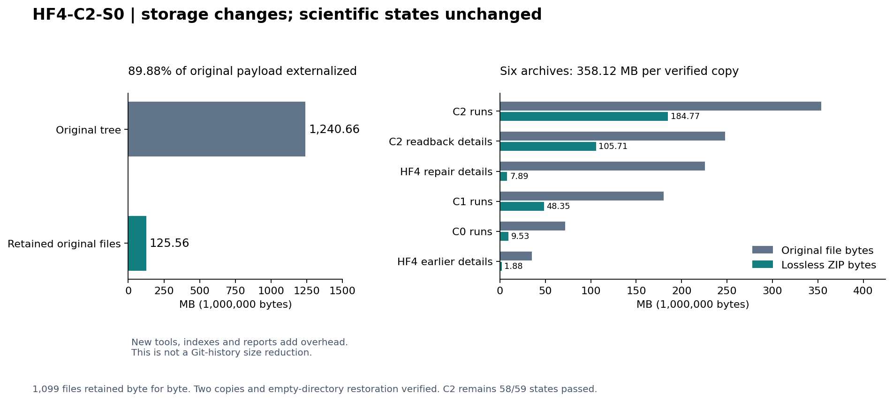

# HF4-C2-S0：可恢复资料分层记录

本阶段经用户在审阅综合意见后授权实施。目的：降低默认工作树与交接快照的载荷，保留全部原始科学证据及独立恢复能力。整体目标、两次审阅的取舍见 [综合审阅记录](HF4_C2_CONSOLIDATED_REVIEW_20260921.md)。

## 范围与状态

本地归档、双副本、空目录恢复与回归已通过；公开发布与下载回验另以发布回执记录。S0 不改变力学源码、冻结协议、材料、边界、数值容差或历史结果，不执行新的 FE 路径。稳定 F 与完整启动合同修复仍为后续工作。

基线提交：`552350cd3202432d483b4a5aa7697afbe08db12a`。原 3426 个跟踪文件共 1,240,659,013 bytes；拟外置的 1099 个文件共 1,115,101,240 bytes，保留原文件 125,557,773 bytes。新增工具、索引、回执和说明单独计量，不将原保留量当作最终交付大小。

[执行清单](../handoff/s0/execution_plan.json)限定输入、流程和停止点；[逐文件迁移候选](../handoff/s0/migration_candidate.json)记录全部成员；[原完整清单](../handoff/s0/baseline_552350/repository_manifest.json)和[原资产索引](../handoff/s0/baseline_552350/evidence_assets.json)保留原字节。

## 存储与恢复设计

六组新无损 ZIP 保留原相对路径和文件字节。`handoff/evidence_assets.json` 给出资产及成员 SHA-256；C2 run 资产显式依赖 C1 run 资产，复读详情资产再依赖 C2 run，恢复工具按依赖闭包处理。

| 组 | 原文件数 | 原文件 bytes |
|---|---:|---:|
| C0 路径 | 97 | 71,971,716 |
| C1 路径 | 218 | 180,163,430 |
| C2 路径 | 225 | 353,945,291 |
| C2 复读详情 | 40 | 248,036,952 |
| 历史 HF4 修复详情 | 324 | 225,747,212 |
| 历史 HF4 原始审计/探针 | 195 | 35,236,639 |

日常 `verify` 只核对轻量主树；`verify --asset NAME` 核对指定已恢复资产及依赖；`verify --full` 核对主树和全部声明资产，缺少任一项即失败。缺资产不新增科学审核豁免。旧 `hf-history-0.5.0` 的五个资产、标签及文件身份保持不变。

`prepare-replay` 将清单中的主树复制到尚不存在的新目录，再恢复匹配资产。科学复读随后在该独立树中执行；不对冷冻原 run 写入新详情。它不会自动运行求解或 HP 审计。

## 新电脑的最小操作

以下命令从轻量克隆根运行，只需 Python 标准库完成文件核验与恢复：

```text
python tools/handoff.py verify
python tools/handoff.py prepare-replay --destination ../hf-c2-readback-001 --asset hf4-c2-s0-c2_runs-v1.zip
python ../hf-c2-readback-001/tools/handoff.py verify --asset hf4-c2-s0-c2_runs-v1.zip
```

C1 依赖自动恢复。需要全部历史资产时，在已经准备的恢复树运行 `fetch-evidence`（不指定 `--asset`），再运行 `verify --full`。离线可用 `--from-dir <已下载ZIP目录>`，另用 `--cache-dir` 指定缓存。归档、路径或现有文件内容不符时明确报错，不覆盖已有不同内容。

安装、几何检查及可选的原保存态数值复读见 [接续指南](RESUME_DEVELOPMENT.md)。完整历史来源仍有两份未公开 MATLAB 文本；公开数值复读保持专用边界，不能作为新 FE 执行准入。

## 验收要点与科学解释

本阶段验证分为主树回归、全资产恢复和保存数据复算。既有九个 C2 测试文件的收集项、命令、环境和跳过原因分别记录；工具测试使用合成小文件检查依赖、冲突、路径边界和独立恢复，不计为物理状态。

保存态复算只读取原 NPZ 生产力及 HP80/120 字符串，重算向量误差、状态分类和有效前缀；不重新求解平衡或执行全路径 HP 本构。期待保持 59 态中 58 态通过、1810 门中 1809 门通过，细网格末态 `1.094379216402844e-11 > 1e-11`，有效前缀 `0.4375 mm`。原失败是 S0 必须保留的结果，不是迁移失败或需要自动重跑的信号。

完整 `hf_repo/`、395 个几何文件、全部原协议和科学摘要保持原字节。因更新恢复入口而修改的交付文件另列，不回写历史科学清单。两份文件系统归档副本不被描述为跨机器容灾；远端下载回验另行记录。

工作树减重不清除 Git 旧历史，不保证完整 clone 下载量同比下降。新 Release 只发布此前已经公开的载荷，不加入原论文、MATLAB 源包或新的私有来源。

## 实施与最终结果

本地存储验收通过，1,099 个候选文件已在全部前置检查通过后从新的交付工作树移出；原完整工作目录和两份归档仍保留。对应 [移出回执](../handoff/s0/candidate_removal_receipt.json)。

| 验收 | 实际结果与证据 |
|---|---|
| 六组资产及两份副本 | 每份合计 **358,122,509 bytes**；1,099 成员集合、大小、SHA 全匹配；第二份空目录恢复通过。[构建回执](../handoff/s0/build_receipt.json) |
| 轻量/完整校验区分 | 轻量默认 verify 通过；未恢复时 --full 及 C2 --asset 正确拒绝。[负对照](../handoff/s0/validation/slim_identity_negative_controls.json) |
| 真实独立准备 | prepare-replay 自动恢复 C1→C2 的443文件；随后全部11资产恢复，1,802个成员及1个完整旧ZIP通过 --full。[准备](../handoff/s0/validation/prepare_c2_replay.json)、[完整恢复](../handoff/s0/validation/full_restoration_verification.json) |
| C2 相关测试 | 基线与轻量树收集项、文件哈希完全一致：**143节点，142通过，1原有跳过**。不累计重复执行的测试数。[比较](../handoff/s0/validation/baseline_slim_comparison.json) |
| 工具测试 | **30通过、0跳过**；合成资产覆盖依赖闭包、损坏、冲突、越界和独立根。[记录](../handoff/s0/validation/tools_tests_receipt.json) |
| 源码/数据与真实加载 | 三树的237个hf_repo文件共7,058,440 bytes全部保持原哈希；两规范几何一致。真实load_run三路径验证33实现、164公开历史来源、88个C1依赖，仍恰好两份外部来源未复核。[完整比较](../handoff/s0/validation/restored_comparison.json) |
| 保存态复算 | 59态的708项向量误差逐项重现；另外1102项只重放保存标量门槛。仍58/59态、1809/1810门通过；细网格末态、有效前缀和未知标签语义均不变。[恢复后记录](../handoff/s0/validation/restored/saved_vector_replay.json) |



图中125.56 MB是保留的原文件，不含本次新增记录。最终主树大小按发布清单统计；科学总数据没有按89.88%消失，变化的是默认携带范围。SVG与生成脚本一起保存，可对照构建回执复算。

基线、轻量与恢复树均用同一 Python 3.13.6 / Windows CPU 环境，实际导入路径严格指向各自树。现有 venv 的旧 distribution metadata 为0.2.1，但实际科学源码依据冻结0.5.0及C2文件哈希确认；本次未重装环境、重发wheel或宣称新的独立安装验证。测试中的小型制造场回归与保存态向量复算分别记录，未启动真实新路径或重算保存态HP本构。

独立代码/索引审阅未发现迁移阻断，见 [工具复核](../handoff/s0/tool_review.json)。恢复失败可能保留部分新目录和已成功恢复的依赖，操作会报错，不承诺事务回滚；保留失败目录并换新目录重试。恢复工具不改变原算术、参数或力学门。

本阶段到资料分层和恢复交付为止。下一数值工作仍是完整启动合同前置修复及原稳定F计划；不能将S0通过写成C2机械准入全部通过。
