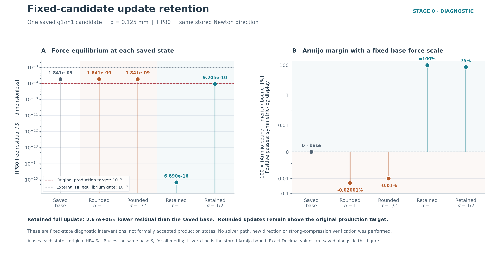
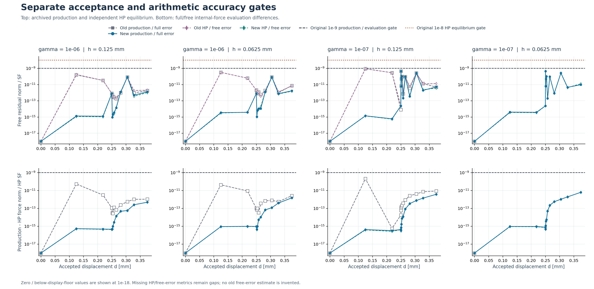
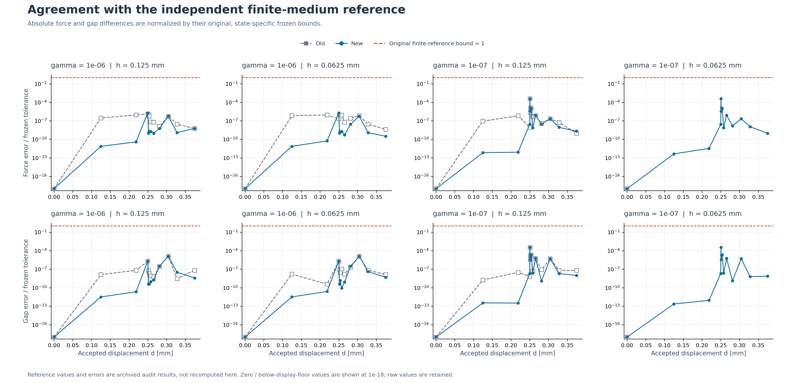
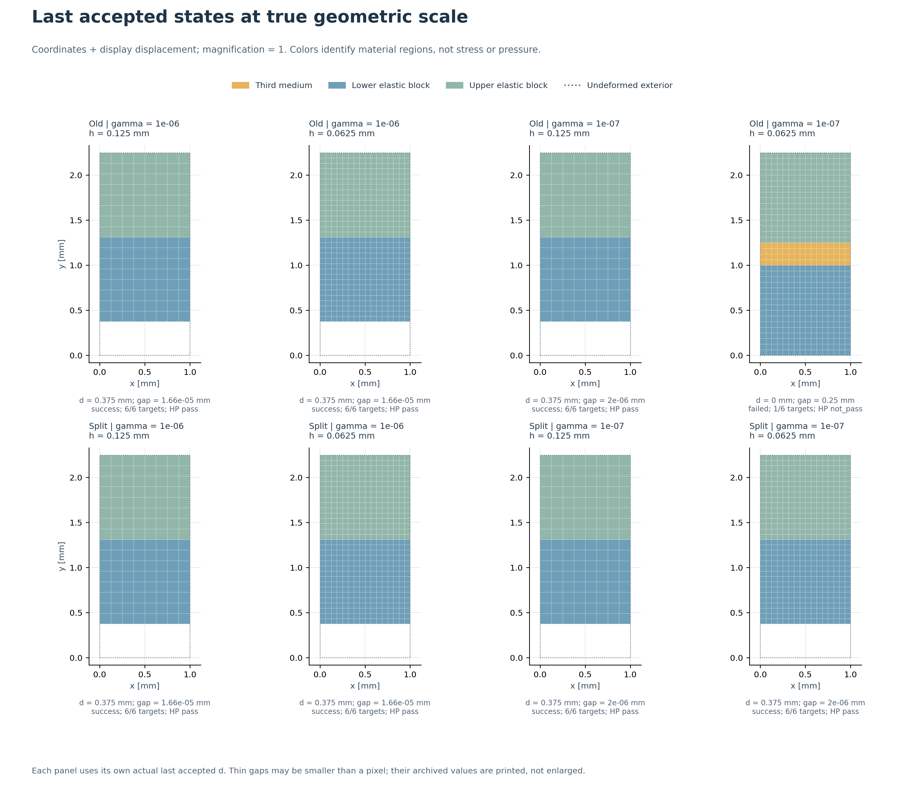

# HF4 状态表示修正报告：0.5.0

2026-09-14。**原第四组合的位移更新舍入问题已闭合；HF4-B 四条冻结均匀法向路径全部通过，独立安装验收完成。** 本轮按用户授权执行，延续“总体目标—工作—理由—效果—代码—证据”的记录要求。本文记录实际结果；计算前的[执行计划](HF4_REPAIR_EXECUTION_PLAN.md)、[实现规范](HF4_SPLIT_IMPLEMENTATION_SPEC.md)保持冻结。机器可读结论见[验收摘要](../hf4_repair_results/acceptance_summary.json)。

## 总体目标及本轮要解决的问题

整体目标是建立可脱离 LF 的正向力学评估器，用普通几何文件和明确的物理任务，给出可追溯、可重复、有单位及有效性标识的结果。真实反向器、夹持器最终的物理精度与功能表现仍需要后续证据；目前不把代码运行成功等同于高保真真值。

HF1 已完成两例独立输入与线性诊断；HF2 修正了指定 TMC 基准的实现精度；HF3 完成了两例规定数值任务及独立审计；HF4-A 建立规定运动与分侧测力。HF4-B 的 0.4.0 原版有三条完整路径通过，第四条在首个非零目标停止。先前排查显示，同一失败候选的力求值准确，但直接在绝对 binary64 位移上加校正会丢失小量。本轮目标是先验证这一因果判断，再实现分量保存，最终在原条件下重做四条路径并独立读回。历史见[原 HF4 报告](HF4_AB_REPORT.md)和[精度排查](HF4_PRECISION_INVESTIGATION.md)。

## 为什么这样修正：先做固定校正干预

阶段 0 固定原失败候选及其实际 Newton 校正，禁止换方向、再求解或改参数。对同一校正，比较直接舍入到单数组和保留两个输入分量的独立高精度结果。两个步长事先冻结为 1、1/2；五个状态各做 50/80 位计算，全部输入身份、有效域、约束和精度交叉检查通过。

| 同一失败候选的表示/更新 | HP80 自由残差 / SF | 原生产目标 1e-9 |
|---|---:|---|
| 原候选 | 1.841029863935e-9 | 未达到 |
| 全步更新，先舍入成单数组 | 1.841029892630e-9 | 未达到 |
| 全步更新，保留分量 | 6.890256964054e-16 | 达到 |
| 半步更新，先舍入成单数组 | 1.841029863935e-9 | 未达到 |
| 半步更新，保留分量 | 9.205148544459e-10 | 达到 |

保留全步使该固定候选的残差降低约 267 万倍；全步和半步同时满足原 Armijo 降幅要求。这是“保留实际校正可解除已观察平台”的直接证据，不是对所有 binary64 表示的不可能性证明。这些是诊断状态，未冒充生产接受态。见[原始摘要](../hf4_repair_results/retained_update_001/summary.json)。

## 实际改动及其理由

新版本为 0.5.0。新增三个显式运行模块，不改变原单数组接口的语义。详细公式、数组契约、操作顺序、测试对应见[实现文档](../hf_repo/docs/HF4_SPLIT_IMPLEMENTATION.md)。

| 要解决的风险 | 实际改动 | 对照位置 |
|---|---|---|
| 大位移掩盖微小校正 | 两个只读 binary64 数组 `lift`、`fluctuation` 共同定义权威位移；`u_display` 仅供显示 | [split_state.py](../hf_repo/src/hf_eval/split_state.py) |
| 先相加再微分再次丢小量 | 分别计算两分量梯度及 Hessian；`F=(I+GL)+Gw`，总 `Hu=HL+Hw`；保留完整材料、HuHu、总 J 及实际非对称 Jacobian | [split_kernel.py](../hf_repo/src/hf_eval/split_kernel.py) |
| 预测器重复补偿、回滚污染或错存失败方向 | 几何 lift 随目标变化，预测器补偿 Δlift，Newton 仅更新自由 fluctuation；两数组及切线缓存一起回滚，失败方向绑定其真实基态 | [split_prescribed.py](../hf_repo/src/hf_eval/split_prescribed.py) |
| 高精度审计仍读已舍入显示量 | 从两个实际数组精确重建状态，再用独立 Decimal Q1 公式计算；不调用生产力核 | [HP 参考](../hf_repo/scripts/hf4_split_precision_reference.py) |
| PASS 只来自可信度不足的存档标签 | 核对任务、数组、逐态 hash、目标序列、commit；从保存内力重算原生产接受条件，并独立重算 HP 与双参考 | [审计器](../hf_repo/scripts/audit_hf4_split_normal.py) |

没有把两个分量的非线性内力直接相加，也没有用显示位移代替求解状态。固定态半解析夹具仅用于检查求值精度，完整路径从零开始，不用半解析答案给生产解热启动。

阶段 1 的六个固定例覆盖真实第四组合的三个目标、非均匀场、精确等价分解及小于显示 ULP 的分量；制造测试还覆盖两分量 Hessian、非零 HuHu、强压缩、非对称切线、独立 Jv 与五步有限差分。固定检查通过后才放行首目标，首目标通过后才放行第四条完整路径，再放行其余三条。实际门禁见 [Stage1](../hf4_repair_results/stage1_gate.json)、[Stage2](../hf4_repair_results/stage2_gate.json)、[Stage3](../hf4_repair_results/stage3_gate.json)。

实现审查发现的旧方向错配和非有限状态异常问题，在首次数值验收前修正。首目标生产结果形成后、HP 运行前，又加强了存档审计的生产接受条件重算与目标范围核对；没有改生产状态、物理参数或阈值。该顺序由[审计修订记录](../hf4_repair_results/audit_review_correction.json)及两份源码冻结快照保留。

## 原物理任务和门槛保持不变

两块各高 1 mm、宽 1 mm 的弹性体，初始间隙 0.25 mm，厚度 1 mm；E=1 MPa、ν=0.3，平面应变。全部水平自由度固定，顶部竖向固定，底部施加向上规定位移。网格 h=0.125/0.0625 mm，γ=1e-6/1e-7；正则化 α=1e-6、长度 1 mm。原目标 `[0, 0.125, 0.21875, 0.25, 0.28125, 0.375] mm` 全部保留。

生产自由残差门槛 1e-9，独立 HP 平衡门槛 1e-8，内力求值预算 1e-9×SF，规定值门槛 1e-10，50/80 位交叉门槛 1e-30。SF 仍是原约束/自由内力范数及物理下限的最大值。同模型合力与间隙门槛、三个接触阶段的模型误差门槛、35 次检查/16 次回溯/8 层二分等全部保留。完整定义在[冻结物理规范](../hf_repo/configs/hf4/validation_spec.json)，SHA256 为 `002cd49edae3066d7283f5f98d1281e9c57a22c7bb33cd8be353674906d69067`。

## 实际效果：四条完整路径及逐态审计

| γ | h / mm | 原目标完成 | 接受态 / HP 通过 | 失败增量尝试 / 最大二分深度 | 最终底板对模型合力 / N | 最终间隙 / mm |
|---:|---:|---:|---:|---:|---:|---:|
| 1e-6 | 0.125 | 6/6 | 12/12 | 6 / 4 | 0.0894081203163 | 1.65944152855e-5 |
| 1e-6 | 0.0625 | 6/6 | 12/12 | 6 / 4 | 0.0894081203163 | 1.65944152855e-5 |
| 1e-7 | 0.125 | 6/6 | 14/14 | 8 / 6 | 0.0893970219058 | 2.00094783131e-6 |
| 1e-7 | 0.0625 | 6/6 | 14/14 | 8 / 6 | 0.0893970219058 | 2.00094783132e-6 |

四条完整路径共 **52 个接受态**，包括零态和二分子步；全部经 HP 审计，1576 个逐态保存检查均通过。另有首目标试运行的 2 态，单列计数。四个完整路径末态做了 50/80 位交叉检查。路径中 28 次失败增量尝试及其回滚/二分记录完整保留，最终没有失败路径，没有回溯拒绝试探步。失败增量数不等同于失败路径数。

原失败目标 d=0.125 mm 的新独立试运行，生产相对残差为 4.05920e-15，HP 相对残差为 3.64924e-15。完整四条路径的最大生产相对残差为 **4.50301e-10**，最大 HP 相对残差为 **4.50301e-10**，最大内力求值误差为 **6.24321e-12×SF**；全部在原门槛内。最终强压缩区域最小 J 仍为正，细网格 γ=1e-7 末态约为 8.00379e-6。

同有限介质独立参考相比，最大合力差 5.59882e-14 N，最大间隙差 8.31271e-14 mm，分别只使用各自容差的 0.03776% 和 0.03326%。四个末态的 50/80 位最大归一化差约 1.78421e-44。指定压紧阶段相对理想硬接触力的最大偏差为 **0.196916%**，小于原 1% 允许值；名义闭合时最大残余间隙为初始间隙的 **0.455621%**，小于原 1%。这些属于当前均匀任务的模型诊断，不是一般接触误差上界。

新旧共有的 39 个接受位移处，最大合力变化 5.59449e-16 N，最大间隙变化 2.72406e-17 mm。旧第四组仅有零态，图中不补画其失败后的路径。原先通过的响应得以保持，新增效果是第四组能在同一门槛下走完路径。

图中合力正号表示底板对模型的 +y 作用；没有双倍系数。变形图放大倍数为 1，颜色只表示材料区，不能解释成接触压力。极薄间隙可能小于像素，因此同时打印保存的数值。原始 JSON/CSV、坐标 NPZ、602 个输入文件的哈希及图件清单都在[绘图目录](../hf4_repair_results/comparison_plots_002/plot_manifest.json)。第一版布局和其资源记录保留在 `comparison_plots_001`；第二版修正列标识与注释间距，未改数值，已逐图目视检查。

## 测试、独立读回及资源

完整回归为 **592 通过、1 跳过**，随后新增的存档审计测试为 **12 通过**；去重合计 **604 通过、1 跳过**，不是一次 604 项全量运行。跳过项为既有 Windows 符号链接权限限制。完整回归出现 40 条 `record_property/xunit2` 兼容警告，XML 实际保留 41 个 properties，其中 4 个为有限差分记录；未因此丢失这些证据。见[完整 XML](../hf4_repair_results/split_regression_001.xml)与[追加 XML](../hf4_repair_results/audit_gate_tests_001.xml)。

新 wheel 在工作区以外的新虚拟环境安装，使用 `python -I`、外部工作目录及读文件/导入阻断检查，阻断原工作区、LF ZIP 和 Zotero 来源目录。细网格 γ=1e-7 的完整 A 路径、粗网格 γ=1e-6 的 B 路径及再次 A 路径，均与保存的开发态逐位一致；普通 NPZ/JSON 中的两数组成功读回、hash 通过、组装内力/J 一致，旧单数组显式导入语义也通过。共 **73 项检查通过**，见[独立摘要](../hf4_repair_results/detached/summary.json)。HP 证据通过完全一致的权威数组与该重放连接，未把独立安装再记成新的 HP 计算。

依赖版本按 lock 从本机离线缓存安装，并核对安装后的 RECORD；没有重新验证原依赖归档文件的下载哈希。独立性结论针对受检查的重放子进程；外层监控器仍在工作区记录来源哈希，不能把监控器读过来源 ZIP 描述成子进程依赖它。wheel SHA256 为 `1f411025a21d28a43b365fc48aa97340a3bb0e3ea6a8aec1dc0170ff0ef46b6c`。

全部 18 个受监控作业顺序执行，累计 **127.322 秒 / 原预算 1800 秒**，其中绘图两版及诊断图累计 13.095 秒 / 60 秒。采样进程树 RSS 峰值 **556.54 MiB / 4 GiB**，属于软监控，不是操作系统强隔离。构建与安装另记 **11.363 秒**；没有隐藏重试或非零退出作业。固定诊断中“舍入对照不达标”是预期实验结果。所有命令、时限、源码哈希、标准输出和采样方法见 [resource_jobs](../hf4_repair_results/acceptance_summary.json)及[安装回执](../hf4_repair_results/installation.json)。

## 证据保存及结论边界

所有 18 个当前运行源码文件与完整路径前的冻结快照一致；原 HF4 的 14 个非版本运行文件、376 个旧证据文件和原几何 395 文件均重新核对哈希不变。原 0.4.0 ZIP 未覆盖，其 SHA256 仍为 `b5244189723fa3426f46b75cb61404d7176914b5681eae8f7d7bd2ad57b3709a`。持续维护的 README、状态总览、需求对照及版本文件本次已更新，不声称所有工作区文件都未变化。

新交付为 [HF4_repaired_evaluator_and_evidence.zip](../deliverables/HF4_repaired_evaluator_and_evidence.zip)，包含新 wheel、源码/测试、任务规范、新旧 HF4 普通文件证据及图件。Git 版本、包哈希、文件数和逐文件清单由[新发布清单](../deliverables/HF4_repair_release_manifest.json)记录；安装与复验入口见[交付说明](../HF4_REPAIR_EVIDENCE_README.md)。原几何本轮仅作完整性核查，仍由既有 HF3 交付包承载。

HF4-B 对冻结均匀任务的数值、双参考和独立搬迁验收已完成。分量表示仍使用 binary64，不能保证任意分解或任意尺度都准确。均匀路径的 HuHu 接近零，制造测试中的非零 HuHu 也不能代替非均匀接触路径的验证。

下一步应准备并冻结 **HF4-C 非均匀二维接触验证计划**：选择独立参考，明确不依赖 TMC 参数定义的间隙/合力观测量，先校核小规模混合变形及非零 HuHu，再安排网格、第三介质和正则化影响的分离检验。参考、参数和门槛应在求解前确定。本轮未执行 HF4-C/D、圆柱、稳定性或真实机构功能评价，未进行候选排名。
