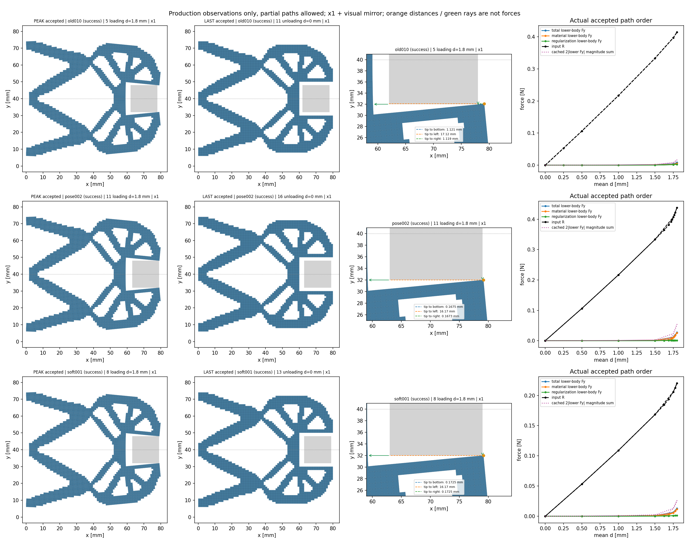
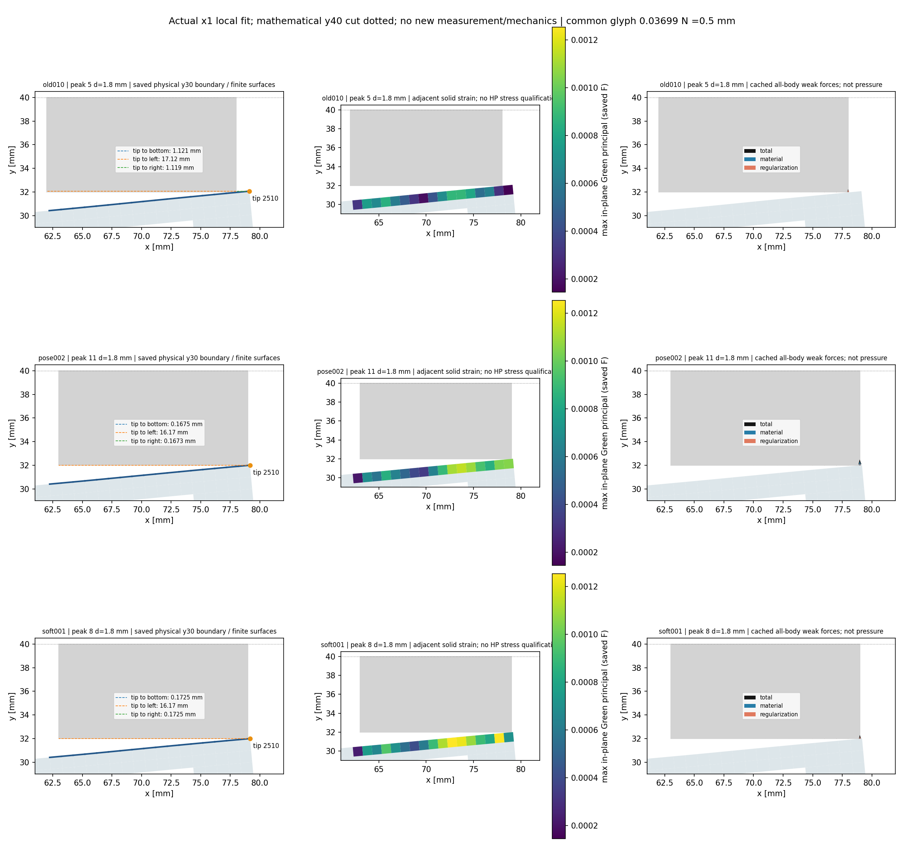

# HF 功能进度与工件结果

本地更新：2026-10-05；证据阶段标识：20261004。

当前已完成“原生几何 → 明确材料、支承与固定工件 → 有限变形三分量内力 → 独立切线组装与平均位移平衡 → 完整加载—卸载 → 保存状态、独立参考和实际显示”的粗网格方体功能链。x70/E=1、x71/E=1、x71/E=.5 三组原完整任务均已闭合。当前先保留 **x71、E=1 MPa 作为较高受力基准**，E=.5 作为低驱动力及局部变形探索工况；下一步优先对齐钳尖与工件真实边界，再判断是否局部软化。整体独立 HF 项目尚未完成。

本报告只整理已闭合存档及代码能力，不运行新求解、力、切线、HP 或几何观测。三组数值与来源见 [最终对比 JSON](evidence/workpiece_shift_20261004/final_comparison.json)。

## 整体目标与研究层的位置

总体目标是让 HF 在不导入 LF 优化器的情况下，仅凭自包含几何和明确任务，独立评估真实反向器/夹持器的非线性响应，并给出有单位、方向和适用范围的结果，最终支持既有研究层的同任务候选比较。目标定义见 [PROJECT_STATUS.md:7](PROJECT_STATUS.md#L7)。

LF/N4 来源层已有优化、多样化几何、评分、筛选与导出流程，本仓库保存了来源审计、参考材料和取舍记录；不能把这些说成尚未编写，也不能把来源测试当成本轮重新验收。尚缺的是当前独立 HF 后端与该研究流程的同任务评价、共同有效域、敏感性与批量标签闭环，而不是在 HF 内重做 LF 优化器。见 [LF 来源审计](../research_integration_20260920/LF10_SOURCE_AUDIT.md#L90)、[研究层复用与标签边界](../research_integration_20260920/external_reviews_20260921/inputs/comparison_review.md#L122)及 [HF5 条件](../research_integration_20260920/INTEGRATION_DECISIONS.md#L60)。

## 已实现的实际功能

| 功能 | 当前实现与物理含义 | 关键代码 |
|---|---|---|
| 原生输入与任务 | LF v2 四掩膜、网格与区域来源保留，不隐含重采样；按显式 native 网格建立 Q1 模型，实体附着支承与任务背景约束分别记录 | [lf_v2.py:54](../hf_repo/src/hf_eval/lf_v2.py#L54)、[native_map.py:59](../hf_repo/src/hf_eval/native_map.py#L59)、[native_project.py:189](../hf_repo/src/hf_eval/native_project.py#L189) |
| 实体与第三介质有限变形 | 二维平面应变可压缩 Neo-Hookean、3×3 Lobatto Q1；保存 F、J、Hu 与材料/正则/总内力。Hu 正则项以弱式内力加入，切线由残量求导；不把它解释为已验收总能量的 Hessian | [tmc_kernel.py:1](../hf_repo/src/hf_eval/tmc_kernel.py#L1)、[split_kernel_invariants_hu.py:128](../hf_repo/src/hf_eval/split_kernel_invariants_hu.py#L128) |
| 平均端口控制与切线 | 只约束输入端口加权均值，各节点保留不同实际位移；输出自由测量。独立 NumPy 三切线保留非对称性，组装全 DOF CSC，KKT 用一般稀疏 LU | [split_displacement.py:163](../hf_repo/src/hf_eval/split_displacement.py#L163)、[split_displacement.py:206](../hf_repo/src/hf_eval/split_displacement.py#L206)、[split_numpy_tangent.py:168](../hf_repo/src/hf_eval/split_numpy_tangent.py#L168) |
| 连续加载—卸载 | ordered_cycle 保持状态、反力与切线连续；有符号预测、Armijo、失败回滚和二分。起点零与返回零按实际 index/leg 分别保存，不去重 | [split_displacement.py:220](../hf_repo/src/hf_eval/split_displacement.py#L220)、[split_displacement.py:287](../hf_repo/src/hf_eval/split_displacement.py#L287) |
| 固定工件与三分量测力 | 方/圆原生单元约束覆盖入口已有；本次方体所有节点 ux/uy 固定。工件 on-body 力为负的保存全局内力，holding 为反向约束反力，材料/Hu/总量分别保留 | [native_project.py:95](../hf_repo/src/hf_eval/native_project.py#L95)、[native_project.py:142](../hf_repo/src/hf_eval/native_project.py#L142)、[native_mean.py:66](../hf_repo/src/hf_eval/native_mean.py#L66) |
| 缓存、节点力与显示 | 每接受态缓存原始 lift/fluctuation、16 机械字段、三局部切线和 full CSC；保存不追加力学调用。全部工件节点、四互斥组、带基准点的普通力矩可观察。已有真实 ×1 结构/GIF、明确 ×4 辅助、三力、J/Hu 与数值曲线 | [native_mean.py:175](../hf_repo/src/hf_eval/native_mean.py#L175)、[workpiece_nodal.py:13](../hf_repo/src/hf_eval/workpiece_nodal.py#L13)、[已归档 old010 实际路径动画](../functional_views/native_workpiece_cycle010_20261004/saved_render_001/animation_001/cycle010_actual_path.gif) |
| 保存几何诊断 | 原生凸 Q1 跨区域 AABB/SAT 内部重叠、有限底/左面法向射线和最近点；物理射线排除对称切口，节点窗口代理与边界量分开 | [native_region_geometry.py:45](../hf_repo/src/hf_eval/native_region_geometry.py#L45)、[native_region_geometry.py:206](../hf_repo/src/hf_eval/native_region_geometry.py#L206) |

可选 chunk256 只降低切线临时数组成本，保留全域算术分支和全部三切线；默认 full 未改。三组本轮任务显式使用机械模式与 chunk256。v5 near-identity 方向尺度修复已有原 T44 捕获态的独立 full/chunk 等值及声明方向验证，范围不扩为任意输入或一般接触。入口见 [native_mean.py:113](../hf_repo/src/hf_eval/native_mean.py#L113)，切线见 [split_numpy_tangent.py:107](../hf_repo/src/hf_eval/split_numpy_tangent.py#L107)。

## 三组完整任务的实际结果

三组保留同一原 11 目标：`0,.5,1,1.5,1.75,1.8,1.75,1.5,1,.5,0` mm，从零独立求解并卸载回零。方体边长 16 mm、中心 y=40 mm，实体 ν=.3，物理正则长度 80 mm；模型为下半域，工件所有节点 ux/uy 固定。二分产生的接受态全部保留，起始零与返回零按实际 index/leg 区分。拒绝的预测态不会当作接受态。

| 终态存档 | old010：x70，E=1 MPa | pose002：x71，E=1 MPa | soft001：x71，E=.5 MPa |
|---|---:|---:|---:|
| 实际接受态 N | 12 | 17 | 14 |
| F 开始 / 完成 | 94 / 93 | 137 / 131 | 109 / 106 |
| T 开始 / 完成；solve | 53 / 52；1 | 74 / 74；1 | 60 / 60；1 |
| 独立新 HP80/120 次数 | 24 | 34 | 28 |
| 独立检查通过数 | 232272 | 328767 | 270829 |
| 生产 helper / outer，s | 554.2432 / 555.2542 | 1413.3505 / 1414.6824 | 1193.0719 / 1194.5673 |
| 参考 helper / outer，s | 458.1120 / 459.3966 | 618.8915 / 620.5328 | 458.0255 / 459.2233 |

old010 的合格参考来自独立 Ref003 完整任务，不能拼接较早关闭的参考前缀。pose002 的生产预算为 1500/1560 s，soft001 为 1800/1860 s；两者独立参考各为 900/960 s，均为 8 GiB 新卡。它们没有延长或重跑已关闭 pose001；pose001 的部分路径失败仅保留为成本依据。

下面都是 d=1.8 mm 的实际峰态。q_out 是自由输出端口的加权 +y 位移，工件力是下半体的 on-body 力；J=det F 是变形体积比，Hu 单位为 mm⁻¹，都不是接触压力。

| 峰态物理量 | old010 | pose002 | soft001 |
|---|---:|---:|---:|
| 输入反力 R，N | .414394469 | .438197194 | .220257568 |
| 自由 q_out，mm | 2.080193630 | 2.015337113 | 2.009948069 |
| 钳尖节点 2510 的 (x,y)，mm | (79.11853779,32.07543607) | (79.16727043,32.00927435) | (79.17248920,32.00412982) |
| 钳尖到有限右面的无符号距离，mm | 1.118537793 | .167270432 | .172489199 |
| 有限底面首次法向射线距离，mm | .031790972 | .005809248 | .011497544 |
| 实体 min J | .955246548 | .956314420 | .956419612 |
| 第三介质 min J | .006620899 | .000831661 | .003294854 |
| 第三介质 max \|Hu 分量\|，mm⁻¹ | .488739708 | .354391247 | .349235316 |
| 局部接近边相邻实体的最大 Green 主应变 | .000879797 | .001149255 | .001253339 |
| 下半工件总力 (Fx,Fy)，N | (-.001216033,+.008127016) | (-.002694483,+.026924035) | (-.001492287,+.013004166) |
| 下半体材料 Fy / Hu Fy，N | .005528807 / .002598209 | .025894241 / .001029794 | .011721003 / .001283163 |

三组返回零均保存 min J=1，R/q_out 为接近零的小量而没有人为归零：old010 约 −1.06×10⁻²² N / +1.89×10⁻²² mm，pose002 约 +1.94×10⁻²⁹ N / −3.20×10⁻²⁹ mm，soft001 约 +3.72×10⁻³⁰ N / −1.59×10⁻²⁹ mm。这表明这些完整任务能卸载回到近参考状态，不等于自由工件夹持或材料安全已验证。

pose002 生产依据：[result.json](../lf_data_preparation/native_workpiece_001/shift_square_pose_002/run_001/result/result.json)、[生产回执](../lf_data_preparation/native_workpiece_001/shift_square_pose_002/run_001/execution_receipt.json)；独立资格依据：[summary](../lf_data_preparation/native_workpiece_001/shift_square_pose_002/reference/summary.json)、[lifecycle](../lf_data_preparation/native_workpiece_001/shift_square_pose_002/reference/lifecycle.json)。soft001 依据：[实际结果](../lf_data_preparation/native_workpiece_001/shift_square_soft_001/run_001/result/result.json)、[独立 summary](../lf_data_preparation/native_workpiece_001/shift_square_soft_001/reference/summary.json)、[lifecycle](../lf_data_preparation/native_workpiece_001/shift_square_soft_001/reference/lifecycle.json)。最终对比 JSON 绑定三组完整来源，包括 old010 的 Ref003。

独立参考只覆盖这些实际接受态的三力、声明 PORT 方向切线作用、组装对账、平均约束/平衡和有符号工件投影。生产原 HP/equilibrium/HF flags 仍为 false，独立参考另行记录。未授切线全列、拒绝态、压力、应力 HP、辅助能量、一般接触或 HF5 资格。节点合力及带基准点力矩属于保存数组的普通汇总，本轮没有新增其 HP 资格。

半模型镜像合力为 (2Fx,0)。pose002 的 2|Fy|=.05384807002 N、soft001 的 .02600833284 N 只是双侧分量模之和，不能称净力、压力或已证实夹持力。当前固定约束承担 holding；结果不证明自由工件会静止、稳定或被夹持。

## 实际形状、力与局部接近边

[三组实际 ×1 结构与节点力对比](../functional_views/workpiece_shift_20261004/complete_002/view/comparison.png)、[距离和三分量力曲线](../functional_views/workpiece_shift_20261004/complete_002/view/distances_forces.png)、[峰态实体应变与第三介质场](../functional_views/workpiece_shift_20261004/complete_002/view/peak_fields.png)及 [显示元数据](../functional_views/workpiece_shift_20261004/complete_002/view/view.json)已保存。图使用全部真实接受态，不插值、不去重加载/卸载同位移；尺度与镜像约定在图和元数据中明确。

新的 complete_002 图卡完成 43 次保存几何观测与 43 次保存节点力观测，helper 45.5570 s；没有新增 F/T、模型构造、solver 或 HP。局部图 [local_fit.png](../functional_views/workpiece_shift_20261004/fit_001/view/local_fit.png)及 [元数据](../functional_views/workpiece_shift_20261004/fit_001/view/fit_view.json)复用已有边、节点力与保存 F，helper 9.8792 s，连几何观测也没有新增。Green 主应变由保存 F 做 binary64 派生，属于可检查的形变诊断，不是新应力/应变 HP 资格。

## 为什么保留 x71/E=1，再优先对齐真实边界

将中心 x70→x71 改的是工件位置与固定覆盖，机制设计和原材料不变。x71/E=1 峰态钳尖为 (79.16727043,32.00927435) mm，仍在工件右面 x=79 外 .16727043 mm。底面射线 .00580924818 mm 来自边 2509–2510 的内部点至 (79,32) 角点，**不是钳尖间隙**，不能写“钳尖已经接触”。左面射线同样是有限面的方向诊断，不能与节点窗口代理或任意最近点距离混称。来源区分见 [钳尖与射线说明](evidence/workpiece_shift_20261004/physics_tip_alignment_note.json)与最终三组对比。

soft001 保持同位置、网格、工件、端口和完整路径，仅将实体 E=1→.5 MPa，同时将 γ、α 从 10⁻⁶→2×10⁻⁶。实体 Lamé 系数减半，但 **第三介质绝对 Lamé 系数及全域 kr 原值保留**；E×厚度标度从 20→10，原 floor 公式不变。材料分配见 [native_project.py:245](../hf_repo/src/hf_eval/native_project.py#L245)。因此它是在同一位移控制下改变实体相对介质/正则项的软硬关系，不保证尖端闭合更多。

实际结果是：soft 局部接近边最大主应变从 .001149255 增至 .001253339，增加约 **9.06%**；输入 R 及工件 Fy 约减半，但钳尖右面距离从 .167270432 增至 .172489199 mm，底面射线也由 .005809248 增至 .011497544 mm。局部变形增加没有转化为更好的尖端贴合，更不能推出夹持增强。因此当前采用 **x71/E=1 的较高受力结果作基准**，E=.5 保留为低驱动力及局部变形探索，不改成默认材料。

下一步先检查并设计钳尖与工件真实有限边界的对齐，再据新任务结果决定是否局部软化；不直接盲目加行程。x72 可作为下一独立位置任务候选，但边长 16 mm 的工件会到 x=80 计算域外边界，右侧第三介质余量为零，不能视为只有位置数值改变。该任务尚未执行，也不能用当前尖端坐标预判其接触、穿透或受力。

## 还缺什么，已有代码到哪一步

- **研究层耦合和批量 HF 评价**：已有 LF/N4 生成/评分与来源资料；当前 HF 原生适配和单任务机械链已接通。同任务后端接入、共同分析政策 H2/任务定义 H3、候选比较和 HF5 统计仍未完成，不重新宣称上游优化从零缺失。
- **真实自由刚体及接触功能**：当前工件固定全部 ux/uy，没有自由刚体平移/旋转未知量及力矩平衡，也没有摩擦/滑移定律或已验证一般进入—释放—重入/角点接触。仓库有受限无摩擦法向/闭合接触基准代码（[contact_reference_a0.py:1](../hf_repo/src/hf_eval/contact_reference_a0.py#L1)、[normal_contact.py:58](../hf_repo/src/hf_eval/normal_contact.py#L58)），不能把其范围外推为本 x71 工况的一般接触能力。
- **压力、应力和能量**：P/S 字段及旧完整能量入口存在；当前机械模式明确省略材料能量，`not_evaluated/qualified:false`，不以它阻塞机械残量。此次工件路径没有压力、应力 HP、辅助能量或材料安全资格；Hu 弱式项不能直接当一个已验证总能量。[native_mean.py:133](../hf_repo/src/hf_eval/native_mean.py#L133)、[split_kernel_invariants_hu.py:182](../hf_repo/src/hf_eval/split_kernel_invariants_hu.py#L182)。普通节点力矩是保存数组诊断，本轮没有新增其 HP 资格。
- **几何与网格范围**：方体完整原生区域和有限两面诊断已实现，尚不测试完整集合包含、机构自重叠或 signed penetration。圆形固定单元覆盖可构造，但圆形完整物理边界/相应平衡没有本次资格；仍是 native 阶梯边界。原细 LF 夹持器的无工件 .025 mm 四态路径已成功，8 HP/307565 检查通过（[细例 summary](../lf_data_preparation/native_fine_task_025_001/audit/summary.json)）；细网格工件近接触循环及匹配设计的网格/参数收敛仍待完成，另一细设计不能称同机构网格收敛。

后续科学工作应由本步结果逐项推进：先真实边界对齐及第三介质空间余量，再按保存的尖端位置、三分量力、J/Hu 和完整卸载判断是否需要局部软化；随后才扩展自由工件、圆形真实边界及研究层同任务评价。当前已实现的固定工件机械功能可继续使用，整体 HF 完成、硬接触、压力与真实夹持仍不能提前宣称。

2026-10-07接续：右缘到80mm、side18的新24态循环与48次新参考通过；峰单侧Fy=.119008N，双侧法向幅值和=.238015N，钳尖底面距.005701mm。参见[新功能与取舍记录](WORKPIECE_ENLARGEMENT_20261007.md)，本页既有内容保留为原时点历史。
