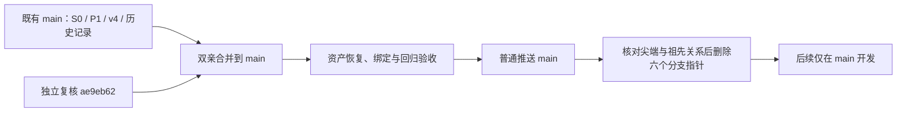

# main 整合执行记录（2026-09-27）

恢复与回归已通过；本提交推送后再执行六个远程分支的条件删除。删除完成后追加最终回执。

## 目标、授权和工作理由

整体目标是建立与 LF/N4 解耦、能在另一台计算机恢复、任务定义明确且结果可审计的 HF 正向力学评估器。研究层继续复用 N4 的候选生成、选择与统计；HF 必须分别具备数据契约、数值、接触物理和最终机构功能资格。

本轮针对多分支造成的代码、证据与说明入口分散，依据用户“好的，按照你的计划进行合并和删除吧”执行[已审阅方案](MAIN_CONSOLIDATION_PLAN_20260927.md)。该方案及分支审查 JSON 保留的是实施前快照，里面“尚未推送”“仅本地”等描述不是本轮完成状态。当前状态以本文、[CURRENT_STATUS](CURRENT_STATUS.md)和实际回执为准。

## 合并内容与取舍

- 先将本地 main 快进至远程 `2def941ddc94823ea0686bbd63ddbafa20f4b101`，保留已经合入的 S0、P1、归档、后续记录及 v4。
- 通过双亲合并接纳独立复核 `ae9eb62dd64611c5ff3e6c4a9e6c4c1ab0fbada5`。合并主体提交：`由包含本报告的双亲合并提交标识；完成回执中补入完整 SHA`。未用整目录覆盖或挑选摘要代替原提交与证据。
- 保留独立算术/制造场/保存态复核、原数组和图表、来源快照及失败解释。C1/C2 来源绑定抽出纯数据校验函数，补齐 39 个合成合法/拒绝用例；不改科学计算公式。
- 统一 README、恢复指南、当前状态和 main 开发流程，新增近旋转解释范围勘误。旧报告不改字节，三个近旋转完整力失败仍保留；不能据当前算法失败宣称所有 binary64 方法均不可能达标。
- 追加两包外置资产索引，原 11 项资产保持。新增 tracked-only 交付清单构建工具，修复原清单落后于 main 的覆盖问题。旧 main 清单另存 `handoff/snapshots/repository_manifest_before_main_consolidation_20260927.json`。
- 旧工作树中三份此前没有精确 Git 副本的文档原字节已纳入分支审查资料；本地工作树和未跟踪文件没有删除。



## 验证及实际效果

| 核查 | 结果 | 边界 |
|---|---|---|
| 科学文件保留 | 1,782 个指定既有文件原字节一致；0 缺失、0 失配 | 覆盖源码、配置、几何和既有 HF4 文件；范围见回执 |
| v4 冻结身份 | 协议 SHA 不变，21 项实现绑定全部一致 | 没有重冻结协议，也未切换默认内核 |
| 两包本地核验 | 2 个 ZIP、135 个成员的 SHA/大小及留存记录绑定全部通过 | 两包均为既有产物 |
| 发布与第二副本 | GitHub 服务器 SHA 一致；从无认证公开 URL 重新下载，两包 SHA 再次一致 | 原 11 包复用此前公开下载缓存并重新逐包哈希 |
| 空目录完整恢复 | `D:/hf-main-restore-20260927-001` 中 13 项资产通过；1,937 个恢复文件与 1 个保存原包核验通过 | 同机异目录的交付/文件身份验收，不是跨平台力学证明 |
| 独立读取 | 新目录源码导入、inverter/gripper 两例 40×80 几何读取通过 | 明确记录 import 路径及环境，不借旧源码读取 |
| 实际回归 | 收集 1558 项，1556 passed、2 skipped、0 failures、0 errors | 另有 25 个 subtests 通过，40 条 warnings；不是新的生产路径 |

回归命令在完整恢复树运行，`PYTHONPATH` 固定为该树 `hf_repo/src`，CPU/x64 和单线程环境记录在读取回执；Python 3.13.6，NumPy 2.4.6、SciPy 1.17.1、JAX/JAXLIB 0.11.0、pytest 9.1.1。pytest 进程墙钟为 227.337 秒。JUnit 的 1583 个 testcase 记录包含 25 个 subtests，不与 1558 项收集总数混计。

```text
python -m pytest hf_repo/tests tools hf4_c2_v4_results/test_external_payloads.py --collect-only -q
python -m pytest hf_repo/tests tools hf4_c2_v4_results/test_external_payloads.py -q -ra --junitxml=pytest_regression.xml
```

跳过项原样记录如下，不能计为通过：

- `tests.test_contact_c2_readback.test_present_historical_sources_are_verified_when_available`：external historical source bytes are intentionally optional
- `tests.test_data.test_descriptor_symlink_cannot_introduce_external_dependency`：Platform does not permit creating a symlink: [WinError 1314] 客户端没有所需的特权。: 'C:\\Users\\Lenovo\\AppData\\Local\\Temp\\pytest-of-Lenovo\\pytest-522\\test_descriptor_symlink_cannot0\\external\\geometry.json' -> 'C:\\Users\\Lenovo\\AppData\\Local\\Temp\\pytest-of-Lenovo\\pytest-522\\test_descriptor_symlink_cannot0\\package\\geometry.json'

整包合并的 whitespace 检查存在历史 SVG 及来源快照原有的 5,074 条格式提示（11 个文件）；逐文件确认与独立复核提交完全相同，未为清除此类提示破坏证据字节。新编写文件与当前编辑的检查另存回执。恢复验收使用当时的 3,438 项 payload 清单；随后新增验收回执与最终报告后重新构建清单并做交付校验，不把前一份清单冒称最终数量。

## 资产与恢复入口

新固定 Release：[hf4-c2-followup-evidence-v1](https://github.com/dudaxing/Compliant-TO-TMC/releases/tag/hf4-c2-followup-evidence-v1)。标签指向已公开包含产物的 `2def941`，它是证据存储版本，不是新的力学版本。

| 资产 | 字节数 | SHA-256 |
|---|---:|---|
| `hf4-c2-stable-f-saved-production-arrays-v1.zip` | 30,139,093 | `edf3d6dc15e023ec1fbdabc55c75adc5204e54002412b72ca5c74855f86c9121` |
| `hf4-c2-v4-mesh_h00625_v4-payloads-v1.zip` | 123,161,709 | `8a08bbfe46998519cac3bce31450a693f197c1e14c3e7ef78658155193b2bf1c` |

stable-F 最小依赖为 S0 C2（间接含 C1），v4 为 S0 C1；如需 v3 对照显式选择 C2。普通恢复统一使用 `tools/handoff.py`，完整命令见[接续指南](RESUME_DEVELOPMENT.md)。完整恢复当前 main 不自动满足历史 stable-F driver 锁定的 S0 提交、manifest 与 index；历史复跑仍需原冻结基线，不能修改锁定哈希来适配新 main。

## 分支处理与历史保留

删除前逐个确认完整尖端是发布 main 的祖先，读取远程尖端未变化后使用带精确旧 SHA lease 的原子删除。lease 仅保护分支指针删除；main 使用普通推送，未强推或改写历史。所有旧标签、Release、本地历史工作树保留。

| 远程分支 | 保存的原尖端 | 处理 |
|---|---|---|
| `claude/archive-c2-p1-f-workspace-20260921` | `afc9d8322b06ba2a981673b033135d8aef17f2a1` | 验收后条件删除 |
| `claude/hf4-c2-p1-stable-f` | `6a40957214c2a4121f149b429b4126eeb4767d3a` | 验收后条件删除 |
| `claude/hf4-c2-v4-plan` | `1f3fb9c2f74aca77b79c1edbe4128e5cfbda0175` | 验收后条件删除 |
| `claude/post-merge-records-20260927` | `754a7a23c0ae70a60b3e0b515b458bea2329c48a` | 验收后条件删除 |
| `codex/hf4-c2-independent-recheck-20260927` | `ae9eb62dd64611c5ff3e6c4a9e6c4c1ab0fbada5` | 验收后条件删除 |
| `codex/hf4-c2-s0` | `7fea2e44b67d0eff421219ebbcac68c506fb9d2f` | 验收后条件删除 |

分支指针删除后，以上完整提交继续能从 main 历史到达。最后追加的完成报告提交也是普通 main 提交；最新发布 SHA 以 `git rev-parse origin/main` 为准，避免在被自身清单绑定的文件中制造提交哈希自引用。

## 科学结论与下一步边界

stable-F 保存态为 63/63 通过，制造场仍为 30/33。v4 唯一细网格路径为 21/21 状态、651/651 检查、7/7 原目标通过；v3 原末态失败保持。v4 一次求解与一次审计额度已用完。整合不会增加新的科学 PASS，不切换默认内核，不扩展为一般接触/网格收敛资格，也未实施 HF5。

本轮停止在主干整合、恢复验收与分支清理。后续按 CURRENT_STATUS 处理三个近旋转制造场的分段归因，再据独立数值证据作算法取舍。新生产路径须有明确的协议、身份、预算和验收，不能自动复用已经耗尽的旧额度。

## 审查定位

实际回执均位于 [`handoff/main_consolidation_20260927/`](../handoff/main_consolidation_20260927/)：`execution_plan.json`、`scientific_preservation_check.json`、`local_asset_check.json`、`release_publication_001.json`、`public_download_check.json`、`full_restoration.json`、`full_restored_verify.json`、`geometry_inspect_result.json`、pytest 收集/日志/XML、`whitespace_review.json`，以及分支删除完成后的 `branch_cleanup.json`。完整 SHA 与检查范围以各回执为准。原审批方案和独立复核原件继续保留。

正式本地开发根：`D:/Coding/Diversity TO/Compliant-Nonlinear-TMC-O/.github_handoff/Compliant-TO-TMC`；源码位于其 `hf_repo/`。唯一推送地址：`https://github.com/dudaxing/Compliant-TO-TMC.git`。其他电脑可克隆到任意路径；后续统一在 main 开发，遵守[开发流程](DEVELOPMENT_WORKFLOW.md)。
