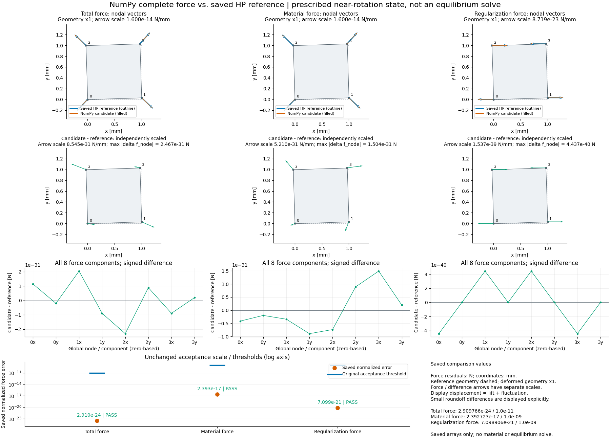
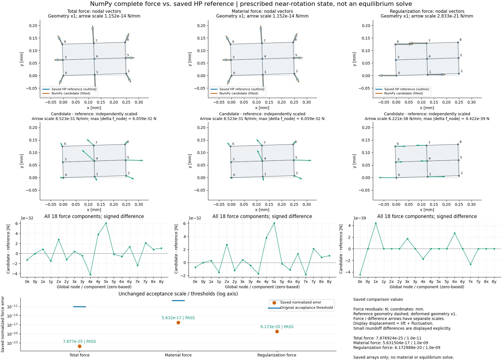
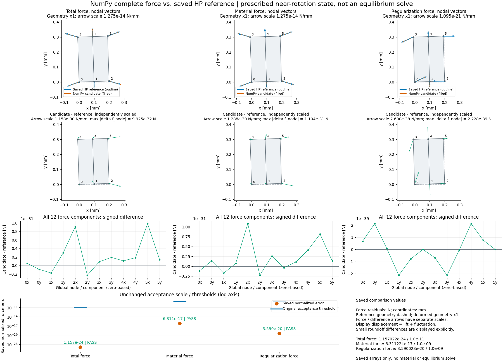
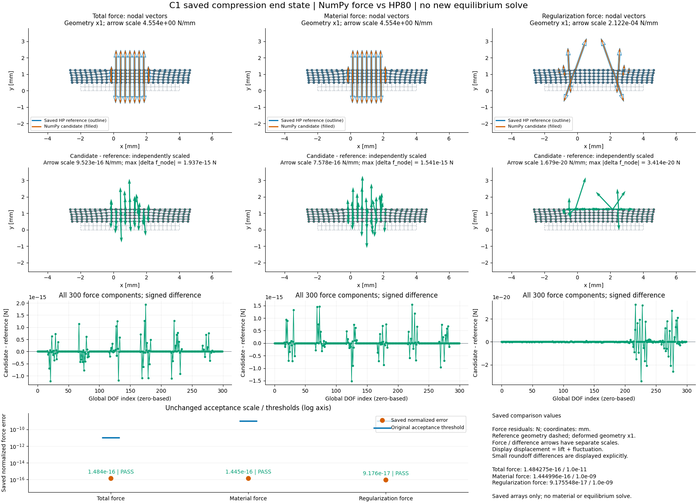

# NumPy 完整力入口：功能进度与参考比较

2026-10-03接续：[原完整33制造＋63保存范围、局部算术修复及实际图](#numpy-scope-20261003)已完成，修订后的独立96状态范围通过。下文2026-10-02的路径证据保留自己的执行源码身份。

2026-10-02。用户授权“优先实现新候选的 NumPy 完整力入口及参考对比，再根据结果推进组装、切线和平衡求解”。本文记录此步的目标、实现、数值效果与边界；不改写旧 F 系列的结果或授权记录。

## 整体目标及本步位置

整体目标仍是独立 HF 正向力学评估器：从普通几何、材料、支承和任务得到有单位、有方向的位移、节点内力、约束反力与任务响应，最终支持真实机构与工件的夹持任务及候选比较。HF 运行时不依赖 LF 工作目录或优化器。现有旧 TMC 已能组装材料力、正则力、总力和一致非对称 Jacobian，并求解已验证的平衡路径；这次补足的是近旋转新候选的可用入口。

旧稳定 F 候选在三个近旋转制造场中未达到原力门限。新候选此前主要通过算术原语和局部比较，完整 compiled force 的执行与候选 AD 尚未闭合。因此先用已有 NumPy `_response` 计算真实完整力向量，可以直接判断公式是否有效，并得到可用功能。Profiler 证据不再作为这一功能步骤的永久前置条件。

## 已实现什么，为什么逐步扩大

- [batch_response_split_numpy](../hf_repo/src/hf_eval/split_kernel_invariants_hu.py) 返回批量单元的材料力、Hu 正则力、总力、应力、运动学和支持域字段。它复用原公式、split 两数组及原有输入检查，没有更改物理模型或门限。
- 单位近旋转场的八个自由度首先通过三力门。随后才增加 `assemble_split_numpy`，将单元贡献按全局自由度累加，验证两个多单元矩形场的共享节点组装。
- 三个制造场通过后，进一步读取一个 C1 保存压缩末态，验证 120 单元／300 自由度的完整组装及法向力读数。这是保存状态的响应重算，没有重新求平衡。
- NumPy 入口不调用 `_runtime` 或 JIT 执行；**模块 import 仍依赖 JAX**。它不是一个已完全去除 JAX 依赖的新软件包。默认 compiled 入口及历史证据保持原来的资格。

本轮 [test_split_numpy_force.py](../hf_repo/tests/test_split_numpy_force.py) 的 **8 项测试通过**：恒等场与解析剪切力、非零 Hessian 的解析正则力、混合分支／批量系数、共享节点组装，以及四类非法状态的既有错误码。测试把 `_runtime` 和两个 compiled 批量入口替换成报错函数，检查 NumPy 功能不执行它们。

## 实际效果与原验收尺度

以下四个固定场比较使用已存 HP80／HP120 的原十进制参考，未生成新的 HP 参考。候选 binary64 值先精确转为 Decimal，再与参考相减；绘图使用该差值的浮点显示值，避免先舍入参考后相减而掩盖微小误差。新平衡态的独立审计另见后节。

总力误差为 `||f - f_HP80||₂ / S_F`；两分力使用 `max(||f_component_HP80||₂, 1e-12*S_F)`。`S_F` 保留原案例定义。原门限分别为总力 **1e-11**、材料力 **1e-9**、正则力 **1e-9**。三近旋转场 `S_F=1.25e-7 N`；C1 为 `34.8537543751 N`。这里的归一误差是无量纲数，不是力值。

| 保存场；单元／DOF | 新总力误差 | 新材料力误差 | 新正则力误差 | 三力原门 |
|---|---:|---:|---:|---|
| unit；1／8 | 2.909766e-24 | 2.392723e-17 | 7.098906e-21 | 全通过 |
| dyadic rectangle；4／18 | 7.876924e-25 | 5.631504e-17 | 6.172988e-20 | 全通过 |
| nondyadic rectangle；2／12 | 1.157022e-24 | 6.311224e-17 | 3.590023e-20 | 全通过 |
| C1 state 014；120／300 | 1.484275e-16 | 1.444996e-16 | 9.175548e-17 | 全通过 |

以下是同一参考下的保存生产基线误差，对应 summary 中 `old_stable_F_normalized_error`。不重新命名旧失败为通过，也不将 C1 已有通过说成此前整个项目没有力功能。

| 保存生产基线 | 旧总力误差 | 旧材料力误差 | 旧正则力误差 |
|---|---:|---:|---:|
| unit | 7.609767e-8 | 1.047624 | 1.011385e-19 |
| dyadic rectangle | 1.323342e-8 | 1.046521 | 3.222423e-3 |
| nondyadic rectangle | 1.973855e-8 | 1.045212 | 1.958983e-3 |
| C1 state 014 | 2.542625e-12 | 2.542636e-12 | 7.175562e-16 |

三个近旋转制造场的新材料力与总力显著改善；两个矩形场的正则力也达到原门。单位场的正则力基线本已通过。C1 基线本已通过，本轮证明该候选在这个保存压缩态也可完整组装，并非扩大到任意接触的证明。

各场均通过有限值、`J>0`、声明算术支持域及力分解舍入界检查。三个制造场输出最小 `J=1.0`；C1 最小 `J=1.89800785468e-5`。两数组仍是科学状态；显示用的 `lift + fluctuation` 舍入和不替代它们。

NumPy force／组装的记录耗时分别约 0.0382、0.0394、0.0356、0.0722 s，不包含解释器启动、模块 import、绘图或平衡求解。这是本机单次观测，不能据此宣称相对 JAX 的整体性能倍率。

## 物理解释与人工检查

长度单位 mm，力单位 N，厚度 1 mm。图中的 `f` 为离散节点内力／弱式残余力分量，不是逐节点接触压力，也不应把局部负值裁为零。无外力项的已约束自由度读数可形成约束反力；顶边法向净力使用 `-group_top @ internal_force`，即沿共同法向取完整顶边约束反力的相反数。

C1 末态驱动 0.5 mm，新候选法向读数为 **71.42390219811922 N**，HP80 为 **71.4239021981192319… N**。完整顶／底边读数含背景介质贡献，不能改名为真实 LF 机构的工件夹持力。当前没有在本轮建立真实机构／工件的新任务。

四张图均由 [plot_numpy_forces.py](../hf_repo/scripts/plot_numpy_forces.py) 读取保存数组生成，并实际查看。每张含真实比例 x1 的参考／变形网格、三类参考与候选节点力、独立放大的差值向量、全 DOF 带符号差值，以及原门限对照。箭头比例独立标注 N/mm；它是力显示尺度，不是结构变形倍率。极小力先换算成绘图 mm 再传给 quiver，避免可视化内部舍入使箭头消失。所有正归一误差保留真实 log 高度。









## 来源、可恢复输入与复现

本步证据根为 [numpy_force_001](../hf4_c2_stable_f_validation/numpy_force_001)。四个子目录各有 `summary.json`、`arrays.npz`、`inputs/` 和执行时 `sources/` 快照；制造场另有逐分量 `force_components.csv`。summary 保存输入与源码 SHA256、门限、尺度、参考一致性和执行范围。单位场快照是先实现单元入口时的版本，矩形和 C1 是增加组装后的版本；不要用后来的源码覆盖这些快照。

制造场输入原来自 `near_rotation_segments_001/inputs/`，现已复制五个小文件到每例 `inputs/`。C1 保存了 model、state、metadata，以及从旧 audit 抽取的 HP80／120 十进制 `reference.json`，并记录原 audit SHA。`sources/` 是审查快照，仍依赖完整 `hf_eval` 包；不能声称复制单个文件就可独立执行整个项目。

在恢复仓库根目录、使用 [hf_repo/pyproject.toml](../hf_repo/pyproject.toml) 的 Python 3.13／固定数值依赖后，可对同一输入生成新的结果目录；**输出路径必须不存在**，避免覆盖本轮证据。例如：

```powershell
python -B hf_repo/scripts/run_numpy_force_comparison.py --input hf4_c2_stable_f_validation/numpy_force_001/unit__near_rotation/inputs --output hf4_c2_stable_f_validation/numpy_force_replay/unit
python -B hf_repo/scripts/plot_numpy_forces.py --arrays hf4_c2_stable_f_validation/numpy_force_replay/unit/arrays.npz --output hf4_c2_stable_f_validation/numpy_force_replay/unit/forces_and_errors.png
python -B -m pytest hf_repo/tests/test_split_numpy_force.py -q
```

当前比较脚本使用当前 checkout 的组装入口；若需逐字复现首次单位入口版本，须对照该例 `sources/` 快照和绑定 SHA。两个矩形场只需换成对应 `inputs/`。C1 增加了瘦输入入口，可只用本次随 Git 提交的四个输入重算：

```powershell
python -B hf_repo/scripts/run_numpy_c1_force.py --saved-input hf4_c2_stable_f_validation/numpy_force_001/c1_state_014/inputs --output hf4_c2_stable_f_validation/numpy_force_replay/c1
python -B hf_repo/scripts/plot_numpy_forces.py --arrays hf4_c2_stable_f_validation/numpy_force_replay/c1/arrays.npz --output hf4_c2_stable_f_validation/numpy_force_replay/c1/forces_and_errors.png --title 'C1 saved compression end state | NumPy force vs HP80 | no new equilibrium solve'
```

上述命令是复现说明。C1 瘦入口另在仓库外目录执行了一次恢复验证：三门通过，41个输出数组全部与原保存输出逐字节相同；它没有打开原 audit。见[恢复回执](../hf4_c2_stable_f_validation/numpy_path_001/saved_input_replay_receipt.json)。仅重绘原图可直接读取本轮 `arrays.npz`，不需要任何新力学计算。

## 依据力结果推进解析切线

四场三力门通过后，新增 [split_numpy_tangent.py](../hf_repo/src/hf_eval/split_numpy_tangent.py)。固定 lift，对实际 fluctuation 的物理影子场求解析导数；保留 DD 高低位，正则导数包含 `−5 dJ exp(−5J)` 项，使用一般稀疏 LU 所需的完整非对称 Jacobian。它没有从辅助能量求 Hessian，也没有以有限差分浮点记账步骤替代机械导数。

模块提供三分量单元矩阵、总切线 CSC 组装，以及一次力计算配合可选切线的 `assemble_split_numpy(model, state, tangent=True)`。新解析切线版本为 `p26_q1_split_numpy_shadow_jacobian_v1`；它属于 NumPy 功能，不等于先前 compiled AD 已通过。

[九项解析／方向差分小测试](../hf_repo/tests/test_split_numpy_tangent.py)通过。随后 [保存切线比较](../hf_repo/scripts/run_numpy_tangent_comparison.py)对三近旋转场各两方向、C1 末态一方向，合计七方向、21 项原 HP80/120 门全部通过。每分量分母为 `max(norm(HP80 Jv),1e-10)`，包含总切线；它不是力尺度 SF。

| 保存方向范围 | 总切线最大归一误差 | 材料最大误差 | 正则最大误差 |
|---|---:|---:|---:|
| 三近旋转场，六方向 | 4.19510e-16 | 5.10954e-16 | 1.38239e-15 |
| C1 末态，一方向 | 1.02625e-16 | 8.87462e-17 | 1.30892e-16 |
| 原门限 | 1e-10 | 1e-9 | 1e-9 |

[切线结果](../hf4_c2_stable_f_validation/numpy_tangent_001/summary.json)及各例数组/矩阵保存了三项完整单元 Jacobian、方向、全局作用与 Decimal 差值。C1 全局矩阵为300×300、4672个存储项，相对不对称度约6.28106e-9，未被对称化。上述门通过后才进入新平衡求解。

## 从零求解接近与压紧

[split_affine.py](../hf_repo/src/hf_eval/split_affine.py)只增加可选 `assembler` 参数，使明确选择的 NumPy 力/切线接入已有 Newton、Armijo、步长细分与回滚控制。省略参数仍调用原 split 入口；没有复制一套求解器。[独立均匀伸长平衡测试](../hf_repo/tests/test_numpy_equilibrium.py)通过，结果与另一条标量解析方程的根一致。本轮三份小测试共18项通过。

[新路径脚本](../hf_repo/scripts/run_numpy_c1_path.py)首先由原 C1 构造器从零求解 h=0.25 mm 的接近阶段 `[0,0.125,0.21875] mm`。通过后显式继承存盘两数组，以增量参数继续到物理驱动 `[0.21875,0.25,0.28125,0.375,0.5] mm`。采用原协议：残差1e-9、约束1e-10、最多35次检查/16次回退/8层细分，最小增量1e-5 mm、每阶段300秒。没有以大位移舍入和替代 split 状态。

| 新平衡阶段 | 实际耗时 | 接受记录 | 末态法向力 [N] | 末态归一残差 | 最小 J |
|---|---:|---:|---:|---:|---:|
| 从零接近，至0.21875 mm | 4.05793 s | 3 | 0.00312083517 | 6.67286e-12 | 0.125045167 |
| 继承两数组后压紧，至0.5 mm | 30.90489 s | 13 | 71.42390219811888 | 1.38156e-12 | 1.89800785e-5 |

16条接受记录包含同一交接状态的重复记录，共15个唯一状态，覆盖七个原物理目标；闭合附近自动细分原目标步长。压紧末态全底边反力71.42390219797825 N，实体底组66.95964988997122 N，外区介质组4.46425230800703 N。绘图舍入状态的最小实体间隙约4.26539543e-6 mm；精确两数组的独立几何解释仍由审计给出。

[实际新路径图](../functional_views/numpy_c1_20261002/numpy_path.png)及 [16帧接受态动画](../functional_views/numpy_c1_20261002/numpy_path.gif)保持结构位移比例1、统一位移色标、固定反力箭头比例0.09411789 mm/N，不插值。图含实体/介质、位移、约束反力、力—位移、J与间隙，保存HP曲线只是历史路径对照，不能充当新状态的独立验收。两阶段 [approach](../hf4_c2_stable_f_validation/numpy_path_001/approach/summary.json)、[compression](../hf4_c2_stable_f_validation/numpy_path_001/compression/summary.json)保存真实数值、失败的试步诊断及来源快照。

### 新求解状态的独立 HP80/120 审计

[独立审计脚本](../hf_repo/scripts/audit_numpy_c1_path.py)用未改的两份 Decimal 参考 helper 评价本次实际保存的 lift/fluctuation，**新计算30次 HP80/120**。交接重复态按位相同，明确复用本次新参考；各阶段的 `base + parameter_s*direction` 约束仍分别检查。没有用历史HP曲线替代新态审计。

[审计结果](../hf4_c2_stable_f_validation/numpy_path_001/audit/summary.json)为 **16记录／15唯一状态、336项检查全部通过、exit0**。连续300秒上限内实际21.07815秒，进程峰值工作集230.27 MiB；新参考和输出约4.35 MB随Git保存。

| 新平衡全路径项目 | 最大归一误差／量 | 原门 |
|---|---:|---:|
| 总力 | 1.69458e-16 | 1e-11 |
| 材料力 | 1.79827e-16 | 1e-9 |
| 正则力 | 1.26318e-16 | 1e-9 |
| 总 Jv | 1.47336e-16 | 1e-10 |
| 材料 Jv | 1.35731e-16 | 1e-9 |
| 正则 Jv | 2.08331e-16 | 1e-9 |
| HP80平衡残差 | 4.35563e-10 | 1e-9 |
| HP80全局力平衡 | 1.27966e-9 | 1e-8 |
| HP80/120分量一致性 | 2.24665e-74 | 1e-40 |

所有J为正，约束误差全零。末态新HP80完整顶部法向力71.4239021981188856 N，最小J约1.8980078546778917e-5，平衡残差约1.38160e-12。96项力/Jv误差从压缩Decimal参考和候选数组独立重算后与摘要精确一致。可以认定**这条新实际路径通过数值HP验收**；本轮未重跑完整接触几何、局部单边条件或HF5任务。

两阶段作者 summary 的 `new_state_independent_HP_audited=false` 保留生成时点；后完成的审计摘要明确覆盖此状态，不能据旧作者字段否认本次后审，也不能回写作者状态伪造提前完成。查看器显式读取新审计并核对16个状态摘要后标注当前通过状态。[绘图元数据](../functional_views/numpy_c1_20261002/metadata.json)保留输入、图像与审计的来源身份。

`recovery_model.npz`及其说明补齐材料、算子、控制数组与初始 split 状态，来源与已用模型逐字段核对；这是执行后制作的恢复辅助，不伪装为执行前冻结件。额外三份直接依赖源码的SHA先核对再复制，原model/summary不回写。新态审计本身的瘦输入与完整新参考均在Git，无需依赖本机绝对路径才能阅读和复查。

## 下一步与资格范围

本步完成“完整力 → 原参考比较 → 全局组装 → 解析切线 → 七原目标的接近/压紧平衡 → 新状态独立审计”。下一步优先复用这套NumPy入口，检查原完整制造场及保存态的适用范围，再选一条细网格路径观察精度与成本。确认范围后推进 split 平均端口及真实机构/工件任务，每次以实际结果和可视化选择下一步。

旧 compiled 完整 force 执行、候选 AD、原完整制造场／保存态矩阵仍未因这四例 NumPy 结果自动解决。不能授予总体 full-matrix pass。一般局部接触、释放／再接触、split 平均端口增广控制、真实工件夹持与 HF5／批量候选评价仍按原功能进度推进，详见 [物理与功能进度](PHYSICS_AND_FUNCTION_PROGRESS_20261001.md)。

## 主干交付与异目录复读

源码和本轮约11.63 MB的结果/图像/新参考随main提交`81a13b7`并普通推送至既定origin。轻量交付清单4075文件校验通过；另一目录克隆从公开远端快进到该提交后再次通过4075文件校验，并直接用克隆中的四个瘦输入执行C1 force复读，41个数组与作者保存结果逐字节相同，三力门通过。见[公开克隆复读回执](../handoff/numpy_20261002/public_clone_verify.json)。没有新Release依赖，已有旧证据恢复方式不变；这个复读证明交付和该保存态响应可恢复，不增加物理覆盖。记录回执后的主干提交可从Git历史追溯到上述科学提交。

<a id="numpy-scope-20261003"></a>
## 2026-10-03：完整静态范围与微小应变修复

### 做什么及为什么

整体目标、HF/LF分工和物理边界继续沿用本文开头。上一步四场及新C1路径的成功还不能证明新NumPy入口在原完整输入范围内可靠。因此本步先用**原33制造场、63保存态**检查完整力与实际全局CSC切线作用，再决定更细网格功能路径。没有运行新的生产平衡路径或生成HP参考。制造场各两方向、保存态各一方向，总计96状态／129方向；同一制造场的力在两个方向记录中重复，不能计作两个物理状态。

[执行协议](../hf4_c2_stable_f_validation/numpy_scope_001/protocol.json)、[修订后的独立重测协议](../hf4_c2_stable_f_validation/numpy_scope_001/protocol_revision_002.json)及[实际执行记录](../hf4_c2_stable_f_validation/numpy_scope_001/execution_notes.json)记录范围、停止及预算。比较预算600秒、8GiB采用每例前后的协作式检查，**不是硬进程监督或连续峰值认证**；不续用旧F系列或v4窗口。

### 先排查，再修复

第一版完整比较在第26场`nondyadic_rect__tiny_strain`停止：前25场／50方向的300候选门与300参考门通过，第26场在完整力入口被`unsupported_arithmetic_range`拒绝。原[停止摘要](../hf4_c2_stable_f_validation/numpy_scope_001/results/summary.json)与[缺测图](../functional_views/numpy_scope_20261003_partial/numpy_scope_coverage.png)永久保留，不把这25场拼接入修订版。

原输入与提取输入的18数组逐字节一致，旧v2与当前原NumPy公式都能复现该拒绝；旧v2在算术测试超时后没有这个制造场的通过证据。输入支持域合法，J=1，运动学有限。[原运算诊断](../hf4_c2_stable_f_validation/numpy_scope_001/diagnosis_002/summary.json)定出了第一个拒绝：`log1p`低部比值的DD Newton校正产生孤立乘积hi约7.94696e-122、lo约−3.59501e-138，低于原2^-400支持界；这些值仍是正常binary64数，不能称为硬件下溢或物理J异常。随后沙盒证实辅助能量平方还有同类孤立项。

只修改两份算术源码：

- `compensated_invariants.py`的`log1p`低部校正沿用已有`log`的binary64超越函数边界，计算低部比值后继续检查域、保留`(-1, positive_low)`回退。它仍是有界近似算术，不宣称正确舍入的DD对数。
- `split_kernel_invariants_hu.py`的辅助能量平方先精确乘2^128，保留四个DD产品及原Horner收缩，最后乘2^-256。小分支及未选中的直接能量平方采用同一方式，避免后者内部NaN。没有删低×低项、把力或能量归零、改变支持界、物理弱式或门限。

微小应变场的两元素能量均保持非零1.7361147335e-36；从原存盘两数组独立重构的180位Decimal NeoHookean能量与结果一致。新增回归覆盖该能量、微小对数、保留的−1回退及原域拒绝，连同受影响的NumPy力、切线和解析平衡小测试，**26/26通过，9.96秒**。小测试包含一个解析平衡问题，与本次没有新生产接触路径是两个计数。诊断第一轮JSON导出曾拒绝传播的NaN，原NPZ和来源仍保留；修订导出器以字符串记录非有限诊断值，未改变计算或接受行为。

模型／算术版本字符串仍表示原合同；新旧具体字节以源码SHA区分。修订版实际kernel SHA为`4fb1314058f4ab6d8b8cb5e102cbc1fcc7960a2372b39479db5e13827f61ce4e`，ci SHA为`8115e1032e45a3178f399a904cce9b9b0cc0c9297638cc5b7a035fbe29b57081`。旧10月2日路径和旧F系列保持原执行来源，不能当作这两新字节已经跑过完整路径。

### 完整重测实际效果

修订版从头独立计算全部96状态，不复用第一版通过结果。[修订版摘要](../hf4_c2_stable_f_validation/numpy_scope_001/results_revision_002/summary.json)：**96/96状态、129/129方向、774/774候选门及774/774参考一致性门通过**，程序exit0。范围包含三个11场制造网格、21个h=0.0625保存态、19个outer_free、19个padding_2p5及4个C1末态。最大模型1920元素／4074DOF。

| 量 | 全范围最大归一化误差 | 原门 |
| --- | ---: | ---: |
| 总力 | 3.42227e-16 | 1e-11 |
| 材料力 | 3.08325e-16 | 1e-9 |
| 正则力 | 2.93818e-16 | 1e-9 |
| 总CSC Jv | 2.16057e-15 | 1e-10 |
| 材料CSC Jv | 9.72671e-16 | 1e-9 |
| 正则CSC Jv | 2.70507e-15 | 1e-9 |
| HP80/120同分母差 | 9.11573e-63 | 1e-40 |

总力除以原SF；材料／正则力除以max(对应HP80范数,1e-12 SF)；三个Jv均除以max(对应HP80 Jv范数,1e-10)。SF按原精度重算：制造120位，保存80位。C1扰动的局部参数0.0625与物理平均位移0.375不混用。

driver实测422.5942714秒；每例间及结束时采样RSS最大136,491,008 bytes（约130.17MiB），不代表例内峰值。三分量均通过实际组装CSC@原方向比较，矩阵保留非对称性。保存总矩阵、完整力、分量作用、差值、J/Hu及两个权威状态数组，足以查看实际结果。

[独立复核](../hf4_c2_stable_f_validation/numpy_scope_001/independent_review.json)重新用原HP字符串与保存数组计算774＋774门、129个SF，误差／分母／参考差的Decimal序列与摘要完全一致；129个实际总CSC@v与存盘作用逐字节一致，10来源快照与执行代码SHA相符。材料／正则矩阵未另行存盘：复核它们的保存作用与原HP门，并静态审查实际CSC组装源码，不声称重放未保存的两个矩阵。没有重新生成力、K、HP或平衡状态。

### 可见的物理效果与资格边界

[完整覆盖图](../functional_views/numpy_scope_20261003/numpy_scope_coverage.png)按96真实输入显示六种误差／原门比。[细网格保存末态图](../functional_views/numpy_scope_20261003/numpy_scope_terminal.png)显示实际x1形变、总／材料／正则完整节点内力、J及保存方向的切线门；[图元数据](../functional_views/numpy_scope_20261003/metadata.json)绑定输入、结果、来源及图像SHA。三力使用同一0.3215159804 mm/N箭头比例，箭头不是位移或接触压力。

该末态h=0.0625、d=0.5 mm，NumPy完整顶部法向读数71.42389357316964 N，最小J约1.4274265096e-5。结构压向固定上平面，介质层被压薄，材料贡献占主体。这个力包含背景介质及正则贡献，是合成任务的整边反力，不是LF真实工件夹持力。

该保存末态的**原HP平衡审计仍是not_pass**；63旧审计状态保留62 pass／1 not_pass。新静态力／Jv通过只说明响应入口准确，没有对旧状态重新求解或重新授予平衡资格，图标题同时显示两层状态。本步也不证明任意方向、任意四边形、一般接触释放重入、S／能量完整资格、compiled AD、split平均端口或HF5。

### 恢复与下一步

新源码、最小模型／状态NPZ、完整来源索引、新结果、总矩阵及图随Git。原精确参考约75.50MB、完整记录绑定约85.10MB由本机提取器恢复，不重复加入Git；完整本地输入170.08MB属于旧数据的恢复产物。415源绑定和原209保存输入绑定已验证，129方向的六向量／两个精度逐字符串回读一致。旧冻结清单固定SHA为`e8877ce1713dbb648a2d6135dff2f15a7d3618a4fcb0591321824928644e17f5`。

首次提取前Windows重复扩展前缀造成读路径错误，没有创建输出；修复幂等路径后提取exit0／43.258431秒。实际提取源码SHA`238c419a…`已单独封存；后来只给未来提取入口增加上述固定清单检查，未来源码SHA`03bce2ae…`与实际执行字节分列，原输入和摘要没有回写。

任意克隆目录恢复原参考后可重算；下列两个新输出目录必须不存在：

```text
python tools/handoff.py fetch-evidence --asset hf4-c2-development-arithmetic-20260930-v1.zip
python hf_repo/scripts/prepare_numpy_scope_inputs.py --source hf4_c2_stable_f_validation/invariants_hu_campaign_001/version_002/data --output my-scope-inputs
python hf_repo/scripts/run_numpy_scope.py --input my-scope-inputs --output my-scope-results --max-seconds 600
```

只看图和新结果无需大资产；当前绘图入口可以直接用Git中的模型／状态／结果重绘，不读HP文件。既成图保存绘制当时的源码及其实际参考SHA核对记录，未来入口的简化不回写旧图来源。

下一功能步骤选h=0.125的独立NumPy接近／压紧路径，比较实际力、形变、残差与成本，并对新接受状态独立HP核查。先保留原材料、行程、门与控制设置，用结果决定是否进入h=0.0625；随后推进split平均端口、普通LF文件适配和真实机构／工件任务。本次静态覆盖补齐了开始细网格路径所需的响应证据，项目整体仍未完成。

科学源码及新结果已随main提交`e7c302266ff4ba6e419594a0426b50c7075e34c4`普通推送。另一目录克隆从公开远端快进后，4591文件轻量校验通过；用其已恢复且固定SHA核对的原证据执行提取器，286文件的bytes／SHA、96案例索引、415源绑定与作者提取完全一致。Git瘦输入中没有新HP目录，当前绘图入口仍可重画两PNG，并与作者图逐字节相同。[公开恢复回执](../handoff/numpy_scope_20261003/public_recovery_verify.json)记录实际命令、退出和范围。没有重跑完整数值比较、生成HP或求解；这是同机异目录的交付恢复证明，不是异机力学准入。
