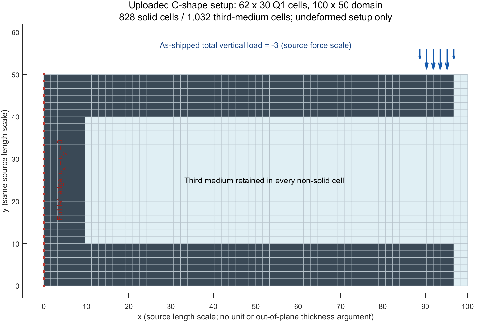

# HF-0：上传 TMC MATLAB 快照核查

日期：2026-09-13。范围仅为资料读取、原源码调用的小型核验和 C-shape 初始化；没有实现 Python HF，没有运行 C-shape 非线性路径，没有运行拓扑优化。本报告中的“实测”只指文末列出的 MATLAB 小试验，不能作为完整求解器或接触精度通过的证据。

## 来源与保留边界

原包 `C:/Users/Lenovo/Zotero/storage/AAXN3GZJ/TMC_code.zip`，SHA-256：

`58F203FF1DBA3C64C64D5FA2DE12D4BDD3A711BE69EE83A4DDD3335680E3EB08`

包内仅 8 个 `.m` 文件：`initializeFEA`、`assembleKtFi`、`solveIncrIter`、`plotDeformed`、`cshapeTMC`、`topTMC`、`topTMC_selfContact`、`ocUpdate`。没有 README、LICENSE、参考数值结果或单元测试。源码副本位于 `hf0_audit/tmc/TMC_code/`，不是 HF 运行包。核验后 8 文件逐一与压缩包解压字节匹配，见 [source_manifest.json](../hf0_audit/tmc/source_manifest.json)。原 ZIP 未修改。

各文件作者声明指向 Frederiksen、Ferrari、Sigmund / DTU，以及 2026 年 *A Matlab code for analysis and topology optimization with Third Medium Contact*；明确写有 educational purposes 和 authors reserve all rights。此包属于 **TMC**，没有将 PMC 或 MPM 等同于 TMC 的依据。该声明不等于宽松开源许可；本轮保留声明，没有替参考代码指定新许可证。公开发布前另核源码授权；论文的开放获取许可不能直接用于重新授权程序。

适合以后对账的职责是初始化、材料/单元残差/切线、装配、增量 Newton、可视化。`topTMC*` 的过滤、投影、RAMP 设计插值、设计伴随、跨设计热启动和 `ocUpdate` 都不属于独立 HF 正向评估接口；不将它们复制为运行依赖。对于二值几何，实体/第三介质系数可由任务明确赋值，保留所有第三介质单元。

## 真实数值语义

以下行号针对原包文件，带行号镜像也保存在 `hf0_audit/tmc/*.numbered.txt`。

| 核查项 | 实际源码行为与位置 | 新 HF 的含义 |
|---|---|---|
| 二维约化 | `initializeFEA:49–51` 使用三维 Lamé 参数；`assembleKtFi:18–43,63` 使用二维 F、J、C，能量含 `tr(C2)-2`。 | 这与三维可压缩 Neo-Hookean 在 **F33=1、其他面外 F 分量=0** 下约化一致，即平面应变；没有求解 S33=0 的平面应力消元。这里 F33=1 是由公式推导的事实，源码未显式存第三行列。 |
| 参考构形运动学 | `initializeFEA:23–46` 在未变形矩形上预计算梯度；`assembleKtFi:12–39` 计算 F=I+Grad_X u、C=FᵀF。 | 总拉格朗日；网格 Jacobian 与变形 J 必须分名，不能用当前坐标再更新参考梯度。 |
| 节点/单元顺序 | `initializeFEA:7–15` MATLAB 列主序：先沿图上从上到下的 y 行编号，再向右。局部节点为左下、右下、右上、左上；每节点 `[ux,uy]`。 | 坐标 y 向上，数组第一行在上边；不要因“row-lexicographic”注释误用 NumPy 默认行主序。 |
| 梯度/剪切约定 | `G` 输出 `[ux,x; uy,x; ux,y; uy,y]`；`B0/B1` 对应 `[E11,E22,2E12]`；`sPK2=[S11,S22,S12]`，见 `initializeFEA:45–46`，`assembleKtFi:26–31,42–43`。 | 工程剪切仅用于应变向量；应力向量不额外乘 2。 |
| 积分 | `initializeFEA:19–21,33–43`：ξ、η∈{-1,0,1}，9 点 Gauss–Lobatto，参考权重 `[1,4,1]⊗[1,4,1]/9`，物理权重乘矩形 Jacobian determinant。ξ 慢变、η 快变。 | 角点、边中点和中心都取样；不是 2×2 Gauss。权重和应为单元面积。 |
| Hessian | `initializeFEA:25–27,38–41`：参考混合二阶导 ±1/4，经 Jm⁻¹ H Jm⁻ᵀ 转换；`hessN` 每列顺序 `[N,xx,N,yx,N,xy,N,yy]`。 | 对仿射矩形 Q1，纯 xx、yy 二阶导均为零；混合导为 ±1/(hx hy)，两个混合分量都保留。 |
| 材料缩放 | `assembleKtFi:8–10`：λ、μ 同乘每单元 `xPhys`。C-shape 传 1 或 kv；拓扑脚本传的是 RAMP 后系数。 | 不能将连续优化密度、二值实体分布和材料倍率混成一个正式字段。 |
| 正则化尺度/区域 | `initializeFEA:52`：kr=α Lx²(κs+4μs/3)；`assembleKtFi:73,80–81` 每个单元都有 kr exp(−5J)。kr 不随密度缩放。 | 正则作用在全域，包括实体；特征长度是全域 Lx，非单元边长。扩大背景域并修改 Lx 会同时改变 kr，必须版本化，不能当成无影响的网格操作。 |
| 厚度与倍率 | 初始化、装配、载荷函数均没有面外厚度参数，也没有半模型倍率。 | 原代码是二维面积积分下的默认尺度。未来必须显式给定面外厚度/单位厚度语义，对内部力、切线、外载与反力统一换算；不能凭 C-wall 的 `thk` 推断面外厚度。 |

材料公式（`assembleKtFi:40–63`）为

\[
W=\tfrac12\lambda(\ln J)^2+\tfrac12\mu(\operatorname{tr}C_2-2-2\ln J),\qquad
S=\lambda\ln J\,C_2^{-1}+\mu(I-C_2^{-1}),
\]

其中 λ、μ 已含材料倍率。材料部分与对应的三维平面应变约化一致。2025 论文的 Neo-Hookean 表达与参数形式由论文核查报告单列，不能仅凭同名直接替换本基线。

令 A=HᵀH，G 将单元位移映射为 vec(Grad u)，gJ=J vec(F⁻ᵀ)ᵀG。实际正则残差与切线是

\[
r_r=\sum_q w_q k_r e^{-5J_q} A_q u_e,\qquad
K_r=\sum_q w_q k_r e^{-5J_q}\big[A_q-5(A_qu_e)gJ_q\big].
\]

源码 `iF` 的四个分量（`assembleKtFi:22–25`）是用于 `d ln J` 的 vec(F⁻ᵀ)，在 `68–73` 构成外积项。**该切线通常不对称。** 若把 exp(−5J) 放入自造的标量正则能量后做 Hessian，会产生源码残差没有的额外导数项。JAX 应对上述实际残差求 Jacobian；不能强行对称化，也不能默认 Cholesky/SPD 线性求解。

2026 正文 Eq.(6) 明示 exp(−5J) 不显含于能量表达且产生非对称切线，Eq.(7) 说明 Q1 时 Lu=0。因此本仿射矩形 Q1 上 HuHu−LuLu 与 HuHu 相同；加一个 LuLu 开关不能获得高阶单元的改进效果。扭曲非仿射映射或更高阶单元不在该等价断言范围内。

## C-shape：按上传脚本冻结的对账基线

`cshapeTMC:19–27`：Lx=100，Ly=50，nelx=62，nely=30，E0=100，kv=10⁻⁶，ν=0.3，α=10⁻⁶；lambdaMax=1，100 个等载荷步，maxIter=25，tolRelRes=10⁻⁸。后文的长度/载荷数字首先是**源码数值尺度**，不擅自把无单位参数转换为 SI。

`cshapeTMC:32–35` 的 thk=6 是网格单元层数。上下各 6 行、前 60 列为实体；左侧前 6 列全高为实体。计算得到 828 个实体、1,032 个第三介质单元，3,906 个 DOF。

| 实际几何/边界量 | 数值与来源 |
|---|---|
| 单元尺寸 | hx=100/62=1.6129032258，hy=50/30=1.6666666667 |
| 上下横梁厚度 / 左竖梁宽度 | 10 / 9.6774193548；两方向不是正方形单元 |
| 实体伸至 x / 右侧介质宽 | 96.7741935484 / 3.2258064516 |
| 参考总面积 / 实体面积 | 5,000 / 2,225.8064516129 |
| 左边支承 | `cshapeTMC:37` 固定整个 x=0 边的 ux、uy；62 个固定、3,844 个自由 DOF。不是项目机构支承模板。 |
| 载荷位置 | `:39`，y=50；x=88.7096774194、90.3225806452、91.9354838710、93.5483870968、95.1612903226、96.7741935484 |
| y 向载荷 DOF | 3412、3474、3536、3598、3660、3722 |
| 节点力与总力 | `:41–42`：−0.3、−0.6、−0.6、−0.6、−0.6、−0.3；**总和 −3**，不是 −30。端点半权重。 |
| 正则系数 | κs=83.3333333333、μs=38.4615384615，kr=1.34615384615 |

图和 [MATLAB 原始数据](../hf0_audit/tmc/probe_tmc_raw.mat) 对应未变形设置；箭头仅示意离散载荷相对大小。源码没有输出路径数据保存器，`solveIncrIter` 只返回最终 U，并在每个加载步画图。

论文核查同伴已交叉确认的差异（详见 [论文核查报告](PAPER_FORMULATION_AUDIT.md)）：2026 Table 1 给 nIncr=200、maxIter=50、tol=10⁻⁶；附录 Listing 2 与上传脚本的 100、25、10⁻⁸ 一致。正文 p5 的 `|q|=30 N` 与实际节点力总和 −3 不一致。Fig.4 示意右侧介质延伸 t/2 与离散脚本实际 3.2258 也不能直接等同。p15 Eq.(A7) 印刷 μ=E/[2(1−ν)] 与源码、Listing 7 和正文 μ≈38.462 不一致；真实基线使用加号。这些分别作为版本/量纲/排印差异记录，未通过修改脚本将它们拼成一个版本。HF-2 首先对账上传脚本，再单列论文文字参数版本。

## 求解器与实测问题

`solveIncrIter:3–25` 从零位移或可选传入 U 开始，在每个载荷步用前一步 U；每次先计算 `r=lambda F0−Fint` 和相对残差，满足容差则退出，否则做全 Newton 修正。没有回溯、增量缩分、J 守卫、有限性检查、收敛状态结构或反力/路径归档。

| 分类 | 证据与影响 | 后续处理 |
|---|---|---|
| **实测：单元素调用形状缺陷** | `solveIncrIter:9` 的 `U(cDofMat)'` 在 nEl=1 时因 MATLAB 向量索引规则变成 1×8，`assembleKtFi:12` 报 `MATLAB:innerdim`；直接传明确 8×1 ue 可计算。 | 这是源调用包装的退化维度缺陷，不是 Q1 公式错误。对照脚本明确 reshape，生产实现保证 batch 维。源文件未修改。 |
| **实测：J 非法未阻止** | `assembleKtFi:20–41` 无 J>0 断言。F=diag(−1,1) 返回复数 K、R；J=0 返回非有限数，均未抛错。 | 新实现必须在试探步接受前检查 J 和有限性；非法试探回退/缩步，不能 abs 或截断。 |
| **实测：NaN 可绕过失败判断** | `solveIncrIter:13` 分母 norm(lambda F0)，F0=0 时变成 0/0；`:15,20` 的 NaN 比较均 false。2 单元、1 步、1 次迭代实际打印 NaN 并返回 U=0。 | 此试验说明判据不能认证收敛，并不说明零位移本身不平衡。位移控制必须选独立尺度，且失败判断显式处理非有限数。 |
| 静态：最后修正未经重新检查 | 第 maxIter 次若未通过，`:17` 仍修正 U；`:20` 用修正前的 rrNorm 抛错。 | 最大次数语义在新求解器中明确；保存最后已验证收敛状态。 |
| 静态：`Psi` 不是可复用积分能量 | `assembleKtFi:63–64` 将每积分点 W 直接求和，无权重/厚度，且变量未返回、未使用。 | 不能把其值称为单元总能量；材料能量未来正确积分并分实体/TM，正则不强称保守总能量。 |
| 静态：设计优化部分的问题，HF 移除范围 | `topTMC*:97` 用 K 而非 Kᵀ 解伴随，通常非对称时不成立；`:37,77` 的 betaCnt 注释 `{max,multiplier,interval}` 与实际按第一个值作间隔、第三个值作上限不一致。 | 不在本轮运行/修复原 TO；这些不是正向残差错误，也不是保留优化模块的理由。 |

## 已运行的最小核验

MATLAB R2023b `23.2.0.2365128` / `PCWIN64`，双精度。可重复脚本 [probe_tmc_baseline.m](../hf0_audit/tmc/probe_tmc_baseline.m)、完整 [JSON](../hf0_audit/tmc/probe_tmc_results.json)、[日志](../hf0_audit/tmc/probe_tmc_matlab.log)、[MAT 数据](../hf0_audit/tmc/probe_tmc_raw.mat)。首次形状错误日志另存，不抹掉失败证据。

方向导数案例明确使用 2×1 长方形单元、E=100、ν=0.3、α=10⁻⁶、材料倍率 10⁻⁶，节点场 ux=−0.15x+0.08xy，uy=0.04x−0.20y+0.06xy，方向 `sin(1:8)/norm(sin(1:8))`。这是小型诊断场，不是物理任务标定。

| 实测量 | 结果 |
|---|---|
| 单元积分权重和 | 1.9999999999999998（应为面积 2） |
| Hessian Laplacian 最大绝对值 | 0 |
| 平移 / 0.37 rad 刚体旋转残差 norm | 0 / 0（该特定样本的浮点结果） |
| 中心差分对实际 K 的相对方向误差，h=10⁻³、10⁻⁵、10⁻⁷ | 1.0907379×10⁻⁶、1.0584550×10⁻¹⁰、4.5877815×10⁻¹⁰ |
| 切线不对称度 `norm(K−Kᵀ,F)/norm(K,F)` | 0.0704055751 |
| h=10⁻⁵ 时强制对称 K 的方向误差 | 0.0743547923（约 7.44%） |
| h=10⁻⁵ 时换用 Kᵀ 的方向误差 | 0.1487095846 |
| 材料倍率为 0 时正则残差 / 切线 norm | 4.89009685×10⁻⁶ / 7.41733080×10⁻⁵，说明正则没有被材料倍率清零 |
| 从实体结果减去 α=0 结果，再与纯正则比较：R / K 绝对误差 | 1.36379131×10⁻¹⁴ / 6.73819302×10⁻¹⁴ |
| 从 TM 结果减去 α=0 结果，再与纯正则比较：R / K 绝对误差 | 9.77763706×10⁻²¹ / 8.66238734×10⁻²⁰ |
| 2 单元 / 9 单元装配方向差分相对误差，h=10⁻⁶ | 6.02627508×10⁻¹¹ / 4.07836612×10⁻¹¹ |
| J=−1 的虚部残差 norm | 405.2777729447；没有抛错 |
| J=0 | K、R 含非有限数；没有抛错 |

这些数值是审计观察值，没有从观察值反向制定验收容差。它们支持实际残差—切线的一致性与非对称性，**不证明 Python 对账、C-shape 路径收敛、接触精度、项目力学可信度或网格无关性**。完整验证阶段仍须预先定义测试量、参考尺度、验收容差及误差预算。

## 公式—源码—未来职责—验证对应

| 文献/公式位置 | MATLAB 对应 | 未来 Python 职责 | 必须验证的量 |
|---|---|---|---|
| 2026 p2 Eq.(1)、p3 Eq.(4)，p15 Eq.(A7，需注意排印矛盾) | `initializeFEA:49–51`；`assembleKtFi:18–63` | 平面应变 Neo-Hookean 应力与材料残差，保留本基线参数式 | 单轴/剪切响应、刚体运动、仿射 F；与 MATLAB 同一输入的材料量 |
| 2026 p15 Eq.(A6)、p18–19 Listing 7 | `initializeFEA:7–46` | Q1 网格、连接、9 点 Lobatto、Grad/Hessian、明确节点/DOF 次序 | 非对称标记、积分矩、仿射 patch、Hessian 混合项、Lu=0 |
| 2026 Eq.(5–6)；Eq.(7) 的 Q1 说明 | `initializeFEA:52`；`assembleKtFi:65–81` | 按实际弱式构造正则残差，并直接求其 Jacobian | 残差方向导数、多步长误差收敛、非对称度、密度独立缩放、全域范围 |
| 2026 p14 Eq.(A4) 单元残差、Eq.(A5) 切线 | `assembleKtFi:71–94` | 材料/几何/正则切线及 COO/CSR 装配，使用一般稀疏线性解 | 1、2、小网格数组维、装配方向差分、支承和反力平衡 |
| 2026 p11 Eq.(A1)、p16 Listing 5；p11 Listing 2 的 C-shape 参数 | `solveIncrIter:3–25`；`cshapeTMC:19–45` | 从参考态逐候选增量求解、J 守卫、可回退状态、结果状态与路径导出 | 与**上传代码版本**的逐载荷 U/反力/残差对账；论文文字不同版本分开记录 |
| 2026 Fig.5 及实际离散几何 | `plotDeformed`、`cshapeTMC` | 显示实体/TM、支承、实际加载级、单位和原始曲线数据 | 初始化几何尺寸/总力、路径曲线、J 最小值、未达终点不得冒充终态 |

下一步可在 HF-2 开始前使用这些审计文件写 MATLAB 数值导出器；导出器和 MATLAB 只承担开发期参考职责。新 HF 的安装、测试与正式 evaluate 不应依赖这些 `.m` 文件、MATLAB 进程、LF 包或旧绝对路径。
