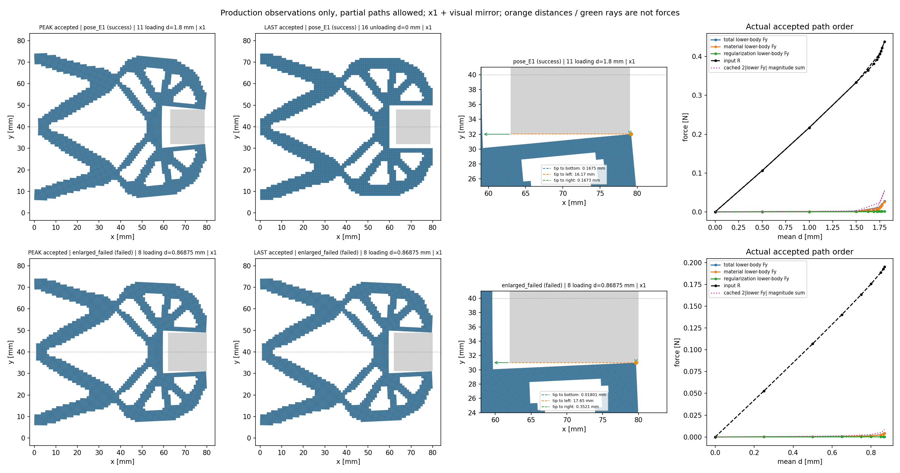
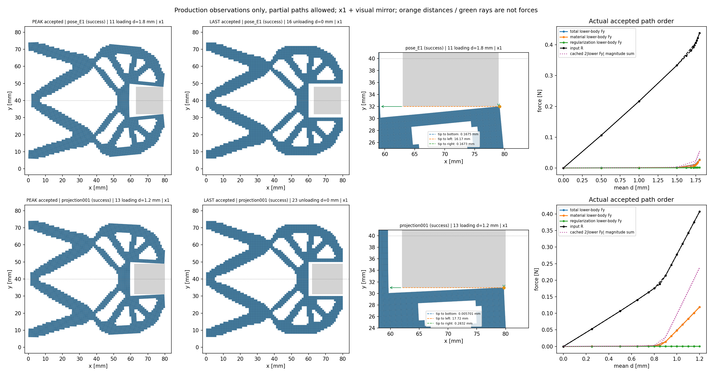
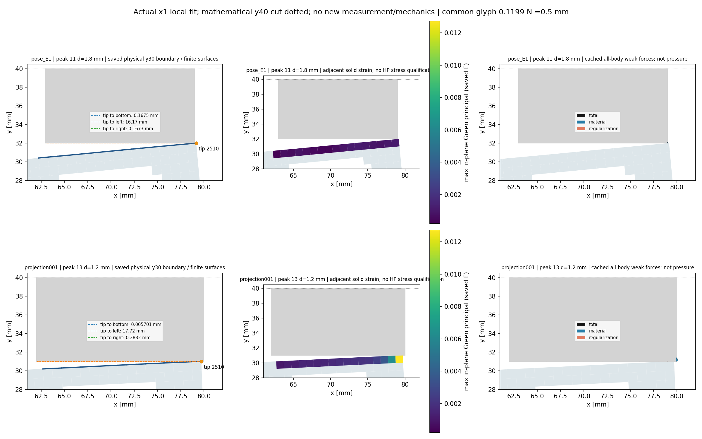

# 工件右移、增大与接触附近分析：2026-10-07

**本轮已完成右缘到80 mm、边长18 mm固定方体的0→1.2→0 mm循环：24个真实接受态，48次新HP80/120及465220项参考检查通过。** 峰值单侧工件Fy=0.1190075723 N，两侧法向幅值和=0.2380151447 N；输入R为半模型的0.4071352773 N。钳尖位于(79.71689116,30.99429925) mm，在有限底面的覆盖范围内，距离为0.0057007523 mm（5.7 μm）。完整回零后力与位移返回数值零附近。

整体目标是独立HF读取普通LF几何，计算明确物理任务的非线性力、变形与工件受力，再供现有LF/N4研究层使用。现有优化研究层保留，不在HF重做LF优化、不调用dmftd、不实施MPM。整个HF项目尚未完成。此前x71/side16/E1的完整17态及34次参考已通过；本记录不能覆盖或替换那项资格。

用户希望有限工件面更靠右、物体稍大，以检验逼近接触后TMC分析和夹持相关力。新方形工件中心(71,40) mm、边长18 mm，半模型覆盖[62,80]×[31,40]；相对合格side16，右面79→80、底面32→31 mm。原最右钳尖(80,30)在初始几何中与有限底边相隔1 mm。新工件右面到域边界，没有右侧包围介质；原合格x71/side16则有1 mm右侧介质余量。保留native1 mm网格、LF结构/端口/支撑、E=1 MPa、ν=.3、厚度20 mm、γ=α=10⁻⁶及Lr=80 mm。162工件单元/190节点/380工件DOFs，19个顶部uy重叠，448固定/6194自由；21内部字段不变，仅6覆盖字段改变。此次保留E1以识别位置和尺寸作用；此前均匀软化未自动改善钳尖贴合。

这两个默认初猜工况都真实失败并关闭，没有重试原卡：x72/side16最后输入1.6875 mm，7次首预测F拒绝、31次T全部完成；增大side18最后输入0.86875 mm，4次首预测F拒绝、30次T全部完成。均未到目标峰值与卸载终点，0HP。二者失败均为invalid_J，不是已保存接受态的负J；失败预测位移没有保存，不能把接受态最小J单元当作失败负J位置。side18末次0.86875→0.875 mm因原最小增量规则停止。接受态与真实部分可视化均保留。

| 工况 | 实际状态 | 接受态数 | 最后输入 mm | 下半工件 Fy N | 钳尖有限底边距离 mm | 介质 min J |
|---|---|---:|---:|---:|---:|---:|
| x72 / side16 / tangent | failed | 8 | 1.6875 | 0.004232574672 | 0.05043712712 | 0.002211706197 |
| x71 / side18 / tangent | failed | 9 | 0.86875 | 0.004246459983 | 0.01800775003 | 0.003123577093 |
| x71 / side18 / port_projection | success | 24 | 0 | -1.498575497e-27 | 1 | 1 |

上表显示终态，完整卸载返回零后Fy接近零，并不能展示夹持阶段受力。下面另列**最大已接受加载位移处**的物理读数：旧合格side16为1.8 mm，新任务目标为1.2 mm；失败工况只到自己的实际最后加载态。这些不同位移不用于尺寸因果力比，也不假设该态恰是全路径最大Fy。

| 工况 | 实际加载d mm | 输入R N | 输出qout mm | 单侧总Fy N | 材料Fy N | Hu Fy N | 双侧法向幅值和 N | 有限底边距 mm | 介质minJ | 全固体最大Green主应变 |
|---|---:|---:|---:|---:|---:|---:|---:|---:|---:|---:|
| 旧合格x71/side16/E1 | 1.8 | 0.4381971939 | 2.015337113 | 0.02692403501 | 0.02589424148 | 0.001029793529 | 0.05384807002 | 0.1675273442 | 0.0008316610691 | 0.05184096525 |
| side18/tangent（失败） | 0.86875 | 0.1950561775 | 0.9843248932 | 0.004246459983 | 0.004055419581 | 0.0001910404018 | 0.008492919966 | 0.01800775003 | 0.003123577093 | 0.02401330315 |
| side18/port_projection | 1.2 | 0.4071352773 | 1.008887046 | 0.1190075723 | 0.1188180648 | 0.0001895075115 | 0.2380151447 | 0.005700752324 | 3.239841274e-05 | 0.03282012891 |

共同原始加载0.5 mm态的实际对照如下，不插值、不用同位移卸载态替代。旧合格基线有原同路径参考；默认side18失败卡该态仍为生产读数，不能继承完整资格。新模式的参考资格取实际终端证据。

| 工况 | 实际加载d mm | 输入R N | 输出qout mm | 单侧总Fy N | 材料Fy N | Hu Fy N | 双侧法向幅值和 N | 有限底边距 mm | 介质minJ | 全固体最大Green主应变 |
|---|---:|---:|---:|---:|---:|---:|---:|---:|---:|---:|
| 旧合格x71/side16/E1 | 0.5 | 0.1062445301 | 0.5757840051 | 0.0001350598645 | 9.66192577e-05 | 3.844060678e-05 | 0.000270119729 | 1.63596527 | 0.7223798219 | 0.01362967387 |
| side18/tangent（失败前生产态） | 0.5 | 0.1068317517 | 0.5741447661 | 0.0003873734191 | 0.0002834707955 | 0.0001039026236 | 0.0007747468382 | 0.4262911044 | 0.4210651438 | 0.01362266451 |
| side18/port_projection | 0.5 | 0.1068317518 | 0.5741447661 | 0.0003873734191 | 0.0002834707955 | 0.0001039026237 | 0.0007747468383 | 0.4262911044 | 0.4210651438 | 0.01362266451 |

表中失败工况的数值是最后实际接受状态，属于生产与保存观察；没有完整独立参考，不能称为成功夹持。不同峰值/最后输入不用于尺寸因果力比。下半固定工件的力是负的固定DOF内力，holding反向；总力=材料+Hu。2|Fy|是两侧法向力大小之和，镜像净力为(2Fx,0)，不是同一物理量。节点弱式力不等于点接触压力；正J下介质压缩、小间隙也不是精确硬接触或自由物体稳定夹持的证明。

本轮新增的功能只改变初猜：仍真实求解原KKT预测LU、保留R+=dR；可选port_projection丢弃预测dw，将完整平均约束残差按b_free/(b_free·b_free)分配到自由输入端口旧fluctuation，再用原feasible修正舍入。非端口旧fluctuation和固定零值保留，后续原Newton仍允许输入节点各自运动，未改成刚性绑节点。原方程、材料/F/T、缓存、Armijo、J、回滚、二分和收敛门不改；默认tangent保留原行为。预测LU记录displacement_mode、applied_dw=false、applied_dR=true，只检验真实线性解；初猜是否平衡由原下一次F/T判断。

15项独立功能验证实际状态：**pass**。范围为原9项控制器、2项native回归，加4项新测试：cubic1000且不二分的独立brentq平衡；非零lift/非对称KKT与秩一弹簧加载—卸载；默认数组位/轨迹与J门；原16单元native API转发。默认失效是测试内预期断言，不是正式卡重试。测试通过也不能替代新工件的真实完整计算。

新物理卡路径为`lf_data_preparation/native_workpiece_001/enlarged_square_projection_001`，保持同一side18/E1与24个原目标0→1.2→0，从零开始，实际状态与资源见[阶段JSON](evidence/workpiece_enlargement_20261007/progress.json)。若生产再次失败，记录部分结果并停止，不给失败前缀补whole-path资格；只有完整成功后，才对每个实际N态执行新鲜2N次80/120位HP，再做完整保存视图。新N、HP次数和图只取实际文件，不猜测或借前态。

[扩大工件的9帧实际动画](../functional_views/workpiece_enlarge_20261007/failed_preview_001/view/enlarged_failed/actual_states.gif)；失败之后没有外推帧或卸载动画。

[新初猜实际24帧](../functional_views/workpiece_enlarge_20261007/complete_001/view/projection001/actual_states.gif)。

人工查看顺序：实际×1结构与工件有限面位置 → 每个真实索引的动画 → 输入反力与工件总/材料/Hu力 → 钳尖有限边距离及首次法向射线 → 实体应变与介质J。上半仅镜像显示，不新增求解DOF。全域与局部应变采样区不同；原局部x63–80尖端窗口不能代表新工件整个x62–80底边。色标和力箭头按图共有标尺，曲线按各自坐标刻度读。

当前可实现独立NumPy完整力分量、组装/切线、平均位移控制、保存真实变形与约束工件受力。本24态机械全周期的独立参考已经完成。接触/夹持判据和压力定义、同设计网格与介质/正则参数收敛、圆体与自由工件运动/释放、摩擦，以及HF5与既有研究层的同任务耦合仍待推进。后续按实际功能结果逐步选取行程和参数；整体项目仍未完成。

## 功能效果、成本与取舍

输入从0.85增至1.2 mm时，输出端qout只从0.9684366增至1.0088870 mm，而单侧工件Fy从0.0025242增至0.1190076 N。输出趋于平缓和工件力快速增长与本轮的接触目的相符；最右钳尖在有限底面的覆盖内，保存几何各态均无已测结构/工件内部重叠或舍入模糊。该图的几何检查范围是固体与工件，未增加自接触、完整包容或压力资格。

同一side18物理任务的加载0.5 mm态，新旧初猜的ΔR=8.79407e-12 N、ΔFy=3.527777e-14 N。新初猜改善进入可行Newton区域；这项单点一致性不证明全路径唯一性。峰态全固体最大Green主应变0.03282013，原局部窗口的量与全域量分别解释。

`q_out=.25 uy(80,28)+.5 uy(80,29)+.25 uy(80,30)` mm；它是加权输出端口，而非钳尖间隙。图中橙线/绿射线是距离；力箭头为工件节点弱式力。夹持力报告单侧Fy和2|Fy|，完整工件净力另为(2Fx,0)。当前工件固定，厚度20 mm、E=1 MPa、1 mm网格，右侧介质余量为零；这些条件属于本算例。

| 阶段 | helper/outer授权 秒 | helper/outer实际 秒 | 实際工作 |
|---|---:|---:|---|
| 控制器/API验证 | 180 / 240 | 13.907 / 15.513 | 15测试；22个小模型求解，0完整工件路径/HP |
| 新生产 | 3000 / 3060 | 2839.981 / 2841.369 | 354/330F，176/176T，1求解，0HP；24原目标 |
| 全状态新参考 | 1500 / 1560 | 716.989 / 718.808 | 24态、48HP、465220检查；0候选F/T/求解 |
| 完整保存观察/图 | 180 / 210 | 43.146 / 47.767 | 41几何+41节点力观察（17旧+24新），0新力学/HP |
| 缓存局部图 | 120 / 150 | 9.492 / 10.231 | 复用上一步数据，0新几何/力学/HP |

以上各卡RSS授权8 GiB；新生产helper/outer采样峰562446336/560816128字节，新参考424910848/428838912字节。采样与合作停止不等于操作系统硬内存限制。生产24次未完成F是原线搜索正常拒绝的14次invalid_J和10次范围异常，全部随后半factor恢复；0失败加载尝试、0额外二分态。计数适配只支持真实已恢复分支，1817项纯保存复现及独立审查通过；原B028与新计数器分别保存。首次范围试探ordinal325仍无独立力学资格。

首次参考命令漏传`--protocol`，在读取不存在的默认文件时退出，早于执行卡加载、receipt及子进程创建；0正式调用/HP。该操作入口错误保留在[原记录](../lf_data_preparation/native_workpiece_001/enlarged_square_projection_001/reference_operator_entry_001.json)和[独立审查](evidence/workpiece_enlargement_20261007/source_context/reviews/reference_operator_entry_static_review.json)。之后显式传入冻结协议，正式参考只启动一次；协议b80111a6…、预算和原始结果未改变。两张失败生产卡始终关闭，未重试或复用其前缀。

根审一度把九点规则误认为内部Gauss点，提议另核介质角点。源码确认当前9点Simpson/Gauss–Lobatto含全部四角，原正J门已覆盖；额外卡在创建/冻结/执行前撤回，新增调用为0。[源码纠正与撤回记录](evidence/workpiece_enlargement_20261007/quadrature/quadrature_corner_note.md)完整保留这一取舍。

图和CSV使用原保存数组；新动画24帧，旧对照17帧，均为实际索引，无插值帧。已人工检查整体/局部/场图；原生产三项独立资格flags保持false，新参考资格由独立summary给出，限该24态机械力、PORT方向切线作用、组装、平衡和工件投影。辅助能量、应力HP、全切线列、压力和自由工件稳定夹持仍不在本轮资格内。

## 接续开发

先人工检查本轮位置、×1变形和力，再以同一物理任务逐项检查网格、gamma/alpha和右侧介质余量的敏感性；在此基础上明确接触/夹持判据与压力，再推进圆体、可动工件、局部柔顺性及HF5/LF-N4接口。现有研究层保持，后续均在main上开发。

[当前状态](CURRENT_STATUS.md)、[跨目录恢复](RESUME_DEVELOPMENT.md)、[作者资料及审阅索引](evidence/workpiece_enlargement_20261007/source_context/INDEX.md)、[真实状态与资源JSON](evidence/workpiece_enlargement_20261007/progress.json)。普通文件与当下源码经移交清单核对；历史闭卡及pending作者快照作为时间点记录，不是接续重跑命令。基线提交b310033，origin保持https://github.com/dudaxing/Compliant-TO-TMC.git。整个HF项目尚未完成。
