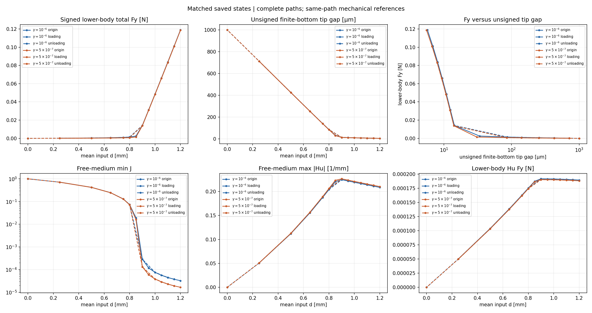
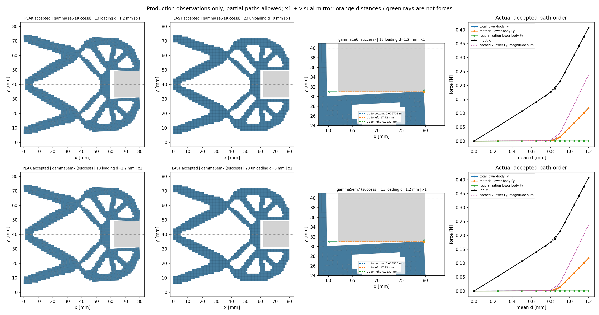
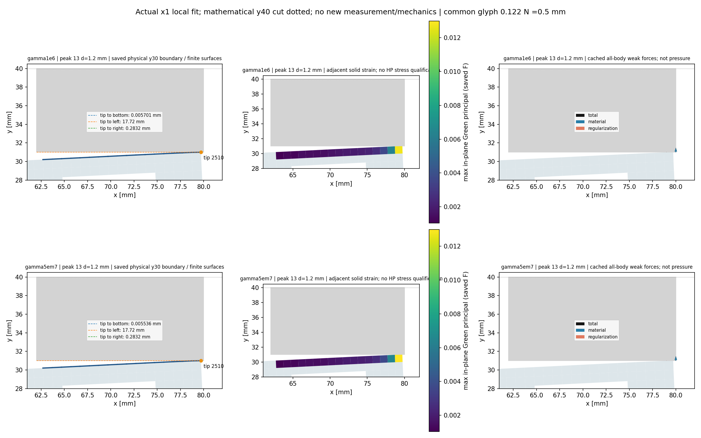

当前更新：gamma单因素24态/48次新HP已通过；最新结果和下一步见本文末节。下面此前扩大工件阶段保留原始时间点说明。

# 工件右移、增大与接触附近分析：2026-10-07

**本轮已完成右缘到80 mm、边长18 mm固定方体的0→1.2→0 mm循环：24个真实接受态，48次新HP80/120及465220项参考检查通过。** 峰值单侧工件Fy=0.1190075723 N，两侧法向幅值和=0.2380151447 N；输入R为半模型的0.4071352773 N。钳尖位于(79.71689116,30.99429925) mm，在有限底面的覆盖范围内，距离为0.0057007523 mm（5.7 μm）。完整回零后力与位移返回数值零附近。

整体目标是独立HF读取普通LF几何，计算明确物理任务的非线性力、变形与工件受力，再供现有LF/N4研究层使用。现有优化研究层保留，不在HF重做LF优化、不调用dmftd、不实施MPM。整个HF项目尚未完成。此前x71/side16/E1的完整17态及34次参考已通过；本记录不能覆盖或替换那项资格。

用户希望有限工件面更靠右、物体稍大，以检验逼近接触后TMC分析和夹持相关力。新方形工件中心(71,40) mm、边长18 mm，半模型覆盖[62,80]×[31,40]；相对合格side16，右面79→80、底面32→31 mm。原最右钳尖(80,30)在初始几何中与有限底边相隔1 mm。新工件右面到域边界，没有右侧包围介质；原合格x71/side16则有1 mm右侧介质余量。保留native1 mm网格、LF结构/端口/支撑、E=1 MPa、ν=.3、厚度20 mm、γ=α=10⁻⁶及Lr=80 mm。162工件单元/190节点/380工件DOFs，19个顶部uy重叠，448固定/6194自由；21内部字段不变，仅6覆盖字段改变。此次保留E1以识别位置和尺寸作用；此前均匀软化未自动改善钳尖贴合。

这两个默认初猜工况都真实失败并关闭，没有重试原卡：x72/side16最后输入1.6875 mm，7次首预测F拒绝、31次T全部完成；增大side18最后输入0.86875 mm，4次首预测F拒绝、30次T全部完成。均未到目标峰值与卸载终点，0HP。二者失败均为invalid_J，不是已保存接受态的负J；失败预测位移没有保存，不能把接受态最小J单元当作失败负J位置。side18末次0.86875→0.875 mm因原最小增量规则停止。接受态与真实部分可视化均保留。

| 工况 | 实际状态 | 接受态数 | 最后输入 mm | 下半工件 Fy N | 钳尖有限底边距离 mm | 介质 min J |
|---|---|---:|---:|---:|---:|---:|
| x72 / side16 / tangent | failed | 8 | 1.6875 | 0.004232574672 | 0.05043712712 | 0.002211706197 |
| x71 / side18 / tangent | failed | 9 | 0.86875 | 0.004246459983 | 0.01800775003 | 0.003123577093 |
| x71 / side18 / port_projection | success | 24 | 0 | -1.498575497e-27 | 1 | 1 |

上表显示终态，完整卸载返回零后Fy接近零，并不能展示夹持阶段受力。下面另列**最大已接受加载位移处**的物理读数：旧合格side16为1.8 mm，新任务目标为1.2 mm；失败工况只到自己的实际最后加载态。这些不同位移不用于尺寸因果力比，也不假设该态恰是全路径最大Fy。

| 工况 | 实际加载d mm | 输入R N | 输出qout mm | 单侧总Fy N | 材料Fy N | Hu Fy N | 双侧法向幅值和 N | 有限底边距 mm | 介质minJ | 全固体最大Green主应变 |
|---|---:|---:|---:|---:|---:|---:|---:|---:|---:|---:|
| 旧合格x71/side16/E1 | 1.8 | 0.4381971939 | 2.015337113 | 0.02692403501 | 0.02589424148 | 0.001029793529 | 0.05384807002 | 0.1675273442 | 0.0008316610691 | 0.05184096525 |
| side18/tangent（失败） | 0.86875 | 0.1950561775 | 0.9843248932 | 0.004246459983 | 0.004055419581 | 0.0001910404018 | 0.008492919966 | 0.01800775003 | 0.003123577093 | 0.02401330315 |
| side18/port_projection | 1.2 | 0.4071352773 | 1.008887046 | 0.1190075723 | 0.1188180648 | 0.0001895075115 | 0.2380151447 | 0.005700752324 | 3.239841274e-05 | 0.03282012891 |

共同原始加载0.5 mm态的实际对照如下，不插值、不用同位移卸载态替代。旧合格基线有原同路径参考；默认side18失败卡该态仍为生产读数，不能继承完整资格。新模式的参考资格取实际终端证据。

| 工况 | 实际加载d mm | 输入R N | 输出qout mm | 单侧总Fy N | 材料Fy N | Hu Fy N | 双侧法向幅值和 N | 有限底边距 mm | 介质minJ | 全固体最大Green主应变 |
|---|---:|---:|---:|---:|---:|---:|---:|---:|---:|---:|
| 旧合格x71/side16/E1 | 0.5 | 0.1062445301 | 0.5757840051 | 0.0001350598645 | 9.66192577e-05 | 3.844060678e-05 | 0.000270119729 | 1.63596527 | 0.7223798219 | 0.01362967387 |
| side18/tangent（失败前生产态） | 0.5 | 0.1068317517 | 0.5741447661 | 0.0003873734191 | 0.0002834707955 | 0.0001039026236 | 0.0007747468382 | 0.4262911044 | 0.4210651438 | 0.01362266451 |
| side18/port_projection | 0.5 | 0.1068317518 | 0.5741447661 | 0.0003873734191 | 0.0002834707955 | 0.0001039026237 | 0.0007747468383 | 0.4262911044 | 0.4210651438 | 0.01362266451 |

表中失败工况的数值是最后实际接受状态，属于生产与保存观察；没有完整独立参考，不能称为成功夹持。不同峰值/最后输入不用于尺寸因果力比。下半固定工件的力是负的固定DOF内力，holding反向；总力=材料+Hu。2|Fy|是两侧法向力大小之和，镜像净力为(2Fx,0)，不是同一物理量。节点弱式力不等于点接触压力；正J下介质压缩、小间隙也不是精确硬接触或自由物体稳定夹持的证明。

本轮新增的功能只改变初猜：仍真实求解原KKT预测LU、保留R+=dR；可选port_projection丢弃预测dw，将完整平均约束残差按b_free/(b_free·b_free)分配到自由输入端口旧fluctuation，再用原feasible修正舍入。非端口旧fluctuation和固定零值保留，后续原Newton仍允许输入节点各自运动，未改成刚性绑节点。原方程、材料/F/T、缓存、Armijo、J、回滚、二分和收敛门不改；默认tangent保留原行为。预测LU记录displacement_mode、applied_dw=false、applied_dR=true，只检验真实线性解；初猜是否平衡由原下一次F/T判断。

15项独立功能验证实际状态：**pass**。范围为原9项控制器、2项native回归，加4项新测试：cubic1000且不二分的独立brentq平衡；非零lift/非对称KKT与秩一弹簧加载—卸载；默认数组位/轨迹与J门；原16单元native API转发。默认失效是测试内预期断言，不是正式卡重试。测试通过也不能替代新工件的真实完整计算。

新物理卡路径为`lf_data_preparation/native_workpiece_001/enlarged_square_projection_001`，保持同一side18/E1与24个原目标0→1.2→0，从零开始，实际状态与资源见[阶段JSON](evidence/workpiece_enlargement_20261007/progress.json)。若生产再次失败，记录部分结果并停止，不给失败前缀补whole-path资格；只有完整成功后，才对每个实际N态执行新鲜2N次80/120位HP，再做完整保存视图。新N、HP次数和图只取实际文件，不猜测或借前态。

[扩大工件的9帧实际动画](../functional_views/workpiece_enlarge_20261007/failed_preview_001/view/enlarged_failed/actual_states.gif)；失败之后没有外推帧或卸载动画。

[新初猜实际24帧](../functional_views/workpiece_enlarge_20261007/complete_001/view/projection001/actual_states.gif)。

人工查看顺序：实际×1结构与工件有限面位置 → 每个真实索引的动画 → 输入反力与工件总/材料/Hu力 → 钳尖有限边距离及首次法向射线 → 实体应变与介质J。上半仅镜像显示，不新增求解DOF。全域与局部应变采样区不同；原局部x63–80尖端窗口不能代表新工件整个x62–80底边。色标和力箭头按图共有标尺，曲线按各自坐标刻度读。

当前可实现独立NumPy完整力分量、组装/切线、平均位移控制、保存真实变形与约束工件受力。本24态机械全周期的独立参考已经完成。接触/夹持判据和压力定义、同设计网格与介质/正则参数收敛、圆体与自由工件运动/释放、摩擦，以及HF5与既有研究层的同任务耦合仍待推进。后续按实际功能结果逐步选取行程和参数；整体项目仍未完成。

## 功能效果、成本与取舍

输入从0.85增至1.2 mm时，输出端qout只从0.9684366增至1.0088870 mm，而单侧工件Fy从0.0025242增至0.1190076 N。输出趋于平缓和工件力快速增长与本轮的接触目的相符；最右钳尖在有限底面的覆盖内，保存几何各态均无已测结构/工件内部重叠或舍入模糊。该图的几何检查范围是固体与工件，未增加自接触、完整包容或压力资格。

同一side18物理任务的加载0.5 mm态，新旧初猜的ΔR=8.79407e-12 N、ΔFy=3.527777e-14 N。新初猜改善进入可行Newton区域；这项单点一致性不证明全路径唯一性。峰态全固体最大Green主应变0.03282013，原局部窗口的量与全域量分别解释。

`q_out=.25 uy(80,28)+.5 uy(80,29)+.25 uy(80,30)` mm；它是加权输出端口，而非钳尖间隙。图中橙线/绿射线是距离；力箭头为工件节点弱式力。夹持力报告单侧Fy和2|Fy|，完整工件净力另为(2Fx,0)。当前工件固定，厚度20 mm、E=1 MPa、1 mm网格，右侧介质余量为零；这些条件属于本算例。

| 阶段 | helper/outer授权 秒 | helper/outer实际 秒 | 实際工作 |
|---|---:|---:|---|
| 控制器/API验证 | 180 / 240 | 13.907 / 15.513 | 15测试；22个小模型求解，0完整工件路径/HP |
| 新生产 | 3000 / 3060 | 2839.981 / 2841.369 | 354/330F，176/176T，1求解，0HP；24原目标 |
| 全状态新参考 | 1500 / 1560 | 716.989 / 718.808 | 24态、48HP、465220检查；0候选F/T/求解 |
| 完整保存观察/图 | 180 / 210 | 43.146 / 47.767 | 41几何+41节点力观察（17旧+24新），0新力学/HP |
| 缓存局部图 | 120 / 150 | 9.492 / 10.231 | 复用上一步数据，0新几何/力学/HP |

以上各卡RSS授权8 GiB；新生产helper/outer采样峰562446336/560816128字节，新参考424910848/428838912字节。采样与合作停止不等于操作系统硬内存限制。生产24次未完成F是原线搜索正常拒绝的14次invalid_J和10次范围异常，全部随后半factor恢复；0失败加载尝试、0额外二分态。计数适配只支持真实已恢复分支，1817项纯保存复现及独立审查通过；原B028与新计数器分别保存。首次范围试探ordinal325仍无独立力学资格。

首次参考命令漏传`--protocol`，在读取不存在的默认文件时退出，早于执行卡加载、receipt及子进程创建；0正式调用/HP。该操作入口错误保留在[原记录](../lf_data_preparation/native_workpiece_001/enlarged_square_projection_001/reference_operator_entry_001.json)和[独立审查](evidence/workpiece_enlargement_20261007/source_context/reviews/reference_operator_entry_static_review.json)。之后显式传入冻结协议，正式参考只启动一次；协议b80111a6…、预算和原始结果未改变。两张失败生产卡始终关闭，未重试或复用其前缀。

根审一度把九点规则误认为内部Gauss点，提议另核介质角点。源码确认当前9点Simpson/Gauss–Lobatto含全部四角，原正J门已覆盖；额外卡在创建/冻结/执行前撤回，新增调用为0。[源码纠正与撤回记录](evidence/workpiece_enlargement_20261007/quadrature/quadrature_corner_note.md)完整保留这一取舍。

图和CSV使用原保存数组；新动画24帧，旧对照17帧，均为实际索引，无插值帧。已人工检查整体/局部/场图；原生产三项独立资格flags保持false，新参考资格由独立summary给出，限该24态机械力、PORT方向切线作用、组装、平衡和工件投影。辅助能量、应力HP、全切线列、压力和自由工件稳定夹持仍不在本轮资格内。

## 接续开发

先人工检查本轮位置、×1变形和力，再以同一物理任务逐项检查网格、gamma/alpha和右侧介质余量的敏感性；在此基础上明确接触/夹持判据与压力，再推进圆体、可动工件、局部柔顺性及HF5/LF-N4接口。现有研究层保持，后续均在main上开发。

[当前状态](CURRENT_STATUS.md)、[跨目录恢复](RESUME_DEVELOPMENT.md)、[作者资料及审阅索引](evidence/workpiece_enlargement_20261007/source_context/INDEX.md)、[真实状态与资源JSON](evidence/workpiece_enlargement_20261007/progress.json)。普通文件与当下源码经移交清单核对；历史闭卡及pending作者快照作为时间点记录，不是接续重跑命令。基线提交b310033，origin保持https://github.com/dudaxing/Compliant-TO-TMC.git。整个HF项目尚未完成。

## 同一工件的 gamma 单因素对照（已完成）

在完成较大靠右方体的24态路径后，最近一项检查第三介质材料刚度敏感性。原峰态材料Fy约占总Fy的99.84%，尖端间隙仅5.70 μm、介质minJ约3.24e-5，参数对传力的影响需要实际计算。保持同一个中心(71,40) mm、边长18 mm、右面x80的固定方体以及E=1 MPa、ν=.3、厚度20 mm、1 mm网格、α=1e-6、Lr=80 mm，唯一物理改变为γ=1e-6→5e-7。gamma只缩放介质Lamé系数；它不软化夹持器实体E、不改变Hu系数kr。新模型27字段中仅gamma/lam/mu变化，其他24字段以及原几何字节一致。

新阶段从零态独立求解，24/24原目标0→1.2→0 mm完成，0失败加载尝试、0额外二分态。随后所有24态分别执行新HP80/120：48/48完成，465255项检查通过；没有借用原γ的48次资格。完整保存观察与视图通过，两个工况共48次几何和48次节点力观察；24对原目标按加载/卸载方向、原目标索引和实际输入精确匹配，不插值，不用二分或近邻态替代。每个动画均为24个真实接受态；缓存差值图增加的几何/节点/FE/HP调用都是0。

| 同一加载d=1.2 mm | γ=1e-6 | γ=5e-7 |
|---|---:|---:|
| 半模型输入R N | 0.4071352773 | 0.4069115631 |
| 输出qout mm | 1.0088870461 | 1.0092589318 |
| 下半固定工件Fx N | -0.002831894489 | -0.002748209853 |
| 单侧总Fy N | 0.1190075723 | 0.1186203116 |
| 材料Fy N | 0.1188180648 | 0.1184321379 |
| Hu Fy N | 0.000189507512 | 0.000188173677 |
| 双侧法向幅值和2\|Fy\| N | 0.2380151447 | 0.2372406231 |
| 钳尖有限底边距离 μm | 5.700752324 | 5.535554895 |
| 介质min J | 3.239841274e-5 | 1.656546086e-5 |
| 实体min J | 0.9758561788 | 0.9758432334 |
| 自由介质max\|Hu\| /mm | 0.2086300295 | 0.2103604776 |
| 全实体最大面内Green主应变 | 0.03282012891 | 0.03281101720 |

gamma减半后，峰值Fy下降0.3254085%，输入R下降0.0549484%；输出变化+0.000371886 mm。介质minJ降为原值的51.13%，**尖端间隙只减小0.165197 μm，并没有减半**。在早期加载0.75/0.8/0.85 mm，Fy分别下降41.92%/43.33%/43.37%，因此峰值接近不能推广为整条路径不敏感。相同可用输入处加载/卸载Fy相差约5.5e-11 N以内，与本次可逆弹性分支一致，不证明全局唯一性。新回零R=8.6949e-25 N、qout=-4.7531e-24 mm、Fy=-7.9703e-28 N；相对残差9.1652e-10在原门内。各态保存几何均无已测结构/工件内部重叠或舍入模糊。

[gamma减半后的真实24帧动画](../functional_views/workpiece_gamma_20261007/complete_001/view/gamma5em7/actual_states.gif)、[原gamma真实24帧动画](../functional_views/workpiece_gamma_20261007/complete_001/view/gamma1e6/actual_states.gif)、[逐目标差值](../functional_views/workpiece_gamma_20261007/complete_001/view/gamma_comparison/matched_differences.png)、[距离与水平力分量](../functional_views/workpiece_gamma_20261007/complete_001/view/distances_forces.png)、[共同色标的峰态场](../functional_views/workpiece_gamma_20261007/complete_001/view/peak_fields.png)。五张PNG与实际峰态动画帧已人工核对；原动画长标题右端被截断，工况/索引/d/×1和三分量标签仍可读。动画的production-only标题对应未改写的原生产资格flags，新参考资格单独保存在summary。

补充局部图复用原fit观察器字节，仅重读保存F和既有边界/节点报告，0新几何/节点/FE/HP调用。固定原参考窗口y=30、x63–80的边界邻接实体最大Green主应变为0.01272622618→0.01299279069；这个局部值不同于全实体最大值，也不代表新方体整个x62–80底边。图使用同色标与0.1219694 N=0.5 mm节点力共有箭头标尺，原中间子图长标题略与色条重叠，数据和标签主要部分可读；原输出及闭卡不改写。

| 新独立阶段 | helper/outer预算 秒 | helper/outer实际 秒 | 实际工作 |
|---|---:|---:|---|
| gamma模型准备 | 120 / 150 | 13.859 / 14.855 | 1构建/写出，0F/T/求解/HP |
| 新生产 | 4500 / 4560 | 1915.959 / 1917.021 | 368/338F，180/180T，1求解，0HP；24原目标 |
| 全状态新参考 | 1500 / 1560 | 471.034 / 472.306 | 24态、48HP、465255检查；0候选F/T/构建/求解 |
| 完整保存观察与缓存对照图 | 180 / 210 | 27.729 / 28.453 | 48几何+48节点观察；24配对，0新力学/HP |
| 独立缓存局部图 | 120 / 150 | 5.770 / 6.450 | 保存数组、原缓存；0新几何/节点/力学/HP |

全部新阶段各启动一次并已关闭，各自8 GiB采样RSS窗口；生产helper/outer峰560902144/561414144字节，参考423976960/428068864字节，视图388284416/386215936字节，局部缓存图111763456/116551680字节。采样时点不同，不能据此要求helper峰等于tree峰；合作时钟与RSS不等于OS硬限制。生产窗口根据原2839.981秒×1.5+90上取整为4500，参考根据原716.989秒×1.5+90取1500，均在执行前明确；旧卡的剩余时间没有复用。新运行耗时更短但未控制机器条件，不能归因于gamma。

368次F中180个Newton基态、188个线搜索试探；156个试探接受，2个完整Armijo拒绝，20个invalid_J及10个范围异常未完成，均由原线搜索恢复。179次LU=23预测+156校正；首次范围试探为本次ordinal339，原ordinal325及1817项纯计数证明仍明确属于旧阶段。拒绝试探没有获得力学资格。核心24文件、方程、默认内核、J/Armijo/收敛门及原worker字节未改；只复用24核心源与2个必要包装源，未复制70源历史胶水。视图在冻结前修正原目标筛选与最终输出哈希资源检查，两项没有改变原观察器数学实现。

单侧Fy与2|Fy|仍为固定工件弱式合力报告；完整镜像净力为(2Fx,0)，节点力不是点压力。独立参考限本24态机械完整力、已声明PORT方向切线作用、组装、平衡与工件投影；全列切线、辅助能量、应力/应变HP、精确硬接触、压力与自由工件稳定夹持不在资格内。保存应变/间隙是binary64观察，两点gamma对照不是参数收敛。工件右面x80与域边界一致，零右侧介质余量依然存在。

接下来先以原γ=1e-6的同物理坐标任务检查右侧第三介质余量，保持LF原80×40数据、网格h=1、工件/端口/支撑、E、α、Lr=80；新增明确的HF派生分析域及parent SHA，不修改LF固定契约、不重新优化或重采样。节点/DOF和方向须重建、背景对称线须延伸，钳尖改按(80,30)坐标选择。现阶段只完成源码可行性核查，没有生成padding模型、卡或求解。之后依据实际结果推进网格/alpha、接触与压力定义、圆体/可动工件及局部柔顺性，再接HF5/LF-N4。整个项目尚未完成。

[本次执行卡](../lf_data_preparation/native_workpiece_001/gamma_half_cycle_001/EXECUTION_CARD.md)保留冻结时点的计划状态；[最终阶段与成本JSON](evidence/workpiece_enlargement_20261007/gamma_half_progress.json)给实际终态，[gamma资料索引](evidence/workpiece_enlargement_20261007/gamma_half_source_context/INDEX.md)保留原意见、包装差异和审查时间点。新结果身份8199bbf6…、新模型85e3f1e1…；原较大工件及失败阶段证据均保留。

## 右侧第三介质余量：已完成构造，完整路径执行中

本项目仍以独立 HF 正向分析为目标：读取 LF 普通几何，计算大变形 TMC 响应、固定工件受力及卸载过程，供外部研究层比较。此轮检查的是分析域边界的影响。已采用的右移大工件为边长18 mm、中心(71,40) mm的固定方体，半模型覆盖[62,80]×[31,40] mm，钳尖(80,30)与底面初始间隙1 mm。原工件右面恰为x80外边界，故新增右侧2列介质，将HF分析域延到x82；原LF80×40合同、结构掩码、工件、E1/ν.3/厚20、γ=α=1e-6、Lr80、端口及24目标保持。

新增源码为`hf_repo/src/hf_eval/analysis_domain.py`及`hf_repo/scripts/prepare_analysis_domain.py`；它只生成声明的HF派生几何，不进行LF优化、材料赋值或求解。父包四掩码逐行保留，来源记录明确全域已是HF派生，原LF provenance仍是历史来源。独立5项小测试通过，实际2次小构造，0F/T/solver/HP，helper5.7181554/outer8.1710136秒（120/150秒8GiB卡已关闭）。

实际完整模型准备通过：3280单元/3403节点/6806DOF，结构1086/介质2194，450固定/6356自由；工件162单元/190节点/380DOF，顶部uy交集19。27字段中10个算子与标量raw相等，17个索引/域字段经逐行cell/node/DOF映射核对；原物理子域byte精确保持。PORT重新生成，旧钳尖2510→新2570，但物理坐标不变。一次几何写出与一次模型构造/写出，0F/T/solver/HP，helper6.6963458/outer6.9985329秒（120/150秒8GiB卡已关闭）。

保存模型的未变形布局图通过，实际读取两个模型并记录工件盒子、钳尖与1mm初始间隙；不计算力或变形，60/90秒8GiB卡关闭。图见`functional_views/right_margin_20261007/geometry_001/view/prepared_domain.png`。这些结果只证明输入与构造正确，不能代替新的夹持力资格。

下一步正在执行一次从零开始的同24目标0→1.2→0mm完整路径，内部4500/外部4560秒、8GiB。原worker、24数学源码、port_projection、chunk256和原收敛/J/Armijo门保持；域扩展adapter另入来源记录。预算根据原同body2839.9813743秒、单元数比3280/3200和1.5系数加90秒估算约4456.47秒，取4500秒；这不是完成时间承诺。失败关闭，无重试、延长或force；只有实际完整通过后才冻结独立新参考。新Fy或间隙尚无结论，不宣称域收敛、连续压力或自由体稳定夹持。

完整原始记录见`docs/evidence/workpiece_enlargement_20261007/right_margin_progress.json`及所列三个关闭阶段；原主干abf62b04的五个入口文档raw保存于同目录`right_margin_source_context/`。既有γ减半结果仍保留，本轮物理对照专用原γ1e-6完整路径，不能混借参数或旧状态。

## 右介质余量2 mm：完整路径、独立参考与实际效果（2026-10-07）

HF本项目仅提供独立有限变形/TMC正向评估，不含优化器；复用LF/N4研究成果，供外部LF/N4研究层比较、优选并推进HF5评价接口。此前紧贴x80域边界可能影响钳尖附近的第三介质；本次保留全部原40×80物理单元、标签、h1/E1/gamma1e-6/alpha1e-6/Lr80与工件，新增右侧2列介质到x82，并一致延长task背景顶边。新增analysis_domain API/CLI只写派生几何，task绑定、DOF及PORT direction由准备阶段重建。

小测试5/5、2小模型构造；实际准备27字段10raw相同/17按物理映射保持，3280单元/3403节点/6806DOF、450固定/6356自由，body162/190/380。来源测试、准备和未变形图阶段均无F/T/平衡/HP；这些阶段没有赋予力学资格。之后新生产实际接受24态完成0→1.2→0，48次全新HP80/120与476733检查通过。保存态视图48次几何/48次节点力观察通过，无新F/T/构造/求解/HP。二分态若存在完整保留；下表共同点只选原加载目标。

| case | d_mm | R_input_N | q_out_mm | total_body_Fy_N | material_body_Fy_N | regularization_body_Fy_N | cached_two_sided_normal_magnitude_sum_N | tip_to_bottom_mm | medium_min_J | medium_max_abs_Hu_per_mm |
|---|---|---|---|---|---|---|---|---|---|---|
| gamma1e6 | 1.2 | 0.407135277 | 1.00888705 | 0.119007572 | 0.118818065 | 0.000189507512 | 0.238015145 | 0.00570075232 | 3.23984127e-05 | 0.20863003 |
| right2col | 1.2 | 0.407199455 | 1.00886542 | 0.11923167 | 0.118423035 | 0.000808634828 | 0.238463339 | 0.00571667264 | 3.25704268e-05 | 0.20875017 |

| loading d [mm] | baseline R [N] | right2col R [N] | baseline Fy [N] | right2col Fy [N] |
|---|---|---|---|---|
| 0.5 | 0.106831752 | 0.106917443 | 0.000387373419 | 0.000463242524 |
| 0.75 | 0.163444699 | 0.163779159 | 0.00103014203 | 0.00135696047 |
| 0.8 | 0.17551732 | 0.175954145 | 0.00142659814 | 0.00187135783 |
| 0.85 | 0.188598188 | 0.18910252 | 0.00252423073 | 0.00307272392 |
| 1 | 0.277879736 | 0.277939274 | 0.0485931204 | 0.048792772 |

R是半模型输入端反力；lower-body Fy、材料/Hu分量与2|Fy|两侧法向幅值和分别解释，2|Fy|不是完整装配净力。q_out仍为加权竖向端口位移；有限钳尖距离另列。每个case的tip由保存参考坐标(80,30)唯一选择。比较同工件同加载目标下的域余量作用，不使用gamma减半数据代替新结果，也不把某一峰值变化概括成全路径不敏感或域/网格收敛。保存Green应变为binary64观察，完整力、PORT方向切线作用、离散平衡/固定工件力的参考资格不扩展到连续压力、物理接触判据、摩擦或自由体稳定夹持。

[未变形域/工件/端口](../functional_views/right_margin_20261007/geometry_001/view/prepared_domain.png)；[完整结构/力曲线](../functional_views/right_margin_20261007/complete_001/view/comparison.png)；[距离/力](../functional_views/right_margin_20261007/complete_001/view/distances_forces.png)；[峰值场](../functional_views/right_margin_20261007/complete_001/view/peak_fields.png)；[新实际动画](../functional_views/right_margin_20261007/complete_001/view/right2col/actual_states.gif)。此前source-phase段是当时来源准备快照，本节为其后实际终态。

下一项须依据上述实际域余量效果选择匹配网格与域余量敏感性，再明确压力/接触定义、圆体/自由工件和HF5。默认tangent初猜与机械核心保持；探索任务显式用已有port_projection。本次仍没有完成整个HF项目。

### 本轮物理判断与接续选择

本轮已实现用户要求的较大、靠右工件测试：固定正方形边长18 mm、中心(71,40) mm，初始钳尖底面间隙1 mm；夹持器实体E=1 MPa。实际0→1.2→0 mm加载卸载完成，钳尖靠近底面并传递法向力，回零时结构和工件力回到数值零附近。这里报告的是该固定工件、平面应变离散TMC模型的受力；峰值仍有5.716673 μm正间隙，不能据此声称精确硬接触或自由物体稳定夹持。

右余量0→2 mm时，加载峰值总Fy增加0.188305%，材料Fy减少0.000395030 N、正则化Fy增加0.000619127 N，两分量部分抵消。正则化Fy变为4.267倍，占总Fy约0.159%→0.678%；自由介质max|Hu|只增加0.0576%，这两个量不可混同。水平力幅值减少8.256%。较早加载0.5、0.75、0.8、0.85 mm的总Fy分别增加19.586%、31.726%、31.176%、21.729%；需同时查看表中绝对小力，峰值接近不能代表整条路径或各分量不受边界影响。

新生产为24个原目标、0失败路径尝试、0额外二分态；348次F中331次完成，177次T全部完成。171个线搜索试探含153个接受、1个完整Armijo拒绝、9个invalid_J与8个算术范围不完整拒绝；176次LU为23预测加153校正。首次范围拒绝ordinal323位于卸载回零，原线搜索随后缩半接受；没有修改算术范围、力值、收敛门或重跑闭卡。生产helper/outer实际2485.748/2487.174秒，独立参考554.096/555.386秒，保存视图28.930/30.065秒；各自执行前窗口4500/4560、1500/1560、180/210秒及8 GiB采样RSS均已关闭。所有24态的新48次HP及476733项参考检查通过，范围拒绝试探没有借用接受态资格。

记录保留一次视图启动文件名错误：错误命令在读取协议前退出，0子进程、0观察；随后使用实际protocol.json的正式阶段仅执行一次。独立审阅中另有一次纯JSON记录字段访问修正，原脚本和修正后脚本都保留；它没有启动科学阶段或修改证据。完整源码、原意见、审阅、图像检查及文档安装资料见[本轮收尾索引](evidence/workpiece_enlargement_20261007/right_margin_source_context/closure_001/INDEX.md)。

下一项优先固定h=1 mm、同工件/结构/端口/支承/材料、γ/α与Lr=80 mm，比较右余量2→4 mm，逐个同方向原目标比较总力、材料及正则化分量、Fx和间隙；新模型须重新核验并取得自身资格。这只增加一个匹配域对照，不自动证明域或网格收敛。依据结果再开展网格/α敏感性、接触与压力定义、圆体或可动工件及HF5外部评价接口；HF仍仅为独立正向分析，整个项目尚未完成。

## 2026-10-07：右侧第三介质余量2→4 mm，准备阶段完成

本项目目标是复用 LF/N4 几何与研究成果，提供独立 HF 正向评价，供外部研究层比较、优选并推进 HF5 评价接口；本项目不含优化器。2 mm 完整力学、独立参考及保存态视图已完成。新阶段只检验右侧分析域余量：父82 mm HF派生域再补2列至84 mm，累计余量4 mm。h=1 mm、side18固定方块中心(71,40)、右面x=80、E=1 MPa、ν=0.3、厚20 mm、γ=α=1e-6、Lr=80 mm、实体支撑/端口/权重及24个0→1.2→0目标均保持。背景顶边延至84，DOF与PORT方向重建。

实际准备 PASS：3360单元/3485节点/6970DOF，固定452/自由6518；27字段10项整数组原字节一致、17项物理映射通过，父82宽全部物理子域保留。新增顶边uy6967/6969，尖端(80,30)坐标选取后2570→2630；工件162单元/190节点/380DOF、顶边交集19保持。80→82历史派生记录保留并追加82→84，增量2与累计4分别记录。一次几何/模型/方向准备，F/T/solver/HP/JIT/LF调用均为0。helper 10.1720734秒、outer 13.9057434秒，原窗口120/150秒、8 GiB；26份来源（25 HF core+原CLI）及62绑定保持。

未变形布局已通过，仅保存数据绘图、零观察 API；4 mm生产尚未执行，未获得新的力、变形或接触资格。拟生产4500/4560秒、8 GiB；预算依据已完成2 mm helper 2485.7478547×3360/3280×1.5+90=3909.5637767秒，仅为规划估计。随后必须用实际接受N态做新的2N参考和保存态可视化，不借旧状态或参考标签。压力/摩擦/自由工件和HF5尚未实现；本次准备不证明域或网格收敛。

进度、实际闭卡SHA与源码身份：[right_margin4_progress.json](evidence/workpiece_enlargement_20261007/right_margin4_progress.json)。本次文件记录helper本身零科学调用。

## 4 mm生产启动与运行快照（UTC 2026-10-07T15:12:58.307656+00:00）

一次生产已于UTC 2026-10-07T14:59:36.708496+00:00启动；原production_launch.json.started_utc字段为`2026-10-07T14:59:36.708496+00:00`（源偏移+00:00），仅规范UTC显示，未改源时间。协议SHA `f4d6d94f38bb9e27f9afbd21d97b62410e31e8c21e83fcfa90bedfa66712cbb1`；窗口4500/4560秒、8 GiB，首错关闭、无重试或force。保存accepted_progress.jsonl现有9条完整行，末态index=8、loading、d=0.95 mm；末尾未完成行不计入。execution_receipt的启动accepted_states值不作当前进度依据。

此处只记录运行中的保存文件快照，未给4 mm完整周期、参考或接触资格；独立参考仍须实际N态与新2N HP。原prelaunch进度保留为短文件006.json，当前完整JSONL前缀为012.jsonl，身份及运行记录见[right_margin4_progress.json](evidence/workpiece_enlargement_20261007/right_margin4_progress.json)。HF为独立正向评价器，不含优化器；本记录脚本零科学调用。

## 4 mm生产已完成，独立参考运行快照（UTC 2026-10-07T15:49:01.409864+00:00）

生产24接受态完整0→1.2→0已闭卡通过；result SHA b49955f7e56cd714b35283c0834757ebefc947d3ca25a4f505ed44e8947db7b6。helper 2489.5635228秒，outer 2491.9097172秒，在4500/4560秒、8 GiB窗口内，source/input身份保持；生产HP/JIT/LF调用为0。本次生产状态不代替独立参考资格。

同结果新参考一次启动，协议SHA 8af4df91d1897de525eba454f2a66ec61f03f25ee5b80f46076a41255f5d06cb，24态预期48次新HP，1500/1560秒、8 GiB；启动显示UTC 2026-10-07T15:43:13.597591+00:00，原reference_launch.json.started_utc字段 2026-10-07T15:43:13.597591+00:00（源偏移+00:00）保留未改。保存lifecycle快照started=32、completed=31，仅表示此时间点记录，不作进程存活或最终pass证明。完整周期视图尚未启动；未来须实际同结果全N/2N参考通过。此前9态生产运行progress原字节保留013.json，参考快照见014/015.json及reference_running_record_receipt.json；零新增科学调用。

## 右介质余量2→4 mm：完整新生产、参考与保存视图终态

同h1、E1/ν.3/厚20、γ=α=1e-6/Lr80、side18中心(71,40)、原端口/支撑与24目标，仅父82mm域再补2列至84mm、累计余量4mm并延长背景顶边。来源准备阶段的实际映射核验不代替力学资格。本次新生产实际接受24态完成0→1.2→0，新全部N态48次HP80/120、488232项检查通过。视图共48次几何/48次节点力观察，各1/态，零新F/T/构模/求解/HP。

| 最大加载行程态 | R [N] | Fy [N] | 材料Fy | HuFy | 2侧法向幅值和 | tip-bottom [mm] | medium minJ | maxHu [/mm] |
|---|---|---|---|---|---|---|---|---|
| right2col | 0.407199455 | 0.11923167 | 0.118423035 | 0.000808634828 | 0.238463339 | 0.00571667264 | 3.25704268e-05 | 0.20875017 |
| right4col | 0.407252771 | 0.119361952 | 0.117851382 | 0.00151056991 | 0.238723903 | 0.00573031619 | 3.27229925e-05 | 0.208846563 |

共同原目标对照：加载/卸载按leg和原目标序号分别匹配，二分中间态保留于完整视图，不混下表。所有Fx、材料/Hu分量、J/Hu、Green主应变及回零原值在进度JSON保存，不重算物理或人为归零。

| 原目标 | leg | d [mm] | R2/R4 [N] | Fy2/Fy4 [N] | gap2/gap4 [mm] |
|---|---|---|---|---|---|
| 0 | origin | 0 | 0/0 | 0/0 | 1/1 |
| 1 | loading | 0.25 | 0.0527905458/0.0528143922 | 0.000171565365/0.000191572046 | 0.713708462/0.713773023 |
| 2 | loading | 0.5 | 0.106917443/0.107000272 | 0.000463242524/0.000533961597 | 0.426521433/0.426744139 |
| 3 | loading | 0.65 | 0.140486438/0.140665947 | 0.000829580291/0.000986340094 | 0.255101017/0.255578921 |
| 4 | loading | 0.75 | 0.163779159/0.164094925 | 0.00135696047/0.00164258201 | 0.142534838/0.143362296 |
| 5 | loading | 0.8 | 0.175954145/0.176360005 | 0.00187135783/0.0022497846 | 0.0874774743/0.0885259993 |
| 6 | loading | 0.85 | 0.18910252/0.189562684 | 0.00307272392/0.0035219467 | 0.0348984775/0.036060353 |
| 7 | loading | 0.9 | 0.214046302/0.214100648 | 0.0143120013/0.0144268758 | 0.0142937174/0.0143258858 |
| 8 | loading | 0.95 | 0.245911534/0.245962725 | 0.031474552/0.0315893426 | 0.0124689879/0.0124897476 |
| 9 | loading | 1 | 0.277939274/0.277990654 | 0.048792772/0.0489103187 | 0.0108852357/0.0109039177 |
| 10 | loading | 1.05 | 0.310087769/0.310139598 | 0.0662317691/0.0663523599 | 0.00943145812/0.00944877633 |
| 11 | loading | 1.1 | 0.342349245/0.342401575 | 0.0837855873/0.083909341 | 0.00808969388/0.0081057858 |
| 12 | loading | 1.15 | 0.374720276/0.374773111 | 0.101452193/0.101579186 | 0.00685270517/0.00686758676 |
| 13 | loading | 1.2 | 0.407199455/0.407252771 | 0.11923167/0.119361952 | 0.00571667264/0.00573031619 |
| 14 | unloading | 1.15 | 0.374720276/0.374773111 | 0.101452193/0.101579186 | 0.00685270517/0.00686758676 |
| 15 | unloading | 1.1 | 0.342349245/0.342401575 | 0.0837855874/0.083909341 | 0.00808969388/0.0081057858 |
| 16 | unloading | 1 | 0.277939274/0.277990654 | 0.048792772/0.0489103187 | 0.0108852357/0.0109039177 |
| 17 | unloading | 0.9 | 0.214046302/0.214100648 | 0.0143120013/0.0144268758 | 0.0142937174/0.0143258858 |
| 18 | unloading | 0.8 | 0.175954145/0.176360005 | 0.00187135783/0.0022497846 | 0.0874774743/0.0885259993 |
| 19 | unloading | 0.75 | 0.163779159/0.164094925 | 0.00135696047/0.00164258201 | 0.142534838/0.143362296 |
| 20 | unloading | 0.65 | 0.140486438/0.140665947 | 0.000829580291/0.000986340094 | 0.255101017/0.255578921 |
| 21 | unloading | 0.5 | 0.106917443/0.107000272 | 0.000463242524/0.000533961597 | 0.426521433/0.426744139 |
| 22 | unloading | 0.25 | 0.0527905458/0.0528143922 | 0.000171565365/0.000191572046 | 0.713708462/0.713773023 |
| 23 | unloading | 0 | 9.0035535e-25/1.2083582e-24 | -5.02682988e-25/-5.14918285e-24 | 1/1 |

R、下半Fy及2侧法向幅值和分别解释；q_out与有限tip距离分别记录。完整力、离散平衡/固定工件力及声明PORT方向切线作用参考，不扩展到全切线列、连续压力、一般接触、自由体、应变HP或域/网格收敛。原准备/运行前缀是历史快照，本节为实际终态；冻结源码、门槛和科学窗口不改。

[功能矩阵](PHYSICAL_FUNCTION_PROGRESS.md)；[实际进度](evidence/workpiece_enlargement_20261007/right_margin4_progress.json)；[结构/力](../functional_views/right_margin4_20261007/complete_001/view/comparison.png)；[距离/力](../functional_views/right_margin4_20261007/complete_001/view/distances_forces.png)；[J/Hu/Green](../functional_views/right_margin4_20261007/complete_001/view/peak_fields.png)；[4mm动画](../functional_views/right_margin4_20261007/complete_001/view/right4col/actual_states.gif)。HF只正向评价、不重写LF/N4优化器；HF5未完成。下一项依据整条2/4mm同目标曲线决定，不预先宣布收敛。

统一E缩放是有条件的源码方程推论，尚未做本项实验：同几何/网格/厚度、位移约束与固定工件、同静态解分支，固定ν/γ/α/Lr，k_out=0且无未同比缩放的独立外载时，E→cE（c>0）理论上保持位移/贴合与q_out，机械力和反力乘c。物理刚度块缩放，但整个KKT矩阵不同比例缩放；数值舍入/解分支和迭代次数不保证相同。统一降低E不能据此宣称固定工件位移控制下更贴合。

[统一E原说明](evidence/workpiece_enlargement_20261007/right_margin4_source_context/closure_001/009.md)；[HF5源码事实及薄接口提案](evidence/workpiece_enlargement_20261007/right_margin4_source_context/closure_001/011.md)。这些资料是源码意见，不赋新实验或HF5实现资格。

### 2→4 mm实际效果与最近的功能选择

24个同方向、同原目标全部匹配。峰值总Fy仅增加0.109268%，其中材料Fy减少0.482721%，正则化Fy增加86.8050%；两项部分抵消，正则化力占比从0.678205%增至1.265537%。早期加载0.25–0.85 mm的Fy增加11.66%–21.05%，绝对差为0.0000200–0.0004492 N；不能据峰值接近宣布全路径域收敛。峰值水平力幅值减少7.31162%，钳尖正间隙5.716673→5.730316 μm，介质max|Hu|增加0.0462%。Hu场与Hu力分量分别解释。

4 mm实际340次F/325完成、174次T全部完成、173次LU（23预测+150校正）；166个trial为150接受、1完整Armijo拒绝、10 invalid_J和5算术范围拒绝。首次范围拒绝ordinal324在卸载回零，原线搜索缩半后恢复；没有修复该算术范围问题，也没有授予拒绝态参考资格。0失败路径和0额外二分态。

最近先完成易用性小功能：将现有保存结果整理成紧凑响应，显式暴露现有初始化选项，明确输入/任务/结果与图的来源及失败状态，再组合一次前向评价入口。它不改变核心方程、物理任务或参考门。若随后需要可转移的全路径工件力，另设固定其余条件的一个额外域余量对照；同设计网格/α敏感性、压力/接触定义和圆体/自由体仍是后续依赖。上述选择是规划，尚未执行新科学卡或完成HF5。

[完整保存标量与计数](evidence/workpiece_enlargement_20261007/right_margin4_source_context/effects_001/001.json)；[原物理意见](evidence/workpiece_enlargement_20261007/right_margin4_source_context/effects_001/002.md)；[独立保存数据审阅](evidence/workpiece_enlargement_20261007/right_margin4_source_context/effects_001/003.json)。这次只记录既有JSON及标量判断，无新增求解、HP、观察或绘图。
