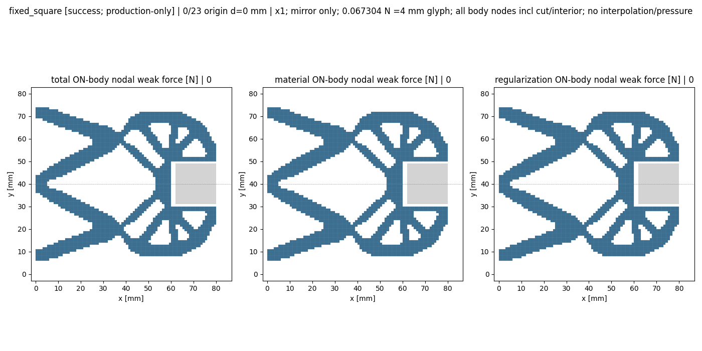
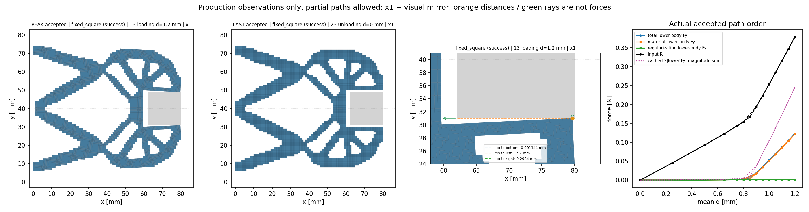
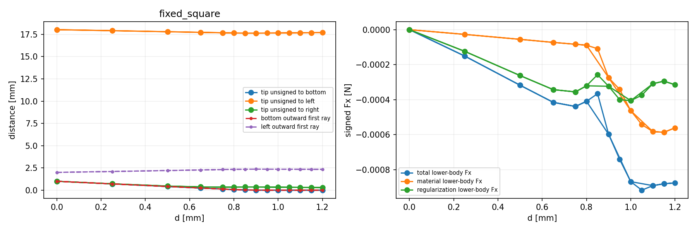
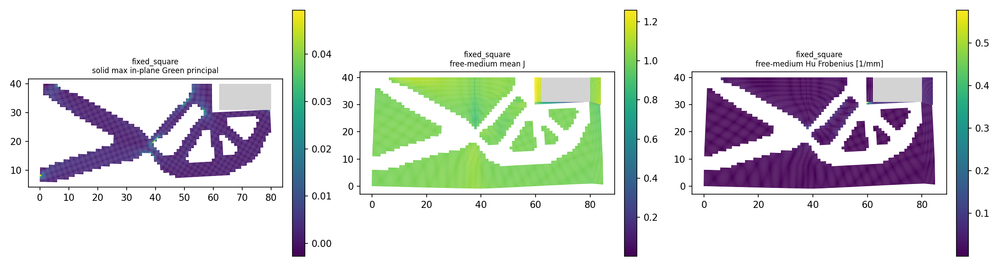
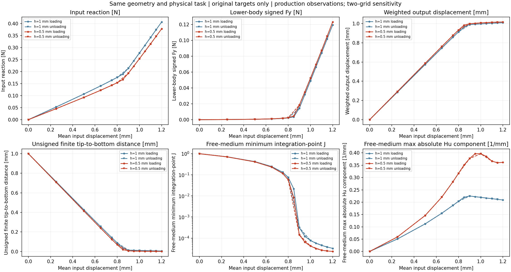

# M-VIEW1：24 个细网格保存态的实际显示和同设计粗细对照

2026-10-09（Asia/Seoul）。用户“批准”对应本卡待决问题；**唯一一次执行 PASS，窗口已关闭**。源码 main 基线 `436e16b8a24ae691218b2bae05c4de37a486876f`。96 个绑定实际字节一致，24 次几何观察、24 次节点力观察全部完成，24 帧动画与 4 PNG 已生成；原目标/分支/位移一致的 24 对粗细保存值完成对照。[独立终态审阅](author/terminal_review.json)通过，人工检查了全部四张静态图。冻结卡/协议及预启动授权中的准备态文字是历史快照，实际终态以本页、launch 和 phase 回执为准，不改写原证据。

## 整体目标、本轮要做什么与为什么

整体目标是读取 LF 普通几何，提供独立有限变形/TMC 正向响应，供外部研究层比较与优选；HF 不含优化，不调用 dmftd。先前已实现完整 NumPy 力、组装、切线、平衡求解、真实 CLI/batch/API、固定工件加载/卸载和保存态观察；M-CYCLE1 已取得保持同设计、物理任务和行程的 h0.5 全循环。已有粗细标量差异，本轮把结构运动、尖端靠近工件、弱式工件力和局部压缩实际显示出来，为人工检查及下一步数值判断提供依据。

本轮复用冻结 raw viewer，只观察 24 个细网格保存态；粗网格复用既有 CSV/JSON，不重新观察、求解或优化。新包装只增加原目标/分支匹配、14 项数值粗细对照及六量曲线，不改变 HF 核心或物理模型。

任务保持 84×40 mm 下半域，h0.5，13,440 单元/13,689 节点/27,378 DOF；固定半方形工件 center(71,40) mm、side18 mm、底面 y31 mm，初始钳尖 (80,30) mm、间隙1 mm；E1 MPa、ν0.3、plane strain、厚20 mm、gamma=alpha=1e−6、Lr80 mm、kr0.008615384615384613 MPa·mm²。平均输入 0→1.20→0 mm，24 原目标，没有新增二分态。关于 y40 的镜像只用于显示，没有求解上半模型。

## 实际结构、作用力与变形

加载峰值（原索引13，d1.20 mm）输入反力 **0.3787064524 N**，平均输出位移 **1.0166993609 mm**。唯一参考尖端 (80,30) 对应细网格 node10300，变形后为 **(79.7016521645,30.9988556374) mm**，到底面有限线段的无符号距离 **0.0011443626 mm（约1.144 µm）**。到左右有限线段距离分别17.7016522015及0.2983500302 mm。底部 first-ray 距离同为0.0011443626 mm；左侧 first-ray2.3427902244 mm与尖端到左侧距离的几何含义不同。平均输出位移不是钳尖间隙。

模型作用于下半工件的总力 **(−0.0008760157,+0.1231794016) N**，材料 **(−0.0005612268,+0.1219125571) N**，Hu 正则 **(−0.0003147889,+0.0012668445) N**；保持工件固定的反力方向相反。镜像上半 Fy 向下，两侧法向力幅值和 **0.2463588032 N**；完整镜像净力 **(−0.0017520314,0) N**。幅值和与净力分别报告，前者尚不是有效夹持资格。

本次节点力是原保存弱式节点力，遍历工件全部703节点（physical_only71、cut_only35、physical_and_cut2、interior595），没有压力插值、阈值剪裁或接触开关。动画红箭头分别显示总/材料/Hu正则 ON-body 力；共同标尺 **0.06730440433521688 N 对应4 mm图上箭长**。红箭头是力；静态 comparison 图中的橙色距离线和绿色射线是几何见证。两类显示不能互相解释。

全部24态的 region-edge 诊断 raw_overlap/strict_overlap/roundoff_ambiguous 均为 false；该工具没有检查集合包含或夹持器自身重叠。正的小量间隙和此诊断不足以证明全局无穿透、精确接触或压力准确。TMC在间隙内通过介质传力，不能把非零工件力本身当作已经有效夹持。

卸载末态（原索引23，d0）存储 binary64 钳尖坐标恢复 (80,30) mm、底面距离1 mm。R=−2.7464981249e−26 N、qout=−9.3100101860e−25 mm、下半工件Fy=−4.5537853625e−27 N、solid/medium minJ=1，介质 max |Hu| 分量1.7666066656e−24 mm⁻¹；保留这些小量，没有归零。动画与标量支持本次路径的恢复，不证明所有平衡场唯一或全局无滞回。

## 局部场和粗细差异

峰值 solid 积分点 minJ=0.9734133409，自由介质积分点 **minJ=2.3396692483e−5**，局部介质压缩强；自由介质 max |Hu| **分量**0.3614815860 mm⁻¹。实体全积分点 in-plane Green 主应变范围[−0.0282341372,0.0493290702]，由原保存F以binary64派生，不是HP参考。

图的三种色标分别是：实体每单元 max 主应变[−0.0026614398,0.0493290702]；自由介质**单元平均J**[0.0018008959,1.2594982429]；Hu **flattened Frobenius 范数**[2.1671388461e−5,0.5775156751] mm⁻¹。单元均值不同于积分点minJ，范数不同于最大分量；没有用色标下限替代原极值。

每对必须原目标索引、leg、is_original_target及d一致；24 对/14指标的[CSV](run_001/view/mesh_comparison.csv)和[JSON](run_001/view/mesh_comparison.json)保留原值及fine−coarse差，没有归零或插值。峰值比较（相对变化=(fine/coarse−1)×100）：

| 量 | h1 | h0.5 | 相对变化 |
|---|---:|---:|---:|
| 输入反力 R（N） | 0.4072527715 | 0.3787064524 | -7.0095% |
| 平均输出位移（mm） | 1.008846132 | 1.016699361 | +0.7784% |
| 下半工件 ON-body Fy（N） | 0.1193619515 | 0.1231794016 | +3.1982% |
| 材料 Fy（N） | 0.1178513816 | 0.1219125571 | +3.4460% |
| Hu 正则 Fy（N） | 0.001510569912 | 0.001266844543 | -16.1347% |
| 钳尖到底面有限线段距离（mm） | 0.005730316194 | 0.001144362628 | -80.0297% |
| 自由介质积分点 min J | 3.272299255e-05 | 2.339669248e-05 | -28.5008% |
| 自由介质 max abs(Hu) 分量（mm⁻¹） | 0.2088465634 | 0.361481586 | +73.0848% |

这是两网格**敏感性**。工件Fy约+3.20%、R约−7.01%，局部Hu分量约+73.08%，minJ约−28.50%；尚不授予网格/域收敛、压力或有效夹持资格。最近下一步先完成细网格保存态的独立数学参考适配并据原严格门核对数值误差，再决定局部网格/介质研究；不要立即重跑四小时完整路径，也不把粗网格旧参考转移给细网格。

## 实际执行、成本与资格边界

helper **39.6988670 s**，outer **40.4288697 s**，分别在600/660 s额度内；raw viewer37.5095246 s。helper采样RSS474,333,184 B，outer进程树采样RSS474,722,304 B（约452.73 MiB），均在8 GiB采样门内；采样/协作检查不是OS硬内存上限。UTC从08:24:26.421560至08:25:06.876637，exit0、stop_reason null、96绑定保持，首错即停合同没有触发，无重试/修复/延期/force。

24几何开始/完成、24节点力开始/完成；粗网格观察0，comparison1/1，匹配原目标24，节点CSV16,872行（703×24），24帧GIF每帧300 ms、循环播放。四PNG和GIF文件身份及帧数已独立核对；raw viewer79输出、phase83输出，含phase的实际新输出84文件。独立审阅的17,546项是轻量字节/身份/回执一致性检查，不能当作17,546个科学验收门。

新 CLI/API/模型/求解/F/T/HP/JIT/LF 为0，其依据是冻结纯保存态显示与CSV/JSON包装、导入来源及源码，没有动态力学hook监测（mechanical_hooks_monitored=false）。本次没有新力学求解或独立HP。stdout只有Matplotlib loc=best可能较慢的性能提醒，实际完成；未改源码或重画。

raw view manifest提供与本次保存结果匹配的诊断图件；原细网格 response 的independent_reference/views仍not_provided、三个producer资格flags仍false，原字节保持。不能改写producer响应或静默继承粗网格HP。正式细网格HP、压力/有效夹持、网格/域收敛、圆体自身任务、自由体/摩擦、正式批量标签/排名、HF5整体仍未完成。

## 全部原目标、证据与恢复

| 原索引 | 分支 | d (mm) | tip x (mm) | tip y (mm) | tip到底面 (mm) | 下半工件 Fy (N) | medium minJ |
|---:|---|---:|---:|---:|---:|---:|---:|
| 0 | origin | 0 | 80 | 30 | 1 | 0 | 1 |
| 1 | loading | 0.25 | 79.90209475 | 30.29243349 | 0.7075665065 | 0.000195939155 | 0.7063573 |
| 2 | loading | 0.5 | 79.79379578 | 30.58574219 | 0.414257806 | 0.0005546739579 | 0.41014756 |
| 3 | loading | 0.65 | 79.72503595 | 30.76037953 | 0.2396204678 | 0.001048280462 | 0.23267694 |
| 4 | loading | 0.75 | 79.67882966 | 30.87443161 | 0.125568385 | 0.001792584806 | 0.11578312 |
| 5 | loading | 0.8 | 79.65623 | 30.92976999 | 0.07023001131 | 0.002528398248 | 0.058941924 |
| 6 | loading | 0.85 | 79.63626041 | 30.98032603 | 0.01967396504 | 0.00463657755 | 0.0083907133 |
| 7 | loading | 0.9 | 79.64021873 | 30.99243592 | 0.007564081663 | 0.01827595561 | 0.00014317974 |
| 8 | loading | 0.95 | 79.64964062 | 30.99533059 | 0.004669414043 | 0.03488998869 | 6.4345932e-05 |
| 9 | loading | 1 | 79.6600547 | 30.99647125 | 0.003528750135 | 0.05217902989 | 4.2263977e-05 |
| 10 | loading | 1.05 | 79.67053137 | 30.9972491 | 0.00275090015 | 0.06961058648 | 3.2020214e-05 |
| 11 | loading | 1.1 | 79.68092556 | 30.99789727 | 0.002102731651 | 0.08712878021 | 2.6765668e-05 |
| 12 | loading | 1.15 | 79.6912869 | 30.99844731 | 0.001552692662 | 0.1050211058 | 2.454209e-05 |
| 13 | loading | 1.2 | 79.70165216 | 30.99885564 | 0.001144362628 | 0.1231794016 | 2.3396692e-05 |
| 14 | unloading | 1.15 | 79.6912869 | 30.99844731 | 0.001552692662 | 0.1050211058 | 2.454209e-05 |
| 15 | unloading | 1.1 | 79.68092556 | 30.99789727 | 0.002102731651 | 0.08712878021 | 2.6765668e-05 |
| 16 | unloading | 1 | 79.6600547 | 30.99647125 | 0.003528750135 | 0.05217902985 | 4.2263977e-05 |
| 17 | unloading | 0.9 | 79.64021873 | 30.99243592 | 0.007564081663 | 0.01827595561 | 0.00014317974 |
| 18 | unloading | 0.8 | 79.65623 | 30.92976999 | 0.07023001131 | 0.002528398248 | 0.058941924 |
| 19 | unloading | 0.75 | 79.67882966 | 30.87443161 | 0.125568385 | 0.001792584806 | 0.11578312 |
| 20 | unloading | 0.65 | 79.72503595 | 30.76037953 | 0.2396204678 | 0.001048280462 | 0.23267694 |
| 21 | unloading | 0.5 | 79.79379578 | 30.58574219 | 0.414257806 | 0.0005546739579 | 0.41014756 |
| 22 | unloading | 0.25 | 79.90209475 | 30.29243349 | 0.7075665065 | 0.000195939155 | 0.7063573 |
| 23 | unloading | 0 | 80 | 30 | 1 | -4.553785362e-27 | 1 |

[授权历史记录](author/authorization_record.json) · [实际launch](view_launch.json) · [phase回执及输出哈希](run_001/view/phase_view.json) · [raw view manifest及所有观察身份](run_001/view/view.json) · [逐态摘要](run_001/view/fixed_square/summary.json) · [逐态CSV](run_001/view/fixed_square/states.csv) · [全部节点力CSV](run_001/view/fixed_square/nodes.csv) · [独立终态审阅](author/terminal_review.json) · [原卡](M-VIEW1_CARD.md) · [协议](protocol.json) · [细网格原生产结果](../../../lf_data_preparation/native_interface_001/nested_cycle_001/RESULTS.md)。全部观察及图件在manifest内列明；无需重新求解或渲染来查看本次结果。

protocol SHA `50f8cfafb646d7ad5c4200ed2af007521907c70d8a6d38eba552c73423e4b180`；raw view manifest SHA `402a5533844ff1ace45e44b4fa72b1843426b0e111ce02e15b8238c878e91ae8`；独立审阅 SHA `6ab2b006cfb17d4fb1bfe987028032fe8a9b709d20d10d98c40e55fd1013cd76`。细网格原result SHA `624ff6618e12670ea2bed9f84992a5001a7fd983fc7d2ade2415b8f1072ac5cf`、原response SHA `9e68476d42f516f92bd1e93946568ed04f5fd5ac0d685ef98136fa8521c1499a`保持。

继续main开发，origin保持 https://github.com/dudaxing/Compliant-TO-TMC.git；发布后以实际Git/增量恢复回执确认另机可恢复。本页不将尚未执行的下一步写成完成。
