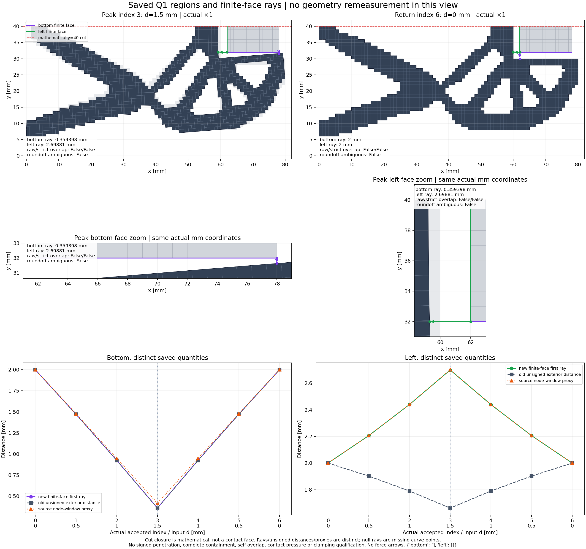

# 独立 HF：保存 Q1 单元域和有限工件面诊断

## 整体目标、这一步做什么、为什么

整体目标是完成独立于LF/dmftd/优化器/MPM的第三介质大变形力学评估器，支持实际机构的输入位移、材料与Hu力、切线/组装、平衡、固定对称工件作用力及完整加载—卸载，并逐步做到可靠可解释的夹持评估。代码以功能、简洁可读与数值可靠为先；每次仅依据实际结果推进相邻功能，保存目标/原因/过程/效果/限制与真实图。

前一007已完成固定下半方体0/.5/1/1.5/1/.5/0mm机械循环及七态fresh参考。其旧unsigned边距仍不能判断嵌套区域重叠，也不能把低于有限左面范围的角点欧氏距离解释为水平间隙。本步补实现完整原生Q1跨域内部重叠和固定方体有限底/左面向外首次边界射线，使用原七态，不运行更大行程力学。这是新功能实现；解析测试和证据服务于功能验证。

## 实现与使用

新增[`native_region_geometry.py`](../../hf_repo/src/hf_eval/native_region_geometry.py)（269行）及[`measure_native_workpiece_regions.py`](../../hf_repo/scripts/measure_native_workpiece_regions.py)。完整Cartesian原网格、完整固定下半方体和每个选中quad的有限/非退化/严格凸/正定向前提先验证；实际坐标为binary64 `coordinates + lift + fluctuation` mm、×1。不能用保存minJ代替quad前提，也不从包围盒补造缺失工件面。

实体域包含数学镜像切口，通过AABB候选筛选和凸quad SAT检查跨域内部相交；raw投影符号、严格判定、舍入模糊单列。无需重建无方向边对的全局环，也不利用开口外边做包含推断。有限面射线解析裁剪边的切向条带及向外半平面，在连续有限面上取最小首次命中；保留角点、near-corner、并列区间、无命中null、原重构投影。小正值不裁零；解析约束根与原重构值明确区分。正射线也可能是区域内部出射，域重叠/模糊时不能解释为正常分离间隙。

旧boundary模块/CLI/default schema和全部机械实现保持原字节。新CLI schema是native-workpiece-region-path-1.0，只支持本次原生fixed lower-half square，不扩为圆形或任意非凸网格。普通文件入口从任何恢复后的仓库根可用，无LF导入/安装；输出目录必须新建：

```text
python -B hf_repo/scripts/measure_native_workpiece_regions.py --repo hf_repo --input lf_data_preparation/native_workpiece_001/coarse_square_cycle_007/result --output scratch/new_region_measurement --boundary-comparison functional_views/native_workpiece_cycle007_20261004/boundary_saved_001/measurement_001/boundary_measurements.json
```

这条命令会进行新几何测量，不是恢复文件身份，也不是新力学资格。已存本次结果在[`square007_002/measurement_001/regions_measurements.json`](square007_002/measurement_001/regions_measurements.json)。source/module闭包只有pure numpy geometry+旧boundary+package init；F/T/HP/solver/consumer0依据来源及加载模块排除，**不是力学hooks计数监测**。

## 问题排查、实际执行与取舍

001首错测试只实际执行6项，5pass/1fail。嵌套内部重叠的正确真值为np.True_，而API需要Python bool，JSON也不能直接保存numpy.bool_。根因是容差标量为numpy.float64并使比较/聚合输出成为numpy.bool_。旧卡即时关闭，33未执行项不计通过，七态测量/图均0，源快照/日志/JUnit保留。002只在原容差return外包Python float；原binary64值/表达式、SAT/quad/射线门、39测试、CLI、资源不变。不是放宽测试或改变物理判据。新002一次39/39测试通过，再经真实JUnit/launch前置核对才一次七态测量7/7通过。唯一警告来自故意1e308法向norm overflow的拒绝例，入口如预期抛ValueError，未隐藏警告。

保存图001也在绘图前首错关闭：旧metadata的真实输入role为stage/result/result.json，作者按仓库路径后缀查找导致身份门失败；实际SHA与原result完全一致。保存图002只严格识别真实role/同SHA，独立render成功；静审漏检和真实错误均保留，没有把静态pass说成运行pass。根与独立审图发现其左面zoom文字框遮住水平ray，故保留002并另图003仅将zoom文字移到轴上部。主图、身份门、数值、坐标、CSV和物理范围不变；003一次独立render通过，CSV与002逐字节同。没有重开/覆盖任何失败卡或再次测量几何/力学。

所有正式阶段单次，测试60/90s、几何120/150s、各独立保存图120/150s，树RSS采样8GiB，含导入/保存/末核，协同非OS硬限；首错保留实际失败/部分结果并关闭，不同卡内修复重试/force/扩预算。001结束/关闭37绑定原字节；后续live新module仅那个已声明类型修复不同，旧caps完整。00240绑定、最终图72绑定结束保持，18几何输入（17模型/七态JSON+NPZ及旧unsigned）和四测量源快照逐项核同；全部原27模型数组、6642DOF/376fixed、task及机械来源未改。新协议相对路径支持换目录恢复，旧绝对历史日志只作来源记录，不能当新运行路径。

## 实际效果与人工查看

| index | leg | 输入mm | 底面射线mm | 左面射线mm | raw/strict内部重叠 | 模糊 |
|---:|---|---:|---:|---:|---|---|
| 0 | origin | 0 | 2 | 2 | False/False | False |
| 1 | loading | 0.5 | 1.47245375378 | 2.20601320476 | False/False | False |
| 2 | loading | 1 | 0.925744524312 | 2.43964963206 | False/False | False |
| 3 | loading | 1.5 | 0.359398367462 | 2.69881035866 | False/False | False |
| 4 | unloading | 1 | 0.925744524312 | 2.43964963206 | False/False | False |
| 5 | unloading | 0.5 | 1.47245375378 | 2.20601320476 | False/False | False |
| 6 | unloading | 0 | 2 | 2 | False/False | False |


七态1086机制cells和128工件cells的完整跨域AABB筛选均没有候选，故实际路径SAT细分类对数为0；这是通过完整包围盒筛选后的分离观察，不冒称实际路径对发生交叠的SAT已作实测。SAT嵌套/孔/多组件/触点/交叉/模糊与异常quad等由39解析用例单独验证。全部有效、raw/strict overlap及模糊false，数学closed边界无交叉/near-touch。完整set containment和机制全局自重叠未检验。

峰index3：底射线[78,32]→[78,31.64060163253753]，向外(0,-1)，距离0.3593983674624708mm；左射线[62,32]→[59.30118964133579,32]，向外(-1,0)，距离2.6988103586642143mm。各只有一个最小命中，face参数1/0，**均是各有限面端点**；不能解释为面内接触压力。独立保存点插值/向量检查最大残差3.1086244689504383e-15mm，小于保存舍入容差。初/返底18/左9个同值记录含连续平行面区间；画出的closest角点仅一项代表，不是唯一最近点。

峰旧bottom unsigned0.35823198220719793mm、left unsigned1.6619606664718432mm；原node proxy分别0.41637603593684247/2.700994461573245mm。三类量保留原定义，图/CSV分列。旧left最近体点[62,32]至机构[62.13102016940224,30.34321185056467]位于有限左面下方；它的下降不能证明左面水平闭合。新实际观察是**底部靠近、左向射线最小距离增加**，卸载返2mm，没有证明有效夹持。



图为2560×2400，实际坐标×1，axes viewport zoom不放大物理位移；箭头只是面到机构点的几何射线方向，红y40线为数学封口，不是接触面。新图不画力箭头。[七态CSV](square007_view_003/render_001/region_states.csv)28列，[view元数据](square007_view_003/render_001/view.json)保存索引/身份/no-hit/角点及范围。实际输入力、材料/Hu分力和变形仍可看[上一007的真实结构/力图](../native_workpiece_cycle007_20261004/saved_001/render_001/cycle007_saved_path.png)及[机械报告](../../lf_data_preparation/native_workpiece_001/coarse_square_cycle_007/RESULTS.md)：峰R=.333178493234N、自由+y输出1.747632769069mm、minJ=.168678218781；这些是既有007的机械资格，本轮没有新增或重赋参考资格。

## 真实成本

| 独立卡/阶段 | 真实退出/结果 | outer秒 | helper秒 | 峰树RSS bytes |
|---|---|---:|---:|---:|
| square007_001/tests | exit1/not_pass | 2.646501600 | 1.22343740001088 | 59445248 |
| square007_002/tests | exit0/pass | 0.965099600 | 0.6226583000388928 | 59207680 |
| square007_002/measure | exit0/pass | 0.980417200 | 0.7867302999948151 | 44355584 |
| square007_view_001/render | exit1/not_pass | 1.450579300 | 未形成 | 72663040 |
| square007_view_002/render | exit0/pass | 2.132697600 | 1.7170977999921888 | 112320512 |
| square007_view_003/render | exit0/pass | 2.044501200 | 1.5789691000245512 | 111771648 |


当次新正式执行总共：测试两独立卡，其中失败6项及新通过39项分开；保存七态几何仅一次7个高层调用（不把解析例的几何函数调用算入此路径计数）；保存图三独立调用（001读取失败，002及003各自成功）。F/T/HP/solver/consumer/机械组装0，pure来源/导入basis明示；公开恢复将只核文件身份、不重跑数值。各完整阶段的首错和独立候选预算分别记录，不复用关闭卡余量。

## 当前功能进度、尚未完成与下一步

NumPy完整材料/Hu力、声明方向切线/CSC组装、平均位移约束、原生平衡、固定对称半方工件和0→1.5→0完整机械循环已实现，并有相应任务接受态fresh参考。当前新增JSON可保存的跨域内部重叠与有限面方向距离；新图供人工检查。

下一唯一物理建议是同一粗方固定工件的1.75mm有序循环，将1.5→1.75以及返回分开保存，原材料、网格、机械模式和所有数值门保持；先形成独立实际输入/来源卡和逐阶段资源记录，再按实际F/T/J、quad/域/面结果与fresh参考判断，不从0.359mm线性外推接触阈值或保证收敛。若新quad/J/算术门失败，就先排查，不能继续静默扩大行程/资源。圆形/不同尺寸/初始间隙、细网格和更大行程仍需要独立探索，不同时堆多工况。

尚未完成：signed penetration、机制全局自重叠、接触压力/有效夹持判据、自由工件、细/圆工件相应资格、stress HP/机械辅助能量、全列HP、H2/H3/HF5及AD/JIT和整体开发目标。new1.75/2/3mm平衡本轮未运行。保持main唯一开发主干，origin=https://github.com/dudaxing/Compliant-TO-TMC.git；全球目标仍active/未完成。

## 恢复、状态与审查材料

本报告写入时尚未提交/公开恢复；实际发布以后通过handoff/native_region_geometry_20261004/public_restore_science_receipt.json追加明确commit/manifest/终止结果。Git/manifest恢复只验证必要文件及SHA，full_evidence_checked=false、0数值回放，不授机械资格。阶段protocol/source_freeze/input_inventory、stdout/launch、失败闭卡、39JUnit、实际measure JSON/源/旧对照副本及纯保存view PNG/CSV都随main交付。docs/CURRENT_STATUS与RESUME页首、持续NUMPY记录末节接续本次结果；旧记录原字节保留。
