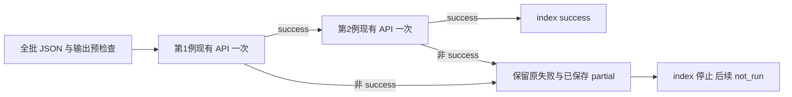

# 薄批量接口及真实两例结果

evaluate_native_batch及CLI先预检全批共享物理声明、JSON和新输出，再每例调用现有evaluate_native一次；首非success保留原失败/partial，后续not_run。15项mock功能测试后，两例真实.025 mm路径、各4态/14F/9T/1solve已完成；逐例各8次新HP及全4态保存图也已完成。所有比较仍使用19个共同物理键和原complete/full/tangent，不静默改变任务或网格。

| 设计 | 实际PNG | 全4态GIF | 自有qualified响应 |
|---|---|---|---|
| canonical | [结构与数值](../lf_data_preparation/native_interface_001/batch_forward_001/run_001/view/canonical/native_mean_path.png) | [动画](../lf_data_preparation/native_interface_001/batch_forward_001/run_001/view/canonical/native_mean_path.gif) | [JSON](../lf_data_preparation/native_interface_001/batch_forward_001/run_001/qualified_response_canonical.json) |
| native_fine | [结构与数值](../lf_data_preparation/native_interface_001/batch_forward_001/run_001/view/native_fine/native_mean_path.png) | [动画](../lf_data_preparation/native_interface_001/batch_forward_001/run_001/view/native_fine/native_mean_path.gif) | [JSON](../lf_data_preparation/native_interface_001/batch_forward_001/run_001/qualified_response_native_fine.json) |

[manifest](../lf_data_preparation/native_interface_001/batch_validation_001/example_two_case_manifest.json)给出本轮真实输入；[index](../lf_data_preparation/native_interface_001/batch_forward_001/run_001/batch/index.json)保留生产原摘要，自有qualified响应另存。图中×1是真实形状、×40只为小位移显示，另有反力、节点/加权位移与J值。原生产response不回写新参考/视图flag。

任意cwd用显式--repo统一解析输入和输出；请在项目HF环境中（与LF环境分开）运行。下方历史用法保留，但已使用的run_001输出不能再用作新执行目录；一次新的调用需新的输出和资源记录。本轮whole生产2400/2460 s、8 GiB和shared controller1800 s均已关闭，参考与显示为各自独立窗口。

两例是不同LF设计，且原生网格分别为1和0.5 mm，不能据此声称同设计网格收敛或排名。本轮无工件：body力为null，q_out是加权端口位移而非钳尖间隙。一般有效接触、连续压力、自由体/摩擦、匹配网格、重复性合同和HF5整体仍未完成；全切线列、能量/应力/应变HP没有被本轮授予。

下一步先核已有固定工件大行程任务，经现有薄API的具体实例缺口：逐项对照原任务路径、fixed_rigid几何、初始化选项、力摘要和保存输出，再选择最小功能接续。task1.1已支持square/circle及ordered_cycle，API已透传路径/模式，摘要已有body弱式力、holding、mirror/net和双侧法向幅值和；不重复实现这些入口。此处只是接续计划，没有启动新科学计算。

[本轮报告](../lf_data_preparation/native_interface_001/batch_reference_v2_001/RESULTS.md) · [恢复开发](RESUME_DEVELOPMENT.md)


<details>
<summary>历史阶段记录（原文完整保留；旧状态只对应当时）</summary>

## 当前：真实两例生产通过，新的参考包装读取失败

UTC 2026-10-07T20:32:01.470309+00:00：canonical 新参考卡已一次终止，exit1，新增节点数检查读取不存在的 `coords` 字段；真实23字段中的名称是 `coordinates`。失败前新HP=0、参考接受态=0、检查11项，helper约1.498秒/outer约1.880秒。fine参考与新图未执行。两例0.025 mm生产、28核心源与原54份输出字节不变，原生产资格仍通过。

本张参考卡已关闭，不修复后重试；准备独立V2最小包装、逐项字段/状态/属性核对和新卡，再单独确认执行。两设计不同，不作网格收敛或排名；HF5整体尚未完成。[当前诊断](../lf_data_preparation/native_interface_001/batch_forward_001/reference_failure_diagnosis.json)；[实际阶段报告](../lf_data_preparation/native_interface_001/batch_forward_001/RESULTS.md)。以下为历史记录，当前以上方及真实终态回执为准。

---

当前更新：两例原示例已经实际完成生产计算；各4态，缓存保存零新增F/T，独立HP和新图仍待执行。详细结果见[真实阶段报告](../lf_data_preparation/native_interface_001/batch_forward_001/RESULTS.md)。下文原字节保留为aa072功能阶段说明，其中“尚未执行”描述当时状态。

---

# 原生 HF 两例批量入口

薄 batch 已实现并通过15项功能检查。它把普通 LF 几何与各自绑定的物理任务依次交给既有 `evaluate_native`，每例最多调用一次，再保存一个便于核对的 `index.json`。这样可用同一份物理条件查看多个设计的位移、端口反力、成功状态和失败原因，保持 LF 优化层与独立 HF 分析分开。

入口是 [native_batch.py](../hf_repo/src/hf_eval/native_batch.py) 的 `evaluate_native_batch(manifest_path, output_directory, *, repo_root=None)`，命令行是 [evaluate_native_batch.py](../hf_repo/scripts/evaluate_native_batch.py)。预检查只读取 task/geometry JSON：task 除 `task_id`、`geometry` 外须一致；几何的 case family、厚度、物理范围、对称范围和 region tags 须一致。原生 cell spacing/shape 可以不同，二者的网格声明均记入 index；这项检查不证明离散等价或网格收敛。

以下流程解释已经通过 mock 检查的接口行为，不是新两例物理结果图。



仓库已有 [两例 manifest 示例](../lf_data_preparation/native_interface_001/batch_validation_001/example_two_case_manifest.json)，schema 是 `hf-native-batch-manifest-1.0`。每个 case 只含 `label/geometry/task/output`，分别使用 canonical 与 native_fine 的原几何/任务身份，输出到未来 `batch_forward_001/run_001/canonical` 与 `native_fine`。截至本阶段，该示例未执行，也未产生新两例结果。

`options` 整批共享，不能在 case 内覆盖。上例显式保留默认三种模式 `complete/full/tangent`，与两份原任务的0.025 mm目标相同。两份 task 只有身份不同，其余19键一致：E=1 MPa、nu=0.3、gamma=alpha=1e-6、Lr=80 mm、native grid、free output、无工件、未变形起点和相同物理端口/边界。原最小增量 `6.25e-5 mm` 要显式填写，避免接口按首个目标/16得到不同值。也可传共享 `settings` 字典，但此时 `time_limit_seconds` 须保留180默认且 `minimum_increment` 为 null，不能混用两套限额输入。

所有相对路径都以显式 `--repo` 为基准；未提供时使用调用者 cwd。在项目独立 HF Python 环境中运行（与 LF 优化环境分开）；以下是从任意目录运行的用法例（将 `$repo` 换为实际 clone 路径）。新真实运行仍需下一阶段冻结 whole-helper 卡。

```powershell
$repo = 'C:/work/Compliant-TO-TMC'
python "$repo/hf_repo/scripts/evaluate_native_batch.py" --repo "$repo" --manifest 'lf_data_preparation/native_interface_001/batch_validation_001/example_two_case_manifest.json' --output 'lf_data_preparation/native_interface_001/batch_forward_001/run_001/batch'
```

batch 输出目录与每例输出目录都必须新建且互不冲突。每例结果包含其既有缓存保存的 `result.json`、`response.json`；batch/index 保存 manifest、task/geometry 和 response 的路径及 SHA，原始物理声明与共享参数，以及每例的 target、请求终点、最大加载行程、last accepted、计数、原失败信息和各自的参考/视图信息。

全部预检查先于第一例求解。运行时遇到第一例非 `success` 即停止，后续例标 `not_run` 并写明停止原因；输入在预检查后发生改变也会停止。controller 返回的失败前缀保留原 last accepted，不能当作完整 target；逃逸的中断/资源异常记录原 class/code/reason 后继续向调用者传播，index 标 `interrupted`。CLI 仅在整个 batch `success` 时返回0，否则返回1或传播异常。接口不重试，也不自带资源管理器。

本阶段 [功能结果](../lf_data_preparation/native_interface_001/batch_validation_001/RESULTS.md) 是 mock transport 与 JSON 合同验证：15项通过，9类真实科学调用计数全部0。现有27个源（25个力学/几何相关源及2个既有单例接口）字节不变。它没有产生新的两例物理结果、独立 HP 或图像资格；`HF5_qualified`、`ranking_qualified` 保持 false，各 response 的参考与资格不互相借用。

下一次真实两例运行仍待下一阶段冻结新卡：一次连续 whole-helper2400秒 /outer2460秒、8 GiB 采样 RSS，两例共享 controller1800秒；controller 时间只覆盖求解，whole-helper应覆盖 imports、构模、缓存写出和 summary。每例完整通过后再按实际 N 另卡做 fresh2N（80/120精度）独立参考和全部保存态真实视图。canonical 是1 mm网格的uniform设计，fine 是0.5 mm网格的另一random设计；比较应称各自原生网格上的同任务分析，不作排名或网格收敛结论。

已有0.025 mm旧独立单例图可作为历史物理背景：[canonical PNG](../functional_views/native_gripper_task025_20261003/native_mean_path.png)、[canonical GIF](../functional_views/native_gripper_task025_20261003/native_mean_path.gif)、[fine PNG](../functional_views/native_fine_task_025_20261003/native_mean_path.png)、[fine GIF](../functional_views/native_fine_task_025_20261003/native_mean_path.gif)。两套均为旧单例4保存态，并含标明40×倍率的变形显示；不是新 batch 图。


</details>
