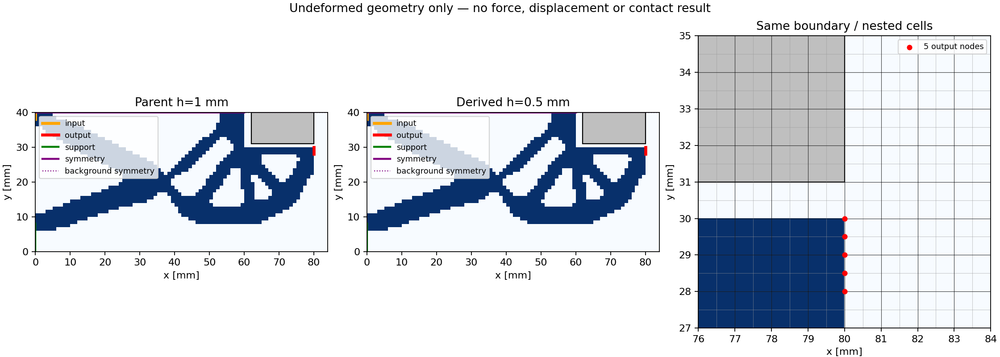

# M-PREP1：同结构细网格构模与显示结果

2026-10-09（Asia/Seoul），用户明确“批准按 M-PREP1 卡执行”。唯一一次执行PASS，窗口已关闭，不续用剩余时间。源基线为`36c1f25d266b811bc1c11694e12645e48635e04b`。没有修复重试、force终止、力/切线/平衡/HP执行。

## 目标、实现与理由

整体目标仍是独立有限变形／TMC正向评估器，读取普通LF几何，供外部研究层比较；HF不包含优化。已有真实h1固定方形工件的24态加载—卸载和保存图，本轮建立**同一结构**的h0.5网格，排除不同LF设计及边界变化对网格对照的干扰。

新增[nested_geometry.py](../../../hf_repo/src/hf_eval/nested_geometry.py)将四掩码每个父格精确细分为2×2同值子格，调用现有geometry writer、native构模和模型保存入口。父几何为W-API1的实际保存快照。实体并集、84×40 mm域、厚度、半模型、region tags与材料保持；记录父身份及HF派生来源，`whole_grid_is_LF_native=false`。模型的`native`表示选用该供应的派生网格。

原物理任务保持：固定side18方形工件center(71,40)，下半方框[62,80]×[31,40]；E=1 MPa、nu=.3、thickness20 mm、gamma=alpha=1e-6、Lr=80 mm、plane strain。支持与实体/背景对称保持原物理线段，端口仍为原2mm平均线积分；task保存原24目标0→1.2→0 mm，但本卡未执行路径。

## 实际结果与效果

| 数量 | 原h1模型 | 实际h0.5模型 |
|---|---:|---:|
| 单元 | 3,360 | 13,440 |
| 节点 | 3,485 | 13,689 |
| DOF | 6,970 | 27,378 |
| 合并固定／自由DOF | 452／6,518 | 1,548／25,830 |
| 机制实体／medium单元 | 1,086／2,274 | 4,344／9,096 |
| 固定工件单元／节点／DOF | 162／190／380 | 648／703／1,406 |
| 每端口节点及权重 | 3；[.25,.5,.25] | 5；[.125,.25,.25,.25,.125] |

101/101检查通过，具体见[checks.json](run_001/checks.json)。包括四掩码各个子格及物理面积、原节点嵌入、BL/BR/TR/TL物理坐标、独立方框工件选择、实体附着支持/对称、背景及合并fixed/free集合、仿射场端口线积分、材料父子值、保存字段/档案身份。Q1梯度×2、Hessian×4、权重÷4、参考点不变；kr=0.008615384615384613 MPa·mm²及Lr保持，不随h缩放。

一次几何生成、一次构模、一次保存、一次三联PNG均完成。helper16.7742628 s／outer17.9395764 s，helper采样RSS峰值180,039,680 B／tree峰值187,662,336 B；原预算180／240 s、采样8 GiB，无stop reason，17项绑定执行后保持。[helper终态](run_001/phase.json)与[outer回执](prepare_launch.json)记录实际资源；这是协作检查/采样，未宣称OS硬内存或硬时间上限。

图中蓝色为机制、灰色为固定工件；左/中为同一未变形轮廓，右为嵌套网格与5个输出端口节点。工件底面y=31、尖端(80,30)，初始间隙1 mm，右侧medium余量4 mm。图没有放大变形或力箭头，因为本卡没有机械响应。

派生几何ID为`a8117291562fc32b9806a26f5bcf97441e06992f44e5e8c634f44c52e67e7fbe`；模型文件SHA为`ac92b3f6d4a87facec97d84060f32642965d011fefdd357492f9de5a422d4552`，模型NPZ SHA为`79dca7bcf3c840c5dc97b4fe937be3950728864eaf4b365ecd9ab8fa858d8278`。[派生task](run_001/task.json)、[模型](run_001/model/model.json)及相邻NPZ均为可恢复的普通包。

独立审阅见[terminal_review.json](author/terminal_review.json)：只核对保存JSON、实际文件身份和已有PNG像素，不解码数组、不构模或重绘，数学依据继承源静审。原[card](M-PREP1_CARD.md)、[protocol](protocol.json)和[授权记录](author/authorization_record.json)保留原字节及其当时状态；当前执行状态以本报告与两层终态为准。

## 下一步与尚未完成的功能

细网格构模前置已完成，可以安排同一物理任务的完整24目标加载—卸载。下一张卡仅执行细网格真实生产，保持原力学门和零起始状态，依据细网格实际规模及既有h1成本给出新预算；原资源窗口不续用。生产通过后再使用其自有保存态参考和图，按原目标/加载卸载分支对比反力、工件Fy及材料/正则分量、端口位移、连续几何距离、J/Hu和回零恢复。

构模检查证明输入/离散准备一致，不证明细网格平衡、接触力或收敛。新力/切线/求解/HP/JIT执行/LF调用为0；HF导入包含JAX模块不代表执行JIT。未生成新qualified response，原粗API资格标志保持。两网格只报告敏感性；压力/有效夹持、匹配域/网格收敛、圆体、自由体/摩擦、正式标签/排名及HF5整体仍未完成。
