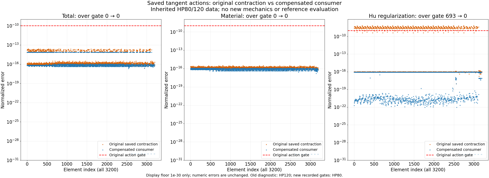

# 实际补偿consumer误差图

一次正式saved_view真实exit0/pass，outer2.357934700s、采样树峰128122880B；322冻结绑定不变，stop_reason=null。0新consumer/F/T内核/HP力学/solve，仅读既有检查误差绘图。实际资源及输出身份见 `saved_view_launch.json` 与 `evidence/view_metadata.json`。

橙色为原saved action，蓝色为实际29行新consumer的已验误差，红线为原action门；3200单元×三分量完整展示。Hu原693越门，新0；total/material均0→0。新Hu最大归一误差1.010655561e-16 <1e-9，e0为约1.87623e-22。与先前精确Decimal保存K×v图分开，这张图确实展示新算法的实际结果。

输出2600×950 PNG、9600行 `plotted_error_data.json.gz` 及metadata；root已实际打开PNG检查标题、图例、误差点与红线。旧diagnostic对照HP120，新保存验收门对照HP80，脚注明确；两原参考一致门保持1e-40。本图display floor1e-30仅用于log绘制，不用于判门。

该查看器不授新力学资格，完整新的保存输入资格见[实际验收](../matmul320_action_requalification_001/RESULTS.md)。物理状态仍为[旧粗方002](../coarse_square_cycle_002/RESULTS.md)的七个实际接受态：0.5mm峰值真实底最近无符号距离1.471935964mm，尚未夹紧。新图不能充当新平衡、接触压力或全部切线列的证据。
