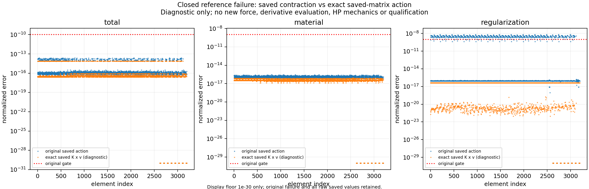

# 0.5mm返回范围问题：matmul320候选及消费端诊断

本记录承接已完成粗方002循环。整体目标仍为独立HF正向力学评估器：从普通机构/工件几何、材料、支承和任务，得到有单位、有方向的真实形变、力与反力，逐步探索较大行程及夹持—卸载。当前先排除卸载中实际出现的算术范围拒绝，避免用收敛半步掩盖功能限制。

## 物理背景与定位

旧源码下粗方固定半工件 `[0,.1,.25,.5,.25,.1,0]`mm一次完成，七态14次新HP参考通过。峰值输入力0.106253248N、自由+y输出0.575755712mm，minJ0.735764774，最大节点位移0.796706551mm。实际边界底最近无符号距离仍1.471935964mm，尚未夹紧；半工件微小背景传力不能当接触压力或有效夹持。见[七态完整结果](../coarse_square_cycle_002/RESULTS.md)及[真实七帧动画](../../../functional_views/native_workpiece_peak05_20261004/physical_001/workpiece_cycle_actual.gif)。

最后返零腿F36/39/42各出现一次范围拒绝，均按原规则接受随后同基态半因子。首个F36完整两数组和材料/积分输入被捕获，独立一次原内核诊断复现 `unsupported_arithmetic_range`。失败位于两个**机构实体单元**1275/1348的S=TᵀP矩阵乘法，四个low×high尾项约4.22–4.38e-126，低于原两词非零分量支持下界2^-400；不是IEEE下溢，也不是J失效。旧已接受态的资格不能扩大给被拒绝输入。

## 最小候选与执行

隔离runtime复制41个来源，只改 `split_kernel_invariants_hu._scaled_matmul` 的选中tiny分支上下尺度192→320、候选身份和相应docstring。公式、四个DD乘积、CI支持上下界、其他尺度、切线方向尺度128及原门限均保持。新核心SHA为 `7fff354270a276764445b45a281a5924fd9f0356236b89e0dbd4f00088b383ce`。选中数据小矩阵分量≤2，升尺度后两词及乘积/求和仍低于原上界；这只处理已定位矩阵乘法，不宣称任意tiny输入的全域闭合。

旧PORT方向在失败单元为零，不足以判断此处切线，因此执行前另声明可重现dyadic witness：v_i=((37i mod257)−128)/128，原376fixed自由度置正零。3072个非工件单元有非零方向、两个失败单元八分量全非零；工件128单元方向为零，不能称每个单元均非仿射或所有列均作HP。旧方向/定义保留。

| 唯一正式阶段 | 实际终止与结果 | 调用/成本 |
|---|---|---|
| unit_tests | exit0，23项通过 | 原力/T/循环所选20项＋3新尺度探针；pytest12.72s，outer14.5384s，采样树峰153014272B |
| candidate | exit0，完整候选返回 | 1F开始/完成、1T开始/完成，0HP/solve/JIT；outer34.6443s，峰763629568B |
| reference | **exit1，首错关闭** | 2HP80/120开始并完整完成后，首门失败；helper22.1823s，outer22.9575s，峰406016000B |

新尺度的两个原失败局部矩阵用Decimal2000 exact及Inexact检查；误差≤2^-98 sumabs，无绝对floor；false分支两词字节相同。一次完整F/T覆盖3200单元、6642DOF、26force fields、41combined fields及三完整CSC。返回有限且支持判定通过只是计算完成，**原reference失败，候选当时未获数值资格**。

## 实際首错与深度排查

原reference先完整生成HP80/HP120，再按原门逐项验收。element0的Hu action误差为2.424349759030934e-9，超过1e-9；原分母1e-10，绝对向量差2.424349759e-19。此前五门通过，此后原门不执行。两个HP的该项一致误差约2.74e-101。完整raw HP已保存，原checks仅保留前六门，失败结果与两次HP实际计数永久保留。

e0方向局部Hu(v)严格为零，但当前Hu与J依赖仍产生微小非零真实Hu Jv，不能强制归零。原 `_tangent` 返回swapaxes view，strides=(512,8,64)，普通einsum产生约1e-19的乘积/求和残留；同一保存binary64 K×同一v的精确Decimal3000收缩与HP差约1.88e-32。仅对已经舍入的乘积使用fsum不能补回信息；只用C布局也不能解决全部元素。

新独立[全域保存数组诊断](../matmul320_saved_action_diagnostic_001/RESULTS.md)一次exit0，9600个局部作用：原Hu有693个越门，精确保存K×v为0，C布局仍507个；总/材均0。原布局重放与原saved action三个完整数组字节相同。全部global及CSC差异仍在原门内，最大约1.55e-16。该卡只有保存数组算术/图，不给新力学资格。

据此新增29行 `hf_eval.tangent_action.apply_element_tangent_numpy`，使用既有CI乘积补偿和固定顺序两词求和，最后一次舍入；张量/方向配对(...,8,8)/(...,8)，沿用原支持域与错误码。该功能消费已经计算的K，未改物理切线公式。新独立[保存数据重新验收卡](../matmul320_action_requalification_001/README.md)将用原实际完整两HP检验同一F36三力/新作用/CSC；其实际结果另记，不把原失败改写为通过。

## 取舍、边界与下一步

本轮验证用于决定最小代码改动，未做新的物理循环。全矩阵系数的CSC存储检查不等于所有矩阵列HP验证；当前原PORT与新witness各有自己的定义和资格。保存F36资格若取得，仅属于该输入、新尺度候选源码、补偿consumer和此方向。既有七态属于旧源码，未借给新源码。

先审查新consumer重新验收结果，再决定按原字节合入matmul320及用新方法作新有序0.5mm返回循环，独立审计全部新接受态。通过后探索1mm，随后依据实际几何/力/成本扩展到2/3mm或圆形/细设计。压力、signed normal gap/包容、夹持判据、自由工件、H2/H3/HF5与完整AD/JIT仍待实现或资格化。未执行行程不授资格。

源码、门限、任务、资源、停止条件、来源SHA、实际终止和部分失败文件均保留在本目录，不依赖外部作者文件夹。代码以最小功能实现为主，证据包装独立于29行生产入口。无LF导入/安装/优化器/MPM调用。仅在main开发，origin为 `https://github.com/dudaxing/Compliant-TO-TMC.git`。
